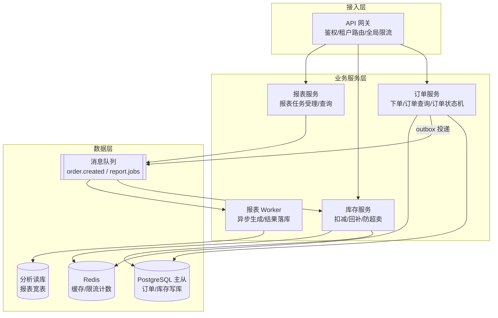
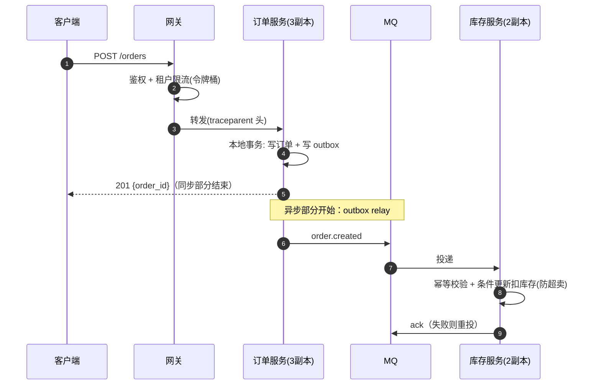
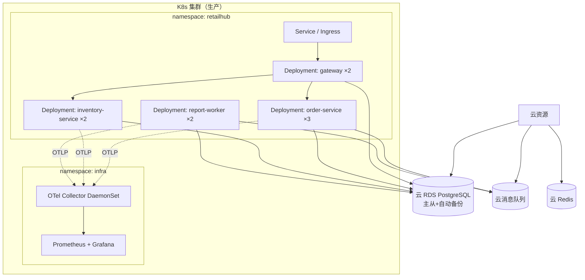
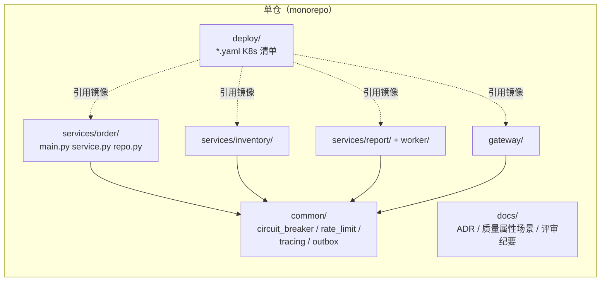

# 4+1 视图图集（模板）

> 视图是骨架：用五个视图把系统当前形态完整表达，且视图间互相一致。
> 验收：5 张图 mermaid 可渲染；场景视图能串联其余四视图；随机抽一个组件，
> 它在逻辑、物理、开发视图里都能找到对应物。
> 骨架已按 RetailHub 卷04 末态预填（卷05-2 §10.3），换成你的系统时替换节点即可。

## 1. 逻辑视图 —— 模块划分与职责

## 2. 进程视图 —— 关键链路的并发与异步

## 3. 物理视图 —— 部署拓扑

## 4. 开发视图 —— 代码组织

## 5. 场景视图（+1）—— 用一条关键用例串联验证

> 【填写：选一条最关键用例（如"下单"），用文字说明它如何穿越其余四视图。】

示例（下单）：进程视图的"下单"序列图同时穿越逻辑视图的模块（订单/库存/MQ）、
物理视图的节点（各 Deployment）、开发视图的代码边界（services/order → common/outbox）
——四视图一致。
