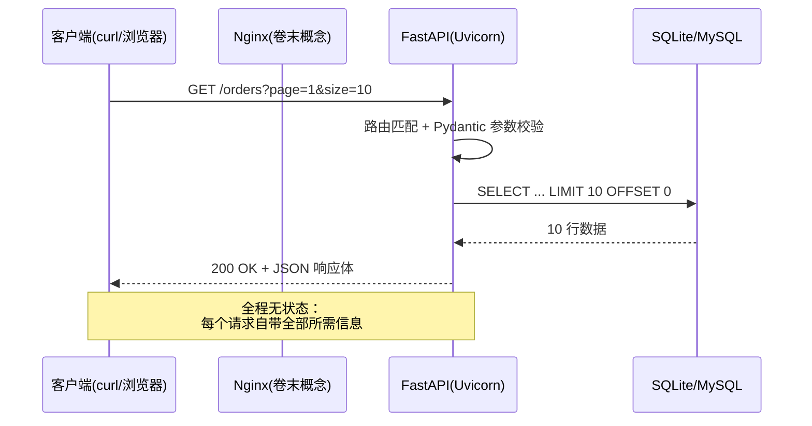
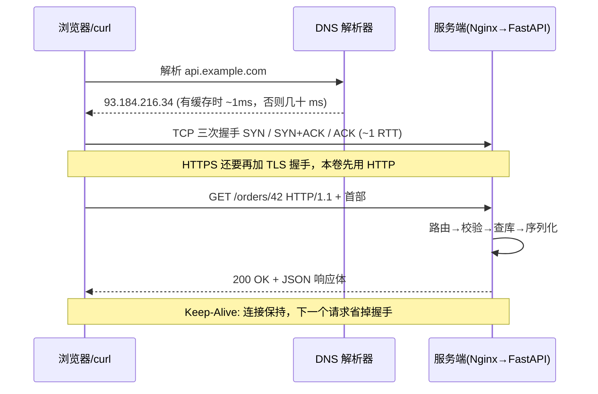
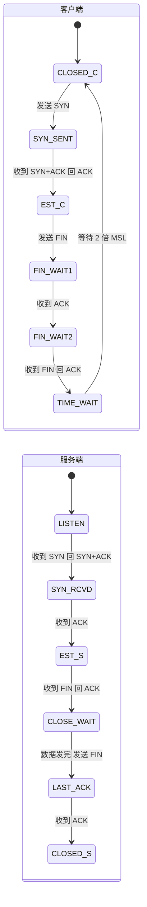
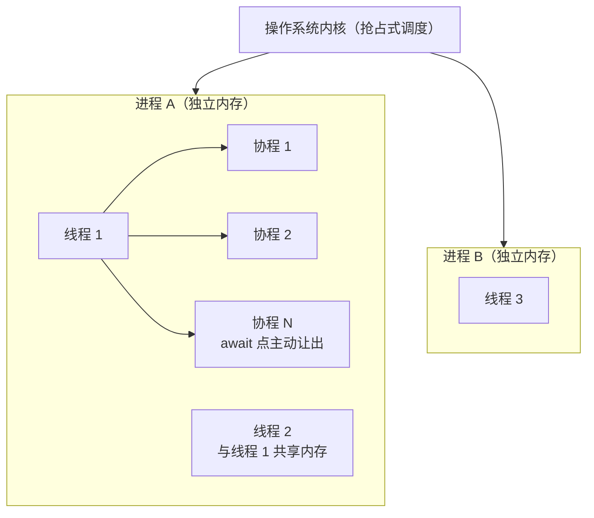
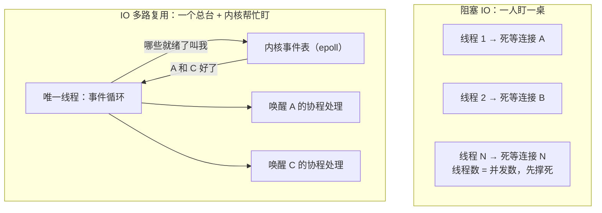
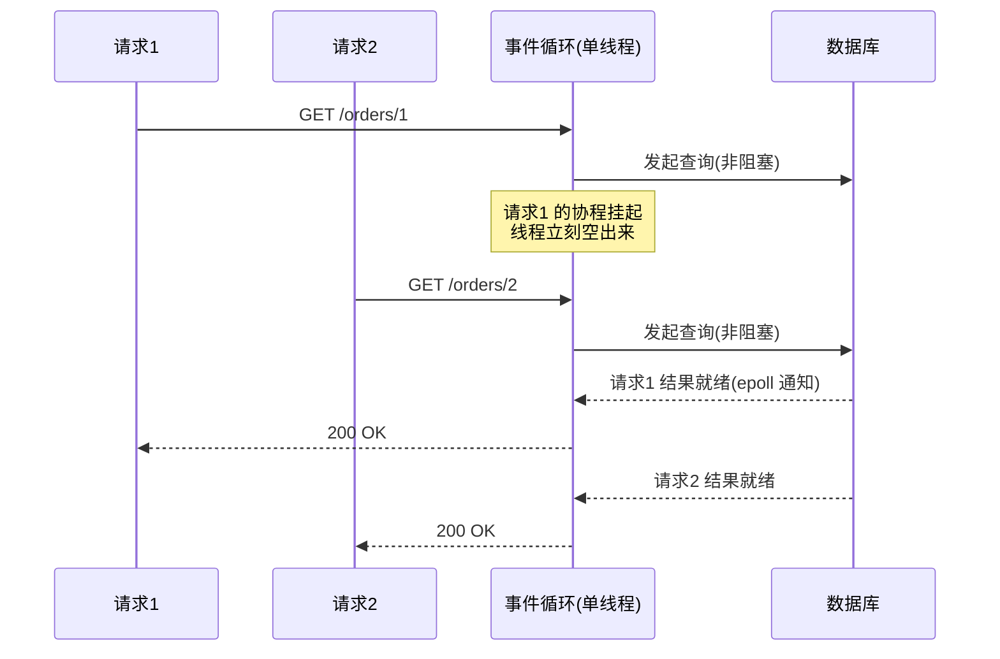

# 卷01-1：HTTP 与网络基础——看透一次请求的完整旅程

> 导语：这是整条路径的起点，项目还是一张白纸。本页要解决的问题很具体：**看透一次 HTTP 请求从发出到返回的完整旅程**——报文逐字段长什么样、状态码与幂等性为什么是救命概念、TCP 三次握手/四次挥手/TIME_WAIT 到底在等什么，以及 FastAPI 如何用进程/线程/协程与 IO 多路复用"同时"服务几千个请求。学完本页，你能徒手画出一次请求的完整时序图，并讲清一个 Uvicorn 进程为什么能扛住远超 CPU 核数的并发。如果你是完全零基础（连 Python 函数都写不利索），先回到 [篇00-1](篇00-1-基本功.md) 的第 2–4 节补齐环境/Python/SQL，再回到这里。

---

## 1. HTTP 协议的本质：一次请求-响应的全过程

### 1.1 HTTP 是什么（不是什么）

HTTP（HyperText Transfer Protocol）是**无状态的请求-响应协议**。拆开这三个词：

- **请求-响应**：客户端发一个请求，服务端回一个响应，一来一回，完毕。服务端不会主动找你（那是 WebSocket/SSE 的事，本卷不碰）。
- **无状态**：服务端**不记住**上一个请求是谁发的。你连续调两次 `GET /orders`，服务端眼里这是两个毫无关系的请求。所有的"登录态"都是客户端每次带着凭证（如 Token）重复证明"我是我"。这是后面卷04 会话管理、阶段九 Agent 长任务状态设计的总源头——**所有"状态"都是有人在某处显式存储的**。
- **协议**：只是约定了报文的格式。一个 HTTP 请求本质上就是一段文本：

```
POST /orders HTTP/1.1
Host: localhost:8000
Content-Type: application/json
Content-Length: 32

{"item_id": 1001, "quantity": 2}
```

这段报文值得逐行解剖，因为 HTTP 的所有"高级话题"（缓存、压缩、鉴权、跨域）最后都落在这些字段上：

- **请求行**：`POST /orders HTTP/1.1`——方法 + 路径 + 协议版本。网关和路由第一眼只看它。
- **首部（Headers）**：`Key: Value` 的清单，每一行都是客户端给服务端的"附加说明"。本卷你会频繁打交道的三个：
  - `Host`：目标主机。HTTP/1.1 强制要求——一台服务器可能托管多个站点（虚拟主机），没有它服务端不知道把请求交给谁。
  - `Content-Type`：请求体的格式。服务端靠它决定用什么解析器——`application/json` 走 JSON 解析，`application/x-www-form-urlencoded` 走表单解析。FastAPI 报 422 的相当一部分案例，就是客户端声明的 Content-Type 和实际发送的格式对不上。
  - `Content-Length`：请求体的字节数。TCP 是字节流、本身没有"消息边界"（见 1.5 节），服务端必须靠这个字段知道"读到哪儿算一条完整请求"；没有它就得用 `Transfer-Encoding: chunked` 分块传输。
- **空行 + 请求体**：空行是首部与正文的唯一分界；GET 通常没有请求体，参数全在 URL 的查询串里。

为什么要练"看透报文"？因为排查线上问题时，你能拿到的第一现场往往就是一段原始报文（浏览器 DevTools 的 Network 面板、网关日志、tcpdump 抓包）。**会读报文 = 会读案发现场。**本卷的 curl 练习请养成加 `-v` 的习惯，把往返报文看全。

### 1.2 状态码：服务端唯一的"表情系统"

状态码是服务端告诉客户端"事情办得怎么样"的唯一标准化通道。你只需要先记住这五档：

| 档位 | 含义 | 本卷会遇到的 | 记忆口诀 |
|---|---|---|---|
| 2xx | 成功 | 200 OK、201 Created | 办成了 |
| 3xx | 重定向 | 307（FastAPI 斜杠重定向） | 去别处 |
| 4xx | 客户端的错 | 400 参数错、404 不存在、422 校验失败 | 你错了 |
| 5xx | 服务端的错 | 500 内部错误 | 我错了 |

**新手最常犯的错**：什么都返回 200，把错误信息塞进响应体的 `"code": -1` 里。这会让监控、网关、前端全部失明——它们只看状态码。**软考考点：HTTP 状态码分类与含义是架构师考试网络与 Web 部分的常客。**

### 1.3 幂等性：一个会救你命的概念

幂等（Idempotent）：**同一个操作执行一次和执行 N 次，效果相同**。

| 方法 | 语义 | 幂等？ | 例子 |
|---|---|---|---|
| GET | 查询 | 是 | 查订单列表，查 10 次结果一样 |
| PUT | 整体替换 | 是 | 把订单地址改成 X，改 10 次还是 X |
| DELETE | 删除 | 是 | 删 10 次，订单都是"不存在" |
| POST | 创建/触发动作 | **否** | 创建订单调 10 次 = 创建 10 个订单 |

为什么重要？因为网络会抖。客户端发 POST 后超时了，它不知道服务端到底收没收到，重试一次——如果没有幂等设计，用户就被重复扣款了。本卷你只需要建立意识：**POST 不幂等，重试有代价**。具体解法（幂等键、唯一约束）在卷02、卷03 逐层展开。**这一点与 DDIA 反复强调的"可靠性"主题直接呼应：系统的容错设计要从"出错时会发生什么"倒推。**[^ddia-ch1]

### 1.4 一次请求的完整旅程



上面这张图聚焦在"请求进入应用之后"。把它再往前补全，一次请求在网络层的完整生命周期是这样的——注意 DNS 与 TCP 握手这两段，它们是**连接池与 Keep-Alive 存在的理由**：



**动手玩一玩**：下面是一个可在浏览器里直接交互的「HTTP 生命周期模拟器」。输入任意 URL 点「发送」，观察五个阶段各自的耗时与报文片段；再切换到「有缓存」模式重发一次，对比 DNS/TCP 几乎免费、服务端返回 304 省下响应体的差异——想一想：为什么真实系统里"建连"有时比"处理"还贵？

```demo http-lifecycle
```

**Demo 导学单**

1. 输入一个带路径和查询参数的 URL（如 `http://localhost:8000/orders?page=1`）点「发送」，记下五个阶段各自的耗时占比——哪个阶段最贵？它对应正文哪一段？
2. 切换到「有缓存」模式再发一次同一个 URL，对比 DNS 与 TCP 两段的耗时变化，回答：连接复用省下的到底是哪几笔钱？
3. 观察 304 响应与普通 200 响应的响应体差异，回答：缓存省下的到底是"时间"还是"流量"？还是两者都省？
4. 把两次发送的完整报文对照 1.1 节的"报文解剖"，逐字段认出请求行、首部和空行分界。

### 1.5 TCP 连接生命周期：握手、挥手与 TIME_WAIT

> 📌 本节学习预期：概念密度偏高，**第一遍只需理解结论**——"连接的建立与拆除是税，复用是免税"，以及 TIME_WAIT 是在等"补 ACK"和"迷途报文老死"两件事；状态机细节可在进入卷04 前再回来二刷。

HTTP 跑在 TCP 之上（HTTP/3 改走 QUIC，本卷不展开）。TCP 给 HTTP 提供三样东西：**可靠**（丢包自动重传）、**有序**（按发送顺序交付）、**面向连接**（通信前先要建立连接）。前两样的代价由操作系统内核替你付了，你无感；第三样的代价——**建立和拆除连接的开销**——会直接出现在你的接口延迟里，所以必须懂。

**三次握手：为什么是三次，不是两次也不是四次？**握手的本质是双方互相确认四件事：我的发送正常、你的接收正常、你的发送正常、我的接收正常。

- 如果只有两次：客户端发 SYN，服务端回 SYN+ACK 就算建立——但服务端永远无法确认"客户端能不能收到我的回包"。更危险的是"迷途的旧 SYN"：网络里滞留了一个几分钟前发出的 SYN，服务端收到后会为一个早已不存在的客户端白白开一条连接等资源耗尽。第三次 ACK 就是客户端的"活人证明"。
- 为什么不是四次：服务端的 SYN 和 ACK 可以合并在一个包里发，没有必要拆。

**四次挥手：为什么比握手多一次？**因为 TCP 是全双工的，两个方向要**各自独立关闭**。客户端说"我说完了"（FIN），服务端回 ACK——但此刻服务端可能还有没发完的数据，连接进入"半关闭"：客户端不能再说，服务端还能继续讲。等服务端也说完了（它的 FIN），客户端回最后的 ACK。握手时 SYN+ACK 能合并，挥手时 ACK 和 FIN 往往合并不了，所以多一次。

**TIME_WAIT：主动关闭方为什么要"罚站" 2 倍 MSL？**（MSL = 报文在网络里的最大存活时间，通常 30 秒~2 分钟）两个理由：① 最后一个 ACK 如果丢了，服务端会重发 FIN，TIME_WAIT 保证你还在、能补 ACK；② 让这条连接所有"迷途报文"都老死在网络里，不污染下一个使用相同四元组（源 IP/端口 + 目标 IP/端口）的新连接。高并发短连接场景下，服务器上几万个 TIME_WAIT 会吃光端口和内存——这正是 Keep-Alive 长连接和 4.2 节连接池的"经济学基础"：**连接的建立与拆除是税，复用是免税。**

把整条生命周期画成状态机（跟着 Demo 走一遍就记住了）：



**动手玩一玩**：下面的「TCP 握手与挥手状态机」可以一步步驱动上面这张图：点「下一步」逐个发出 SYN / SYN+ACK / ACK / FIN 报文，左右两块面板会同步高亮两端当前所处的状态；还可以看一个反例——如果握手只有两次，那条"迷途的旧 SYN"会造成什么后果。

```demo tcp-handshake
```

**Demo 导学单**

1. 点「下一步」走完三次握手，记录客户端和服务端各自经过的状态序列，和上面状态机图一一对上。
2. 进入挥手阶段后特别注意：服务端回完 ACK **没有**立刻发 FIN——中间这段"半关闭"窗口里，哪一方还能发数据？
3. 最后一端停在 TIME_WAIT 而不是直接 CLOSED，回答：它在等哪两件事？
4. 点「如果只有两次握手」反例场景，用自己的话说清"迷途的旧 SYN"为什么会骗服务端白开连接。

---

## 2. REST：用 URL 表达资源，用方法表达动作

REST 是一种接口设计约定，核心就两条：

1. **URL 是名词（资源），不是动词（动作）**：写 `GET /orders/42`，不写 `GET /getOrderById?id=42`。
2. **HTTP 方法是动词**：GET 查、POST 增、PUT/PATCH 改、DELETE 删。

| 不好的设计 | REST 设计 | 说明 |
|---|---|---|
| `GET /getOrders` | `GET /orders` | 查询用复数名词 + GET |
| `POST /createOrder` | `POST /orders` | 创建动作已在方法里 |
| `GET /orderDetail?id=42` | `GET /orders/42` | 单个资源用路径参数 |
| `POST /deleteOrder` | `DELETE /orders/42` | 删除用 DELETE |

进阶约定（本卷用到前两个）：集合过滤用查询参数（`GET /orders?status=paid`），分页用 `page/size` 或 `cursor`，版本演进放路径（`/v1/orders`）——版本问题在卷02 服务拆分后会真正咬人，现在先知道有这个坑。

---

## 3. FastAPI 实战基础

选 FastAPI 而不是 Flask/Django 的理由：类型提示驱动、自带参数校验（Pydantic）、自动生成交互式 API 文档（`/docs`）、异步支持——而异步正是后面所有 AI 推理调用（长时间等待 I/O）的基本功。

### 3.1 最小骨架：路由、校验、响应模型

```python
# app/main.py —— RetailHub v0.1 最小骨架
from fastapi import FastAPI, Query, HTTPException, Path
from pydantic import BaseModel

app = FastAPI(title="RetailHub", version="0.1.0")

# ---- 响应模型：出参的"合同" ----
class OrderItem(BaseModel):
    item_id: int
    name: str
    price: float
    quantity: int

class OrderDetail(BaseModel):
    order_id: int
    status: str
    created_at: str
    total_amount: float
    items: list[OrderItem]

# ---- 路由：GET /orders/{order_id} ----
@app.get("/orders/{order_id}", response_model=OrderDetail)
def get_order(order_id: int = Path(ge=1)) -> OrderDetail:
    row = query_order_from_db(order_id)      # 见第 4 节
    if row is None:
        raise HTTPException(status_code=404, detail="订单不存在")
    return OrderDetail(**row)

# ---- 分页参数：Query 校验 ----
@app.get("/orders")
def list_orders(
    page: int = Query(default=1, ge=1),
    size: int = Query(default=10, ge=1, le=100),
):
    items, total = query_orders_paged(page, size)
    return {"items": items, "total": total, "page": page, "size": size}
```

三个要点，每个都值一次坑：

- **`response_model` 是出参合同**：FastAPI 会用 Pydantic 过滤/校验返回值，多传的字段被裁掉，类型不对的会直接报错。这就是"契约优先"思想的最小形态——阶段九的 Task Contract、Output Contract 全是它的放大版。
- **校验失败自动返回 422**：参数不合法时框架替你拒绝，你的业务代码永远只见合法输入。
- **`HTTPException` 是业务错误的正确出口**：抛它，框架翻译成对应状态码；不要 `return {"error": ...}` 还挂着 200。

启动与验证：

```bash
pip install fastapi uvicorn
uvicorn app.main:app --reload --port 8000
# 浏览器打开 http://localhost:8000/docs —— 交互式文档，免费获得
```

### 3.2 进程、线程、协程：一台机器怎么"同时"服务很多人

先问为什么：你的服务器只有 4 个核，同一时刻 CPU 物理上只能执行 4 条指令流。但大促时同时在线的可能是 5000 个请求。**"同时服务很多人"从来不是靠"同时算"，而是靠"快速切换 + 等待时不闲着"。**围绕这个问题，工业界给出了三层抽象，你必须分清：

| 抽象 | 谁调度 | 切换成本 | 内存开销 | 隔离性 | 一句话类比 |
|---|---|---|---|---|---|
| 进程 Process | 操作系统内核 | 最贵（换地址空间、刷缓存） | 大（独立内存，几十 MB 起） | 最强，崩溃互不影响 | 各自独立的店铺 |
| 线程 Thread | 操作系统内核 | 中等（换寄存器和栈） | 中（每线程约 1–8 MB 栈） | 共享内存，一个野指针全完蛋 | 店铺里的多个店员 |
| 协程 Coroutine | **用户态代码自己**（事件循环） | 极便宜（≈ 一次函数调用） | 极小（KB 级） | 协作式：一个使坏全员卡死 | 一个店员同时照看多张桌子，谁上菜等得久就先招呼别人 |

三个必考点：

- **进程是资源的边界，线程是调度的边界。**Gunicorn/Uvicorn 起 4 个 worker，就是 4 个进程各扛一份流量——一个挂了其他还能活，这就是最朴素的"高可用"。
- **Python 线程有个特有的坑：GIL（全局解释器锁）。**同一时刻一个进程里只有一条线程能执行 Python 字节码，所以 Python 多线程做 CPU 密集计算**不会变快**；但线程在等 I/O 时会释放 GIL，所以 I/O 密集场景多线程仍然有用。要真并行计算，得多进程（或换语言扩展）。
- **协程是"协作式"的：它只在 `await` 点主动让出。**这带来两个直接后果：① 协程之间不需要锁（同一时刻只有一段协程代码在跑）；② 一段不放权的代码会卡死整个事件循环——在 `async def` 里写 `time.sleep(10)` 或一次同步的大计算，等于那个"照看多桌的店员"在一张桌子前睡着了，**全场所有请求陪葬**。这是异步代码最常见的事故，没有之一。

层级关系一图看清：



FastAPI 押注异步的理由至此就说透了：后端的典型负载（查库、调下游 API、等 AI 推理返回）**绝大部分时间在等 I/O，不在计算**。协程让"等待"几乎免费——一个线程挂起几千个等待中的协程，这就是为什么一个 Uvicorn 进程能扛住远超 4 核直觉的并发量。

### 3.3 IO 模型：阻塞、非阻塞与多路复用

协程能让出等待，那"谁负责发现等待结束了"？这就到了操作系统层面最经典的问题：**IO 模型**。服务员（你的程序）想知道"哪张桌子的菜好了"，有三种问法：

- **阻塞 IO**：调用 `read()`，没数据就整条线程挂起睡觉，直到数据到达。写法最简单，但**一个连接就要占一条线程**——1 万个并发连接 = 1 万条线程，内存和切换开销先把你压垮（这就是著名的 C10K 问题）。
- **非阻塞 IO**：调用 `read()` 立刻返回"还没好"，程序自己不停轮询每个连接。线程不睡了，但 CPU 全烧在无效的反复询问上，而且 N 个连接每轮要问 N 次系统调用。
- **IO 多路复用**：把"盯梢"的活外包给内核。程序一次性登记"我关心这些连接"，然后睡一觉；**哪个连接就绪了，内核来叫你**。早期接口是 `select`/`poll`（每次要把全量连接列表传给内核逐个检查，O(N)），Linux 的 `epoll` 在内核里维护关注列表、只回报告绪的连接（O(就绪数)）——这是 Nginx、Redis、Netty、Python asyncio 共同的地基。

三种模型的分工对照：



事件循环驱动协程的完整节奏——注意线程在"等待"期间从未闲着：



**动手玩一玩**：下面的「IO 模型对比模拟器」用同一批请求跑三种模式：阻塞单线程（请求排队串行）、多线程（并行但有切换成本）、IO 多路复用（单线程吃掉全部等待）。拉一拉请求数和 I/O 耗时，观察总耗时、线程数、上下文切换次数三组数字的变化。

```demo io-models
```

**Demo 导学单**

1. 用「阻塞单线程」跑 6 个请求记下总耗时；把请求数拉到 12 再跑一次——总耗时是线性翻倍吗？为什么？
2. 切到「多线程」模式，总耗时下降的同时，盯住"线程数"和"上下文切换"两笔代价——它们随并发数怎么涨？
3. 切到「IO 多路复用」，对比总耗时与阻塞模式的差距，回答：CPU 在"等待数据库"的那段时间里干什么去了？
4. 把 I/O 耗时拉到最小、计算耗时拉高，重跑三种模式：事件循环还领先吗？这解释了为什么 CPU 密集任务不适合 asyncio（对应 3.2 节 GIL 一段）。

---

## 参考与脚注

[^ddia-ch1]: Martin Kleppmann《数据密集型应用系统设计》（Designing Data-Intensive Applications，DDIA），第 1 章「可靠性、可伸缩性与可维护性」。

➡️ 下一页：卷01-2 · 数据库、部署与 RetailHub 实战
