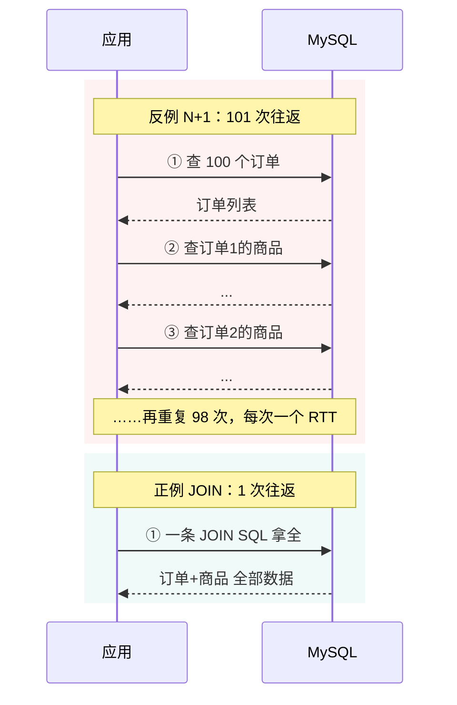
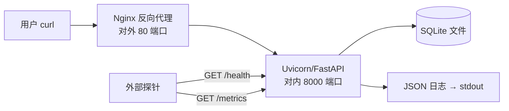

# 卷01-2：数据库与部署实战——把服务真正交付出来

> 导语：上一页你跟随一次请求走完了网络与并发的全程，这一页把它落到地上：**给 FastAPI 接上真正的数据库，并把服务部署成别人能跑起来的样子**。你将学会 SQLite 与 MySQL 的边界、连接池为什么是应用与数据库之间的"配额合同"、N+1 这个性能杀手的最小样本，以及结构化日志、最小监控、Git 协作与 Linux 部署这些"不出事没人夸、出事救你命"的基本功。本页包含卷01 的完整实战（RetailHub 演进第 1 步）与总验收清单——学完后，一个不看你屏幕的人，拿着你的 README 和 curl 命令清单，就能在自己机器上把服务跑起来并完成验收。

---

## 4. SQLite 与 MySQL：差异、连接池，以及 N+1

### 4.1 为什么先用 SQLite，以及它和 MySQL 的真实差异

SQLite 是**嵌入式数据库**：一个文件就是一个库，不需要装服务器。本卷用它，是因为现阶段"少一个组件就少一层干扰"。但你必须知道它和 MySQL 的边界在哪：

| 维度 | SQLite | MySQL |
|---|---|---|
| 部署形态 | 单个文件，随进程启动 | 独立服务进程，网络连接 |
| 并发写 | **同一时刻只有一个写者**（库级锁） | 行级锁，多连接并发写 |
| 连接方式 | 打开本地文件 | TCP 连接 + 账号密码 |
| 适用场景 | 单机、原型、边缘设备、测试 | 多用户在线服务 |
| 数据类型 | 弱类型（类型亲和性） | 强类型、严格约束 |

**结论：卷01 用 SQLite 是刻意简化，不是 SQLite 能替代 MySQL。**卷02 流量一上来，SQLite 的写锁就会成为全系统的咽喉，那时你会亲手把它换成 MySQL——这次替换本身就是一次架构演进演练。

### 4.2 连接与连接池

每来一个请求就新建数据库连接，是新手代码里最常见的隐形炸弹：建连有网络握手 + 认证开销（MySQL 尤为明显），高并发下数据库会被"建连"本身拖死。**连接池**的做法：预先建好一些连接放在池子里，请求来了借一个，用完还回去。

建一次 MySQL 连接到底有多贵？拆开看：**TCP 三次握手**（约 1 个 RTT，见 1.5 节）→ **MySQL 自己的认证握手**（交换账号密码、协商字符集与权限，再来 1~2 个 RTT）→ 服务端为这条连接**分配线程与会话内存**。同城机房一个 RTT 约 0.5ms，单次看很便宜——但每秒 1000 个请求就意味着每秒 1000 次完整的"建立→用一次→拆除"，数据库相当一部分 CPU 在反复办"入职离职手续"而不是干活。连接池把这笔成本**摊销**到整个进程生命周期：池里的连接长期存活，被成百上千个请求轮流借用。

池不是越大越好，它是应用与数据库之间的一份"配额合同"：

| 池子状态 | 可观测症状 | 含义 |
|---|---|---|
| 太小 | 请求排队等连接，延迟上涨，但数据库 CPU 很闲 | 瓶颈在池，不在库——扩池 |
| 太大 | 数据库连接数/内存顶满，切换剧增，整体反而更慢 | 数据库被"连接本身"拖垮 |
| 合适 | 数据库接近饱和之前，池基本不排队 | 配额与产能匹配 |

一个反直觉的经验：**池大小由"数据库吃得下多少并发"决定，而不是由"应用有多少并发请求"决定**——借不到连接的请求就该在池外排队，排队远比把数据库打垮便宜。卷02 大促压测时你会亲眼看到这条曲线。

```python
# app/db.py —— SQLite 版的数据访问层（含"借还"思想）
import sqlite3
from contextlib import contextmanager
from pathlib import Path

DB_PATH = Path(__file__).resolve().parent.parent / "retailhub.db"

def init_db() -> None:
    """建表 + 造演示数据，只在首次启动时执行。"""
    with get_conn() as conn:
        conn.executescript("""
        CREATE TABLE IF NOT EXISTS items(
            item_id INTEGER PRIMARY KEY, name TEXT NOT NULL,
            price REAL NOT NULL CHECK(price >= 0));
        CREATE TABLE IF NOT EXISTS orders(
            order_id INTEGER PRIMARY KEY, item_id INTEGER NOT NULL,
            quantity INTEGER NOT NULL, amount REAL NOT NULL,
            status TEXT NOT NULL DEFAULT 'paid',
            created_at TEXT NOT NULL,
            FOREIGN KEY(item_id) REFERENCES items(item_id));
        CREATE INDEX IF NOT EXISTS idx_orders_created ON orders(created_at);
        """)
        if conn.execute("SELECT COUNT(*) FROM items").fetchone()[0] == 0:
            conn.executemany(
                "INSERT INTO items VALUES(?,?,?)",
                [(1001, "保温杯", 89.0), (1002, "机械键盘", 349.0),
                 (1003, "人体工学椅", 1299.0)])
            conn.executemany(
                "INSERT INTO orders(item_id,quantity,amount,status,created_at)"
                " VALUES(?,?,?,?,?)",
                [(1001, 2, 178.0, "paid", "2025-06-01 10:00:00"),
                 (1002, 1, 349.0, "paid", "2025-06-01 11:30:00"),
                 (1003, 1, 1299.0, "refunded", "2025-06-02 09:15:00"),
                 (1001, 5, 445.0, "paid", "2025-06-02 14:00:00")])

@contextmanager
def get_conn():
    """上下文管理器：借连接、用完归还并提交/回滚——连接池思想的雏形。"""
    conn = sqlite3.connect(DB_PATH)
    conn.row_factory = sqlite3.Row          # 查询结果可按列名取值
    try:
        yield conn
        conn.commit()
    except Exception:
        conn.rollback()                      # 出错必须回滚，见第 6 节误区
        raise
    finally:
        conn.close()
```

注意 `CREATE INDEX` 那一行：按日期汇总 GMV 是 `WHERE created_at BETWEEN ... GROUP BY ...`，没有索引就是全表扫描。现在 4 行数据无所谓，卷03 讲存储引擎时你会明白这个索引到底买来了什么。**（这正对应"数据库如何找到你要的数据"这个入口问题。[^ddia-ch3]）**

### 4.3 N+1 问题：性能杀手的最小样本

需求是"订单详情含商品信息"。两种写法：

```python
# 反例：N+1。先查 1 次订单列表，再循环里每单查 1 次商品 → N+1 次查询
for order in orders:                       # 查询 1：拿到 100 个订单
    item = get_item(order["item_id"])      # 查询 2~101：循环里逐条查

# 正例：一次 JOIN 搞定
SQL = """
SELECT o.order_id, o.status, o.created_at, o.amount AS total_amount,
       i.item_id, i.name, i.price, o.quantity
FROM orders o JOIN items i ON i.item_id = o.item_id
WHERE o.order_id = ?
"""
```

N+1 的危害不在次数本身，而在**每次查询都有一次网络往返**（SQLite 是函数调用所以感觉不明显——这正是 SQLite 教学的局限，MySQL 下 100 次往返就是几十上百毫秒）。识别口诀：**只要循环里出现数据库查询，就要警惕 N+1**。卷03 讲分区与分布式查询时，这个问题会以"跨节点 JOIN 放大"的形态再出现一次。

两种写法的请求模式对比，一眼看清差距：



---

## 5. 日志与最简单的监控

### 5.1 日志：出事时你唯一的证人

新手用 `print`，工程用结构化日志。区别在：日志带**时间、级别、位置、结构化字段**，能被收集、检索、告警。

```python
# app/logging_config.py —— 最小可用的结构化日志
import logging, json, time

class JsonFormatter(logging.Formatter):
    def format(self, record: logging.LogRecord) -> str:
        payload = {
            "ts": round(record.created, 3),
            "level": record.levelname,
            "logger": record.name,
            "msg": record.getMessage(),
        }
        if hasattr(record, "extra"):
            payload.update(record.extra)     # 业务字段：order_id、耗时等
        return json.dumps(payload, ensure_ascii=False)

def setup_logging() -> logging.Logger:
    logger = logging.getLogger("retailhub")
    logger.setLevel(logging.INFO)
    handler = logging.StreamHandler()
    handler.setFormatter(JsonFormatter())
    logger.handlers = [handler]
    return logger

# 在路由里这样用：
# logger.info("order detail", extra={"extra": {"order_id": oid, "cost_ms": ms}})
```

三个约定：① 级别语义——DEBUG 调试、INFO 关键业务事件、WARNING 可疑、ERROR 失败；② **绝不打敏感信息**（密码、token、完整身份证）；③ 每次请求打一条"访问日志"（方法、路径、状态码、耗时），这是最低成本的可观测性。

### 5.2 监控的最小集

本卷只要求两个端点，但它们是一切可观测性的种子：

- `GET /health`：进程活着吗？返回 `{"status": "ok"}`。将来 K8s 的存活探针（卷04）探的就是它。
- `GET /metrics`：最简指标——累计请求数、累计错误数、平均耗时。自己用一个 dict 计数即可，先建立"指标是被暴露出来、由外部抓取的"这个心智模型；卷04 会换成 Prometheus，概念完全平移。



---

## 6. Git 协作基本功

即使一个人写，也按协作标准来——这是习惯不是流程。最小命令集：

```bash
git init && git add -A && git commit -m "feat: 订单/商品查询服务 v0.1"
git checkout -b feature/gmv-summary      # 每个功能一个分支
# ...写代码...
git add -p                                # 逐块审视自己要提交什么
git commit -m "feat: 按日期汇总 GMV 端点"
git checkout main && git merge feature/gmv-summary
git log --oneline --graph                 # 看懂自己的历史
```

约定：commit message 用 `feat/fix/docs/refactor:` 前缀，一句话说清"做了什么"，不做的事不写进同一次提交；`.gitignore` 至少包含 `__pycache__/`、`*.db`、`.venv/`；**数据库文件、密钥、虚拟环境永远不进仓库**。

---

## 7. Linux 部署最小集（概念级）

你的服务最终要跑在一台没有 VS Code、会重启的 Linux 机器上。两个概念先建立：

- **systemd**：Linux 的"进程管家"。你写一个 `.service` 文件声明"启动命令、工作目录、崩溃后自动拉起、开机自启"，从此 `systemctl start retailhub` 一条命令管理服务，机器重启服务自动回来。没有它，你的服务就是一个 SSH 窗口一关就死的 `python main.py`。
- **Nginx 反向代理**：站在 FastAPI 前面的"门卫"。对外统一 80/443 端口、处理 HTTPS 证书、做访问日志和限流，把请求转发给内部的 8000 端口。为什么要这层？因为 FastAPI 专注业务，Nginx 专注网络——**关注点分离**，这个思想在卷04 会放大成整个微服务网关层。

再加一组"出问题时你的第一套工具"。服务器上没有图形界面，排查全靠命令，本卷先混个脸熟：

| 命令 | 干什么 | 典型场景 |
|---|---|---|
| `top` / `htop` | 看 CPU/内存谁在吃 | 接口变慢，先看机器是不是满了 |
| `ps aux \| grep uvicorn` | 找进程 | 服务还在吗？起了几个 worker？ |
| `ss -lntp` | 看端口监听与占用 | 进程活着但 8000 没监听 → 地址绑错了 |
| `tail -f app.log` | 追着日志实时看 | 复现问题时盯着报错出现 |
| `curl -v` | 看完整请求/响应报文 | 对应 1.1 节：直接读案发现场 |
| `chmod` / `chown` | 修权限与属主 | 部署后写不了日志文件，十有八九是属主不对 |

**为什么把命令列进教程**：你未来 80% 的线上排查路径都是"`top` 看资源 → `ss` 看端口 → `tail` 看日志 → `curl` 复现"这四步的排列组合。卷04 进了容器和 K8s，它们会换上 `kubectl top / logs / exec` 的马甲重新出现——套路不变。

本卷不要求真配一遍 systemd 和 Nginx，但验收标准要求你能在纸上画出第 5 节那张部署图。

---

## 8. 本卷实战：RetailHub 演进第 1 步

**背景**：零售品牌"RetailHub"需要最基础的经营查询能力。你是唯一的工程师，交付一个单机查询服务。

按下面的递进步骤做，每一步都有独立的验收标准——**任何一步验收不过，不进入下一步**。

**步骤 1：建库与种子数据**

- 目标：有 `retailhub.db`，含 `items`/`orders` 两张表和够用的演示数据。
- 操作：按第 4.2 节的 `init_db` 建表，把演示订单扩充到 ≥20 条（跨 3 天以上，含 `paid`/`refunded` 两种状态），执行 `python -c "from app.db import init_db; init_db()"`。
- 验收标准：`sqlite3 retailhub.db "SELECT COUNT(*), MIN(created_at), MAX(created_at) FROM orders;"` 返回行数 ≥20 且日期跨度 ≥3 天。

**步骤 2：订单列表与详情端点**

- 目标：`GET /orders` 分页列表与 `GET /orders/{order_id}` 详情（JOIN 出商品名称与单价）可用，参数校验与 404 行为正确。
- 操作：按第 3 节骨架实现，启动后先在 `/docs` 里点通，再用 curl 验证异常分支。
- 验收标准：正常分页返回 `items/total/page/size`；`page=0` 返回 422；存在的 id 返回含 `name` 与 `price`；不存在的 id 返回 404 且响应体是 JSON 而非 HTML 报错页。

**步骤 3：GMV 汇总端点与第一条 ADR**

- 目标：`GET /stats/gmv?start=&end=` 按日期返回每天 `date / order_count / gmv`（`SUM(amount)`），`refunded` 订单不计入 GMV——**这是你的第一条"指标口径"决策，写一条 200 字 ADR 记录它**。
- 操作：核心 SQL 骨架如下，包进路由并加出参模型：

```sql
SELECT substr(created_at, 1, 10) AS date,
       COUNT(*) AS order_count,
       ROUND(SUM(amount), 2) AS gmv
FROM orders
WHERE status != 'refunded'
  AND created_at >= :start AND created_at < :end
GROUP BY substr(created_at, 1, 10)
ORDER BY date;
```

- 验收标准：挑一天用 sqlite3 CLI 手工核算，接口返回值与手工结果一致，且 refunded 订单确实被排除。

**步骤 4：结构化日志与健康检查**

- 目标：每个请求输出一条 JSON 访问日志（方法、路径、状态码、耗时）；`GET /health` 返回 `{"status":"ok"}`。
- 操作：按第 5.1 节配置 `JsonFormatter`，用一个中间件或在路由依赖里记录耗时。
- 验收标准：连续发 5 个请求，终端出现 5 条合法 JSON 日志，每条含路径与耗时字段。

**步骤 5：工程收尾（目录、Git、README）**

- 目标：目录结构如下，代码 git 入库，README 能让陌生人原样跑通：

```
retailhub/
├── app/
│   ├── main.py            # 路由 + Pydantic 模型
│   ├── db.py              # 连接管理 + 建表 + 种子数据
│   └── logging_config.py  # 结构化日志
├── requirements.txt
├── .gitignore
├── docs/adr/0001-gmv-exclude-refunded.md
└── README.md              # 启动步骤 + 验收命令
```

- 验收标准：另建一个干净虚拟环境，严格按 README 的步骤能拉起服务并通过步骤 2 的 curl 验证。

### AI Coding 实操模式

本卷练习适合"AI 起草 + 你评审"的模式，下面是可直接复制的提示词模板：

```
你是一名资深 FastAPI 工程师。我在完成学习项目 RetailHub v0.1（Python 3.11 + FastAPI + SQLite），
请按以下约束生成代码，不要引入额外依赖：
- 目录结构：app/main.py（路由 + Pydantic 模型）、app/db.py（连接管理 + 建表 + 种子数据）、
  app/logging_config.py（JSON 结构化日志）
- 端点：GET /orders（page/size 分页，page≥1，1≤size≤100，返回 items/total/page/size）、
  GET /orders/{id}（JOIN items 出商品名与单价，不存在返回 404）、
  GET /stats/gmv?start=&end=（按天汇总，排除 status='refunded' 的订单）
- 要求：用 response_model 声明出参；查询参数用 Query 校验；业务错误一律 HTTPException；
  每个请求输出一条 JSON 访问日志（方法、路径、状态码、耗时）；/health 返回 {"status":"ok"}
- 种子数据：≥20 条订单，跨 3 天以上，含 paid/refunded 两种状态
请先给出文件清单与关键设计决策，再逐文件输出完整代码。
```

**AI 生成初版后的人工评审清单**（逐条过，别跳）：

1. 逐行读 `db.py` 的连接管理：异常路径有没有 `rollback`，`finally` 里有没有 `close`？（对照第 6 节误区 4）
2. 全文搜索 `return {`：是否存在"200 + 错误字段"的伪错误返回？所有业务错误必须走 `HTTPException`。
3. 异常分支不能只看不测：用 curl 实际打出一次 404 和一次 422，确认响应体不是 HTML。
4. GMV 口径对账：挑一天用 sqlite3 CLI 手工核算，确认 refunded 被排除——AI 经常"忘了"这个业务约束。
5. `git status` 检查：`.db` 文件、`.venv/`、`__pycache__/` 有没有被跟踪？
6. 让 AI 逐处解释它生成的代码里哪里该用 `async def`、哪里不该，以及为什么（回 3.2/3.3 节自答）——**它答不清或你听不懂的地方，就是你要补的课，别放过。**

**AI Coding 验收标准**：上面的总验收 checklist 全部打勾，且 AI 生成代码的每一行你都能向"空气面试官"讲清用途；讲不清的行，要么改到你懂，要么删掉。

**总验收标准（checkbox，全部满足才算过）**：

- [ ] `curl "http://localhost:8000/orders?page=1&size=5"` 返回分页结构与正确的 total
- [ ] `curl http://localhost:8000/orders/1` 返回的 JSON 里包含商品 `name` 与 `price`
- [ ] `curl http://localhost:8000/orders/99999` 返回 404 且响应体不是 HTML 报错页
- [ ] `curl "http://localhost:8000/orders?page=0"` 返回 422
- [ ] `curl "http://localhost:8000/stats/gmv?start=2025-06-01&end=2025-06-03"` 按天分组、gmv 数值与手工 SQL 核算一致、不含 refunded 订单
- [ ] `curl http://localhost:8000/health` 返回 `{"status":"ok"}`
- [ ] 每次请求在终端输出一条 JSON 访问日志，含路径与耗时
- [ ] `git log --oneline` 至少 3 次有意义的提交，仓库中无 `.db` 文件
- [ ] README 里的启动步骤在一台干净虚拟环境中可原样跑通
- [ ] `docs/adr/0001` 记录了 GMV 口径决策

---

## 9. 常见误区

1. **一切错误都返回 200**：错误码塞进响应体自定义字段。监控和前端全部失明，问题永远发现得太晚。
2. **在循环里查数据库（N+1 不自知）**：本地 4 条数据测不出来，上线后随数据量线性恶化。
3. **把 SQLite 当 MySQL 用**：上线后并发写直接锁库报错；本卷用 SQLite 是学习简化，不是选型结论。
4. **异常时不回滚事务**：一次失败后连接里挂着半个事务，后续写入全乱。`try/except/rollback/finally/close` 缺一不可。
5. **用 print 当日志**：没有时间、没有级别、不能关闭，出问题等于裸奔。
6. **把数据库文件提交进 Git**：仓库膨胀、数据泄露风险、多人协作必然冲突。
7. **URL 里写动词**（`/getOrderList`）：接口一多就乱成一锅粥，REST 的约束是帮你管理复杂度的。
8. **在 async 路由里写同步阻塞代码**：一个 `time.sleep` 或同步大计算卡死整个事件循环，全场请求陪葬（见 3.2 节）。要么用 `asyncio.sleep` 与非阻塞库，要么把重活交给线程池。

## 10. 自测清单

不看教程回答或完成以下 10 项，全部通过才可进入卷02：

- [ ] 画出一次 HTTP 请求从 curl 到数据库再返回的完整时序（不看书）
- [ ] 解释 404 / 422 / 500 的含义与各自该由谁负责
- [ ] 说出 GET/POST/PUT/DELETE 中哪个不幂等，以及重试会带来什么后果
- [ ] 解释三次握手为什么不能是两次、四次挥手为什么比握手多一次、TIME_WAIT 在等什么
- [ ] 说出 REST 的两条核心约定，并把 `POST /createNewOrder` 改成 REST 风格
- [ ] 解释 `response_model` 的作用和"契约"的含义
- [ ] 说出进程/线程/协程的三组差异（谁调度、切换成本、隔离性），以及 GIL 对 Python 多线程意味着什么
- [ ] 说清阻塞/非阻塞/IO 多路复用三种模型的差别，以及 epoll 比 select 省在哪
- [ ] 说出 SQLite 与 MySQL 在并发写上的本质差异，用自己的话解释连接池解决什么问题、池该多大
- [ ] 解释 N+1 问题的成因与 JOIN 解法；说出结构化日志比 print 多出的三个关键能力；说出 systemd 和 Nginx 各自解决什么问题

## 参考与脚注

[^ddia-ch3]: Martin Kleppmann《数据密集型应用系统设计》（DDIA），第 3 章「存储与检索」。

## 下卷预告

[卷02《服务端架构演进》](卷02-1-缓存与读写分离.md)：你的 RetailHub 火了，老板模拟了一次"大促流量"。你将亲手撞上单体的一切天花板——慢查询拖垮全站、刚下的订单查不到、一个模块挂掉全站陪葬。为了活下来，你将引入缓存、消息队列、读写分离，并做出第一次服务拆分。每一个今天觉得"没必要"的组件，卷02 都会让你体会到"没它不行"。

➡️ 下一页：卷02-1 · 缓存、读写分离与分库分表
