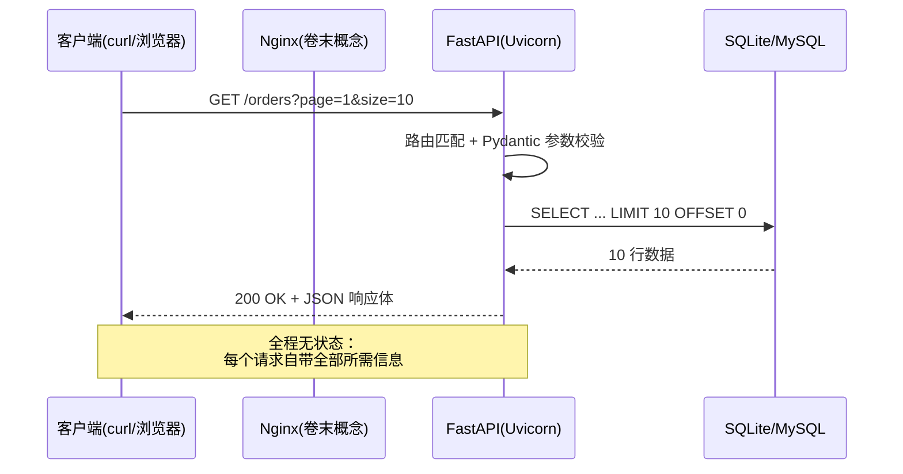
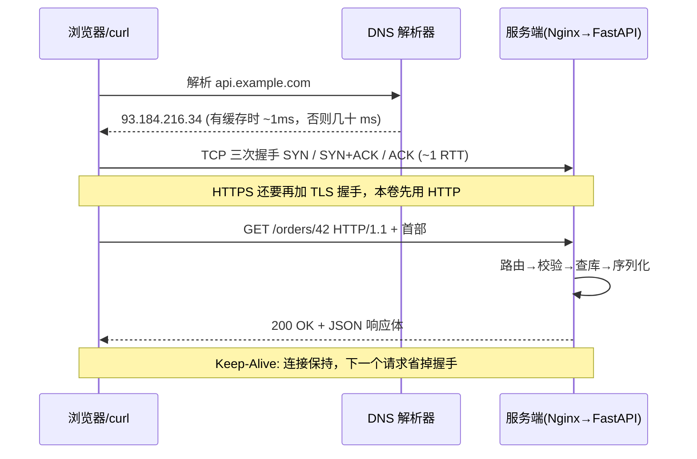
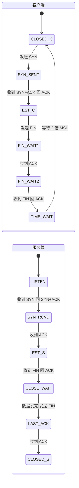
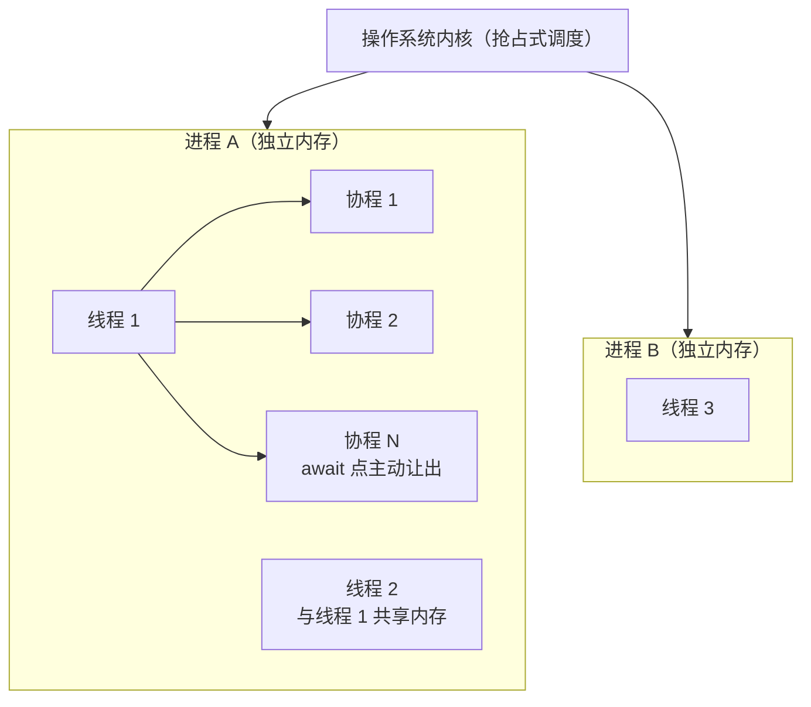
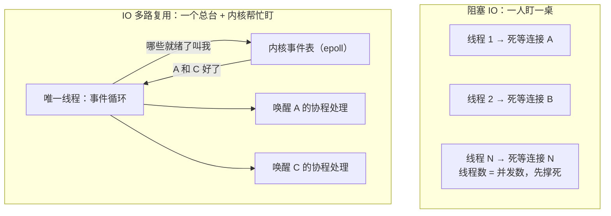
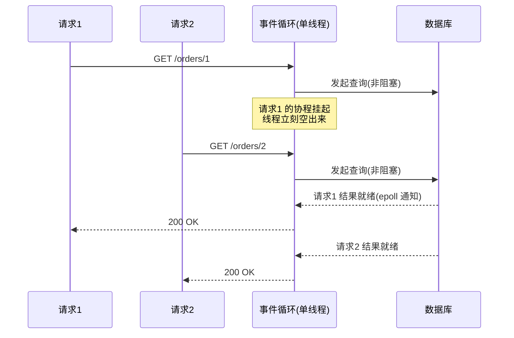
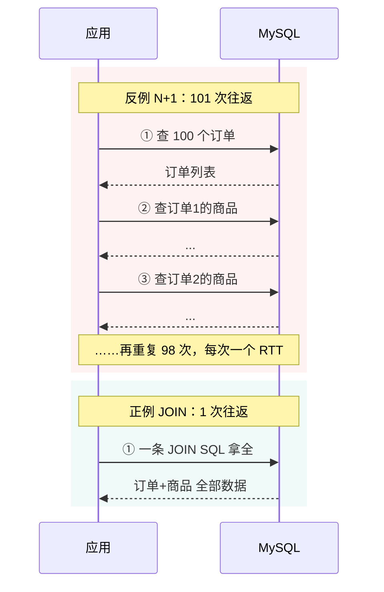
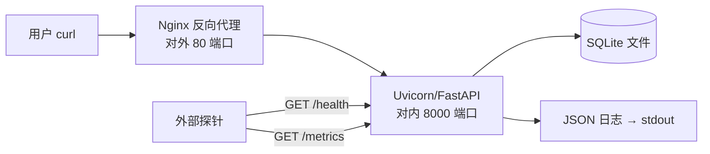

# 卷01：服务端筑基——把"会写 Python"变成"能交付一个服务"

> 导语：这是整条路径的起点，项目还是一张白纸。本卷要解决的问题很具体：**你能不能用 FastAPI + SQLite 写出一个真正能跑的零售查询服务**，并且理解它每一层在干什么。这一阶段不追求任何"高级感"——没有缓存、没有微服务、没有中间件，因为卷02 的每一次架构演进都必须建立在你对单体痛点的亲身体会上。本卷的终点判据：一个不看你屏幕的人，拿着你的 README 和 curl 命令清单，能在自己机器上把服务跑起来并完成验收。如果你是完全零基础（连 Python 函数都写不利索），先回到 `篇00-小白前置篇.md` 的第 1–3 节补齐 Python/SQL，再回到这里。

---

## 1. HTTP 协议的本质：一次请求-响应的全过程

### 1.1 HTTP 是什么（不是什么）

HTTP（HyperText Transfer Protocol）是**无状态的请求-响应协议**。拆开这三个词：

- **请求-响应**：客户端发一个请求，服务端回一个响应，一来一回，完毕。服务端不会主动找你（那是 WebSocket/SSE 的事，本卷不碰）。
- **无状态**：服务端**不记住**上一个请求是谁发的。你连续调两次 `GET /orders`，服务端眼里这是两个毫无关系的请求。所有的"登录态"都是客户端每次带着凭证（如 Token）重复证明"我是我"。这是后面卷04 会话管理、阶段九 Agent 长任务状态设计的总源头——**所有"状态"都是有人在某处显式存储的**。
- **协议**：只是约定了报文的格式。一个 HTTP 请求本质上就是一段文本：

```
POST /orders HTTP/1.1
Host: localhost:8000
Content-Type: application/json
Content-Length: 32

{"item_id": 1001, "quantity": 2}
```

这段报文值得逐行解剖，因为 HTTP 的所有"高级话题"（缓存、压缩、鉴权、跨域）最后都落在这些字段上：

- **请求行**：`POST /orders HTTP/1.1`——方法 + 路径 + 协议版本。网关和路由第一眼只看它。
- **首部（Headers）**：`Key: Value` 的清单，每一行都是客户端给服务端的"附加说明"。本卷你会频繁打交道的三个：
  - `Host`：目标主机。HTTP/1.1 强制要求——一台服务器可能托管多个站点（虚拟主机），没有它服务端不知道把请求交给谁。
  - `Content-Type`：请求体的格式。服务端靠它决定用什么解析器——`application/json` 走 JSON 解析，`application/x-www-form-urlencoded` 走表单解析。FastAPI 报 422 的相当一部分案例，就是客户端声明的 Content-Type 和实际发送的格式对不上。
  - `Content-Length`：请求体的字节数。TCP 是字节流、本身没有"消息边界"（见 1.5 节），服务端必须靠这个字段知道"读到哪儿算一条完整请求"；没有它就得用 `Transfer-Encoding: chunked` 分块传输。
- **空行 + 请求体**：空行是首部与正文的唯一分界；GET 通常没有请求体，参数全在 URL 的查询串里。

为什么要练"看透报文"？因为排查线上问题时，你能拿到的第一现场往往就是一段原始报文（浏览器 DevTools 的 Network 面板、网关日志、tcpdump 抓包）。**会读报文 = 会读案发现场。**本卷的 curl 练习请养成加 `-v` 的习惯，把往返报文看全。

### 1.2 状态码：服务端唯一的"表情系统"

状态码是服务端告诉客户端"事情办得怎么样"的唯一标准化通道。你只需要先记住这五档：

| 档位 | 含义 | 本卷会遇到的 | 记忆口诀 |
|---|---|---|---|
| 2xx | 成功 | 200 OK、201 Created | 办成了 |
| 3xx | 重定向 | 307（FastAPI 斜杠重定向） | 去别处 |
| 4xx | 客户端的错 | 400 参数错、404 不存在、422 校验失败 | 你错了 |
| 5xx | 服务端的错 | 500 内部错误 | 我错了 |

**新手最常犯的错**：什么都返回 200，把错误信息塞进响应体的 `"code": -1` 里。这会让监控、网关、前端全部失明——它们只看状态码。**软考考点：HTTP 状态码分类与含义是架构师考试网络与 Web 部分的常客。**

### 1.3 幂等性：一个会救你命的概念

幂等（Idempotent）：**同一个操作执行一次和执行 N 次，效果相同**。

| 方法 | 语义 | 幂等？ | 例子 |
|---|---|---|---|
| GET | 查询 | 是 | 查订单列表，查 10 次结果一样 |
| PUT | 整体替换 | 是 | 把订单地址改成 X，改 10 次还是 X |
| DELETE | 删除 | 是 | 删 10 次，订单都是"不存在" |
| POST | 创建/触发动作 | **否** | 创建订单调 10 次 = 创建 10 个订单 |

为什么重要？因为网络会抖。客户端发 POST 后超时了，它不知道服务端到底收没收到，重试一次——如果没有幂等设计，用户就被重复扣款了。本卷你只需要建立意识：**POST 不幂等，重试有代价**。具体解法（幂等键、唯一约束）在卷02、卷03 逐层展开。**这一点与 DDIA 反复强调的"可靠性"主题直接呼应：系统的容错设计要从"出错时会发生什么"倒推。**[^ddia-ch1]

### 1.4 一次请求的完整旅程



上面这张图聚焦在"请求进入应用之后"。把它再往前补全，一次请求在网络层的完整生命周期是这样的——注意 DNS 与 TCP 握手这两段，它们是**连接池与 Keep-Alive 存在的理由**：



**动手玩一玩**：下面是一个可在浏览器里直接交互的「HTTP 生命周期模拟器」。输入任意 URL 点「发送」，观察五个阶段各自的耗时与报文片段；再切换到「有缓存」模式重发一次，对比 DNS/TCP 几乎免费、服务端返回 304 省下响应体的差异——想一想：为什么真实系统里"建连"有时比"处理"还贵？

```demo http-lifecycle
```

**Demo 导学单**

1. 输入一个带路径和查询参数的 URL（如 `http://localhost:8000/orders?page=1`）点「发送」，记下五个阶段各自的耗时占比——哪个阶段最贵？它对应正文哪一段？
2. 切换到「有缓存」模式再发一次同一个 URL，对比 DNS 与 TCP 两段的耗时变化，回答：连接复用省下的到底是哪几笔钱？
3. 观察 304 响应与普通 200 响应的响应体差异，回答：缓存省下的到底是"时间"还是"流量"？还是两者都省？
4. 把两次发送的完整报文对照 1.1 节的"报文解剖"，逐字段认出请求行、首部和空行分界。

### 1.5 TCP 连接生命周期：握手、挥手与 TIME_WAIT

HTTP 跑在 TCP 之上（HTTP/3 改走 QUIC，本卷不展开）。TCP 给 HTTP 提供三样东西：**可靠**（丢包自动重传）、**有序**（按发送顺序交付）、**面向连接**（通信前先要建立连接）。前两样的代价由操作系统内核替你付了，你无感；第三样的代价——**建立和拆除连接的开销**——会直接出现在你的接口延迟里，所以必须懂。

**三次握手：为什么是三次，不是两次也不是四次？**握手的本质是双方互相确认四件事：我的发送正常、你的接收正常、你的发送正常、我的接收正常。

- 如果只有两次：客户端发 SYN，服务端回 SYN+ACK 就算建立——但服务端永远无法确认"客户端能不能收到我的回包"。更危险的是"迷途的旧 SYN"：网络里滞留了一个几分钟前发出的 SYN，服务端收到后会为一个早已不存在的客户端白白开一条连接等资源耗尽。第三次 ACK 就是客户端的"活人证明"。
- 为什么不是四次：服务端的 SYN 和 ACK 可以合并在一个包里发，没有必要拆。

**四次挥手：为什么比握手多一次？**因为 TCP 是全双工的，两个方向要**各自独立关闭**。客户端说"我说完了"（FIN），服务端回 ACK——但此刻服务端可能还有没发完的数据，连接进入"半关闭"：客户端不能再说，服务端还能继续讲。等服务端也说完了（它的 FIN），客户端回最后的 ACK。握手时 SYN+ACK 能合并，挥手时 ACK 和 FIN 往往合并不了，所以多一次。

**TIME_WAIT：主动关闭方为什么要"罚站" 2 倍 MSL？**（MSL = 报文在网络里的最大存活时间，通常 30 秒~2 分钟）两个理由：① 最后一个 ACK 如果丢了，服务端会重发 FIN，TIME_WAIT 保证你还在、能补 ACK；② 让这条连接所有"迷途报文"都老死在网络里，不污染下一个使用相同四元组（源 IP/端口 + 目标 IP/端口）的新连接。高并发短连接场景下，服务器上几万个 TIME_WAIT 会吃光端口和内存——这正是 Keep-Alive 长连接和 4.2 节连接池的"经济学基础"：**连接的建立与拆除是税，复用是免税。**

把整条生命周期画成状态机（跟着 Demo 走一遍就记住了）：



**动手玩一玩**：下面的「TCP 握手与挥手状态机」可以一步步驱动上面这张图：点「下一步」逐个发出 SYN / SYN+ACK / ACK / FIN 报文，左右两块面板会同步高亮两端当前所处的状态；还可以看一个反例——如果握手只有两次，那条"迷途的旧 SYN"会造成什么后果。

```demo tcp-handshake
```

**Demo 导学单**

1. 点「下一步」走完三次握手，记录客户端和服务端各自经过的状态序列，和上面状态机图一一对上。
2. 进入挥手阶段后特别注意：服务端回完 ACK **没有**立刻发 FIN——中间这段"半关闭"窗口里，哪一方还能发数据？
3. 最后一端停在 TIME_WAIT 而不是直接 CLOSED，回答：它在等哪两件事？
4. 点「如果只有两次握手」反例场景，用自己的话说清"迷途的旧 SYN"为什么会骗服务端白开连接。

---

## 2. REST：用 URL 表达资源，用方法表达动作

REST 是一种接口设计约定，核心就两条：

1. **URL 是名词（资源），不是动词（动作）**：写 `GET /orders/42`，不写 `GET /getOrderById?id=42`。
2. **HTTP 方法是动词**：GET 查、POST 增、PUT/PATCH 改、DELETE 删。

| 不好的设计 | REST 设计 | 说明 |
|---|---|---|
| `GET /getOrders` | `GET /orders` | 查询用复数名词 + GET |
| `POST /createOrder` | `POST /orders` | 创建动作已在方法里 |
| `GET /orderDetail?id=42` | `GET /orders/42` | 单个资源用路径参数 |
| `POST /deleteOrder` | `DELETE /orders/42` | 删除用 DELETE |

进阶约定（本卷用到前两个）：集合过滤用查询参数（`GET /orders?status=paid`），分页用 `page/size` 或 `cursor`，版本演进放路径（`/v1/orders`）——版本问题在卷02 服务拆分后会真正咬人，现在先知道有这个坑。

---

## 3. FastAPI 实战基础

选 FastAPI 而不是 Flask/Django 的理由：类型提示驱动、自带参数校验（Pydantic）、自动生成交互式 API 文档（`/docs`）、异步支持——而异步正是后面所有 AI 推理调用（长时间等待 I/O）的基本功。

### 3.1 最小骨架：路由、校验、响应模型

```python
# app/main.py —— RetailHub v0.1 最小骨架
from fastapi import FastAPI, Query, HTTPException, Path
from pydantic import BaseModel

app = FastAPI(title="RetailHub", version="0.1.0")

# ---- 响应模型：出参的"合同" ----
class OrderItem(BaseModel):
    item_id: int
    name: str
    price: float
    quantity: int

class OrderDetail(BaseModel):
    order_id: int
    status: str
    created_at: str
    total_amount: float
    items: list[OrderItem]

# ---- 路由：GET /orders/{order_id} ----
@app.get("/orders/{order_id}", response_model=OrderDetail)
def get_order(order_id: int = Path(ge=1)) -> OrderDetail:
    row = query_order_from_db(order_id)      # 见第 4 节
    if row is None:
        raise HTTPException(status_code=404, detail="订单不存在")
    return OrderDetail(**row)

# ---- 分页参数：Query 校验 ----
@app.get("/orders")
def list_orders(
    page: int = Query(default=1, ge=1),
    size: int = Query(default=10, ge=1, le=100),
):
    items, total = query_orders_paged(page, size)
    return {"items": items, "total": total, "page": page, "size": size}
```

三个要点，每个都值一次坑：

- **`response_model` 是出参合同**：FastAPI 会用 Pydantic 过滤/校验返回值，多传的字段被裁掉，类型不对的会直接报错。这就是"契约优先"思想的最小形态——阶段九的 Task Contract、Output Contract 全是它的放大版。
- **校验失败自动返回 422**：参数不合法时框架替你拒绝，你的业务代码永远只见合法输入。
- **`HTTPException` 是业务错误的正确出口**：抛它，框架翻译成对应状态码；不要 `return {"error": ...}` 还挂着 200。

启动与验证：

```bash
pip install fastapi uvicorn
uvicorn app.main:app --reload --port 8000
# 浏览器打开 http://localhost:8000/docs —— 交互式文档，免费获得
```

### 3.2 进程、线程、协程：一台机器怎么"同时"服务很多人

先问为什么：你的服务器只有 4 个核，同一时刻 CPU 物理上只能执行 4 条指令流。但大促时同时在线的可能是 5000 个请求。**"同时服务很多人"从来不是靠"同时算"，而是靠"快速切换 + 等待时不闲着"。**围绕这个问题，工业界给出了三层抽象，你必须分清：

| 抽象 | 谁调度 | 切换成本 | 内存开销 | 隔离性 | 一句话类比 |
|---|---|---|---|---|---|
| 进程 Process | 操作系统内核 | 最贵（换地址空间、刷缓存） | 大（独立内存，几十 MB 起） | 最强，崩溃互不影响 | 各自独立的店铺 |
| 线程 Thread | 操作系统内核 | 中等（换寄存器和栈） | 中（每线程约 1–8 MB 栈） | 共享内存，一个野指针全完蛋 | 店铺里的多个店员 |
| 协程 Coroutine | **用户态代码自己**（事件循环） | 极便宜（≈ 一次函数调用） | 极小（KB 级） | 协作式：一个使坏全员卡死 | 一个店员同时照看多张桌子，谁上菜等得久就先招呼别人 |

三个必考点：

- **进程是资源的边界，线程是调度的边界。**Gunicorn/Uvicorn 起 4 个 worker，就是 4 个进程各扛一份流量——一个挂了其他还能活，这就是最朴素的"高可用"。
- **Python 线程有个特有的坑：GIL（全局解释器锁）。**同一时刻一个进程里只有一条线程能执行 Python 字节码，所以 Python 多线程做 CPU 密集计算**不会变快**；但线程在等 I/O 时会释放 GIL，所以 I/O 密集场景多线程仍然有用。要真并行计算，得多进程（或换语言扩展）。
- **协程是"协作式"的：它只在 `await` 点主动让出。**这带来两个直接后果：① 协程之间不需要锁（同一时刻只有一段协程代码在跑）；② 一段不放权的代码会卡死整个事件循环——在 `async def` 里写 `time.sleep(10)` 或一次同步的大计算，等于那个"照看多桌的店员"在一张桌子前睡着了，**全场所有请求陪葬**。这是异步代码最常见的事故，没有之一。

层级关系一图看清：



FastAPI 押注异步的理由至此就说透了：后端的典型负载（查库、调下游 API、等 AI 推理返回）**绝大部分时间在等 I/O，不在计算**。协程让"等待"几乎免费——一个线程挂起几千个等待中的协程，这就是为什么一个 Uvicorn 进程能扛住远超 4 核直觉的并发量。

### 3.3 IO 模型：阻塞、非阻塞与多路复用

协程能让出等待，那"谁负责发现等待结束了"？这就到了操作系统层面最经典的问题：**IO 模型**。服务员（你的程序）想知道"哪张桌子的菜好了"，有三种问法：

- **阻塞 IO**：调用 `read()`，没数据就整条线程挂起睡觉，直到数据到达。写法最简单，但**一个连接就要占一条线程**——1 万个并发连接 = 1 万条线程，内存和切换开销先把你压垮（这就是著名的 C10K 问题）。
- **非阻塞 IO**：调用 `read()` 立刻返回"还没好"，程序自己不停轮询每个连接。线程不睡了，但 CPU 全烧在无效的反复询问上，而且 N 个连接每轮要问 N 次系统调用。
- **IO 多路复用**：把"盯梢"的活外包给内核。程序一次性登记"我关心这些连接"，然后睡一觉；**哪个连接就绪了，内核来叫你**。早期接口是 `select`/`poll`（每次要把全量连接列表传给内核逐个检查，O(N)），Linux 的 `epoll` 在内核里维护关注列表、只回报告绪的连接（O(就绪数)）——这是 Nginx、Redis、Netty、Python asyncio 共同的地基。

三种模型的分工对照：



事件循环驱动协程的完整节奏——注意线程在"等待"期间从未闲着：



**动手玩一玩**：下面的「IO 模型对比模拟器」用同一批请求跑三种模式：阻塞单线程（请求排队串行）、多线程（并行但有切换成本）、IO 多路复用（单线程吃掉全部等待）。拉一拉请求数和 I/O 耗时，观察总耗时、线程数、上下文切换次数三组数字的变化。

```demo io-models
```

**Demo 导学单**

1. 用「阻塞单线程」跑 6 个请求记下总耗时；把请求数拉到 12 再跑一次——总耗时是线性翻倍吗？为什么？
2. 切到「多线程」模式，总耗时下降的同时，盯住"线程数"和"上下文切换"两笔代价——它们随并发数怎么涨？
3. 切到「IO 多路复用」，对比总耗时与阻塞模式的差距，回答：CPU 在"等待数据库"的那段时间里干什么去了？
4. 把 I/O 耗时拉到最小、计算耗时拉高，重跑三种模式：事件循环还领先吗？这解释了为什么 CPU 密集任务不适合 asyncio（对应 3.2 节 GIL 一段）。

---

## 4. SQLite 与 MySQL：差异、连接池，以及 N+1

### 4.1 为什么先用 SQLite，以及它和 MySQL 的真实差异

SQLite 是**嵌入式数据库**：一个文件就是一个库，不需要装服务器。本卷用它，是因为现阶段"少一个组件就少一层干扰"。但你必须知道它和 MySQL 的边界在哪：

| 维度 | SQLite | MySQL |
|---|---|---|
| 部署形态 | 单个文件，随进程启动 | 独立服务进程，网络连接 |
| 并发写 | **同一时刻只有一个写者**（库级锁） | 行级锁，多连接并发写 |
| 连接方式 | 打开本地文件 | TCP 连接 + 账号密码 |
| 适用场景 | 单机、原型、边缘设备、测试 | 多用户在线服务 |
| 数据类型 | 弱类型（类型亲和性） | 强类型、严格约束 |

**结论：卷01 用 SQLite 是刻意简化，不是 SQLite 能替代 MySQL。**卷02 流量一上来，SQLite 的写锁就会成为全系统的咽喉，那时你会亲手把它换成 MySQL——这次替换本身就是一次架构演进演练。

### 4.2 连接与连接池

每来一个请求就新建数据库连接，是新手代码里最常见的隐形炸弹：建连有网络握手 + 认证开销（MySQL 尤为明显），高并发下数据库会被"建连"本身拖死。**连接池**的做法：预先建好一些连接放在池子里，请求来了借一个，用完还回去。

建一次 MySQL 连接到底有多贵？拆开看：**TCP 三次握手**（约 1 个 RTT，见 1.5 节）→ **MySQL 自己的认证握手**（交换账号密码、协商字符集与权限，再来 1~2 个 RTT）→ 服务端为这条连接**分配线程与会话内存**。同城机房一个 RTT 约 0.5ms，单次看很便宜——但每秒 1000 个请求就意味着每秒 1000 次完整的"建立→用一次→拆除"，数据库相当一部分 CPU 在反复办"入职离职手续"而不是干活。连接池把这笔成本**摊销**到整个进程生命周期：池里的连接长期存活，被成百上千个请求轮流借用。

池不是越大越好，它是应用与数据库之间的一份"配额合同"：

| 池子状态 | 可观测症状 | 含义 |
|---|---|---|
| 太小 | 请求排队等连接，延迟上涨，但数据库 CPU 很闲 | 瓶颈在池，不在库——扩池 |
| 太大 | 数据库连接数/内存顶满，切换剧增，整体反而更慢 | 数据库被"连接本身"拖垮 |
| 合适 | 数据库接近饱和之前，池基本不排队 | 配额与产能匹配 |

一个反直觉的经验：**池大小由"数据库吃得下多少并发"决定，而不是由"应用有多少并发请求"决定**——借不到连接的请求就该在池外排队，排队远比把数据库打垮便宜。卷02 大促压测时你会亲眼看到这条曲线。

```python
# app/db.py —— SQLite 版的数据访问层（含"借还"思想）
import sqlite3
from contextlib import contextmanager
from pathlib import Path

DB_PATH = Path(__file__).resolve().parent.parent / "retailhub.db"

def init_db() -> None:
    """建表 + 造演示数据，只在首次启动时执行。"""
    with get_conn() as conn:
        conn.executescript("""
        CREATE TABLE IF NOT EXISTS items(
            item_id INTEGER PRIMARY KEY, name TEXT NOT NULL,
            price REAL NOT NULL CHECK(price >= 0));
        CREATE TABLE IF NOT EXISTS orders(
            order_id INTEGER PRIMARY KEY, item_id INTEGER NOT NULL,
            quantity INTEGER NOT NULL, amount REAL NOT NULL,
            status TEXT NOT NULL DEFAULT 'paid',
            created_at TEXT NOT NULL,
            FOREIGN KEY(item_id) REFERENCES items(item_id));
        CREATE INDEX IF NOT EXISTS idx_orders_created ON orders(created_at);
        """)
        if conn.execute("SELECT COUNT(*) FROM items").fetchone()[0] == 0:
            conn.executemany(
                "INSERT INTO items VALUES(?,?,?)",
                [(1001, "保温杯", 89.0), (1002, "机械键盘", 349.0),
                 (1003, "人体工学椅", 1299.0)])
            conn.executemany(
                "INSERT INTO orders(item_id,quantity,amount,status,created_at)"
                " VALUES(?,?,?,?,?)",
                [(1001, 2, 178.0, "paid", "2025-06-01 10:00:00"),
                 (1002, 1, 349.0, "paid", "2025-06-01 11:30:00"),
                 (1003, 1, 1299.0, "refunded", "2025-06-02 09:15:00"),
                 (1001, 5, 445.0, "paid", "2025-06-02 14:00:00")])

@contextmanager
def get_conn():
    """上下文管理器：借连接、用完归还并提交/回滚——连接池思想的雏形。"""
    conn = sqlite3.connect(DB_PATH)
    conn.row_factory = sqlite3.Row          # 查询结果可按列名取值
    try:
        yield conn
        conn.commit()
    except Exception:
        conn.rollback()                      # 出错必须回滚，见第 6 节误区
        raise
    finally:
        conn.close()
```

注意 `CREATE INDEX` 那一行：按日期汇总 GMV 是 `WHERE created_at BETWEEN ... GROUP BY ...`，没有索引就是全表扫描。现在 4 行数据无所谓，卷03 讲存储引擎时你会明白这个索引到底买来了什么。**（这正对应"数据库如何找到你要的数据"这个入口问题。[^ddia-ch3]）**

### 4.3 N+1 问题：性能杀手的最小样本

需求是"订单详情含商品信息"。两种写法：

```python
# 反例：N+1。先查 1 次订单列表，再循环里每单查 1 次商品 → N+1 次查询
for order in orders:                       # 查询 1：拿到 100 个订单
    item = get_item(order["item_id"])      # 查询 2~101：循环里逐条查

# 正例：一次 JOIN 搞定
SQL = """
SELECT o.order_id, o.status, o.created_at, o.amount AS total_amount,
       i.item_id, i.name, i.price, o.quantity
FROM orders o JOIN items i ON i.item_id = o.item_id
WHERE o.order_id = ?
"""
```

N+1 的危害不在次数本身，而在**每次查询都有一次网络往返**（SQLite 是函数调用所以感觉不明显——这正是 SQLite 教学的局限，MySQL 下 100 次往返就是几十上百毫秒）。识别口诀：**只要循环里出现数据库查询，就要警惕 N+1**。卷03 讲分区与分布式查询时，这个问题会以"跨节点 JOIN 放大"的形态再出现一次。

两种写法的请求模式对比，一眼看清差距：



---

## 5. 日志与最简单的监控

### 5.1 日志：出事时你唯一的证人

新手用 `print`，工程用结构化日志。区别在：日志带**时间、级别、位置、结构化字段**，能被收集、检索、告警。

```python
# app/logging_config.py —— 最小可用的结构化日志
import logging, json, time

class JsonFormatter(logging.Formatter):
    def format(self, record: logging.LogRecord) -> str:
        payload = {
            "ts": round(record.created, 3),
            "level": record.levelname,
            "logger": record.name,
            "msg": record.getMessage(),
        }
        if hasattr(record, "extra"):
            payload.update(record.extra)     # 业务字段：order_id、耗时等
        return json.dumps(payload, ensure_ascii=False)

def setup_logging() -> logging.Logger:
    logger = logging.getLogger("retailhub")
    logger.setLevel(logging.INFO)
    handler = logging.StreamHandler()
    handler.setFormatter(JsonFormatter())
    logger.handlers = [handler]
    return logger

# 在路由里这样用：
# logger.info("order detail", extra={"extra": {"order_id": oid, "cost_ms": ms}})
```

三个约定：① 级别语义——DEBUG 调试、INFO 关键业务事件、WARNING 可疑、ERROR 失败；② **绝不打敏感信息**（密码、token、完整身份证）；③ 每次请求打一条"访问日志"（方法、路径、状态码、耗时），这是最低成本的可观测性。

### 5.2 监控的最小集

本卷只要求两个端点，但它们是一切可观测性的种子：

- `GET /health`：进程活着吗？返回 `{"status": "ok"}`。将来 K8s 的存活探针（卷04）探的就是它。
- `GET /metrics`：最简指标——累计请求数、累计错误数、平均耗时。自己用一个 dict 计数即可，先建立"指标是被暴露出来、由外部抓取的"这个心智模型；卷04 会换成 Prometheus，概念完全平移。



---

## 6. Git 协作基本功

即使一个人写，也按协作标准来——这是习惯不是流程。最小命令集：

```bash
git init && git add -A && git commit -m "feat: 订单/商品查询服务 v0.1"
git checkout -b feature/gmv-summary      # 每个功能一个分支
# ...写代码...
git add -p                                # 逐块审视自己要提交什么
git commit -m "feat: 按日期汇总 GMV 端点"
git checkout main && git merge feature/gmv-summary
git log --oneline --graph                 # 看懂自己的历史
```

约定：commit message 用 `feat/fix/docs/refactor:` 前缀，一句话说清"做了什么"，不做的事不写进同一次提交；`.gitignore` 至少包含 `__pycache__/`、`*.db`、`.venv/`；**数据库文件、密钥、虚拟环境永远不进仓库**。

---

## 7. Linux 部署最小集（概念级）

你的服务最终要跑在一台没有 VS Code、会重启的 Linux 机器上。两个概念先建立：

- **systemd**：Linux 的"进程管家"。你写一个 `.service` 文件声明"启动命令、工作目录、崩溃后自动拉起、开机自启"，从此 `systemctl start retailhub` 一条命令管理服务，机器重启服务自动回来。没有它，你的服务就是一个 SSH 窗口一关就死的 `python main.py`。
- **Nginx 反向代理**：站在 FastAPI 前面的"门卫"。对外统一 80/443 端口、处理 HTTPS 证书、做访问日志和限流，把请求转发给内部的 8000 端口。为什么要这层？因为 FastAPI 专注业务，Nginx 专注网络——**关注点分离**，这个思想在卷04 会放大成整个微服务网关层。

再加一组"出问题时你的第一套工具"。服务器上没有图形界面，排查全靠命令，本卷先混个脸熟：

| 命令 | 干什么 | 典型场景 |
|---|---|---|
| `top` / `htop` | 看 CPU/内存谁在吃 | 接口变慢，先看机器是不是满了 |
| `ps aux \| grep uvicorn` | 找进程 | 服务还在吗？起了几个 worker？ |
| `ss -lntp` | 看端口监听与占用 | 进程活着但 8000 没监听 → 地址绑错了 |
| `tail -f app.log` | 追着日志实时看 | 复现问题时盯着报错出现 |
| `curl -v` | 看完整请求/响应报文 | 对应 1.1 节：直接读案发现场 |
| `chmod` / `chown` | 修权限与属主 | 部署后写不了日志文件，十有八九是属主不对 |

**为什么把命令列进教程**：你未来 80% 的线上排查路径都是"`top` 看资源 → `ss` 看端口 → `tail` 看日志 → `curl` 复现"这四步的排列组合。卷04 进了容器和 K8s，它们会换上 `kubectl top / logs / exec` 的马甲重新出现——套路不变。

本卷不要求真配一遍 systemd 和 Nginx，但验收标准要求你能在纸上画出第 5 节那张部署图。

---

## 8. 本卷实战：RetailHub 演进第 1 步

**背景**：零售品牌"RetailHub"需要最基础的经营查询能力。你是唯一的工程师，交付一个单机查询服务。

按下面的递进步骤做，每一步都有独立的验收标准——**任何一步验收不过，不进入下一步**。

**步骤 1：建库与种子数据**

- 目标：有 `retailhub.db`，含 `items`/`orders` 两张表和够用的演示数据。
- 操作：按第 4.2 节的 `init_db` 建表，把演示订单扩充到 ≥20 条（跨 3 天以上，含 `paid`/`refunded` 两种状态），执行 `python -c "from app.db import init_db; init_db()"`。
- 验收标准：`sqlite3 retailhub.db "SELECT COUNT(*), MIN(created_at), MAX(created_at) FROM orders;"` 返回行数 ≥20 且日期跨度 ≥3 天。

**步骤 2：订单列表与详情端点**

- 目标：`GET /orders` 分页列表与 `GET /orders/{order_id}` 详情（JOIN 出商品名称与单价）可用，参数校验与 404 行为正确。
- 操作：按第 3 节骨架实现，启动后先在 `/docs` 里点通，再用 curl 验证异常分支。
- 验收标准：正常分页返回 `items/total/page/size`；`page=0` 返回 422；存在的 id 返回含 `name` 与 `price`；不存在的 id 返回 404 且响应体是 JSON 而非 HTML 报错页。

**步骤 3：GMV 汇总端点与第一条 ADR**

- 目标：`GET /stats/gmv?start=&end=` 按日期返回每天 `date / order_count / gmv`（`SUM(amount)`），`refunded` 订单不计入 GMV——**这是你的第一条"指标口径"决策，写一条 200 字 ADR 记录它**。
- 操作：核心 SQL 骨架如下，包进路由并加出参模型：

```sql
SELECT substr(created_at, 1, 10) AS date,
       COUNT(*) AS order_count,
       ROUND(SUM(amount), 2) AS gmv
FROM orders
WHERE status != 'refunded'
  AND created_at >= :start AND created_at < :end
GROUP BY substr(created_at, 1, 10)
ORDER BY date;
```

- 验收标准：挑一天用 sqlite3 CLI 手工核算，接口返回值与手工结果一致，且 refunded 订单确实被排除。

**步骤 4：结构化日志与健康检查**

- 目标：每个请求输出一条 JSON 访问日志（方法、路径、状态码、耗时）；`GET /health` 返回 `{"status":"ok"}`。
- 操作：按第 5.1 节配置 `JsonFormatter`，用一个中间件或在路由依赖里记录耗时。
- 验收标准：连续发 5 个请求，终端出现 5 条合法 JSON 日志，每条含路径与耗时字段。

**步骤 5：工程收尾（目录、Git、README）**

- 目标：目录结构如下，代码 git 入库，README 能让陌生人原样跑通：

```
retailhub/
├── app/
│   ├── main.py            # 路由 + Pydantic 模型
│   ├── db.py              # 连接管理 + 建表 + 种子数据
│   └── logging_config.py  # 结构化日志
├── requirements.txt
├── .gitignore
├── docs/adr/0001-gmv-exclude-refunded.md
└── README.md              # 启动步骤 + 验收命令
```

- 验收标准：另建一个干净虚拟环境，严格按 README 的步骤能拉起服务并通过步骤 2 的 curl 验证。

### AI Coding 实操模式

本卷练习适合"AI 起草 + 你评审"的模式，下面是可直接复制的提示词模板：

```
你是一名资深 FastAPI 工程师。我在完成学习项目 RetailHub v0.1（Python 3.11 + FastAPI + SQLite），
请按以下约束生成代码，不要引入额外依赖：
- 目录结构：app/main.py（路由 + Pydantic 模型）、app/db.py（连接管理 + 建表 + 种子数据）、
  app/logging_config.py（JSON 结构化日志）
- 端点：GET /orders（page/size 分页，page≥1，1≤size≤100，返回 items/total/page/size）、
  GET /orders/{id}（JOIN items 出商品名与单价，不存在返回 404）、
  GET /stats/gmv?start=&end=（按天汇总，排除 status='refunded' 的订单）
- 要求：用 response_model 声明出参；查询参数用 Query 校验；业务错误一律 HTTPException；
  每个请求输出一条 JSON 访问日志（方法、路径、状态码、耗时）；/health 返回 {"status":"ok"}
- 种子数据：≥20 条订单，跨 3 天以上，含 paid/refunded 两种状态
请先给出文件清单与关键设计决策，再逐文件输出完整代码。
```

**AI 生成初版后的人工评审清单**（逐条过，别跳）：

1. 逐行读 `db.py` 的连接管理：异常路径有没有 `rollback`，`finally` 里有没有 `close`？（对照第 6 节误区 4）
2. 全文搜索 `return {`：是否存在"200 + 错误字段"的伪错误返回？所有业务错误必须走 `HTTPException`。
3. 异常分支不能只看不测：用 curl 实际打出一次 404 和一次 422，确认响应体不是 HTML。
4. GMV 口径对账：挑一天用 sqlite3 CLI 手工核算，确认 refunded 被排除——AI 经常"忘了"这个业务约束。
5. `git status` 检查：`.db` 文件、`.venv/`、`__pycache__/` 有没有被跟踪？
6. 让 AI 逐处解释它生成的代码里哪里该用 `async def`、哪里不该，以及为什么（回 3.2/3.3 节自答）——**它答不清或你听不懂的地方，就是你要补的课，别放过。**

**AI Coding 验收标准**：上面的总验收 checklist 全部打勾，且 AI 生成代码的每一行你都能向"空气面试官"讲清用途；讲不清的行，要么改到你懂，要么删掉。

**总验收标准（checkbox，全部满足才算过）**：

- [ ] `curl "http://localhost:8000/orders?page=1&size=5"` 返回分页结构与正确的 total
- [ ] `curl http://localhost:8000/orders/1` 返回的 JSON 里包含商品 `name` 与 `price`
- [ ] `curl http://localhost:8000/orders/99999` 返回 404 且响应体不是 HTML 报错页
- [ ] `curl "http://localhost:8000/orders?page=0"` 返回 422
- [ ] `curl "http://localhost:8000/stats/gmv?start=2025-06-01&end=2025-06-03"` 按天分组、gmv 数值与手工 SQL 核算一致、不含 refunded 订单
- [ ] `curl http://localhost:8000/health` 返回 `{"status":"ok"}`
- [ ] 每次请求在终端输出一条 JSON 访问日志，含路径与耗时
- [ ] `git log --oneline` 至少 3 次有意义的提交，仓库中无 `.db` 文件
- [ ] README 里的启动步骤在一台干净虚拟环境中可原样跑通
- [ ] `docs/adr/0001` 记录了 GMV 口径决策

---

## 9. 常见误区

1. **一切错误都返回 200**：错误码塞进响应体自定义字段。监控和前端全部失明，问题永远发现得太晚。
2. **在循环里查数据库（N+1 不自知）**：本地 4 条数据测不出来，上线后随数据量线性恶化。
3. **把 SQLite 当 MySQL 用**：上线后并发写直接锁库报错；本卷用 SQLite 是学习简化，不是选型结论。
4. **异常时不回滚事务**：一次失败后连接里挂着半个事务，后续写入全乱。`try/except/rollback/finally/close` 缺一不可。
5. **用 print 当日志**：没有时间、没有级别、不能关闭，出问题等于裸奔。
6. **把数据库文件提交进 Git**：仓库膨胀、数据泄露风险、多人协作必然冲突。
7. **URL 里写动词**（`/getOrderList`）：接口一多就乱成一锅粥，REST 的约束是帮你管理复杂度的。
8. **在 async 路由里写同步阻塞代码**：一个 `time.sleep` 或同步大计算卡死整个事件循环，全场请求陪葬（见 3.2 节）。要么用 `asyncio.sleep` 与非阻塞库，要么把重活交给线程池。

## 10. 自测清单

不看教程回答或完成以下 10 项，全部通过才可进入卷02：

- [ ] 画出一次 HTTP 请求从 curl 到数据库再返回的完整时序（不看书）
- [ ] 解释 404 / 422 / 500 的含义与各自该由谁负责
- [ ] 说出 GET/POST/PUT/DELETE 中哪个不幂等，以及重试会带来什么后果
- [ ] 解释三次握手为什么不能是两次、四次挥手为什么比握手多一次、TIME_WAIT 在等什么
- [ ] 说出 REST 的两条核心约定，并把 `POST /createNewOrder` 改成 REST 风格
- [ ] 解释 `response_model` 的作用和"契约"的含义
- [ ] 说出进程/线程/协程的三组差异（谁调度、切换成本、隔离性），以及 GIL 对 Python 多线程意味着什么
- [ ] 说清阻塞/非阻塞/IO 多路复用三种模型的差别，以及 epoll 比 select 省在哪
- [ ] 说出 SQLite 与 MySQL 在并发写上的本质差异，用自己的话解释连接池解决什么问题、池该多大
- [ ] 解释 N+1 问题的成因与 JOIN 解法；说出结构化日志比 print 多出的三个关键能力；说出 systemd 和 Nginx 各自解决什么问题

## 参考与脚注

[^ddia-ch1]: Martin Kleppmann《数据密集型应用系统设计》（Designing Data-Intensive Applications，DDIA），第 1 章「可靠性、可伸缩性与可维护性」。
[^ddia-ch3]: Martin Kleppmann《数据密集型应用系统设计》（DDIA），第 3 章「存储与检索」。

## 下卷预告

卷02《服务端架构演进》：你的 RetailHub 火了，老板模拟了一次"大促流量"。你将亲手撞上单体的一切天花板——慢查询拖垮全站、刚下的订单查不到、一个模块挂掉全站陪葬。为了活下来，你将引入缓存、消息队列、读写分离，并做出第一次服务拆分。每一个今天觉得"没必要"的组件，卷02 都会让你体会到"没它不行"。
