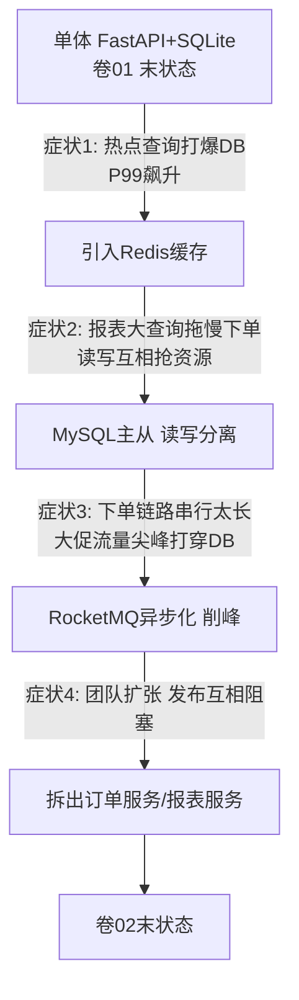
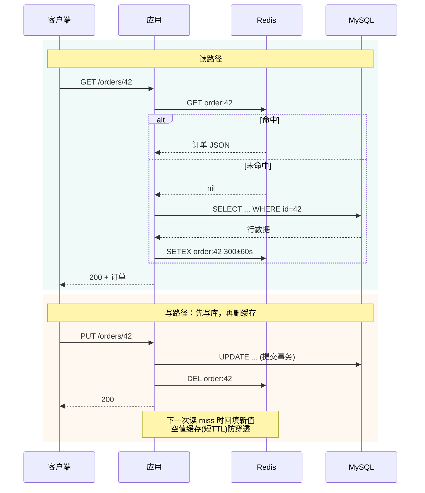
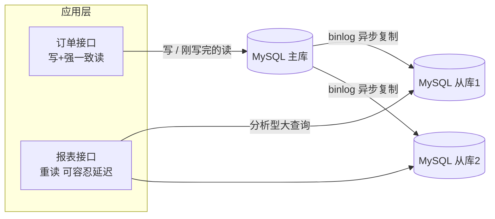
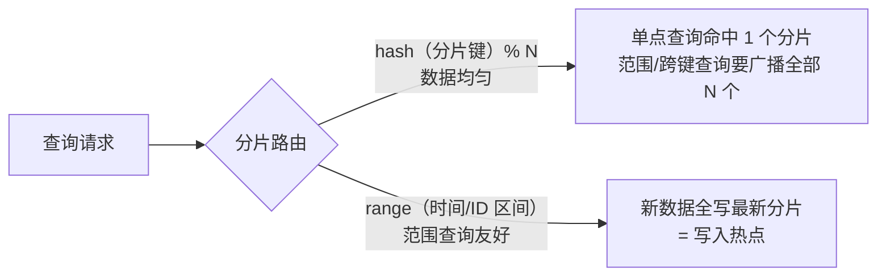

# 卷02-1：缓存、读写分离与分库分表——症状驱动的第一刀与第二刀

> 导语：卷01 结束时，RetailHub 还是一个"最简单体"：一个 FastAPI 进程、一个 SQLite 文件、3 个查询端点。本卷要回答的问题是：**当真实业务增长压过来时，这个单体会在哪里先断、断之前有什么症状、每种症状对应的正确手术是什么。**本页先看清单体的三堵墙与"症状驱动"的演进地图，然后动前两刀——缓存（Cache-Aside 模式与穿透/击穿/雪崩三大事故）和读写分离（binlog 复制延迟与"刚写完读不到"的经典坑），并对分库分表做出"留门不进"的明确判断。学完本页，你将建立本卷的核心直觉：演进由症状触发，由验收标准收口。

---

## 1. 单体的极限：它会在三个方向先后顶不住

先给单体一个公正的评价：**单体是绝大多数系统的正确起点**。部署简单、事务本地、调试方便、没有分布式问题。卷01 选单体不是偷懒，是判断。但单体有三堵墙，业务增长会依次撞上它们。

### 1.1 三堵墙与它们的症状（凤凰架构演进视角）

| 墙 | 典型症状（可观测） | 本质 |
| --- | --- | --- |
| 性能墙 | P99 延迟从 50ms 涨到 2s；数据库 CPU 长期 90%；大促时接口超时 | 单机资源（CPU/连接/IO）是硬上限 |
| 协作墙 | 5 个人改同一个仓库，天天合并冲突；改报表逻辑要重新发布订单接口 | 代码边界 ≠ 团队边界（康威定律） |
| 发布墙 | 上线频率被拉低到两周一次；一个小改动要全量回归；回滚等于回滚所有人 | 部署单元过大，变更爆炸半径 = 整个系统 |

凤凰架构的史观提醒我们：**单体不是"错误"，它是"上一个约束条件下的最优解"**。当约束（流量、团队规模、变更频率）变化，最优解跟着变。所以本卷的叙事主线只有一句话：

> **不要问"微服务好不好"，要问"我现在疼在哪，这个手术治不治这个疼"。**

### 1.2 症状驱动的演进地图



注意这张图里没有任何一步是"为了架构而架构"：每条边上都写着一个症状。这就是本卷要反复训练的直觉——**演进由症状触发，由验收标准收口**。

---

## 2. 第一刀：缓存——症状是"数据库被同样的查询反复打"

### 2.1 什么症状逼你上缓存

RetailHub 上线一个月后，运营同学有个高频动作：刷订单详情页。监控显示 `/orders/{id}` 这一个端点占了全部流量的 62%，其中 90% 是重复查询同一批"今日新订单"。数据库 CPU 60% 都花在一遍遍执行结果完全相同的 SELECT 上。

这就是缓存的标准适应症：**读多写少、读有明显热点、数据允许短暂不一致**。订单详情恰好全中——订单创建后极少修改，晚 1 秒看到也不影响业务。

### 2.2 Cache-Aside 模式与代码骨架

业界最通用的读缓存模式是 **Cache-Aside（旁路缓存）**：读先查缓存， miss 再查库并回填；写先写库，再删缓存。

```python
# order_service.py —— Cache-Aside 读路径骨架
import json
import redis.asyncio as redis
from sqlalchemy.ext.asyncio import AsyncSession

rds = redis.Redis(host="redis", port=6379, decode_responses=True)
CACHE_TTL = 300  # 秒

async def get_order(order_id: int, db: AsyncSession) -> dict:
    key = f"order:{order_id}"
    # 1) 先查缓存
    cached = await rds.get(key)
    if cached is not None:
        if cached == "NULL":            # 空值缓存，防穿透
            raise OrderNotFound(order_id)
        return json.loads(cached)
    # 2) 缓存 miss，查库
    order = await db.get(Order, order_id)
    if order is None:
        await rds.setex(key, 60, "NULL")  # 空值短 TTL
        raise OrderNotFound(order_id)
    # 3) 回填缓存
    await rds.setex(key, CACHE_TTL, json.dumps(order.to_dict()))
    return order.to_dict()

async def update_order(order_id: int, data: dict, db: AsyncSession) -> None:
    # 写路径：先写库，再删缓存（不是更新缓存！）
    await db.execute(update(Order).where(Order.id == order_id).values(**data))
    await db.commit()
    await rds.delete(f"order:{order_id}")
```

为什么写后是"删缓存"而不是"改缓存"？因为改缓存在并发下会出现"旧值覆盖新值"的经典竞态：线程 A 写库 → 线程 B 写库 → B 改缓存 → A 改缓存，缓存里留下 A 的旧值。删缓存把"最后一次写生效"的问题简化成"下一次读回填"，竞态窗口小得多。

**顺带回答一个绕不开的问题：Redis 凭什么这么快？**三个原因：① 数据全在内存——一次 GET 是内存寻址（纳秒级）而不是磁盘读取（毫秒级），差了约六个数量级；② 核心命令单线程执行，没有锁竞争，每条命令天然原子；③ 网络层用 IO 多路复用（正是卷01 §3.3 讲的 epoll），一个线程伺候上万个连接。所以"加一层 Redis"的本质，是把最热的读从"磁盘 + 行锁"搬到"内存 + 单线程"。

Cache-Aside 也不是唯一的缓存模式，但它是默认答案。四种模式对照：

| 模式 | 读写规则 | 优点 | 代价 | 何时用 |
| --- | --- | --- | --- | --- |
| Cache-Aside 旁路 | 应用自己管缓存：读 miss 回填，写后删 | 简单；缓存挂了只降级、不致命 | 有一致性小窗口；冷数据首读必 miss | 默认选择，本卷采用 |
| Read-Through 读穿透 | 应用只问缓存，miss 由缓存层负责回源 | 应用代码更薄 | 缓存层要实现回源逻辑，耦合上移 | 有成熟缓存中间件托管时 |
| Write-Through 写穿透 | 写操作同步落缓存和库 | 缓存永远是热的 | 写延迟翻倍；写多场景浪费 | 写后立刻必读的少量数据 |
| Write-Behind 写回 | 先写缓存，异步批量落库 | 写极快，还能合并多次写 | 宕机有丢数据窗口 | 可丢的计数/行为日志类 |

把读写两条路径画在一张时序图里，Cache-Aside 的全部规则就齐了：



### 2.3 缓存三大经典事故：穿透、击穿、雪崩

| 事故 | 一句话定义 | RetailHub 里的样子 | 对策 |
| --- | --- | --- | --- |
| 穿透 | 查询**不存在**的数据，缓存永远 miss，全打 DB | 爬虫遍历不存在的订单号 | 缓存空值（短 TTL）+ 布隆过滤器 |
| 击穿 | 一个**热点 key 恰好过期**，瞬时几百个请求同时回源 | 整点大促开始，"今日爆款订单"key 到期 | 互斥锁（singleflight）只放一个请求回源 |
| 雪崩 | **大量 key 同时过期**，DB 被集体回源压垮 | 昨晚批量预热缓存，TTL 全是 300s，今晚同一秒全部过期 | TTL 加随机抖动（如 300±60s）；多级缓存 |

击穿的互斥锁写法（singleflight 思想）：

```python
import asyncio
import random

_locks: dict[str, asyncio.Lock] = {}

async def get_order_safe(order_id: int, db: AsyncSession) -> dict:
    key = f"order:{order_id}"
    cached = await rds.get(key)
    if cached is not None:
        return json.loads(cached)
    # 每个 key 一把锁：miss 时只放行一个请求回源
    lock = _locks.setdefault(key, asyncio.Lock())
    async with lock:
        cached = await rds.get(key)   # 拿到锁后再查一次（double-check）
        if cached is not None:
            return json.loads(cached)
        order = await db.get(Order, order_id)
        if order is None:
            raise OrderNotFound(order_id)
        await rds.setex(key, 300 + random.randint(0, 60), json.dumps(order.to_dict()))
        return order.to_dict()
```

**动手玩一玩**：下面的「Cache-Aside 模拟器」分两块。左边演练读写路径——连点两次"读请求"看命中，点"读不存在的订单"看空值缓存如何防穿透，点"写请求"观察为什么写后是删缓存；右边复现缓存雪崩——先"批量预热 100 个 key"再"快进 600 秒"，看 t=300s 处 DB QPS 的尖峰，然后打开"TTL 加随机抖动"重放，对比曲线被摊平的效果。观察重点：**雪崩不是 Redis 挂了，而是大量 key 约好同一秒过期**。

```demo cache-aside
```

**Demo 导学单**

1. 连续点两次"读请求"，对比第二次的响应来源与耗时——命中和回源差多少倍？
2. 点两次"读不存在的订单"，盯住 DB 查询计数：第二次是否停止增长？这就是空值缓存生效的标志。
3. 先读一次订单 42，点"写请求"修改它，紧接着再读——回答：写后为什么是"删"缓存而不是"改"？竞态发生在哪一步？
4. 右侧"批量预热 100 个 key"后点"快进 600 秒"，记下 t=300s 处 DB QPS 峰值；打开"TTL 随机抖动"重放，峰值降到多少？用一句话向同事解释雪崩的成因与对策。

### 2.4 缓存一致性：能容忍多久的不一致是业务问题

"先写库再删缓存"仍有小窗口：删缓存失败，或删除与并发读回填交错。要承认一个事实：**Cache-Aside 提供的是最终一致，不是强一致**。工程上的正确做法不是追求绝对一致，而是：

1. 用监控量出实际不一致窗口（通常毫秒级）；
2. 让业务确认这个窗口可接受（订单详情页可以，库存扣减不可以——所以库存不走这条路，见卷03 事务章）；
3. 删缓存失败时投递到 MQ 重试（这正是第 4 节消息队列的第一个用武之地）。

> 融合来源：本节对应"小白服务端架构演进"叙事的缓存一章，以及凤凰架构对"缓存不是银弹，是一致性与性能的再平衡"的论述。[^fenix]

---

## 3. 第二刀：读写分离与分库分表——症状是"读和写在抢同一台机器"

### 3.1 什么症状逼你做读写分离

缓存上了两周，新的症状出现了：每天上午 10 点，运营集中刷报表（大 JOIN、全表扫描、GROUP BY 百万行），同一时刻下单接口 P99 从 80ms 飙到 1.5s。**报表是重读，下单是重写，它们在同一台 MySQL 上抢 Buffer Pool、抢 IO、抢 CPU。**

缓存治不了这个症状——报表查询每次条件都不同，缓存命中率趋近于零。手术方案：**MySQL 主从复制，写走主库，报表类重读走从库**。



### 3.2 读写分离的代价：复制延迟

先搞懂复制是怎么工作的：主库把每笔变更追加到 **binlog**（变更日志），从库的 IO 线程拉取 binlog 到本地，SQL 线程再逐条重放——整条链路是"**主库写完就走，从库在后面慢慢追**"。所以从库数据天然落后主库（通常毫秒到秒级，大事务时可达分钟级）。

为什么非要异步？改成同步（主库等从库确认落盘再返回客户端）行不行？行，但代价是：每次写延迟 = 主库执行 + 网络往返 + 从库重放，可用性还多绑一台机器——从库一抖，全站写入卡住。**主从异步复制，本质是拿"秒级旧数据"换"写入不被拖垮"**，这是复制拓扑里最经典的取舍。[^ddia-ch5]

于是有了教科书级的坑：**用户刚下完单，跳转订单列表，列表查的是从库——订单"消失"了**。

对策有三种，按实现成本排序：

1. **写后读主**：写完后的 N 秒内（或当前会话内）强制读主库。简单，覆盖 90% 场景。
2. **判断复制位点**：读从库前确认从库已应用到写入时的 binlog 位点（GTID 等待）。精确但复杂。
3. **业务规避**：下单成功页直接展示下单接口的返回值，不再查一次列表。零成本，优先选它。

### 3.3 分库分表：先知道动机，再决定什么时候忍不了

分库分表解决的是**单机写容量和单表体积**的硬上限。它的典型症状是：单表过亿行后 DDL 一次要几个小时、备份恢复以天计、写入 TPS 逼近单机磁盘 IO 上限。

**RetailHub 当前不需要分库分表**——日单量几万级，单表千万行以内 MySQL 完全扛得住。这里明确说"不演进"和说"演进"同样重要：分库分表引入分布式事务、跨库 JOIN、全局 ID、扩容再均衡一大堆问题（卷03 第 6 章分区会系统讲），**在症状出现之前做，是纯负债**。正确的动作是：现在就把订单表设计成"可按 tenant_id 拆分"的形态（无主键跨表自增依赖、无外键横跨、查询必带租户条件），为未来留门，但不进门。

虽然"留门不进"，但分片的两个基本决策现在就该建立直觉——**选什么当分片键、按哈希还是按范围路由**，它俩决定了未来所有查询的命运：



| 方案 | 治什么症状 | 引入的代价 | RetailHub 决策 |
| --- | --- | --- | --- |
| 缓存 | 重复读热点 | 一致性窗口、三事故 | 本卷实施 |
| 读写分离 | 读写互抢资源 | 复制延迟、写后读问题 | 本卷实施 |
| 分库分表 | 写容量/单表体积上限 | 分布式事务、运维复杂度 | 留门不进 |

**动手玩一玩**：下面的「分库分表路由模拟器」有 4 个分片和一批带"订单号 / 租户 / 日期"三属性的订单。切换三种分片键策略，分别执行"查单个订单"和"查某租户全部订单"两种查询，观察：数据是否均匀、查询是命中单分片还是被迫广播。想一想：为什么"按租户分片"对 SaaS 系统既诱人又危险？

```demo sharding-route
```

**Demo 导学单**

1. 选「按订单号取模」，执行"查租户 T1 的全部订单"——注意需要广播到几个分片，代价是什么。
2. 切到「按租户取模」，同一个查询命中几个分片？再看各分片数据量柱图，找出新问题的名字（热点/数据倾斜）。
3. 切到「按日期范围」，点"插入一批新订单"，观察写入全部落到了哪个分片。
4. 用"均匀性 vs 查询模式"这把尺，给三种策略各写一句适用场景结论。

---

## 参考与脚注

[^fenix]: 周志明《凤凰架构：构建可靠的大型分布式系统》，在线版 <https://icyfenix.cn>（"演进史观"见导言及第一部分）。
[^ddia-ch5]: Martin Kleppmann《数据密集型应用系统设计》（Designing Data-Intensive Applications，DDIA），第 5 章「复制」。

➡️ 下一页：卷02-2 · 消息队列与服务拆分
