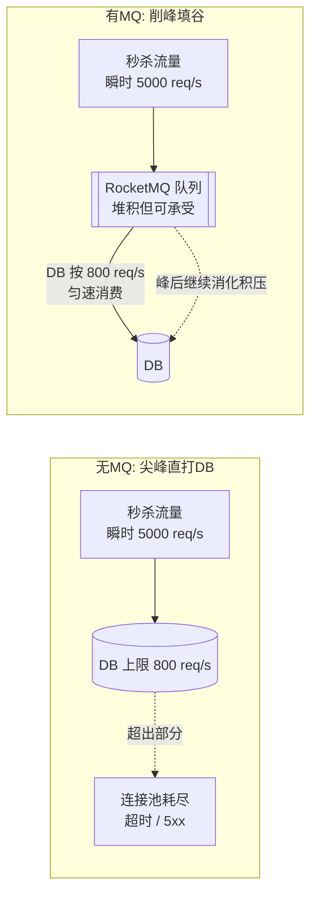
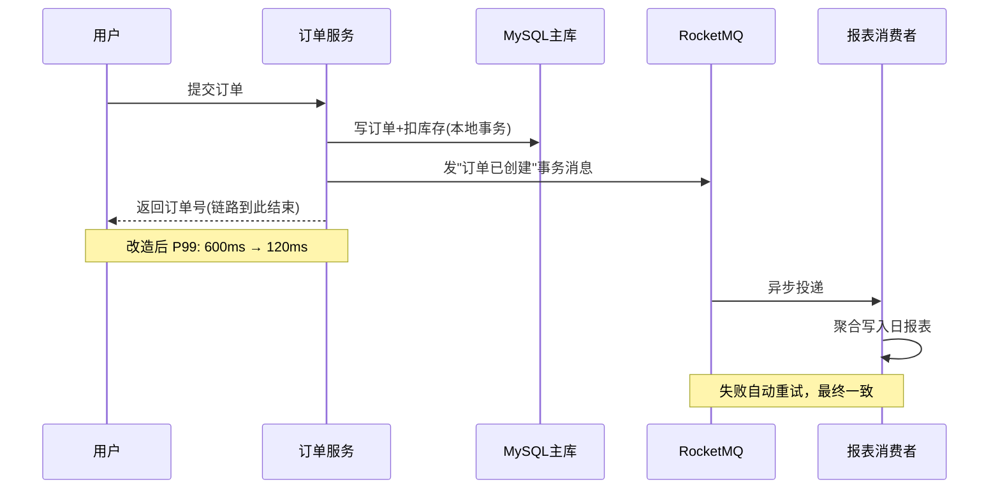
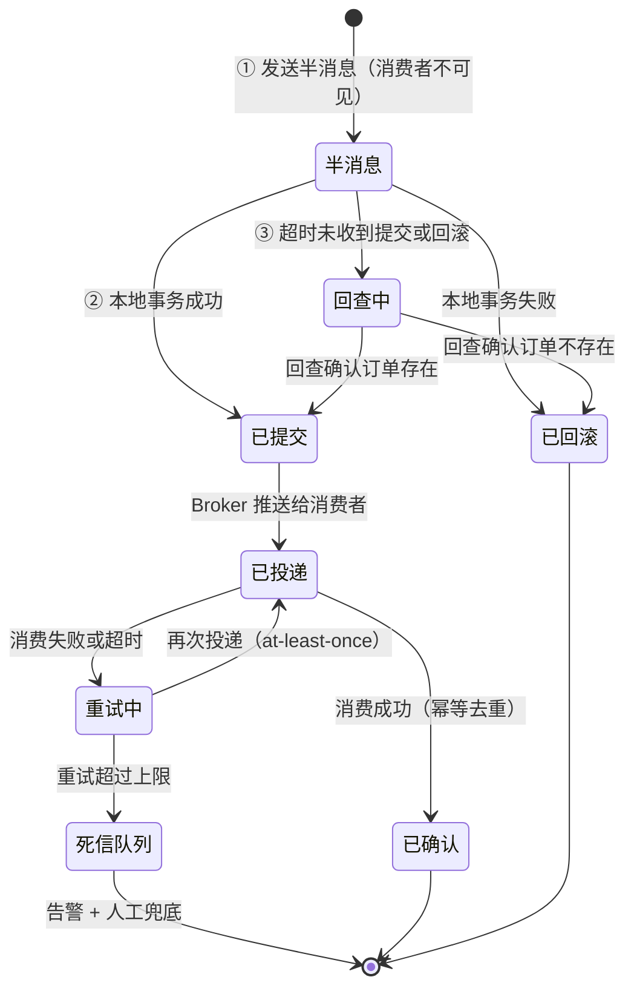
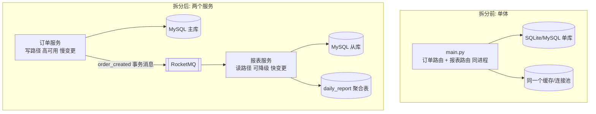
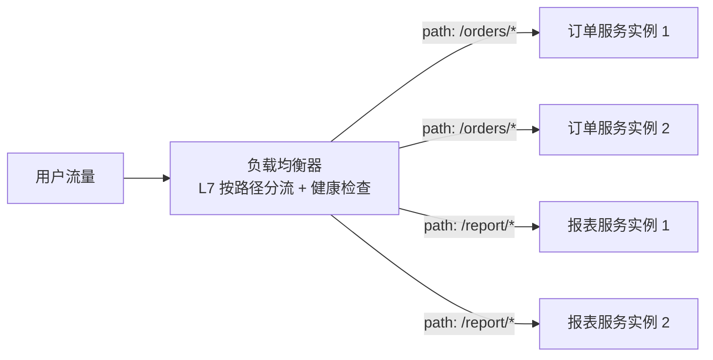

# 卷02-2：消息队列与服务拆分——异步化、负载均衡与第一次拆分

> 导语：上一页用缓存和读写分离治好了"读"的症状，这一页处理"链路"与"组织"的症状：下单链路又慢又脆，大促流量尖峰直接打穿数据库；团队从 3 人涨到 8 人，在同一个仓库里天天互相挡路。对应的手术是 RocketMQ 异步化（事务消息、削峰填谷、最终一致）与第一次服务拆分（按业务能力拆、多实例部署与负载均衡、一致性哈希）。学完本页，你能讲清"半消息 + 回查"为什么存在、为什么工程上只信 at-least-once + 消费幂等，以及为什么"拆"永远是被症状逼出来的下策而非彰显技术的上策。

---

## 4. 第三刀：消息队列——症状是"下单链路又慢又脆，大促直接挂"

### 4.1 什么症状逼你上 MQ

大促压测暴露了两个症状：

- **慢**：下单接口串行做了 5 件事——写订单、扣库存、发通知、写行为日志、触发日报统计。前三件用户要等，后两件用户根本不该等。P99 600ms 里有 400ms 是"不该等的"。
- **脆**：流量尖峰（秒杀开始那一秒）直接打到数据库，连接池瞬间耗尽，雪崩式 5xx。

消息队列（本卷选 **RocketMQ**，事务消息对订单场景友好；Kafka 在日志/流场景更强，卷03 会再对比）对症两个价值：**异步化**（把不该等的摘除链路）与**削峰**（把尖峰流量在队列里摊平成 DB 能承受的匀速消费）。

"削峰填谷"的流量形状变化，一图胜千言：



关键认知：MQ 没有让总流量变小，它做的是**时间轴上的重新分配**——把 1 秒内打过来的 5000 个请求，摊到后续十几秒里匀速消费。代价是报表/通知这类下游结果出现秒级延迟，这正是下一节"最终一致性"的由来。

### 4.2 下单链路改造前后



事务消息骨架（保证"订单落库"和"消息发出"不分裂）：

```python
# mq_producer.py —— RocketMQ 事务消息骨架
from rocketmq.client import Producer, TransactionMQProducer, Message, TransactionStatus

def create_order_tx_producer(db_session_factory) -> TransactionMQProducer:
    producer = TransactionMQProducer("order_producer_group")

    def local_execute(msg, user_args) -> TransactionStatus:
        # Broker 回查时，按订单号查本地事务到底提交没有
        order_id = user_args["order_id"]
        with db_session_factory() as s:
            exists = s.query(Order).filter_by(id=order_id).count() > 0
        return TransactionStatus.COMMIT if exists else TransactionStatus.ROLLBACK

    producer.set_transaction_check_listener(local_execute)
    return producer

def place_order(order: Order, db, producer) -> int:
    # 1) 先发半消息（对下游不可见）
    msg = Message("order_created")
    msg.set_keys(str(order.id))
    msg.set_body(order.to_json().encode())
    # 2) 半消息成功后执行本地事务：写订单 + 扣库存
    db.add(order)
    db.execute("UPDATE sku SET stock = stock - %s WHERE id = %s AND stock >= %s",
               (order.qty, order.sku_id, order.qty))
    db.commit()
    # 3) 提交事务消息，下游可见；本地事务状态可被 Broker 回查
    producer.send_message_in_transaction(msg, {"order_id": order.id})
    return order.id
```

**为什么需要"半消息 + 回查"这套复杂机制？**它解的问题叫"双写分裂"：下单要做两件不在同一个数据库事务里的事——写库、发消息。两种朴素顺序都会出事：

- 先写库再发消息：写库成功后进程崩溃或网络抖动，消息没发出去——订单存在，但日报表永远缺这一单。
- 先发消息再写库：消息发了，写库失败回滚——下游凭空多一单，GMV 虚增。

事务消息把"发消息"拆成两阶段：① 先发一条**半消息**（Broker 存下来但对消费者不可见，相当于占位）；② 执行本地事务（写订单、扣库存）；③ 按本地事务结果通知 Broker **提交**（消息变可见）或**回滚**（丢弃半消息）。如果第 ③ 步的通知丢了（进程恰好崩在半路），Broker 会定期**回查**："那条半消息，你的本地事务到底成了没有？"——生产者按订单号查库回答，Broker 据此提交或回滚。这样"订单落库"与"消息可见"被焊成同生共死。

再补一张必须背下来的表——消息投递的三种语义：

| 语义 | 保证 | 实现方式 | 现实 |
| --- | --- | --- | --- |
| at-most-once 至多一次 | 不重复，但可能丢 | 收到即确认，失败不重试 | 只有可丢的采样类流量敢用 |
| at-least-once 至少一次 | 不丢，但可能重复 | 处理完才确认，失败重投 | **绝大多数 MQ 的默认，本卷就是它** |
| exactly-once 恰好一次 | 不丢不重 | 需要端到端事务协议配合 | 宣传口径居多；工程上等价于"at-least-once + 消费幂等" |

所以结论只有一句：**别指望 MQ 给你恰好一次，把幂等做在消费端。**这就是 4.3 节"消费幂等"的理论依据。

消息从发出到终结的完整生命周期（含失败去向）：



**动手玩一玩**：下面的「MQ 削峰填谷模拟器」里，后端处理能力恒定为 800 req/s。把滑块拉到 3000 req/s 以上，先**关闭 MQ** 点"发起秒杀"——看红线（失败请求）和延迟如何爆炸；再**打开 MQ** 重放一次——看绿色处理曲线被压平在 800、橙色排队曲线先涨后消。观察重点：排队长度归零所需的秒数 ≈ 积压量 ÷ 消费速率，这就是大促后"报表晚几分钟"的定量解释。

```demo mq-peak-shaving
```

**Demo 导学单**

1. 关闭 MQ，把流量拉到 3000 req/s 点"发起秒杀"：记录失败率与延迟峰值，对照正文"脆"的症状描述。
2. 打开 MQ 重放：绿色处理曲线为什么被压平在 800？橙色排队曲线何时涨到顶、何时归零？
3. 用"积压量 ÷ 消费速率"估算排队清零所需秒数，与图上实际值对账。
4. 思考边界：如果下游不是"写日报表"而是"扣库存"，这条链路还能这样削峰吗？（提示：回第 4.1 节看哪三件事用户必须当场等。）

### 4.3 最终一致性：报表晚 3 秒是可接受的

引入 MQ 就是引入了最终一致：下单成功的那一刻，日报表里**还没有**这一单。工程上要做三件事：

1. **消费幂等**：消息至少投递一次（at-least-once），消费者必须用订单号做去重（如 `INSERT ... ON DUPLICATE KEY UPDATE` 或消费记录表），否则重试会导致 GMV 重复计数。
2. **死信与告警**：重试超限的消息进死信队列，接告警，人肉兜底。
3. **业务口径确认**：和运营白纸黑字确认"日报表延迟 ≤ 5 分钟"，写进 SLA。一致性要求是谈出来的，不是猜出来的。

---

## 5. 第四刀：服务拆分——症状是"人开始互相挡路"

### 5.1 拆分的正确时机：组织疼，不是技术痒

前三刀都是技术症状驱动的。第四刀不同——**它的触发器是组织**。RetailHub 团队从 3 人涨到 8 人后的症状：

- 改报表逻辑的同学和改下单逻辑的同学天天在同一个 `main.py` 上打架；
- 报表组想加个统计字段，发布窗口被订单组的紧急修复挤掉；
- 订单链路要 7×24 高可用，报表可以允许半夜重启——但它们是同一个进程，可用性标准被迫取最高者，发布被迫取最慢者。

这就是**康威定律**在敲门：系统的沟通结构会长成组织的沟通结构。当两个方向的迭代节奏、可用性等级、技术栈诉求都分叉时，维持一个进程反而成本更高。

### 5.2 拆分粒度：按业务能力拆，不按技术层拆

第一刀只拆两个服务：**订单服务**（写路径，高可用，慢变更）与**报表服务**（读路径，可降级，快变更）。不拆用户、不拆商品——它们还没有独立的迭代节奏。

| 拆分依据 | 结果 | 评价 |
| --- | --- | --- |
| 按业务能力（订单/报表） | 边界 = 业务边界，团队自治 | ✅ 本卷采用 |
| 按技术层（Controller/Service/DAO 各一服务） | 每次需求改三层，跨服务调用爆炸 | ❌ 经典反面教材 |
| 按表拆（一张表一个服务） | 服务数量爆炸，分布式事务地狱 | ❌ 过细 |

拆分后的最小纪律：服务间只通过 API 和 MQ 事件通信，**严禁跨库直连对方的表**——一旦报表服务直连订单库，拆分就名存实亡，你得到了分布式系统的全部代价和单体的全部耦合。

还要补一个常被忽略的认知：**拆分之后，一次函数调用变成了一次网络调用**。本地调用失败就是抛异常，而远程调用有三种结局——成功、失败、**超时（不知道成没成）**；延迟从纳秒级变毫秒级；序列化、版本兼容、熔断重试全都成了新问题。这就是为什么"拆"永远是被症状逼出来的下策，而不是彰显技术的上策——你买的是组织自治，付的是分布式复杂度。

拆分前后的依赖形态对比：



注意右图里**没有**从报表服务指向订单主库的箭头——这条"不存在的边"就是拆分纪律本身。

### 5.3 拆完之后的第一课：多实例部署与负载均衡

拆分还有一个隐藏收益：**不同服务可以有不同的副本数**。订单服务要扛大促，起 8 个实例；报表服务 2 个就够。但 8 个实例面前立刻出现一个新问题：**一个请求来了，给谁？**这就是负载均衡（Load Balancing）要回答的。

先分清你在哪一层做这件事：

| 层 | 代表 | 转发依据 | 特点 |
| --- | --- | --- | --- |
| L4 四层 | LVS、云 SLB 的 TCP 模式 | 只看 IP + 端口 | 快（不解析内容），对业务完全透明 |
| L7 七层 | Nginx、API 网关、云 SLB 的 HTTP 模式 | 能看 URL、Header、Cookie | 能按路径分流（`/orders` 给订单服务），代价是要解析报文、多一跳开销 |

再看"给谁"的调度算法，常用四种：

| 算法 | 规则 | 适用 | 坑 |
| --- | --- | --- | --- |
| 轮询 Round Robin | 挨个发 | 实例同构、请求耗时均匀 | 实例性能不均时会欺负弱机 |
| 加权轮询 | 按权重比例发 | 实例规格不同 | 权重靠人肉估 |
| 最少连接 | 发给当前连接数最少的 | 请求耗时长短不一 | 新实例加入瞬间被灌爆（冷启动） |
| 一致性哈希 | 按 key（如用户 ID）映射到固定实例 | 需要"同一用户总到同一实例"（本地缓存命中、会话亲和） | 节点增减时的迁移问题——见下面 Demo |

为什么"同一用户到同一实例"值得专门一个算法？普通取模 `hash(user) % N` 也能做到，**但只要 N 变了（加一台机器），几乎所有 key 的归属都会重排**——本地缓存集体失效、会话集体掉线。一致性哈希把节点和 key 都映射到一个环上，key 归顺时针方向的第一个节点；加减节点只影响环上相邻的一小段，迁移量从"几乎全部"降到"约 1/N"。它也是分库分表路由（3.3 节）与卷03 分区一章的共同基础。



**动手玩一玩**：下面的「一致性哈希模拟器」把 12 个 key 分配到环上的节点。先用「普通取模」模式点"添加节点"，看迁移比例有多吓人；再切到「一致性哈希」重复同样操作，对比迁移量；最后打开"虚拟节点"，看各节点负载是否变得更均匀。

```demo consistent-hash
```

**Demo 导学单**

1. 取模模式下点"添加节点 D"，记录迁移的 key 比例——和"几乎全部重排"的说法对上。
2. 切到一致性哈希模式重复同一操作，迁移比例降到多少？和 1/N 的理论预期差多少？
3. 打开"虚拟节点"再看各节点分到的 key 数——虚拟节点解决的是"分布不均"还是"迁移量"？别答错。
4. 移除一个节点观察：为什么一致性哈希下只有"邻居"节点的 key 会动？

最后两个工程要点，记住名字即可：

- **健康检查**：负载均衡器周期性探测每个实例（探的就是卷01 的 `/health`），探活失败就摘流——实例挂了流量自动绕开。这才是"多实例"换来高可用的关键机制，而不是"多"本身。
- **无状态是会呼吸的前提**：负载均衡能随便分发，是因为应用无状态（卷01 §1.1 埋的线）。一旦你在实例内存里存了会话或计数，调度算法再聪明也会出错——状态要么下沉到 Redis/DB，要么靠一致性哈希做会话亲和，前者是正路。

---

➡️ 下一页：卷02-3 · 真实架构演进案例与 RetailHub 大促实战
