# 卷02：服务端架构演进实践——架构是演进出来的，不是设计出来的

> 导语：卷01 结束时，我们的 RetailHub 还是一个"最简单体"：一个 FastAPI 进程、一个 SQLite 文件、3 个查询端点（订单列表、订单详情、今日 GMV）。它能跑，但它只是"能跑"。本卷要回答的问题是：**当真实业务增长压过来时，这个单体会在哪里先断、断之前会有什么症状、每一种症状对应的正确手术是什么。**本卷融合《凤凰架构》的"演进史观"[^fenix]（架构风格是被当时的约束逼出来的）与业界经典的"单体到微服务"演进叙事。我们不预设终点是微服务——恰恰相反，本卷的每一次演进都由一个可观测的症状驱动。读完本卷，你将把 RetailHub 从单体演进为"MySQL 主从 + Redis 缓存 + RocketMQ 异步 + 订单/报表两个服务"，并理解每一步**为什么非做不可，以及为什么之前不用做**。

---

## 1. 单体的极限：它会在三个方向先后顶不住

先给单体一个公正的评价：**单体是绝大多数系统的正确起点**。部署简单、事务本地、调试方便、没有分布式问题。卷01 选单体不是偷懒，是判断。但单体有三堵墙，业务增长会依次撞上它们。

### 1.1 三堵墙与它们的症状（凤凰架构演进视角）

| 墙 | 典型症状（可观测） | 本质 |
| --- | --- | --- |
| 性能墙 | P99 延迟从 50ms 涨到 2s；数据库 CPU 长期 90%；大促时接口超时 | 单机资源（CPU/连接/IO）是硬上限 |
| 协作墙 | 5 个人改同一个仓库，天天合并冲突；改报表逻辑要重新发布订单接口 | 代码边界 ≠ 团队边界（康威定律） |
| 发布墙 | 上线频率被拉低到两周一次；一个小改动要全量回归；回滚等于回滚所有人 | 部署单元过大，变更爆炸半径 = 整个系统 |

凤凰架构的史观提醒我们：**单体不是"错误"，它是"上一个约束条件下的最优解"**。当约束（流量、团队规模、变更频率）变化，最优解跟着变。所以本卷的叙事主线只有一句话：

> **不要问"微服务好不好"，要问"我现在疼在哪，这个手术治不治这个疼"。**

### 1.2 症状驱动的演进地图

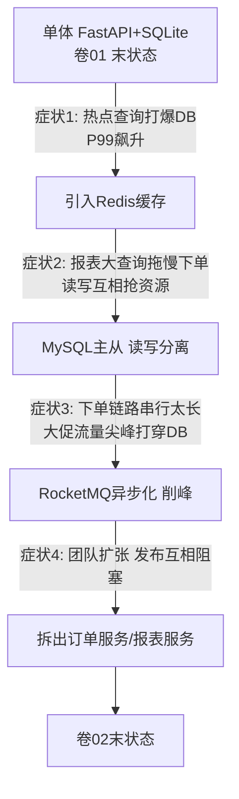

注意这张图里没有任何一步是"为了架构而架构"：每条边上都写着一个症状。这就是本卷要反复训练的直觉——**演进由症状触发，由验收标准收口**。

---

## 2. 第一刀：缓存——症状是"数据库被同样的查询反复打"

### 2.1 什么症状逼你上缓存

RetailHub 上线一个月后，运营同学有个高频动作：刷订单详情页。监控显示 `/orders/{id}` 这一个端点占了全部流量的 62%，其中 90% 是重复查询同一批"今日新订单"。数据库 CPU 60% 都花在一遍遍执行结果完全相同的 SELECT 上。

这就是缓存的标准适应症：**读多写少、读有明显热点、数据允许短暂不一致**。订单详情恰好全中——订单创建后极少修改，晚 1 秒看到也不影响业务。

### 2.2 Cache-Aside 模式与代码骨架

业界最通用的读缓存模式是 **Cache-Aside（旁路缓存）**：读先查缓存， miss 再查库并回填；写先写库，再删缓存。

```python
# order_service.py —— Cache-Aside 读路径骨架
import json
import redis.asyncio as redis
from sqlalchemy.ext.asyncio import AsyncSession

rds = redis.Redis(host="redis", port=6379, decode_responses=True)
CACHE_TTL = 300  # 秒

async def get_order(order_id: int, db: AsyncSession) -> dict:
    key = f"order:{order_id}"
    # 1) 先查缓存
    cached = await rds.get(key)
    if cached is not None:
        if cached == "NULL":            # 空值缓存，防穿透
            raise OrderNotFound(order_id)
        return json.loads(cached)
    # 2) 缓存 miss，查库
    order = await db.get(Order, order_id)
    if order is None:
        await rds.setex(key, 60, "NULL")  # 空值短 TTL
        raise OrderNotFound(order_id)
    # 3) 回填缓存
    await rds.setex(key, CACHE_TTL, json.dumps(order.to_dict()))
    return order.to_dict()

async def update_order(order_id: int, data: dict, db: AsyncSession) -> None:
    # 写路径：先写库，再删缓存（不是更新缓存！）
    await db.execute(update(Order).where(Order.id == order_id).values(**data))
    await db.commit()
    await rds.delete(f"order:{order_id}")
```

为什么写后是"删缓存"而不是"改缓存"？因为改缓存在并发下会出现"旧值覆盖新值"的经典竞态：线程 A 写库 → 线程 B 写库 → B 改缓存 → A 改缓存，缓存里留下 A 的旧值。删缓存把"最后一次写生效"的问题简化成"下一次读回填"，竞态窗口小得多。

**顺带回答一个绕不开的问题：Redis 凭什么这么快？**三个原因：① 数据全在内存——一次 GET 是内存寻址（纳秒级）而不是磁盘读取（毫秒级），差了约六个数量级；② 核心命令单线程执行，没有锁竞争，每条命令天然原子；③ 网络层用 IO 多路复用（正是卷01 §3.3 讲的 epoll），一个线程伺候上万个连接。所以"加一层 Redis"的本质，是把最热的读从"磁盘 + 行锁"搬到"内存 + 单线程"。

Cache-Aside 也不是唯一的缓存模式，但它是默认答案。四种模式对照：

| 模式 | 读写规则 | 优点 | 代价 | 何时用 |
| --- | --- | --- | --- | --- |
| Cache-Aside 旁路 | 应用自己管缓存：读 miss 回填，写后删 | 简单；缓存挂了只降级、不致命 | 有一致性小窗口；冷数据首读必 miss | 默认选择，本卷采用 |
| Read-Through 读穿透 | 应用只问缓存，miss 由缓存层负责回源 | 应用代码更薄 | 缓存层要实现回源逻辑，耦合上移 | 有成熟缓存中间件托管时 |
| Write-Through 写穿透 | 写操作同步落缓存和库 | 缓存永远是热的 | 写延迟翻倍；写多场景浪费 | 写后立刻必读的少量数据 |
| Write-Behind 写回 | 先写缓存，异步批量落库 | 写极快，还能合并多次写 | 宕机有丢数据窗口 | 可丢的计数/行为日志类 |

把读写两条路径画在一张时序图里，Cache-Aside 的全部规则就齐了：

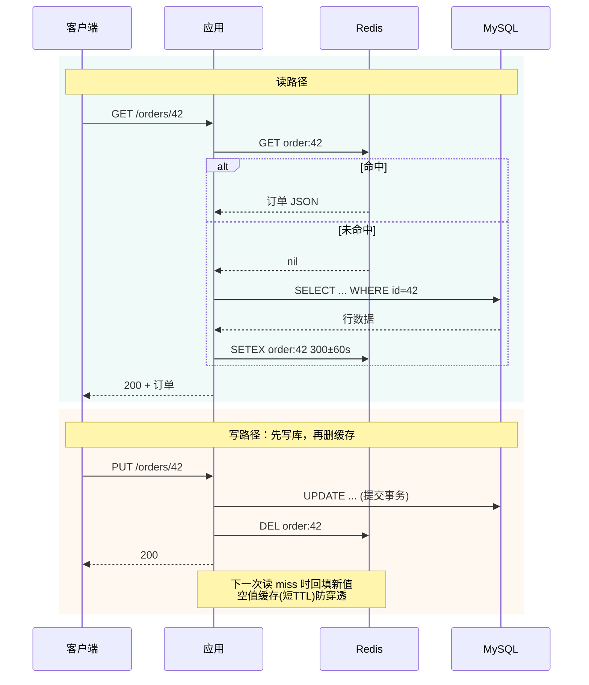

### 2.3 缓存三大经典事故：穿透、击穿、雪崩

| 事故 | 一句话定义 | RetailHub 里的样子 | 对策 |
| --- | --- | --- | --- |
| 穿透 | 查询**不存在**的数据，缓存永远 miss，全打 DB | 爬虫遍历不存在的订单号 | 缓存空值（短 TTL）+ 布隆过滤器 |
| 击穿 | 一个**热点 key 恰好过期**，瞬时几百个请求同时回源 | 整点大促开始，"今日爆款订单"key 到期 | 互斥锁（singleflight）只放一个请求回源 |
| 雪崩 | **大量 key 同时过期**，DB 被集体回源压垮 | 昨晚批量预热缓存，TTL 全是 300s，今晚同一秒全部过期 | TTL 加随机抖动（如 300±60s）；多级缓存 |

击穿的互斥锁写法（singleflight 思想）：

```python
import asyncio
import random

_locks: dict[str, asyncio.Lock] = {}

async def get_order_safe(order_id: int, db: AsyncSession) -> dict:
    key = f"order:{order_id}"
    cached = await rds.get(key)
    if cached is not None:
        return json.loads(cached)
    # 每个 key 一把锁：miss 时只放行一个请求回源
    lock = _locks.setdefault(key, asyncio.Lock())
    async with lock:
        cached = await rds.get(key)   # 拿到锁后再查一次（double-check）
        if cached is not None:
            return json.loads(cached)
        order = await db.get(Order, order_id)
        if order is None:
            raise OrderNotFound(order_id)
        await rds.setex(key, 300 + random.randint(0, 60), json.dumps(order.to_dict()))
        return order.to_dict()
```

**动手玩一玩**：下面的「Cache-Aside 模拟器」分两块。左边演练读写路径——连点两次"读请求"看命中，点"读不存在的订单"看空值缓存如何防穿透，点"写请求"观察为什么写后是删缓存；右边复现缓存雪崩——先"批量预热 100 个 key"再"快进 600 秒"，看 t=300s 处 DB QPS 的尖峰，然后打开"TTL 加随机抖动"重放，对比曲线被摊平的效果。观察重点：**雪崩不是 Redis 挂了，而是大量 key 约好同一秒过期**。

```demo cache-aside
```

**Demo 导学单**

1. 连续点两次"读请求"，对比第二次的响应来源与耗时——命中和回源差多少倍？
2. 点两次"读不存在的订单"，盯住 DB 查询计数：第二次是否停止增长？这就是空值缓存生效的标志。
3. 先读一次订单 42，点"写请求"修改它，紧接着再读——回答：写后为什么是"删"缓存而不是"改"？竞态发生在哪一步？
4. 右侧"批量预热 100 个 key"后点"快进 600 秒"，记下 t=300s 处 DB QPS 峰值；打开"TTL 随机抖动"重放，峰值降到多少？用一句话向同事解释雪崩的成因与对策。

### 2.4 缓存一致性：能容忍多久的不一致是业务问题

"先写库再删缓存"仍有小窗口：删缓存失败，或删除与并发读回填交错。要承认一个事实：**Cache-Aside 提供的是最终一致，不是强一致**。工程上的正确做法不是追求绝对一致，而是：

1. 用监控量出实际不一致窗口（通常毫秒级）；
2. 让业务确认这个窗口可接受（订单详情页可以，库存扣减不可以——所以库存不走这条路，见卷03 事务章）；
3. 删缓存失败时投递到 MQ 重试（这正是第 4 节消息队列的第一个用武之地）。

> 融合来源：本节对应"小白服务端架构演进"叙事的缓存一章，以及凤凰架构对"缓存不是银弹，是一致性与性能的再平衡"的论述。[^fenix]

---

## 3. 第二刀：读写分离与分库分表——症状是"读和写在抢同一台机器"

### 3.1 什么症状逼你做读写分离

缓存上了两周，新的症状出现了：每天上午 10 点，运营集中刷报表（大 JOIN、全表扫描、GROUP BY 百万行），同一时刻下单接口 P99 从 80ms 飙到 1.5s。**报表是重读，下单是重写，它们在同一台 MySQL 上抢 Buffer Pool、抢 IO、抢 CPU。**

缓存治不了这个症状——报表查询每次条件都不同，缓存命中率趋近于零。手术方案：**MySQL 主从复制，写走主库，报表类重读走从库**。

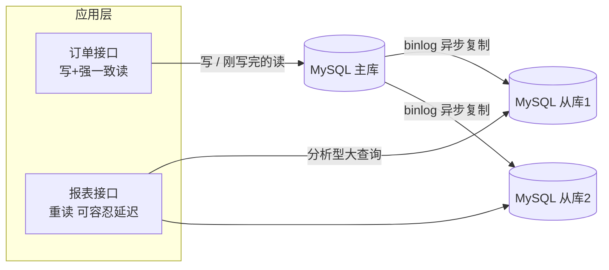

### 3.2 读写分离的代价：复制延迟

先搞懂复制是怎么工作的：主库把每笔变更追加到 **binlog**（变更日志），从库的 IO 线程拉取 binlog 到本地，SQL 线程再逐条重放——整条链路是"**主库写完就走，从库在后面慢慢追**"。所以从库数据天然落后主库（通常毫秒到秒级，大事务时可达分钟级）。

为什么非要异步？改成同步（主库等从库确认落盘再返回客户端）行不行？行，但代价是：每次写延迟 = 主库执行 + 网络往返 + 从库重放，可用性还多绑一台机器——从库一抖，全站写入卡住。**主从异步复制，本质是拿"秒级旧数据"换"写入不被拖垮"**，这是复制拓扑里最经典的取舍。[^ddia-ch5]

于是有了教科书级的坑：**用户刚下完单，跳转订单列表，列表查的是从库——订单"消失"了**。

对策有三种，按实现成本排序：

1. **写后读主**：写完后的 N 秒内（或当前会话内）强制读主库。简单，覆盖 90% 场景。
2. **判断复制位点**：读从库前确认从库已应用到写入时的 binlog 位点（GTID 等待）。精确但复杂。
3. **业务规避**：下单成功页直接展示下单接口的返回值，不再查一次列表。零成本，优先选它。

### 3.3 分库分表：先知道动机，再决定什么时候忍不了

分库分表解决的是**单机写容量和单表体积**的硬上限。它的典型症状是：单表过亿行后 DDL 一次要几个小时、备份恢复以天计、写入 TPS 逼近单机磁盘 IO 上限。

**RetailHub 当前不需要分库分表**——日单量几万级，单表千万行以内 MySQL 完全扛得住。这里明确说"不演进"和说"演进"同样重要：分库分表引入分布式事务、跨库 JOIN、全局 ID、扩容再均衡一大堆问题（卷03 第 6 章分区会系统讲），**在症状出现之前做，是纯负债**。正确的动作是：现在就把订单表设计成"可按 tenant_id 拆分"的形态（无主键跨表自增依赖、无外键横跨、查询必带租户条件），为未来留门，但不进门。

虽然"留门不进"，但分片的两个基本决策现在就该建立直觉——**选什么当分片键、按哈希还是按范围路由**，它俩决定了未来所有查询的命运：

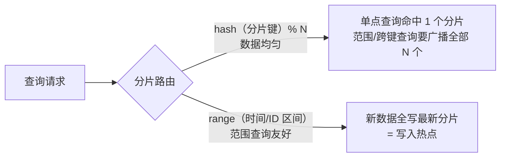

| 方案 | 治什么症状 | 引入的代价 | RetailHub 决策 |
| --- | --- | --- | --- |
| 缓存 | 重复读热点 | 一致性窗口、三事故 | 本卷实施 |
| 读写分离 | 读写互抢资源 | 复制延迟、写后读问题 | 本卷实施 |
| 分库分表 | 写容量/单表体积上限 | 分布式事务、运维复杂度 | 留门不进 |

**动手玩一玩**：下面的「分库分表路由模拟器」有 4 个分片和一批带"订单号 / 租户 / 日期"三属性的订单。切换三种分片键策略，分别执行"查单个订单"和"查某租户全部订单"两种查询，观察：数据是否均匀、查询是命中单分片还是被迫广播。想一想：为什么"按租户分片"对 SaaS 系统既诱人又危险？

```demo sharding-route
```

**Demo 导学单**

1. 选「按订单号取模」，执行"查租户 T1 的全部订单"——注意需要广播到几个分片，代价是什么。
2. 切到「按租户取模」，同一个查询命中几个分片？再看各分片数据量柱图，找出新问题的名字（热点/数据倾斜）。
3. 切到「按日期范围」，点"插入一批新订单"，观察写入全部落到了哪个分片。
4. 用"均匀性 vs 查询模式"这把尺，给三种策略各写一句适用场景结论。

---

## 4. 第三刀：消息队列——症状是"下单链路又慢又脆，大促直接挂"

### 4.1 什么症状逼你上 MQ

大促压测暴露了两个症状：

- **慢**：下单接口串行做了 5 件事——写订单、扣库存、发通知、写行为日志、触发日报统计。前三件用户要等，后两件用户根本不该等。P99 600ms 里有 400ms 是"不该等的"。
- **脆**：流量尖峰（秒杀开始那一秒）直接打到数据库，连接池瞬间耗尽，雪崩式 5xx。

消息队列（本卷选 **RocketMQ**，事务消息对订单场景友好；Kafka 在日志/流场景更强，卷03 会再对比）对症两个价值：**异步化**（把不该等的摘除链路）与**削峰**（把尖峰流量在队列里摊平成 DB 能承受的匀速消费）。

"削峰填谷"的流量形状变化，一图胜千言：

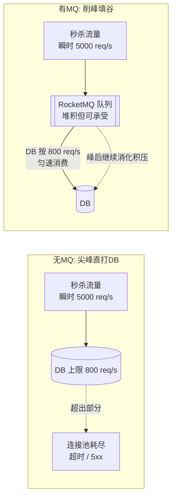

关键认知：MQ 没有让总流量变小，它做的是**时间轴上的重新分配**——把 1 秒内打过来的 5000 个请求，摊到后续十几秒里匀速消费。代价是报表/通知这类下游结果出现秒级延迟，这正是下一节"最终一致性"的由来。

### 4.2 下单链路改造前后

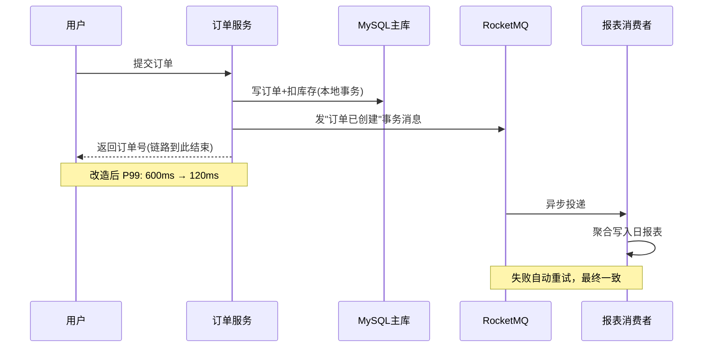

事务消息骨架（保证"订单落库"和"消息发出"不分裂）：

```python
# mq_producer.py —— RocketMQ 事务消息骨架
from rocketmq.client import Producer, TransactionMQProducer, Message, TransactionStatus

def create_order_tx_producer(db_session_factory) -> TransactionMQProducer:
    producer = TransactionMQProducer("order_producer_group")

    def local_execute(msg, user_args) -> TransactionStatus:
        # Broker 回查时，按订单号查本地事务到底提交没有
        order_id = user_args["order_id"]
        with db_session_factory() as s:
            exists = s.query(Order).filter_by(id=order_id).count() > 0
        return TransactionStatus.COMMIT if exists else TransactionStatus.ROLLBACK

    producer.set_transaction_check_listener(local_execute)
    return producer

def place_order(order: Order, db, producer) -> int:
    # 1) 先发半消息（对下游不可见）
    msg = Message("order_created")
    msg.set_keys(str(order.id))
    msg.set_body(order.to_json().encode())
    # 2) 半消息成功后执行本地事务：写订单 + 扣库存
    db.add(order)
    db.execute("UPDATE sku SET stock = stock - %s WHERE id = %s AND stock >= %s",
               (order.qty, order.sku_id, order.qty))
    db.commit()
    # 3) 提交事务消息，下游可见；本地事务状态可被 Broker 回查
    producer.send_message_in_transaction(msg, {"order_id": order.id})
    return order.id
```

**为什么需要"半消息 + 回查"这套复杂机制？**它解的问题叫"双写分裂"：下单要做两件不在同一个数据库事务里的事——写库、发消息。两种朴素顺序都会出事：

- 先写库再发消息：写库成功后进程崩溃或网络抖动，消息没发出去——订单存在，但日报表永远缺这一单。
- 先发消息再写库：消息发了，写库失败回滚——下游凭空多一单，GMV 虚增。

事务消息把"发消息"拆成两阶段：① 先发一条**半消息**（Broker 存下来但对消费者不可见，相当于占位）；② 执行本地事务（写订单、扣库存）；③ 按本地事务结果通知 Broker **提交**（消息变可见）或**回滚**（丢弃半消息）。如果第 ③ 步的通知丢了（进程恰好崩在半路），Broker 会定期**回查**："那条半消息，你的本地事务到底成了没有？"——生产者按订单号查库回答，Broker 据此提交或回滚。这样"订单落库"与"消息可见"被焊成同生共死。

再补一张必须背下来的表——消息投递的三种语义：

| 语义 | 保证 | 实现方式 | 现实 |
| --- | --- | --- | --- |
| at-most-once 至多一次 | 不重复，但可能丢 | 收到即确认，失败不重试 | 只有可丢的采样类流量敢用 |
| at-least-once 至少一次 | 不丢，但可能重复 | 处理完才确认，失败重投 | **绝大多数 MQ 的默认，本卷就是它** |
| exactly-once 恰好一次 | 不丢不重 | 需要端到端事务协议配合 | 宣传口径居多；工程上等价于"at-least-once + 消费幂等" |

所以结论只有一句：**别指望 MQ 给你恰好一次，把幂等做在消费端。**这就是 4.3 节"消费幂等"的理论依据。

消息从发出到终结的完整生命周期（含失败去向）：

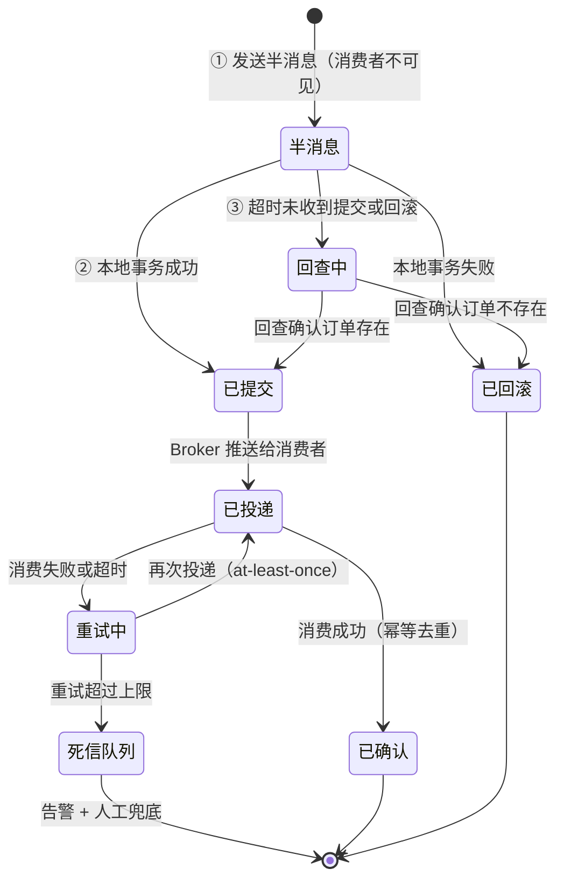

**动手玩一玩**：下面的「MQ 削峰填谷模拟器」里，后端处理能力恒定为 800 req/s。把滑块拉到 3000 req/s 以上，先**关闭 MQ** 点"发起秒杀"——看红线（失败请求）和延迟如何爆炸；再**打开 MQ** 重放一次——看绿色处理曲线被压平在 800、橙色排队曲线先涨后消。观察重点：排队长度归零所需的秒数 ≈ 积压量 ÷ 消费速率，这就是大促后"报表晚几分钟"的定量解释。

```demo mq-peak-shaving
```

**Demo 导学单**

1. 关闭 MQ，把流量拉到 3000 req/s 点"发起秒杀"：记录失败率与延迟峰值，对照正文"脆"的症状描述。
2. 打开 MQ 重放：绿色处理曲线为什么被压平在 800？橙色排队曲线何时涨到顶、何时归零？
3. 用"积压量 ÷ 消费速率"估算排队清零所需秒数，与图上实际值对账。
4. 思考边界：如果下游不是"写日报表"而是"扣库存"，这条链路还能这样削峰吗？（提示：回第 4.1 节看哪三件事用户必须当场等。）

### 4.3 最终一致性：报表晚 3 秒是可接受的

引入 MQ 就是引入了最终一致：下单成功的那一刻，日报表里**还没有**这一单。工程上要做三件事：

1. **消费幂等**：消息至少投递一次（at-least-once），消费者必须用订单号做去重（如 `INSERT ... ON DUPLICATE KEY UPDATE` 或消费记录表），否则重试会导致 GMV 重复计数。
2. **死信与告警**：重试超限的消息进死信队列，接告警，人肉兜底。
3. **业务口径确认**：和运营白纸黑字确认"日报表延迟 ≤ 5 分钟"，写进 SLA。一致性要求是谈出来的，不是猜出来的。

---

## 5. 第四刀：服务拆分——症状是"人开始互相挡路"

### 5.1 拆分的正确时机：组织疼，不是技术痒

前三刀都是技术症状驱动的。第四刀不同——**它的触发器是组织**。RetailHub 团队从 3 人涨到 8 人后的症状：

- 改报表逻辑的同学和改下单逻辑的同学天天在同一个 `main.py` 上打架；
- 报表组想加个统计字段，发布窗口被订单组的紧急修复挤掉；
- 订单链路要 7×24 高可用，报表可以允许半夜重启——但它们是同一个进程，可用性标准被迫取最高者，发布被迫取最慢者。

这就是**康威定律**在敲门：系统的沟通结构会长成组织的沟通结构。当两个方向的迭代节奏、可用性等级、技术栈诉求都分叉时，维持一个进程反而成本更高。

### 5.2 拆分粒度：按业务能力拆，不按技术层拆

第一刀只拆两个服务：**订单服务**（写路径，高可用，慢变更）与**报表服务**（读路径，可降级，快变更）。不拆用户、不拆商品——它们还没有独立的迭代节奏。

| 拆分依据 | 结果 | 评价 |
| --- | --- | --- |
| 按业务能力（订单/报表） | 边界 = 业务边界，团队自治 | ✅ 本卷采用 |
| 按技术层（Controller/Service/DAO 各一服务） | 每次需求改三层，跨服务调用爆炸 | ❌ 经典反面教材 |
| 按表拆（一张表一个服务） | 服务数量爆炸，分布式事务地狱 | ❌ 过细 |

拆分后的最小纪律：服务间只通过 API 和 MQ 事件通信，**严禁跨库直连对方的表**——一旦报表服务直连订单库，拆分就名存实亡，你得到了分布式系统的全部代价和单体的全部耦合。

还要补一个常被忽略的认知：**拆分之后，一次函数调用变成了一次网络调用**。本地调用失败就是抛异常，而远程调用有三种结局——成功、失败、**超时（不知道成没成）**；延迟从纳秒级变毫秒级；序列化、版本兼容、熔断重试全都成了新问题。这就是为什么"拆"永远是被症状逼出来的下策，而不是彰显技术的上策——你买的是组织自治，付的是分布式复杂度。

拆分前后的依赖形态对比：

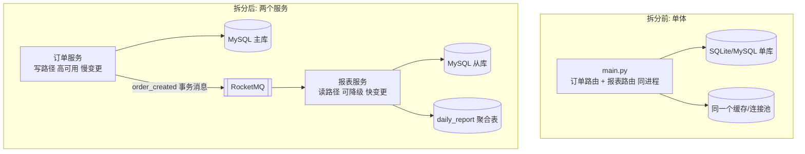

注意右图里**没有**从报表服务指向订单主库的箭头——这条"不存在的边"就是拆分纪律本身。

### 5.3 拆完之后的第一课：多实例部署与负载均衡

拆分还有一个隐藏收益：**不同服务可以有不同的副本数**。订单服务要扛大促，起 8 个实例；报表服务 2 个就够。但 8 个实例面前立刻出现一个新问题：**一个请求来了，给谁？**这就是负载均衡（Load Balancing）要回答的。

先分清你在哪一层做这件事：

| 层 | 代表 | 转发依据 | 特点 |
| --- | --- | --- | --- |
| L4 四层 | LVS、云 SLB 的 TCP 模式 | 只看 IP + 端口 | 快（不解析内容），对业务完全透明 |
| L7 七层 | Nginx、API 网关、云 SLB 的 HTTP 模式 | 能看 URL、Header、Cookie | 能按路径分流（`/orders` 给订单服务），代价是要解析报文、多一跳开销 |

再看"给谁"的调度算法，常用四种：

| 算法 | 规则 | 适用 | 坑 |
| --- | --- | --- | --- |
| 轮询 Round Robin | 挨个发 | 实例同构、请求耗时均匀 | 实例性能不均时会欺负弱机 |
| 加权轮询 | 按权重比例发 | 实例规格不同 | 权重靠人肉估 |
| 最少连接 | 发给当前连接数最少的 | 请求耗时长短不一 | 新实例加入瞬间被灌爆（冷启动） |
| 一致性哈希 | 按 key（如用户 ID）映射到固定实例 | 需要"同一用户总到同一实例"（本地缓存命中、会话亲和） | 节点增减时的迁移问题——见下面 Demo |

为什么"同一用户到同一实例"值得专门一个算法？普通取模 `hash(user) % N` 也能做到，**但只要 N 变了（加一台机器），几乎所有 key 的归属都会重排**——本地缓存集体失效、会话集体掉线。一致性哈希把节点和 key 都映射到一个环上，key 归顺时针方向的第一个节点；加减节点只影响环上相邻的一小段，迁移量从"几乎全部"降到"约 1/N"。它也是分库分表路由（3.3 节）与卷03 分区一章的共同基础。

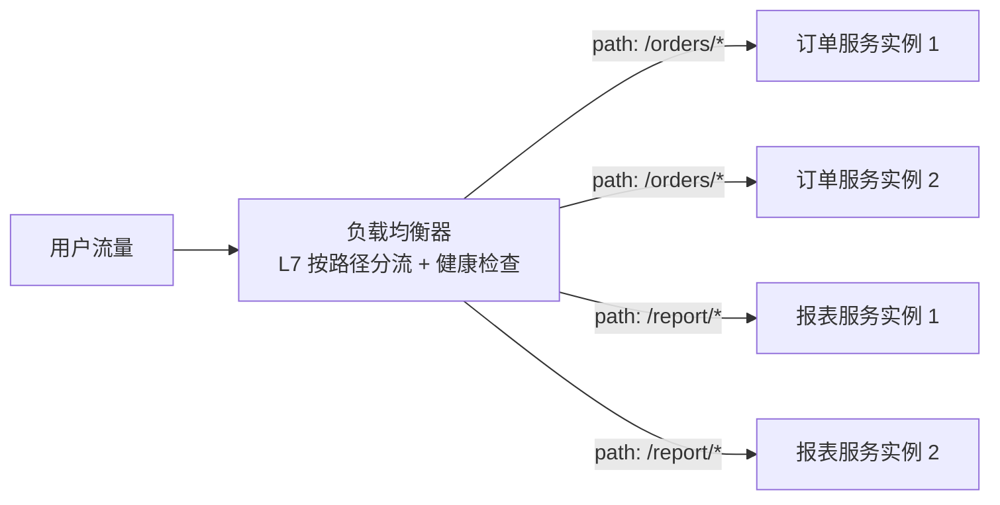

**动手玩一玩**：下面的「一致性哈希模拟器」把 12 个 key 分配到环上的节点。先用「普通取模」模式点"添加节点"，看迁移比例有多吓人；再切到「一致性哈希」重复同样操作，对比迁移量；最后打开"虚拟节点"，看各节点负载是否变得更均匀。

```demo consistent-hash
```

**Demo 导学单**

1. 取模模式下点"添加节点 D"，记录迁移的 key 比例——和"几乎全部重排"的说法对上。
2. 切到一致性哈希模式重复同一操作，迁移比例降到多少？和 1/N 的理论预期差多少？
3. 打开"虚拟节点"再看各节点分到的 key 数——虚拟节点解决的是"分布不均"还是"迁移量"？别答错。
4. 移除一个节点观察：为什么一致性哈希下只有"邻居"节点的 key 会动？

最后两个工程要点，记住名字即可：

- **健康检查**：负载均衡器周期性探测每个实例（探的就是卷01 的 `/health`），探活失败就摘流——实例挂了流量自动绕开。这才是"多实例"换来高可用的关键机制，而不是"多"本身。
- **无状态是会呼吸的前提**：负载均衡能随便分发，是因为应用无状态（卷01 §1.1 埋的线）。一旦你在实例内存里存了会话或计数，调度算法再聪明也会出错——状态要么下沉到 Redis/DB，要么靠一致性哈希做会话亲和，前者是正路。

---

## 6. 真实案例对照：淘宝架构演进之路

RetailHub 的"症状—手术"四刀是本卷的教学主线。但这条线是**设计出来的**——真实的超大规模系统是怎么走过来的？对照中国互联网史上最著名的一次架构演进（淘宝 2003–2010），你会更清楚地看到：哪些是普遍规律，哪些是时代馈赠，哪些是本卷刻意省略的弯路。

### 6.1 淘宝的真实演进：业务倒逼的跳跃式历史

以下脉络出自《淘宝技术这十年》（子柳）[^taobao10]与阿里云开发者社区《淘宝技术架构从 1.0 到 4.0 的架构变迁》[^ali-arch]：

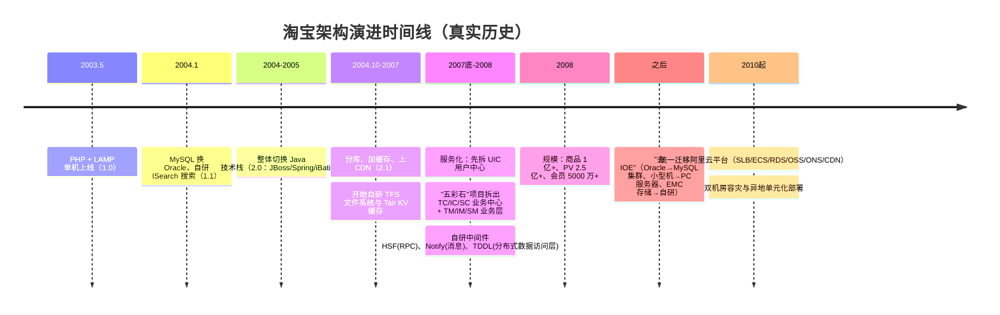

几个值得停下来看的细节：

- **服务化是被逼出来的，且有明确的先后手**：先拆出 UIC（用户中心）——因为所有业务都要查用户，它是最痛的共享瓶颈；2008 年"五彩石"项目才把交易系统拆为 TC（交易）/IC（商品）/SC（店铺）等**业务中心**（只提供原子操作）与 TM/IM/SM **业务层**。这与本卷 5.2 节"按业务能力拆"完全一致，但淘宝多走了一层："业务中心沉淀原子能力、业务层组合流程"的分层，是它后来支撑淘宝、天猫、聚划算等多前台的关键。
- **中间件全是自研**：HSF（RPC）、Notify（消息）、TDDL（分布式数据访问层）、Tair（KV 缓存）、TFS（文件系统）。2007 年没有成熟开源方案可用，**自研是当时的唯一选项，不是技术虚荣**。这一点直接解释了为什么你今天不用自研——见 6.4 节。
- **换过两次技术栈底座**（PHP→Java，IOE→开源/云）：真实演进不是"在原架构上加组件"，而是几次伤筋动骨的整体替换——昨天救过你的方案，明天可能就是要被拆掉的锚。
- **每一步的触发器都是业务数字**：2008 年商品 1 亿+、PV 2.5 亿+、会员 5000 万+——服务化不是架构师的审美选择，是这个量级下的生存选择。
- **"去 IOE"值得单独说一句**：它不是"国产替代"的口号，而是一笔经济账加一笔可控账——Oracle  license 与小型机按规模线性涨价，且黑盒出问题只能等厂商；换成 MySQL 集群 + PC 服务器后，单位成本降一个数量级，源码级问题自己能修。代价是要自建整套运维与高可用能力。**架构决策到了一定规模，本质是成本与控制权决策。**

### 6.2 网络热文的"14 次演进"：一张有用的教学模型，但不是淘宝史

你可能读过那篇流传极广的《淘宝 10 年，高并发分布式架构演进之路》[^zhihu-arch]，里面把架构演进讲成平滑的 14 步阶梯：

> 应用与 DB 分离 → 本地/分布式缓存 → 反向代理负载均衡 → 读写分离 → 按业务分库 → 大表拆小表 → LVS/F5 多级负载均衡 → DNS 轮询多机房 → NoSQL 与搜索引擎 → 大应用拆小应用 → 微服务抽离 → ESB → 容器化 → 云平台

**必须明确注明：该文是"以淘宝为例的教学化演进模型"，并非淘宝的真实路径。**[^paicoding] 把它和 6.1 节的真实历史对照，差异是结构性的：

| 维度 | 教学化 14 步模型 | 淘宝真实历史 |
| --- | --- | --- |
| 形态 | 平滑的"能力阶梯"，每次只加一种组件 | 跳跃式：两次整体换技术栈，多次并行手术 |
| 驱动 | 隐含的流量增长曲线 | 具体业务事件（大促、五彩石项目、去 IOE 决策） |
| 中间件 | 默认用现成方案 | 大量自研（HSF/Notify/TDDL/Tair/TFS）——当时没有现成方案 |
| 顺序 | 缓存很早、服务化很晚（第 10-11 步） | 缓存与分库几乎同时（2.1），服务化在商品 1 亿时才来 |
| 终点 | 容器化、云平台 | 云 + 单元化 + 自研中间件体系 |

两种读法都对，只要别混着读：**学"有哪些手段、各自治什么"时，14 步模型是很好的清单；学"什么时候该动哪一刀"时，真实历史里的业务数字和先后顺序才有参考价值。** 本卷的 RetailHub 主线采用的是后者的叙事方式（症状驱动），手段清单则与前者高度重合——这不是巧合，是同一批工程规律的两种讲法。

### 6.3 三方对照：RetailHub × 教学 14 步 × 淘宝真实里程碑

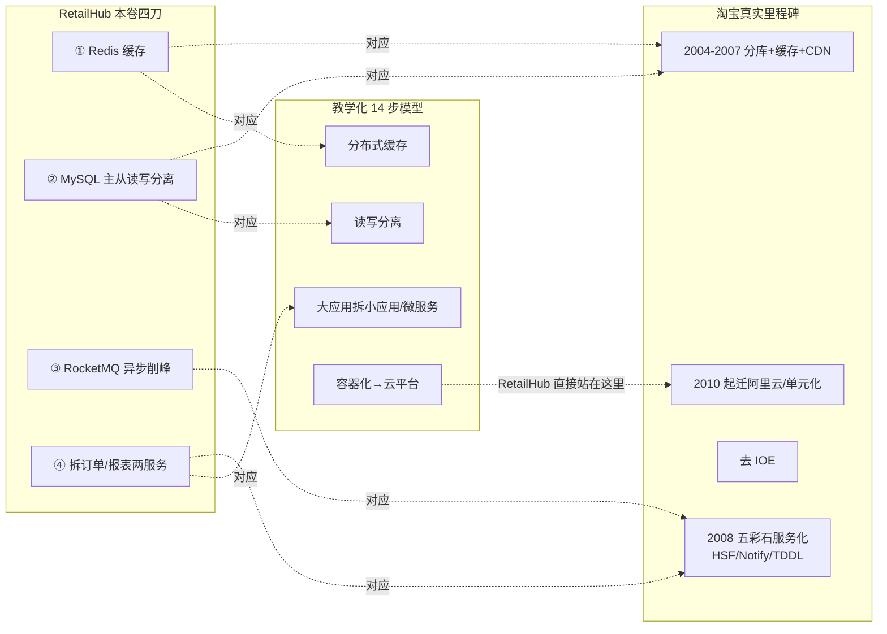

对照表（重点看最后一列——RetailHub 为什么可以"跳过"某些步骤）：

| 能力 | 教学 14 步 | 淘宝真实路径 | RetailHub | 为什么 RetailHub 可以不同 |
| --- | --- | --- | --- | --- |
| 应用与 DB 分离 | 第 1 步 | LAMP 单机上自然分离 | 卷01 起就是分离形态 | 起步即现代部署形态 |
| 缓存 | 第 2 步 | 2.1 自研 Tair | 第 2 节直接用 Redis | 开源缓存成熟，无需自研 |
| 负载均衡 | 第 3、7、8 步（反向代理→LVS/F5→DNS 多机房） | CDN→SLB→单元化 | 第 5.3 节概念级 | 流量没到；云厂商 SLB 开箱即用，真到了加配置即可 |
| 读写分离/分库 | 第 4、5、6 步 | 2.1 分库；后靠 TDDL | 第 3 节主从；分库分表"留门不进" | 云 RDS 只读实例一键开；TDDL 级需求远未出现 |
| 消息队列 | （模型中隐含于微服务化） | 2008 自研 Notify | 第 4 节直接用 RocketMQ | 开源 MQ 成熟，且有云托管版 |
| 服务化 | 第 10、11、12 步（拆小应用→微服务→ESB） | 2008 五彩石 + HSF | 第 5 节只拆两个服务 | 团队 8 人，无多前台业务；ESB 已被证明是弯路 |
| 容器化/云平台 | 第 13、14 步 | 2010 起迁阿里云 | docker-compose（实战）；K8s 在卷04 | 云原生是 2020 年代的**起点**而非终点 |

这张表传递的核心信息：**演进顺序不是物理定律，是约束条件的函数。** 淘宝在 2007 年必须自研 Tair 和 HSF，因为世界上没有；你今天 `docker compose up` 就有了 Redis 和 RocketMQ，所以你的"演进"直接跳过了"自研中间件"这整整一个时代。

### 6.4 时代差异：2020 年代起步的项目，起点在哪里

把 RetailHub 和 2003 年的淘宝放在同一把尺上，差异是三层的：

1. **云原生底座**：淘宝的终点（上云、容器化、多机房）是你的起点。SLB、RDS 主从、对象存储、CDN 都是控制台里的开关，不是架构战役。
2. **托管中间件与开源生态**：缓存、MQ、搜索、可观测全部有成熟开源实现和云托管版本。2007 年"自研 or 等死"的选择题，今天是"自建 or 托管"的成本题——难度完全不同。
3. **工程方法沉淀**：缓存三事故、最终一致、康威定律这些"当年的血泪"今天已是常识，你读本卷就是在批发前人踩坑的结论。

但有一层的难度**上升了**：选择爆炸。2007 年没的选，2020 年代每个格子都有十几个候选（MQ 就有 RocketMQ/Kafka/Pulsar……），**"不选什么"的判断力比"会用什么"更稀缺**——这正是本卷反复训练"症状驱动"的原因。

最后看一眼前方：AI 时代给这张演进地图增加了新维度——GPU 推理容量、向量检索、LLM 网关与成本治理，正在成为和"缓存、MQ、读写分离"同级别的标准演进议题。RetailHub 的故事会在卷06（AI Infra）与阶段九（企业级 Agent 工程化）继续，届时你会发现：历史没有重复，但"症状驱动演进"的思维方式原样适用。

### 6.5 另一个样本：WPS 云服务的四时代演化

淘宝是交易系统的样本，再看一个文档云服务的样本。据金山办公公开技术分享[^infoq-wps]，WPS 云服务在 2009–2022 年间走了四个时代：**单体应用 → 分布式架构 → DevOps + 容器化 → 微服务化与云原生混合云可伸缩**。第四时代的底座是金山办公自研的云原生运行环境 KAE（Kingsoft App Engine），统一管理微服务、容器与应用伸缩，承载 13600+ 微服务（测试与生产环境）、每天约 310 次更新部署，支撑 1500 亿+ 文档。

与淘宝对照，路径形状几乎一样——都是"单体起步、规模倒逼、逐代演进"，没有一步是设计出来的；区别在于**倒逼的力不同：淘宝是交易流量倒逼，WPS 是文档云服务的存储与协作规模倒逼**。这再次印证本卷的核心命题：演进顺序是约束条件的函数，不是物理定律。KAE 故事的后半段（可靠性工程与四个 9 可用性）会在卷08 展开。

---

## 7. 本卷实战：RetailHub 演进第 2 步

### 7.1 背景

承接卷01 末状态：FastAPI + SQLite 单体，3 个查询端点。本步把它演进为：**MySQL 主从 + Redis 缓存 + RocketMQ 异步日报 + 订单/报表两服务**。全部用 docker-compose 在本机编排，可一键起停、可压测验证。

按递进步骤做，每步有独立验收标准——**任何一步验收不过，不进入下一步**。

### 7.2 步骤 1：基础设施编排

- 目标：一份 `docker-compose.yml` 拉起全部组件（MySQL 主从、Redis、RocketMQ、两个服务）。
- 操作：以如下骨架为起点补全（healthcheck、volume 持久化、两个服务的 Dockerfile）：

```yaml
# docker-compose.yml —— RetailHub 演进第2步编排骨架
services:
  mysql-master:
    image: mysql:8.0
    environment:
      MYSQL_ROOT_PASSWORD: root
      MYSQL_DATABASE: retailhub
    command: --server-id=1 --log-bin=mysql-bin --binlog-format=ROW
    ports: ["3306:3306"]
  mysql-slave:
    image: mysql:8.0
    environment:
      MYSQL_ROOT_PASSWORD: root
    command: --server-id=2 --relay-log=relay-bin --read-only=1
    depends_on: [mysql-master]
  redis:
    image: redis:7
    ports: ["6379:6379"]
  rocketmq-namesrv:
    image: apache/rocketmq:5.1.4
    command: sh mqnamesrv
    ports: ["9876:9876"]
  rocketmq-broker:
    image: apache/rocketmq:5.1.4
    command: sh mqbroker -n rocketmq-namesrv:9876 --enable-proxy
    depends_on: [rocketmq-namesrv]
    ports: ["10911:10911", "8081:8081"]
  order-service:
    build: ./order-service
    environment:
      DB_MASTER: mysql-master:3306
      DB_SLAVE: mysql-slave:3306
      REDIS: redis:6379
      MQ: rocketmq-broker:8081
    ports: ["8001:8000"]
  report-service:
    build: ./report-service
    environment:
      DB_SLAVE: mysql-slave:3306   # 报表只连从库
      MQ: rocketmq-broker:8081
    ports: ["8002:8000"]
```

- 验收标准：`docker compose up -d` 一条命令拉起全部 7 个容器，健康检查通过。

### 7.3 步骤 2：MySQL 主从复制

- 目标：主库开启 binlog，从库完成复制接入并稳定追平。
- 操作：编写 `scripts/setup_replication.sql`——主库创建复制账号，从库执行 `CHANGE REPLICATION SOURCE TO ...` 并 `START REPLICA`；用 `SHOW REPLICA STATUS\G` 观察状态。
- 验收标准：正常流量下从库 `Seconds_Behind_Source` 收敛到 < 1s。

### 7.4 步骤 3：缓存化改造（Cache-Aside）

- 目标：`GET /orders/{id}` 走 Cache-Aside，三事故有对策。
- 操作：按第 2 节骨架实现——空值缓存防穿透（短 TTL）、TTL 加抖动防雪崩（300±60s）、写后删缓存。
- 验收标准：查询不存在的订单号 1000 次，数据库查询次数 ≤ 10。

### 7.5 步骤 4：MQ 异步日报

- 目标：下单链路摘掉日报统计，报表服务异步聚合。
- 操作：下单成功发 `order_created` 事务消息（按 4.2 节骨架）；report-service 消费后幂等聚合写入 `daily_report` 表（`ON DUPLICATE KEY UPDATE gmv = gmv + VALUES(gmv)`）。
- 验收标准：连续下单 100 笔后，日报表 GMV 与订单表汇总值在 5 分钟内一致；向 MQ 重复投递同一订单消息 3 次，日报表不重复计数。

### 7.6 步骤 5：读写分离

- 目标：写与写后读走主库，报表全部走从库，互不拖慢。
- 操作：order-service 写走主库、写后 3 秒内读走主库；report-service 全部走从库。验证方式：在从库上执行一条 `SLEEP` 大查询，同时压下单接口。
- 验收标准：从库执行 30 秒大查询期间，下单接口 P99 增幅 < 20%；report-service 代码中无任何指向主库的连接串。

### 7.7 步骤 6：压测对比

- 目标：用数据证明缓存这刀没白挨。
- 操作：用 `wrk` 或 `vegeta` 压 `GET /orders/{id}`，产出缓存前/后两组数据，连同命令一起贴进 README。
- 验收标准：缓存开启后 QPS 提升 ≥ 5 倍，P99 下降 ≥ 50%。

### 7.8 AI Coding 实操模式

本卷组件多、配置杂，最适合"AI 起草 + 你评审 + 每步验收"的节奏。可直接复制的提示词模板：

```
你是一名资深后端架构师。我在完成学习项目 RetailHub 演进第 2 步
（FastAPI + MySQL 8.0 主从 + Redis 7 + RocketMQ 5.1 + docker-compose）。
当前步骤：【填入步骤编号与目标，例如"步骤 3：给 GET /orders/{id} 加 Cache-Aside 缓存"】
约束：
- 读路径：先查 Redis，miss 查库并回填；写路径：先写库，提交后再删缓存
- 必须防穿透（空值缓存 TTL 60s）、防雪崩（正常 TTL 300s ± 随机 60s 抖动）
- order-service 写与写后 3 秒内的读走主库；report-service 只连从库
- 下单发 RocketMQ 事务消息；report-service 消费幂等（ON DUPLICATE KEY UPDATE）
- 不引入当前步骤之外的组件
请先列出改动文件清单与风险点，再输出完整代码/配置，最后给出本步骤的验证命令及预期输出。
```

**AI 生成初版后的人工评审清单**（逐条过）：

1. 缓存写路径确认是"删缓存"而不是"改缓存"，且删除发生在 DB 提交**之后**——AI 经常把顺序写反。
2. 空值缓存的 TTL 是否远短于正常值 TTL？让 AI 解释为什么（答不清就回 §2.3 重读）。
3. 消费端的幂等键到底是什么？手工重投 3 次同一条消息，验证 GMV 不翻倍——别只看代码"看起来幂等"。
4. `grep -r "mysql-master" report-service/`，确认没有任何指向主库的连接串（拆分纪律，§5.2）。
5. 要求 AI 为每条验证命令写出**预期输出**；实际不符时先怀疑环境（容器起全了吗？复制追平了吗？），再怀疑代码。
6. 事务消息的回查函数查的是什么、什么时候会被 Broker 调用？让 AI 答，答错就回 §4.2。

**AI Coding 验收标准**：7.9 总验收 checklist 全部打勾，且你能用三组数字向外人讲清本次演进（压测前后 QPS/P99、复制延迟、最终一致耗时）——讲不出的数字就是没有验收。

### 7.9 总验收标准（checkbox，全部满足才算过）

- [ ] `docker compose up -d` 一条命令拉起全部 7 个容器，健康检查通过
- [ ] 从库 `Seconds_Behind_Source` 在正常流量下 < 1s
- [ ] 压测：缓存开启后 `/orders/{id}` 的 QPS 提升 ≥ 5 倍，P99 下降 ≥ 50%（附 wrk 输出截图/文本）
- [ ] 查询不存在的订单号 1000 次，数据库查询次数 ≤ 10（空值缓存生效）
- [ ] 连续下单 100 笔后，日报表 GMV 与订单表汇总值在 5 分钟内一致（最终一致达成）
- [ ] 向 MQ 重复投递同一订单消息 3 次，日报表不重复计数（幂等生效）
- [ ] 从库执行 30 秒大查询期间，下单接口 P99 增幅 < 20%（读写隔离生效）
- [ ] report-service 代码中无任何指向主库的连接串（拆分纪律）

---

## 8. 常见误区

1. **"微服务是目标，单体是耻辱"** —— 颠倒因果。单体是起点，拆分是被症状逼的；没有被症状逼就拆，等于主动请病。
2. **把缓存当数据库用** —— 缓存里存唯一数据、不做持久化来源管理，Redis 一重启业务失忆。缓存永远是"可重建的副本"。
3. **写后更新缓存而不是删除缓存** —— 并发下旧值覆盖新值，而且更新缓存在"写后无人读"时是纯浪费。
4. **读写分离后忽略写后读** —— 用户刚下单就查不到单，是读写分离项目最常见的线上事故，且必现于演示环境。
5. **为了削峰把不该异步的也异步** —— 扣库存、支付这类用户必须当场知道结果的步骤异步化，等于把一致性难题从数据库搬到业务层，代价翻倍。
6. **迷信 MQ 的"消息不丢"** —— at-least-once 意味着会重复，不意味着恰好一次。消费端不做幂等，MQ 再可靠也白搭。
7. **按技术层拆服务** —— 拆出 Controller 服务、DAO 服务，一次需求改三个 repo，是拆分失败的第一名。
8. **在症状出现前分库分表** —— 十万日单做分库分表，等于给自己发配分布式事务边疆。
9. **在应用内存里存状态还想要负载均衡** —— 会话存在实例 1 的内存里，请求被分到实例 2 就"掉登录"。状态不下沉，弹性都是假的（见 5.3 节）。

---

## 9. 自测清单（10 项）

1. 能用一句话说清单体的三堵墙各自的可观测症状吗？
2. Cache-Aside 读路径的完整步骤（含 miss 回填）能默写吗？
3. 为什么写后是"删缓存"而不是"改缓存"？并发竞态发生在哪一步？
4. 穿透、击穿、雪崩三者的区别与各自首选对策是什么？
5. 读写分离后"刚写完读不到"的三种解法及其成本排序？binlog 异步复制为什么是这个坑的根源？
6. 为什么 RetailHub 本卷明确**不做**分库分表？留门指的是什么？hash 与 range 两种分片路由各自的代价是什么？
7. RocketMQ 事务消息解决了什么问题？Broker 回查查的是什么？三种投递语义里工程上该信哪一种？
8. 消费幂等的两种实现方式？不幂等会导致什么业务后果？
9. 康威定律如何决定拆分时机？按业务能力拆和按技术层拆的后果差异？
10. L4 与 L7 负载均衡的差别？一致性哈希比普通取模多解决了什么问题、虚拟节点又解决什么？本卷每一次演进的"症状—手术—验收"三段式，能脱离笔记复述吗？

---

## 参考与脚注

[^fenix]: 周志明《凤凰架构：构建可靠的大型分布式系统》，在线版 https://icyfenix.cn （"演进史观"见导言及第一部分）。
[^ddia-ch5]: Martin Kleppmann《数据密集型应用系统设计》（Designing Data-Intensive Applications，DDIA），第 5 章「复制」。
[^taobao10]: 子柳《淘宝技术这十年》，电子工业出版社，2013。
[^ali-arch]: 阿里云开发者社区《淘宝技术架构从 1.0 到 4.0 的架构变迁》，https://developer.aliyun.com/article/660518。
[^paicoding]: paicoding.com 分布式架构教学模型《淘宝 10 年，高并发分布式架构演进之路》——注意：这是"以淘宝为例的教学化演进模型"，并非淘宝真实路径。
[^zhihu-arch]: 知乎技术稿 https://zhuanlan.zhihu.com/p/505738524 （编辑注：原文抓取受限，待确认主题后补充精要）。
[^infoq-wps]: InfoQ《超 1500 亿个文档，文档云原生时代的"规模之道"》（2022，金山办公技术分享）。

---

## 10. 下卷预告

缓存、主从、MQ、拆分解决的是"服务怎么扛住增长"，但数据本身的难题才刚刚开始：订单库该单主复制还是无主复制？单表大了怎么分区、分区后热点怎么办？下单防超卖到底要什么隔离级别？报表该用批处理还是流处理？这些问题的答案有一套系统的思想框架——《Designing Data-Intensive Applications》。卷03 我们将逐章精炼 DDIA，并为 RetailHub 产出一份正式的《数据架构设计文档》和一个可运行的"防超卖隔离级别对比实验"。
