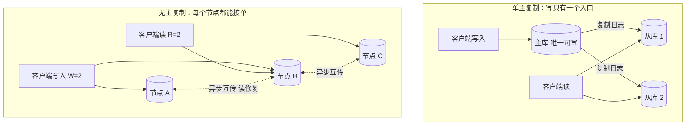
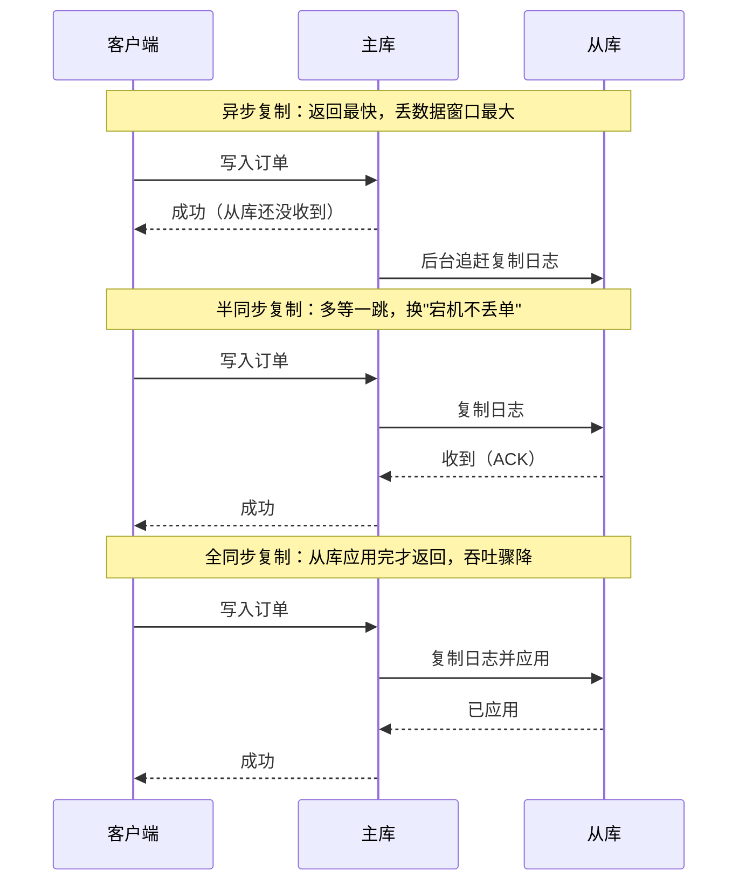
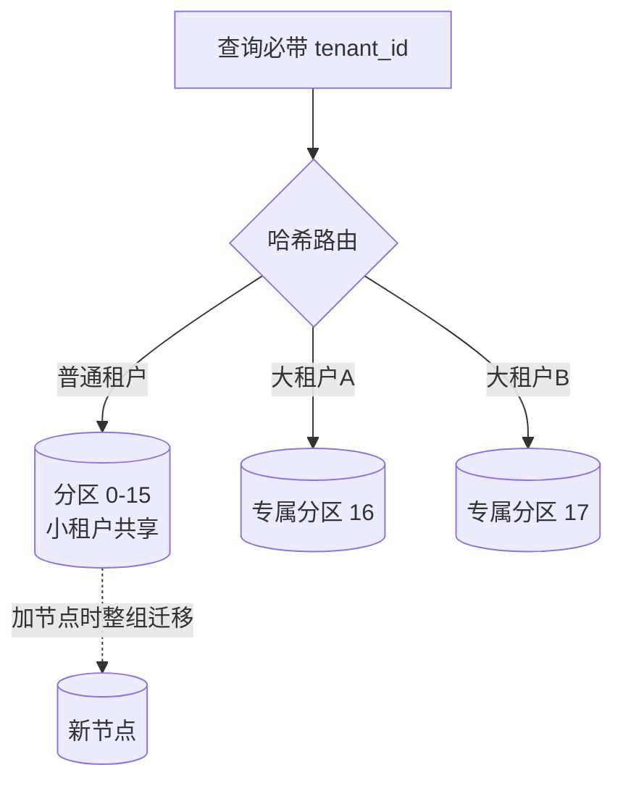

# 卷03-1：存储引擎、编码演进、复制与分区——DDIA 核心思想（上）

> 导语：卷02 我们把 RetailHub 拆成了"订单服务 + 报表服务"，配上 MySQL 主从、Redis、RocketMQ。架构图变好看了，但一批更深的问题浮上来了：订单库要扩容，单主复制还撑得住吗？商品数据 schema 三天两头变，关系表还合适吗？行为日志每天几千万条，往哪存、怎么算？这些问题不是"哪个中间件好用"的问题，而是**数据系统底层权衡**的问题。《Designing Data-Intensive Applications》（DDIA）正是讲这套权衡的教科书。本页是卷03 的上篇，精炼其第 1-6 章核心思想——三大目标、数据模型、存储引擎、编码演进、复制、分区；事务、一致性与批流处理在下一页，本卷实战也在下一页。

> **🧭 学前预备（给从卷02 直接过来的你）**
> - **需要的前置**：卷01 的磁盘/IO 直觉（随机 IO 为什么慢、顺序 IO 为什么快）；卷02 的缓存与读写分离实操——尤其是"主从延迟"那个坑，本页 §5 会把它从踩坑经验升级成系统理论。
> - **本页三个学习目标**：① 算得清 B-Tree 与 LSM-Tree 的三笔放大账（写放大/读放大/空间放大）；② 能为消息体与 schema 变更定下"编号不动、只加不改"的兼容纪律；③ 能为订单库与行为日志分别选出复制拓扑与分区方案，并说出被淘汰方案的理由。
> - **读不下去时的 fallback**：§3 的"三笔放大账"是全页理论密度最高点——第一遍只需记住"LSM 用后台合并换写入速度、B-Tree 原地更新读更稳"这个结论，然后直接跳到 §5 复制（与卷02 主从实操衔接最紧）和 §6 分区的交互 Demo，手感建立后再回看 §3 的表格。本节标注"可二刷"不算逃兵，是官方推荐路线。

---

## 1. 可靠、可扩展、可维护：数据系统的三大目标[^1]

DDIA 开篇把纷繁的技术名词收敛到三个评价维度：

- **可靠性（Reliability）**：出了故障（硬件宕机、软件 bug、人为误操作）系统仍能正确工作。注意"容错"≠"不出错"，是"错了也不瘫、不丢、不撒谎"。
- **可扩展性（Scalability）**：负载增长时有合理的应对办法。关键动作是**先定量描述负载**（用 QPS、读写比、数据量、热点分布），再定量描述性能（延迟看分位数 P99，不看平均值——平均值会把被拖死的用户藏进大多数）。
- **可维护性（Maintainability）**：后来的人能愉快地在系统上工作——可操作性、简单性、可演进性。

**落到 RetailHub**：卷02 的每次演进其实都能映射到这三个目标——缓存与读写分离是可扩展性，MQ 重试与死信是可靠性，拆分服务是可维护性。本卷的设计文档将用这三个维度做评审框架：每个决策都必须回答"它增进了哪个目标、牺牲了哪个目标"。

---

## 2. 数据模型与查询语言：关系、文档、图[^2]

数据模型决定你怎么"想"数据。三种主流模型的取舍：

| 模型 | 擅长 | 短板 | RetailHub 候选场景 |
| --- | --- | --- | --- |
| 关系模型 | 多对多、JOIN、强 schema、事务 | schema 变更重，嵌套数据要拆表 | 订单、库存、账务（结构化、要事务） |
| 文档模型（JSON） | schema 灵活、局部性好（一次取整棵） | JOIN 弱、多对多尴尬 | 商品（SKU 属性随品类千变万化） |
| 图模型 | 关系本身是一等公民、多跳查询 | 通用查询与运维生态弱 | 未来："用户-商品-店铺"推荐关系 |

RetailHub 的决策很典型：**订单进 MySQL**（事务和 JOIN 是刚需）；**商品用 JSON 列**（MySQL 8 的 `JSON` 类型）或独立文档库，因为 3C 商品的属性（内存、尺寸）和生鲜商品的属性（产地、保质期）根本无法共用一个宽表；图模型暂不上，但埋点数据里保留实体关系，留门。

> 核心心法：**没有最好的模型，只有与访问模式最匹配的模型**。选型时先列出你的 Top-5 查询，再看哪个模型让它们最自然。

---

## 3. 存储与检索：LSM-Tree vs B-Tree[^3]

数据库怎么把数据落到磁盘，直接决定读写特性。两大流派：

- **B-Tree**（InnoDB 采用）：原地更新的页结构。读快而稳（每次读走固定层数），写入随机 IO 多、有写放大。适合**读密集、延迟敏感**的场景。
- **LSM-Tree**（RocksDB、Cassandra、ClickHouse 的底层思想）：先写内存 MemTable + 追加式日志（WAL），攒够一批顺序刷成磁盘上的不可变段（SSTable），后台合并压缩。写吞吐极高（全顺序 IO），读要查多层、靠布隆过滤器加速。适合**写密集、日志型**场景。

**再往下挖一层：两种引擎各自的"代价账单"。** 新手只背"B 树读快、LSM 写快"，架构师要算清三笔放大账——**写放大**（写 1 字节实际搬动多少字节）、**读放大**（读 1 条记录实际查多少处）、**空间放大**（存 1 份数据实际占几份磁盘）：

| 维度 | B-Tree（InnoDB） | LSM-Tree（RocksDB） |
| --- | --- | --- |
| 写路径 | 沿树定位到目标页 → 原地改页；先写 redo log 再刷脏页 | 追加 WAL → 写 MemTable（内存有序结构）→ 攒满顺序 Flush 成 SSTable |
| 写放大 | 改 1 行可能整页（16KB）重写；页分裂时更糟 | 一条数据在多层 Compaction 中被反复重写（常达 10 倍级） |
| 读放大 | 低且稳：B+ 树 3~4 层，一次查询固定几次 IO | 高且抖动：查 MemTable + 多层 SSTable，靠布隆过滤器挡掉大部分空查 |
| 空间放大 | 页分裂留下半满页，长期碎片化 | Compaction 期间新旧段并存，瞬时占用可达 2 倍 |
| 最怕什么 | 随机写洪峰：缓冲池刷脏页跟不上 | Compaction 被写入压垮：触发写停滞（write stall），写入被强行刹车 |

三个关键机理，讲给未来的自己：

- **B 树原地更新为什么不怕崩**：InnoDB 先写 redo log（顺序追加）再刷数据页（随机写），崩溃后用 redo 重放——"先记小账，再改大账"。WAL 这个思想两大流派是共用的，区别只在**主数据结构**是原地改页还是追加不可变段。
- **LSM 的读为什么不会真的查几十个文件**：每个 SSTable 内部有序且带稀疏索引，再加**布隆过滤器**（一个"说没有就一定没有、说有可能有"的概率结构，用几个哈希位换来跳过整层文件），绝大多数层一次内存判断就跳过。读放大的真实数值取决于层数控制，而不是文件个数。
- **Compaction 是"代价推迟器"，不是"代价消除器"**：写入时的爽快是借来的，后台合并要连本带息地还。Leveled 策略（RocksDB 默认）层数少、读放大低，但每层反复重写、写放大高；Tiered 策略（Cassandra 常用）段攒多了才合，写放大低、读放大高。**没有免费午餐，只有代价在读写之间的再分配**——所以问"哪个引擎好"之前，先答"我的读写比是多少"。

**落到 RetailHub**：订单库用 InnoDB（B-Tree）——读多写少、延迟敏感；行为日志（每天几千万条点击事件）若用 MySQL 直存会被随机写拖死，这正是 LSM 系存储（或列存 ClickHouse，卷06 还会深挖）的主场。一个实操洞察：**先想清楚读写比和写入模式，存储引擎的争论往往自动结束**。

> **🎮 动手模拟：LSM-Tree vs B-Tree 写入路径。** 点"写入一条数据"：左侧看 B-Tree 如何沿树定位到目标页、原地更新（红色=随机 IO），右侧看 LSM 如何先追加 WAL 与 MemTable、攒满 4 条 Flush 成不可变 SSTable、段数 ≥3 时触发 Compaction 合并。连点 20 次（或点"自动写入 20 条"）后对比两侧 IO 计数器——B-Tree 每条都是随机 IO，LSM 几乎全是顺序 IO，代价被推迟到了后台 Compaction 和"读要查多层"。

```demo lsm-btree
```

**Demo 导学单**
1. 连点 5 次"写入一条数据"，记录两侧 IO 计数器：B-Tree 侧的随机 IO 次数与 LSM 侧的顺序 IO 次数各是多少？比例说明了什么？
2. 写到第 4、8、12 条时暂停，观察 LSM 侧 SSTable 段数的变化，用自己的话回答：Flush（刷段）的触发条件是什么？
3. 等段数 ≥3 触发 Compaction 后，对比合并前后 LSM 侧"读一条数据要查的层数"——Compaction 偿还的是哪笔债？
4. 点"自动写入 20 条"后看总账：LSM 把 B-Tree 的随机 IO 变成了什么？代价被推迟到了哪两个地方（提示：后台与读路径）？
5. 合上课文回答：如果 RetailHub 把订单表也迁到 LSM 引擎，哪类查询会第一个出来抗议？为什么？

---

## 4. 编码与演进：schema 在变，数据是永恒的[^4]

代码可以随时发布，但**旧数据会和新代码共存很久**（滚动升级时新旧版本同时在跑）。因此数据编码格式必须满足：

- **向后兼容**：新代码能读旧数据（必选项）。
- **向前兼容**：旧代码能读新数据（滚动升级期必需）。

| 格式 | 兼容性 | 体积/性能 | RetailHub 用途 |
| --- | --- | --- | --- |
| JSON | 弱（无 schema 约束，靠自律） | 大、解析慢 | 对外 API、配置 |
| Protobuf / Avro | 强（schema 演进规则内建） | 小、快 | 服务间通信、MQ 消息体 |
| 数据库 DDL | 居中（在线变更工具辅助） | —— | 表结构 |

**落到 RetailHub**：卷02 的 `order_created` 消息体是 JSON——当报表服务要给消息加个 `channel` 字段而订单服务还没升级时，JSON 靠"忽略未知字段"的自律勉强兼容；但字段改名、类型变更就是事故。设计文档中将规定：**MQ 消息体改用 Protobuf 并建 schema 登记（Schema Registry 的朴素版：仓库里的 proto 文件 + 评审）**，新增字段只加不改。

**Protobuf 凭什么敢承诺兼容？关键在字段编号。** Protobuf 序列化时不存字段名，只存"字段编号 + 类型 + 值"。于是兼容规则变成了几条可机械执行的纪律：

| 操作 | 兼容性 | 原因 |
| --- | --- | --- |
| 新增字段（用新编号） | ✅ 双向兼容 | 旧代码读到未知编号直接跳过；新代码读旧数据时新字段取默认值 |
| 字段改为 `optional`/`repeated` 语义内微调 | ⚠️ 看情况 | 要查编解码规则表，别想当然 |
| 字段改名 | ✅ 兼容 | 线上字节流里没有名字，名字只是给人看的 |
| 删除字段 | ❌ 危险 | 除非先把该编号 `reserved` 封存，否则后人复用编号会解读出灵异数据 |
| 复用旧编号给新字段 | ❌ 事故 | 旧代码会把新数据按旧字段解读——"安静的错误"最难查 |
| 改字段类型（如 int32→string） | ❌ 事故 | 类型变了，解码直接错位 |

一句话：**schema 演进自由的边界，是"编号和类型的稳定性"**。JSON 没有这层契约，全靠团队自律；而自律在大促前夜是最容易崩的东西。

---

## 5. 复制：单主、多主、无主[^5]

复制的目的：就近读（降低延迟）、读扩容、容灾。三种拓扑：

| 拓扑 | 一致性 | 写可用性 | 冲突 | 典型产品 | RetailHub 适配 |
| --- | --- | --- | --- | --- | --- |
| 单主 | 主强、从最终一致 | 主挂了写中断（需切换） | 无 | MySQL 主从、PG 流复制 | ✅ 订单库：单地域、要强写一致 |
| 多主 | 最终一致 | 多机房均可写 | 需要冲突解决 | 跨地域部署 | ❌ 冲突解决成本远超收益 |
| 无主（Dynamo 风） | 可调（quorum） | 极高，节点挂了照写 | 读修复/版本向量 | Cassandra、DynamoDB | 候选：行为日志（可丢可补、写量极大） |

把两种极端拓扑画在一张图上对比，"写入口的数量"一眼可见：



无主拓扑里"可调一致性"的数学基础是 quorum：**当 W + R > N 时（如 N=3、W=2、R=2），一次读总能碰到至少一个持有最新值的节点**。代价是写入口多了，并发写冲突要靠版本向量/读修复事后和解。

**复制的数据是怎么流过去的？三种日志形态，决定从库看到什么。**

| 复制日志形态 | 原理 | 优点 | 坑 |
| --- | --- | --- | --- |
| 语句复制（statement） | 把执行的 SQL 原样发给从库重放 | 日志小 | 非确定性函数（`NOW()`、自增、无 ORDER BY 的 LIMIT）在主从两边结果可能不同 |
| 行复制（row-based） | 记录"哪一行从什么值改成什么值" | 确定性强，主从一致 | 日志大（一条 UPDATE 改百万行就是百万条日志） |
| 逻辑日志（WAL 级） | 存储引擎层的物理/逻辑混合日志 | 与引擎深度耦合、高效 | 版本绑定紧，跨版本复制受限 |

MySQL 默认用行复制（binlog），PostgreSQL 用 WAL 流复制——名字不同，问题相同：**主库提交和从库应用之间有一段永远不为零的时间差，而你的业务代码必须决定"忍不忍"这段差**。

**同步级别是三档旋钮，不是开关。** 同样一笔"写入成功"，三种复制模式下的含义完全不同：



| 模式 | "写入成功"的含义 | 主库宕机丢数据？ | 写延迟 | 适用 |
| --- | --- | --- | --- | --- |
| 异步 | 只写进主库 | 可能丢最后一批 | 最低 | 行为日志等可丢可补数据 |
| 半同步 | 至少一个从库**收到**日志 | 不丢（日志已在从库） | +1 跳网络 | 订单、账务（MySQL 生产标配） |
| 全同步 | 全部从库**应用完** | 不丢 | 最慢的从库说了算 | 极少用，除非监管要求 |

**多主复制的冲突长什么样，为什么 RetailHub 躲着走？** 两个机房各有一个主库，北京用户把商品库存改为 5，同一毫秒上海用户改为 6——两个主库各自提交成功，互相同步时发现"同一行两个值"。解决策略无非三种：后写胜出（LWW，依赖时钟，卷08 会讲为什么危险）、应用层合并（购物车可以并集，库存怎么并？）、人工解决（不敢想）。**冲突不是异常而是多主的常态**，这就是"冲突解决成本远超收益"的定量含义。

复制延迟带来的读怪象（第 5 章的精髓之一），零售场景全都遇得到：

- **读己之写（read-your-writes）**：用户下单后立刻刷新看不到订单——卷02 已用"写后读主"解决。
- **单调读**：用户两次刷新，第二次看到的数据反而更旧（打到了落后的从库）——按用户粘住同一个从库可解。
- **一致前缀读**：跨分区的因果顺序被打乱——卷03 分区之后才需要面对。

> **🎮 动手模拟：主从复制延迟与"读己之写"。** 选"异步复制"点"写入一笔订单"——主库立即 +1，两个从库沿时间轴慢慢追赶。写入后**立刻**点"从从库读我的最新订单"：大概率看到"订单不见了"的红色警告，这就是用户视角的"付完款刷新列表是空的"。再勾选"写后读主"重放，体会卷02 那条修复原则；最后趁从库未追平时点"主库宕机"——异步模式下已提交却未传走的写入永久丢失，这就是订单库必须开半同步的理由。

```demo replication-lag
```

**Demo 导学单**
1. 异步模式下写入一笔订单，**1 秒内**点"从从库读我的最新订单"，记录结果；隔 3 秒再读一次，结果变了吗？中间的窗口期对应课文哪个概念？
2. 连写 5 笔后立刻读，"读到旧值"出现的概率和单笔写入后立刻读相比如何？解释"复制延迟窗口"与写入速率的关系。
3. 勾选"写后读主"后再读：为什么永远能读到最新值？这个修复方案让哪部分读流量失去了"从库扩容"的好处？
4. 切换到半同步模式，比较"本次写入客户端等待"的毫秒数与异步模式——多等的这一跳换来了什么承诺？
5. 重置后选异步模式，连写 5 笔，**趁从库未追平**点"主库宕机"：丢失了几笔？换半同步重放同样的操作，对比结果并解释零售订单库的选择。

**落到 RetailHub 的论证**：订单是交易数据，错一单就是钱——选单主，接受主库故障时分钟级写中断，用半同步复制缩小丢数据窗口；行为日志是"算错了重跑一遍就行"的数据——选无主/高写可用存储，换写吞吐。

---

## 6. 分区：数据大了之后的横向拆分[^6]

分区的动机：单机装不下、单机扛不住。两个核心难题：

**难题一：怎么分。**
- **按键范围分区**：区间查询友好，但热点集中（按时间分区，所有写都打最新分区）。
- **按键哈希分区**：负载均匀，但牺牲区间查询（要广播到所有分区）。

**难题二：再均衡与热点。** 数据涨了要加节点，分区要搬动——策略上选"固定数量分区，节点间整组迁移"（Riak/ES 的思路），避免按节点数取模导致的全量重洗。热点则需要识别"明星 key"（比如某爆款商品），用加随机前缀打散等手段。


关键数字感受一下：12 个分区、加 1 个节点，只搬 3 个分区（25%）；若按"节点数取模"，4 节点变 5 节点意味着约 80% 的 key 要换分区——这就是"固定分区数"策略的价值。

**还有两个新手想不到、上线就踩的坑，一并讲透：**

- **跨分区查询（scatter-gather）**：哈希分区后，"查订单 #12345"很快（分区键路由），但"查用户 U 最近 30 天的全部订单"如果分区键不是 user_id，就要把查询**广播到所有分区**再合并——N 个分区就是 N 倍扇出，任何一个分区慢，整体延迟就被拖到它的水平（尾延迟放大）。**分区键的选择本质上是"你最常按什么维度查"的承诺**，选了就不能轻易反悔。
- **二级索引的两种活法**：分区键以外的查询条件需要二级索引。**本地索引**（每个分区各存自己的索引）写入便宜，但按索引查询要 scatter-gather 全部分区；**全局索引**（索引本身也分区，按索引词路由）查询快，但写一行数据可能要跨分区更新索引项——写放大加分布式事务问题。读多写多不可兼得，又是那笔熟悉的账。

**落到 RetailHub**：订单表按 `tenant_id` 哈希分区（多租户 SaaS 的天然分区键，查询必带租户条件）；但要警惕大租户热点——头部租户单量占 40%，哈希均匀不等于负载均匀，方案是大租户单独占分区（"VIP 租户隔离"），这既是技术决策也是商业决策。



> **🎮 动手模拟：分区热点与打散策略。** 默认"纯哈希 + 大租户占 40% 流量"，点"自动持续注入"：看分区 3 被大租户恒定命中、率先冲过红色容量线开始拒绝请求，而旁边 7 个分区大量闲置——**哈希均匀 ≠ 负载均匀**。然后**不清零**直接切换"随机前缀打散"或"VIP 专属分区"继续注入，对比倾斜比如何回落，再回头读课文的"VIP 租户隔离"方案。

```demo partition-hotspot
```

**Demo 导学单**
1. 纯哈希策略下注入到分区 3 打红：记录"负载倾斜比"（最热/平均）峰值。大租户 40% 的流量去了哪里？同节点的另一个分区为什么也被拖累？
2. 切到"哈希 + 随机前缀打散"继续注入：大租户流量被拆到了几个分区？倾斜比降到多少？课文说这种策略的代价在哪个操作上？
3. 切到"VIP 专属分区"：普通租户的分区水位有什么变化？为什么说这"既是技术决策也是商业决策"？
4. 取消勾选"大租户"重放：三种策略还有区别吗？由此总结：热点问题的前提是流量的什么特征？
5. 结合 §6 课文的"再均衡"回答：如果直接给过热节点"再加一台机器"，不做策略调整，能解决大租户热点吗？为什么？

---

## 参考与脚注

[^1]: Martin Kleppmann《Designing Data-Intensive Applications》（中译《数据密集型应用系统设计》）第 1 章"可靠、可扩展、可维护"。
[^2]: 同上，第 2 章"数据模型与查询语言"。
[^3]: 同上，第 3 章"存储与检索"——B-Tree 与 LSM-Tree 的写路径、三种放大与 Compaction 策略。
[^4]: 同上，第 4 章"编码与演进"——向前/向后兼容与 Protobuf 字段编号规则。
[^5]: 同上，第 5 章"复制"——单主/多主/无主、复制日志形态、同步级别与读己之写等一致性补丁。
[^6]: 同上，第 6 章"分区"——哈希/范围分区、固定分区数再均衡、热点与二级索引。

---

➡️ 下一页：[卷03-2：事务、一致性与批流处理——DDIA 核心思想（下）与 RetailHub 实战](卷03-2-事务一致性与实战.md)
