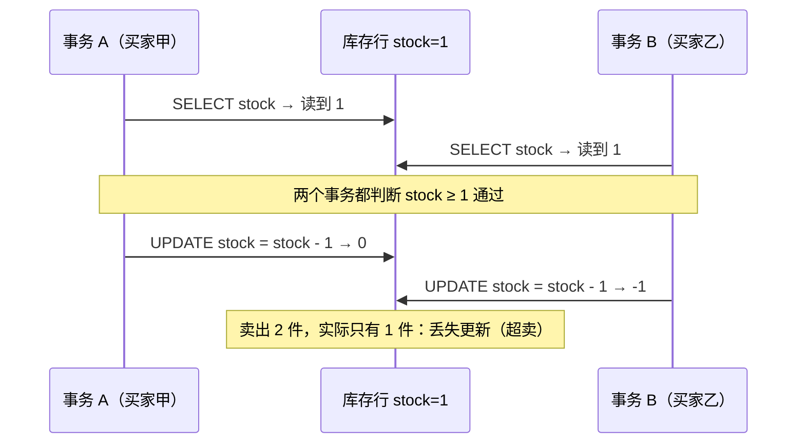
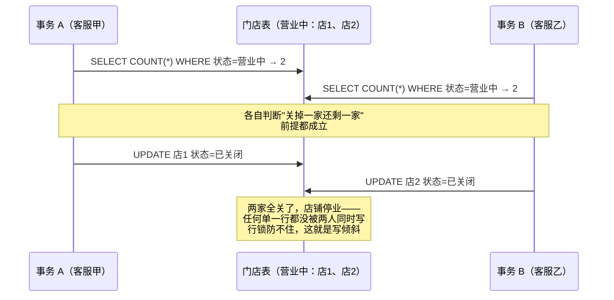
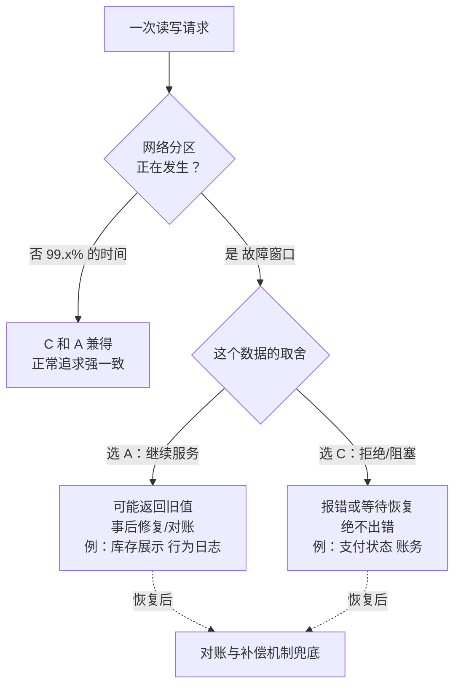
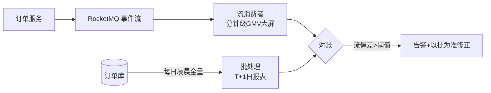

# 卷03-2：事务、一致性与批流处理——DDIA 核心思想（下）与 RetailHub 实战

> 导语：上一页解决了"数据怎么存、怎么复制、怎么拆分"，本页回答"并发与故障之下，数据还对不对"：事务与隔离级别（用下单超卖讲透）、分布式系统的时钟/网络/故障检测、线性一致与 CAP 的真实含义、批处理与流处理的分工（对应 DDIA 第 7-11 章）。随后是本卷实战：产出一份《数据架构设计文档》和一个可运行的"防超卖隔离级别对比实验"，文末附常见误区与自测清单（两者覆盖卷03 全卷两页内容）。提醒：§9 的线性一致/CAP 与卷04-2 的 Raft 是全路径的理论高点，标注"可二刷"——第一遍建立直觉即可，卷04-2 会把它落到工程机制上。学完本页即达成卷03 末状态：你为 RetailHub 数据规模增长重做了一套有论证、有取舍的存储/复制/分区/一致性设计。

---

## 7. 事务与隔离级别：用"下单超卖"讲透[^7]

事务是数据库给你的"把多个读写打包成一个可靠单元"的承诺。但完全的串行化太贵，于是有了隔离级别的妥协阶梯：

| 隔离级别 | 防住的异常 | 防不住的 | MySQL(InnoDB) | PG |
| --- | --- | --- | --- | --- |
| 读已提交 RC | 脏读、脏写 | 不可重复读、丢失更新 | 可选 | 默认 |
| 可重复读 RR | + 不可重复读（快照） | 写倾斜（write skew） | **默认** | 可选 |
| 可串行化 | 全部 | ——（性能代价） | 可选 | SSI 实现 |

**先把"异常图鉴"认全，再谈防法。** 隔离级别防的是下面这些"并发事故类型"，每种都有明确的案发现场：

| 异常 | 一句话案发现场 | 零售版举例 |
| --- | --- | --- |
| 脏读 | 读到别人**还没提交**的数据 | 看到对方事务中"已取消的订单"并据此发货 |
| 脏写 | 覆盖别人还没提交的写入 | 两个事务同改库存行，前一个的扣减被直接抹掉 |
| 不可重复读 | 同一事务内两次读同一行，值变了 | 下单事务里先读库存 10，复核时变 3，前后口径对不上 |
| 幻读 | 同一事务内两次范围查询，**行数**变了 | "统计今日订单数"两次结果不同，因为别的事务刚插了新单 |
| 丢失更新 | 两个事务"读-改-写"同一行，后写覆盖先写 | 本节主角：超卖 |
| 写倾斜 | 各自读取的数据决定写入合法性，读都合法、合起来违规 | 两个客服同时"关掉最后一个营业门店"（见本节末） |

**RR 是怎么做到"不加锁还能重复读"的？答案：MVCC（多版本并发控制）。** InnoDB 给每行数据挂着一条版本链（配合 undo log），事务开启时拿到一个"快照点"：之后所有读都只看得见**快照点之前已提交**的版本，别的事务随后怎么改都与你无关。写操作则走当前最新版本并加行锁。这套"读走快照、写走加锁"的分离，让普通 SELECT 完全不阻塞写——这是 MySQL 高并发读性能的根基。代价也写在设计里：**快照读解决的是"看到的口径一致"，解决不了"写的时候撞上别人也在写"**——所以丢失更新、写倾斜在 RR 下照样发生，必须靠原子操作、显式锁或串行化补位。PG 的可串行化（SSI）更聪明：不是真串行执行，而是让事务跑在快照上、**检测读写依赖形成的危险环**再回滚其中一个，用"乐观检测"逼近串行的正确性。

**零售超卖场景**：下单扣库存是"读库存 → 判断 → 写回"三步。两个并发事务各读到 stock=1，都判断通过，都写回——卖出 2 件，库存只剩 1。这是**丢失更新**异常。用时序图把"灾难发生的瞬间"定格：



防法有三：

1. **原子操作**（首选，最简单）：`UPDATE sku SET stock = stock - ? WHERE id = ? AND stock >= ?`，影响行数为 0 即失败。让数据库的单行锁帮你串行化，甚至不依赖隔离级别。
2. **显式锁**：`SELECT ... FOR UPDATE` 锁住库存行再走逻辑。灵活但锁持有时间长，吞吐差。
3. **可串行化隔离**：数据库兜底检测冲突并回滚一个事务。正确但要处理重试，且吞吐最低。

工程排序：**能用原子操作就不用锁，能用锁就不上串行化**。本卷实战会用一个可运行实验亲眼看这三种写法在并发下的差别——读十遍"丢失更新"的定义，不如亲手让它发生一次再消灭它。

> **🎮 动手模拟：隔离级别与超卖。** 库存=1，两个并发事务同时抢。先用"Read Committed · 先读后写"模式**单步执行**，亲眼看两个事务都读到 stock=1、都通过判断、库存被扣成 -1（超卖发生）；再切到"原子 UPDATE"模式重放——第二个事务的 UPDATE 被行锁挡住，等锁释放后条件 `stock >= 1` 不再成立，影响 0 行、安全失败。注意结论：防住超卖的是**原子操作带来的单行互斥**，与数据库默认隔离级别无关。

```demo isolation-oversell
```

**Demo 导学单**
1. 选"Read Committed · 先读后写"模式，用"单步执行"逐步走：在第几步时两个事务都读到了 stock=1？灾难在哪一步变得不可挽回？
2. 继续单步到结束：库存最终是几？`order_log` 里有几条订单？这正是哪种并发异常（对照上文异常图鉴）？
3. 点"重置"，切到"原子 UPDATE · 串行化效果"模式再单步走：第二个事务的 UPDATE 卡在哪一步？等锁释放后 `stock >= 1` 条件还成立吗？
4. 对比两种模式的最终库存与成功订单数，回答：防住超卖的是"更高的隔离级别"还是别的什么机制？
5. 思考题：如果把 naive 模式的 SELECT 改成 `SELECT ... FOR UPDATE`（课文 §7 防法二），Demo 里哪个环节会发生变化？吞吐会怎样？

> 另一个零售经典异常是**写倾斜**：两个客服同时给同一店铺"关闭最后一个营业中的门店"，各自检查"还有其他门店营业中"都通过——这不是单行问题，是"读取的数据决定写入的合法性"问题，串行化或物化冲突（锁一张汇总行）才能解。设计文档中要为这类场景列出清单。

把写倾斜也用时序图定格，对比它和丢失更新的差别——**丢失更新撞的是同一行，写倾斜撞的是"同一个前提"**：



防写倾斜的本质手段只有两个：让前提也被锁住（物化冲突——额外维护一张"营业中门店计数"汇总行，更新前先锁它），或交给可串行化隔离去检测"读写依赖成环"后回滚一方。

---

## 8. 分布式系统的麻烦：时钟、网络与故障检测[^8]

一旦数据跨机器，三个坏消息等着：

- **网络是不可靠的**：请求丢了、响应丢了、只是慢了，调用方**无法区分**。超时不是答案，只是赌注。
- **时钟是不可信的**：机器时钟会跳变（NTP 校正）、会漂移。用墙上时钟给跨机器事件排序（"后写胜出"last-write-wins），时钟一歪，数据就"安静地被覆盖"。单调时钟只能测间隔，不能跨机器比先后。
- **故障检测是猜的**：节点是死了还是只是 GC 停顿了 30 秒？心跳超时永远存在误判，于是有了"脑裂"——两个节点都以为自己是主。

**落到 RetailHub**：主从切换（failover）就是故障检测的实战场——`Seconds_Behind_Source` 监控 + 哨兵/MHA 自动切换，必须配置防脑裂（旧主降级为只读，fencing）；所有"按时间戳取最新"的逻辑（如商品价格版本）改用单调递增的版本号而非依赖机器时钟。

---

## 9. 一致性与共识：线性一致与 CAP 的真实含义[^9]

- **线性一致性（Linearizability）**：让系统表现得像只有一份数据、所有操作原子生效。它是最强的"好用"保证，但代价是协调与延迟；多数系统提供的是更弱的"最终一致 + 若干会话级保证"（读己之写、单调读——第 5 章那些补丁）。
- **CAP 的真实含义**：常被误读为"三选二"。准确说法是——**网络分区（P）无法避免，所以真正的选择只发生在分区发生时：保可用（A，继续服务但可能读到旧值）还是保一致（C，拒绝服务直到恢复）**。没有分区时 CA 兼得，日常架构争论里拿 CAP 当"不用追求一致性"的挡箭牌是误用。

把"选择只在分区时发生"画成决策图，贴在工位上比背定义有用：



注意图里没有一个分支叫"放弃 P"——分区不是你的选择，只是你的处境。
- **共识与全序广播**：让一群节点对"值的顺序"达成一致（Raft/Paxos），它是主选举、分布式锁、事务提交的公共内核。

**落到 RetailHub**：订单支付状态要求线性一致语义（用户看到"已支付"就必须是真的已支付）——走主库强读；库存展示页可以是最终一致（"仅剩 3 件"晚几秒没关系）；RocketMQ 本身的 NameServer 与主从复制，正好是观察"共识在真实产品里怎么落地"的案例。

---

## 10. 批处理与流处理：GMV 报表的两条路[^10]

- **批处理（第 10 章）**：有界输入，全量计算。MapReduce 的思想内核只有一句话：**把"移动计算到数据"替代"移动数据到计算"，用分治换取对任意大数据量的线性扩展能力**。优点：可重跑、结果确定、错误可重放——算错了，改代码重跑一遍即可。
- **流处理（第 11 章）**：无界输入，持续计算。事件流（broker 做日志存储）+ 消费者持续物化出结果。优点：低延迟；难点：Exactly-once 语义要靠幂等 + 事务性写出拼出来，窗口与乱序要显式处理。

**落到 RetailHub 的"批还是流"决策**：

| 报表 | 决策 | 理由 |
| --- | --- | --- |
| 日报/周报（T+1） | 批：每日凌晨重算全量 | 口径改了就重跑，天然自愈 |
| 实时大屏（分钟级 GMV） | 流：消费 order_created 持续聚合 | 延迟是卖点，允许小误差 |
| 口径验收 | 批结果为准绳，校准流结果 | Lambda 思想的简化版 |

这就是著名的"批流一体"争论在中小团队的务实答案：**批做基准、流做预览，别一开始就追两套结果完全一致的乌托邦**。



---

## 11. 本卷实战：RetailHub 演进第 3 步

### 11.1 背景

卷02 末状态的 RetailHub 跑得不错，但三个增长信号出现了：订单表预计一年内过 5000 万行；商品属性随品类扩张频繁变更 schema；行为日志（埋点）每天 3000 万条无处安放。本步不写新功能，产出两件东西：**一份《数据架构设计文档》**和**一个防超卖隔离级别实验**。

### 11.2 任务一：《数据架构设计文档》

按下面的论证框架，为**订单、商品、行为日志**三类数据各写一节（每节 1-2 页）。写作也分三步递进：**先填画像（第 1 节）→ 再做选型论证（第 2-7 节，每节必须写"被淘汰方案+理由"）→ 最后过三目标评审（第 8 节）**。不要跳步——画像没定量，后面的论证全是空话。文档模板：

```markdown
# 数据类别：<订单 / 商品 / 行为日志>
## 1. 访问模式画像
- 数据量与增速：____ ；读写比：____ ；Top-5 查询：____
## 2. 数据模型选择（DDIA 第2章）
- 选择：____ ；被淘汰的方案与理由：____
## 3. 存储引擎取向（DDIA 第3章）
- B-Tree / LSM-Tree / 列存：____ ；依据（读写模式）：____
## 4. 复制方案（DDIA 第5章）
- 单主 / 多主 / 无主：____
- 一致性承诺（读己之写? 单调读? 线性一致?）：____
- 故障时的取舍（CAP 的 P 发生时选 A 还是 C）：____
## 5. 分区方案（DDIA 第6章）
- 分区键：____ ；哈希/范围：____ ；再均衡策略：____
- 已知热点风险与对策：____
## 6. 一致性与事务要求（DDIA 第7/9章）
- 关键事务场景：____ ；需要的隔离级别：____ ；异常清单：____
## 7. 批/流处理定位（DDIA 第10/11章）
- 该数据进批 / 流 / 两者：____ ；以谁为准绳：____
## 8. 三目标评审（DDIA 第1章）
- 可靠性增进/牺牲：____ ；可扩展性：____ ；可维护性：____
```

参考结论方向（文档中要自行论证，不许照抄）：订单——关系模型、InnoDB、单主半同步、按 tenant_id 分区预留、原子扣减防超卖；商品——JSON 文档取向、读缓存扛流量；行为日志——LSM/列存、无主高写可用、按天范围分区、批流两用。

### 11.3 任务二：防超卖隔离级别对比实验（可运行）

准备一张库存表和两种扣减写法，用并发脚本亲眼看超卖发生与消失：

```sql
-- setup.sql：准备实验数据
CREATE TABLE IF NOT EXISTS sku (
  id INT PRIMARY KEY,
  name VARCHAR(64),
  stock INT NOT NULL
);
CREATE TABLE IF NOT EXISTS order_log (
  id INT AUTO_INCREMENT PRIMARY KEY,
  sku_id INT,
  qty INT,
  created_at TIMESTAMP DEFAULT CURRENT_TIMESTAMP
);
INSERT INTO sku (id, name, stock) VALUES (1, '爆款卫衣', 1)
  ON DUPLICATE KEY UPDATE stock = 1;
TRUNCATE TABLE order_log;
```

```python
# oversell_lab.py —— 并发下单实验，亲眼看超卖
# 用法: python oversell_lab.py naive   （先读后写，会超卖）
#       python oversell_lab.py atomic  （原子扣减，不超卖）
import sys
import threading
import pymysql

DB = dict(host="127.0.0.1", port=3306, user="root", password="root", database="retailhub")

def naive_buy(sku_id: int) -> bool:
    """危险写法：先 SELECT 判断，再 UPDATE 写回（丢失更新）。"""
    conn = pymysql.connect(**DB, autocommit=True)
    cur = conn.cursor()
    cur.execute("SELECT stock FROM sku WHERE id = %s", (sku_id,))
    stock = cur.fetchone()[0]
    if stock >= 1:
        cur.execute("UPDATE sku SET stock = stock - 1 WHERE id = %s", (sku_id,))
        cur.execute("INSERT INTO order_log (sku_id, qty) VALUES (%s, 1)", (sku_id,))
        conn.close()
        return True
    conn.close()
    return False

def atomic_buy(sku_id: int) -> bool:
    """正确写法：原子扣减，让影响行数告诉你成败。"""
    conn = pymysql.connect(**DB, autocommit=True)
    cur = conn.cursor()
    cur.execute(
        "UPDATE sku SET stock = stock - 1 WHERE id = %s AND stock >= 1",
        (sku_id,),
    )
    ok = cur.rowcount == 1
    if ok:
        cur.execute("INSERT INTO order_log (sku_id, qty) VALUES (%s, 1)", (sku_id,))
    conn.close()
    return ok

def run(mode: str, workers: int = 20) -> None:
    buy = naive_buy if mode == "naive" else atomic_buy
    results = []
    def worker():
        results.append(buy(1))
    threads = [threading.Thread(target=worker) for _ in range(workers)]
    for t in threads:
        t.start()
    for t in threads:
        t.join()
    sold = sum(results)
    print(f"模式={mode} 并发={workers} 成功下单={sold} （库存只有1，sold>1 即超卖）")

if __name__ == "__main__":
    run(sys.argv[1] if len(sys.argv) > 1 else "naive")
```

实验按三步递进，**每步验收通过再进下一步**：

**第 1 步：复现超卖（让灾难发生一次）**
- 目标：亲眼看到丢失更新，而不是背定义。
- 操作：执行 `setup.sql` 复位库存为 1，跑 `python oversell_lab.py naive`（20 并发）。
- 验收：输出 `成功下单 > 1`，且数据库里 `stock = -1` 或更小；截图保存运行输出。

**第 2 步：原子扣减修复（消灭灾难）**
- 目标：理解"原子操作带来的单行互斥"与隔离级别无关。
- 操作：复位库存，跑 `python oversell_lab.py atomic`，分别用 20 和 100 并发各跑 3 次。
- 验收：6 次运行 `成功下单` 恒等于 1，`stock` 恒等于 0。

**第 3 步：显式锁进阶（对比第三种防法）**
- 目标：体会"能用原子操作就不用锁"的代价差异。
- 操作：把 naive 版的 SELECT 改成 `SELECT ... FOR UPDATE` 并包在显式事务里（`BEGIN ... COMMIT`），复位后同压对比。
- 验收：超卖消失（sold=1），但 100 并发下总耗时显著高于 atomic 版；在实验报告中用"锁持有时间"解释差距来源。

### 11.4 AI Coding 实操模式

本任务的 SQL 与并发脚本结构简单，但**并发正确性**恰恰是 AI 最容易"看起来对、实际错"的领域，适合练"AI 生成 + 人评审"的完整闭环。

**① 可直接复制的提示词模板**

```text
背景：MySQL 8，库存表 sku(id, name, stock)，Python 3.12 + pymysql。
任务：写一个并发下单实验脚本，对比三种扣库存写法在 20 线程并发下的正确性：
1) naive：先 SELECT 判断 stock>=1 再 UPDATE（应复现超卖）
2) atomic：UPDATE ... SET stock=stock-1 WHERE id=? AND stock>=1，按 rowcount 判成败
3) locked：显式事务内 SELECT ... FOR UPDATE 再扣减
约束：每轮实验前自动复位 stock=1 并清空订单日志表；输出三种模式的成功下单数与总耗时；
线程安全收集结果；代码 100 行内。
交付：完整脚本 + 每种模式预期的运行结果与原因解释。
```

**② AI 生成初版后的人工评审清单**：

- [ ] **连接管理**：是否每个线程独立建连接？AI 常图省事共享一个连接——pymysql 连接非线程安全，实验结论会失真
- [ ] **复位正确性**：`stock` 复位与 `order_log` 清空是否在同一轮实验前原子完成？多线程残留会导致假超卖
- [ ] **事务边界**：locked 版是否忘记 `COMMIT`（或 autocommit 误开导致 FOR UPDATE 锁立即释放）？这是 AI 写锁代码的高发错误
- [ ] **结果统计**：`results.append` 的线程安全性（本例 OK，因为 list.append 原子），以及耗时统计是否含线程启动开销
- [ ] **语义对齐**：AI 若"贴心地"给 naive 版也加了事务或锁，实验就废了——naive 版必须保持天真

**③ 验收标准**

- [ ] AI 生成脚本**不加人工修改**即可完成第 1、2 步验收
- [ ] 评审清单中发现的每一处问题都记录"AI 犯了什么错、错因是什么、如何修复"——写进实验报告，这是本任务最有价值的产出

### 11.5 验收标准

- [ ] 设计文档覆盖订单/商品/行为日志三类数据，每类都完整走一遍 8 节论证框架
- [ ] 每个选型都写出"被淘汰方案 + 淘汰理由"，无一拍脑袋结论
- [ ] 文档显式声明各数据类别在分区故障时的 A/C 取舍
- [ ] `oversell_lab.py naive` 在 20 并发下复现 sold > 1（附运行输出）
- [ ] 复位后 `oversell_lab.py atomic` 在 20/100 并发下 sold 恒等于 1
- [ ] 提交实验报告：解释 naive 版超卖对应哪种并发异常（丢失更新），以及 atomic 版为何与隔离级别无关也能防住
- [ ] 文档中订单分区键选择附带"大租户热点"对策一节
- [ ] GMV 报表的批/流分工与对账机制写入文档第 7 节

---

## 12. 常见误区

1. **用平均延迟看性能** —— P99 才代表真实受害用户；平均值漂亮时可能 1% 的用户正在超时。
2. **"NoSQL 就是快，关系库过时了"** —— 模型之争是访问模式之争，不是新旧之争；订单这种强事务场景用文档库是自找苦吃。
3. **拿 CAP 当"放弃一致性"的许可证** —— CAP 只在分区发生时做选择；平时该强一致就强一致。
4. **以为数据库默认隔离级别能防超卖** —— MySQL 默认 RR 防不住丢失更新；防超卖靠原子操作/锁/串行化，不靠默认。
5. **用机器时间戳做"后写胜出"** —— 时钟漂移会让旧数据安静覆盖新数据，用版本号。
6. **消息/接口编码想改就改** —— 滚动升级期新旧代码共存，破坏向前兼容的字段改名就是线上事故。
7. **分区键随手选自增 ID** —— 多租户 SaaS 不携带租户信息的分区键，等于放弃了租户口径的全部查询与隔离能力。
8. **流处理结果当唯一真相** —— 流会重复、会乱序、会有窗口边界问题；中小团队务必保留批处理准绳做对账。

---

## 13. 自测清单（10 项）

1. 数据系统三大目标各是什么？为什么延迟要看 P99 而非平均值？
2. 订单、商品、行为日志分别匹配哪种数据模型？论据是访问模式里的什么特征？
3. B-Tree 与 LSM-Tree 的写路径差异是什么？各适合什么读写比？
4. 向后兼容与向前兼容的区别？滚动升级期哪个是刚需？
5. 单主/多主/无主复制各自的一致性承诺与代价？订单库为什么选单主？
6. 按键哈希分区解决了什么、牺牲了什么？大租户热点怎么破？
7. 丢失更新与写倾斜的区别？各自的防法？
8. 为什么"超时"不能告诉你请求到底成功没有？脑裂怎么产生、怎么防？
9. CAP 的准确含义是什么？为什么"三选二"是误读？
10. GMV 报表"批做准绳、流做预览"的分工理由？流结果为什么不能单独信？

---

## 14. 下卷预告

至此，RetailHub 有了服务骨架（卷02）和数据骨架（卷03），但它们还跑在你笔记本的 docker-compose 里。卷04 进入分布式与平台工程：容器化与编排、服务发现与配置中心、可观测性三板斧（指标/日志/追踪）、CI/CD 与发布策略——把"能跑"变成"能持续、可运维地跑"，并为后半程的 AI 平台（PI）工程打底。当平台足够稳，我们才会把第一个 AI 能力接进 RetailHub——那就是 DataAgent 故事的真正开场。

---

## 参考与脚注

[^7]: 同上，第 7 章"事务"——隔离级别、MVCC 快照隔离、丢失更新与写倾斜。
[^8]: 同上，第 8 章"分布式系统的麻烦"——不可靠的网络、不可信的时钟与故障检测。
[^9]: 同上，第 9 章"一致性与共识"——线性一致、CAP 的准确含义与全序广播。
[^10]: 同上，第 10 章"批处理"与第 11 章"流处理"——批做准绳、流做预览的分工依据。

---

➡️ 下一页：[卷04-1：服务间通信与流量治理——分布式架构与平台工程（上）](卷04-1-通信与流量治理.md)
