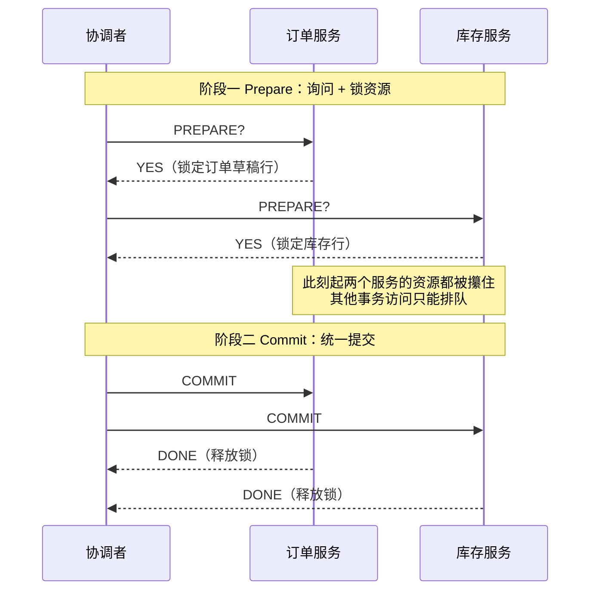
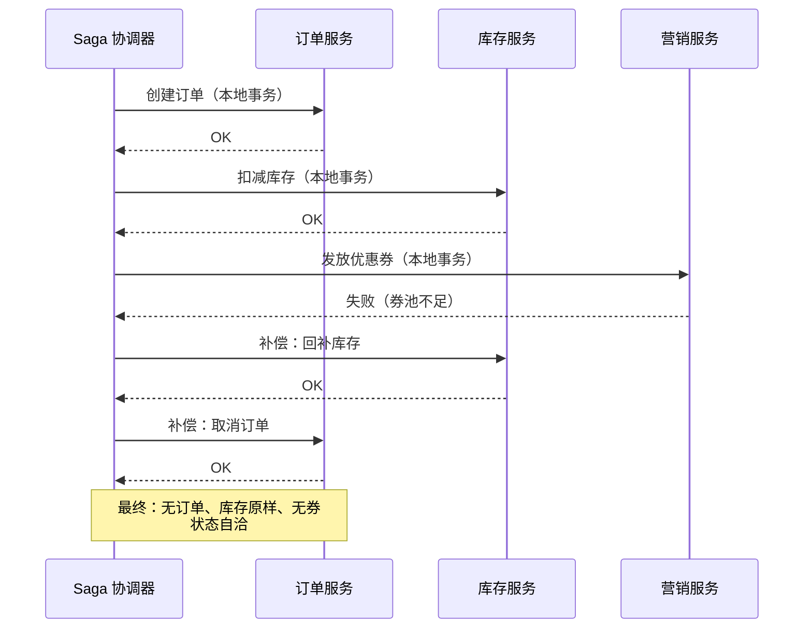
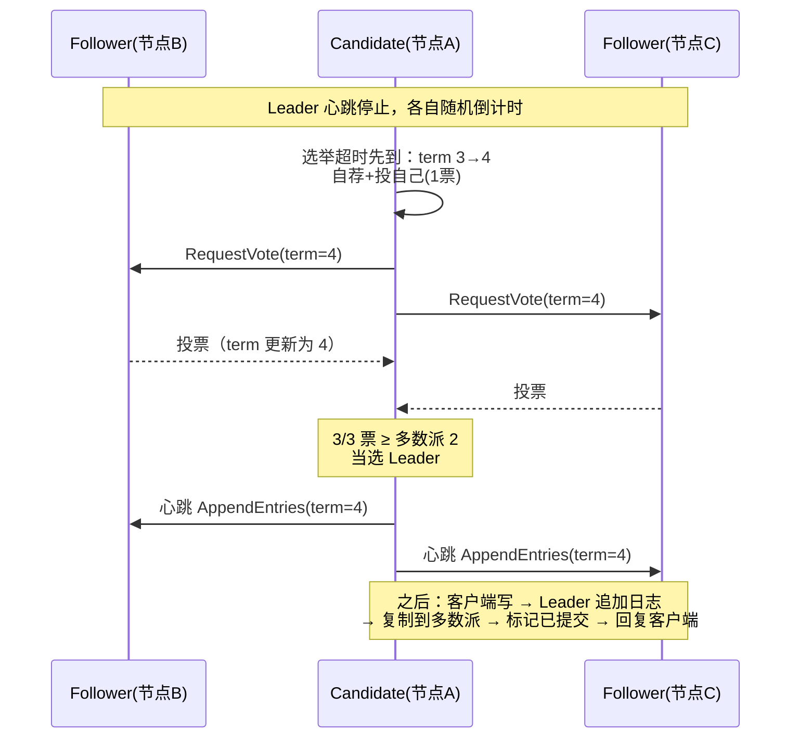

# 卷04-2：分布式事务与共识——2PC、TCC、Saga、本地消息表与 Raft

> 导语：卷03-2 的防超卖实验解决了**单库内**的一致性，本页把问题推到跨服务：下单、扣库存、发券，凭什么同时成功或同时失败？以及一个更底层的问题——"协调者""主库""Leader"自己挂了怎么办、谁来选新的？前者是分布式事务（2PC/TCC/Saga/本地消息表），后者是共识问题（Raft 专题）。本页是卷04 的理论峰值，也是全路径难度最高点之一。

> **🧮 思维铺垫（只需两件工具，都不是新知识）**：一是**多数派相交**——任意两个"过半数"集合至少共享一个元素（3 个节点的大多数是 2，任意两个 2 人小组必有重叠），Raft 的全部安全性都建立在这一句话上；看到 ⌊N/2⌋+1 不要慌，它就是"过半数"的写法。二是**状态机思维**——把"订单已建、库存未扣"这样的中间态当成一等公民来显式设计，而不是当成异常去掩盖；BASE 与 Saga 的全部工程实践都是这个思维的展开。带着这两件工具，本页的数学密度就只是"看起来吓人"。

---

## 3. 分布式事务：下单、扣库存、发券，凭什么同时成功或同时失败

卷03 的防超卖实验解决了**单库内**的一致性问题（行锁+条件更新）。但 RetailHub 的下单链路已经跨服务了：订单服务写订单、库存服务扣库存、营销服务发券。任何一个环节失败，数据就会出现"订单创建了但库存没扣"的中间态。这就是分布式事务问题。

**先立世界观：ACID 守单机，BASE 闯天下。** 单机数据库用 ACID（原子、一致、隔离、持久）给你"要么全成要么全不成"的硬承诺；一旦跨机器，网络分区让硬承诺的代价高到无法承受（这正是 CAP 的约束），于是工程界演化出 **BASE** 姿态：**Basically Available**（基本可用——允许有损服务，响应慢点、数据旧点，但不瘫）、**Soft State**（软状态——允许系统存在"订单已建、库存未扣"这样的中间态）、**Eventually Consistent**（最终一致——中间态会在有限时间内收敛）。一句话对比：**ACID 是"永远不许错"，BASE 是"允许暂时错，但保证会修好，且修好的过程可追溯"**。下面四种方案，2PC/TCC 是想方设法在分布式里保住 ACID 气质，Saga/本地消息表则是 BASE 的正规军——RetailHub 的下单链路站在 BASE 一边。

| 维度 | ACID（单机事务） | BASE（分布式姿态） |
| --- | --- | --- |
| 一致性 | 强一致，提交即可见 | 最终一致，中间态对外可见 |
| 可用性 | 故障时宁可阻塞 | 故障时降级服务，保住主干 |
| 中间态 | 不存在 | 存在，必须显式设计（状态机） |
| 失败处理 | 回滚，用户看到"失败" | 补偿，用户可能先看到"成功"再看到"已取消" |
| 典型场景 | 单库账务、库存扣减 | 跨服务下单、通知、报表 |

四种主流解法：

### 3.1 2PC/XA：强一致，但企业系统里越来越少见

两阶段提交由协调者先问所有参与者"能不能提交"（prepare），全部点头后再统一提交（commit）。把时序画出来，两个致命点一眼可见——**prepare 阶段资源全部锁定**，以及**协调者是全场唯一的单点**：



三个要讲透的机理：

1. **参与者投出 YES 的那一刻，就把命运交给了协调者**。YES 的意思是"我承诺能提交，资源已锁、undo/redo 日志已落盘"。此后它既不能擅自提交也不能擅自回滚——只能等协调者的判决。这是 2PC 强一致的来源，也是它**阻塞（blocking）**的根源。
2. **协调者宕机 + 参与者宕机叠加时，没人知道该提交还是回滚**。幸存者们面面相觑：那个没应答的参与者到底是准备提交还是准备回滚？只能阻塞等待或人工介入。**3PC 的改进**是在 prepare 和 commit 之间加一个 preCommit 缓冲态、并给参与者加超时自动提交——缓解了阻塞，却在网络分区时引入"两侧各自超时提交，数据分裂"的新风险，所以 3PC 基本只活在教科书里。
3. **性能账**：两轮网络往返 + prepare 到 commit 之间全程持锁，吞吐被最慢的参与者拖垮。每秒几千单的链路里，锁被攥住 200ms 就是灾难。

**吞吐低、可用性差，互联网高并发链路基本弃用**，但在对一致性要求极高的金融核心账务里仍有位置。

> **🎮 动手模拟：2PC 的时序与阻塞。** 先不勾选任何捣乱项，点"发起事务"看一遍正常的 prepare → commit 动画，注意每个服务投 YES 时资源旁出现的 🔒。然后勾选"库存服务 prepare 后立刻宕机"重放：看协调者的 COMMIT 永远送达不到、库存行锁无法释放、整个事务卡死——只能靠"管理员介入"收场。把这一幕记住，你就永远记住了为什么互联网下单链路不用 2PC。

```demo two-phase-commit
```

**Demo 导学单**
1. 正常流程跑一遍：阶段一中每个服务投 YES 的同时发生了什么（看资源区）？这个动作为什么是 2PC 强一致的来源？
2. 勾选"库存服务投 NO"重放：订单服务明明投了 YES，最后为什么也要回滚？它的资源被白白锁了多久？
3. 勾选"prepare 后宕机"重放：协调者的 COMMIT 发到了几个服务？库存服务的锁为什么释放不了？
4. 在阻塞状态下回答：如果你是库存服务的另一个事务，现在要扣同一行库存，你会怎样？这解释了 2PC"吞吐低"的哪一层原因？
5. 对照 §3.5 对比表回答：本地消息表用哪两个机制换掉了 2PC 的"锁等待"？代价是什么（提示：中间态）？

### 3.2 TCC（Try-Confirm-Cancel）：把 2PC 从数据库层搬到业务层

每个操作拆成三步：Try（冻结资源，如把 10 件库存从"可用"挪到"冻结"）、Confirm（确认扣减，冻结转实扣）、Cancel（释放冻结）。优点是不长锁、性能好；代价是**每个接口要写三个版本**，且要保证幂等和空回滚（Try 没执行成功时 Cancel 也要能安全执行）。适合核心资金链路，开发成本高。

### 3.3 Saga：长流程拆成本地事务链，失败则逆向补偿

Saga 把"下单→扣库存→发券"拆成三个本地事务，每个都有对应的补偿动作（取消订单→回补库存→作废券）。依次执行，某步失败就逆序调用已完成步骤的补偿：



Saga 的关键认知：**它不保证"原子性"，保证的是"最终自洽"**——中间状态对外可见（用户可能短暂看到订单已创建），所以补偿逻辑和状态机设计（订单要有"已取消"态）必须写进业务设计，不能事后补。

### 3.4 本地消息表：零售系统里最务实的选择

核心思想：**把"要通知下游"这件事和业务数据写在同一个本地事务里**。订单服务在创建订单的同一个事务里，往自己的 `outbox` 表插一条"订单已创建"消息；后台任务把 outbox 里的消息投递到 MQ，库存服务消费 MQ 扣库存。本地事务保证"订单和消息要么都在要么都不在"，MQ 的重投递+消费端幂等保证"最终至少送达一次且只生效一次"。这就是卷02 引入的 MQ 的真正用武之地，也是本卷实战采用的方案（它是 Outbox 模式的朴素版）。

### 3.5 选型对比

| 方案 | 一致性 | 性能/可用性 | 业务侵入 | 适用场景 |
|---|---|---|---|---|
| 2PC/XA | 强一致 | 差（阻塞、单点协调者） | 低（数据库支持） | 金融核心账务 |
| TCC | 强一致（业务层） | 较好 | 极高（每个接口×3） | 资金、库存核心链路 |
| Saga | 最终一致（补偿） | 好 | 高（要写补偿） | 长流程、跨多个领域服务 |
| 本地消息表 | 最终一致（重试） | 好 | 中（outbox 表+幂等消费） | 零售下单、通知类链路，**本卷采用** |

### 3.6 共识算法：Raft——分布式系统的"宪法"

上面所有方案都回避了一个更底层的问题：**"协调者""主库""Leader"自己挂了怎么办？谁来选新的？** 这就是共识问题——让一群会宕机、会断网的节点，对"谁是老大、数据是什么顺序"达成一致。Paxos 提出了正确性证明但难到臭名昭著，**Raft 是为"可理解性"而生的共识算法**，etcd、Consul、RocketMQ 的 DLedger、TiKV 用的都是它。把 Raft 讲透只需要两个子问题。

**子问题一：选主（Leader Election）。** 节点只有三种角色：Follower、Candidate、Leader。规则骨架：

1. 平时 Leader 定期发心跳；Follower 超过**选举超时**（150~300ms 的随机值——随机是为了让大家错开，避免每次选票都瓜分）没收到心跳，就怀疑 Leader 死了。
2. 该 Follower 把**任期（term）+1**，自荐为 Candidate，先投自己一票，再向全体拉票。
3. 拿到**多数派（⌊N/2⌋+1 票）**就当选 Leader；没拿够就等下一轮随机超时再来。
4. 任何节点见到比自己更高的 term，立刻退回 Follower——**term 单调递增是防止"两个皇帝"的第一道锁**。

**子问题二：日志复制（Log Replication）。** 选主只是开始，干活的流程是：

1. 客户端只跟 Leader 写。Leader 把操作追加到自己日志末尾（**未提交**状态，对客户端不可见）。
2. Leader 把日志条目并行复制给所有 Follower。
3. 收到**多数派确认**后，Leader 才把条目标记为**已提交（committed）**，应用到状态机，回复客户端成功，并随下次心跳通知 Follower 提交。

为什么"多数派提交"就敢承诺不丢？**多数派相交原理**：任意两个多数派至少共享一个节点。新 Leader 一定由某个多数派选出，而任何多数派里至少有一个节点持有全部已提交日志——所以已提交的日志永远不会被新任期推翻。这也是卷03 讲的"线性一致"在工程上的实现方式之一。



**Raft 与 CAP、2PC 的关系，一句话串起来**：Raft 是分区时选 C 的代表——少数派一侧选不出 Leader、拒绝写入，换取"永远只有一个合法老大、已提交日志永不丢"；而 2PC 解决的是"多个资源要不要一起动"的原子性问题，Raft 解决的是"同一份数据由谁说了算"的多数派问题，两者正交，常一起出现（如 Spanner 用 Paxos 选主 + 2PC 跨组分事务）。

> **🎮 动手模拟：Raft 选主与日志复制。** 5 节点集群，点"发起选主"看 Candidate 拉票动画；当选后点"客户端写入一条日志"，盯着条目从普通字变成**加粗**（已提交）的瞬间——那正是"复制到多数派"的时刻。然后"杀死 Leader"重新选举，看已提交日志原样保留；最后"制造网络分区（2|3）"，在 2 节点那一侧发起选举和写入，体验少数派"永远选不出 Leader、日志无法提交"的停摆——这就是 CAP 里"P 发生时选 C"的具体机制。

```demo raft-election
```

**Demo 导学单**
1. 发起选主，观察 Candidate 的 term 变化与票数增长：5 节点集群的多数派是几票？如果只拿到 2 票会发生什么？
2. 当选 Leader 后写入一条日志：条目从"未提交"变"已提交（加粗）"的瞬间，集群里至少有几个节点持有了它？
3. 写入 2 条日志后"杀死 Leader"，再发起选主：新 Leader 的日志里那 2 条还在吗？用"多数派相交原理"解释为什么。
4. 制造网络分区（2|3）后，先在 B 区（3 节点侧）选主，成功了吗？再在 A 区（2 节点侧）选主，观察失败过程——这对应 CAP 的哪个选择？
5. 分区期间在 B 区写入一条日志（能提交），恢复网络后重启归队的 A 区节点会怎样处理自己的旧日志？（提示：回忆课文中"日志复制的一致性检查"。）

---

## 8. 本卷实战（中）：本地消息表改造下单链路

### 8.1 背景

本步是卷04 实战的第 3 步（前两步见卷04-1）：把下单链路改造为本地消息表（Outbox）方案——这正是本页 §3.4 选型结论的落地，也是卷02 引入的 MQ 的真正用武之地。

### 8.2 任务清单（本页一步）

**第 3 步：本地消息表改造下单链路**
- 目标：订单与"通知库存"要么都发生、要么都不发生，MQ 故障可恢复。
- 操作：按 §8.5 骨架建 `outbox` 表，改造 `create_order` 为同事务双写，写 relay 任务与幂等消费端。
- 验收：下单 100 单后中断 MQ，恢复后 outbox 消息全部送达；库存扣减总数 = 成功订单数，无重复扣减。

### 8.5 代码骨架 3：本地消息表（Outbox）下单链路

```python
# retailhub/order/service.py（关键片段）
from sqlalchemy import insert
from db import engine, orders, outbox  # outbox(id, topic, payload, status, created_at)

def create_order(tenant_id: str, sku: str, qty: int) -> dict:
    with engine.begin() as conn:  # 同一个本地事务：订单与消息同生共死
        result = conn.execute(
            insert(orders).values(tenant_id=tenant_id, sku=sku,
                                  qty=qty, status="CREATED")
        )
        order_id = result.inserted_primary_key[0]
        conn.execute(
            insert(outbox).values(
                topic="order.created",
                payload={"order_id": order_id, "sku": sku, "qty": qty},
                status="PENDING",
            )
        )
    return {"order_id": order_id}

# retailhub/order/outbox_relay.py：后台投递任务（可用 K8s CronJob 或常驻 worker）
def relay_pending_messages(mq_producer):
    with engine.begin() as conn:
        rows = conn.execute(
            outbox.select().where(outbox.c.status == "PENDING").limit(100)
        ).fetchall()
        for row in rows:
            mq_producer.send(row.topic, row.payload)  # MQ 失败则下轮重试
            conn.execute(
                outbox.update().where(outbox.c.id == row.id)
                .values(status="SENT")
            )

# retailhub/inventory/consumer.py：消费端幂等——用消息 ID 去重
def handle_order_created(msg: dict, processed_ids: set):
    msg_id = msg["message_id"]
    if msg_id in processed_ids:        # 幂等：MQ 重投递不会重复扣库存
        return
    deduct_stock_with_optimistic_lock(msg["sku"], msg["qty"])  # 卷03 的防超卖逻辑
    processed_ids.add(msg_id)          # 生产实现：写入 dedup 表或 Redis SETNX
```

### 8.8 验收标准（本页部分）

- [ ] 下单 100 单后中断 MQ，恢复后 outbox 消息全部送达，库存扣减总数与成功订单数一致，无重复扣减

---

## 参考与脚注

本页正文未使用编号脚注。理论背景承自卷03-2「一致性与共识」（DDIA 第 9 章）；分布式事务与共识的分布式治理视角另见卷04-1、卷04-3 页末所列《凤凰架构》等参考。

---

➡️ 下一页：[卷04-3：可观测性、容器化与平台工程——从"扛得住"到"人人能用"](卷04-3-可观测与平台工程.md)
