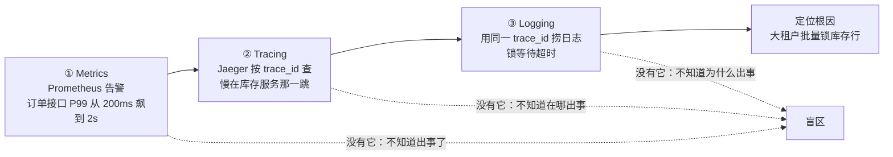
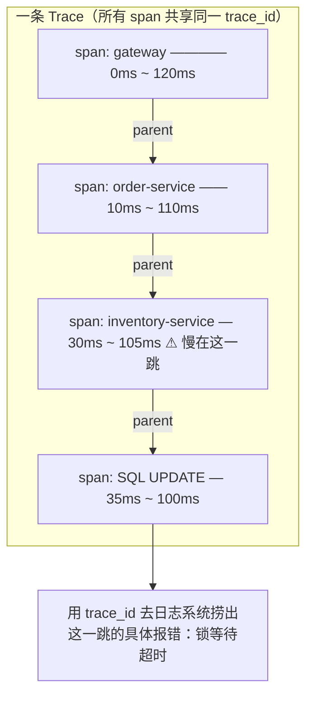
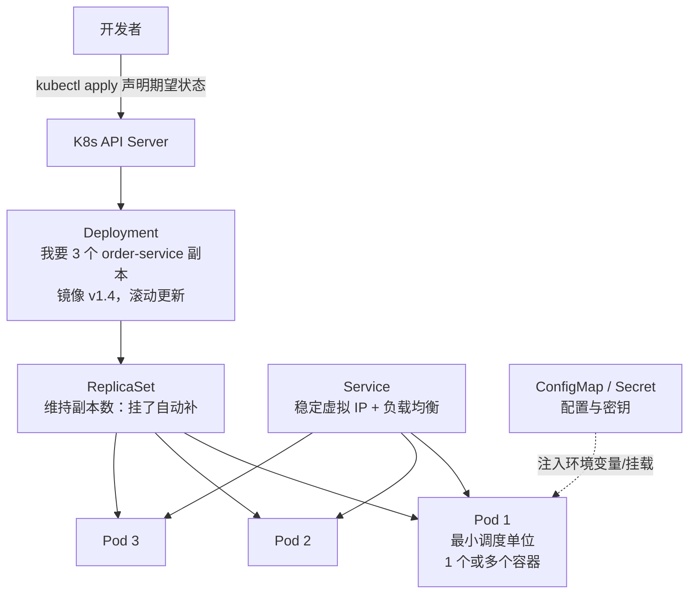

# 卷04-3：可观测性、容器化与平台工程——从"扛得住"到"人人能用"

> 导语：前两页让 RetailHub"扛得住"，本页让它"看得见、交得稳、人人能用"：配置与发布怎么不翻车（配置中心与发布治理）、系统内部状态怎么看得见（可观测性三支柱）、代码怎么被标准化地交付和调度（容器与 Kubernetes 最小必要知识）。最后站高一层，引入平台工程（Platform Engineering，PI 架构）的思想：当团队里每个项目组都自己搭一遍上面这些东西时，组织会系统性失血——并用金山办公 KAE 这个工业级案例看"平台即产品"的真实样子。这正是卷06（AI Infra 平台）和阶段九（Agent 企业工程化）要反复使用的世界观。

---

## 4. 配置中心与发布治理

服务从 3 个变成 13 个之后，两个新痛点出现：改一个配置（比如把降级开关打开）要登录 13 台机器改文件重启；发新版时直接全量替换，一出 bug 全员陪葬。

**配置中心**（Nacos、Apollo、Consul KV）解决第一个问题：配置集中存储、按服务/环境分组、客户端监听变更热更新。治理要点：配置也是代码——要评审、要版本、要能回滚；降级开关、限流阈值这类"运行时旋钮"放配置中心，数据库密码这类密钥放专用密钥管理（K8s Secret / Vault），两者不要混。

**发布治理**解决第二个问题，三种基本策略：

- **滚动更新**：分批替换实例，K8s 默认策略；简单但出问题影响面已扩散。
- **蓝绿发布**：新旧两套环境并存，流量一次性切到新版本，出问题秒级切回；资源双倍。
- **金丝雀发布**：先放 5% 流量到新版本，观察指标正常再逐步放大；需要网关按权重分流的能力，是互联网大厂默认姿势。

对 RetailHub 现阶段：K8s 滚动更新 + readinessProbe（就绪探针，没准备好的实例不接流量）已经能挡住 80% 的发版事故，金丝雀留给流量真的大起来之后。

---

## 5. 可观测性三支柱：Metrics、Logging、Tracing（融合来源：OpenTelemetry 社区实践[^3] + 凤凰架构"可观测性"论述[^1]）

分布式的本质代价之一是：**你再也不能靠"登录那台机器看日志"排查问题了**。一次请求穿过网关、订单、库存三个服务，日志散落在十几个容器里。可观测性（Observability）就是回答"系统内部正在发生什么"的能力，业界共识的三支柱：

| 支柱 | 回答的问题 | 典型工具 | 粒度 |
|---|---|---|---|
| Metrics（指标） | 系统整体健康吗？趋势如何？ | Prometheus + Grafana | 聚合数值：QPS、错误率、P99 延迟 |
| Logging（日志） | 这个具体请求/事件发生了什么？ | Loki / ELK | 离散事件，最细但最贵 |
| Tracing（链路追踪） | 这次请求经过了哪些服务，慢在哪一跳？ | Jaeger / Tempo | 单请求的完整路径 |

三者的关系不是并列可选，而是**排查动线**：Metrics 告警发现"订单接口 P99 飙升"→ Tracing 定位到"慢在调用库存服务那一跳"→ Logging 看那一跳的具体报错。没有 Metrics 你不知道出事了，没有 Tracing 你不知道在哪出事，没有 Logging 你不知道为什么出事。把这条动线画出来——它也是你值班时的标准排查路径：



**三支柱各有一个"上手后才会撞见"的深水区，提前告诉你：**

- **Metrics 的深水区是基数（cardinality）**。给指标打标签（label）是免费的错觉：`http_requests_total{status, path}` 很美好，一旦有人把 `user_id` 或 `order_id` 打进 label，时间序列数量爆炸（每用户一条序列），Prometheus 直接被撑爆。纪律：**label 只能放低基数维度**（状态码、方法、服务名），高基数维度（用户、订单、trace_id）去日志和 Trace 里找。
- **Logging 的深水区是成本与结构**。全量 INFO 日志在高 QPS 下是 TB 级/天，存储和检索都烧钱。纪律：**结构化日志（JSON）+ 必带 trace_id**（否则排查动线到日志这一环就断了）+ 按级别分层保留（ERROR 留 30 天，DEBUG 只留 3 天）。
- **Tracing 的深水区是采样**。全量采集 Trace，头部大流量系统扛不住；只采 1%，出问题时大概率没采到出事的那条。工程答案：**尾部采样**（等一条 Trace 走完，发现含错误/超时才保留）或"错误全采 + 正常请求低比例采"。
- **两套口诀记牢**：监控指标用 **RED**（Rate 请求量、Errors 错误率、Duration 延迟——面向服务）与 **USE**（Utilization 利用率、Saturation 饱和度、Errors 错误——面向资源）。评审任何系统的监控方案，先问"RED 和 USE 各覆盖了几项"[^6]。

**OpenTelemetry（OTel）** 是这一领域的事实标准：一套 vendor 中立的 SDK/API，负责产生 Metrics、Logs、Traces 三种信号，通过 TraceID 把它们串起来，后端接什么（Jaeger 还是商业 APM）可以自由换。架构要点：**用 OTel SDK 插桩，不直接绑死任何后端产品**——这又是一次"把易变的决策往后推"的架构基本功。本卷实战将用 OTel 的 Python SDK 打通"查询→订单→库存"链路。

一条 Trace 在 Jaeger 里的样子，本质是**同一 trace_id 下父子 span 的嵌套时间条**：



读法：外层 span 的耗时 ≈ 内层之和 + 自身开销；哪一层"自身耗时"异常膨胀，慢点就在哪。上图中 gateway 的 120ms 里 100ms 耗在库存服务内的 SQL 上——Tracing 把"感觉慢"变成了"第几跳、慢多少"的定量结论。

---

## 6. 容器化与 Kubernetes：最小必要知识

### 6.1 为什么需要容器

容器解决的是**交付一致性**：把代码、依赖、运行时打进一个不可变镜像（Dockerfile），"在我机器上能跑"从此等于"在任何机器上能跑"。同时它也是一切上层治理的前提——没有镜像这个标准交付物，就没有后面的编排、扩缩容、滚动更新。

### 6.2 Kubernetes 最小概念集

K8s 概念繁多，但 RetailHub 现阶段只需要六个，记住这张"声明式意图"图：



- **Pod**：最小调度单位，一个或多个共享网络的容器。你几乎不直接操作它。
- **Deployment**：声明"这个镜像跑几个副本、怎么更新"，是日常操作的核心对象。
- **Service**：一组 Pod 前面的稳定入口（虚拟 IP + DNS 名 + 负载均衡），就是 1.2 节说的"免费的服务发现"。
- **ConfigMap / Secret**：非密配置与密钥的注入机制（轻量版配置中心）。
- **Probe（探针）**：livenessProbe（活没活着，死了重启）与 readinessProbe（准备好接流量没有，没好就从 Service 摘掉）——**这两个探针是 K8s 里性价比最高的可靠性设施，不配探针等于裸奔**。
- **HPA**：按 CPU/自定义指标自动扩缩副本数，有了它，"容量规划"从人肉变成声明。

K8s 的哲学一句话：**你声明期望状态，控制循环（controller）不断把现实扳回期望**。这个"声明式 + 调和循环"的思想会在卷06（AI Infra 的资源调度）和阶段九（Agent Runtime 的任务调度）反复出现，值得在这里吃透。

---

## 7. 平台工程（PI 架构）：当每个团队都自己搭一遍，组织就开始失血

### 7.1 问题的形态

把前六节加起来看：服务发现、熔断限流、消息队列、配置中心、可观测性、CI/CD、K8s——RetailHub 一个团队搞定这些已经耗尽半生。现在想象公司有 8 个业务团队，每个团队都要把这些事重新做一遍：A 团队用 Sentinel，B 团队用 resilience4j；A 的 Grafana 看板长这样，B 的长那样；每个团队都有一个"最懂 K8s 的人"，他休年假全团队不敢发版。这就是平台工程要解决的真实组织病：**基础设施能力被每个业务团队以略有不同、互不复用的方式重复建设，认知负担压垮了业务交付速度**。

### 7.2 核心概念四件套

- **内部开发者平台（IDP, Internal Developer Platform）**：把上述基础设施能力封装成自助式产品——业务开发不需要懂 K8s，在平台上点选"我要一个带 MySQL 和 Redis 的 Python 服务"，平台自动产出镜像构建、部署清单、监控看板、告警规则。
- **黄金路径（Golden Path / Paved Road）**：平台为最常见的场景提供一条"被铺好的路"——标准的项目模板、标准的 CI 流水线、标准的可观测接入。走黄金路径一切自动化；要偏离也可以，但偏离的成本自己承担。**黄金路径是"温柔的强制"：不禁止自由，但让正确的做法成为最省力的做法。**
- **平台即产品（Platform as a Product）**：平台团队把业务开发当"内部客户"——做用户调研、定义 SLA、度量采用率和开发者满意度，而不是把自己当成发号施令的"运维管理部门"。平台没人用，是平台的产品失败，不是业务团队不听话。
- **认知负担（Cognitive Load）**：平台工程的度量原点（来自 Team Topologies[^4]）。一个开发者能同时理解的东西是有限的，平台的使命就是把"与业务无关的复杂度"从业务开发的脑子里卸载到平台里。

### 7.3 从"工具"到"平台"的对比

| 维度 | 工具堆（Tool Sprawl） | 内部开发者平台（IDP） |
|---|---|---|
| 新建一个服务 | 复制老项目改半个月，配 5 个系统 | 模板脚手架 + 自助申请，半天上线 |
| 可观测接入 | 各团队自己接，口径不一 | 黄金路径默认带出 Metrics/Trace/日志 |
| K8s 知识要求 | 每个团队都要有专家 | 业务开发不需要懂，平台团队兜底 |
| 故障排查 | 先问"这个服务是谁搭的、用的哪套" | 全公司同一套看板与 Trace 入口 |
| 组织风险 | 关键人依赖、重复建设 | 平台团队成为杠杆而非瓶颈 |

### 7.4 真实案例：KAE——工业级 IDP 长什么样

"平台即产品"在真实大厂是什么样子？看金山办公的 **KAE（Kingsoft App Engine）**：这是金山办公自研的云原生运行环境，统一管理微服务、容器与应用伸缩，是 WPS 混合云架构的底座[^5]。规模感一下：KAE 承载的微服务总数 **13600+**（测试与生产环境），每天约 **310 次更新部署**——这个量级下任何"每个团队自己搭一套"的做法都会在人力上直接崩盘，平台不是选择题而是生存题。

把 KAE 的公开实践拆成平台工程四件套来看，你会发现每个概念都有对应物[^5]：

| 平台工程概念 | KAE 的对应做法 |
| --- | --- |
| 自助式 IDP | 业务团队在平台上自助完成应用创建、部署、扩缩容，不直接接触底层 K8s 细节 |
| 黄金路径 | 发布走统一流水线，配合自动化测试与堡垒机管控守住发布门禁——标准动作被平台固化，偏离路径的成本自担 |
| 平台即产品 | 平台团队把上万微服务的治理收敛成统一产品能力，而不是逐个团队"人盯人"运维 |
| 认知负担卸载 | 可用性、容灾这类最难的能力沉淀为底座默认继承，业务开发不必人人成为容灾专家 |

最值得细看的是**可靠性如何被"平台化"**：KAE 的目标可用性是 **99.99%（四个 9，全年不可用约 52.6 分钟）**，靠**两地三中心**架构承载——同城的两个中心互为主备，扛机房级故障（断电、网络中断）做到分钟级切换；异地的第三个中心扛地域级灾难（地震、城市级网络瘫痪），保住数据不丢、服务可重建。关键在于：这套容灾不是 13600 个微服务各自实现的，而是**平台统一建设、所有服务默认继承**——这正是"认知负担卸载"在可靠性维度上的样子。单个团队自己实现两地三中心，光演练成本就扛不住；平台把成本摊薄到万级服务上，才使四个 9 成为可负担的目标。（卷08 会用 SRE 的错误预算视角重新算这笔账。）

你在本卷搭的"最小内部平台"与 KAE 之间隔着的是规模，不是原理：黄金路径、自助化、认知负担卸载，一模一样。KAE 的可靠性侧面，卷08 还会作为 SRE 案例展开。

### 7.5 为什么这个思想是后半条学习路径的暗线

本卷是平台工程第一次登场，但绝不是最后一次。**卷06（AI Infra）**：GPU 调度、模型服务化、推理网关、评测流水线——如果没有平台思维，每个算法团队都自己管 GPU 集群，结局和前六节描述的一模一样，只是更贵。**阶段九（Agent 企业工程化）**：LLM Runtime、工具治理、记忆治理、评测发布——Agent 平台本质上就是一个面向"智能体开发者"的 IDP，黄金路径就是"标准 Agent 脚手架 + 受控发布流水线"。你在本卷学到的"平台即产品、黄金路径、认知负担"三个概念，会在那时原样复用，只是服务对象从"跑 HTTP 服务的开发"变成"跑 Agent 的开发"。**卷05 的架构评审**：平台要不要自建、边界划在哪，正是 ADR 和 ATAM 评估的典型题材。

---

## 8. 本卷实战（下）：容器化、送上 K8s 并接入可观测

### 8.1 背景

本步是卷04 实战的最后两步（前三步见卷04-1、卷04-2）：把订单服务容器化并送上 K8s（对应本页 §6），再接入 OpenTelemetry 打通"网关→订单→库存"链路（对应本页 §5）。

### 8.2 任务清单（本页两步）

**第 4 步：容器化并送上 K8s**
- 目标："在我机器上能跑"变成"在任何机器上能跑"，且发版不掉流量。
- 操作：按 §8.6 骨架写 Dockerfile（非 root 运行）、docker-compose 本地联调，再写 Deployment + Service + 双探针清单。
- 验收：`docker compose up` 后网关→订单→库存链路本地可通；`kubectl apply` 后 3 副本就绪，手动 `kubectl delete pod` 任一实例，副本自动补齐且流量不中断；改镜像 tag 发版一次，全程 `maxUnavailable: 0` 且压测脚本零失败。

**第 5 步：接入 OpenTelemetry 打通链路**
- 目标：一次请求穿过三个服务，能回答"慢在哪一跳"。
- 操作：按 §8.6 骨架部署 OTel Collector 与 Jaeger，应用侧用 `setup_tracing` 三行接入。
- 验收：Jaeger 中能看到完整 Trace：gateway → order-service → inventory-service，库存服务内部可见 SQL 子 span。

### 8.6 配置骨架 4：Dockerfile 与 K8s 清单

```dockerfile
# retailhub/order/Dockerfile
FROM python:3.12-slim
WORKDIR /app
COPY requirements.txt .
RUN pip install --no-cache-dir -r requirements.txt
COPY . .
# 非 root 运行：容器安全的最小动作
RUN useradd -m appuser && chown -R appuser /app
USER appuser
EXPOSE 8001
# 用 uvicorn 起 2 个 worker；K8s 里靠多副本水平扩展，不靠单容器多进程
CMD ["uvicorn", "main:app", "--host", "0.0.0.0", "--port", "8001", "--workers", "2"]
```

```yaml
# retailhub/deploy/order-service.yaml
apiVersion: apps/v1
kind: Deployment
metadata:
  name: order-service
spec:
  replicas: 3                       # 声明期望状态：3 个副本
  strategy:
    rollingUpdate:
      maxSurge: 1                   # 滚动更新：先多起 1 个新版本
      maxUnavailable: 0             # 全程不减少可用副本
  selector:
    matchLabels: { app: order-service }
  template:
    metadata:
      labels: { app: order-service }
    spec:
      containers:
        - name: order-service
          image: registry.internal/retailhub/order-service:1.4.0
          ports: [{ containerPort: 8001 }]
          envFrom:
            - configMapRef: { name: order-service-config }
            - secretRef: { name: order-service-secret }
          resources:
            requests: { cpu: "100m", memory: "128Mi" }   # 资源声明是调度依据
            limits:   { cpu: "500m", memory: "512Mi" }   # 防止单个服务吃光节点
          readinessProbe:           # 没就绪不接流量（发版安全的关键）
            httpGet: { path: /healthz, port: 8001 }
            initialDelaySeconds: 5
            periodSeconds: 10
          livenessProbe:            # 死了自动重启
            httpGet: { path: /healthz, port: 8001 }
            initialDelaySeconds: 15
            periodSeconds: 20
---
apiVersion: v1
kind: Service
metadata:
  name: order-service               # 稳定 DNS 名：order-service:8001
spec:
  selector: { app: order-service }  # 这就是免费的服务发现+负载均衡
  ports: [{ port: 8001, targetPort: 8001 }]
```

```yaml
# retailhub/deploy/otel-config.yaml（片段）：OTel Collector 以 DaemonSet 收集
apiVersion: v1
kind: ConfigMap
metadata:
  name: otel-collector-config
data:
  collector.yaml: |
    receivers:
      otlp:
        protocols:
          grpc: {}
    processors:
      batch: {}
    exporters:
      otlp/jaeger:
        endpoint: jaeger-collector:4317
        tls: { insecure: true }
      prometheus:
        endpoint: "0.0.0.0:8889"
    service:
      pipelines:
        traces:  { receivers: [otlp], processors: [batch], exporters: [otlp/jaeger] }
        metrics: { receivers: [otlp], processors: [batch], exporters: [prometheus] }
```

```python
# retailhub/common/tracing.py：应用侧三行接入 OTel
from opentelemetry import trace
from opentelemetry.sdk.trace import TracerProvider
from opentelemetry.sdk.trace.export import BatchSpanProcessor
from opentelemetry.exporter.otlp.proto.grpc.trace_exporter import OTLPSpanExporter
from opentelemetry.instrumentation.fastapi import FastAPIInstrumentor
from opentelemetry.instrumentation.httpx import HTTPXClientInstrumentor

def setup_tracing(app, service_name: str):
    provider = TracerProvider()
    provider.resource.attributes["service.name"] = service_name
    provider.add_span_processor(BatchSpanProcessor(OTLPSpanExporter()))
    trace.set_tracer_provider(provider)
    FastAPIInstrumentor.instrument_app(app)      # 自动给每个请求开 span
    HTTPXClientInstrumentor().instrument()       # 出站调用自动带上 traceparent 头
    # 效果：网关→订单→库存三个服务的 span 被同一个 trace_id 串成一条链
```

### 8.8 验收标准（本页部分）

- [ ] `docker build` 成功且容器以非 root 用户运行；`docker compose up` 后网关→订单→库存链路本地可通
- [ ] `kubectl apply -f deploy/` 后 3 个副本就绪；手动 `kubectl delete pod` 任一实例，副本自动补齐且 Service 流量不中断
- [ ] 发版一次（改镜像 tag 后 apply），全程 `maxUnavailable: 0`，压测脚本无失败请求
- [ ] Jaeger 中能看到一条完整 Trace：gateway → order-service → inventory-service，且库存服务内部可见 SQL 子 span

---

## 9. 常见误区

1. **"超时设长一点更稳"**——恰恰相反，超时过长等于放弃治理，线程池照样被拖死。超时应该贴近下游 P99 延迟，并且逐层递减。
2. **对所有接口加重试**——对非幂等的写操作重试是线上事故的经典配方（重复扣款、重复下单）。要么接口幂等化，要么不重试。
3. **熔断阈值拍脑袋**——"失败 1 次就断"会把抖动误判为故障，频繁误断；"失败 100 次才断"等于没装。阈值要基于下游正常失败率的观测数据来定，并随容量调整。
4. **把限流只配在网关总量上**——多租户系统里不限租户维度，一个大客户的爬虫就能挤死所有小客户。限流维度要和业务隔离维度对齐。
5. **以为 Saga/消息表给了"事务"就不用设计状态**——最终一致方案的前提是业务能接受中间态，且每个中间态都有明确定义（订单的"已取消"、库存的"冻结中"）。状态机设计缺失，补偿逻辑就是空中楼阁。
6. **不配 readinessProbe 就滚动发版**——新 Pod 还没初始化完就接流量，每次发版都伴随一波 502。两个探针是 K8s 性价比最高的可靠性投资。
7. **直接绑死某个 APM 厂商的 SDK**——厂商更换或成本谈判时全部推倒重来。用 OpenTelemetry 这层中立抽象插桩，后端可替换。
8. **把平台工程理解成"招几个运维搭 K8s"**——平台工程的核心是产品思维（黄金路径、自助化、度量采用率），不是工具堆砌。没有产品思维的平台团队最终会变成新的瓶颈部门。

---

## 10. 自测清单

- [ ] 能向一个新手讲清 RPC 与 REST 的真实差异，以及"为什么内网性能差距通常不是选型的决定因素"
- [ ] 能画出熔断器三态状态机，并说明 HalfOpen 存在的意义
- [ ] 能分别说出超时、重试、熔断、限流、降级各自防的故障类型，并举一个"用错放大事故"的例子
- [ ] 能解释为什么重试必须配合幂等与退避，为什么超时预算要逐层递减
- [ ] 能用"下单扣库存发券"讲清 2PC/TCC/Saga/本地消息表四者的取舍，并说明 RetailHub 为什么选本地消息表
- [ ] 能说明可观测性三支柱各自的回答的问题，以及"Metrics 告警 → Trace 定位 → 日志归因"的排查动线
- [ ] 能说出 K8s 六个最小概念（Pod/Deployment/Service/ConfigMap/Probe/HPA）各自的职责，并解释"声明式 + 调和循环"
- [ ] 能解释 readinessProbe 与 livenessProbe 的区别，以及不配探针发版会发生什么
- [ ] 能用自己的话讲清"为什么每个团队都自己搭一套会失败"，并定义 IDP、黄金路径、平台即产品、认知负担
- [ ] 能说出平台工程思想在卷06（AI Infra）和阶段九（Agent 平台）将如何复用

---

## 下卷预告

到这里，RetailHub 已经是一个"扛得住"的系统：流量有治理、链路可观测、交付有标准、部署有编排。但你有没有发现一个隐藏问题——**本卷每一个决策（为什么选本地消息表而不是 TCC？为什么要自建迷你熔断器而不是直接上 Sentinel？平台边界划在哪？）都是你脑子里做出的，却没有任何一份文档记录下来**。三个月后新同事问"为什么不用 gRPC"，你只能回答"当时好像讨论过"。架构的可持续性，一半在技术决策本身，另一半在决策的显式化与可评估性。卷05 将引入系统架构设计师（软考）的完整知识体系与架构师的真实工作方法：质量属性场景、4+1 视图、ADR、ATAM 架构评估——并用它们为 RetailHub 产出一份可参评的完整架构文档包。

---

## 参考与脚注

[^1]: 周志明《凤凰架构：构建可靠的大型分布式系统》，开源在线版，"远程服务调用""流量治理""可观测性"等章节。https://icyfenix.cn
[^3]: OpenTelemetry 官方文档，vendor 中立的观测信号（Metrics/Logs/Traces）采集标准。https://opentelemetry.io/docs/
[^4]: Matthew Skelton & Manuel Pais《Team Topologies》（中译《高效能团队模式》）——"认知负担"作为平台工程度量原点的出处。
[^5]: InfoQ《金山办公 KAE 云原生实践》——13600+ 微服务、日均约 310 次部署、两地三中心、99.99% 可用性等数据出处。https://www.infoq.cn/article/7hrf2lzxs641uwnwk09f 。本站存档见[资料03](资料03-金山KAE规模之道.md)。
[^6]: Google《Site Reliability Engineering》（SRE Book），监控四大黄金信号与 RED/USE 方法论的源头之一。https://sre.google/sre-book/table-of-contents

---

➡️ 下一页：[卷05-1：架构师方法论——把脑子里的判断，变成可评审、可传承的架构资产](卷05-1-架构师方法论.md)
