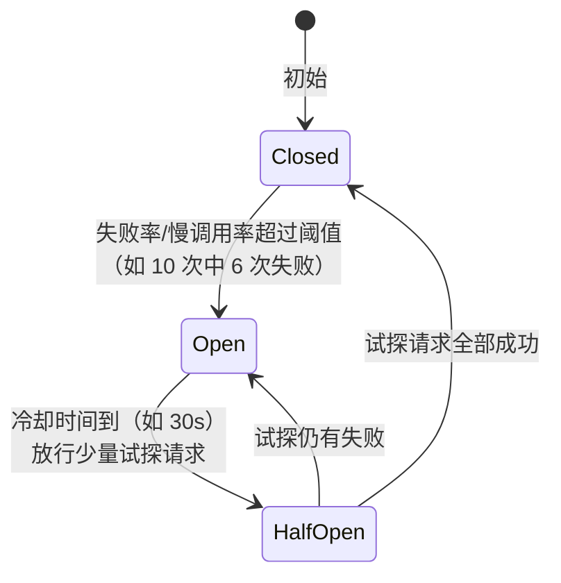
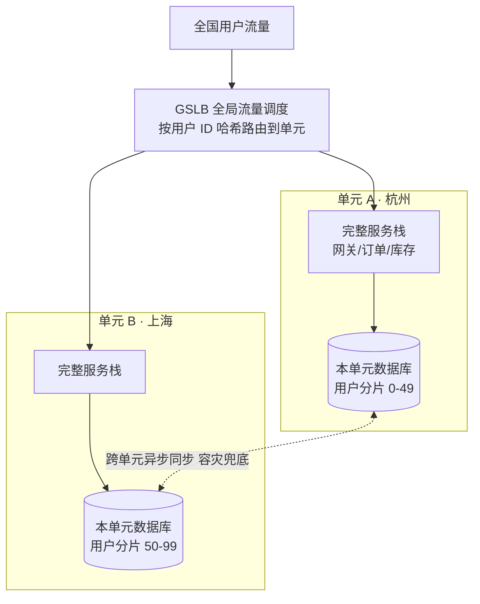
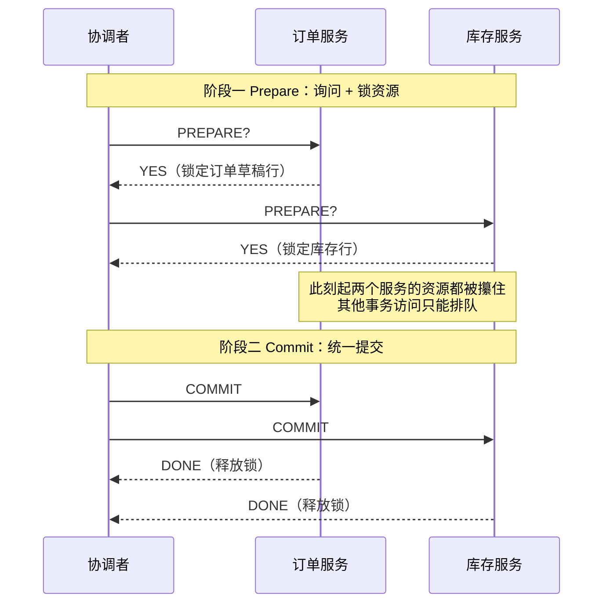
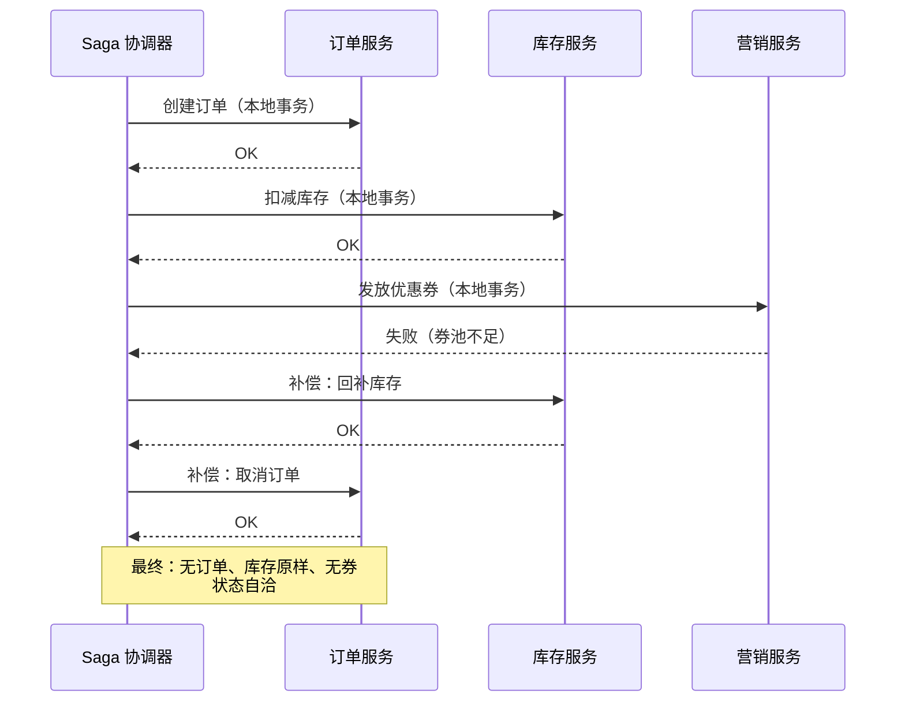
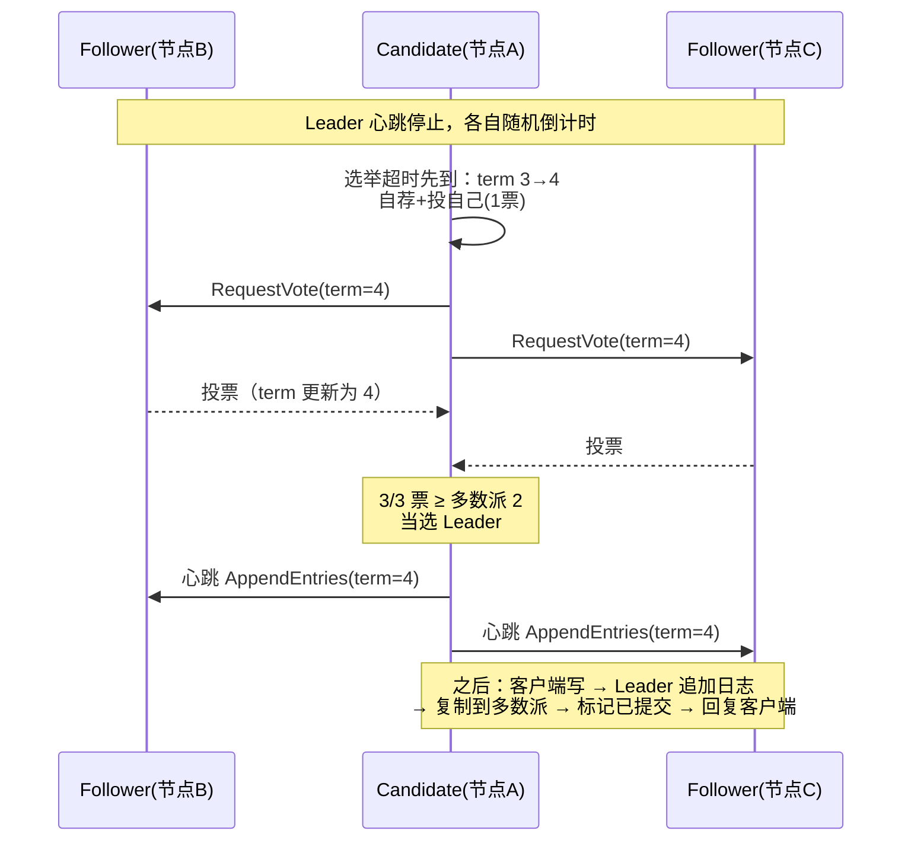
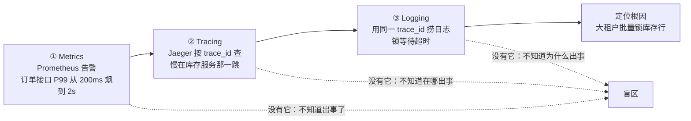
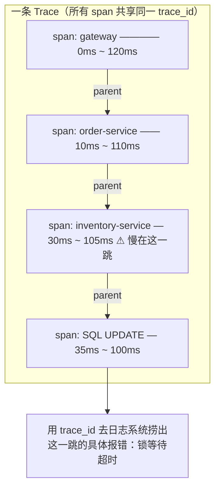
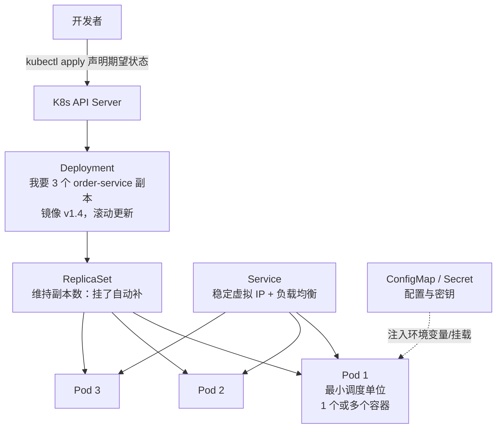

# 卷04：分布式架构与平台工程——从"能跑"到"扛得住"，再到"人人能用"

> 导语：卷03 结束时，RetailHub 已经有一份数据架构设计文档，并且用防超卖实验亲手验证了"一致性是要花代价的"。但那份系统本质上还是卷02 拆出来的几个服务各自为战：服务之间靠写死的 IP 互调、下游一挂上游跟着雪崩、发版靠 SSH 登录重启、出了问题靠 `grep` 日志大海捞针。本卷要把这些"手工作坊"环节全部工程化：服务怎么找到彼此（服务发现）、流量怎么被驯服（超时/重试/熔断/限流/降级）、跨服务的钱和库存怎么不出错（分布式事务）、配置和发布怎么不翻车（配置中心与发布治理）、系统内部状态怎么看得见（可观测性三支柱）、代码怎么被标准化地交付和调度（容器与 Kubernetes）。最后我们会站高一层，引入平台工程（Platform Engineering，下称 PI 架构）的思想：当团队里每个项目组都自己搭一遍上面这些东西时，组织会系统性失血——这正是卷06（AI Infra 平台）和阶段九（Agent 企业工程化）要反复使用的世界观。本卷的知识主线来自周志明《凤凰架构》的"分布式治理"视角，平台工程部分来自近年平台工程社区的共识实践。

---

## 1. 远程调用与服务发现：服务之间的"电话系统"是怎么建起来的

### 1.1 RPC 还是 REST：先把争论放对位置（融合来源：凤凰架构"远程服务调用"部分[^1]）

卷02 拆服务时我们直接用 HTTP+JSON（REST 风格）互调，这个选择在零售经营平台里至今依然成立。但你需要理解 RPC（如 gRPC、Dubbo）与 REST 的真实差异，因为面试和评审中一定会被问。

- **REST/HTTP**：通用、可读、跨语言零成本，浏览器和 curl 就能调试；代价是文本序列化开销大、没有强类型契约、HTTP/1.1 队头阻塞。
- **RPC（gRPC 为代表）**：二进制序列化（Protobuf）、强类型 IDL 契约、HTTP/2 多路复用、天然支持流式调用；代价是调试门槛高、跨语言要生成代码、对网关不友好。

工程上的判断标准不是"哪个快"（内网环境下两者差距通常不是瓶颈），而是：**对外、跨组织、需要被人直接调试的接口用 REST；对内、高频、调用关系稳定的服务间接口可以考虑 gRPC**。RetailHub 内部调用量不大，继续用 REST 是合理决策——但要用 OpenAPI 契约把接口管起来，这是卷05 要讲的"架构决策记录"的第一条素材。

### 1.2 服务发现：别再把 IP 写进配置文件

服务多实例部署后，"订单服务在 10.0.0.3:8001"这种写法立刻失效：实例会扩缩容、会漂移、会挂。服务发现就是给分布式系统装一部"电话交换机"：

```mermaid
flowchart LR
    subgraph 注册中心["注册中心（Consul / Nacos / K8s Service）"]
        R[(服务注册表<br/>order-service: [10.0.1.3:8001, 10.0.1.4:8001]<br/>inventory-service: [10.0.1.5:8002])]
    end
    O1[order-service 实例1] -->|启动时注册+定期心跳| R
    O2[order-service 实例2] -->|注册+心跳| R
    GW[API 网关 / 调用方] -->|查询健康实例列表| R
    GW -->|负载均衡选择其一| O1
```

两种主流模式：**客户端发现**（调用方从注册中心拉列表，自己做负载均衡，Dubbo/Eureka 风格）与**服务端发现**（调用方只发到一个虚拟地址，由网关或 K8s Service 转发）。在 Kubernetes 时代，服务端发现成为默认答案——K8s 的 Service 对象自带注册表、健康检查和负载均衡，你几乎"免费"获得服务发现。这也是本卷实战选择"先搞懂概念、再直接用 K8s 能力"的原因：不为造轮子而造轮子。

**凤凰架构的一个重要提醒**：注册中心本身也是分布式系统，同样受 CAP 约束。Eureka 选 AP（宁可返回过期实例列表也不拒绝服务），Zookeeper/etcd 选 CP（宁可暂时不可用也不返回不一致数据）。理解这一点，你就理解了为什么"注册中心短暂抖动时所有服务互调全挂"是一个真实存在过的线上事故类型。

### 1.3 负载均衡的三种粒度

| 粒度 | 典型实现 | 适用 |
|---|---|---|
| DNS 轮询 | 一个域名解析到多个 IP | 最简单，无健康感知，只适合做第一层 |
| 服务端（L4/L7 代理） | Nginx、HAProxy、K8s Service、云 LB | 主流默认，集中式好治理 |
| 客户端 | Ribbon、gRPC LB policy | 少一跳、调用方可定制策略（如按权重灰度），但策略散落在每个客户端 |

---

## 2. 流量治理：超时、重试、熔断、限流、降级——每一种都在防一种确定的故障（融合来源：凤凰架构"流量治理"部分[^1]）

这一节是全卷的心脏。新手背名词，架构师要能说清**每种机制防的是什么故障、防不住什么、用错了会放大什么**。

### 2.1 超时（Timeout）：一切治理的前提

没有超时的调用，等于把本服务的线程池抵押给下游的故障。下游慢 10 倍，你的 worker 就全部被占满，然后你的上游也被你拖死——这就是故障传导链。**原则：每一次跨进程调用都必须有显式超时，且超时要沿调用链逐层递减**（网关 3s → 订单服务 2.5s → 库存服务 2s），否则内层还没超时外层先放弃，重试逻辑全部失效。

### 2.2 重试（Retry）：只治"瞬时故障"，会放大"过载故障"

网络抖动、连接被重置这类瞬时故障，重试一次成功率极高。但下游如果是因为过载而慢，重试等于给垂死的下游再补一刀（请求量翻倍）。三个纪律：**只对幂等接口重试**（查询可重试，"扣库存"不可裸重试，除非下游支持幂等键）；**重试次数有上限且带退避**（exponential backoff + jitter）；**超时预算内重试**（总重试耗时不能超过上游给你的超时）。

### 2.3 熔断（Circuit Breaker）：防的是"持续调用一个已确定挂掉的下游"

熔断器是一个状态机，这是本卷第一个必须画明白的图：



- **Closed（闭合）**：正常放行，统计失败率。
- **Open（断开）**：直接快速失败（fallback），不再真的调用下游——给下游喘息时间，也保护本服务的线程池。
- **HalfOpen（半开）**：放几个"侦察兵"请求过去，试探下游是否恢复。

**为什么必须是三态，两态不行吗？** 设想只有"开/关"两态：下游恢复的瞬间，被挡住的积压请求会瞬间全部打过去——刚缓过来的下游立刻被"惊群"再次压垮，于是熔断再次断开，形成**震荡**。HalfOpen 的本质是**限流试探**：用少量侦察兵换取"下游真的恢复了"的证据，再逐渐放量。生产级熔断器（Sentinel、resilience4j）还会在此基础上加两个细化：**滑动窗口统计**（不看累计失败率，只看最近 10 秒/100 个请求的失败率，避免老数据干扰新判断）和**慢调用比例熔断**（不失败但慢到 P99 超标也算异常——慢下游拖死线程池的效果和挂掉一样）。

熔断和重试的关系：**重试治瞬时，熔断治持续**；先有熔断再有重试上限，二者配合而不是替代。

> **🎮 动手模拟：熔断器状态机。** 拖动滑块把"下游故障率"从 0 慢慢拉到 80%，点击"发送请求"（或打开自动发送），观察状态机如何在 **闭合 → 断开 → 半开** 之间迁移。重点看两件事：连续失败达到阈值后状态机断开，之后请求不再触达下游、以 <1ms 快速失败（"熔断拒绝"计数上涨）——这既给下游喘息时间，也保住了本服务的线程池；冷却结束后半开试探，试探成功才恢复闭合。

```demo circuit-breaker
```

**Demo 导学单**
1. 故障率拉到 80% 后连续点"发送请求"，数一下：从第几个失败开始状态机跳到 Open？这个阈值在课文代码骨架里对应哪个参数？
2. 进入 Open 后再点"发送请求"：观察请求的耗时和"熔断拒绝"计数——此时请求**有没有真的发出去**？这保护了哪两样东西？
3. 等冷却时间到，观察状态机先进入哪个状态？为什么不直接跳回 Closed（提示：想想"惊群"）？
4. 在半开期间把故障率调回 0，再调回 80%，各会发生什么？用状态机术语描述这两条迁移路径。
5. 对照 §2.6 对比总表回答：熔断防的故障和重试防的故障本质区别是什么？为什么说"先有熔断再有重试上限"？

### 2.4 限流（Rate Limiting）：防的是"流量超过系统设计容量"

限流的答案是"在入口处拒绝多余请求"，常见算法两个：

| 算法 | 原理 | 特点 |
|---|---|---|
| 令牌桶 | 以固定速率往桶里放令牌，请求取到令牌才放行 | 允许突发（桶里攒的令牌可以一次用掉），适合应对秒杀尖峰 |
| 漏桶 | 请求进桶，以固定速率流出 | 强行削平流量，输出绝对平滑，适合保护脆弱的下游 |

限流要回答"限谁"：全局限流（保护系统总容量）、租户级限流（防止一个大客户挤死其他租户——对 RetailHub 这种多租户平台是刚需）、接口级限流（保护昂贵接口，如卷03 的报表导出）。

**再深一层，两个实战绕不开的问题。** 其一：**令牌桶 vs 漏桶的本质分歧是"允不允许突发"**。秒杀场景流量天然是尖峰，用漏桶会把合法用户活活排死，所以入口限流多用令牌桶；而调用一个脆弱的老系统（比如只能 50 QPS 的 ERP），要用漏桶把流量强行熨平。其二：**单机限流好做，集群限流难**。10 个网关卡点各配 100 QPS 上限，总和是 1000 但分配永远不均——热点卡点先限流、闲卡点吃不满。工程答案有两档：简单档是"总量 ÷ 节点数 × 安全系数"的静态分配；精确档是集中式计数（Redis + Lua 原子扣减），代价是每次限流判断多一跳网络。RetailHub 现阶段用单机令牌桶 + 静态分配即可，把"什么时候需要升级集中式"写进容量评审清单。

> **🎮 动手模拟：令牌桶限流。** 先用滑块设定令牌生成速率和桶容量（桶容量=允许的最大突发量），然后点"突发流量 ×30"注入一波秒杀式请求：观察桶内令牌被瞬间耗尽、拿不到令牌的请求被直接拒绝（429 语义），系统水位始终被压在安全线内；右侧"无限制"车道放进同样的突发，水位直接越过红线过载。再调高速率重放一次，体会"速率决定稳态吞吐、容量决定突发容忍"。

```demo token-bucket
```

**Demo 导学单**
1. 速率设低（如 5/s）、容量设 20，点"突发流量 ×30"：多少个请求被放行、多少被拒绝？放行的数量由哪个参数决定？
2. 保持容量不变，把速率调高再重放同样的突发：稳态时被拒绝的请求数怎么变？验证课文那句"速率决定稳态吞吐、容量决定突发容忍"。
3. 连续点两次"突发流量 ×30"（中间不停）：第二次突发被拒的比例为什么比第一次高？令牌桶"攒令牌"需要多长时间？
4. 观察右侧"无限制"车道的水位线：如果那是库存服务，接下来会发生课文 §2.1 描述的哪种故障传导？
5. 结合 §8.4 代码骨架回答：`TokenBucket.allow()` 里的"惰性补充"为什么不需后台线程？多租户场景下这个实现还有什么要改的（提示：字典会无限增长吗）？

### 2.5 降级（Degradation）：防的是"非核心功能拖死核心功能"

降级是主动的、有计划的功能牺牲：大促期间关掉"经营周报生成"、关闭库存的实时同步改为 5 分钟延迟同步，把资源让给下单主链路。降级和熔断常被混淆，一句话区分：**熔断是系统自动的自我保护，降级是人事先设计好的弃车保帅**，通常由配置中心下发开关触发。降级的前提是你对功能做过分级——P0（下单/支付）永不降级，P1（实时库存展示）可延迟，P2（报表/周报）可直接关闭。这个功能分级表本身就是架构文档的一部分，卷05 会要求你写进文档包。

### 2.6 对比总表

| 机制 | 防的故障 | 触发方 | 典型参数 | 用错的后果 |
|---|---|---|---|---|
| 超时 | 下游慢导致线程池耗尽 | 调用方 | 逐层递减的超时预算 | 无超时：故障级联雪崩 |
| 重试 | 瞬时网络抖动 | 调用方 | 次数≤3，指数退避 | 对非幂等写重试：重复扣款/重复下单 |
| 熔断 | 下游持续不可用 | 调用方（自动） | 失败率阈值、冷却时长 | 阈值过松：等于没装；过紧：误杀健康下游 |
| 限流 | 流量超容量 | 被调方/网关 | QPS 阈值、桶容量 | 只限总量不限租户：大客户挤死小客户 |
| 降级 | 非核心拖死核心 | 人（预案+开关） | 功能分级、开关 | 没有分级表：降级时不知道该关什么 |

### 2.7 延伸：更大尺度的容灾——异地多活与单元化

前面五种机制防的是"实例级、下游级"的故障。当故障尺度扩大到**整个机房/整个地域**（断电、光缆被挖断、区域性云故障），答案是把系统整体复制到多个地域，并按用户分片让流量就近落地——这就是异地多活，其极端形态是**单元化**：每个单元是一套能独立闭环的完整服务栈+数据库，只服务被分配到它的用户分片，单元之间只做异步数据同步兜底：



一句话注明出处：这是**淘宝/阿里在 2010 年后于云平台上演进出的形态**（从同城双活到"异地三活"再到单元化）[^2]，与卷02 淘宝章节讲的"去 IOE、自研中间件"是同一条演进线的后半程。对 RetailHub 现阶段只需记住设计动机——**把爆炸半径从"整个系统"缩小到"一个单元"**，真到多地域经营那天再启用。

---

## 3. 分布式事务：下单、扣库存、发券，凭什么同时成功或同时失败

卷03 的防超卖实验解决了**单库内**的一致性问题（行锁+条件更新）。但 RetailHub 的下单链路已经跨服务了：订单服务写订单、库存服务扣库存、营销服务发券。任何一个环节失败，数据就会出现"订单创建了但库存没扣"的中间态。这就是分布式事务问题。

**先立世界观：ACID 守单机，BASE 闯天下。** 单机数据库用 ACID（原子、一致、隔离、持久）给你"要么全成要么全不成"的硬承诺；一旦跨机器，网络分区让硬承诺的代价高到无法承受（这正是 CAP 的约束），于是工程界演化出 **BASE** 姿态：**Basically Available**（基本可用——允许有损服务，响应慢点、数据旧点，但不瘫）、**Soft State**（软状态——允许系统存在"订单已建、库存未扣"这样的中间态）、**Eventually Consistent**（最终一致——中间态会在有限时间内收敛）。一句话对比：**ACID 是"永远不许错"，BASE 是"允许暂时错，但保证会修好，且修好的过程可追溯"**。下面四种方案，2PC/TCC 是想方设法在分布式里保住 ACID 气质，Saga/本地消息表则是 BASE 的正规军——RetailHub 的下单链路站在 BASE 一边。

| 维度 | ACID（单机事务） | BASE（分布式姿态） |
| --- | --- | --- |
| 一致性 | 强一致，提交即可见 | 最终一致，中间态对外可见 |
| 可用性 | 故障时宁可阻塞 | 故障时降级服务，保住主干 |
| 中间态 | 不存在 | 存在，必须显式设计（状态机） |
| 失败处理 | 回滚，用户看到"失败" | 补偿，用户可能先看到"成功"再看到"已取消" |
| 典型场景 | 单库账务、库存扣减 | 跨服务下单、通知、报表 |

四种主流解法：

### 3.1 2PC/XA：强一致，但企业系统里越来越少见

两阶段提交由协调者先问所有参与者"能不能提交"（prepare），全部点头后再统一提交（commit）。把时序画出来，两个致命点一眼可见——**prepare 阶段资源全部锁定**，以及**协调者是全场唯一的单点**：



三个要讲透的机理：

1. **参与者投出 YES 的那一刻，就把命运交给了协调者**。YES 的意思是"我承诺能提交，资源已锁、undo/redo 日志已落盘"。此后它既不能擅自提交也不能擅自回滚——只能等协调者的判决。这是 2PC 强一致的来源，也是它**阻塞（blocking）**的根源。
2. **协调者宕机 + 参与者宕机叠加时，没人知道该提交还是回滚**。幸存者们面面相觑：那个没应答的参与者到底是准备提交还是准备回滚？只能阻塞等待或人工介入。**3PC 的改进**是在 prepare 和 commit 之间加一个 preCommit 缓冲态、并给参与者加超时自动提交——缓解了阻塞，却在网络分区时引入"两侧各自超时提交，数据分裂"的新风险，所以 3PC 基本只活在教科书里。
3. **性能账**：两轮网络往返 + prepare 到 commit 之间全程持锁，吞吐被最慢的参与者拖垮。每秒几千单的链路里，锁被攥住 200ms 就是灾难。

**吞吐低、可用性差，互联网高并发链路基本弃用**，但在对一致性要求极高的金融核心账务里仍有位置。

> **🎮 动手模拟：2PC 的时序与阻塞。** 先不勾选任何捣乱项，点"发起事务"看一遍正常的 prepare → commit 动画，注意每个服务投 YES 时资源旁出现的 🔒。然后勾选"库存服务 prepare 后立刻宕机"重放：看协调者的 COMMIT 永远送达不到、库存行锁无法释放、整个事务卡死——只能靠"管理员介入"收场。把这一幕记住，你就永远记住了为什么互联网下单链路不用 2PC。

```demo two-phase-commit
```

**Demo 导学单**
1. 正常流程跑一遍：阶段一中每个服务投 YES 的同时发生了什么（看资源区）？这个动作为什么是 2PC 强一致的来源？
2. 勾选"库存服务投 NO"重放：订单服务明明投了 YES，最后为什么也要回滚？它的资源被白白锁了多久？
3. 勾选"prepare 后宕机"重放：协调者的 COMMIT 发到了几个服务？库存服务的锁为什么释放不了？
4. 在阻塞状态下回答：如果你是库存服务的另一个事务，现在要扣同一行库存，你会怎样？这解释了 2PC"吞吐低"的哪一层原因？
5. 对照 §3.5 对比表回答：本地消息表用哪两个机制换掉了 2PC 的"锁等待"？代价是什么（提示：中间态）？

### 3.2 TCC（Try-Confirm-Cancel）：把 2PC 从数据库层搬到业务层

每个操作拆成三步：Try（冻结资源，如把 10 件库存从"可用"挪到"冻结"）、Confirm（确认扣减，冻结转实扣）、Cancel（释放冻结）。优点是不长锁、性能好；代价是**每个接口要写三个版本**，且要保证幂等和空回滚（Try 没执行成功时 Cancel 也要能安全执行）。适合核心资金链路，开发成本高。

### 3.3 Saga：长流程拆成本地事务链，失败则逆向补偿

Saga 把"下单→扣库存→发券"拆成三个本地事务，每个都有对应的补偿动作（取消订单→回补库存→作废券）。依次执行，某步失败就逆序调用已完成步骤的补偿：



Saga 的关键认知：**它不保证"原子性"，保证的是"最终自洽"**——中间状态对外可见（用户可能短暂看到订单已创建），所以补偿逻辑和状态机设计（订单要有"已取消"态）必须写进业务设计，不能事后补。

### 3.4 本地消息表：零售系统里最务实的选择

核心思想：**把"要通知下游"这件事和业务数据写在同一个本地事务里**。订单服务在创建订单的同一个事务里，往自己的 `outbox` 表插一条"订单已创建"消息；后台任务把 outbox 里的消息投递到 MQ，库存服务消费 MQ 扣库存。本地事务保证"订单和消息要么都在要么都不在"，MQ 的重投递+消费端幂等保证"最终至少送达一次且只生效一次"。这就是卷02 引入的 MQ 的真正用武之地，也是本卷实战采用的方案（它是 Outbox 模式的朴素版）。

### 3.5 选型对比

| 方案 | 一致性 | 性能/可用性 | 业务侵入 | 适用场景 |
|---|---|---|---|---|
| 2PC/XA | 强一致 | 差（阻塞、单点协调者） | 低（数据库支持） | 金融核心账务 |
| TCC | 强一致（业务层） | 较好 | 极高（每个接口×3） | 资金、库存核心链路 |
| Saga | 最终一致（补偿） | 好 | 高（要写补偿） | 长流程、跨多个领域服务 |
| 本地消息表 | 最终一致（重试） | 好 | 中（outbox 表+幂等消费） | 零售下单、通知类链路，**本卷采用** |

### 3.6 共识算法：Raft——分布式系统的"宪法"

上面所有方案都回避了一个更底层的问题：**"协调者""主库""Leader"自己挂了怎么办？谁来选新的？** 这就是共识问题——让一群会宕机、会断网的节点，对"谁是老大、数据是什么顺序"达成一致。Paxos 提出了正确性证明但难到臭名昭著，**Raft 是为"可理解性"而生的共识算法**，etcd、Consul、RocketMQ 的 DLedger、TiKV 用的都是它。把 Raft 讲透只需要两个子问题。

**子问题一：选主（Leader Election）。** 节点只有三种角色：Follower、Candidate、Leader。规则骨架：

1. 平时 Leader 定期发心跳；Follower 超过**选举超时**（150~300ms 的随机值——随机是为了让大家错开，避免每次选票都瓜分）没收到心跳，就怀疑 Leader 死了。
2. 该 Follower 把**任期（term）+1**，自荐为 Candidate，先投自己一票，再向全体拉票。
3. 拿到**多数派（⌊N/2⌋+1 票）**就当选 Leader；没拿够就等下一轮随机超时再来。
4. 任何节点见到比自己更高的 term，立刻退回 Follower——**term 单调递增是防止"两个皇帝"的第一道锁**。

**子问题二：日志复制（Log Replication）。** 选主只是开始，干活的流程是：

1. 客户端只跟 Leader 写。Leader 把操作追加到自己日志末尾（**未提交**状态，对客户端不可见）。
2. Leader 把日志条目并行复制给所有 Follower。
3. 收到**多数派确认**后，Leader 才把条目标记为**已提交（committed）**，应用到状态机，回复客户端成功，并随下次心跳通知 Follower 提交。

为什么"多数派提交"就敢承诺不丢？**多数派相交原理**：任意两个多数派至少共享一个节点。新 Leader 一定由某个多数派选出，而任何多数派里至少有一个节点持有全部已提交日志——所以已提交的日志永远不会被新任期推翻。这也是卷03 讲的"线性一致"在工程上的实现方式之一。



**Raft 与 CAP、2PC 的关系，一句话串起来**：Raft 是分区时选 C 的代表——少数派一侧选不出 Leader、拒绝写入，换取"永远只有一个合法老大、已提交日志永不丢"；而 2PC 解决的是"多个资源要不要一起动"的原子性问题，Raft 解决的是"同一份数据由谁说了算"的多数派问题，两者正交，常一起出现（如 Spanner 用 Paxos 选主 + 2PC 跨组分事务）。

> **🎮 动手模拟：Raft 选主与日志复制。** 5 节点集群，点"发起选主"看 Candidate 拉票动画；当选后点"客户端写入一条日志"，盯着条目从普通字变成**加粗**（已提交）的瞬间——那正是"复制到多数派"的时刻。然后"杀死 Leader"重新选举，看已提交日志原样保留；最后"制造网络分区（2|3）"，在 2 节点那一侧发起选举和写入，体验少数派"永远选不出 Leader、日志无法提交"的停摆——这就是 CAP 里"P 发生时选 C"的具体机制。

```demo raft-election
```

**Demo 导学单**
1. 发起选主，观察 Candidate 的 term 变化与票数增长：5 节点集群的多数派是几票？如果只拿到 2 票会发生什么？
2. 当选 Leader 后写入一条日志：条目从"未提交"变"已提交（加粗）"的瞬间，集群里至少有几个节点持有了它？
3. 写入 2 条日志后"杀死 Leader"，再发起选主：新 Leader 的日志里那 2 条还在吗？用"多数派相交原理"解释为什么。
4. 制造网络分区（2|3）后，先在 B 区（3 节点侧）选主，成功了吗？再在 A 区（2 节点侧）选主，观察失败过程——这对应 CAP 的哪个选择？
5. 分区期间在 B 区写入一条日志（能提交），恢复网络后重启归队的 A 区节点会怎样处理自己的旧日志？（提示：回忆课文中"日志复制的一致性检查"。）

---

## 4. 配置中心与发布治理

服务从 3 个变成 13 个之后，两个新痛点出现：改一个配置（比如把降级开关打开）要登录 13 台机器改文件重启；发新版时直接全量替换，一出 bug 全员陪葬。

**配置中心**（Nacos、Apollo、Consul KV）解决第一个问题：配置集中存储、按服务/环境分组、客户端监听变更热更新。治理要点：配置也是代码——要评审、要版本、要能回滚；降级开关、限流阈值这类"运行时旋钮"放配置中心，数据库密码这类密钥放专用密钥管理（K8s Secret / Vault），两者不要混。

**发布治理**解决第二个问题，三种基本策略：

- **滚动更新**：分批替换实例，K8s 默认策略；简单但出问题影响面已扩散。
- **蓝绿发布**：新旧两套环境并存，流量一次性切到新版本，出问题秒级切回；资源双倍。
- **金丝雀发布**：先放 5% 流量到新版本，观察指标正常再逐步放大；需要网关按权重分流的能力，是互联网大厂默认姿势。

对 RetailHub 现阶段：K8s 滚动更新 + readinessProbe（就绪探针，没准备好的实例不接流量）已经能挡住 80% 的发版事故，金丝雀留给流量真的大起来之后。

---

## 5. 可观测性三支柱：Metrics、Logging、Tracing（融合来源：OpenTelemetry 社区实践[^3] + 凤凰架构"可观测性"论述[^1]）

分布式的本质代价之一是：**你再也不能靠"登录那台机器看日志"排查问题了**。一次请求穿过网关、订单、库存三个服务，日志散落在十几个容器里。可观测性（Observability）就是回答"系统内部正在发生什么"的能力，业界共识的三支柱：

| 支柱 | 回答的问题 | 典型工具 | 粒度 |
|---|---|---|---|
| Metrics（指标） | 系统整体健康吗？趋势如何？ | Prometheus + Grafana | 聚合数值：QPS、错误率、P99 延迟 |
| Logging（日志） | 这个具体请求/事件发生了什么？ | Loki / ELK | 离散事件，最细但最贵 |
| Tracing（链路追踪） | 这次请求经过了哪些服务，慢在哪一跳？ | Jaeger / Tempo | 单请求的完整路径 |

三者的关系不是并列可选，而是**排查动线**：Metrics 告警发现"订单接口 P99 飙升"→ Tracing 定位到"慢在调用库存服务那一跳"→ Logging 看那一跳的具体报错。没有 Metrics 你不知道出事了，没有 Tracing 你不知道在哪出事，没有 Logging 你不知道为什么出事。把这条动线画出来——它也是你值班时的标准排查路径：



**三支柱各有一个"上手后才会撞见"的深水区，提前告诉你：**

- **Metrics 的深水区是基数（cardinality）**。给指标打标签（label）是免费的错觉：`http_requests_total{status, path}` 很美好，一旦有人把 `user_id` 或 `order_id` 打进 label，时间序列数量爆炸（每用户一条序列），Prometheus 直接被撑爆。纪律：**label 只能放低基数维度**（状态码、方法、服务名），高基数维度（用户、订单、trace_id）去日志和 Trace 里找。
- **Logging 的深水区是成本与结构**。全量 INFO 日志在高 QPS 下是 TB 级/天，存储和检索都烧钱。纪律：**结构化日志（JSON）+ 必带 trace_id**（否则排查动线到日志这一环就断了）+ 按级别分层保留（ERROR 留 30 天，DEBUG 只留 3 天）。
- **Tracing 的深水区是采样**。全量采集 Trace，头部大流量系统扛不住；只采 1%，出问题时大概率没采到出事的那条。工程答案：**尾部采样**（等一条 Trace 走完，发现含错误/超时才保留）或"错误全采 + 正常请求低比例采"。
- **两套口诀记牢**：监控指标用 **RED**（Rate 请求量、Errors 错误率、Duration 延迟——面向服务）与 **USE**（Utilization 利用率、Saturation 饱和度、Errors 错误——面向资源）。评审任何系统的监控方案，先问"RED 和 USE 各覆盖了几项"[^6]。

**OpenTelemetry（OTel）** 是这一领域的事实标准：一套 vendor 中立的 SDK/API，负责产生 Metrics、Logs、Traces 三种信号，通过 TraceID 把它们串起来，后端接什么（Jaeger 还是商业 APM）可以自由换。架构要点：**用 OTel SDK 插桩，不直接绑死任何后端产品**——这又是一次"把易变的决策往后推"的架构基本功。本卷实战将用 OTel 的 Python SDK 打通"查询→订单→库存"链路。

一条 Trace 在 Jaeger 里的样子，本质是**同一 trace_id 下父子 span 的嵌套时间条**：



读法：外层 span 的耗时 ≈ 内层之和 + 自身开销；哪一层"自身耗时"异常膨胀，慢点就在哪。上图中 gateway 的 120ms 里 100ms 耗在库存服务内的 SQL 上——Tracing 把"感觉慢"变成了"第几跳、慢多少"的定量结论。

---

## 6. 容器化与 Kubernetes：最小必要知识

### 6.1 为什么需要容器

容器解决的是**交付一致性**：把代码、依赖、运行时打进一个不可变镜像（Dockerfile），"在我机器上能跑"从此等于"在任何机器上能跑"。同时它也是一切上层治理的前提——没有镜像这个标准交付物，就没有后面的编排、扩缩容、滚动更新。

### 6.2 Kubernetes 最小概念集

K8s 概念繁多，但 RetailHub 现阶段只需要六个，记住这张"声明式意图"图：



- **Pod**：最小调度单位，一个或多个共享网络的容器。你几乎不直接操作它。
- **Deployment**：声明"这个镜像跑几个副本、怎么更新"，是日常操作的核心对象。
- **Service**：一组 Pod 前面的稳定入口（虚拟 IP + DNS 名 + 负载均衡），就是 1.2 节说的"免费的服务发现"。
- **ConfigMap / Secret**：非密配置与密钥的注入机制（轻量版配置中心）。
- **Probe（探针）**：livenessProbe（活没活着，死了重启）与 readinessProbe（准备好接流量没有，没好就从 Service 摘掉）——**这两个探针是 K8s 里性价比最高的可靠性设施，不配探针等于裸奔**。
- **HPA**：按 CPU/自定义指标自动扩缩副本数，有了它，"容量规划"从人肉变成声明。

K8s 的哲学一句话：**你声明期望状态，控制循环（controller）不断把现实扳回期望**。这个"声明式 + 调和循环"的思想会在卷06（AI Infra 的资源调度）和阶段九（Agent Runtime 的任务调度）反复出现，值得在这里吃透。

---

## 7. 平台工程（PI 架构）：当每个团队都自己搭一遍，组织就开始失血

### 7.1 问题的形态

把前六节加起来看：服务发现、熔断限流、消息队列、配置中心、可观测性、CI/CD、K8s——RetailHub 一个团队搞定这些已经耗尽半生。现在想象公司有 8 个业务团队，每个团队都要把这些事重新做一遍：A 团队用 Sentinel，B 团队用 resilience4j；A 的 Grafana 看板长这样，B 的长那样；每个团队都有一个"最懂 K8s 的人"，他休年假全团队不敢发版。这就是平台工程要解决的真实组织病：**基础设施能力被每个业务团队以略有不同、互不复用的方式重复建设，认知负担压垮了业务交付速度**。

### 7.2 核心概念四件套

- **内部开发者平台（IDP, Internal Developer Platform）**：把上述基础设施能力封装成自助式产品——业务开发不需要懂 K8s，在平台上点选"我要一个带 MySQL 和 Redis 的 Python 服务"，平台自动产出镜像构建、部署清单、监控看板、告警规则。
- **黄金路径（Golden Path / Paved Road）**：平台为最常见的场景提供一条"被铺好的路"——标准的项目模板、标准的 CI 流水线、标准的可观测接入。走黄金路径一切自动化；要偏离也可以，但偏离的成本自己承担。**黄金路径是"温柔的强制"：不禁止自由，但让正确的做法成为最省力的做法。**
- **平台即产品（Platform as a Product）**：平台团队把业务开发当"内部客户"——做用户调研、定义 SLA、度量采用率和开发者满意度，而不是把自己当成发号施令的"运维管理部门"。平台没人用，是平台的产品失败，不是业务团队不听话。
- **认知负担（Cognitive Load）**：平台工程的度量原点（来自 Team Topologies[^4]）。一个开发者能同时理解的东西是有限的，平台的使命就是把"与业务无关的复杂度"从业务开发的脑子里卸载到平台里。

### 7.3 从"工具"到"平台"的对比

| 维度 | 工具堆（Tool Sprawl） | 内部开发者平台（IDP） |
|---|---|---|
| 新建一个服务 | 复制老项目改半个月，配 5 个系统 | 模板脚手架 + 自助申请，半天上线 |
| 可观测接入 | 各团队自己接，口径不一 | 黄金路径默认带出 Metrics/Trace/日志 |
| K8s 知识要求 | 每个团队都要有专家 | 业务开发不需要懂，平台团队兜底 |
| 故障排查 | 先问"这个服务是谁搭的、用的哪套" | 全公司同一套看板与 Trace 入口 |
| 组织风险 | 关键人依赖、重复建设 | 平台团队成为杠杆而非瓶颈 |

### 7.4 真实案例：KAE——工业级 IDP 长什么样

"平台即产品"在真实大厂是什么样子？看金山办公的 **KAE（Kingsoft App Engine）**：这是金山办公自研的云原生运行环境，统一管理微服务、容器与应用伸缩，是 WPS 混合云架构的底座[^5]。规模感一下：KAE 承载的微服务总数 **13600+**（测试与生产环境），每天约 **310 次更新部署**——这个量级下任何"每个团队自己搭一套"的做法都会在人力上直接崩盘，平台不是选择题而是生存题。

把 KAE 的公开实践拆成平台工程四件套来看，你会发现每个概念都有对应物[^5]：

| 平台工程概念 | KAE 的对应做法 |
| --- | --- |
| 自助式 IDP | 业务团队在平台上自助完成应用创建、部署、扩缩容，不直接接触底层 K8s 细节 |
| 黄金路径 | 发布走统一流水线，配合自动化测试与堡垒机管控守住发布门禁——标准动作被平台固化，偏离路径的成本自担 |
| 平台即产品 | 平台团队把上万微服务的治理收敛成统一产品能力，而不是逐个团队"人盯人"运维 |
| 认知负担卸载 | 可用性、容灾这类最难的能力沉淀为底座默认继承，业务开发不必人人成为容灾专家 |

最值得细看的是**可靠性如何被"平台化"**：KAE 的目标可用性是 **99.99%（四个 9，全年不可用约 52.6 分钟）**，靠**两地三中心**架构承载——同城的两个中心互为主备，扛机房级故障（断电、网络中断）做到分钟级切换；异地的第三个中心扛地域级灾难（地震、城市级网络瘫痪），保住数据不丢、服务可重建。关键在于：这套容灾不是 13600 个微服务各自实现的，而是**平台统一建设、所有服务默认继承**——这正是"认知负担卸载"在可靠性维度上的样子。单个团队自己实现两地三中心，光演练成本就扛不住；平台把成本摊薄到万级服务上，才使四个 9 成为可负担的目标。（卷08 会用 SRE 的错误预算视角重新算这笔账。）

你在本卷搭的"最小内部平台"与 KAE 之间隔着的是规模，不是原理：黄金路径、自助化、认知负担卸载，一模一样。KAE 的可靠性侧面，卷08 还会作为 SRE 案例展开。

### 7.5 为什么这个思想是后半条学习路径的暗线

本卷是平台工程第一次登场，但绝不是最后一次。**卷06（AI Infra）**：GPU 调度、模型服务化、推理网关、评测流水线——如果没有平台思维，每个算法团队都自己管 GPU 集群，结局和前六节描述的一模一样，只是更贵。**阶段九（Agent 企业工程化）**：LLM Runtime、工具治理、记忆治理、评测发布——Agent 平台本质上就是一个面向"智能体开发者"的 IDP，黄金路径就是"标准 Agent 脚手架 + 受控发布流水线"。你在本卷学到的"平台即产品、黄金路径、认知负担"三个概念，会在那时原样复用，只是服务对象从"跑 HTTP 服务的开发"变成"跑 Agent 的开发"。**卷05 的架构评审**：平台要不要自建、边界划在哪，正是 ADR 和 ATAM 评估的典型题材。

---

## 8. 本卷实战：RetailHub 演进第 4 步——给订单服务装上"安全气囊"，并送上 K8s

### 8.1 背景

卷03 末态：RetailHub 有网关 + 订单服务 + 库存服务（REST 互调）、PostgreSQL 主从、Redis 缓存、MQ 异步报表，完成了数据架构文档与防超卖实验。本步目标对应本卷末态：**服务注册发现 + 熔断限流 + 容器化 + K8s 部署 + 基础可观测**。

### 8.2 任务清单（五步递进，每步都有明确的验收标准）

按依赖顺序推进，**每步验收通过再进下一步**——不要五步一起写再一起调，分布式问题的叠加调试是新手的噩梦。

**第 1 步：给跨服务调用装上超时与熔断**
- 目标：库存服务挂掉时，订单服务不被拖死。
- 操作：按 §8.3 代码骨架实现迷你熔断器，包裹订单服务调用库存服务的 httpx 调用；显式设置 `timeout=2.0`。
- 验收：停掉库存服务连调 10 次下单，前 5 次真实失败（≈2s 超时），第 6 次起快速返回 fallback（<50ms），日志出现 `circuit OPEN`。

**第 2 步：租户级限流中间件**
- 目标：单个大客户的流量尖峰挤不死其他租户。
- 操作：按 §8.4 骨架实现 `TokenBucket` + `TenantRateLimiter`，挂成 FastAPI 中间件，按 `X-Tenant-Plan` 分档。
- 验收：脚本对 free 租户打 30 QPS 持续 5 秒出现 429（带 `Retry-After` 头）；同压下 pro 租户不受影响。

**第 3 步：本地消息表改造下单链路**
- 目标：订单与"通知库存"要么都发生、要么都不发生，MQ 故障可恢复。
- 操作：按 §8.5 骨架建 `outbox` 表，改造 `create_order` 为同事务双写，写 relay 任务与幂等消费端。
- 验收：下单 100 单后中断 MQ，恢复后 outbox 消息全部送达；库存扣减总数 = 成功订单数，无重复扣减。

**第 4 步：容器化并送上 K8s**
- 目标："在我机器上能跑"变成"在任何机器上能跑"，且发版不掉流量。
- 操作：按 §8.6 骨架写 Dockerfile（非 root 运行）、docker-compose 本地联调，再写 Deployment + Service + 双探针清单。
- 验收：`docker compose up` 后网关→订单→库存链路本地可通；`kubectl apply` 后 3 副本就绪，手动 `kubectl delete pod` 任一实例，副本自动补齐且流量不中断；改镜像 tag 发版一次，全程 `maxUnavailable: 0` 且压测脚本零失败。

**第 5 步：接入 OpenTelemetry 打通链路**
- 目标：一次请求穿过三个服务，能回答"慢在哪一跳"。
- 操作：按 §8.6 骨架部署 OTel Collector 与 Jaeger，应用侧用 `setup_tracing` 三行接入。
- 验收：Jaeger 中能看到完整 Trace：gateway → order-service → inventory-service，库存服务内部可见 SQL 子 span。

### 8.3 代码骨架 1：迷你熔断器（50 行讲清原理）

```python
# retailhub/common/circuit_breaker.py
import time
from enum import Enum
from threading import Lock

class State(Enum):
    CLOSED = "closed"      # 正常放行
    OPEN = "open"          # 断开，快速失败
    HALF_OPEN = "half_open"  # 半开，试探

class CircuitOpenError(Exception):
    """熔断打开时抛出，调用方应走 fallback"""

class CircuitBreaker:
    def __init__(self, name: str, failure_threshold: int = 5,
                 recovery_timeout: float = 30.0):
        self.name = name
        self.failure_threshold = failure_threshold   # 连续失败多少次断开
        self.recovery_timeout = recovery_timeout     # 断开后多久进入半开
        self.state = State.CLOSED
        self.consecutive_failures = 0
        self.opened_at = 0.0
        self._lock = Lock()

    def call(self, fn, *args, **kwargs):
        with self._lock:
            if self.state == State.OPEN:
                if time.monotonic() - self.opened_at >= self.recovery_timeout:
                    self.state = State.HALF_OPEN      # 冷却到点，放行试探
                else:
                    raise CircuitOpenError(f"[{self.name}] circuit OPEN, fail fast")
        try:
            result = fn(*args, **kwargs)
        except Exception:
            self._on_failure()
            raise
        self._on_success()
        return result

    def _on_success(self):
        with self._lock:
            self.consecutive_failures = 0
            self.state = State.CLOSED                 # 试探成功，恢复闭合

    def _on_failure(self):
        with self._lock:
            self.consecutive_failures += 1
            if self.consecutive_failures >= self.failure_threshold:
                self.state = State.OPEN
                self.opened_at = time.monotonic()

# 用法：订单服务调用库存服务
import httpx
inventory_cb = CircuitBreaker("inventory-service", failure_threshold=5)

def deduct_stock(sku: str, qty: int) -> dict:
    def _do_call():
        resp = httpx.post(                            # 显式超时：一切治理的前提
            "http://inventory-service/api/deduct",
            json={"sku": sku, "qty": qty},
            timeout=2.0,
        )
        resp.raise_for_status()
        return resp.json()
    try:
        return inventory_cb.call(_do_call)            # 熔断包裹真实调用
    except CircuitOpenError:
        return {"status": "fallback",                 # 降级：先入待发队列
                "message": "库存服务熔断，扣减请求已进入补偿队列"}
```

> 说明：生产环境可直接用成熟的 `pybreaker` 库或在网关层（如 Kong/APISIX）配置熔断，这里手写是为了让状态机刻进脑子。Sentinel/resilience4j 的核心逻辑与此相同，只是增加了滑动窗口统计、慢调用比例等更细的指标。

### 8.4 代码骨架 2：租户级令牌桶限流（FastAPI 中间件）

```python
# retailhub/common/rate_limit.py
import time
from fastapi import Request
from fastapi.responses import JSONResponse
from threading import Lock

class TokenBucket:
    def __init__(self, rate: float, capacity: int):
        self.rate = rate            # 每秒补充的令牌数
        self.capacity = capacity    # 桶容量 = 允许的突发量
        self.tokens = float(capacity)
        self.last_refill = time.monotonic()

    def allow(self) -> bool:
        now = time.monotonic()
        # 惰性补充：按流逝时间计算应补多少令牌，不需要后台线程
        self.tokens = min(self.capacity,
                          self.tokens + (now - self.last_refill) * self.rate)
        self.last_refill = now
        if self.tokens >= 1.0:
            self.tokens -= 1.0
            return True
        return False

class TenantRateLimiter:
    """多租户限流：每个租户独立一个桶，防止大客户挤死小客户"""
    DEFAULT_RULES = {"free": (10, 20), "pro": (100, 200), "enterprise": (1000, 2000)}

    def __init__(self):
        self._buckets: dict[str, TokenBucket] = {}
        self._lock = Lock()

    def _bucket_for(self, tenant_id: str, plan: str) -> TokenBucket:
        with self._lock:
            if tenant_id not in self._buckets:
                rate, cap = self.DEFAULT_RULES.get(plan, self.DEFAULT_RULES["free"])
                self._buckets[tenant_id] = TokenBucket(rate, cap)
            return self._buckets[tenant_id]

limiter = TenantRateLimiter()

async def rate_limit_middleware(request: Request, call_next):
    tenant_id = request.headers.get("X-Tenant-Id", "anonymous")
    plan = request.headers.get("X-Tenant-Plan", "free")
    if not limiter._bucket_for(tenant_id, plan).allow():
        return JSONResponse(
            status_code=429,
            content={"error": "rate limit exceeded", "tenant": tenant_id},
            headers={"Retry-After": "1"},
        )
    return await call_next(request)
```

### 8.5 代码骨架 3：本地消息表（Outbox）下单链路

```python
# retailhub/order/service.py（关键片段）
from sqlalchemy import insert
from db import engine, orders, outbox  # outbox(id, topic, payload, status, created_at)

def create_order(tenant_id: str, sku: str, qty: int) -> dict:
    with engine.begin() as conn:  # 同一个本地事务：订单与消息同生共死
        result = conn.execute(
            insert(orders).values(tenant_id=tenant_id, sku=sku,
                                  qty=qty, status="CREATED")
        )
        order_id = result.inserted_primary_key[0]
        conn.execute(
            insert(outbox).values(
                topic="order.created",
                payload={"order_id": order_id, "sku": sku, "qty": qty},
                status="PENDING",
            )
        )
    return {"order_id": order_id}

# retailhub/order/outbox_relay.py：后台投递任务（可用 K8s CronJob 或常驻 worker）
def relay_pending_messages(mq_producer):
    with engine.begin() as conn:
        rows = conn.execute(
            outbox.select().where(outbox.c.status == "PENDING").limit(100)
        ).fetchall()
        for row in rows:
            mq_producer.send(row.topic, row.payload)  # MQ 失败则下轮重试
            conn.execute(
                outbox.update().where(outbox.c.id == row.id)
                .values(status="SENT")
            )

# retailhub/inventory/consumer.py：消费端幂等——用消息 ID 去重
def handle_order_created(msg: dict, processed_ids: set):
    msg_id = msg["message_id"]
    if msg_id in processed_ids:        # 幂等：MQ 重投递不会重复扣库存
        return
    deduct_stock_with_optimistic_lock(msg["sku"], msg["qty"])  # 卷03 的防超卖逻辑
    processed_ids.add(msg_id)          # 生产实现：写入 dedup 表或 Redis SETNX
```

### 8.6 配置骨架 4：Dockerfile 与 K8s 清单

```dockerfile
# retailhub/order/Dockerfile
FROM python:3.12-slim
WORKDIR /app
COPY requirements.txt .
RUN pip install --no-cache-dir -r requirements.txt
COPY . .
# 非 root 运行：容器安全的最小动作
RUN useradd -m appuser && chown -R appuser /app
USER appuser
EXPOSE 8001
# 用 uvicorn 起 2 个 worker；K8s 里靠多副本水平扩展，不靠单容器多进程
CMD ["uvicorn", "main:app", "--host", "0.0.0.0", "--port", "8001", "--workers", "2"]
```

```yaml
# retailhub/deploy/order-service.yaml
apiVersion: apps/v1
kind: Deployment
metadata:
  name: order-service
spec:
  replicas: 3                       # 声明期望状态：3 个副本
  strategy:
    rollingUpdate:
      maxSurge: 1                   # 滚动更新：先多起 1 个新版本
      maxUnavailable: 0             # 全程不减少可用副本
  selector:
    matchLabels: { app: order-service }
  template:
    metadata:
      labels: { app: order-service }
    spec:
      containers:
        - name: order-service
          image: registry.internal/retailhub/order-service:1.4.0
          ports: [{ containerPort: 8001 }]
          envFrom:
            - configMapRef: { name: order-service-config }
            - secretRef: { name: order-service-secret }
          resources:
            requests: { cpu: "100m", memory: "128Mi" }   # 资源声明是调度依据
            limits:   { cpu: "500m", memory: "512Mi" }   # 防止单个服务吃光节点
          readinessProbe:           # 没就绪不接流量（发版安全的关键）
            httpGet: { path: /healthz, port: 8001 }
            initialDelaySeconds: 5
            periodSeconds: 10
          livenessProbe:            # 死了自动重启
            httpGet: { path: /healthz, port: 8001 }
            initialDelaySeconds: 15
            periodSeconds: 20
---
apiVersion: v1
kind: Service
metadata:
  name: order-service               # 稳定 DNS 名：order-service:8001
spec:
  selector: { app: order-service }  # 这就是免费的服务发现+负载均衡
  ports: [{ port: 8001, targetPort: 8001 }]
```

```yaml
# retailhub/deploy/otel-config.yaml（片段）：OTel Collector 以 DaemonSet 收集
apiVersion: v1
kind: ConfigMap
metadata:
  name: otel-collector-config
data:
  collector.yaml: |
    receivers:
      otlp:
        protocols:
          grpc: {}
    processors:
      batch: {}
    exporters:
      otlp/jaeger:
        endpoint: jaeger-collector:4317
        tls: { insecure: true }
      prometheus:
        endpoint: "0.0.0.0:8889"
    service:
      pipelines:
        traces:  { receivers: [otlp], processors: [batch], exporters: [otlp/jaeger] }
        metrics: { receivers: [otlp], processors: [batch], exporters: [prometheus] }
```

```python
# retailhub/common/tracing.py：应用侧三行接入 OTel
from opentelemetry import trace
from opentelemetry.sdk.trace import TracerProvider
from opentelemetry.sdk.trace.export import BatchSpanProcessor
from opentelemetry.exporter.otlp.proto.grpc.trace_exporter import OTLPSpanExporter
from opentelemetry.instrumentation.fastapi import FastAPIInstrumentor
from opentelemetry.instrumentation.httpx import HTTPXClientInstrumentor

def setup_tracing(app, service_name: str):
    provider = TracerProvider()
    provider.resource.attributes["service.name"] = service_name
    provider.add_span_processor(BatchSpanProcessor(OTLPSpanExporter()))
    trace.set_tracer_provider(provider)
    FastAPIInstrumentor.instrument_app(app)      # 自动给每个请求开 span
    HTTPXClientInstrumentor().instrument()       # 出站调用自动带上 traceparent 头
    # 效果：网关→订单→库存三个服务的 span 被同一个 trace_id 串成一条链
```

### 8.7 AI Coding 实操模式

本卷的五步任务里有大量"模式固定、细节易错"的代码（熔断状态机、令牌桶、K8s 清单），正是 AI Coding 的最佳战场：**模式让 AI 生成，判断由人把关**。

**① 可直接复制的提示词模板**

```text
背景：FastAPI + httpx 的多租户零售系统，Python 3.12。
任务：实现一个租户级令牌桶限流中间件。
约束：
- 不引第三方限流库，纯标准库实现，单文件 80 行内，附带 5 条注释解释关键机理
- 惰性令牌补充（不起后台线程），线程安全
- 按请求头 X-Tenant-Id 分桶、X-Tenant-Plan 分档（free 10QPS/pro 100QPS/enterprise 1000QPS）
- 拒绝时返回 429 + Retry-After 头 + JSON 错误体
交付：完整代码 + 一段 30 行的并发压测脚本证明 free 被限、pro 不受影响
```

**② AI 生成初版后的人工评审清单**（熔断器/限流器/消息表通用）：

- [ ] **并发安全**：共享状态（失败计数、令牌数、桶字典）是否都在锁内读写？AI 最常漏的是"读-改-写"竞态
- [ ] **时间源**：是否用了 `time.monotonic()` 而非 `time.time()`（后者会被 NTP 校时拨乱，重试/冷却计时全部失真）
- [ ] **边界参数**：阈值为 0、桶容量为 1、超时为 0 时行为是否合理？让 AI 补边界单测
- [ ] **资源泄漏**：长驻内存结构（如按租户分桶的字典）有无淘汰机制？生产上会无限增长吗？
- [ ] **语义对齐**：AI 写的"熔断"是真三态状态机还是只是个计数器？对照 §2.3 状态机图逐条核对迁移条件
- [ ] **失败路径**：fallback 分支是否真的不触达下游？AI 常在 fallback 里又写一次真实调用

**③ 验收标准**

- [ ] 提示词生成的代码**不修改直接通过**对应步骤的验收标准（第 1/2 步）
- [ ] 评审清单中发现的问题全部回归修复，并把"AI 犯了什么错、为什么"记录进实验报告——这是比代码本身更值钱的产出
- [ ] K8s 清单类配置由 AI 生成后，必须用 `kubectl apply --dry-run=server` 或 `kubeval` 校验通过才算数

### 8.8 验收标准

- [ ] 停掉库存服务后，连续调用下单接口 10 次：前 5 次真实失败（耗时≈2s 超时），第 6 次起熔断打开，快速返回 fallback（耗时<50ms），日志中出现 `circuit OPEN`
- [ ] 恢复库存服务并等待冷却时间后，调用自动恢复正常（HalfOpen→Closed）
- [ ] 用脚本对 free 租户打 30 QPS 持续 5 秒，出现 429 响应且带 `Retry-After` 头；pro 租户同压下不受影响
- [ ] 下单 100 单后中断 MQ，恢复后 outbox 消息全部送达，库存扣减总数与成功订单数一致，无重复扣减
- [ ] `docker build` 成功且容器以非 root 用户运行；`docker compose up` 后网关→订单→库存链路本地可通
- [ ] `kubectl apply -f deploy/` 后 3 个副本就绪；手动 `kubectl delete pod` 任一实例，副本自动补齐且 Service 流量不中断
- [ ] 发版一次（改镜像 tag 后 apply），全程 `maxUnavailable: 0`，压测脚本无失败请求
- [ ] Jaeger 中能看到一条完整 Trace：gateway → order-service → inventory-service，且库存服务内部可见 SQL 子 span

---

## 9. 常见误区

1. **"超时设长一点更稳"**——恰恰相反，超时过长等于放弃治理，线程池照样被拖死。超时应该贴近下游 P99 延迟，并且逐层递减。
2. **对所有接口加重试**——对非幂等的写操作重试是线上事故的经典配方（重复扣款、重复下单）。要么接口幂等化，要么不重试。
3. **熔断阈值拍脑袋**——"失败 1 次就断"会把抖动误判为故障，频繁误断；"失败 100 次才断"等于没装。阈值要基于下游正常失败率的观测数据来定，并随容量调整。
4. **把限流只配在网关总量上**——多租户系统里不限租户维度，一个大客户的爬虫就能挤死所有小客户。限流维度要和业务隔离维度对齐。
5. **以为 Saga/消息表给了"事务"就不用设计状态**——最终一致方案的前提是业务能接受中间态，且每个中间态都有明确定义（订单的"已取消"、库存的"冻结中"）。状态机设计缺失，补偿逻辑就是空中楼阁。
6. **不配 readinessProbe 就滚动发版**——新 Pod 还没初始化完就接流量，每次发版都伴随一波 502。两个探针是 K8s 性价比最高的可靠性投资。
7. **直接绑死某个 APM 厂商的 SDK**——厂商更换或成本谈判时全部推倒重来。用 OpenTelemetry 这层中立抽象插桩，后端可替换。
8. **把平台工程理解成"招几个运维搭 K8s"**——平台工程的核心是产品思维（黄金路径、自助化、度量采用率），不是工具堆砌。没有产品思维的平台团队最终会变成新的瓶颈部门。

---

## 10. 自测清单

- [ ] 能向一个新手讲清 RPC 与 REST 的真实差异，以及"为什么内网性能差距通常不是选型的决定因素"
- [ ] 能画出熔断器三态状态机，并说明 HalfOpen 存在的意义
- [ ] 能分别说出超时、重试、熔断、限流、降级各自防的故障类型，并举一个"用错放大事故"的例子
- [ ] 能解释为什么重试必须配合幂等与退避，为什么超时预算要逐层递减
- [ ] 能用"下单扣库存发券"讲清 2PC/TCC/Saga/本地消息表四者的取舍，并说明 RetailHub 为什么选本地消息表
- [ ] 能说明可观测性三支柱各自的回答的问题，以及"Metrics 告警 → Trace 定位 → 日志归因"的排查动线
- [ ] 能说出 K8s 六个最小概念（Pod/Deployment/Service/ConfigMap/Probe/HPA）各自的职责，并解释"声明式 + 调和循环"
- [ ] 能解释 readinessProbe 与 livenessProbe 的区别，以及不配探针发版会发生什么
- [ ] 能用自己的话讲清"为什么每个团队都自己搭一套会失败"，并定义 IDP、黄金路径、平台即产品、认知负担
- [ ] 能说出平台工程思想在卷06（AI Infra）和阶段九（Agent 平台）将如何复用

---

## 下卷预告

到这里，RetailHub 已经是一个"扛得住"的系统：流量有治理、链路可观测、交付有标准、部署有编排。但你有没有发现一个隐藏问题——**本卷每一个决策（为什么选本地消息表而不是 TCC？为什么要自建迷你熔断器而不是直接上 Sentinel？平台边界划在哪？）都是你脑子里做出的，却没有任何一份文档记录下来**。三个月后新同事问"为什么不用 gRPC"，你只能回答"当时好像讨论过"。架构的可持续性，一半在技术决策本身，另一半在决策的显式化与可评估性。卷05 将引入系统架构设计师（软考）的完整知识体系与架构师的真实工作方法：质量属性场景、4+1 视图、ADR、ATAM 架构评估——并用它们为 RetailHub 产出一份可参评的完整架构文档包。

---

## 参考与脚注

[^1]: 周志明《凤凰架构：构建可靠的大型分布式系统》，开源在线版，"远程服务调用""流量治理""可观测性"等章节。https://icyfenix.cn
[^2]: 子柳《淘宝技术这十年》，电子工业出版社——淘宝从同城双活到异地多活、单元化的演进历程。
[^3]: OpenTelemetry 官方文档，vendor 中立的观测信号（Metrics/Logs/Traces）采集标准。https://opentelemetry.io/docs/
[^4]: Matthew Skelton & Manuel Pais《Team Topologies》（中译《高效能团队模式》）——"认知负担"作为平台工程度量原点的出处。
[^5]: InfoQ《金山办公 KAE 云原生实践》——13600+ 微服务、日均约 310 次部署、两地三中心、99.99% 可用性等数据出处。https://www.infoq.cn/article/7hrf2lzxs641uwnwk09f
[^6]: Google《Site Reliability Engineering》（SRE Book），监控四大黄金信号与 RED/USE 方法论的源头之一。https://sre.google/sre-book/table-of-contents
