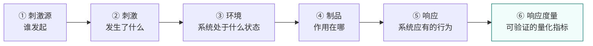
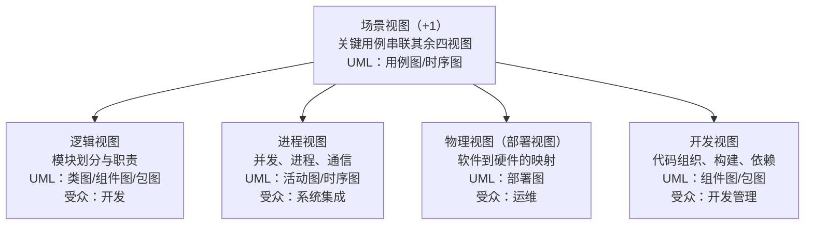
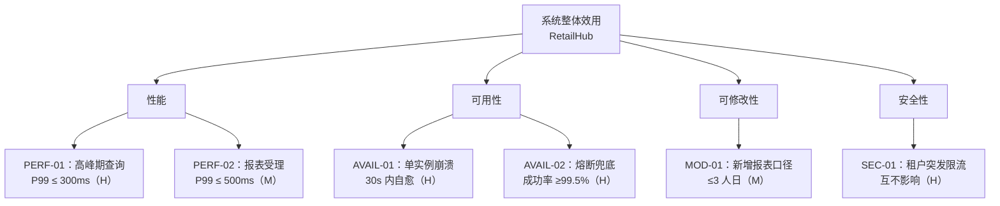
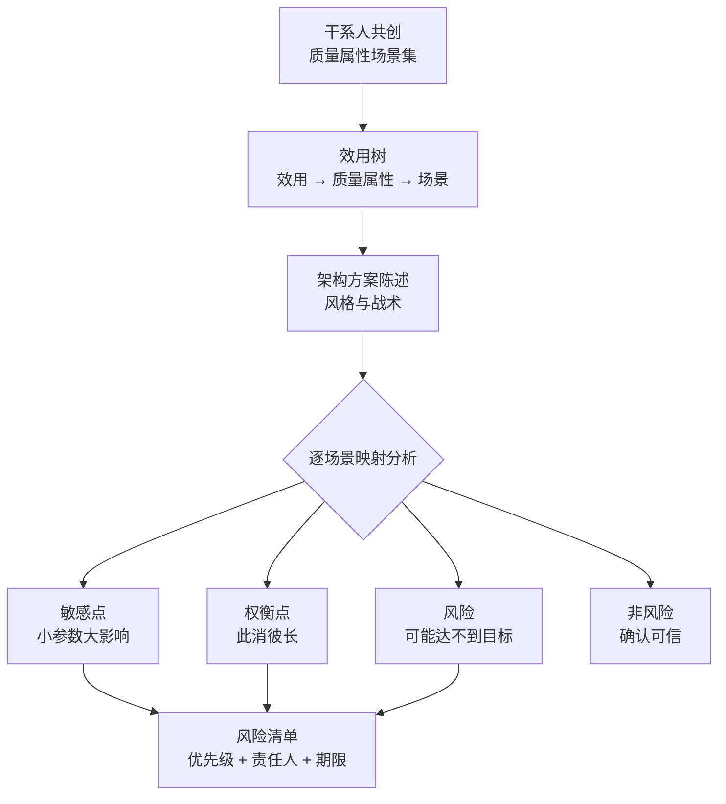
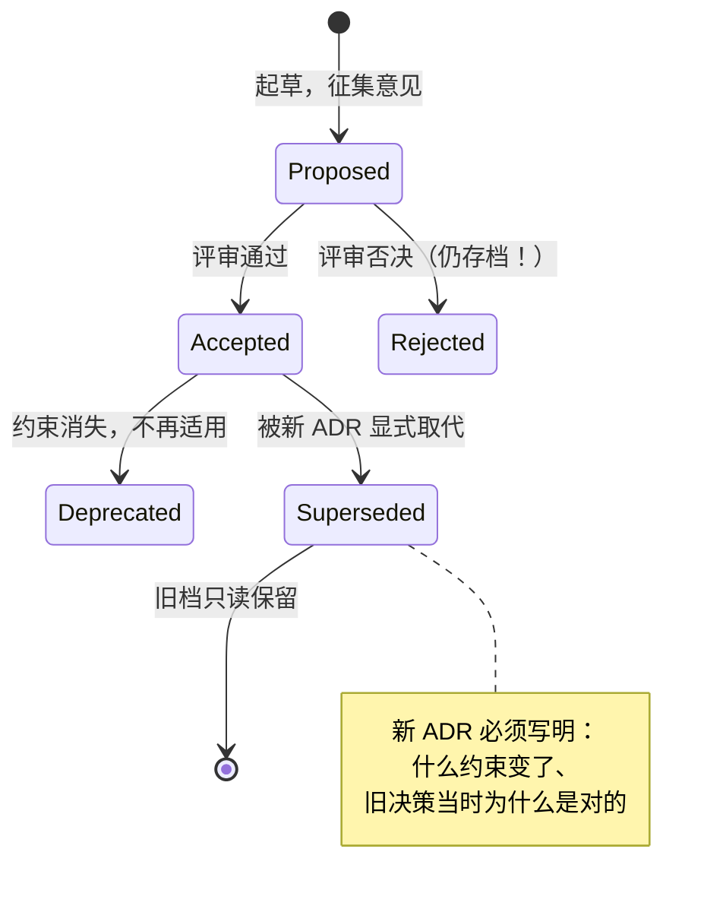

# 卷05-1：架构师方法论——把脑子里的判断，变成可评审、可传承的架构资产

> 导语：卷04 结束时，RetailHub 已经是一个扛得住流量、看得见内部、交付有标准的分布式系统。但回顾前四卷，所有关键决策——为什么从模块化单体起步、为什么引入 MQ、为什么选本地消息表而不是 TCC、平台边界划在哪——都只存在于你的脑子里和零散的聊天记录里。这正是不成熟架构团队与成熟架构团队的分水岭：**前者靠英雄回忆，后者靠架构资产**。本页（卷05 上半）把架构师方法论的主线系统过一遍：架构师角色定位、架构风格体系、质量属性、UML/4+1 视图、设计模式、ATAM 架构评估、ADR——软考"系统架构设计师"的知识框架[^ruankao]与考试教不了的实战工作方法同步推进，各节标注的软考考点供备考读者对照。软考三科备考策略、论文骨架与 RetailHub 第 5 步实战（产出完整架构文档包）在下一页卷05-2；这套方法论则会在阶段九（Agent 企业工程化）里原封不动地复用——Agent 系统的架构评审，评的还是这些东西。

---

## 1. 架构师到底是什么角色：不是"高级开发"，是"技术决策的责任人"

### 1.1 三个常见误解

- **误解一：架构师 = 写得一手好代码的资深开发。** 编码能力是必要不充分条件。架构师的核心产出不是代码，而是**决策**：划分边界、选择取舍、定义约束、承担后果。
- **误解二：架构师 = 画图的。** 图只是决策的表达载体。没有决策支撑的图是美术作品，有决策支撑的草图也是架构文档。
- **误解三：架构师定完方案就完事。** 架构师对决策的**全生命周期**负责：落地时跟踪偏差、评审时接受质询、出事时复盘决策本身（而不是只复盘执行）。

把"决策的责任人"这五个字再拆开看，它包含三层义务：**决策前有方法**（不是拍脑袋，而是按质量属性场景推导，见第 3 节）、**决策时有记录**（写下来并接受评审，见第 6、7 节）、**决策后有跟踪**（落地偏差、后果验证、必要时显式推翻自己——用一份新的 ADR 取代旧的，而不是悄悄改口）。程序员对代码的正确性负责，架构师对判断的正确性负责。

### 1.2 架构师的四类交付物（融合来源：软考"系统架构设计师"考试大纲 + 业界架构师岗位共识）

| 交付物 | 回答的问题 | 典型形式 |
|---|---|---|
| 架构视图 | 系统长什么样（不同视角） | 4+1 视图图集、部署图、时序图 |
| 质量属性设计 | 系统在关键指标上承诺什么、怎么兑现 | 质量属性场景清单、容量/可用性设计 |
| 决策记录 | 为什么这么选、放弃了什么 | ADR 集、选型对比报告 |
| 治理机制 | 架构如何不腐化 | 架构评审制度、适应度函数、技术雷达 |

注意一个共同点：**四类交付物全部是"写给未来的文档"**。代码表达"现在系统是什么"，架构交付物表达"为什么是这样、将来怎么变"。

### 1.3 软考视角下的架构师（软考考点：系统架构设计师岗位定位）

软考高级资格"系统架构设计师"对岗位的定义可以浓缩为三句话：主持系统架构设计、把控非功能性需求、在质量属性之间做权衡并为之负责[^ruankao]。注意"非功能性需求"和"权衡"这两个词——它们是本卷第 3 节和第 6 节的全部内容，也是软考案例分析与论文两大题型的真正考点。功能需求谁都会列，**能不能说清系统"要好到什么程度、牺牲什么换什么"，才是架构师与开发的分界线**。

---

## 2. 软件架构风格体系：软考逐个考，实战逐个用（软考核心考点：架构风格/架构模式）

架构风格（Architectural Style）是被反复验证的结构范式。软考喜欢考"识别与对比"，实战中你要做的是"识别当前问题匹配哪种风格"。逐个过：

### 2.1 数据流风格：管道-过滤器

数据经过一串互相独立的处理步骤（过滤器），步骤间用管道连接，每个过滤器只认输入输出格式、不知道上下游是谁。经典例子：编译器（词法→语法→语义→ codegen）、Unix 管道。**RetailHub 里的对应物**：卷03 报表生成管线（取数→清洗→聚合→渲染），以及将来阶段九 Agent 的 Context 装配管线。优点：步骤可替换可复用；缺点：不适合交互式系统，错误处理要在管道里显式设计。

### 2.2 调用-返回风格：分层

系统分为若干层，每层只能调用相邻下层。最熟悉的当然是"表现层/业务层/数据层"。优点：关注点分离、层内可替换；缺点：**层间穿透的性能损耗**和"改一个需求穿透所有层"的变更涟漪。软考常考的变体是"严格分层"（只能调下一层）与"松散分层"（可跨层）的区别——前者隔离性更强，后者性能更好。

### 2.3 微内核（插件）风格

一个极小的核心系统 + 一组可插拔插件。Eclipse、VS Code、Jenkins 都是。核心只定义扩展点契约，功能全在插件里。**这个风格是阶段九 Agent 系统的灵魂**：LLM Runtime 是微内核，工具（Tool）和技能（Skill）是插件，MCP 就是插件契约。你现在理解微内核风格，阶段九理解 Agent 工具治理就是顺水推舟。

### 2.4 事件驱动风格（隐式调用）

组件不直接互调，而是发布事件，订阅者各自响应。RetailHub 卷02 引入 MQ、卷04 落地 outbox 模式，走的就是这条路。优点：解耦与异步削峰；缺点：**控制流不再显式**——"这个事件到底谁消费了、触发了几条链路"需要额外的可观测设施（这正是卷04 接 OTel 的原因之一）。软考爱考它与"显式调用"的对比：调用方知不知道接收方的存在。

### 2.5 CQRS（命令查询职责分离）

写模型和读模型分开：写侧用规范化模型保证一致性（卷03 的订单主库），读侧用面向查询优化的物化视图/宽表（卷02 的读写分离 + 卷03 的报表库）。适合读写比例悬殊、读写模型差异大的系统——零售经营分析平台是教科书级适用场景。代价：读写模型间的数据同步带来最终一致性和运维复杂度。

### 2.6 对比总表（软考高频）

| 风格 | 核心结构 | 最适合 | 主要代价 | RetailHub 中的落点 |
|---|---|---|---|---|
| 管道-过滤器 | 独立步骤串行流转 | 数据加工、编译、ETL | 交互弱、错误传播要显式设计 | 报表生成管线 |
| 分层 | 相邻层单向调用 | 企业业务系统 | 变更穿透、层间损耗 | 网关/服务/存储三层 |
| 微内核 | 小核心+插件契约 | 生态型产品 | 核心契约设计极难，改契约代价大 | （阶段九）Agent Runtime+Tool |
| 事件驱动 | 发布-订阅解耦 | 异步削峰、跨域集成 | 控制流隐式、排查依赖 Trace | MQ 异步报表、outbox |
| CQRS | 读写模型分离 | 读写悬殊、读模型复杂 | 最终一致、同步链路运维 | 订单写库 vs 经营分析读库 |

**软考答题技巧**：给一个场景描述问"应选哪种架构风格"，先找两个信号——**数据是否要经过多步独立加工**（是→管道-过滤器）、**是否需要第三方扩展功能**（是→微内核）、**读写诉求是否差异巨大**（是→CQRS）、**组件间是否需要解耦异步**（是→事件驱动）。

---

## 3. 质量属性：架构师真正设计的东西（软考绝对核心考点）

### 3.1 为什么"高性能"不是需求，"P99 ≤ 300ms @ 500 QPS"才是

功能需求决定系统"对不对"，质量属性（非功能性需求）决定系统"好不好"。软考与业界共识的五大质量属性[^bass]：

| 质量属性 | 含义 | 典型战术（tactics） |
|---|---|---|
| 性能 | 单位资源的响应能力 | 缓存、异步化、批处理、资源池、读写分离 |
| 可用性 | 故障时持续提供服务的能力 | 冗余、熔断、降级、故障转移、探针自愈 |
| 可修改性 | 以可控成本变更的能力 | 模块化、信息隐藏、契约稳定、配置外置 |
| 安全性 | 抵御未授权访问与攻击 | 认证授权、审计、加密、最小权限、限流防刷 |
| 可测试性 | 以可控成本验证系统 | 依赖注入、接口隔离、可观测、环境可复制 |

注意右列：这些"战术"你全认识——它们就是卷02、卷04 学过的每一个机制。**这是本卷最重要的一个认知翻转：前四卷学的所有技术手段，本质都是质量属性的实现战术**。缓存不是目的，性能才是；熔断不是目的，可用性才是。架构设计就是从质量属性目标出发选配战术，而不是反过来拿战术凑方案。

**战术是成体系的**。每个质量属性背后都有一棵"战术树"，例如可用性战术分三支：**故障检测**（心跳、探针、监控告警）、**故障恢复**（冗余切换、重试、回滚）、**故障预防**（熔断、限流、降级、摘除预知——把要下线的实例先从负载均衡摘掉再操作）。做设计时按战术树逐项自问"我有没有覆盖"，比凭经验拍脑袋系统得多。软考案例分析里"指出该方案可用性设计的不足"，标准答案的骨架就是这三支[^bass][^phoenix]。

### 3.2 质量属性场景六要素（软考案例分析必考写法）

"系统要快"无法设计、无法验证、无法评审。质量属性必须用**场景**表达，六要素缺一不可：



1. **刺激源（Source）**：谁发起的——用户、外部系统、攻击者、管理员。
2. **刺激（Stimulus）**：发生了什么——请求到达、故障发生、变更请求。
3. **环境（Environment）**：系统处于什么状态——正常运行、高峰期、降级模式。
4. **制品（Artifact）**：作用在系统的哪个部分——订单接口、库存服务、整个平台。
5. **响应（Response）**：系统应有的行为——返回结果、拒绝请求、自动切换。
6. **响应度量（Response Measure）**：可验证的量化指标——延迟、成功率、恢复时间。

反例 vs 正例：

> ❌ "系统可用性要高。"
> ✅ 刺激源：基础设施；刺激：库存服务单个实例崩溃；环境：大促高峰期（10 倍日常流量）；制品：库存扣减链路；响应：K8s 自动摘除并补齐副本，请求由存活实例承接；响应度量：用户侧错误率 30 秒内恢复至 <0.1%，无人工介入。

**只有写成这样，"可用性"才能进入设计（用什么战术兑现？）、进入测试（怎么验证？）、进入评审（评审人挑战什么？）**。三个要素最容易写漏：**环境**（同一个故障在正常流量和 10 倍流量下是两回事）、**制品**（"系统"太大，必须落到具体链路）、**响应度量**（没有数字的场景等于许愿）。本卷实战要求你写 6 个这样的场景。

动手写之前，先用这个构建器练手：从六个下拉框各选一项拼出场景，质量检查器会按"六要素齐全、度量含数字与口径、无模糊词"的规则打分——建议先点"加载病句示例"看看一条"愿望式需求"会输得多惨：

```demo quality-scenario
```

**Demo 导学单**（建议按顺序观察）：

1. 点"加载满分示例（PERF-01）"→"检查场景质量"，确认满分，并看清卡片里六要素是如何拼成一句话的。
2. 点"加载病句示例"→"检查"，逐条读诊断，理解为什么"响应要快、可用性要高"得 0 分。
3. 在满分示例基础上把"响应度量"换成病句那条，再检查——体会"度量一个要素不合格，整条场景报废"。
4. 点"随机组合一条"三次，观察检查器对"故障类刺激 + 正常运行环境"给出的进阶提示。
5. 模仿满分示例，为 RetailHub 的"推理服务不可用"写一条场景并用"复制场景文本"导出，存进你的架构文档草稿。

---

## 4. UML 与架构建模：4+1 视图（软考考点：UML 图型识别 + 4+1 视图内涵）

### 4.1 为什么一张图画不下整个架构

不同干系人关心的问题不同：开发关心模块怎么分，运维关心部署在哪，产品经理关心用户操作流程。**4+1 视图**（Philippe Kruchten 提出，软考教材标准内容[^kruchten]）用五个视图覆盖全部干系人：



软考爱考的细节：逻辑视图回答"功能怎么分解"，进程视图回答"非功能需求（性能、可用性）怎么通过并发设计达成"，物理视图回答"部署与容灾"，开发视图回答"团队如何并行开发而不互相踩踏"。**"+1"的场景视图不是第六种图，而是用少量关键用例把四个视图串起来验证一致性**——评审时它就是"走查脚本"。

**视图之间的一致性比单个视图的漂亮更重要**。评审中最高频的翻车不是"图难看"，而是"逻辑视图里有报表 Worker，物理视图里却没有它的 Deployment"——两个视图说的是两个系统。防御方法就一条：**每画完一个视图，用场景视图的关键用例在新视图上走查一遍**，走不通的就是漏了。

### 4.2 软考高频 UML 图型速记

| 图 | 属于 | 一句话用途 | 易混点 |
|---|---|---|---|
| 用例图 | 静态（需求） | 谁用系统做什么 | 只表达"做什么"，不表达流程顺序 |
| 类图 | 静态 | 领域模型与关系 | 泛化（继承）vs 实现（接口）vs 组合 vs 聚合，软考必考箭头 |
| 时序图 | 动态 | 对象间按时间的交互 | 强调"消息先后顺序" |
| 活动图 | 动态 | 流程与分支并发 | 像流程图，但原生支持并发分叉/汇合 |
| 状态图 | 动态 | 单对象生命周期 | 卷04 熔断器三态就是状态图 |
| 部署图 | 静态 | 节点与制品映射 | 4+1 物理视图的标准表达 |

---

## 5. 设计模式在架构层的映射：只讲架构师真正高频用的 10 个

GoF 23 个设计模式是代码层的词汇表，但有一批模式频繁出现在**架构决策**层面。架构师谈模式时，谈的是结构与权衡，不是代码实现：

| 模式 | 架构层含义 | 你在哪已经用过 |
|---|---|---|
| 门面（Facade） | 用统一入口隐藏子系统复杂度 | API 网关 |
| 适配器（Adapter） | 把异构接口翻译成统一契约 | 多租户数据源 Connector |
| 代理（Proxy） | 在调用路径上插入治理逻辑 | 熔断/限流/鉴权中间件 |
| 观察者（Observer） | 发布-订阅解耦 | MQ、outbox 事件 |
| 策略（Strategy） | 把可互换的算法族抽成契约 | 多模型路由、负载均衡策略 |
| 模板方法（Template） | 固定流程骨架，开放变化点 | 报表管线、（阶段九）Agent 执行范式 |
| 组合（Composite） | 树形结构统一对待整体与部分 | 菜单/权限树、（阶段九）Skill 嵌套 |
| 责任链（Chain） | 请求沿处理者链传递 | 中间件管线、审批流 |
| 享元（Flyweight） | 共享细粒度对象省资源 | 连接池、线程池的本质 |
| 备忘录（Memento） | 捕获与恢复内部状态 | 配置版本回滚、（阶段九）Agent Run 断点恢复 |

学习建议：不要背 UML 类图，要为每个模式记住一句"它把什么变化点隔离到了哪里"。架构层面用模式，**用的永远是它对变化点的隔离方式**。

---

## 6. 架构评估：ATAM 与权衡分析（软考考点：架构评估方法）

### 6.1 为什么需要评估方法

架构评审最怕两种结局：一是"评审会变成寒暄会"，大家客客气气通过；二是"评审会变成抬杠会"，每人从自己最熟的领域开炮，议而不决。ATAM（Architecture Tradeoff Analysis Method，架构权衡分析方法，SEI 提出[^bass]）的价值是给评审一个**结构化议程**，把火力引导到真正重要的问题上。

### 6.2 ATAM 的核心逻辑

1. **收集质量属性场景**：从干系人那里收集（或共创）一批按第 3 节格式写好的场景，形成"效用树"——从"系统整体效用"分解到各质量属性再到具体场景。
2. **架构方案陈述**：架构师说明用哪些战术/风格兑现这些场景。
3. **分析映射**：逐个场景问"方案怎么满足它"，由此暴露四类结论：
   - **敏感点（Sensitivity Point）**：某个参数的小变化会引起质量属性的大变化（如"库存扣减的 DB 行锁持有时间"——它敏感于并发度）。
   - **权衡点（Tradeoff Point）**：一个决策同时改善一个质量属性、恶化另一个（如"引入缓存提升性能，但恶化数据一致性与可修改性"）。
   - **风险（Risk）**：可能无法达成质量目标的决策（如"Saga 补偿逻辑尚未设计状态机"）。
   - **非风险（Non-risk）**：经分析确认可信的决策——**显式记录非风险和记录风险同样重要，它防止评审无限发散**。
4. **输出风险清单与决策建议**，排优先级，明确责任人与期限。

效用树是 ATAM 的发动机，值得看一眼它长什么样——以 RetailHub 为例（叶子节点括号内是优先级：H=高 M=中 L=低，评审按优先级分配时间）：





ATAM 的名字里有个"Tradeoff"，这是它的灵魂：**架构没有完美解，只有权衡解**。评审的价值不在于证明方案"好"，而在于把"用什么换什么"摊到桌面上让干系人签字确认——事后业务方不能再说"我不知道引入缓存会有一致性窗口"，因为权衡点在评审纪要里写着。

### 6.3 成本更低的日常版：轻量架构评审

ATAM 完整执行要 2-3 天，日常迭代用它的简化版：一次评审聚焦 5-10 个质量属性场景，必须产出"风险/非风险/敏感点/权衡点"四类结论，且每条结论有责任人。评审的组织纪律（这是考试不教、实战必死的部分）：

- **会前发材料，会上不宣讲**。评审时间全部用于质询，不是听 PPT。
- **挑战决策，不挑战人**。话术是"这个决策在场景 S3 下怎么成立"，不是"你怎么会这么想"。
- **没有结论不散会**。每个风险要么接受（显式记录"已知悉并接受"）、要么有行动项。
- **评审纪要是架构资产**，归档进文档库，下次评审先过上次的风险清单。

---

## 7. ADR：架构决策记录——最便宜、ROI 最高的架构资产

### 7.1 为什么是 ADR

团队最大的隐性成本之一是"考古成本"：半年后没人记得"为什么选 MQ 异步报表而不是同步生成"，于是新人推翻重来，踩回当年踩过的坑。ADR（Architecture Decision Record）的解法朴素到极点：**每个重要决策写一份一页纸的存档，不可修改，只可被新的 ADR 取代**[^nygard]。

"不可修改，只可取代"这条规则值得展开。决策是有上下文的——半年前的决策在当时的约束下是对的，约束变了决策才可能变。如果允许修改旧 ADR，历史就被悄悄篡改了：后来的人看到的是"一直如此"，看不到"曾经如此、为何改变"。ADR 用状态机管理生命周期，而不是用编辑覆盖历史：



特别注意 **Rejected（被否决的提案也要存档）**——它是未来团队最宝贵的"排雷图"：没有它，每来一个有想法的新人，都会重新提议一遍当年被否决的方案，再花一周重新论证一遍。

### 7.2 标准结构（Michael Nygard 模板，业界事实标准[^nygard]）

```markdown
# ADR-004：报表生成采用 MQ 异步化而非同步生成

- 状态：已接受（Accepted）　　日期：2025-06-10
- 决策者：架构组（张工主笔，李工、王工评审通过）
- 关联：ADR-002（引入 MQ 作为异步基础设施）、质量属性场景 PERF-02

## 背景（Context）
经营报表需聚合 30 天订单明细（千万级行），同步生成实测 P95 = 28s，
超出质量属性场景 PERF-02 承诺的接口 P99 ≤ 3s；且报表高峰（周一早）
与下单高峰叠加，同步生成会挤占下单库连接。

## 决策（Decision）
报表请求受理后立即返回任务 ID，由 MQ 投递给报表 Worker 异步生成，
完成后写结果表并通知前端轮询/推送。

## 备选方案（Alternatives Considered）
1. 同步生成 + 加长超时：否决。违反 PERF-02，且连接占用问题无解。
2. 预计算宽表（CQRS 读模型）：保留。数据新鲜度要求高的报表二期采用，
   当前租户对 T+1 新鲜度可接受。
3. 同步生成但限流：否决。限流只保护系统不保护用户体验。

## 后果（Consequences）
- 正面：接口延迟 P99 降至 200ms；下单与报表资源隔离；Worker 可独立扩缩容。
- 负面：引入任务状态机（PENDING/RUNNING/DONE/FAILED）与失败重试的运维面；
  用户体验从"等结果"变为"查任务"，需前端配合改造。
- 后续动作：任务状态查询接口（Q3 完成）；失败率 >5% 告警（已上线）。
```

要点只有四个：**写背景（当时的约束）而不只写结论；写被否决的方案和否决理由；写负面后果（没有负面后果的决策要么是假的要么没想清楚）；状态机管理（Proposed→Accepted→Superseded by ADR-XXX）**。

再把四个要点换成反面教材看一眼，印象更深：

| 要点 | 不合格的写法 | 为什么不合格 |
|---|---|---|
| 背景 | "报表有点慢，所以改造" | 没有约束和数字，后人无法判断决策的前提是否还成立 |
| 被否决方案 | 只字不提 | 半年后新人重新提议被否决方案，全员再吵一遍 |
| 负面后果 | 只写收益 | 要么是没想清楚，要么是在推销而非记录；运维期的坑全部"惊喜化" |
| 状态 | 没有状态字段 | 无法区分"现行有效"与"已被取代"，文档越多越乱 |

**ADR 的粒度纪律**：一个 ADR 只记一个决策。"引入 MQ 并采用 outbox 并确定消息格式"是三个 ADR——因为它们可能被分别推翻。反过来，"把按钮颜色从蓝改绿"不配拥有 ADR。判断标准：**这个决策如果被推翻，代价是否大到值得留一份档案？**

### 7.3 ADR 与架构文档包的关系

ADR 记录"单点决策"，质量属性场景定义"验收标准"，架构评审负责"挑战决策与场景的映射"，4+1 视图负责"呈现整体结构"。四者合起来就是本卷实战要产出的**架构文档包**。这套组合不依赖任何昂贵工具，一个 Git 仓库就能运转——这也是它能进软考论文、也能进真实团队的原因。

### 7.4 架构文档包的组织与写法

四类资产放进仓库后，最后一道工序是**让它们能被找到、被读懂**。推荐的 `docs/` 结构与写法纪律：

```text
docs/
├── README.md                 # 导览索引：系统是什么、从哪读起（30 分钟 onboarding 路径）
├── views/                    # 4+1 视图图集（mermaid 源文件，随代码评审更新）
│   ├── logical.md  process.md  physical.md  development.md  scenarios.md
├── quality-scenarios.md      # 质量属性场景清单（六要素表格，每条有编号）
├── adr/
│   ├── README.md             # ADR 索引表：编号/标题/状态/日期
│   ├── 0001-xxx.md  0002-xxx.md ...
└── reviews/                  # 评审纪要（按日期归档，含风险清单与行动项）
```

三条写法纪律：

1. **README 是唯一入口**。任何文档不允许"知道的人才找得到"——新人按 README 导览 30 分钟内必须能讲清系统架构，这是文档包的验收线，不是修辞。
2. **文档与代码同仓同评审**。架构文档放 Wiki 的宿命是腐化——代码变了没人记得去另一个系统改文档。同仓意味着"改了结构就必须在同一个 PR 里改图"，评审者一眼能看到代码与文档不一致。
3. **每份文档标注 owner 与最近验证日期**。"最后验证：2025-08，与 v1.4 部署一致"——没有验证日期的文档，读者不知道它还能不能信。

---

## 参考与脚注

[^ruankao]: 中国计算机技术职业资格网（软考官网），https://www.ruankao.org.cn 。系统架构设计师的考试大纲、科目设置与合格标准以官网当年公布为准；本卷第 1、8 节的岗位定义与考试结构归纳自该考试体系。
[^bass]: Len Bass, Paul Clements, Rick Kazman，《Software Architecture in Practice》（软件架构实践，第 4 版，Addison-Wesley, 2021）。本卷第 3 节的质量属性与战术树、第 6 节的 ATAM 方法（效用树、敏感点/权衡点/风险/非风险）主要参考该书第 3–9 章（质量属性各章）与第 22 章（架构评估）。
[^kruchten]: Philippe Kruchten, "The 4+1 View Model of Architecture", IEEE Software, 1995。4+1 视图的原始论文，本卷第 4 节的视图定义与"+1 场景视图"定位出自该文。
[^nygard]: Michael Nygard, "Documenting Architecture Decisions"（2011），https://cognitect.com/blog/2011/11/15/documenting-architecture-decisions 。ADR 的原始提出者与标准模板（Context/Decision/Status/Consequences），本卷第 7 节的模板与"不可修改只可取代"规则出自该文。本站存档见[资料06](资料06-ADR原始博客.md)。
[^phoenix]: 周志明，《凤凰架构：构建可靠的大型分布式系统》，在线公开版：https://icyfenix.cn 。本卷架构风格与可用性战术部分可与该书分布式架构章节互相印证，可作延伸阅读。

➡️ 下一页：卷05-2-软考备考与架构文档包实战.md
