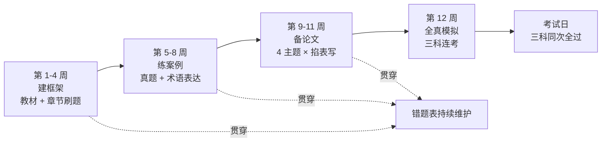
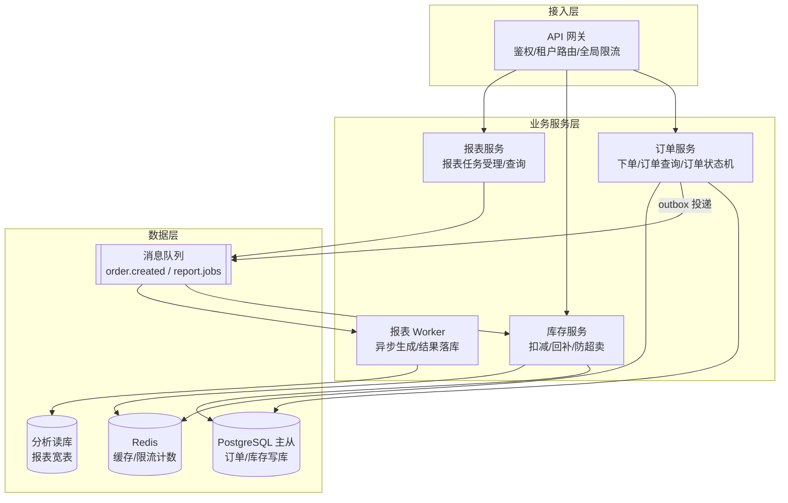
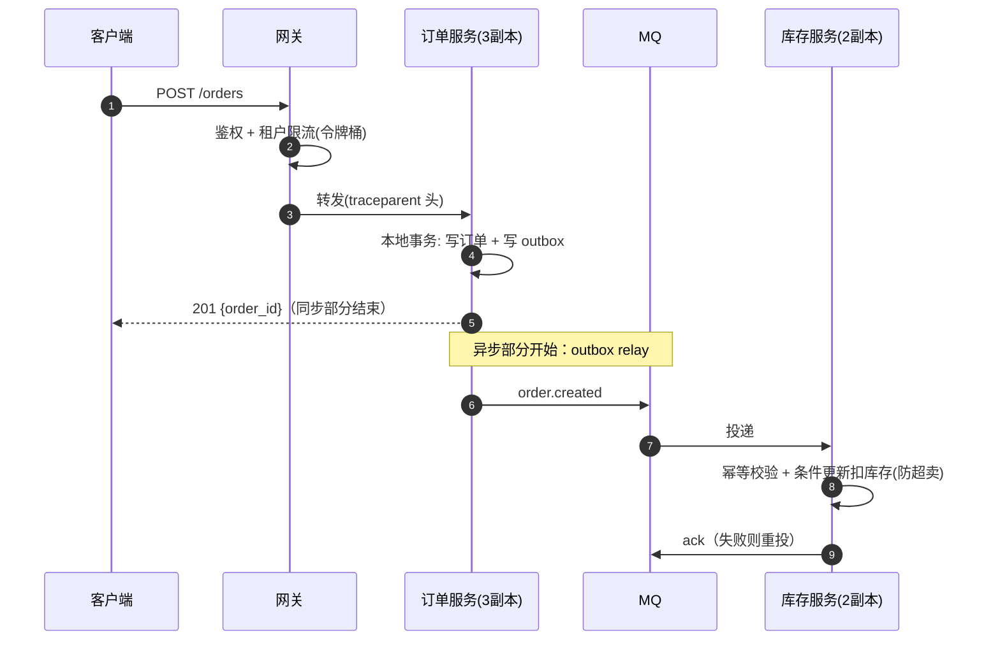
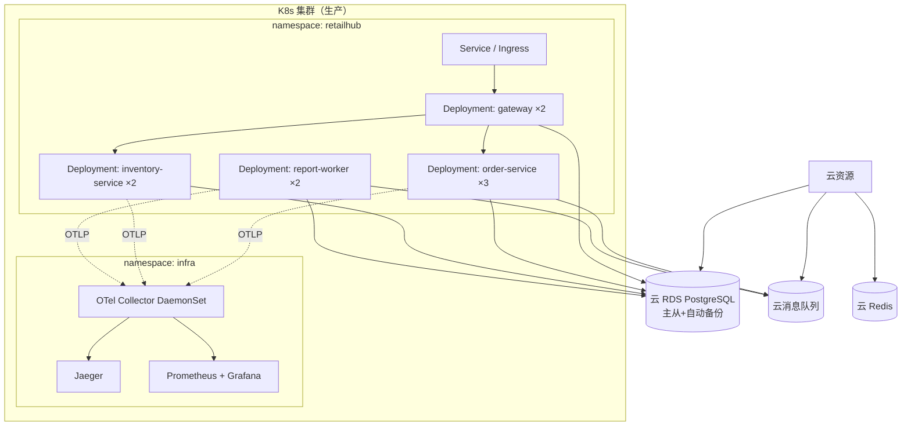
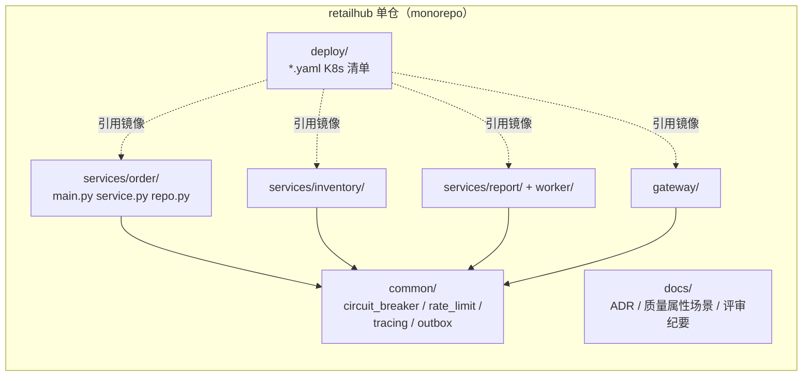

# 卷05-2：软考备考与架构文档包实战——把方法论变成分数与交付物

> 导语：上一页（卷05-1）已经把架构师方法论的主线讲完——角色定位、架构风格、质量属性、4+1 视图、ATAM、ADR（本页正文中提到的"本卷第 1-7 节"均指卷05-1 的对应章节）。本页做两件"兑现"的事：一是软考"系统架构设计师"三科备考地图与论文万能骨架，把方法论变成分数；二是 RetailHub 演进第 5 步实战，把方法论变成一份可参评的完整架构文档包——它既是你案例分析/论文的素材库，也是真实团队 onboarding 的入口。
>
> **不考软考的读者怎么读这一页**：第 8 节（三科题型、评分逻辑、三个月计划）可以速读或直接跳过，但建议留意 8.3 的论文万能骨架——它本质是"把一个架构主题讲成结构化文章"的通用模板，写技术分享、晋升答辩、架构汇报时同样适用；第 9 节（方法论在阶段九如何复用）、第 10 节实战（架构文档包四份交付物）、第 11 节常见误区与第 12 节自测清单**与考试无关、人人必读必做**——实战产出的文档包是不考软考也一样要交付的团队资产，自测清单中涉及备考的两条（三科题型、论文骨架）可跳过。

---

## 8. 软考备考地图：三科题型、评分逻辑与 3 个月计划

### 8.1 考试结构（系统架构设计师，高级资格）

| 科目 | 形式 | 时长 | 合格线 | 本质考什么 |
|---|---|---|---|---|
| 综合知识 | 75 道单选 | 150 分钟 | 45/75 | 知识广度：计算机基础+软件工程+架构理论+新技术 |
| 案例分析 | 5 选 3 道大题，每题 25 分 | 90 分钟 | 45/75 | 应用能力：给场景做风格选型、质量属性分析、权衡判断 |
| 论文 | 4 选 1 写一篇约 2500 字论文 | 120 分钟 | 45/75 | 表达能力：结合"自己的项目"论述一个架构主题 |

三科**必须同一次全部 ≥45 分**，单科不保留成绩——这是软考最残酷的规则，备考策略必须三科并进，不能偏科。考试政策与大纲以中国计算机技术职业资格网公布为准，报名前务必核对当年安排[^ruankao]。

### 8.2 各科评分逻辑与对应策略

**综合知识**：考的是"见过没有"。本卷第 2、3、4 节（架构风格、质量属性、UML）加上卷03 的数据库、卷04 的分布式，覆盖了架构板块大头；剩下的计算机组成、操作系统、网络、安全、法律法规需要单独刷。策略：**以历年真题为纲**，近 5 年真题做两遍，错题回到教材补——不追求全懂，追求考点覆盖。

**案例分析**：考的是"套路化的应用"。高频题型就几类：识别架构风格并比较优劣、补写质量属性场景、指出方案的风险与权衡点、画/补 UML 图。你注意到没有——**这些题型本卷已经全部讲过**。案例分析的本质是"用规范术语把工程判断写出来"，有真实项目经验的人最大的陷阱是"会做事不会答题"：答案要用教材术语（"敏感点""权衡点""战术"），不要用公司黑话。

再给一个案例分析的**答题模板**（阅卷按点给分，"踩点"比"写满"重要）：

1. **先定性**："该系统应采用 XX 风格/该决策属于权衡点"——把判断亮在最前面；
2. **再给依据**：引用题干中的场景要素（"题干提到读写比例 10:1，故读模型应独立优化"）；
3. **最后给代价**：任何方案都补一句"代价是……"——阅卷人看到代价分析就知道你是真懂权衡，而不是背答案。

**论文**：考的是"你能不能把一个架构主题讲成结构化的文章"。评分维度大致是：切题、理论正确、有真实项目细节、结构完整。论文是**可以提前准备 80% 的科目**——见下面的万能骨架。

### 8.3 论文万能骨架（以"论软件架构的质量属性设计"为例）

```markdown
【摘要】（300 字内）
本文以我参与的零售经营数据平台（RetailHub）为背景，论述质量属性驱动的
架构设计。项目为面向品牌商家的多租户 SaaS，支撑订单分析与经营报表。
我担任架构师，负责非功能需求定义与架构决策。实践中我以质量属性场景
六要素显式化性能与可用性目标，运用缓存、读写分离、熔断降级等战术兑现，
并通过 ATAM 方法组织架构评估。最终系统在大促 10 倍流量下保持接口
P99 ≤ 300ms、可用性 99.95%。

【正文结构】
1. 项目背景与我的职责（400 字）：业务规模、技术栈、我在其中的角色。
   —— 注意：项目可以脱敏改写，但细节必须真实可信（数字、坑、权衡）。
2. 理论展开（600 字）：质量属性六要素、战术清单、敏感点/权衡点概念。
   —— 展示"我懂理论"，术语要准。
3. 实践分述 2-3 个案例（1000 字）：每个案例按"问题→场景定义→战术选择
   →权衡与代价→量化结果"展开。
   —— 阅卷人在这里找"真实感"：真实的失败、真实的数字、真实的权衡。
4. 不足与展望（200 字）：留一个真实的不足（如"可修改性度量缺失"），
   显得诚实且有判断力。
```

**三个保分细节**：摘要必须出现"我担任什么角色、用了什么方法、取得什么量化结果"三要素；正文每个案例都要有至少一个数字（延迟、流量、可用性、人日）——没有数字的"实践"会被判为编造；结尾的"不足"必须具体（"可修改性缺乏度量手段"），写"还有很多不足请老师指正"等于自曝没有判断力。

### 8.4 三个月备考计划

| 阶段 | 时间 | 动作 |
|---|---|---|
| 第 1-4 周：建框架 | 每天 1-1.5h | 通读教材架构板块（本卷内容可当大纲）；综合知识按章节刷题，错题建表 |
| 第 5-8 周：练案例 | 每天 1.5h | 近 5 年案例分析真题，每题先自己写再对标答案改——重点改"术语表达"；同时把本卷实战的架构文档包当素材库 |
| 第 9-11 周：备论文 | 每周写 1 篇 | 按万能骨架准备 3-4 个主题（质量属性、架构风格、架构评估/ATAM、微服务/分布式），每个主题套自己的项目写一遍，掐表 120 分钟 |
| 第 12 周：全真模拟 | 隔天一套 | 三科连考完整模拟，训练体力分配；回归错题表和论文骨架 |



**本路径读者的独特优势**：你已经有一个真实演进的项目（RetailHub），论文的"真实细节"对你是现成资产——没有项目经验的考生最痛苦的就是编项目，而你要做的只是别在论文里写太多。

---

## 9. 这套方法论在阶段九如何全部复用

先剧透后验证——等你走到阶段九（Agent 企业工程化），会再次遇到本卷每一件工具：

- **质量属性场景**：Agent 的"质量属性"更苛刻——除了性能可用性，还有**效果质量**（诊断准确率）、**安全**（工具副作用）、**成本**（Token 预算）。评测基线（篇09）本质上就是 Agent 版的质量属性场景 + 响应度量。
- **ADR**：Agent 系统的决策更短命（模型换一代，Prompt 契约可能全变），**决策记录的价值反而更高**——"为什么当时选这个模型路由策略"会成为每次模型升级时的必读档案。
- **架构评审**：篇09 的 Regression Gate 与受控发布，本质是把架构评审从"人评文档"进化为"机器评测 + 人评决策"。
- **4+1 视图**：Agent 系统的进程视图（Runtime 并发执行）和物理视图（GPU/推理资源部署）会比传统系统更难画，也更需要画。

一句话：**本卷学的是"如何对复杂系统做出、记录、评审决策"，Agent 只是让这个能力更稀缺，不是让它过时**。

---

## 10. 本卷实战：RetailHub 演进第 5 步——产出完整架构文档包

### 10.1 背景

RetailHub 当前形态（卷04 末态）：网关 + 订单/库存/报表三个服务，K8s 部署（3 副本滚动更新），outbox 异步链路，OTel 全链路 Trace，租户级限流与熔断。文档现状：只有卷03 的数据架构设计文档，散落各处。本步要把它升级为一份**可参评的架构文档包**——既是你软考案例分析/论文的素材，也是真实团队 onboarding 的入口。

### 10.2 递进任务步骤

四份交付物，建议按顺序推进（视图是骨架，场景是承诺，ADR 是历史，评审是验收）：

**步骤 1：4+1 视图图集（mermaid 绘制，5 张图）。**

- 目标：用五个视图把 RetailHub 的当前形态完整表达，且视图间互相一致。
- 操作：参照 10.3 节给出的四张图骨架（逻辑/进程/物理/开发），补齐场景视图的走查说明；每画完一个视图，用"下单"用例走查一遍一致性（4.1 节方法）。
- 验收标准：5 张图 mermaid 可渲染；场景视图能串联其余四视图；随机抽一个组件，它在逻辑视图、物理视图、开发视图里都能找到对应物。

**步骤 2：6 个质量属性场景（六要素格式）。**

- 目标：把 RetailHub 的非功能承诺从形容词变成可验证场景。
- 操作：先在 quality-scenario demo 里练 3 条找手感，再按 10.4 节的表格写满 6 条（性能 2、可用性 2、安全 1、可修改性 1）；写完逐条自检：环境写了吗？制品具体吗？度量有数字和口径吗？
- 验收标准：每条六要素完整，响应度量全部可机器验证（无"较高""尽量"类措辞）；至少 1 条场景有对应的验证手段（压测或混沌实验）。

**步骤 3：3 份 ADR（选真实发生过的决策）。**

- 目标：把卷01-04 里"脑子里做的决策"落成档案。
- 操作：按 7.2 节模板补全 10.5 节的三份骨架（ADR-004 已有完整示例可直接纳入）；写被否决方案时逼自己回忆"当时还考虑过什么、为什么放弃"。
- 验收标准：3 份 ADR 均含背景/决策/被否决方案及理由/正面与负面后果，状态字段完整；每份一页纸以内。

**步骤 4：一次模拟架构评审的评审意见与答复记录。**

- 目标：用评审检验前三步的成果，体验"被质询"的感觉。
- 操作：拉一位同事（或让 AI 扮演三个不同立场的评审人，见 10.6 的 AI Coding 模式）对文档包质询；按 6.3 节纪律记录——每条质询给出风险/非风险/敏感点/权衡点的结论（参照 10.6 的纪要示例）。
- 验收标准：每条质询有明确结论，每个风险有行动项、责任人、期限；纪要归档进 `docs/reviews/`。

### 10.3 交付物 1 参考骨架：4+1 视图图集

**逻辑视图**——模块划分与职责：



**进程视图**——下单链路的并发与异步：



**物理视图**——部署拓扑：



**开发视图**——代码组织：



**场景视图（+1）**——用一条关键用例串联验证：上文进程视图的"下单"序列图即场景视图，它同时穿越逻辑视图的模块（订单/库存/MQ）、物理视图的节点（各 Deployment）、开发视图的代码边界——四视图一致。

### 10.4 交付物 2 参考骨架：质量属性场景（6 个，六要素格式）

| # | 刺激源 | 刺激 | 环境 | 制品 | 响应 | 响应度量 |
|---|---|---|---|---|---|---|
| PERF-01 | 租户用户 | 并发查询请求 | 晚高峰 3 倍日常流量 | 订单查询接口 | 正常响应 | P99 ≤ 300ms，错误率 <0.1% |
| PERF-02 | 租户运营 | 提交经营报表 | 周一早报表高峰 | 报表受理接口 | 受理并返回任务 ID | 受理接口 P99 ≤ 500ms；报表 15 分钟内完成率 ≥99% |
| AVAIL-01 | 基础设施 | 库存服务单实例崩溃 | 大促 10 倍流量 | 库存扣减链路 | 探针摘除+副本补齐，流量自动转移 | 用户侧错误率 30s 内恢复至 <0.1%，无人工介入 |
| AVAIL-02 | 库存服务 | 响应延迟超 2s 持续 1 分钟 | 正常运行 | 下单链路 | 熔断打开走 fallback，扣减请求进入补偿队列 | 下单主接口成功率 ≥99.5%；补偿队列 5 分钟内消化完毕 |
| SEC-01 | 恶意调用方 | 单租户 10 倍配额突发请求 | 正常运行 | 全平台接口 | 该租户被限流拒绝，其他租户不受影响 | 越限请求 100% 返回 429；其他租户 P99 劣化 <10% |
| MOD-01 | 业务方 | 新增一种报表指标口径 | 正常运行 | 报表服务 | 仅改动报表服务内指标配置，不动其他服务 | 从需求到上线 ≤3 人日；不触发其他服务重新部署 |

### 10.5 交付物 3 参考骨架：三份 ADR（按第 7 节模板补全）

- **ADR-004：报表生成 MQ 异步化**（完整示例见第 7.2 节，直接纳入文档包）
- **ADR-007：服务间调用保持 REST 而非引入 gRPC**。背景：团队规模 6 人、内网调用量 <200 QPS；决策：维持 REST + OpenAPI 契约；否决 gRPC 的理由：IDL 工具链与网关改造成本当前无收益对冲；后果：保留未来按服务粒度局部引入 gRPC 的可能，契约先行。
- **ADR-009：分布式事务采用本地消息表而非 TCC**。背景：下单链路跨订单/库存/营销三服务，无强一致资金场景；决策：outbox + 消费端幂等；否决 TCC 的理由：每个接口三个版本的开发成本与 6 人团队规模不匹配，且"订单已创建库存未扣"的中间态业务可接受（有补偿队列兜底）；负面后果：需要维护 relay 任务与 dedup 表，库存短时不一致窗口（秒级）需在运营侧披露。

### 10.6 交付物 4 参考骨架：模拟架构评审纪要（精简示例）

```markdown
# 架构评审纪要 #3 —— RetailHub 卷04 架构增量
日期：2025-08-14　评审人：李工（后端）、王工（SRE）、陈工（业务方）
被评材料：4+1 视图 v1.2、质量属性场景 6 条、ADR-004/007/009

## 质询与答复
Q1（王工）：AVAIL-02 说补偿队列 5 分钟消化完毕，依据是什么？
A1（张工）：按大促峰值 200 单/分钟、熔断持续 1 分钟估算积压约 200 条，
库存服务恢复后消费速率 100 条/秒，理论消化 <1 分钟，留 5 倍余量。
→ 结论：非风险，但需补充"补偿队列积压 >500 条"的告警（行动项 A-1，王工，8/20）。

Q2（陈工）：熔断期间用户下单成功但库存没扣，超卖风险怎么算？
A2：下单成功≠履约承诺，订单状态为 CREATED，库存扣减失败会经 Saga 补偿
取消订单并通知用户；且卷03 的条件更新在 DB 层兜底，不会负库存。
→ 结论：非风险。业务侧需在订单页明示"库存确认中"状态（行动项 A-2，陈工，8/25）。

Q3（李工）：为什么限流计数放 Redis 单点？Redis 挂了限流全失效？
A3：这是本次评审暴露的真实风险。当前实现为进程内令牌桶（不依赖 Redis），
但多副本下各副本独立计数，实际限流阈值 = 阈值 × 副本数。
→ 结论：风险 R-1。接受短期偏差（文档注明），二期改 Redis 集中计数 + Redis
故障时 fail-open 降级为进程内限流（ADR-011 记录此决策，张工，8/18）。

## 结论汇总
- 风险 1 项（R-1，已有 ADR 与降级预案，接受）
- 非风险 2 项（Q1、Q2，已记录依据）
- 敏感点 1 个：限流阈值与副本数耦合，扩缩容时需重算——写入运维手册
- 权衡点 1 个：outbox 异步用"库存秒级不一致"换"下单链路可用性"，
  业务方已书面确认接受
```

### 10.7 AI Coding 实操模式

本步是文档密集型任务，AI 是天然的第一稿作者——但注意：**AI 不知道你当年为什么做那些决策，ADR 的"背景与被否决方案"必须由你口述给它**，否则它会编造听起来合理的历史。

**① 可复制提示词模板：**

```text
你是资深系统架构师。我的项目 RetailHub 是多租户零售经营 SaaS，
当前形态：API 网关 + 订单/库存/报表三服务（FastAPI），K8s 3 副本，
PostgreSQL 主从 + Redis + MQ（outbox 模式），OTel 全链路追踪。
请完成：
1. 按六要素（刺激源/刺激/环境/制品/响应/响应度量）起草 6 条质量属性场景，
   覆盖性能×2、可用性×2、安全×1、可修改性×1，响应度量必须含数字与统计口径；
2. 把以下决策改写成 Nygard 模板的 ADR（背景/决策/被否决方案及理由/正负后果），
   我口述的决策历史如下：【在此粘贴你的真实回忆】；
3. 扮演三位评审人（后端、SRE、业务方），对我的文档包各提 2 条尖锐质询。
约束：术语遵循软考教材（战术、敏感点、权衡点）；不确定的事实列出来问我，禁止编造。
```

**② AI 初版人工评审清单：**

- [ ] 场景的响应度量是否都含数字 + 口径（分位点/时间窗/成功率），还是混进了"较高""快速"？
- [ ] ADR 的"背景"是否与你口述的历史一致——AI 有没有悄悄美化或编造约束条件？
- [ ] 被否决方案的否决理由是否真的站得住（换个约束还成立吗），还是事后找补？
- [ ] AI 扮演的评审人提出的质询，有没有触及真问题（耦合点、单点、容量依据），还是只问了格式问题？
- [ ] 视图与场景是否互相引用得上（每条 AVAIL 场景能在物理视图里找到对应部署单元）？

**③ 验收标准：** 通过评审清单后，对照 10.8 节总验收逐条打勾；文档包里每一处"为什么"，你都能在两分钟内口头讲清出处——讲不清的段落要么是 AI 编的，要么是你自己也没想清楚，都不允许入库。

### 10.8 总验收标准

- [ ] 文档包包含 4+1 视图 5 张图，mermaid 可渲染，且场景视图能串联其余四视图
- [ ] 6 个质量属性场景每条都完整写出六要素，响应度量全部可机器验证（无"较高""尽量"类措辞）
- [ ] 3 份 ADR 均含背景/决策/被否决方案及理由/正面与负面后果，状态字段完整
- [ ] 评审纪要中每条质询有明确结论（风险/非风险/敏感点/权衡点之一），每个风险有行动项、责任人、期限
- [ ] 文档包全部入库（docs/ 目录，结构对照 7.4 节），README 中有导览索引，新同事按索引 30 分钟能讲清系统架构
- [ ] 用本卷文档包素材，按论文万能骨架写出 1 篇 2500 字软考论文初稿

---

## 11. 常见误区

1. **把架构师当晋升终点而非角色转变**——"升了架构师就不用写代码了"和"架构师就是代码写得最好的人"是同一个误解的两面。架构师对决策负责，编码是保持判断力的手段，不是职位描述。
2. **质量属性写形容词**——"高可用、高性能、易扩展"写进文档等于没写。没有响应度量的质量属性无法设计、无法测试、无法评审。
3. **画一张"大架构图"代替视图**——一张图同时表达模块、部署、流程的结果是谁都看不懂。视图分离不是形式主义，是给不同干系人各自的地图。
4. **ADR 只写结论不写被否决项**——"决定采用 Kafka"没有价值，"为什么否决 RabbitMQ 和 Pulsar"才有价值。考古的人要的是排除法的过程。
5. **评审会变宣讲会**——会上花 40 分钟讲 PPT，留 5 分钟"大家有没有问题"，等于没有评审。材料会前发，会上只质询。
6. **质量属性场景写完后不验证**——AVAIL-01 承诺"30 秒恢复"，就要真的杀一次库存服务实例掐表验证（混沌工程的朴素版）。不验证的场景是许愿。
7. **背模式名称代替理解变化点**——面试能说"这里用了观察者模式"但说不清"它把'谁关心这个事件'这个变化点隔离到了订阅注册表"，等于不会。
8. **论文现场即兴发挥**——软考论文 120 分钟写 2500 字，现场构思必死。3-4 个主题 × 自己的项目，考前全部写过一遍。
9. **三科偏科备考**——软考三科必须同次全过。只刷选择题不练论文，是最常见的挂法（反之亦然）。
10. **以为方法论会被 AI 淘汰**——恰恰相反：AI 让"写代码"变便宜，"决定写什么、放弃什么、为什么"更贵。本卷这套东西是 AI 时代溢价最高的工程能力之一。

---

## 12. 自测清单

- [ ] 能说出架构师与高级开发的核心区别，以及架构师的四类交付物
- [ ] 能逐个讲清管道-过滤器/分层/微内核/事件驱动/CQRS 的结构、适用场景与代价，并各举 RetailHub 中的一个落点
- [ ] 能默写质量属性场景六要素，并把"系统要快"改写成一条合格场景
- [ ] 能说出可用性战术树的三支（检测/恢复/预防），并举每支的两个实例
- [ ] 能画出 4+1 视图关系图，说明每个视图的受众和回答的问题，并解释视图一致性如何走查
- [ ] 能区分时序图与活动图、组合与聚合，并说出软考在这两类图上的常考角度
- [ ] 能对 10 个架构层高频模式各说一句"它隔离了什么变化点"
- [ ] 能讲清 ATAM 的四类结论（敏感点/权衡点/风险/非风险），并举本卷实战评审纪要中的实例
- [ ] 能画出 ADR 的状态机（Proposed→Accepted→Superseded/Rejected），并解释"被否决提案为什么也要存档"
- [ ] 能写出一份合格 ADR 的完整结构，并解释"为什么被否决方案比结论更重要"
- [ ] 能画出架构文档包的 docs/ 目录结构，说出三条写法纪律（README 唯一入口/同仓同评审/标注验证日期）
- [ ] 能复述软考三科的题型、合格线与"同次全过"规则，说出论文万能骨架的四段结构与三个保分细节
- [ ] 能举例说明质量属性场景、ADR、架构评审将在阶段九（Agent 工程化）如何复用

---

## 下卷预告

到这里，你已经走完了"传统服务端 + 分布式 + 架构方法论"的完整闭环：RetailHub 从单体长成了一个有治理、有文档、有评审纪律的分布式平台，你也从"写接口的人"长成了"对决策负责的人"。下一个阶段要换赛道了：卷06 开始进入 AI 开发基础与 AI Infra——你会第一次面对 GPU 调度、模型服务化、推理成本这些全新的质量属性，然后带着本卷的平台工程与架构方法论，去回答一个更有意思的问题：**当系统的核心组件从"确定性代码"变成"概率性模型"，前四卷学的每一课哪些依然成立、哪些必须重写？** RetailHub 也将迎来它的第二次生命：从"经营数据平台"进化为"经营分析 DataAgent"。

---

## 参考与脚注

[^ruankao]: 中国计算机技术职业资格网（软考官网），https://www.ruankao.org.cn 。系统架构设计师的考试大纲、科目设置与合格标准以官网当年公布为准；本卷第 1、8 节的岗位定义与考试结构归纳自该考试体系。

➡️ 下一页：[卷06-1 · GPU 与推理服务化](卷06-1-GPU与推理服务化.md)
