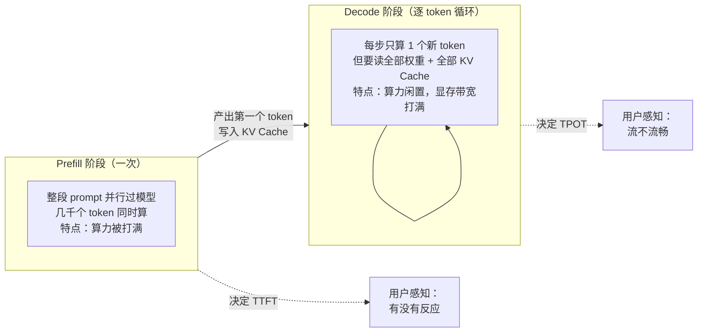
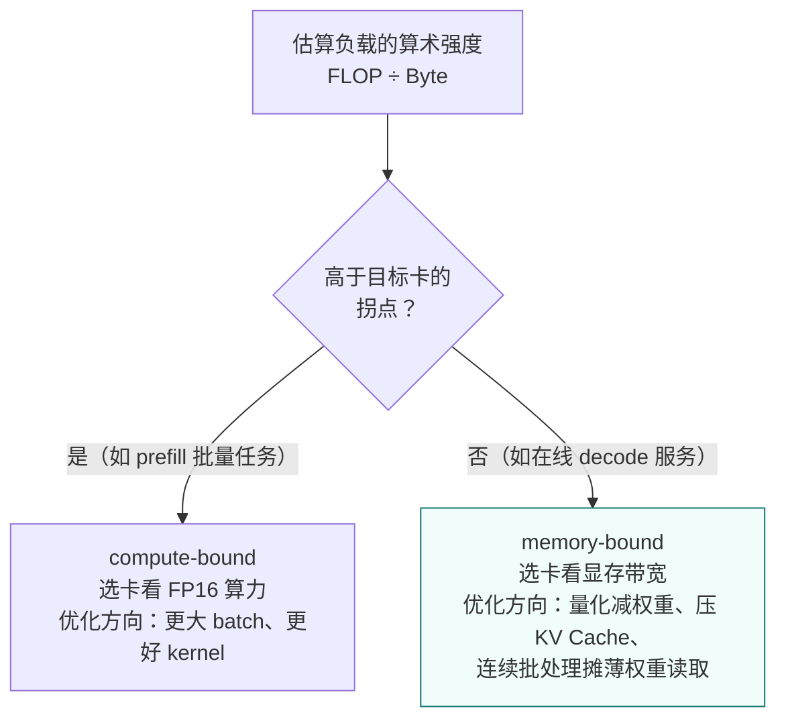
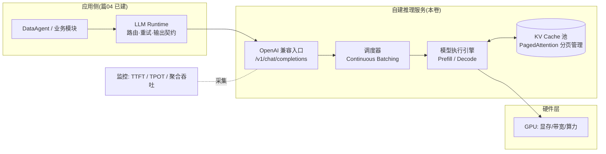
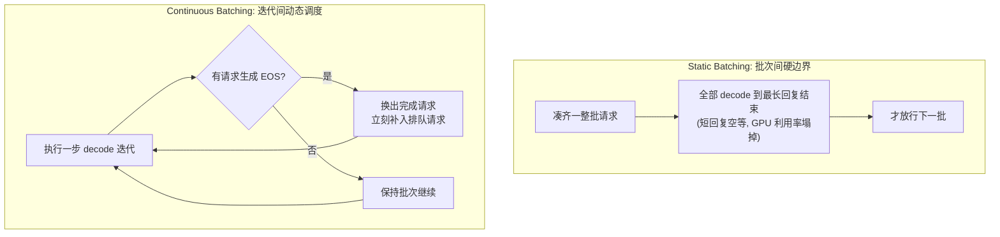
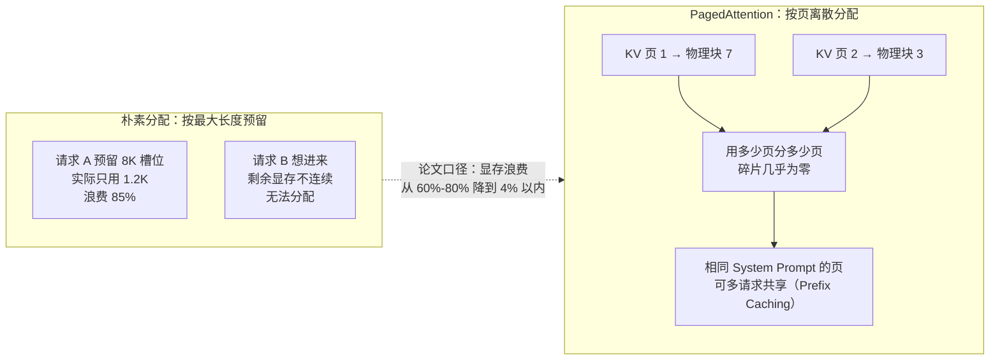

# 卷06-1：GPU 与推理服务化——从硬件指标到 OpenAI 兼容的推理服务

> 导语：走到这里，你已经完成了六段旅程：卷01 用 FastAPI 单体搭起 RetailHub 的骨架，卷02 演进服务架构，卷03 用 DDIA 的数据系统视角重建存储层，卷04 把平台工程（PI，Platform / Infra 思想）落地为内部平台，卷05 以架构师方法论和软考体系补齐文档与决策能力，阶段六（篇00-02）则让你会调模型 API、会写 Function Calling 循环、会搭最小 RAG。**但你手里的"AI 能力"本质上是别人家的：一行 `openai.chat.completions.create()`，背后是某个云厂商的机房。** 一旦客户提出"数据不出域"、一旦 token 账单超过收入、一旦云 API 限流抖动，这条路径就断了。卷06 解决一件事：把模型从"一个远端 HTTP 接口"变成你自己可部署、可压测、可计价、可运维的基础设施。本页是卷06 上半：GPU 与推理硬件基础、模型私有化部署、推理服务化（Continuous Batching / PagedAttention / TTFT/TPOT）；下半（推理成本工程、向量检索与 RAG 基建、LLMOps 与本卷实战）在卷06-2。

> ## 🧭 学前预备（进正文前，先花两分钟读这里）
>
> **先承认跨度**：这是全学习路径难度跳变最大的一步——上一站（篇02）你还在写 prompt、调云 API，这一页直接进入 GPU 显存带宽、Roofline 模型、PagedAttention。觉得吃力不是你掉队了，而是课程在这里从"AI 应用层"切换到了"AI 基建层"，视角从"使用者"换成"供给者"。
>
> **需要的预备知识**（不够就先回补，不用全精通）：
>
> 1. **卷01 的进程与内存基础**：进程地址空间、操作系统按"页"管理内存——§3.2 的 PagedAttention 就是把这个类比搬到 KV Cache 上，忘了的话先回卷01 复习对应小节；
> 2. **篇01 的 token 与推理机制概念**：token 是什么、prefill/decode 两阶段、KV Cache 为什么随上下文变长——§1.1 会带你快速回顾一遍，但只回顾一遍；
> 3. **卷03 的权衡思维**：读放大/写放大式的"没有最好、只有匹配工作负载"——向量索引选型（卷06-2 §5）是同一套思维的新题目。
>
> **没有 GPU 也能全程跟完（显式路径，不是变通办法）**：本卷所有实操都有无 GPU 路线——用 Ollama 在本机 CPU 上起 OpenAI 兼容服务：`ollama pull qwen2.5:7b && ollama serve`，它同样暴露 `http://localhost:11434/v1` 接口；起服务、压测、画容量曲线、接路由、写成本备忘录全部照做，只是数字更小、拐点更早（这本身就是一课）。§3.4 的 `serve.sh` 注释里也写了这条替代命令，实战步骤 1 会再次提示。此外，本页两个交互 Demo（§1.2 显存计算器、§3.3 压测模拟器）就是"无显卡压测环境"，专为没有 GPU 的读者建立容量直觉。
>
> **第一遍阅读的掌握预期**：§1.3 Roofline 与 §3.2 PagedAttention **理解结论即可**——"decode 撞带宽屋顶、prefill 撞算力屋顶""KV Cache 分页让显存浪费从 60-80% 降到 4% 以内"——公式与推导留给二刷；其余各节（容量估算公式、TTFT/TPOT 定义、vLLM vs Ollama 定位）要求第一遍就能复述。

---

## 1. GPU 与推理硬件基础：显存、算力、带宽，到底谁是瓶颈

### 1.1 衔接篇01：从"原理"到"容量"

篇01 的 1.3 节已经讲清了推理机制：一次请求 = **prefill**（一次性并行吃掉整个 prompt，算力敏感）+ **decode**（逐 token 自回归生成，每步都要把全部 KV Cache 从显存读一遍，带宽敏感），以及 KV Cache 如何随上下文长度线性增长。当时你用这些原理理解"为什么流式输出是天然的"、"为什么长上下文贵"。本卷换一个视角：**这些原理决定了你要买/租什么样的硬件、能同时服务多少并发。**

先把两阶段的机制画出来——后面所有的硬件结论、优化手段、压测曲线，都是从这张图上长出来的：



### 1.2 三个硬件指标与它们的工程含义

| 指标 | 含义 | 决定什么 | 经验规律 |
|---|---|---|---|
| **显存容量（VRAM）** | 一张卡能放多少 GB | 能不能装下模型权重 + KV Cache + 运行时开销 | 装不下 = 直接出局，其余免谈 |
| **显存带宽（Memory Bandwidth）** | 每秒能从显存读多少字节 | decode 速度（token/s/请求） | decode 是 memory-bound，带宽决定单流体验 |
| **算力（FLOPS）** | 每秒浮点运算次数 | prefill 速度与批量吞吐 | prefill 是 compute-bound，大批量时算力饱和 |

**容量估算公式**（必背）：

```
模型权重大小 ≈ 参数量 × 每参数字节数
  FP16/BF16：2 字节 → 7B 模型 ≈ 14 GB
  INT8：1 字节      → 7B 模型 ≈ 7 GB
  INT4：0.5 字节    → 7B 模型 ≈ 3.5 GB

KV Cache 大小 ≈ 2 × 层数 × hidden_size × 2字节 × 序列长度 × batch
```

KV Cache 公式里的每一个因子都值得认一遍：**2**（K 和 V 两份）× **层数**（每层都要缓存）× **hidden_size**（每层的向量维度）× **2 字节**（FP16，KV Cache 一般保持高精度，权重 INT4 了它也不跟着降）× **序列长度**（线性增长，长上下文的贵就贵在这里）× **batch**（每一路并发一份）。注意这个公式里**没有 GQA/MQA 系数**——新一代模型（LLaMA-3、Qwen2.5 等）用分组查询注意力把 KV 头数砍到 1/4 甚至 1/8，实际 KV Cache 要再除以分组数，这正是"新模型比老模型省显存"的主要机制之一。

以 LLaMA-2-7B（32 层，hidden 4096）为例：单请求 4K 上下文的 KV Cache ≈ 2 × 32 × 4096 × 2 × 4096 ≈ **2.1 GB**。也就是说一张 24 GB 的卡装完 14 GB 权重后，大约只剩 8 GB 给 KV Cache——撑死 4 条 4K 上下文的长请求并发。这就是为什么推理引擎的核心创新（PagedAttention、Continuous Batching）全部围绕"显存怎么挤"。

**三条判断瓶颈的经验法则**：

1. 单用户问答场景（batch 小）：瓶颈是**带宽**，看 token/s/请求。
2. 高并发服务场景（batch 大）：prefill 频繁时瓶颈转向**算力**，看聚合吞吐 token/s。
3. 任何场景下，**显存容量是硬门槛**：权重 + KV Cache 超了，要么换大卡、要么量化、要么张量并行拆到多卡。

> 常见困惑"为什么我的 A100 和 H100 decode 速度差一倍多"：算力差约 3 倍，但带宽只差约 1.7 倍（2 TB/s vs 3.35 TB/s）——decode 场景的真实差距跟着带宽走，不跟 FLOPS 走。买卡先看工作负载落在哪一段。

在往下看理论之前，先用这个计算器把上面的公式变成肌肉记忆：选模型、精度、上下文、并发、显卡，实时看权重与 KV Cache 怎么分食显存，以及"该卡最多撑几条并发"：

```demo kv-cache
```

**Demo 导学单**（建议按顺序观察）：

1. 保持默认（7B FP16 + 24GB 卡 + 4K 上下文），把并发从 1 拉到 256，观察堆叠条里 KV Cache（橙色）何时超过权重——理解"并发能力 = 显存预算"。
2. 把上下文拉到 32K，看"该卡最大并发"跳水多少倍，解释为什么长上下文业务的单价贵。
3. 切到 INT4 再试：注意权重（绿色）缩水后省下的空间全部变成了并发能力，同时记住 KV Cache 并不跟着量化。
4. 选 70B + 单卡 24GB：观察"权重本身就装不下"的判定，然后把部署方式切成"张量并行 ×4"，看四张卡如何合出一个大显存池。
5. 用计算器反推：RetailHub 需要"7B 模型、8K 上下文、32 并发"，找出最便宜的显卡组合，写下你的答案和第 4 节成本公式对照。

### 1.3 屋顶线模型（Roofline）：一张图统一"算力"与"带宽"

> 📌 阅读预期（呼应卷首「学前预备」）：本节第一遍**理解结论即可**——"decode 撞带宽屋顶、prefill 撞算力屋顶，选卡先看负载落在哪个屋顶"；算术强度的推导可二刷。

1.2 节的经验法则背后有一个统一的理论框架——**屋顶线模型**（Roofline Model）[^roofline]。它的核心是定义一个比值：

```
算术强度（Arithmetic Intensity）= 计算量（FLOP）÷ 访存量（Byte）
```

任何一段计算，要么被"屋顶"的斜边（带宽）限制，要么被横边（算力）限制：

- **算术强度低**（每读一个字节只做很少计算）→ 撞上带宽屋顶 → **memory-bound**。Decode 阶段每生成 1 个 token 要做约 2×参数量 次乘加，但要读 参数量×2字节 的权重 + 全部 KV Cache——7B FP16 模型每 token 读 14+ GB 只做 14 GFLOP，算术强度 ≈ 1 FLOP/Byte，远低于任何 GPU 的拐点，**所以 decode 永远是 memory-bound**。
- **算术强度高**（每读一个字节做大量计算）→ 撞上算力屋顶 → **compute-bound**。Prefill 阶段几千个 token 共享同一份权重读取，计算量随 token 数平方增长而访存量基本不变，算术强度轻松冲上几百——**所以 prefill 是 compute-bound**。

每张 GPU 卡有一个**拐点（ridge point）= 峰值算力 ÷ 峰值带宽**，算术强度低于拐点的负载被带宽卡住，高于拐点的被算力卡住。以两款数据中心卡为例（公开规格量级）：

| 卡 | FP16 算力 | 显存带宽 | 拐点（FLOP/Byte） | 显存容量 |
|---|---|---|---|---|
| A100 80G | ≈312 TFLOPS | ≈2.0 TB/s | ≈156 | 80 GB |
| H100 80G | ≈990 TFLOPS | ≈3.35 TB/s | ≈295 | 80 GB |

这张表能解释一个反直觉的采购结论：**decode 为主的服务型负载，H100 相对 A100 的提速只有带宽之比（≈1.7×），而不是算力之比（≈3.2×）**——因为 decode 撞的是带宽屋顶。反过来，做大批量 prefill（如离线批量打标）时，算力差才会充分兑现。选型决策流程：



连续批处理（3.2 节）为什么能提升吞吐？用屋顶线解释就一句话：**把 N 路 decode 拼成一批后，每读一遍权重服务 N 个 token，算术强度翻了 N 倍，把 decode 从带宽屋顶下往算力屋顶方向推**——在算力饱和之前，加并发几乎是"免费"的吞吐。

## 2. 模型私有化部署：选型、量化与运行时定位

### 2.1 开源模型选型：先定任务剖面，再看榜单

私有化部署第一步不是"选最火的模型"，而是回到篇01 的模型选型三角（效果/成本/时延），按任务剖面选档位：

| RetailHub 任务 | 任务剖面 | 推荐档位 |
|---|---|---|
| SQL 生成 / 数据问答 | 结构化、需要指令跟随与代码能力 | 7B-14B 指令模型（如 Qwen2.5-Coder 系列、GLM 系列） |
| 经营分析报告撰写 | 长文本、中文表达质量 | 14B-32B 通用指令模型 |
| 意图路由 / 工具选择 | 低时延、高并发、任务简单 | 1.5B-7B 小模型或分类器 |
| Embedding（向量检索用） | 专用模型，中文场景 | BGE 系列等开源 Embedding 模型 |

**检查清单**：许可证（商用是否允许，注意各模型许可证差异）、上下文窗口是否覆盖你的 prompt 预算、中文/tokenizer 效率、社区生态（vLLM 是否支持其架构）。

### 2.2 量化：用精度换显存与速度

篇01 讲 FP16 是训练的常用精度；部署时我们常把权重量化到 INT8 甚至 INT4。先认清三种主流量化格式的定位差异，再谈工程取舍：

| 方案 | 原理一句话 | 典型格式 | 生态位 |
|---|---|---|---|
| GPTQ | 逐层校准，用二阶信息补偿量化误差 | INT4/INT3（GPU 推理） | vLLM 生产部署的 INT4 首选 |
| AWQ | 保护"激活值大的重要权重"不量化 | INT4（GPU 推理） | 精度保持略好于 GPTQ，vLLM 同样支持 |
| GGUF | llama.cpp 系的 CPU/混合推理格式 | 多档位（Q2-Q8） | Ollama、笔记本、无 GPU 环境 |

工程含义：

- **显存减半或更多**：14 GB 的 7B 模型 INT4 后约 3.5 GB，24 GB 消费卡从"勉强"变"宽松"，省下的是 KV Cache 空间 = 并发能力（在 1.2 节的计算器里亲手验证过）。
- **decode 提速**：权重读取量减少，memory-bound 阶段直接受益——用屋顶线的语言：访存量除以 4，等效算术强度乘以 4。
- **量化的是权重，不是 KV Cache**：KV Cache 默认仍是 FP16（部分引擎支持 KV Cache INT8/FP8 量化，长上下文场景可再省一半，但属于进阶手段）。
- **代价是精度**：INT8 通常几乎无损；INT4 对多数任务可接受，但对数学、精确数值任务要实测。DataAgent 的"数字必须准确"红线意味着：**量化版本上线前必须跑过篇09 的回归评测集，不能只看 benchmark 分数。**

### 2.3 vLLM vs Ollama：开发期与生产期的不同答案

| 维度 | Ollama | vLLM |
|---|---|---|
| 定位 | 本地开发/个人体验的一键运行时 | 生产级推理服务引擎 |
| 核心卖点 | `ollama run` 一条命令出 OpenAI 兼容接口 | PagedAttention + Continuous Batching，高并发吞吐 |
| 并发能力 | 单/低并发为主 | 为几十到几百并发设计 |
| 资源开销 | 轻 | 需要 CUDA GPU 才发挥价值 |
| 量化格式 | GGUF（llama.cpp 系） | GPTQ/AWQ/FP16 等 |
| 适用阶段 | 本机验证、PoC、无 GPU 的笔记本 | RetailHub 生产推理服务 |

一句话：**用 Ollama 走通流程，用 vLLM 承接流量。** 两者都提供 OpenAI 兼容 API，意味着应用层（篇04 的 LLM Runtime）可以无感切换。

## 3. 推理服务化：OpenAI 兼容、Continuous Batching 与 SLA

### 3.1 为什么是"OpenAI 兼容"而不是各自造协议

`POST /v1/chat/completions` 已经成为事实标准。自建服务暴露同样的协议，带来三个直接收益：

1. 应用层零改动：篇04 的 LLM Runtime 只需换一个 `base_url`，路由表上"云 API"和"自建 vLLM"是两个等价 Provider——多模型路由、降级切换全部复用已有机制。
2. 生态白拿：任何支持 OpenAI SDK 的工具、压测脚本、观测组件直接可用。
3. 供应商解耦：避免被任何一家的私有协议锁死。

启动一个 vLLM OpenAI 兼容服务（代码骨架见 3.4），实际上就得到了一个"自建版 OpenAI"。

一个请求穿过自建推理服务的完整链路如下——对照这张图，后面每一节的机制（Continuous Batching、KV Cache 分页、TTFT/TPOT 监控）都能找到自己的位置：



### 3.2 Continuous Batching 与 PagedAttention：吞吐翻倍的两台发动机

> 📌 阅读预期（呼应卷首「学前预备」）：PagedAttention 一节第一遍**理解结论即可**——"KV Cache 像操作系统内存一样分页管理，显存浪费从 60-80% 降到 4% 以内"；分页机制细节可二刷。

传统 static batching 等一整批请求全部 decode 完才放行下一批，长回复拖累短回复。**Continuous Batching（连续批处理）** 在每一步 decode 迭代之间动态调度：某个请求生成了 EOS 就立刻换出新请求进批次，GPU 永远保持满载。两种调度方式的对比：



1.3 节的屋顶线已经给了它理论解释：批大小从 1 提到 N，每读一遍权重服务 N 个 token，算术强度翻 N 倍——**在算力饱和前，吞吐随并发近似线性增长**。对容量规划的含义：吞吐不再随并发线性摊薄，这正是 3.3 压测要画的那条曲线。

**PagedAttention** 解决的是另一个问题：KV Cache 的显存管理。类比操作系统的虚拟内存——进程申请内存时不会拿到一整段物理地址，而是按"页"离散分配、页表映射。vLLM 把每个请求的 KV Cache 也切成固定大小的页[^vllm]：



两台发动机合起来的效果：vLLM 论文报告的吞吐相对传统方案提升可达一个数量级（2-4 倍为常见生产口径）[^vllm]。近年 vLLM 还引入了 **chunked prefill**（把超长 prompt 的 prefill 切片，与 decode 迭代穿插执行，防止一次大 prefill 卡住全批的 TPOT）——生产部署时值得在版本说明里确认该特性状态。

### 3.3 SLA 指标：TTFT 与 TPOT

| 指标 | 定义 | 用户感知 | RetailHub 参考目标 |
|---|---|---|---|
| **TTFT**（Time To First Token） | 请求发出到首个 token 返回 | "系统有没有反应" | P95 < 2 s（分析类可放宽到 5 s） |
| **TPOT**（Time Per Output Token） | 相邻 token 的平均间隔 | "打字流不流畅" | P95 < 100 ms（≥10 token/s） |
| **E2E Latency** | 整段回答完成时间 | 总等待 | 报告类 < 60 s |
| **聚合吞吐** | 全系统 token/s | 决定成本与容量 | 压测实测 |

TTFT 主要由 prefill 时长 + 排队时长决定；TPOT 由 decode 带宽决定。并发升高时，TTFT 先恶化（排队），TPOT 后恶化（显存带宽争抢）——压测曲线的拐点就是你的服务上限。

在真机压测之前，先用这个交互 Demo 建立直觉：拖动并发滑块（1–128），看一个简化 Continuous Batching 排队模型下 TTFT、TPOT、聚合吞吐三条曲线怎么走位、SLA 拐点（TTFT_P95 > 2s）出现在哪；下方还内置了 4.1 节公式的"自建 vs 云 API 月成本计算器"，日 Token 量、模型档位、利用率全部可调——读完第 4 节记得回来算一遍：

```demo ttft-tpot
```

**Demo 导学单**（建议按顺序观察）：

1. 并发从 1 缓慢加到 16，观察 TTFT 几乎不动、聚合吞吐近似线性上升——对应屋顶线模型的"带宽屋顶下还有算力余量"区间。
2. 继续加并发直到 TTFT 曲线出现拐点（突破 2s SLA 线），记下拐点并发数——这就是"单实例安全并发上限"的雏形，实战压测要找的就是它。
3. 观察拐点之后 TPOT 曲线的变化：为什么它比 TTFT 后恶化？（提示：排队先打满，带宽争抢后至。）
4. 切到成本计算器，把日 token 量从低到高拉一遍，找到"自建成本 = 云 API 成本"的盈亏平衡点，注意利用率滑块对结论的翻转作用。
5. 把模型档位从 7B 切到 70B，对比同样并发下 TTFT 的变化，解释为什么大模型服务必须配更强的卡或更多卡并行。

### 3.4 代码骨架：起服务 + 压测 + 容量曲线

`serve.sh` —— 启动 vLLM OpenAI 兼容服务（约 30 行）：

```bash
#!/usr/bin/env bash
# RetailHub 私有化推理服务启动脚本
# 前提：pip install vllm；有一张显存足够的 NVIDIA GPU
MODEL="Qwen/Qwen2.5-7B-Instruct"   # 可换成你选定的开源模型
PORT=8000

python -m vllm.entrypoints.openai.api_server \
  --model "$MODEL" \
  --served-model-name retailhub-chat \      # 对外暴露的逻辑模型名
  --host 0.0.0.0 --port $PORT \
  --max-model-len 8192 \                    # 上下文上限，直接决定 KV Cache 预算
  --gpu-memory-utilization 0.85 \           # 显存占用比例，留 15% 给系统/碎片
  --max-num-seqs 64 \                       # 连续批处理的最大并发序列数
  --enable-prefix-caching                   # 相同前缀（如 System Prompt）复用 KV，省 prefill

# 无 GPU 开发机的替代：ollama pull qwen2.5:7b && ollama serve
# 同样暴露 http://localhost:11434/v1 的 OpenAI 兼容接口
```

`bench_ttft.py` —— 压测不同并发下的 TTFT/TPOT（约 55 行）：

```python
"""RetailHub 推理服务压测：测 TTFT / TPOT，输出容量曲线数据。
用法：python bench_ttft.py --base-url http://localhost:8000/v1 --concurrencies 1 4 8 16 32
"""
import argparse, asyncio, json, statistics, time
import httpx

PROMPT = "请用三点概括零售企业分析同店销售增长时的关键维度。"
MAX_TOKENS = 256

async def one_request(client, base, model):
    t0 = time.perf_counter()
    ttft, tokens, last = None, 0, t0
    tpot_samples = []
    payload = {"model": model, "stream": True, "max_tokens": MAX_TOKENS,
               "messages": [{"role": "user", "content": PROMPT}]}
    async with client.stream("POST", f"{base}/chat/completions", json=payload) as r:
        async for line in r.aiter_lines():
            if not line.startswith("data:") or line.endswith("[DONE]"):
                continue
            now = time.perf_counter()
            delta = json.loads(line[5:])["choices"][0]["delta"].get("content")
            if delta:
                if ttft is None:
                    ttft = now - t0
                else:
                    tpot_samples.append(now - last)
                last, tokens = now, tokens + 1
    return ttft, statistics.mean(tpot_samples) if tpot_samples else None

async def run_level(base, model, conc):
    async with httpx.AsyncClient(timeout=120) as client:
        t0 = time.perf_counter()
        results = await asyncio.gather(*[one_request(client, base, model) for _ in range(conc)])
        wall = time.perf_counter() - t0
    ttfts = [r[0] for r in results]; tpots = [r[1] for r in results if r[1]]
    throughput = conc * MAX_TOKENS / wall
    print(f"并发={conc:3d}  TTFT_P95={statistics.quantiles(ttfts, n=20)[18]:.2f}s  "
          f"TPOT_avg={statistics.mean(tpots)*1000:.0f}ms  聚合吞吐={throughput:.0f} tok/s")
    return {"concurrency": conc, "ttft_p95": statistics.quantiles(ttfts, n=20)[18],
            "tpot_avg_ms": statistics.mean(tpots) * 1000, "throughput": throughput}

if __name__ == "__main__":
    ap = argparse.ArgumentParser()
    ap.add_argument("--base-url", default="http://localhost:8000/v1")
    ap.add_argument("--model", default="retailhub-chat")
    ap.add_argument("--concurrencies", type=int, nargs="+", default=[1, 4, 8, 16, 32])
    a = ap.parse_args()
    curve = [asyncio.run(run_level(a.base_url, a.model, c)) for c in a.concurrencies]
    json.dump(curve, open("capacity_curve.json", "w"), indent=2, ensure_ascii=False)
    print("容量曲线已写入 capacity_curve.json —— 找 TTFT_P95 突变的拐点，那就是单实例上限。")
```

---

## 参考与脚注

[^roofline]: Samuel Williams, Andrew Waterman, David Patterson, "Roofline: An Insightful Visual Performance Model for Multicore Architectures"（Communications of the ACM, 2009）。本卷 1.3 节的算术强度、带宽/算力双屋顶与拐点概念出自该文；A100/H100 规格为厂商公开口径量级，选型时以最新官方规格书为准。
[^vllm]: Woosuk Kwon 等，"Efficient Memory Management for Large Language Model Serving with PagedAttention"（SOSP 2023），https://arxiv.org/abs/2309.06180 。本卷 3.2 节 PagedAttention 的分页机制、显存浪费对比与吞吐提升口径出自该论文及 vLLM 官方文档。

➡️ 下一页：卷06-2-推理成本向量检索与LLMOps.md
