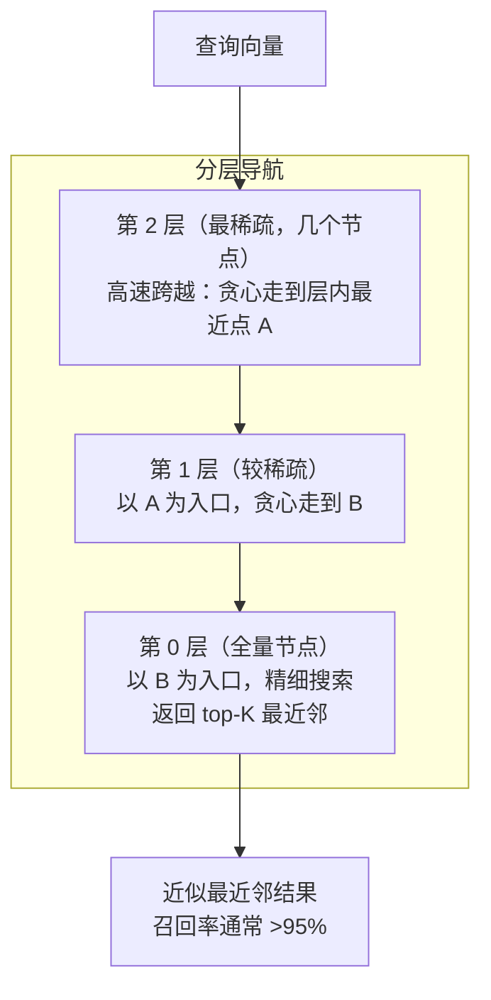
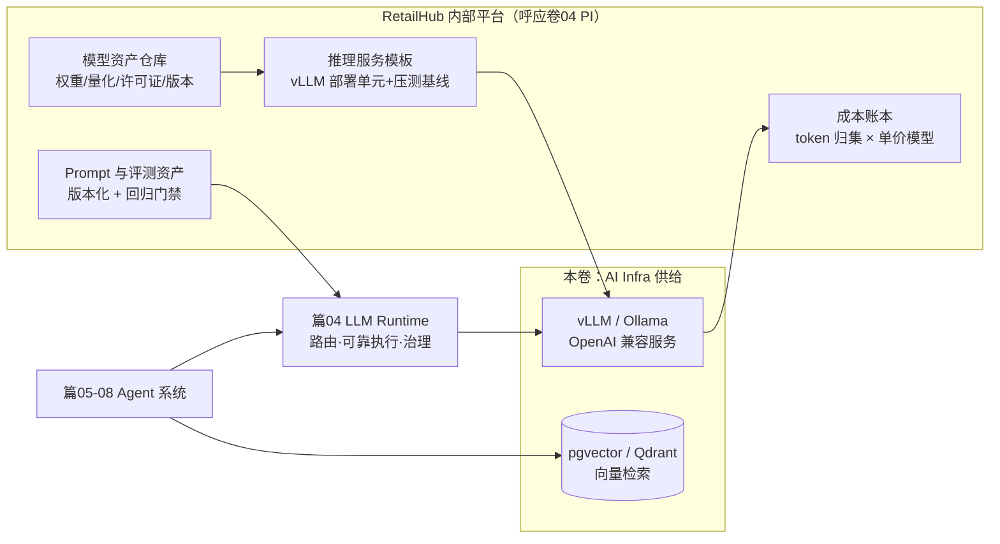
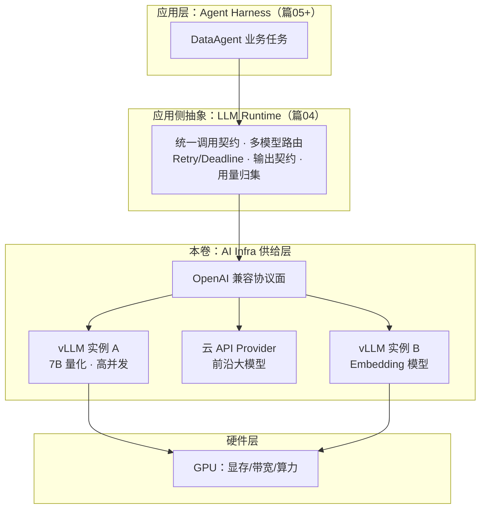

# 卷06-2：推理成本、向量检索与 LLMOps——让 AI 基建可计价、可检索、可运营

> 导语：上一页（卷06-1）解决了"服务能不能跑起来"——GPU 怎么选、模型怎么部署、推理服务怎么起、TTFT/TPOT 怎么压（本页正文中提到的"第 1-3 节"均指卷06-1 的对应章节）。本页接着解决三件事：算清钱（Token 单价模型、容量规划公式、自建 vs 云的决策框架）、建好检索（向量索引选型、HNSW 原理、召回基线、pgvector vs Qdrant）、纳入平台（把模型/推理/Prompt/成本四类 AI 资产纳入卷04 的内部平台），最后完成本卷实战——为 RetailHub 建起私有化推理服务 + 向量检索 + 成本账本。

---

## 4. 推理成本工程：Token 单价、容量公式与自建 vs 云

### 4.1 Token 单价模型

云 API 的账单是透明的：`成本 = 输入token数 × 输入单价 + 输出token数 × 输出单价`（输出通常贵 3-5 倍，对应 decode 更贵的事实）。自建的成本则需要自己摊：

```
自建每百万 token 成本 = 实例每小时价格 × 1e6 / (实测聚合吞吐 tok/s × 3600 × 利用率)
```

举例（仅示意，用你自己的实测数替换）：某按量 GPU 实例 25 元/小时，实测可用聚合吞吐 2000 tok/s，平均利用率 40%，则每百万 token ≈ 25 × 1e6 / (2000 × 3600 × 0.4) ≈ **8.7 元**。把这个数和云 API 报价放在同一坐标系，决策才有依据。

注意公式里三个因子全部来自实测：**吞吐**来自 3.4 节的压测容量曲线（不是厂商宣传页），**利用率**来自监控系统的真实负载归集（不是"我觉得挺忙的"），**实例价格**要含存储、带宽、闲置时段——GPU 实例最大的浪费是"为峰值买的卡，谷时在空转"。这也是 4.3 节决策框架里"利用率能跑过盈亏平衡点"成为分水岭的原因。

### 4.2 容量规划公式

```
所需实例数 = 峰值所需吞吐 / 单实例实测吞吐
峰值所需吞吐 = 峰值QPS × (平均输入token + 平均输出token)
```

RetailHub 示例：早高峰 10 个租户同时跑经营分析，每任务 5 次模型调用、每次平均 3000 输入 + 1500 输出 token，任务集中在 10 分钟内 → 峰值吞吐 ≈ 10 × 5 × 4500 / 600 ≈ 375 tok/s。对照压测容量曲线选实例数，再加 30% 冗余。

### 4.3 自建 vs 云 API 决策框架

| 决策因子 | 偏云 API | 偏自建 |
|---|---|---|
| 调用量 | 低/不稳定，按需付费划算 | 高且稳定，利用率能跑过盈亏平衡点 |
| 数据合规 | 允许出域 | 数据不出域是硬要求（零售客户的会员数据） |
| 模型需求 | 需要最强前沿模型 | 7B-32B 开源模型已够用 |
| 时延/定制 | 可接受共享限流 | 需要确定性 SLA、私有微调 |
| 团队能力 | 无 Infra 人力 | 有人能运维 GPU 集群 |

**结论不是二选一，而是组合**：篇04 的多模型路由天然支持"默认云 API + 敏感租户/高频简单任务走自建"。这正是把篇04 的路由表接上本卷的供给层。

## 5. 向量数据库与 RAG 基建

### 5.1 呼应卷03：向量索引也是一种"存储引擎选型"

卷03 用 DDIA 的视角讲过 B-Tree vs LSM-Tree 的取舍：读放大、写放大、空间放大。向量索引是同一套思维的新题目——只不过查询从"范围扫描"变成了"近似最近邻（ANN）"：

| 索引类型 | 原理一句话 | 特点 | 类比卷03 |
|---|---|---|---|
| **FLAT（暴力）** | 全量扫描算距离 | 100% 召回，O(n)，只用于小规模/评测基线 | 全表扫描 |
| **IVF（倒排聚簇）** | 先聚类，查询只搜最近的几个簇 | 快但召回受簇数影响，需要训练 | 分区裁剪 |
| **HNSW（分层小世界图）** | 图上贪心导航到最近邻 | 召回高、查询快，内存占用大，构建慢 | B-Tree 的多级跳转 |
| **PQ / 量化压缩** | 向量压缩成短码近似距离 | 内存省数倍，召回略降 | 有损压缩 |

### 5.2 HNSW 原理：为什么"小世界图"找邻居快

HNSW（Hierarchical Navigable Small World）是当下向量库的默认索引（pgvector、Qdrant、Milvus 都默认或主推它），值得把原理讲透[^hnsw]。它的思想可以拆成两层：

**第一层：小世界图的贪心导航**。把所有向量连成一个图，每个节点连向若干"邻居"。查询时从任意入口出发，每一步都跳到"当前邻居里离查询点最近"的节点，不断重复——就像在一个大型火车站里，每到一个站台都问"哪个方向离目的地更近"，然后换乘。小世界图的神奇性质是：**任意两点之间的"跳数"是对数级的**（O(log n)），百万级向量十几次跳转就能逼近最近邻——这正是它类比 B-Tree 多级跳转的原因。

**第二层：分层加速**。单一小世界图的问题是"入口不好选"——从边缘节点出发要走很多冤枉路。HNSW 的解法是模仿跳表（Skip List）：第 0 层包含全部节点（稠密），第 1 层随机抽一部分（稀疏），第 2 层更少……顶层只有几个节点。查询从最顶层开始（稀疏层 = 高速公路，大步跨越），每层贪心走到局部最优后，以该点为入口进入下一层（越来越密 = 国道、街道），直到第 0 层精确定位：



**两个调参旋钮**（与 Recall@K 基线联动调）：

- **M（建索引时）**：每个节点的最大连接数。M 越大图越连通、召回越高，但内存和构建时间线性涨。常用 16-64。
- **ef_search（查询时）**：搜索时维护的候选集大小。越大召回越高、延迟越高——**它是唯一可以按查询动态权衡"快"与"准"的旋钮**：零售看板的交互式查询 ef 开小，离线报告生成 ef 开大。

HNSW 的代价也要认账：内存占用大（图结构本身约为向量数据的 1.2-1.5 倍）、构建慢、删除不优雅（标记删除，定期重建）。数据量上到千万级且写入频繁时，就要重新评估 IVF-PQ 类的方案——回到卷03 那句话：**没有最好的索引，只有匹配工作负载的索引**。

### 5.3 召回评估：RAG 的地基质量

篇02 的最小 RAG 让你"跑通"；本卷要求你"量化"。指标定义：

```
Recall@K = 相关文档被前K条命中的比例   （检索层质量）
MRR      = 第一个相关结果排名的倒数均值（排序质量）
```

方法：从零售文档人工标 30-50 个"问题 → 应命中文档段落"对，跑检索算 Recall@5。**没有这组基线数字，换 Embedding 模型、换 chunk 大小、换索引参数（M、ef_search）都是盲调。**

### 5.4 pgvector vs Qdrant：两个务实选项

| 维度 | pgvector（PostgreSQL 扩展） | Qdrant（专用向量库） |
|---|---|---|
| 定位 | 已有 PG 就顺手获得向量能力 | 独立向量服务，功能专精 |
| 运维 | 零新增组件，随卷03 的 PG 一起备份/高可用 | 多一个有状态服务要运维 |
| 规模舒适区 | 百万级向量以内 | 千万级以上、高 QPS |
| 过滤能力 | SQL 原生 join 租户/权限过滤，天然适合多租户 | payload 过滤，够用但表达力弱于 SQL |
| 选型建议 | RetailHub 起步首选 | 向量量或 QPS 上来后再迁 |

多租户场景的关键点：**检索必须带租户过滤**（`WHERE tenant_id = ?` 或 payload filter），否则一个租户的文档会被另一个租户召回——这是 RAG 版的数据越权。

### 5.5 代码骨架：pgvector 建库 + 检索 + 召回评估（约 50 行）

```python
"""RetailHub 向量检索骨架：pgvector 建表、写入、带租户过滤的检索、Recall@K 评估。
前提：PostgreSQL 已装 pgvector 扩展（CREATE EXTENSION vector;）。
Embedding 可来自自建服务（OpenAI 兼容 /v1/embeddings）或云 API。"""
import psycopg2, httpx

DDL = """
CREATE TABLE IF NOT EXISTS doc_chunks (
  id BIGSERIAL PRIMARY KEY,
  tenant_id TEXT NOT NULL,
  doc_id TEXT NOT NULL,
  chunk_text TEXT NOT NULL,
  embedding vector(1024)              -- 维度必须与所用 Embedding 模型一致
);
CREATE INDEX IF NOT EXISTS idx_chunks_tenant ON doc_chunks (tenant_id);
CREATE INDEX IF NOT EXISTS idx_chunks_vec ON doc_chunks
  USING hnsw (embedding vector_cosine_ops);   -- HNSW 索引，pgvector ≥0.5 支持
"""

def embed(texts, base="http://localhost:8000/v1", model="retailhub-embed"):
    r = httpx.post(f"{base}/embeddings",
                   json={"model": model, "input": texts}, timeout=30)
    return [d["embedding"] for d in r.json()["data"]]

def search(conn, tenant_id, question, k=5):
    qvec = embed([question])[0]
    with conn.cursor() as cur:
        cur.execute(
            """SELECT doc_id, chunk_text,
                      1 - (embedding <=> %s::vector) AS score
                 FROM doc_chunks
                WHERE tenant_id = %s          -- 租户隔离，必须出现在每个检索里
                ORDER BY embedding <=> %s::vector
                LIMIT %s""",
            (qvec, tenant_id, qvec, k))
        return cur.fetchall()

def recall_at_k(conn, evalset, k=5):
    """evalset: [(tenant_id, question, expected_doc_id), ...]，人工标注 30+ 条"""
    hits = sum(1 for t, q, expected in evalset
               if any(row[0] == expected for row in search(conn, t, q, k)))
    return hits / len(evalset)

if __name__ == "__main__":
    conn = psycopg2.connect("dbname=retailhub")
    with conn.cursor() as cur:
        cur.execute(DDL)
    conn.commit()
    print("表与索引就绪。灌入零售文档 chunks 后，先跑 recall_at_k 建基线，再谈调优。")
```

## 6. LLMOps 与平台工程：把 AI 资产纳入内部平台

卷04 的平台工程（PI 思想）讲过：把重复的基础设施能力收敛为自助式平台，业务团队不再重复造轮子。本卷把这个思想延伸到 AI 资产——RetailHub 的内部平台至少要纳管四类资产：

1. **模型资产**：模型仓库（权重、量化版本、许可证元数据）、版本号与评测分数绑定，"哪个模型版本在服务哪个租户"可查可回滚。
2. **推理资产**：vLLM/Ollama 服务的标准化部署单元（镜像 + 启动参数模板 + 健康检查 + 压测基线），新模型上线 = 填模板而不是写脚本。
3. **Prompt/评测资产**：篇02 讲过 Prompt 即代码、资产蒸馏；本卷强调其运行侧——Prompt 版本与模型版本、评测集三者构成发布三元组，进入篇09 的 Regression Gate。
4. **成本资产**：每租户/每任务类型的 token 账本（篇04 的用量归集）+ 本卷的单价模型 = 一张持续更新的成本看板。



### 6.1 与篇04 LLM Runtime 的关系：一个管供给，一个管消费

这是本卷最容易混淆的边界，用一张图说清：



- **篇04 LLM Runtime 是"消费者视角"**：我不关心模型跑在哪，只关心契约、路由、可靠性、账单。
- **本卷 AI Infra 是"生产者视角"**：我负责让某个 `base_url` 背后真的有一组 GPU 实例，在目标 SLA 和成本内稳定吐出 token。
- 两者的接缝就是 **OpenAI 兼容协议 + 路由表**：供给层换实现（Ollama 换 vLLM、单卡换多卡），应用层无感；应用层换路由策略（降级、分流），供给层无感。这就是分层架构在 AI 时代的同款演绎[^phoenix]。

---

## 本卷实战：RetailHub 演进第 6 步——私有化推理服务 + 向量检索 + 成本账本

**背景**：RetailHub 的最大客户提出"经营数据不出域"；同时财务发现云 API 账单已占该租户收入的 31%。架构评审决定：为高频数据问答任务建立私有化推理与检索能力，前沿复杂任务继续走云 API，由 LLM Runtime 路由。

### 递进任务步骤

**步骤 1：起服务。**

- 目标：在本机跑起一个 OpenAI 兼容推理服务。
- 操作：无 GPU 用 Ollama（`ollama pull qwen2.5:7b && ollama serve`），有 GPU 用 3.4 节 `serve.sh` 起 vLLM，`served-model-name` 命名为 `retailhub-chat`；用 `curl http://localhost:8000/v1/chat/completions` 验证流式输出。
- 验收标准：流式回复正常吐出 token；启动参数（max-model-len、gpu-memory-utilization、max-num-seqs）你能逐个讲出含义。

**步骤 2：压测并画容量曲线。**

- 目标：拿到单实例的真实容量数字，找到拐点。
- 操作：用 3.4 节 `bench_ttft.py` 在 1/4/8/16/32 并发下压测，记录 TTFT_P95、TPOT、聚合吞吐，用 matplotlib 画图（横轴并发，双纵轴 TTFT 与吞吐）。
- 验收标准：容量曲线图存在；拐点（TTFT_P95 突破 2s 或吞吐停止增长处）有文字结论"单实例安全并发上限 = __"；压测脚本入库。

**步骤 3：建向量检索并跑召回基线。**

- 目标：RetailHub 的零售知识可被检索，且检索质量有数字。
- 操作：用 5.5 节骨架在 pgvector（或 Qdrant）建库；自造 20+ 份零售文档（退换货 SOP、促销规则、会员分层说明……），chunk 策略自定但要在 README 说明理由；标注 30 条"问题 → 应命中文档"评测对，跑 Recall@5。
- 验收标准：检索接口带 `tenant_id` 过滤，跨租户召回测试为 0 条；Recall@5 基线数字写入备忘录（不允许写"效果还行"这种话）。

**步骤 4：接路由 + 写成本备忘录。**

- 目标：自建供给接入篇04 路由表，并完成自建 vs 云的经济性论证。
- 操作：在 LLM Runtime 路由表新增自建 Provider，实现"数据问答走自建、报告生成走云"；写《自建 vs 云 API 成本对比备忘录》，必须包含：4.1/4.2 的公式、你的实测数字、盈亏平衡点（月调用量达到多少时自建更便宜）、明确推荐结论。
- 验收标准：路由规则生效（两类任务分别落到自建与云，日志可验证）；备忘录含公式、实测数、盈亏平衡点、结论四要素。

### AI Coding 实操模式

本步的代码（压测脚本、检索骨架）适合 AI 生成，但**容量数字与成本结论必须来自你机器上的实测**——AI 不知道你的显卡有几 GB，也不知道你的租户账单。

**① 可复制提示词模板：**

```text
你是 AI Infra 工程师。我在为零售 SaaS 搭建私有化推理服务，环境：
【GPU 型号与显存 / 无 GPU 用 Ollama】，模型 Qwen2.5-7B-Instruct，框架 vLLM。
请完成：
1. 审查我的 vLLM 启动参数（附后），逐项解释含义并指出与我的硬件不匹配之处；
2. 审查我的压测脚本 bench_ttft.py（附后），指出统计口径缺陷
   （P95 样本量、预热、tpot 采样方式），给出修改版；
3. 根据我贴的压测输出（附后），帮我定位 TTFT 拐点，并给出 3 条提升安全并发的
   候选手段（启动参数级，不换硬件）。
约束：只做参数与代码建议，容量结论以我的实测数据为准；不确定的硬件规格列出来问我。
```

**② AI 初版人工评审清单：**

- [ ] AI 建议的启动参数是否与你的显存预算自洽（用 1.2 节 kv-cache 计算器验算 max-model-len × max-num-seqs 是否装得下）？
- [ ] 压测脚本是否有预热（warmup）阶段？冷启动的首次请求会污染 TTFT 样本，AI 常漏。
- [ ] P95 计算的样本量是否足够（每档并发 ≥20 个请求）？5 个请求算 P95 没有统计意义。
- [ ] AI 给的"提升并发"建议是否区分了 prefill 瓶颈与 decode 瓶颈（对照 1.3 节屋顶线），还是泛泛而谈？
- [ ] 成本备忘录里的每个数字是否都能溯源（实例账单截图、压测输出、云 API 价目页）？

**③ 验收标准：** 通过评审清单后，对照下面总验收逐条打勾；备忘录中每个数字注明来源（实测/账单/公开价目），没有来源的数字删掉重写。

### 总验收标准

- [ ] `curl http://localhost:8000/v1/chat/completions` 能拿到正常流式回复（或 Ollama 的 11434 端口等价验证）
- [ ] 容量曲线图存在且拐点有文字结论
- [ ] 检索接口带 `tenant_id` 过滤，跨租户召回测试为 0 条
- [ ] Recall@5 基线数字写入备忘录（不允许写"效果还行"这种话）
- [ ] 路由规则生效：两类任务分别落到自建与云，日志可验证
- [ ] 备忘录含公式、实测数、盈亏平衡点、结论四要素

---

## 常见误区

1. **"参数量除以 2 就是显存需求"**：忘了 KV Cache 和运行时开销。7B FP16 权重 14 GB，但 32 条 8K 并发的 KV Cache 可能再吃 16 GB——容量规划必须权重和 KV Cache 分开算。
2. **"算力越强推理越快"**：decode 是带宽瓶颈。不看 workload 类型就按 FLOPS 选卡，会花 H100 的钱买 A100 的体验提升——先用屋顶线算一算你的负载撞哪个屋顶。
3. **"量化就是免费的午餐"**：INT4 对数值敏感任务可能掉点。不跑回归评测就上线量化模型，等于把篇09 建立的质量门禁撕开一个洞。
4. **"OpenAI 兼容 = 行为兼容"**：协议兼容不代表 Function Calling 稳定性、JSON 输出遵从度一致。换 Provider 后必须重跑输出契约测试（篇04 的 Output Contract）。
5. **"自建一定省钱"**：低利用率下自建单位成本可能是云 API 的数倍。盈亏平衡点是算出来的，不是感觉出来的。
6. **"RAG 效果不好就换 Embedding 模型"**：没有 Recall@K 基线时，你无法区分问题出在 chunk、Embedding、索引参数还是文档质量本身。先建评测，再动手。
7. **"向量库里的数据不算敏感数据"**：chunk 文本明文存储、向量可近似反推原文。向量库要纳入与卷03 数据库同级的权限与备份策略。
8. **把压测当一次性动作**：模型版本、量化格式、max-num-seqs 一变，容量曲线就作废。压测脚本要进仓库、进平台模板，随发布复跑。
9. **HNSW 参数出厂即终局**：M 和 ef_search 默认值的召回未必匹配你的数据分布，ef_search 更是唯一可按查询调"快"与"准"的旋钮——不调参就上生产，等于花钱买了索引却只用了一半。

## 自测清单

- [ ] 我能默写权重显存估算公式和 KV Cache 估算公式，并各举一个数例
- [ ] 我能解释为什么 decode 是带宽敏感而 prefill 是算力敏感（能引用篇01 的机制与 1.1 的两阶段图）
- [ ] 我能定义算术强度与屋顶线拐点，并据此解释"A100→H100 在 decode 场景提速约 1.7 倍而非 3.2 倍"
- [ ] 我能用屋顶线解释 Continuous Batching 提升吞吐的机制（算术强度随 batch 翻 N 倍）
- [ ] 我能说清 TTFT 与 TPOT 分别由什么决定、并发升高时谁先恶化
- [ ] 我能解释 PagedAttention 的"分页"类比，以及 Prefix Caching 复用什么
- [ ] 我能对比 GPTQ / AWQ / GGUF 三种量化格式的生态位，并说出"量化的是权重不是 KV Cache"
- [ ] 我能说出 vLLM 与 Ollama 的定位差异及各自适用阶段
- [ ] 我能推导自建每百万 token 成本公式，并说出利用率在其中的角色
- [ ] 我能给出自建 vs 云 API 决策框架的五个决策因子
- [ ] 我能讲清 HNSW 的两层思想（小世界图贪心导航 + 分层加速），说出 M 与 ef_search 各自权衡什么
- [ ] 我能定义 Recall@K 和 MRR，并说明为什么调 RAG 前必须先有基线
- [ ] 我能用一句话说清本卷与篇04 LLM Runtime 的职责边界（供给 vs 消费）

## 下卷预告

基础设施就位，平台也有了——但"能跑"不等于"可承诺"：如果明天上午推理服务挂了，谁会知道？多久能恢复？你能对业务方承诺一年最多坏多久吗？卷08 进入 SRE 与可靠性工程：用 SLI/SLO 与错误预算把"稳定性"从玄学变成可定量谈判的工程指标，配齐告警、值班、复盘与发布工程，并以金山办公 KAE（13600+ 微服务、每日 310 次部署、两地三中心四个 9）为工业级样板。你将为 RetailHub 立下第一份 SLO，配好告警规则集，并完成一次复盘演练与混沌实验——底座可承诺之后，阶段九的 Agent 系统才谈得上对客户负责。

---

## 参考与脚注

[^hnsw]: Yury Malkov, Dmitry Yashunin, "Efficient and Robust Approximate Nearest Neighbor Search Using Hierarchical Navigable Small World Graphs"（IEEE TPAMI, 2020），https://arxiv.org/abs/1603.09320 。本卷 5.2 节 HNSW 的分层小世界图结构、贪心导航与 M/ef 参数语义出自该论文。
[^phoenix]: 周志明，《凤凰架构：构建可靠的大型分布式系统》，在线公开版：https://icyfenix.cn 。本卷索引选型与卷03 DDIA 视角的衔接、服务化治理部分可与该书互相印证，可作延伸阅读。

➡️ 下一页：卷07-AIFDE交付实战.md
