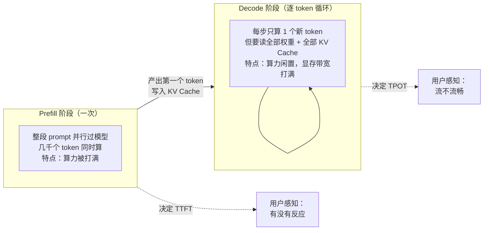
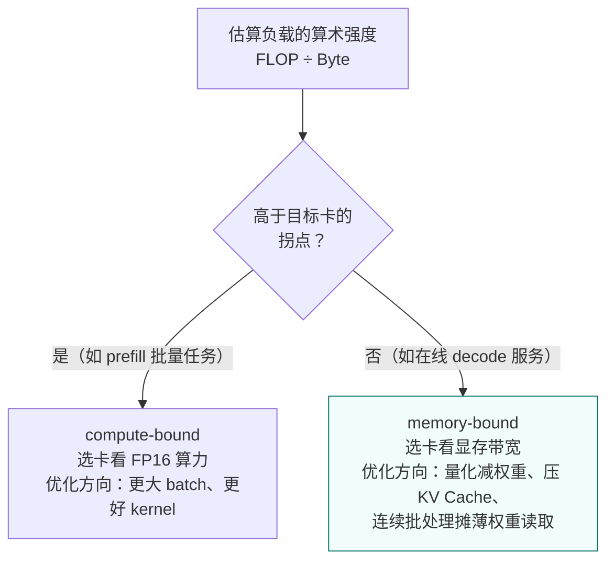
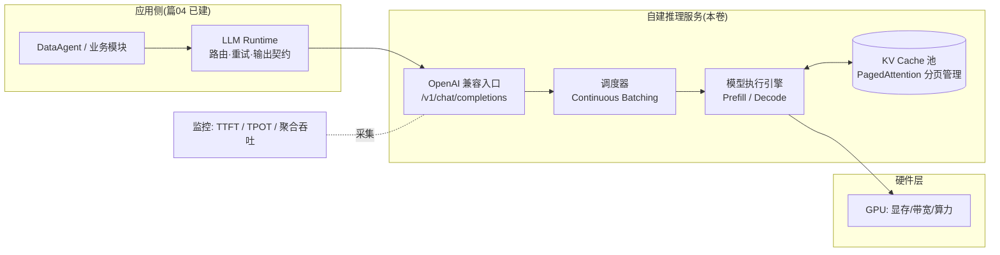
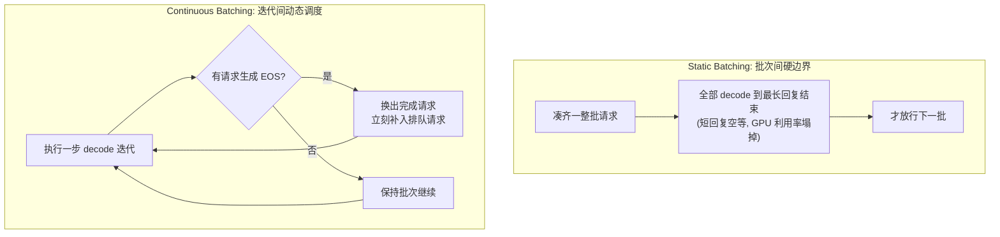
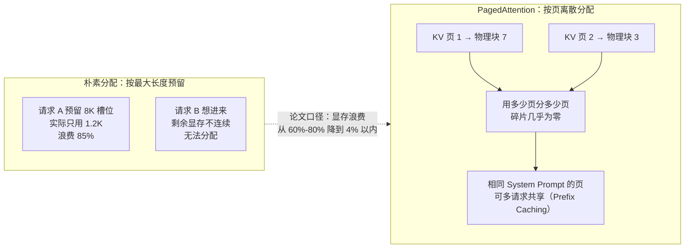
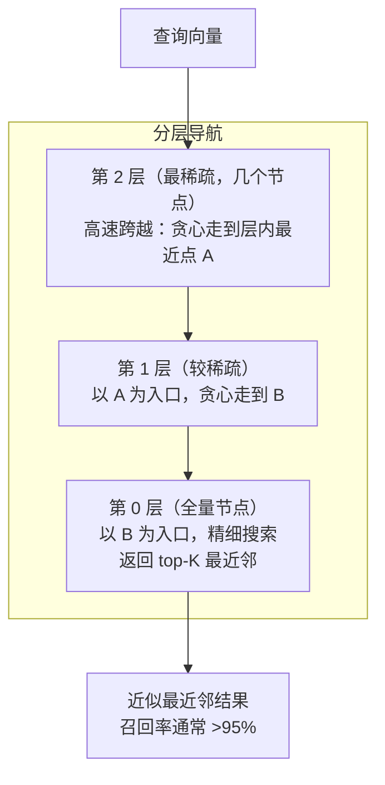
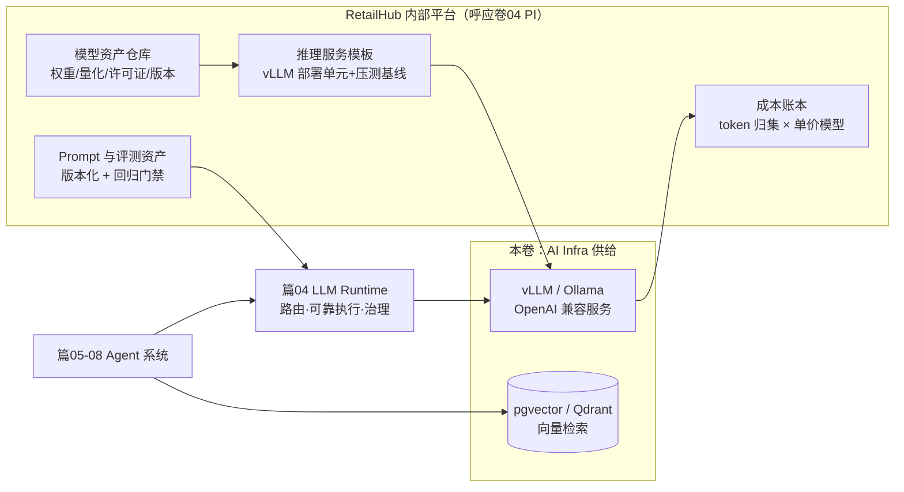
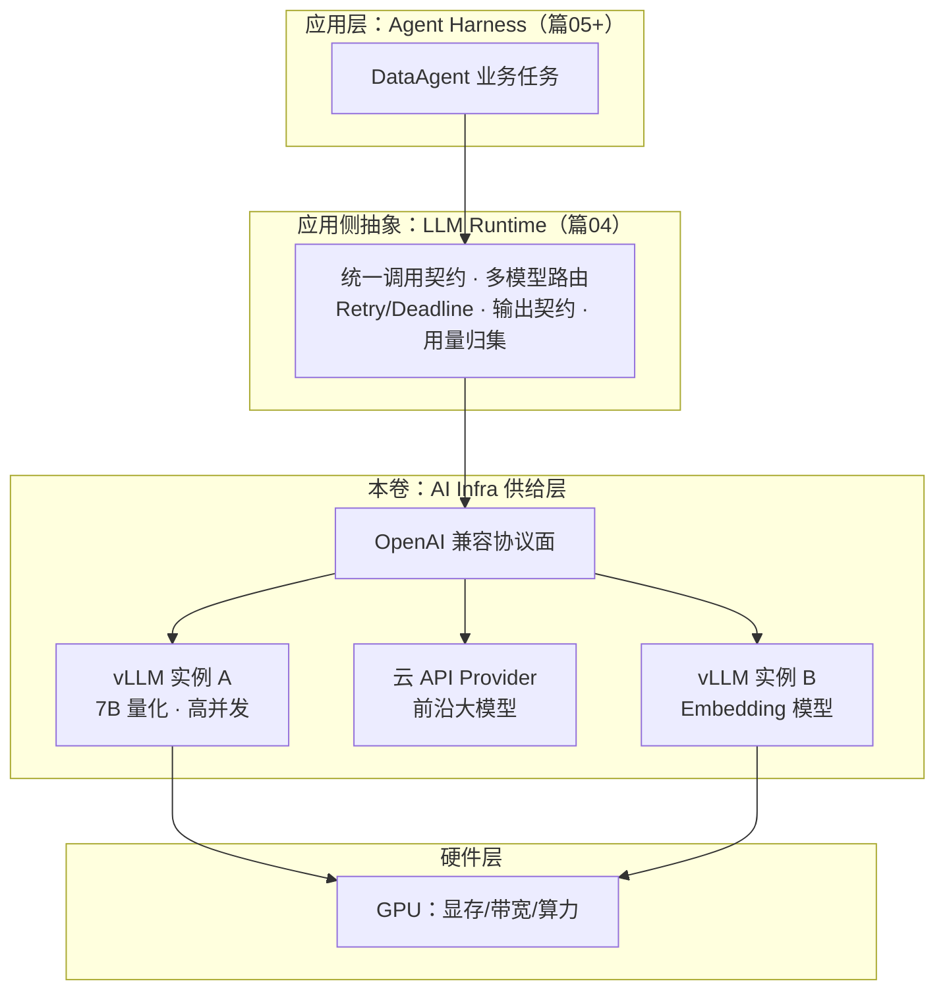

# 卷06：AI 基础设施（AI Infra）——把模型从"调 API"升级为"可运营的基础设施"

> 导语：走到这里，你已经完成了六段旅程：卷01 用 FastAPI 单体搭起 RetailHub 的骨架，卷02 演进服务架构，卷03 用 DDIA 的数据系统视角重建存储层，卷04 把平台工程（PI，Platform Integration / Internal Platform 思想）落地为内部平台，卷05 以架构师方法论和软考体系补齐文档与决策能力，阶段六（篇00-02）则让你会调模型 API、会写 Function Calling 循环、会搭最小 RAG。**但你手里的"AI 能力"本质上是别人家的：一行 `openai.chat.completions.create()`，背后是某个云厂商的机房。** 一旦客户提出"数据不出域"、一旦 token 账单超过收入、一旦云 API 限流抖动，这条路径就断了。本卷解决一件事：把模型从"一个远端 HTTP 接口"变成你自己可部署、可压测、可计价、可运维的基础设施。卷末的 RetailHub 将具备三项新资产：私有化模型推理服务（vLLM/OpenAI 兼容）、向量检索基建、一份推理成本账本。这正是篇03-10 要构建的企业级 Agent 系统的底层供给。

---

## 1. GPU 与推理硬件基础：显存、算力、带宽，到底谁是瓶颈

### 1.1 衔接篇01：从"原理"到"容量"

篇01 的 1.3 节已经讲清了推理机制：一次请求 = **prefill**（一次性并行吃掉整个 prompt，算力敏感）+ **decode**（逐 token 自回归生成，每步都要把全部 KV Cache 从显存读一遍，带宽敏感），以及 KV Cache 如何随上下文长度线性增长。当时你用这些原理理解"为什么流式输出是天然的"、"为什么长上下文贵"。本卷换一个视角：**这些原理决定了你要买/租什么样的硬件、能同时服务多少并发。**

先把两阶段的机制画出来——后面所有的硬件结论、优化手段、压测曲线，都是从这张图上长出来的：



### 1.2 三个硬件指标与它们的工程含义

| 指标 | 含义 | 决定什么 | 经验规律 |
|---|---|---|---|
| **显存容量（VRAM）** | 一张卡能放多少 GB | 能不能装下模型权重 + KV Cache + 运行时开销 | 装不下 = 直接出局，其余免谈 |
| **显存带宽（Memory Bandwidth）** | 每秒能从显存读多少字节 | decode 速度（token/s/请求） | decode 是 memory-bound，带宽决定单流体验 |
| **算力（FLOPS）** | 每秒浮点运算次数 | prefill 速度与批量吞吐 | prefill 是 compute-bound，大批量时算力饱和 |

**容量估算公式**（必背）：

```
模型权重大小 ≈ 参数量 × 每参数字节数
  FP16/BF16：2 字节 → 7B 模型 ≈ 14 GB
  INT8：1 字节      → 7B 模型 ≈ 7 GB
  INT4：0.5 字节    → 7B 模型 ≈ 3.5 GB

KV Cache 大小 ≈ 2 × 层数 × hidden_size × 2字节 × 序列长度 × batch
```

KV Cache 公式里的每一个因子都值得认一遍：**2**（K 和 V 两份）× **层数**（每层都要缓存）× **hidden_size**（每层的向量维度）× **2 字节**（FP16，KV Cache 一般保持高精度，权重 INT4 了它也不跟着降）× **序列长度**（线性增长，长上下文的贵就贵在这里）× **batch**（每一路并发一份）。注意这个公式里**没有 GQA/MQA 系数**——新一代模型（LLaMA-3、Qwen2.5 等）用分组查询注意力把 KV 头数砍到 1/4 甚至 1/8，实际 KV Cache 要再除以分组数，这正是"新模型比老模型省显存"的主要机制之一。

以 LLaMA-2-7B（32 层，hidden 4096）为例：单请求 4K 上下文的 KV Cache ≈ 2 × 32 × 4096 × 2 × 4096 ≈ **2.1 GB**。也就是说一张 24 GB 的卡装完 14 GB 权重后，大约只剩 8 GB 给 KV Cache——撑死 4 条 4K 上下文的长请求并发。这就是为什么推理引擎的核心创新（PagedAttention、Continuous Batching）全部围绕"显存怎么挤"。

**三条判断瓶颈的经验法则**：

1. 单用户问答场景（batch 小）：瓶颈是**带宽**，看 token/s/请求。
2. 高并发服务场景（batch 大）：prefill 频繁时瓶颈转向**算力**，看聚合吞吐 token/s。
3. 任何场景下，**显存容量是硬门槛**：权重 + KV Cache 超了，要么换大卡、要么量化、要么张量并行拆到多卡。

> 常见困惑"为什么我的 A100 和 H100 decode 速度差一倍多"：算力差约 3 倍，但带宽只差约 1.7 倍（2 TB/s vs 3.35 TB/s）——decode 场景的真实差距跟着带宽走，不跟 FLOPS 走。买卡先看工作负载落在哪一段。

在往下看理论之前，先用这个计算器把上面的公式变成肌肉记忆：选模型、精度、上下文、并发、显卡，实时看权重与 KV Cache 怎么分食显存，以及"该卡最多撑几条并发"：

```demo kv-cache
```

**Demo 导学单**（建议按顺序观察）：

1. 保持默认（7B FP16 + 24GB 卡 + 4K 上下文），把并发从 1 拉到 256，观察堆叠条里 KV Cache（橙色）何时超过权重——理解"并发能力 = 显存预算"。
2. 把上下文拉到 32K，看"该卡最大并发"跳水多少倍，解释为什么长上下文业务的单价贵。
3. 切到 INT4 再试：注意权重（绿色）缩水后省下的空间全部变成了并发能力，同时记住 KV Cache 并不跟着量化。
4. 选 70B + 单卡 24GB：观察"权重本身就装不下"的判定，然后把部署方式切成"张量并行 ×4"，看四张卡如何合出一个大显存池。
5. 用计算器反推：RetailHub 需要"7B 模型、8K 上下文、32 并发"，找出最便宜的显卡组合，写下你的答案和第 4 节成本公式对照。

### 1.3 屋顶线模型（Roofline）：一张图统一"算力"与"带宽"

1.2 节的经验法则背后有一个统一的理论框架——**屋顶线模型**（Roofline Model）[^roofline]。它的核心是定义一个比值：

```
算术强度（Arithmetic Intensity）= 计算量（FLOP）÷ 访存量（Byte）
```

任何一段计算，要么被"屋顶"的斜边（带宽）限制，要么被横边（算力）限制：

- **算术强度低**（每读一个字节只做很少计算）→ 撞上带宽屋顶 → **memory-bound**。Decode 阶段每生成 1 个 token 要做约 2×参数量 次乘加，但要读 参数量×2字节 的权重 + 全部 KV Cache——7B FP16 模型每 token 读 14+ GB 只做 14 GFLOP，算术强度 ≈ 1 FLOP/Byte，远低于任何 GPU 的拐点，**所以 decode 永远是 memory-bound**。
- **算术强度高**（每读一个字节做大量计算）→ 撞上算力屋顶 → **compute-bound**。Prefill 阶段几千个 token 共享同一份权重读取，计算量随 token 数平方增长而访存量基本不变，算术强度轻松冲上几百——**所以 prefill 是 compute-bound**。

每张 GPU 卡有一个**拐点（ridge point）= 峰值算力 ÷ 峰值带宽**，算术强度低于拐点的负载被带宽卡住，高于拐点的被算力卡住。以两款数据中心卡为例（公开规格量级）：

| 卡 | FP16 算力 | 显存带宽 | 拐点（FLOP/Byte） | 显存容量 |
|---|---|---|---|---|
| A100 80G | ≈312 TFLOPS | ≈2.0 TB/s | ≈156 | 80 GB |
| H100 80G | ≈990 TFLOPS | ≈3.35 TB/s | ≈295 | 80 GB |

这张表能解释一个反直觉的采购结论：**decode 为主的服务型负载，H100 相对 A100 的提速只有带宽之比（≈1.7×），而不是算力之比（≈3.2×）**——因为 decode 撞的是带宽屋顶。反过来，做大批量 prefill（如离线批量打标）时，算力差才会充分兑现。选型决策流程：



连续批处理（3.2 节）为什么能提升吞吐？用屋顶线解释就一句话：**把 N 路 decode 拼成一批后，每读一遍权重服务 N 个 token，算术强度翻了 N 倍，把 decode 从带宽屋顶下往算力屋顶方向推**——在算力饱和之前，加并发几乎是"免费"的吞吐。

## 2. 模型私有化部署：选型、量化与运行时定位

### 2.1 开源模型选型：先定任务剖面，再看榜单

私有化部署第一步不是"选最火的模型"，而是回到篇01 的模型选型三角（效果/成本/时延），按任务剖面选档位：

| RetailHub 任务 | 任务剖面 | 推荐档位 |
|---|---|---|
| SQL 生成 / 数据问答 | 结构化、需要指令跟随与代码能力 | 7B-14B 指令模型（如 Qwen2.5-Coder 系列、GLM 系列） |
| 经营分析报告撰写 | 长文本、中文表达质量 | 14B-32B 通用指令模型 |
| 意图路由 / 工具选择 | 低时延、高并发、任务简单 | 1.5B-7B 小模型或分类器 |
| Embedding（向量检索用） | 专用模型，中文场景 | BGE 系列等开源 Embedding 模型 |

**检查清单**：许可证（商用是否允许，注意各模型许可证差异）、上下文窗口是否覆盖你的 prompt 预算、中文/tokenizer 效率、社区生态（vLLM 是否支持其架构）。

### 2.2 量化：用精度换显存与速度

篇01 讲 FP16 是训练的常用精度；部署时我们常把权重量化到 INT8 甚至 INT4。先认清三种主流量化格式的定位差异，再谈工程取舍：

| 方案 | 原理一句话 | 典型格式 | 生态位 |
|---|---|---|---|
| GPTQ | 逐层校准，用二阶信息补偿量化误差 | INT4/INT3（GPU 推理） | vLLM 生产部署的 INT4 首选 |
| AWQ | 保护"激活值大的重要权重"不量化 | INT4（GPU 推理） | 精度保持略好于 GPTQ，vLLM 同样支持 |
| GGUF | llama.cpp 系的 CPU/混合推理格式 | 多档位（Q2-Q8） | Ollama、笔记本、无 GPU 环境 |

工程含义：

- **显存减半或更多**：14 GB 的 7B 模型 INT4 后约 3.5 GB，24 GB 消费卡从"勉强"变"宽松"，省下的是 KV Cache 空间 = 并发能力（在 1.2 节的计算器里亲手验证过）。
- **decode 提速**：权重读取量减少，memory-bound 阶段直接受益——用屋顶线的语言：访存量除以 4，等效算术强度乘以 4。
- **量化的是权重，不是 KV Cache**：KV Cache 默认仍是 FP16（部分引擎支持 KV Cache INT8/FP8 量化，长上下文场景可再省一半，但属于进阶手段）。
- **代价是精度**：INT8 通常几乎无损；INT4 对多数任务可接受，但对数学、精确数值任务要实测。DataAgent 的"数字必须准确"红线意味着：**量化版本上线前必须跑过篇09 的回归评测集，不能只看 benchmark 分数。**

### 2.3 vLLM vs Ollama：开发期与生产期的不同答案

| 维度 | Ollama | vLLM |
|---|---|---|
| 定位 | 本地开发/个人体验的一键运行时 | 生产级推理服务引擎 |
| 核心卖点 | `ollama run` 一条命令出 OpenAI 兼容接口 | PagedAttention + Continuous Batching，高并发吞吐 |
| 并发能力 | 单/低并发为主 | 为几十到几百并发设计 |
| 资源开销 | 轻 | 需要 CUDA GPU 才发挥价值 |
| 量化格式 | GGUF（llama.cpp 系） | GPTQ/AWQ/FP16 等 |
| 适用阶段 | 本机验证、PoC、无 GPU 的笔记本 | RetailHub 生产推理服务 |

一句话：**用 Ollama 走通流程，用 vLLM 承接流量。** 两者都提供 OpenAI 兼容 API，意味着应用层（篇04 的 LLM Runtime）可以无感切换。

## 3. 推理服务化：OpenAI 兼容、Continuous Batching 与 SLA

### 3.1 为什么是"OpenAI 兼容"而不是各自造协议

`POST /v1/chat/completions` 已经成为事实标准。自建服务暴露同样的协议，带来三个直接收益：

1. 应用层零改动：篇04 的 LLM Runtime 只需换一个 `base_url`，路由表上"云 API"和"自建 vLLM"是两个等价 Provider——多模型路由、降级切换全部复用已有机制。
2. 生态白拿：任何支持 OpenAI SDK 的工具、压测脚本、观测组件直接可用。
3. 供应商解耦：避免被任何一家的私有协议锁死。

启动一个 vLLM OpenAI 兼容服务（代码骨架见 3.4），实际上就得到了一个"自建版 OpenAI"。

一个请求穿过自建推理服务的完整链路如下——对照这张图，后面每一节的机制（Continuous Batching、KV Cache 分页、TTFT/TPOT 监控）都能找到自己的位置：



### 3.2 Continuous Batching 与 PagedAttention：吞吐翻倍的两台发动机

传统 static batching 等一整批请求全部 decode 完才放行下一批，长回复拖累短回复。**Continuous Batching（连续批处理）** 在每一步 decode 迭代之间动态调度：某个请求生成了 EOS 就立刻换出新请求进批次，GPU 永远保持满载。两种调度方式的对比：



1.3 节的屋顶线已经给了它理论解释：批大小从 1 提到 N，每读一遍权重服务 N 个 token，算术强度翻 N 倍——**在算力饱和前，吞吐随并发近似线性增长**。对容量规划的含义：吞吐不再随并发线性摊薄，这正是 3.3 压测要画的那条曲线。

**PagedAttention** 解决的是另一个问题：KV Cache 的显存管理。类比操作系统的虚拟内存——进程申请内存时不会拿到一整段物理地址，而是按"页"离散分配、页表映射。vLLM 把每个请求的 KV Cache 也切成固定大小的页[^vllm]：



两台发动机合起来的效果：vLLM 论文报告的吞吐相对传统方案提升可达一个数量级（2-4 倍为常见生产口径）[^vllm]。近年 vLLM 还引入了 **chunked prefill**（把超长 prompt 的 prefill 切片，与 decode 迭代穿插执行，防止一次大 prefill 卡住全批的 TPOT）——生产部署时值得在版本说明里确认该特性状态。

### 3.3 SLA 指标：TTFT 与 TPOT

| 指标 | 定义 | 用户感知 | RetailHub 参考目标 |
|---|---|---|---|
| **TTFT**（Time To First Token） | 请求发出到首个 token 返回 | "系统有没有反应" | P95 < 2 s（分析类可放宽到 5 s） |
| **TPOT**（Time Per Output Token） | 相邻 token 的平均间隔 | "打字流不流畅" | P95 < 100 ms（≥10 token/s） |
| **E2E Latency** | 整段回答完成时间 | 总等待 | 报告类 < 60 s |
| **聚合吞吐** | 全系统 token/s | 决定成本与容量 | 压测实测 |

TTFT 主要由 prefill 时长 + 排队时长决定；TPOT 由 decode 带宽决定。并发升高时，TTFT 先恶化（排队），TPOT 后恶化（显存带宽争抢）——压测曲线的拐点就是你的服务上限。

在真机压测之前，先用这个交互 Demo 建立直觉：拖动并发滑块（1–128），看一个简化 Continuous Batching 排队模型下 TTFT、TPOT、聚合吞吐三条曲线怎么走位、SLA 拐点（TTFT_P95 > 2s）出现在哪；下方还内置了 4.1 节公式的"自建 vs 云 API 月成本计算器"，日 Token 量、模型档位、利用率全部可调——读完第 4 节记得回来算一遍：

```demo ttft-tpot
```

**Demo 导学单**（建议按顺序观察）：

1. 并发从 1 缓慢加到 16，观察 TTFT 几乎不动、聚合吞吐近似线性上升——对应屋顶线模型的"带宽屋顶下还有算力余量"区间。
2. 继续加并发直到 TTFT 曲线出现拐点（突破 2s SLA 线），记下拐点并发数——这就是"单实例安全并发上限"的雏形，实战压测要找的就是它。
3. 观察拐点之后 TPOT 曲线的变化：为什么它比 TTFT 后恶化？（提示：排队先打满，带宽争抢后至。）
4. 切到成本计算器，把日 token 量从低到高拉一遍，找到"自建成本 = 云 API 成本"的盈亏平衡点，注意利用率滑块对结论的翻转作用。
5. 把模型档位从 7B 切到 70B，对比同样并发下 TTFT 的变化，解释为什么大模型服务必须配更强的卡或更多卡并行。

### 3.4 代码骨架：起服务 + 压测 + 容量曲线

`serve.sh` —— 启动 vLLM OpenAI 兼容服务（约 30 行）：

```bash
#!/usr/bin/env bash
# RetailHub 私有化推理服务启动脚本
# 前提：pip install vllm；有一张显存足够的 NVIDIA GPU
MODEL="Qwen/Qwen2.5-7B-Instruct"   # 可换成你选定的开源模型
PORT=8000

python -m vllm.entrypoints.openai.api_server \
  --model "$MODEL" \
  --served-model-name retailhub-chat \      # 对外暴露的逻辑模型名
  --host 0.0.0.0 --port $PORT \
  --max-model-len 8192 \                    # 上下文上限，直接决定 KV Cache 预算
  --gpu-memory-utilization 0.85 \           # 显存占用比例，留 15% 给系统/碎片
  --max-num-seqs 64 \                       # 连续批处理的最大并发序列数
  --enable-prefix-caching                   # 相同前缀（如 System Prompt）复用 KV，省 prefill

# 无 GPU 开发机的替代：ollama pull qwen2.5:7b && ollama serve
# 同样暴露 http://localhost:11434/v1 的 OpenAI 兼容接口
```

`bench_ttft.py` —— 压测不同并发下的 TTFT/TPOT（约 55 行）：

```python
"""RetailHub 推理服务压测：测 TTFT / TPOT，输出容量曲线数据。
用法：python bench_ttft.py --base-url http://localhost:8000/v1 --concurrencies 1 4 8 16 32
"""
import argparse, asyncio, json, statistics, time
import httpx

PROMPT = "请用三点概括零售企业分析同店销售增长时的关键维度。"
MAX_TOKENS = 256

async def one_request(client, base, model):
    t0 = time.perf_counter()
    ttft, tokens, last = None, 0, t0
    tpot_samples = []
    payload = {"model": model, "stream": True, "max_tokens": MAX_TOKENS,
               "messages": [{"role": "user", "content": PROMPT}]}
    async with client.stream("POST", f"{base}/chat/completions", json=payload) as r:
        async for line in r.aiter_lines():
            if not line.startswith("data:") or line.endswith("[DONE]"):
                continue
            now = time.perf_counter()
            delta = json.loads(line[5:])["choices"][0]["delta"].get("content")
            if delta:
                if ttft is None:
                    ttft = now - t0
                else:
                    tpot_samples.append(now - last)
                last, tokens = now, tokens + 1
    return ttft, statistics.mean(tpot_samples) if tpot_samples else None

async def run_level(base, model, conc):
    async with httpx.AsyncClient(timeout=120) as client:
        t0 = time.perf_counter()
        results = await asyncio.gather(*[one_request(client, base, model) for _ in range(conc)])
        wall = time.perf_counter() - t0
    ttfts = [r[0] for r in results]; tpots = [r[1] for r in results if r[1]]
    throughput = conc * MAX_TOKENS / wall
    print(f"并发={conc:3d}  TTFT_P95={statistics.quantiles(ttfts, n=20)[18]:.2f}s  "
          f"TPOT_avg={statistics.mean(tpots)*1000:.0f}ms  聚合吞吐={throughput:.0f} tok/s")
    return {"concurrency": conc, "ttft_p95": statistics.quantiles(ttfts, n=20)[18],
            "tpot_avg_ms": statistics.mean(tpots) * 1000, "throughput": throughput}

if __name__ == "__main__":
    ap = argparse.ArgumentParser()
    ap.add_argument("--base-url", default="http://localhost:8000/v1")
    ap.add_argument("--model", default="retailhub-chat")
    ap.add_argument("--concurrencies", type=int, nargs="+", default=[1, 4, 8, 16, 32])
    a = ap.parse_args()
    curve = [asyncio.run(run_level(a.base_url, a.model, c)) for c in a.concurrencies]
    json.dump(curve, open("capacity_curve.json", "w"), indent=2, ensure_ascii=False)
    print("容量曲线已写入 capacity_curve.json —— 找 TTFT_P95 突变的拐点，那就是单实例上限。")
```

---

## 4. 推理成本工程：Token 单价、容量公式与自建 vs 云

### 4.1 Token 单价模型

云 API 的账单是透明的：`成本 = 输入token数 × 输入单价 + 输出token数 × 输出单价`（输出通常贵 3-5 倍，对应 decode 更贵的事实）。自建的成本则需要自己摊：

```
自建每百万 token 成本 = 实例每小时价格 × 1e6 / (实测聚合吞吐 tok/s × 3600 × 利用率)
```

举例（仅示意，用你自己的实测数替换）：某按量 GPU 实例 25 元/小时，实测可用聚合吞吐 2000 tok/s，平均利用率 40%，则每百万 token ≈ 25 × 1e6 / (2000 × 3600 × 0.4) ≈ **8.7 元**。把这个数和云 API 报价放在同一坐标系，决策才有依据。

注意公式里三个因子全部来自实测：**吞吐**来自 3.4 节的压测容量曲线（不是厂商宣传页），**利用率**来自监控系统的真实负载归集（不是"我觉得挺忙的"），**实例价格**要含存储、带宽、闲置时段——GPU 实例最大的浪费是"为峰值买的卡，谷时在空转"。这也是 4.3 节决策框架里"利用率能跑过盈亏平衡点"成为分水岭的原因。

### 4.2 容量规划公式

```
所需实例数 = 峰值所需吞吐 / 单实例实测吞吐
峰值所需吞吐 = 峰值QPS × (平均输入token + 平均输出token)
```

RetailHub 示例：早高峰 10 个租户同时跑经营分析，每任务 5 次模型调用、每次平均 3000 输入 + 1500 输出 token，任务集中在 10 分钟内 → 峰值吞吐 ≈ 10 × 5 × 4500 / 600 ≈ 375 tok/s。对照压测容量曲线选实例数，再加 30% 冗余。

### 4.3 自建 vs 云 API 决策框架

| 决策因子 | 偏云 API | 偏自建 |
|---|---|---|
| 调用量 | 低/不稳定，按需付费划算 | 高且稳定，利用率能跑过盈亏平衡点 |
| 数据合规 | 允许出域 | 数据不出域是硬要求（零售客户的会员数据） |
| 模型需求 | 需要最强前沿模型 | 7B-32B 开源模型已够用 |
| 时延/定制 | 可接受共享限流 | 需要确定性 SLA、私有微调 |
| 团队能力 | 无 Infra 人力 | 有人能运维 GPU 集群 |

**结论不是二选一，而是组合**：篇04 的多模型路由天然支持"默认云 API + 敏感租户/高频简单任务走自建"。这正是把篇04 的路由表接上本卷的供给层。

## 5. 向量数据库与 RAG 基建

### 5.1 呼应卷03：向量索引也是一种"存储引擎选型"

卷03 用 DDIA 的视角讲过 B-Tree vs LSM-Tree 的取舍：读放大、写放大、空间放大。向量索引是同一套思维的新题目——只不过查询从"范围扫描"变成了"近似最近邻（ANN）"：

| 索引类型 | 原理一句话 | 特点 | 类比卷03 |
|---|---|---|---|
| **FLAT（暴力）** | 全量扫描算距离 | 100% 召回，O(n)，只用于小规模/评测基线 | 全表扫描 |
| **IVF（倒排聚簇）** | 先聚类，查询只搜最近的几个簇 | 快但召回受簇数影响，需要训练 | 分区裁剪 |
| **HNSW（分层小世界图）** | 图上贪心导航到最近邻 | 召回高、查询快，内存占用大，构建慢 | B-Tree 的多级跳转 |
| **PQ / 量化压缩** | 向量压缩成短码近似距离 | 内存省数倍，召回略降 | 有损压缩 |

### 5.2 HNSW 原理：为什么"小世界图"找邻居快

HNSW（Hierarchical Navigable Small World）是当下向量库的默认索引（pgvector、Qdrant、Milvus 都默认或主推它），值得把原理讲透[^hnsw]。它的思想可以拆成两层：

**第一层：小世界图的贪心导航**。把所有向量连成一个图，每个节点连向若干"邻居"。查询时从任意入口出发，每一步都跳到"当前邻居里离查询点最近"的节点，不断重复——就像在一个大型火车站里，每到一个站台都问"哪个方向离目的地更近"，然后换乘。小世界图的神奇性质是：**任意两点之间的"跳数"是对数级的**（O(log n)），百万级向量十几次跳转就能逼近最近邻——这正是它类比 B-Tree 多级跳转的原因。

**第二层：分层加速**。单一小世界图的问题是"入口不好选"——从边缘节点出发要走很多冤枉路。HNSW 的解法是模仿跳表（Skip List）：第 0 层包含全部节点（稠密），第 1 层随机抽一部分（稀疏），第 2 层更少……顶层只有几个节点。查询从最顶层开始（稀疏层 = 高速公路，大步跨越），每层贪心走到局部最优后，以该点为入口进入下一层（越来越密 = 国道、街道），直到第 0 层精确定位：



**两个调参旋钮**（与 Recall@K 基线联动调）：

- **M（建索引时）**：每个节点的最大连接数。M 越大图越连通、召回越高，但内存和构建时间线性涨。常用 16-64。
- **ef_search（查询时）**：搜索时维护的候选集大小。越大召回越高、延迟越高——**它是唯一可以按查询动态权衡"快"与"准"的旋钮**：零售看板的交互式查询 ef 开小，离线报告生成 ef 开大。

HNSW 的代价也要认账：内存占用大（图结构本身约为向量数据的 1.2-1.5 倍）、构建慢、删除不优雅（标记删除，定期重建）。数据量上到千万级且写入频繁时，就要重新评估 IVF-PQ 类的方案——回到卷03 那句话：**没有最好的索引，只有匹配工作负载的索引**。

### 5.3 召回评估：RAG 的地基质量

篇02 的最小 RAG 让你"跑通"；本卷要求你"量化"。指标定义：

```
Recall@K = 相关文档被前K条命中的比例   （检索层质量）
MRR      = 第一个相关结果排名的倒数均值（排序质量）
```

方法：从零售文档人工标 30-50 个"问题 → 应命中文档段落"对，跑检索算 Recall@5。**没有这组基线数字，换 Embedding 模型、换 chunk 大小、换索引参数（M、ef_search）都是盲调。**

### 5.4 pgvector vs Qdrant：两个务实选项

| 维度 | pgvector（PostgreSQL 扩展） | Qdrant（专用向量库） |
|---|---|---|
| 定位 | 已有 PG 就顺手获得向量能力 | 独立向量服务，功能专精 |
| 运维 | 零新增组件，随卷03 的 PG 一起备份/高可用 | 多一个有状态服务要运维 |
| 规模舒适区 | 百万级向量以内 | 千万级以上、高 QPS |
| 过滤能力 | SQL 原生 join 租户/权限过滤，天然适合多租户 | payload 过滤，够用但表达力弱于 SQL |
| 选型建议 | RetailHub 起步首选 | 向量量或 QPS 上来后再迁 |

多租户场景的关键点：**检索必须带租户过滤**（`WHERE tenant_id = ?` 或 payload filter），否则一个租户的文档会被另一个租户召回——这是 RAG 版的数据越权。

### 5.5 代码骨架：pgvector 建库 + 检索 + 召回评估（约 50 行）

```python
"""RetailHub 向量检索骨架：pgvector 建表、写入、带租户过滤的检索、Recall@K 评估。
前提：PostgreSQL 已装 pgvector 扩展（CREATE EXTENSION vector;）。
Embedding 可来自自建服务（OpenAI 兼容 /v1/embeddings）或云 API。"""
import psycopg2, httpx

DDL = """
CREATE TABLE IF NOT EXISTS doc_chunks (
  id BIGSERIAL PRIMARY KEY,
  tenant_id TEXT NOT NULL,
  doc_id TEXT NOT NULL,
  chunk_text TEXT NOT NULL,
  embedding vector(1024)              -- 维度必须与所用 Embedding 模型一致
);
CREATE INDEX IF NOT EXISTS idx_chunks_tenant ON doc_chunks (tenant_id);
CREATE INDEX IF NOT EXISTS idx_chunks_vec ON doc_chunks
  USING hnsw (embedding vector_cosine_ops);   -- HNSW 索引，pgvector ≥0.5 支持
"""

def embed(texts, base="http://localhost:8000/v1", model="retailhub-embed"):
    r = httpx.post(f"{base}/embeddings",
                   json={"model": model, "input": texts}, timeout=30)
    return [d["embedding"] for d in r.json()["data"]]

def search(conn, tenant_id, question, k=5):
    qvec = embed([question])[0]
    with conn.cursor() as cur:
        cur.execute(
            """SELECT doc_id, chunk_text,
                      1 - (embedding <=> %s::vector) AS score
                 FROM doc_chunks
                WHERE tenant_id = %s          -- 租户隔离，必须出现在每个检索里
                ORDER BY embedding <=> %s::vector
                LIMIT %s""",
            (qvec, tenant_id, qvec, k))
        return cur.fetchall()

def recall_at_k(conn, evalset, k=5):
    """evalset: [(tenant_id, question, expected_doc_id), ...]，人工标注 30+ 条"""
    hits = sum(1 for t, q, expected in evalset
               if any(row[0] == expected for row in search(conn, t, q, k)))
    return hits / len(evalset)

if __name__ == "__main__":
    conn = psycopg2.connect("dbname=retailhub")
    with conn.cursor() as cur:
        cur.execute(DDL)
    conn.commit()
    print("表与索引就绪。灌入零售文档 chunks 后，先跑 recall_at_k 建基线，再谈调优。")
```

## 6. LLMOps 与平台工程：把 AI 资产纳入内部平台

卷04 的平台工程（PI 思想）讲过：把重复的基础设施能力收敛为自助式平台，业务团队不再重复造轮子。本卷把这个思想延伸到 AI 资产——RetailHub 的内部平台至少要纳管四类资产：

1. **模型资产**：模型仓库（权重、量化版本、许可证元数据）、版本号与评测分数绑定，"哪个模型版本在服务哪个租户"可查可回滚。
2. **推理资产**：vLLM/Ollama 服务的标准化部署单元（镜像 + 启动参数模板 + 健康检查 + 压测基线），新模型上线 = 填模板而不是写脚本。
3. **Prompt/评测资产**：篇02 讲过 Prompt 即代码、资产蒸馏；本卷强调其运行侧——Prompt 版本与模型版本、评测集三者构成发布三元组，进入篇09 的 Regression Gate。
4. **成本资产**：每租户/每任务类型的 token 账本（篇04 的用量归集）+ 本卷的单价模型 = 一张持续更新的成本看板。



### 6.1 与篇04 LLM Runtime 的关系：一个管供给，一个管消费

这是本卷最容易混淆的边界，用一张图说清：



- **篇04 LLM Runtime 是"消费者视角"**：我不关心模型跑在哪，只关心契约、路由、可靠性、账单。
- **本卷 AI Infra 是"生产者视角"**：我负责让某个 `base_url` 背后真的有一组 GPU 实例，在目标 SLA 和成本内稳定吐出 token。
- 两者的接缝就是 **OpenAI 兼容协议 + 路由表**：供给层换实现（Ollama 换 vLLM、单卡换多卡），应用层无感；应用层换路由策略（降级、分流），供给层无感。这就是分层架构在 AI 时代的同款演绎[^phoenix]。

---

## 本卷实战：RetailHub 演进第 6 步——私有化推理服务 + 向量检索 + 成本账本

**背景**：RetailHub 的最大客户提出"经营数据不出域"；同时财务发现云 API 账单已占该租户收入的 31%。架构评审决定：为高频数据问答任务建立私有化推理与检索能力，前沿复杂任务继续走云 API，由 LLM Runtime 路由。

### 递进任务步骤

**步骤 1：起服务。**

- 目标：在本机跑起一个 OpenAI 兼容推理服务。
- 操作：无 GPU 用 Ollama（`ollama pull qwen2.5:7b && ollama serve`），有 GPU 用 3.4 节 `serve.sh` 起 vLLM，`served-model-name` 命名为 `retailhub-chat`；用 `curl http://localhost:8000/v1/chat/completions` 验证流式输出。
- 验收标准：流式回复正常吐出 token；启动参数（max-model-len、gpu-memory-utilization、max-num-seqs）你能逐个讲出含义。

**步骤 2：压测并画容量曲线。**

- 目标：拿到单实例的真实容量数字，找到拐点。
- 操作：用 3.4 节 `bench_ttft.py` 在 1/4/8/16/32 并发下压测，记录 TTFT_P95、TPOT、聚合吞吐，用 matplotlib 画图（横轴并发，双纵轴 TTFT 与吞吐）。
- 验收标准：容量曲线图存在；拐点（TTFT_P95 突破 2s 或吞吐停止增长处）有文字结论"单实例安全并发上限 = __"；压测脚本入库。

**步骤 3：建向量检索并跑召回基线。**

- 目标：RetailHub 的零售知识可被检索，且检索质量有数字。
- 操作：用 5.5 节骨架在 pgvector（或 Qdrant）建库；自造 20+ 份零售文档（退换货 SOP、促销规则、会员分层说明……），chunk 策略自定但要在 README 说明理由；标注 30 条"问题 → 应命中文档"评测对，跑 Recall@5。
- 验收标准：检索接口带 `tenant_id` 过滤，跨租户召回测试为 0 条；Recall@5 基线数字写入备忘录（不允许写"效果还行"这种话）。

**步骤 4：接路由 + 写成本备忘录。**

- 目标：自建供给接入篇04 路由表，并完成自建 vs 云的经济性论证。
- 操作：在 LLM Runtime 路由表新增自建 Provider，实现"数据问答走自建、报告生成走云"；写《自建 vs 云 API 成本对比备忘录》，必须包含：4.1/4.2 的公式、你的实测数字、盈亏平衡点（月调用量达到多少时自建更便宜）、明确推荐结论。
- 验收标准：路由规则生效（两类任务分别落到自建与云，日志可验证）；备忘录含公式、实测数、盈亏平衡点、结论四要素。

### AI Coding 实操模式

本步的代码（压测脚本、检索骨架）适合 AI 生成，但**容量数字与成本结论必须来自你机器上的实测**——AI 不知道你的显卡有几 GB，也不知道你的租户账单。

**① 可复制提示词模板：**

```text
你是 AI Infra 工程师。我在为零售 SaaS 搭建私有化推理服务，环境：
【GPU 型号与显存 / 无 GPU 用 Ollama】，模型 Qwen2.5-7B-Instruct，框架 vLLM。
请完成：
1. 审查我的 vLLM 启动参数（附后），逐项解释含义并指出与我的硬件不匹配之处；
2. 审查我的压测脚本 bench_ttft.py（附后），指出统计口径缺陷
   （P95 样本量、预热、tpot 采样方式），给出修改版；
3. 根据我贴的压测输出（附后），帮我定位 TTFT 拐点，并给出 3 条提升安全并发的
   候选手段（启动参数级，不换硬件）。
约束：只做参数与代码建议，容量结论以我的实测数据为准；不确定的硬件规格列出来问我。
```

**② AI 初版人工评审清单：**

- [ ] AI 建议的启动参数是否与你的显存预算自洽（用 1.2 节 kv-cache 计算器验算 max-model-len × max-num-seqs 是否装得下）？
- [ ] 压测脚本是否有预热（warmup）阶段？冷启动的首次请求会污染 TTFT 样本，AI 常漏。
- [ ] P95 计算的样本量是否足够（每档并发 ≥20 个请求）？5 个请求算 P95 没有统计意义。
- [ ] AI 给的"提升并发"建议是否区分了 prefill 瓶颈与 decode 瓶颈（对照 1.3 节屋顶线），还是泛泛而谈？
- [ ] 成本备忘录里的每个数字是否都能溯源（实例账单截图、压测输出、云 API 价目页）？

**③ 验收标准：** 通过评审清单后，对照下面总验收逐条打勾；备忘录中每个数字注明来源（实测/账单/公开价目），没有来源的数字删掉重写。

### 总验收标准

- [ ] `curl http://localhost:8000/v1/chat/completions` 能拿到正常流式回复（或 Ollama 的 11434 端口等价验证）
- [ ] 容量曲线图存在且拐点有文字结论
- [ ] 检索接口带 `tenant_id` 过滤，跨租户召回测试为 0 条
- [ ] Recall@5 基线数字写入备忘录（不允许写"效果还行"这种话）
- [ ] 路由规则生效：两类任务分别落到自建与云，日志可验证
- [ ] 备忘录含公式、实测数、盈亏平衡点、结论四要素

---

## 常见误区

1. **"参数量除以 2 就是显存需求"**：忘了 KV Cache 和运行时开销。7B FP16 权重 14 GB，但 32 条 8K 并发的 KV Cache 可能再吃 16 GB——容量规划必须权重和 KV Cache 分开算。
2. **"算力越强推理越快"**：decode 是带宽瓶颈。不看 workload 类型就按 FLOPS 选卡，会花 H100 的钱买 A100 的体验提升——先用屋顶线算一算你的负载撞哪个屋顶。
3. **"量化就是免费的午餐"**：INT4 对数值敏感任务可能掉点。不跑回归评测就上线量化模型，等于把篇09 建立的质量门禁撕开一个洞。
4. **"OpenAI 兼容 = 行为兼容"**：协议兼容不代表 Function Calling 稳定性、JSON 输出遵从度一致。换 Provider 后必须重跑输出契约测试（篇04 的 Output Contract）。
5. **"自建一定省钱"**：低利用率下自建单位成本可能是云 API 的数倍。盈亏平衡点是算出来的，不是感觉出来的。
6. **"RAG 效果不好就换 Embedding 模型"**：没有 Recall@K 基线时，你无法区分问题出在 chunk、Embedding、索引参数还是文档质量本身。先建评测，再动手。
7. **"向量库里的数据不算敏感数据"**：chunk 文本明文存储、向量可近似反推原文。向量库要纳入与卷03 数据库同级的权限与备份策略。
8. **把压测当一次性动作**：模型版本、量化格式、max-num-seqs 一变，容量曲线就作废。压测脚本要进仓库、进平台模板，随发布复跑。
9. **HNSW 参数出厂即终局**：M 和 ef_search 默认值的召回未必匹配你的数据分布，ef_search 更是唯一可按查询调"快"与"准"的旋钮——不调参就上生产，等于花钱买了索引却只用了一半。

## 自测清单

- [ ] 我能默写权重显存估算公式和 KV Cache 估算公式，并各举一个数例
- [ ] 我能解释为什么 decode 是带宽敏感而 prefill 是算力敏感（能引用篇01 的机制与 1.1 的两阶段图）
- [ ] 我能定义算术强度与屋顶线拐点，并据此解释"A100→H100 在 decode 场景提速约 1.7 倍而非 3.2 倍"
- [ ] 我能用屋顶线解释 Continuous Batching 提升吞吐的机制（算术强度随 batch 翻 N 倍）
- [ ] 我能说清 TTFT 与 TPOT 分别由什么决定、并发升高时谁先恶化
- [ ] 我能解释 PagedAttention 的"分页"类比，以及 Prefix Caching 复用什么
- [ ] 我能对比 GPTQ / AWQ / GGUF 三种量化格式的生态位，并说出"量化的是权重不是 KV Cache"
- [ ] 我能说出 vLLM 与 Ollama 的定位差异及各自适用阶段
- [ ] 我能推导自建每百万 token 成本公式，并说出利用率在其中的角色
- [ ] 我能给出自建 vs 云 API 决策框架的五个决策因子
- [ ] 我能讲清 HNSW 的两层思想（小世界图贪心导航 + 分层加速），说出 M 与 ef_search 各自权衡什么
- [ ] 我能定义 Recall@K 和 MRR，并说明为什么调 RAG 前必须先有基线
- [ ] 我能用一句话说清本卷与篇04 LLM Runtime 的职责边界（供给 vs 消费）

## 下卷预告

基础设施就位，平台也有了——但"能跑"不等于"可承诺"：如果明天上午推理服务挂了，谁会知道？多久能恢复？你能对业务方承诺一年最多坏多久吗？卷08 进入 SRE 与可靠性工程：用 SLI/SLO 与错误预算把"稳定性"从玄学变成可定量谈判的工程指标，配齐告警、值班、复盘与发布工程，并以金山办公 KAE（13600+ 微服务、每日 310 次部署、两地三中心四个 9）为工业级样板。你将为 RetailHub 立下第一份 SLO，配好告警规则集，并完成一次复盘演练与混沌实验——底座可承诺之后，阶段九的 Agent 系统才谈得上对客户负责。

---

## 参考与脚注

[^roofline]: Samuel Williams, Andrew Waterman, David Patterson, "Roofline: An Insightful Visual Performance Model for Multicore Architectures"（Communications of the ACM, 2009）。本卷 1.3 节的算术强度、带宽/算力双屋顶与拐点概念出自该文；A100/H100 规格为厂商公开口径量级，选型时以最新官方规格书为准。
[^vllm]: Woosuk Kwon 等，"Efficient Memory Management for Large Language Model Serving with PagedAttention"（SOSP 2023），https://arxiv.org/abs/2309.06180 。本卷 3.2 节 PagedAttention 的分页机制、显存浪费对比与吞吐提升口径出自该论文及 vLLM 官方文档。
[^hnsw]: Yury Malkov, Dmitry Yashunin, "Efficient and Robust Approximate Nearest Neighbor Search Using Hierarchical Navigable Small World Graphs"（IEEE TPAMI, 2020），https://arxiv.org/abs/1603.09320 。本卷 5.2 节 HNSW 的分层小世界图结构、贪心导航与 M/ef 参数语义出自该论文。
[^phoenix]: 周志明，《凤凰架构：构建可靠的大型分布式系统》，在线公开版：https://icyfenix.cn 。本卷索引选型与卷03 DDIA 视角的衔接、服务化治理部分可与该书互相印证，可作延伸阅读。
