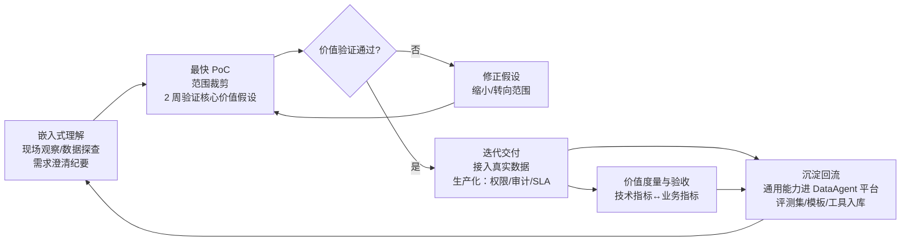
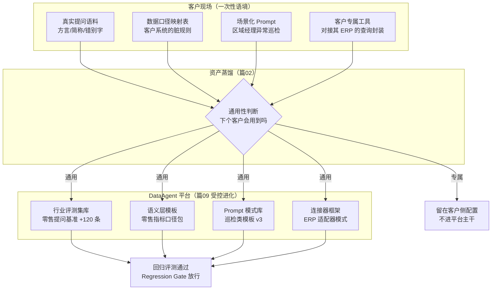
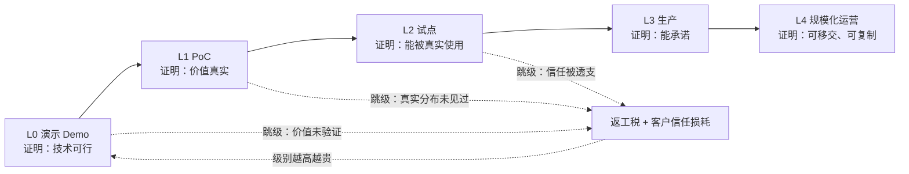
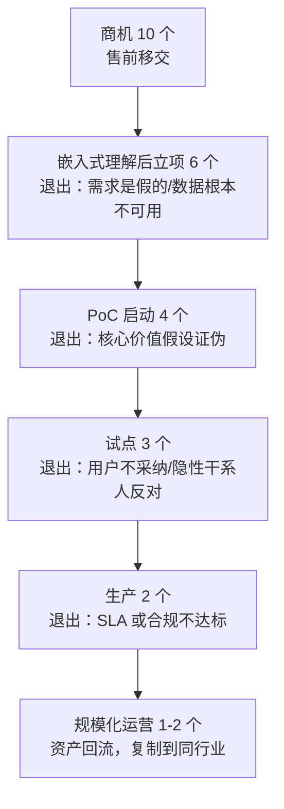
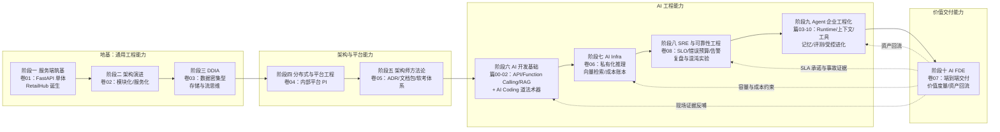

# 卷07：AI FDE 交付实战——把技术能力转化为客户价值的最后一公里

> 导语：至此，RetailHub/DataAgent 已经具备了全部技术要件：服务端架构（卷01-02）、数据系统（卷03）、内部平台（卷04）、架构文档与决策体系（卷05）、AI 开发能力（篇00-02）、可运营的 AI Infra（卷06）、SLO 与可靠性工程体系（卷08），以及篇03-10 构建的企业级 Agent 系统——Runtime、上下文治理、工具治理、记忆、评测与受控进化。但还有一道所有技术人都容易低估的鸿沟：**系统存在 ≠ 价值交付。** 客户的经营数据脏乱、需求模糊、期望值被 ChatGPT 演示吊到天花板，生产环境和你的演示环境完全是两个世界。本卷讲 AI FDE（Forward Deployed Engineer，前置部署工程师）这一角色与工作方法——它源自 Palantir 的实践，正在 AI 时代成为把 Agent 系统真正"交出去"的关键路径[^gktime]。卷末你将完成一次端到端的交付模拟，并用一张大图复盘十阶段成长线，为整条学习路径收官。

---

## 1. FDE 是什么：源自 Palantir 的"进驻式"交付模式

### 1.1 定义

**FDE（Forward Deployed Engineer）= 进驻客户现场、对交付结果直接负责的工程师。** 这一模式由 Palantir 在 2000 年代实践并命名：他们的软件要接入政府、金融机构高度异构的数据环境，标准产品开箱即用是不可能的，于是派工程师直接进驻客户现场，边理解业务、边配置/开发、边交付，同时把现场产生的通用能力**反哺回产品**。

FDE 模式的三个支柱：

1. **嵌入式理解**：不是听客户转述需求，而是坐在客户旁边看真实数据、真实流程、真实的 Excel 表格和微信群里传递的数字。
2. **交付负责制**：FDE 的成功标准不是"我部署完了"，而是"客户的业务问题被解决了"——指标由客户的业务语言定义。
3. **资产回流**：每一次现场交付都必须沉淀回平台，让下一个客户的交付成本更低。没有这个循环，FDE 就退化为外包驻场。

### 1.2 为什么 AI 时代 FDE 尤其兴起

传统软件的需求是相对可规约的（"把审批流线上化"），AI/Agent 项目则有三重模糊性，天然需要 FDE 式的贴身交付：

| AI 项目的特殊性 | 具体表现 | 对交付方式的要求 |
|---|---|---|
| **需求模糊** | 客户说"要一个经营分析 Agent"，实际想要的可能只是"每天早上自动发一张异常门店清单" | 必须在现场快速试错，需求是挖出来的不是写出来的 |
| **数据脏乱** | 客户说"我们数据很全"，实际三套系统口径不一、门店编码有四种写法、历史数据断档半年 | 数据探查必须前置，且往往在客户内网才能做 |
| **效果需要现场调优** | 演示集准确率 92%，上生产掉到 61%——因为真实提问里有方言、简称、错别字 | 评测集必须来自生产数据，调优必须贴近真实分布 |

再叠加"期望值管理"这一 AI 特有的难题：客户见过 ChatGPT 的流畅对话，会默认 AI"什么都能答"，而你要交付的是一个边界清晰、数字有据可查的企业系统。**FDE 的一半工作是工程，另一半是预期管理。**

### 1.3 FDE 与相邻角色的边界

| 角色 | 对什么负责 | 写代码吗 | 时间尺度 | 与 FDE 的关系 |
|---|---|---|---|---|
| **售前/解决方案** | 赢单：方案、报价、演示 | Demo 级 | 签约前 | 把交接棒给 FDE；FDE 反馈"哪些承诺兑现成本高" |
| **项目经理（PM）** | 进度、范围、干系人沟通 | 否 | 项目周期 | FDE 管技术交付，PM 管项目治理，常并肩作战 |
| **传统交付/实施工程师** | 按既定方案部署配置 | 脚本级 | 部署窗口 | FDE 要"定义方案"，交付工程师"执行方案" |
| **产品经理** | 产品路线图、通用能力取舍 | 否 | 季度/年度 | 消费 FDE 沉淀的资产与洞察 |
| **FDE** | **客户价值 + 资产回流，双负责** | 是，生产级 | PoC 到稳定运营 | —— |

一句话区分：**售前承诺价值，FDE 兑现价值，产品吸收价值。**

再把视角拉高一层：FDE 模式和其他几种交付模式相比，钱和风险到底怎么流动：

| 交付模式 | 客户买到什么 | 厂商收入逻辑 | 谁承担"用不起来"的风险 | 厂商能力是否复利 |
|---|---|---|---|---|
| 标准 SaaS | 开箱即用的产品 | 订阅费，边际成本趋零 | 客户（自助 onboarding） | 强（产品迭代普惠所有客户） |
| 传统实施/驻场外包 | 按合同范围部署与定制 | 人天报价，卖人头 | 名义上厂商，实际上扯皮 | 弱（第 N 个项目和第 1 个一样难） |
| 咨询 + 移交 | 方案文档与培训 | 项目费 | 客户（咨询结束责任结束） | 中（方法论可复用，系统不可复用） |
| **FDE 模式** | 业务结果 + 持续运营的系统 | 高客单价 + 平台复用摊薄 | **厂商（交付负责制）** | **强（资产回流平台，下次更便宜）** |

这张表解释了 Palantir 模式的商业本质：**用"交付负责制"换取高客单价，再用"资产回流"把高成本的人力交付逐步摊薄成平台生意。** 少了第一环，客户不会为驻场付溢价；少了第三环，驻场就只是贵的外包。

## 2. FDE 工作循环：理解 → PoC → 迭代 → 沉淀



### 2.1 第一步：嵌入式理解——问对问题比答对问题难

进现场第一周不交付任何软件，只交付一份《需求澄清纪要》。好的澄清问题有三个特征：**逼出具体场景**（"最近一次您为库存问题熬夜是什么时候，发生了什么"优于"您有什么痛点"）、**暴露数据真相**（"能让我随机抽 50 条近三天的真实提问吗"）、**锚定价值度量**（"这件事做成了，您会向老板报哪个数字"）。第 4 节给出 10 个必问问题模板。

### 2.2 第二步：最快 PoC——范围裁剪是第一生产力

PoC 的目标不是"展示能力"，而是**用最小成本证伪或证实核心价值假设**。裁剪原则：

1. **只切一刀**：选 1 个角色、1 个高频场景、1 类数据源。"区域经理每天早上看异常门店"胜过"全员经营分析平台"。
2. **用真人真数据，但绕过脏的部分**：真实数据抽 1 个区域/1 个月，清洗成本超 2 天的数据源果断移出范围并书面记录。
3. **提前写下验收假设**：开工第一天就和客户确认"什么样算成了"，避免两周后目标移动。
4. **时间盒铁律**：2 周。超过 2 周的 PoC 一定是范围没裁干净。

### 2.3 第三步：迭代交付——从"能跑"到"敢上生产"

PoC 验证通过后，差距通常不在模型能力，而在工程化：多租户权限（篇03）、输出契约与证据链（篇04/06）、工具审批（篇07）、评测门禁（篇09）、私有化推理 SLA（卷06）。注意：**此时前面所有篇目的知识第一次以"客户验收压力"的形式汇合**——这正是学习路径把它们排在 FDE 之前的原因。

### 2.4 第四步：沉淀回流——与篇02"资产蒸馏"、篇09"受控进化"的呼应

篇02 讲过资产蒸馏：把一次性劳动提炼为可复用资产；篇09 讲过受控进化：任何变更过评测门禁才能进主干。FDE 的沉淀就是把这两件事搬到客户现场语境：



**判断标准**：如果一个资产的通用性说不清（"下个客户应该也会遇到"），就不进平台主干——否则平台会被 N 个客户的特例污染成泥潭。客户专属内容以配置/租户数据形式留在客户侧。

## 3. AI 交付的特殊坑：演示很好、生产很糟

"前期演示环节很惊艳，落地执行时始终达不到想要的效果"——这是企业 AI 转型中被反复验证的通病，连 AI 原生程度最高的厂商在销售一线也把它列为头号痛点[^wpscomate]。拆开看，它有五个相互叠加的成因：

1. **演示集过拟合**：演示用的 10 个问题是精心挑的，生产问题分布完全不同。对策：评测集必须从生产日志采样，且随时间滚动更新（篇09 的可复现基准）。
2. **脏数据的冰山**：客户给 PoC 的导出表是清洗过的，直连生产库才发现 NULL、口径冲突、时区错乱。对策：PoC 第二周必须接一次真实源系统，哪怕只接一个表。
3. **期望值的棘轮**：第一次演示越惊艳，客户预期越高，之后每次"正常水平"都被视为退步。对策：首次演示就明确展示失败案例与边界，"它不会什么"和"它会什么"一起讲。
4. **隐性利益相关者**：Agent 替代了某人每周手工做报表的 6 小时——这个人可能是项目最隐蔽的反对者。对策：需求澄清时就问"现在谁在做这件事"。
5. **"准确率"没有业务含义**：检索准确率 90% 客户无感；"每月避免 2 次因库存误判导致的断货"客户才听得懂。技术指标必须翻译成业务指标（见 3.1）。

### 3.1 技术指标 ↔ 业务指标映射

映射公式：**技术指标 → 用户行为指标 → 业务结果指标**，三层链条缺一不可。

| 技术指标（你量的） | 行为指标（客户用户感受到的） | 业务指标（客户老板关心的） |
|---|---|---|
| 数据问答准确率（评测集） | 区域经理采纳回答的比例（埋点） | 经营例会前数据准备工时 ↓ |
| TTFT/TPOT（卷06） | 日活跃使用人数、人均提问数 | 决策周期从"周"到"天" |
| 证据链覆盖率（篇06） | 回答被人工复核推翻的比例 | 因数据误读导致的错误补货次数 ↓ |
| 系统可用性/时延 SLA | 早高峰 8-9 点使用完成率 | 晨会准时开始率 |

**经验法则**：PoC 阶段至少要锁定 1 个业务指标作为北极星，哪怕只是方向性改善——没有业务锚点的 AI 项目，验收时一定会陷入"我觉得还不够聪明"的扯皮。

## 4. 客户现场的工程纪律

### 4.1 数据安全与合规

零售客户的会员数据、交易流水是敏感资产，现场纪律包括：

- **最小化取数**：只取 PoC 范围声明的表与字段，书面确认数据授权范围。
- **不出域优先**：默认走卷06 的私有化推理路径；任何出域调用（云 API）必须脱敏并经客户书面同意。
- **不留尾巴**：现场调试用的临时数据库副本、导出的 CSV，项目结束按清单销毁并书面确认。
- **审计留痕**：谁、什么时间、查询了什么数据——复用篇04 的用量归集与篇07 的审批闭环。

### 4.2 受限环境下的部署

客户现场常见约束与对策：

| 约束 | 现实例子 | 对策 |
|---|---|---|
| 无法访问公网 | 门店内网/金融级隔离区 | 离线镜像 + 私有化模型权重预拷贝（卷06 的模型资产仓） |
| 无 GPU | 只有两台虚拟化 CPU 服务器 | 小模型 + 量化 + 降级路由（简单问答本地、复杂分析云端审批后出域） |
| 变更窗口严苛 | 每月只有一个周六凌晨可发布 | 蓝绿/灰度 + 一键回滚，发布包提前演练 |
| 安全扫描 | 所有依赖要过客户 SCA 扫描 | 依赖清单（SBOM）随交付物提供，提前跑一遍 |

## 5. 价值度量与验收：怎么定义"这个项目成了"

一个可验收的项目定义包含四层：

1. **范围事实**：交付了什么（场景清单、接入数据源清单、用户角色清单）。
2. **技术指标**：评测集准确率、SLA、可用性——有基线、有测量方法、有复测条件（篇09 的可复现基准）。
3. **业务指标**：北极星指标的方向与幅度，以及测量窗口（"上线后 4 周内，区域经理数据准备工时中位数下降 ≥30%"）。
4. **运营移交**：客户方谁会日常运营（看告警、管 Prompt 变更、处理 badcase）——移交培训完成 = 验收的一部分。

**反模式**：验收标准写"系统运行稳定、效果良好"。无法测量的验收标准等于没有验收标准，也等于项目永远不会结束。

---

## 6. POC→生产交付成熟度模型：每一级都在证明一件不同的事

FDE 新手最常见的失败，是把交付当成一条平滑的进度条——"完成 60% 了"。真实的交付是一组**离散台阶**：每一级要证明的命题不同、需要的证据不同、跳过任何一级都要在后面连本带利地补回来。

### 6.1 五级成熟度阶梯



| 级别 | 本级证明的命题 | 关键证据 | 未达标的典型死法 |
|---|---|---|---|
| L0 演示 Demo | 核心技术链路在准备好的数据上能跑通 | 可现场操作的 Demo + 一句话核心价值假设 | 把 Demo 效果误当成交付能力，直接报价 |
| L1 PoC | 核心价值假设在真实数据/真实提问上成立 | 真实源系统接入 + 真实提问评测集 + 北极星指标基线 | 演示集过拟合，上生产准确率腰斩 |
| L2 试点 | 真实用户在日常工作流中持续使用 | 权限审计上线 + 评测门禁进 CI + 使用行为埋点 | 试点期质量退化无人发现，口碑崩塌 |
| L3 生产 | 可以对系统做出可量化的承诺 | SLA + 一键回滚演练 + 成本账本 | 第一次事故就原形毕露，合同变成索赔 |
| L4 规模化运营 | 客户能自己运营，平台因本项目变强 | 移交培训完成 + 资产回流清单 + 量化验收关闭 | 项目永远"收不了尾"，尾款与口碑双失 |

为什么要强调"每一级证明的命题不同"？因为它直接决定了**证据不可通用**：L1 的评测集证明不了 L3 的 SLA，L0 的惊艳演示证明不了 L1 的真实价值。拿着上一级的成绩单去敲下一级的门，是所有"跳级"的共同形式。

### 6.2 交付漏斗：每一级都是一次筛选

从 FDE 的 pipeline 视角看，项目从来不是"一个客户做到底"，而是一个漏斗——每一级都有正当的退出理由，**及时杀死一个错误项目也是 FDE 的交付成果**：



漏斗的健康读法：每一级都有退出率是正常的；**100% 立项率或 100% PoC 通过率反而是警报**——说明门槛形同虚设，或者售前为了赢单过度承诺，把筛选成本全部推给了 FDE。

### 6.3 交付物清单：每个阶段的"出厂标配"

FDE 的专业性，很大程度体现在"交付物永远比代码多"。按阶段对齐：

| 阶段 | 核心交付物 | 验收人 | 对应模板 |
|---|---|---|---|
| 嵌入式理解 | 《需求澄清纪要》（10 问 + 数据探查记录 + 北极星指标锚定） | 客户业务负责人 | 本卷实战任务 1 |
| PoC | 《PoC 计划》（价值假设 + 范围裁剪记录 + 时间盒）+ 可演示系统 + 评测基线 | 客户业务 + IT 双签 | 本卷实战任务 2 |
| 试点 | 《PoC 验收指标表》（技术/行为/业务/治理四层）+ 权限审计配置 + 使用埋点报表 | 客户运营方 | 本卷实战任务 3 |
| 生产 | SLA 文档 + 回滚演练记录 + SBOM 依赖清单 + 成本账本 | 客户 IT/安全 | 卷08 的 SLO 模板 |
| 规模化运营 | 《交付复盘报告》（含资产回流表）+ 运营移交培训记录 + 验收关闭确认 | 双方项目负责人 | 本卷实战任务 4 |

把成熟度阶梯亲手走一遍：在下面的模拟器里扮演 FDE，尝试把项目从 L0 推到 L4。你可以老老实实勾齐每级准入条件再晋级，也可以试试"裸奔闯关"——观察返工税和客户信任度如何变化；特别注意 L3→L4 的准入条件里为什么没有一条是技术性的：

```demo delivery-funnel
```

**Demo 导学单**：

1. 先"裸奔"点一次「申请晋级」，记录返工税金额与信任度变化——回答：为什么级别越高，跳级的返工税越贵？
2. 逐条阅读 L1（PoC）的三个准入条件，把每条映射回 2.2 节的四条裁剪原则，指出哪条原则对应哪个条件。
3. 对比 L2 与 L3 的准入条件清单：L2 管"人用不用"，L3 管"敢不敢承诺"——各找出一条最能代表该级命题的条件并说明理由。
4. 观察 L4 的准入条件：四条里三条是"移交、回流、复盘"，没有新功能开发——解释为什么"可移交、可复制"是成熟度的最高级而不是附加题。
5. 重开一局，以"零返工 + 信任度 100"为目标通关，然后把每一级勾选的条件与 6.3 节交付物清单对照，说出"准入条件"与"交付物"是什么关系。

---

## 本卷实战：RetailHub 演进第 8 步——"某连锁零售客户"端到端交付模拟

**背景**：某连锁零售客户（180 家门店，三套异构系统：ERP、会员 CRM、门店 POS 日报 Excel）想上"经营分析 Agent"。你是 DataAgent 团队的 FDE。本实战为角色扮演模拟：自己同时扮演客户方（区域运营总监）与 FDE，按四个递进步骤产出四份交付物。

### 第 1 步：需求澄清纪要（理解层）

- **目标**：不动一行代码，先把"真需求、真数据、真指标"挖出来。
- **操作**：写出 10 个必问问题、提问意图、以及模拟客户的示例回答。示例骨架（自行补全 10 条）：

```markdown
## 需求澄清纪要 · XX连锁零售 · 2025-XX-XX · 现场第 3 天

| # | 问题 | 提问意图 | 客户回答（模拟） |
|---|---|---|---|
| 1 | 最近一次因为经营数据问题，您或团队加班/出错是什么时候？当时发生了什么？ | 逼出具体场景与频率，区分"痛点"与"痒点" | 上月促销复盘，区域经理花 2 天从 ERP 和 Excel 对数，最后发现口径不一致，返工 |
| 2 | 现在谁、用什么流程、花多少时间产出每日/每周经营数据？ | 量化现状基线（业务指标的分母） | 3 个运营专员，每天早 7-9 点手工汇总，周报另需 1 天 |
| 3 | 如果只能自动化一个场景，您选哪个？为什么？ | 收敛 PoC 范围，测优先级 | 异常门店预警：哪些店昨天业绩跌超 20%、可能是什么原因 |
| 4 | 能让我随机抽 50 条区域经理真实的业务提问吗（微信记录也行）？ | 拿真实问题分布，建评测集 | 可以，但要去标识化；方言和门店简称很多 |
| 5 | 三套系统的门店编码一致吗？谁说了算？ | 探数据脏乱度，预估数据工程量 | 不一致，ERP 是主数据，POS 有历史遗留编码 |
| 6 | 数据可以出公司内网吗？会员数据呢？ | 定部署形态：私有化 or 混合 | 经营数据可谈，会员数据绝对不出域 |
| 7 | 这件事做成了，您在季度会上会向老板报哪个数字？ | 锚定北极星业务指标 | 运营专员的数据准备工时，以及异常门店发现时效（从 T+2 到 T+0） |
| 8 | 现在手工做这件事的人，对这个项目是什么态度？ | 识别隐性利益相关者 | 专员担心被替代——需要定位为"把他们从搬运中解放去分析" |
| 9 | 演示给区域经理看时，谁的认可能决定项目继续？ | 识别决策链 | 运营总监 + IT 负责人双签 |
| 10 | 什么情况下您会叫停这个项目？ | 提前暴露失败条件，管理预期 | 答错数字且被我们抓包两次以上——信任崩了就回不来了 |
```

- **验收标准**：10 条齐全，每条含"提问意图"且意图各不相同；至少覆盖场景、基线、范围、数据、合规、指标、干系人、决策链、失败条件九个维度中的八个。

### 第 2 步：2 周 PoC 计划（裁剪层）

- **目标**：把第 1 步挖到的需求收敛成一个 2 周可证伪的最小验证。
- **操作**：

```markdown
## PoC 计划 · 范围：异常门店预警单场景

**核心价值假设**：基于 ERP 日销数据 + 历史提问语料，Agent 能在早 8:30 前
自动产出"昨日异常门店清单 + 可能原因 + 证据 SQL"，准确率 ≥80%（人工抽检）。

**范围裁剪记录**（移出范围项必须书面化）：
- ❌ 会员数据分析（数据不出域约束 + 非核心假设）→ 移至二期
- ❌ CRM 系统接入（接口要排期 3 周，超时间盒）→ PoC 用静态导出
- ❌ 自然语言自由问答全量开放 → 限定 3 类问题模板 + 异常归因
- ✅ 只接 ERP 一个区域 30 家门店近 90 天数据

**日程**：D1-2 数据探查与口径映射 / D3-5 语义层+检索+异常检测打通 /
D6-8 接真实提问建评测集跑基线 / D9-11 生产化（权限、证据链、定时任务）/
D12-13 试跑+修 badcase / D14 现场演示 + 验收评审
```

- **验收标准**：核心价值假设一句话、可证伪（含数字与测量方式）；移出范围项 ≥3 条且每条有移出理由与去向；日程中"接真实源系统"不晚于第二周首日。

### 第 3 步：PoC 验收指标表（度量层）

- **目标**：让"成没成"在开工前就有双方都认的刻度尺。
- **操作**：

```markdown
| 层 | 指标 | 目标 | 测量方法 | 责任人 |
|---|---|---|---|---|
| 技术 | 异常识别准确率（评测集 50 条） | ≥80% | 双盲人工抽检，D12 复测 | FDE |
| 技术 | 证据链覆盖率（每个数字附 SQL） | 100% | 自动校验（篇06 证据链） | FDE |
| 技术 | 早 8:30 前产出完成率（试跑 5 天） | ≥4/5 天 | 任务日志 | FDE |
| 行为 | 区域经理对预警清单的采纳率 | ≥60% | 点击/转发埋点 | 客户运营 |
| 业务 | 数据准备工时（北极星） | 日均 2h → ≤1h | 专员自报+抽样核对，4 周窗口 | 客户总监 |
| 治理 | 会员数据出域次数 | 0 | 网关审计日志 | 双方 |
```

- **验收标准**：覆盖技术/行为/业务/治理四层，每条有可执行的测量方法与责任人；北极星指标含基线值、目标值、测量窗口三要素。

### 第 4 步：交付复盘报告（沉淀层）

- **目标**：让这次交付同时为客户关账、为平台增值。
- **操作**：

```markdown
## 交付复盘 · XX连锁零售异常预警 PoC

### 1. 结果对照
- 验收指标逐项：目标 / 实测 / 是否通过 / 偏差原因
### 2. 需求认知偏差
- 开工时的假设 vs 现场发现的真相（至少列 3 条）
### 3. 数据工程实录
- 门店编码映射规则、断档数据处理、口径仲裁记录
### 4. 沉淀回 DataAgent 平台的资产
| 现场产物 | 通用性判断 | 去向 | 是否过 Regression Gate |
|---|---|---|---|
| 零售异常归因 Prompt 模板 | 高：下个零售客户必用 | Prompt 模式库 v4 | ✅ |
| 真实提问语料 120 条 | 高 | 行业评测集库 | ✅（去标识化后） |
| ERP 门店编码映射 | 客户专属 | 留在客户侧配置 | — |
| 异常检测 SQL 模式（同店环比） | 中：抽象后进语义层 | 语义层指标包 | ✅ |
### 5. 下一个客户的交付成本预估
- 本次 PoC 14 人日 → 预计同类场景下次 ≤9 人日（资产复用项列明）
### 6. 如果重来一次
- （至少 2 条，禁止写"沟通要更充分"这类空话）
```

- **验收标准**：第 4 节资产表中每个资产都有明确的"通用/专属"判断与去向；"下次交付成本预估"逐项列明复用了什么；"如果重来一次"不含空话。

### AI Coding 实操模式

① **可复制提示词模板**（把第 1 步的澄清问题设计委托给 AI 做"陪练客户"）：

```text
你扮演两个角色：(A) 连锁零售客户的区域运营总监（务实、对 AI 半信半疑、
说话用业务语言）；(B) 资深 FDE 教练。
流程：我先以 FDE 身份向你（角色 A）提 3 个需求澄清问题；
你以角色 A 如实回答（可以给出模糊、回避或暴露新信息的答案）；
然后角色 B 点评我每个问题：属于"逼出场景/暴露数据/锚定价值"中的哪类、
好在哪里、如果换成封闭式提问会损失什么信息。
客户背景：180 家门店，ERP+CRM+POS 日报 Excel 三套系统，
门店编码不一致，会员数据不出域，3 个运营专员手工做数据。
开始吧，等我先问。
```

② **AI 初版人工评审清单**（评审 AI 起草的 PoC 计划/验收指标表）：

- [ ] 核心价值假设是否含数字与测量方式（AI 常写成"显著提升效率"这类不可测句）？
- [ ] 范围裁剪的移出项是否有去向（二期/客户侧/永久放弃），而非简单删除？
- [ ] 验收指标是否四层齐全（AI 容易只写技术指标，漏掉行为与治理层）？
- [ ] 测量方法是否可执行（谁、用什么工具、在什么时间点测）？
- [ ] 是否出现客户没授权的数据源（AI 不知道第 1 步的合规边界，必须人工核对）？

③ **验收标准**：四份交付物通过评审清单全部条目；把四份交付物与 6.3 节交付物清单逐项对照无缺失；用 delivery-funnel Demo 复演一遍 L0→L2，验证你的交付物能支撑哪几级晋级。

---

## 常见误区

1. **把 FDE 当高级售前**：只负责演示赢单，不对上线后的业务结果负责。没有交付责任制的 FDE 只是换了个 title。
2. **把 FDE 当驻场外包**：现场需求来者不拒、全部定制，资产回流率为零。一年下来平台没有变强，第十个客户和第一个客户一样难。
3. **PoC 范围膨胀**：客户说"顺便把会员分析也看看"，不好意思拒绝，两周变六周，核心价值假设反而没验证透。移出范围项书面化是 FDE 的自我保护。
4. **只报技术指标**：验收会上讲"Recall@5 提升了 12 个点"，客户老板面无表情。翻译链断在哪一层，价值就断在哪一层。
5. **回避失败案例**：演示全程无死角，客户预期拉满；上线第一天遇到一个 badcase，信任直接清零。主动展示边界是长期信任的投资。
6. **忽视数据授权边界**："先接进来再说"——合规事故一旦发生，丢的不只是这个项目，是公司在这个行业的入场券。
7. **验收标准无量化窗口**："上线后持续观察"等于项目永远无法关闭，尾款永远无法回收。
8. **复盘不写资产表**：复盘只写"经验教训"，不写"哪些产物进了平台、过了哪个门禁"——资产蒸馏就不会真的发生（对照篇02）。
9. **把交付当进度条**：用"完成 70%"汇报一个还没过 L1 的项目——成熟度是离散台阶，上一级的证据敲不开下一级的门。

## 自测清单

- [ ] 我能用三支柱（嵌入式理解/交付负责/资产回流）定义 FDE
- [ ] 我能说出 AI 项目比传统软件更需要 FDE 的三个原因
- [ ] 我能区分 FDE 与售前、PM、交付工程师的责任边界，并说出 FDE 模式的商业本质
- [ ] 我能写出 PoC 范围裁剪的四条原则并各举一例
- [ ] 我能解释"技术指标→行为指标→业务指标"的三层翻译链
- [ ] 我能列出 AI 交付"演示好、生产糟"的五个成因及对策
- [ ] 我能说出数据安全现场纪律的四条底线
- [ ] 我能写出可验收项目定义的四层（范围/技术/业务/移交）
- [ ] 我能画出五级成熟度阶梯，说出每一级证明的命题与关键证据
- [ ] 我能按阶段列出 FDE 交付物清单，并说明每份的验收人
- [ ] 我能判断一个现场产物该进平台主干还是留客户侧，并说出判断标准
- [ ] 我能说明 FDE 的资产回流如何复用篇02 资产蒸馏与篇09 受控进化的机制

---

## 全路径收官：十阶段能力成长线



回看这条线：卷01 你为一个接口能跑通而高兴；卷03 你开始问"数据怎么存才对"；卷05 你学会了用文档和决策记录让架构可讨论；卷06 你把模型变成了自己的基础设施；卷08 你学会了为系统立下可承诺的 SLO 并用错误预算管理节奏；篇04-09 你把模型调用、上下文、工具、记忆、质量全部工程化；卷07 你终于回答了一个最初级也最难的问题——**"这东西对客户到底有什么用，怎么证明"**。

### 接下来去哪

- **开源贡献**：你在卷06 压测、篇09 评测、卷07 交付中踩过的坑，都是 vLLM、LlamaIndex、各 Agent 框架 issue 区里的真实需求。从一个可复现的 bug report 或一篇 benchmark 复现开始。
- **深耕一域**：选一个行业（零售、制造、金融……）把 FDE 循环跑 3 次以上，你会积累出任何通用工程师拿不走的资产：行业评测集、口径模板、以及对"客户嘴里的话和系统里的数如何对应"的直觉。
- **带团队**：把你的 RetailHub→DataAgent 仓库、ADR 文档包、复盘模板变成新人的 onboarding 材料——教别人走通这条路，是检验你是否真的走通的最后一块试金石。

路径到这里结束，但循环不会：下一个客户、下一代模型、下一波平台范式，都会把你重新带回卷01 的某个清晨——只不过这一次，你知道每一步为什么要这么走。

## 参考与脚注

[^gktime]: 极客时间《企业级 Agent 工程化》课程——本卷的交付方法论与篇03-10 的企业级 Agent 体系同源，FDE 工作循环中引用的权限、证据链、评测门禁等机制分别对应篇07、篇06、篇09 的工程化展开。
[^wpscomate]: 珠海网《金山办公将在7月中旬发布WPS Comate，直击企业AI"落地难"》，2026-07-05——"前期演示环节很惊艳，落地执行时始终达不到想要的效果"出自金山办公高端制造业总经理于叶舟对企业 AI 转型痛点的现场总结；报道同时记录了 Skill 化经验沉淀（"打单顾问""经营顾问"Skill）带来业绩倍增的一线案例，https://pub-zhtb.hizh.cn/a/202607/05/AP6a4a6250e4b082bf2149917e.html 。
