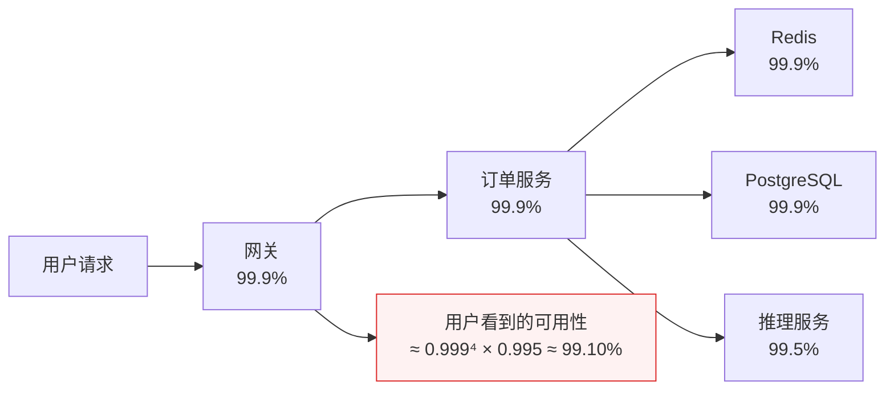
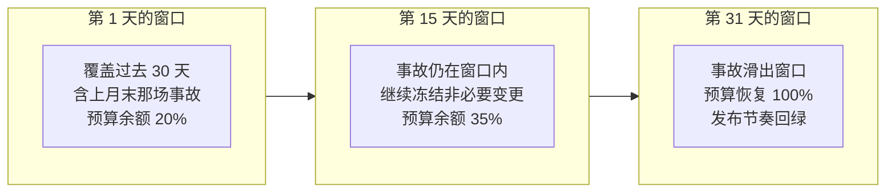
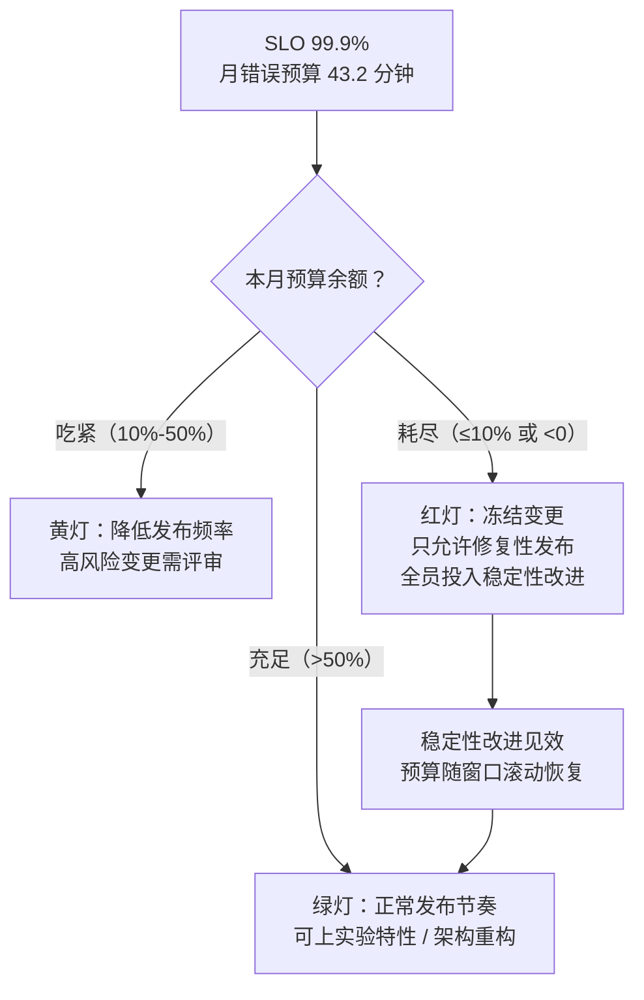

# 卷08-1：SRE 世界观与 SLO 体系——把"稳定性"变成可谈判的数字

> 导语：这是卷08「SRE 与可靠性工程」三子页的第 1 页，覆盖原卷 §1–§2（SRE 是什么、SLI/SLO/SLA、错误预算）。卷06 结束时 RetailHub 的平台拼图看似完整，但请回答一个问题：**如果明天上午十点推理服务挂了，谁会知道？多久能恢复？你能对业务方承诺"一年最多坏多久"吗？** 三个问题答不上来，系统就只是"能跑"，谈不上"可承诺"。本子页先讲清 SRE 是什么——Google 发明的、用软件工程消灭运维的方法论；再拿下全卷灵魂：用 SLI/SLO 与错误预算把"稳定性"从玄学变成可定量谈判的工程指标。Agent 的一切可靠性承诺都建立在底座之上——先学会给传统服务立承诺，才配给智能体立承诺。

---

## 1. SRE 是什么：用软件工程消灭运维

### 1.1 三类角色对比：运维、DevOps、SRE

| 维度 | 传统运维（Ops） | DevOps（理念/运动） | SRE（具体岗位与方法） |
|---|---|---|---|
| 核心目标 | 系统别挂，变更别动 | 开发与运维协作，交付更快 | 用工程手段同时获得速度与稳定 |
| 工作方式 | 手工操作、工单驱动 | 自动化流水线、文化融合 | 写代码消灭重复劳动（消除 toil） |
| 与开发的关系 | 部门墙两侧，互相甩锅 | "You build it, you run it" | 同一套工程标准，SRE 本身也是软件工程师 |
| 稳定性如何度量 | 凭感觉、"最近挺稳的" | 较少量化 | SLI/SLO/错误预算，全部量化 |
| 变更态度 | 能不变就不变 | 持续交付 | 用错误预算决定变更节奏 |
| 一句话 | 看机器的人 | 一种文化主张 | 一套可执行、可招聘、可考核的工程学科 |

可以这么理解三者的关系：**DevOps 提出了"开发运维应该一体"的愿景，SRE 是 Google 给出的具体实现**——Google SRE 有句名言："SRE is what happens when you ask a software engineer to design an operations team."（当你让软件工程师来设计运维团队时，得到的就是 SRE。）Google 副总裁 Ben Treynor 还有一句更技术味的表述："SRE 类实现了 DevOps 接口"（class SRE implements interface DevOps）——DevOps 是抽象理念，SRE 是它的一套具体方法集[^sre-book]。

### 1.2 Google SRE 的起源与组织形态

**起源**。2003 年，Google 的软件工程师 Ben Treynor 受命组建一个 7 人团队，负责生产系统的可用性。他的选择在当时是离经叛道的：不招系统管理员，而是让软件工程师干运维的活——结果这些人厌恶重复劳动到骨子里，凡是要做第二遍的手工操作就写成代码。这支团队后来长成上千人的 SRE 部门，扛住了 Google 搜索、Gmail 等顶级规模服务，2016 年 Google 把方法论公开成书，SRE 从此成为行业通用词[^sre-book]。这段历史对零基础读者有一个重要启示：**SRE 不是"运维岗位的改名"，而是用工程文化对运维岗位的重新发明**。

**SRE 团队的组建模式**。公司规模不同，SRE 的组织方式也不同，主要有四种[^sre-workbook]：

| 模式 | 做法 | 适合阶段 | 风险 |
|---|---|---|---|
| 嵌入式（Embedded） | SRE 直接编入业务开发团队，同甘共苦 | 单个核心服务、团队小 | SRE 被业务节奏同化，沦为"高级运维" |
| 参与式（Engaged） | 独立 SRE 团队，对服务做"成熟度评估"后才接管 | 多服务、有平台雏形 | 评估标准不清会变成权力寻租 |
| 咨询式（Consulting） | SRE 不接管服务，输出工具、评审与培训 | SRE 人力稀缺的早期 | 说了没人听，落不了地 |
| 中央平台式（Centralized） | SRE 建设统一平台（监控/发布/告警），服务自助接入 | 规模化阶段（如金山办公 KAE） | 平台脱离业务实际，变成新衙门 |

RetailHub 当前 6 人团队的现实选择是**咨询式 + 嵌入式混合**：不设专职 SRE 岗位，但指定一名"SRE 负责人"（可以是你），把本卷的方法论作为团队纪律推行。**方法论不挑团队规模，挑的是有没有人愿意为可靠性负责**。

**50% 工程时间规则的运作细节**。Google 给 SRE 定了一条硬规矩：琐事（toil）不能超过工作时间的 50%，其余时间必须用于工程改进[^sre-book]。这条规则的运作机制值得拆解开看：

1. **先认清什么是 toil**。Google 的定义有五个特征：手工的、重复性的、可自动化的、战术性的（而非长期价值）、随服务规模线性增长的。手工重启是 toil，写重启脚本不是；手工扩容是 toil，做自动扩缩容不是；给领导手工导周报是 toil，做自助看板不是。**判断标准：这件事做完之后，世界有没有变得更好一点？**
2. **超限怎么办**。如果一个 SRE 团队的 toil 持续超过 50%，Google 的做法是把部分工单**退回给开发团队**——让开发者亲自感受自己设计出来的系统有多难伺候，这比任何架构评审都更能激励"可运维性设计"。
3. **为什么必须是 50% 而不是"尽量"**。因为 toil 有自我繁殖能力：系统越大，手工活越多；手工活越多，越没时间写自动化；越没有自动化，手工活更多——这是死亡螺旋。50% 是一条用行政纪律强制保留的"研发再投资率"，和财务上的研发投入占比是同一个道理。

### 1.3 Google SRE 的核心命题

传统运维团队的规模随系统规模线性增长：机器多一倍，人就得加一倍——这在商业上不可持续。SRE 的破局点是把运维当软件工程问题来做：

1. **消除 toil（琐事）**：如上节所述，用 50% 规则强制保留工程时间，让"消灭重复劳动"永远有时间发生。
2. **拥抱风险，而不是消灭风险**：100% 可靠不是目标，也不是用户需要的（用户家里的 Wi-Fi 比你的服务更容易断）。目标是把可靠性定在"用户满意且成本可承受"的水平，然后把剩余的不可靠额度当成**预算**来花。
3. **用数据而非职位做决定**：发布能不能上、架构要不要改，拿 SLO 数据说话，不听嗓门最大的。

### 1.4 为什么架构师必须懂 SRE

你在卷05 学过"质量属性"：可用性是每个架构文档里都会写的词。但架构师写"系统可用性 99.9%"和 SRE 兑现"99.9%"之间隔着一整套工程体系——**架构图上的每一个冗余设计、每一个降级开关，最终都要靠 SLO、告警、值班、复盘这套机制才能真正生效**。反过来，不懂 SRE 的架构师会犯两类典型错误：过度设计（为一个没人承诺过的可用性堆三地五中心，烧钱）或设计缺位（架构里根本没有可观测性和降级的位置，上线后补都补不上）。架构决定可靠性的上限，SRE 决定可靠性的下限。

---

## 2. SLI/SLO/SLA 与错误预算：SRE 的灵魂

这是本卷最重要的一节，请慢读。

### 2.1 三个概念一张表

| 概念 | 全称 | 定义 | 例子（以 RetailHub 订单查询为例） | 性质 |
|---|---|---|---|---|
| SLI | Service Level Indicator，指标 | 对服务水平的**可测量**量化指标 | 28 天窗口内，延迟 < 300ms 且返回 2xx 的请求占比 | 测量值 |
| SLO | Service Level Objective，目标 | SLI 应该达到的内部目标 | SLI ≥ 99.9%（滚动 30 天） | 内部承诺 |
| SLA | Service Level Agreement，协议 | 与用户的合同，违约要赔钱/赔额度 | 可用性 ≥ 99.5%，未达标按合同赔付 | 商业合同 |

记住一句话：**SLI 是温度计，SLO 是你对自己承诺的体温红线，SLA 是你对别人签的合同红线**。工程上有一个重要纪律：**SLO 必须比 SLA 严格**，中间留出的缓冲带就是你的反应时间——等 SLA 破了才告警，赔偿金已经在路上了。

### 2.2 SLI 的选择方法：四族指标、口径之争与规格说明书

**选哪些 SLI？** 常用四族：

- **可用性（Availability）**：成功请求占比。注意分母怎么定义（健康探测请求算不算？），口径之争是 SLO 谈判的第一战场。
- **延迟（Latency）**：P95/P99 分位延迟，而不是平均值——平均延迟会掩盖长尾用户的地狱体验。注意成功请求与失败请求的延迟要分开统计：一个 500 错误 5ms 就返回了，混进平均值会让"延迟"看起来更健康。
- **新鲜度（Freshness）**：数据系统特有——用户看到的报表数据落后真实世界多久？RetailHub 的经营日报 T+1 还是 T+5 分钟，就是新鲜度 SLI。
- **正确性（Correctness）**：返回了 200 但算错了，比返回 500 更恶劣。对账单、库存这类数据，需要"对账一致率"这样的 SLI。

**四族指标怎么落地测量？** 每一族都要回答"数据从哪来"：

| SLI 族 | 测量位置（优先级从高到低） | RetailHub 落点 |
|---|---|---|
| 可用性 | 负载均衡/网关日志 > 服务端指标 > 客户端上报 > 探测脚本 | 网关的 access log 统计 2xx 占比 |
| 延迟 | 服务端直方图（histogram bucket） | `http_request_duration_seconds_bucket` |
| 新鲜度 | 数据时间戳与当前时间之差，周期性采样 | `time() - dashboard_data_timestamp` |
| 正确性 | 对账任务、双写比对、人工抽检 | 每日订单总额 vs 支付渠道对账单 |

为什么强调"测量位置"？因为**同一个 SLI 在不同位置测出来的值可能差出一个 9**：在服务端测可用性，测不到客户端到机房之间的网络故障；在网关测，测不到网关本身的故障。原则是**测量点尽量靠近用户**——用户的体验才是 SLI 的本体，服务端指标只是它最方便的代理。

**分母口径之争：SLO 谈判的第一战场**。看一个真实感很强的例子——订单查询可用性 SLI：

- 口径 A：`成功请求数 / 全部请求数`——分母含健康检查、含爬虫、含恶意扫描，数值天然虚高。
- 口径 B：`成功请求数 / 剔除健康检查与内部探测后的请求数`——更接近真实用户体验。
- 口径 C：`成功请求数 / 有效业务请求数（再剔除 4xx）`——客户端传错参数导致的 400 算不算服务不可用？业务方说不算，用户说我明明失败了。

三种口径没有绝对对错，但**选定后必须写进 SLO 文档并冻结**——否则每次事故复盘都会演变成口径扯皮。经验法则：分母取"用户视角的有效请求"，剔除机器流量，保留所有服务端责任范围内的失败（含 5xx、超时、限流 429）。

**SLI 规格说明书（SLI Specification）**。Google SRE 工作簿建议每个 SLI 写一份两栏规格[^sre-workbook]：

```markdown
## SLI：订单查询可用性
### 规格（Specification）——用户视角的定义
请求返回 2xx 且 P95 延迟 < 300ms 的占比，用户视角"能用"的标准。
### 实现（Implementation）——工程视角的测量
数据源：网关 access log（filebeat → ES）
分子：status=~"2.." 且 upstream_response_time < 0.3 的条数
分母：剔除 /healthz、/metrics 与内网探测 IP 后的总条数
窗口：28 天滚动，每小时聚合一次
已知偏差：不含网关自身故障期间（网关挂了 log 也没了），
         该时段按不可用计入（保守处理）
```

**先写规格再写实现**——规格回答"用户的什么体验"，实现回答"我们怎么近似测量它"。两者之间的差距（已知偏差）必须显式承认，否则你会把"指标好看"误认为"用户满意"。

### 2.3 SLO 制定方法：从用户出发，不从能力出发

错误的制定顺序：先测出系统现在能跑 99.95%，然后把 SLO 定为 99.9%——这叫"向后看"，定出来的 SLO 既不保护用户也不约束自己。正确的顺序是：

1. **找出用户旅程**：RetailHub 用户的核心旅程是"打开经营看板 → 看昨日数据 → 下钻异常门店"。SLO 只保这条旅程上的服务，不为边缘功能立军令状。
2. **问用户能容忍什么**：内部工具用户容忍度低吗？未必——经营看板早上 9 点开会用，夜里挂了没人关心。这直接影响你的值班策略和维护窗口。
3. **选一个"用户开始抱怨但还没流失"的点**：SLO 定得太松，用户流失了你还"达标"；定得太紧，你为最后一个 9 付出十倍成本（见下表）。99.9% 是很多 B 端内部系统的甜蜜点。
4. **写下来，让所有相关方签字**：SLO 是一份"工程部与业务部的停火协议"，没签字的 SLO 在第一次事故后就会被撕毁。

**可用性档位换算表（必背）**：

| SLO 等级 | 每年允许不可用 | 每月允许（30 天月） | 每天允许 | 形象理解 | 典型成本 |
|---|---|---|---|---|---|
| 99%（两个 9） | 3.65 天 | 7.2 小时 | 14.4 分钟 | 每周可以坏一次大的 | 单机房 + 基本监控即可 |
| 99.5% | 1.83 天 | 3.6 小时 | 7.2 分钟 | 每月一次中事故 | 单机房 + 快速恢复预案 |
| 99.9%（三个 9） | 8.76 小时 | 43.2 分钟 | 1.44 分钟 | 一个月只允许一次中等事故 | 需要冗余 + 自动故障转移 |
| 99.95% | 4.38 小时 | 21.6 分钟 | 43 秒 | 事故要半自动恢复 | 冗余 + 自动切换 + 严格变更管控 |
| 99.99%（四个 9） | 52.6 分钟 | 4.32 分钟 | 8.6 秒 | 事故必须在人工反应前自愈 | 多活架构、秒级切换，成本陡增 |

记忆口诀：**"9 的个数翻一倍，允许的停机时间除以十"**——99% 是每月 7.2 小时，99.9% 是 43.2 分钟，99.99% 是 4.32 分钟。最后这个 9 的代价不是线性而是指数——从三个 9 到四个 9，往往意味着从"单机房 + 快速恢复"跳到"多机房双活"的架构代际变化。**这是架构决策，不是运维目标**，必须在卷05 那种正式架构评审里过。

### 2.4 SLO 数学：串联、并联与滚动窗口

> **数学铺垫（小学数学就够，30 秒读完）**：这一节只用到两个知识点。第一是**乘法原理**：一件事的成功率是 99.9%，两件互不相干的事"都成功"的概率就是 0.999 × 0.999——因为第二件事只能在第一件事成功的那 99.9% 里再挑 99.9%。第二是**倒着想**：一个副本坏掉的概率是 1 − 0.999 = 0.001，两个备份"同时都坏"才算真坏，那就是 0.001 × 0.001。所谓"n 次方"只是把同一个数连乘 n 遍，0.999⁵ 就是 5 个 0.999 相乘。掌握这两句，下面的公式全是它们的直接应用——本节你只需要会"连乘"和"用 1 去减"，不需要任何新数学。

**串联可用性：0.999 的 n 次方**。用户的每一次请求都不是只经过一个服务，而是穿过一条链。以 RetailHub 智能看板为例：网关 → 订单服务 → Redis → PostgreSQL → 推理服务，五环串联。假设每个环节各自可用性都是 99.9%，且故障相互独立，那么整条链的可用性是：

```
链路可用性 = 0.999 × 0.999 × 0.999 × 0.999 × 0.999 = 0.999⁵ ≈ 99.50%
```

每个环节单独看都达标"三个 9"，用户看到的却是 99.5%——月停机从 43.2 分钟变成 3.6 小时。**串联系统的可用性上限由最薄弱的一环决定，且每增加一环就再乘一次**。这就是为什么微服务拆得越细，每个服务的 SLO 必须定得越高：10 个 99.9% 的微服务串成的链路只有 99%，用户不管你内部怎么分工。



**并联可用性：冗余为什么能救命**。同一个环节部署两个独立副本（任何一个是活的就能服务），可用性变成：

```
并联可用性 = 1 − (1 − a)²
两个 99.9% 并联 = 1 − 0.001² = 99.9999%（六个 9）
```

两个"三个 9"的平庸副本，并联后接近"六个 9"——**冗余是用便宜硬件换高可用的数学杠杆**。但注意前提"独立"：如果两个副本跑在同一台宿主机、共用同一个数据库、由同一次发布同时更新，那它们的故障不是独立的，(1−a)² 的公式就失效——这就是第 6 节两地三中心要解决的"相关性故障"问题。

**错误预算的滚动窗口计算**。SLO 按"滚动 30 天"统计，意思是：任意时刻往回看 30 天的 SLI。这带来两个实操后果：

1. **预算会自己恢复**。30 天前的那场大事故，今天会从窗口里"滑出去"，预算余额自动回升——不需要任何人特赦。
2. **月初清零是反模式**。如果按自然月统计，月初预算满额时大家疯狂变更、月末预算见底时什么都不敢动——人为制造了节奏抖动。滚动窗口让预算水位连续变化，决策更平滑。



先用交互 Demo 亲手感受串联衰减：默认拓扑就是 RetailHub 下单链路，拖动任一环节的可用性档位、或给它勾选"双活并联"，盯着"链路总可用性"和"最薄弱一环"怎么变：

```demo serial-availability
```

**Demo 导学单**（建议按顺序观察）：

1. 保持默认五环节不动，记下"链路总可用性"——对照上文 0.999ⁿ 的口算，验证 demo 的连乘结果。
2. 把"推理服务"从 99.5% 拉到 99.9%，观察总可用性提升了多少；再改回去，改为给它勾选"双活并联"，对比两种修法谁的收益大、成本是什么。
3. 把所有环节都设成 99.99%，看总可用性能否达到 99.9%——理解"下游服务数 × 故障率"这道紧箍咒。
4. 连续点"＋ 增加环节"加到 8 个，观察每加一环总可用性的衰减幅度，解释为什么微服务拆分要克制。
5. 找到让链路恰好回到 99.9% 的最省方案（提示：只治理短板），写下你的组合。

---

## 参考与脚注

[^sre-book]: Betsy Beyer 等，《Site Reliability Engineering: How Google Runs Production Systems》（O'Reilly, 2016），Google 官方在线公开版：https://sre.google/sre-book/table-of-contents 。本卷引及：第 1 章（SRE 起源与定义）、第 3 章（拥抱风险）、第 4 章（SLO）、第 5 章（消除 toil 与 50% 规则）、第 6 章（监控与四个黄金信号）、第 13–14 章（事故响应与角色分工）、第 15 章（postmortem 文化）。
[^sre-workbook]: Betsy Beyer 等，《The Site Reliability Workbook》（O'Reilly, 2018），在线公开版：https://sre.google/workbook/table-of-contents/ 。本卷引及：第 2 章（SLO 工程与 SLI 规格/实现两栏写法）、第 5 章（Alerting on SLOs：多窗口多燃烧率告警，14.4/6/3/1 配置表）、第 5–7 章（SRE 团队组建模式）。

---

➡️ 下一页：[卷08-2 · 监控告警与事故管理](卷08-2-监控告警与事故管理.md)（监控与告警：观测是数据，告警是决策；事故管理：值班、应急与复盘）

### 2.5 错误预算：把可靠性变成可花费的资源

这是 SRE 方法论里最精妙的发明。逻辑链条是：

1. SLO 定了 99.9%，意味着每月有 43.2 分钟的"合法不可靠额度"——这就是**错误预算（Error Budget）**。
2. 预算没花完，说明可靠性有余量：**可以用来冒险**——加快发布频率、上线实验性功能、做架构重构。研发团队拿到了数据支撑的"冒险许可证"。
3. 预算花完了，说明系统在裸奔：**冻结非必要变更**，全员优先做稳定性改进（修 bug、补冗余、写演练），直到预算恢复。

于是"开发想快、运维想稳"这个千古死结被解开了：**双方不再吵架，而是共同管理同一个账户**。快与稳不再是价值观之争，而是会计问题。



在真机上配置这套机制之前，先用下面的交互 Demo 建立直觉：设定 SLO 档位，往 30 天时间线里注入事故（自己指定持续时长与影响面，或让随机模拟替你"倒霉"），盯着错误预算条被一点点吃掉——特别注意预算耗尽时"冻结变更"是如何改变发布次数的，再切到"无预算约束"对照组，看看没有预算纪律的团队会用发布次数付出什么隐性代价：

```demo error-budget
```

**Demo 导学单**（建议按顺序观察）：

1. 先把 SLO 切到 99.99%，什么都不要做——只看"月度错误预算"变成约 4.3 分钟，理解为什么四个 9 几乎不允许人工反应。
2. 切回 99.9%，注入一次"60 分钟 × 100% 影响面"的事故，观察预算条一次性透支——这相当于一次大促故障的量级。
3. 点"随机模拟 30 天"三次，比较三次的发布冻结次数差异——体会"同样的事故率，落在窗口不同位置，对发布节奏的影响完全不同"。
4. 勾选"无预算约束（对照）"再模拟一次：发布次数上去了，但注意结论区说的隐性代价是什么。
5. 找到"预算恰好不耗尽"的最大事故组合（几次、各多长），写下它对 RetailHub 大促预案的启示。

