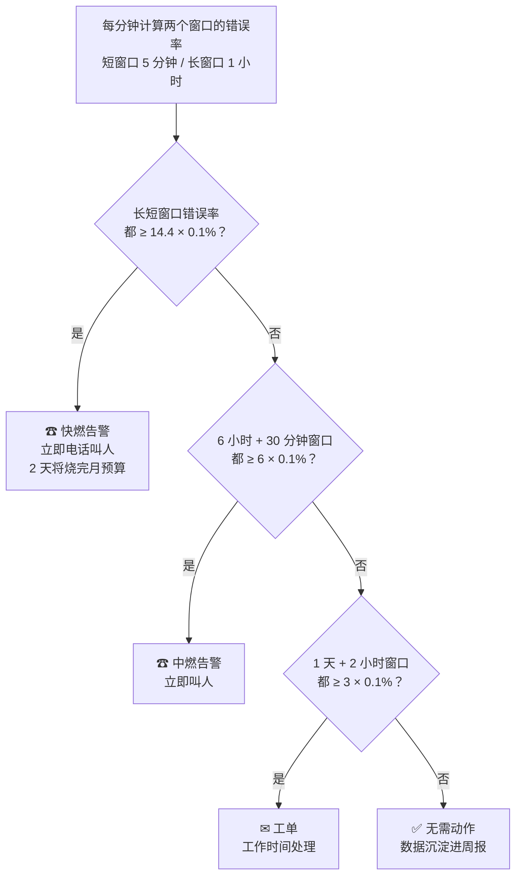
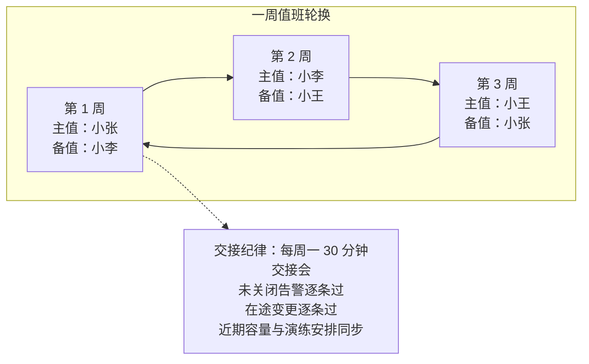
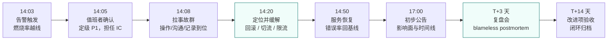
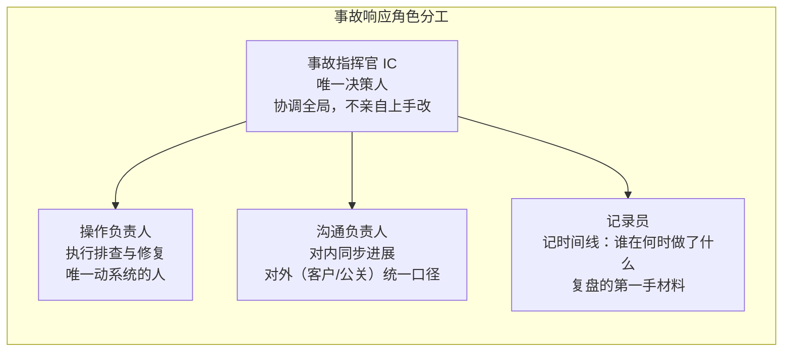

# 卷08-2：监控告警与事故管理——观测是数据，告警是决策

> 导语：这是卷08「SRE 与可靠性工程」三子页的第 2 页，覆盖原卷 §3–§4，承接卷08-1 的 SLO 与错误预算体系。SLO 定了目标，接下来是两个工程问题：什么情况下把熟睡中的人叫起来（告警），以及人被叫醒之后怎么办（事故管理）。本子页前半讲监控告警——四个黄金信号、症状告警原则、燃烧率告警的数学；后半讲事故管理全周期——值班、分级、应急指挥与不追责复盘。主线只有一句话：观测是数据，告警是决策，复盘是学习。

---

## 3. 监控与告警：观测是数据，告警是决策

### 3.1 四个黄金信号

卷04 讲过可观测性三支柱（Metrics/Logs/Traces），那是"数据怎么采"。告警要解决的是另一个问题：**什么情况下把熟睡中的人叫起来**。Google SRE 给出四个黄金信号，覆盖绝大多数服务[^sre-book]：

| 信号 | 定义 | 采集要点 | RetailHub 例子 |
|---|---|---|---|
| 延迟（Latency） | 请求耗时 | 成功与失败**分开统计**——失败 5ms 返回会污染平均值；用分位数（P95/P99）不用均值 | 订单查询 P99、推理请求 TTFT |
| 流量（Traffic） | 系统承载的需求强度 | 按系统类型选单位：HTTP 用 QPS，消息系统用条/s，AI 服务用 tokens/s | QPS、并发会话数、推理 tokens/s |
| 错误（Errors） | 失败请求的比例 | 显式失败（5xx）+ 隐式失败（200 但内容错误）+ 策略失败（超时熔断兜底） | 5xx 率、推理超时率、对账失败数 |
| 饱和度（Saturation） | 资源距离极限还有多远 | 测"水位"而非"用量"：连接池用了 80% 比 CPU 用了 80% 更接近悬崖 | CPU/内存/磁盘、GPU 显存占用、连接池水位、推理排队深度 |

四个信号中**饱和度最容易被忽视也最有预测价值**：延迟和错误是"已经出事"，饱和度是"快要出事"。一个成熟的看板应该让值班者一眼看到"距离悬崖还有多远"，而不只是"现在有没有掉下去"。

### 3.2 RED 与 USE：两套落地口诀

四个黄金信号是原则，落地时社区总结出两套更好记的口诀，分别对应"服务视角"和"资源视角"：

**RED 方法（面向请求驱动的服务）**——每个微服务至少监控三个指标：

- **R**ate（速率）：每秒请求数，即流量；
- **E**rrors（错误）：每秒失败请求数或错误率；
- **D**uration（时长）：请求延迟分布。

RetailHub 的订单、库存、报表三个服务，每个都该有一张三指标小卡。**RED 回答的是"用户正在经历什么"**。

**USE 方法（面向资源）**——每种硬件/软件资源至少监控三个指标：

- **U**tilization（利用率）：资源忙于工作的时间比例（CPU 60%、GPU 显存占用 78%）；
- **S**aturation（饱和度）：排队等待的程度（CPU load 超过核数、推理排队深度、连接池等待线程数）；
- **E**rrors（错误）：资源级错误计数（磁盘 IO 错误、OOM Kill、GPU ECC 错误）。

**USE 回答的是"系统内部哪里快撑不住了"**。两套方法互为表里：RED 发现症状，USE 定位病根。告警用 RED（症状），排查用 USE（原因）——这正是 3.4 节"症状告警 vs 原因告警"的落地分工。

### 3.3 指标基数爆炸：监控系统自己的可靠性问题

一个新手常踩的坑：给指标随意加标签（label），结果监控系统先被自己压垮。原理是**时间序列的数量 = 指标数 × 各标签取值的笛卡尔积**：

```
http_requests_total{service, code, path, tenant_id}
= 3 个服务 × 6 种状态码 × 200 条路径 × 500 个租户
= 1,800,000 条活跃时间序列
```

每条序列都要占内存、定期落盘，百万级序列足以让 Prometheus 内存爆掉、查询变慢——**你用来观测系统的系统，成了新的故障源**。治理原则三条：

1. **高基数字段永远不进 label**：`tenant_id`、`user_id`、`order_id`、完整 URL，这类取值成千上万的信息属于日志和 Trace，不属于指标。
2. **label 只放枚举型低基数维度**：服务名、状态码族（`2xx/4xx/5xx` 而非具体码）、环境、版本。
3. **需要按租户看时走聚合**：按租户分析用日志/数仓离线算，指标只保留"top N 租户"这种有界维度。

记住一个类比：**指标是体温计，日志是病历，Trace 是 CT**——你不会把整本病历写进体温计。

### 3.4 症状告警 vs 原因告警

这是告警设计的第一原则：**告警只报症状，不报原因**。

- ❌ 原因告警："订单服务的 JVM Old GC 超过 2 秒"——也许根本没人受影响。
- ✅ 症状告警："订单查询错误率过去 5 分钟 > 2%（SLO 消耗速度超标）"——用户正在受害，必须有人起来。

原因信息去哪？进看板和诊断面板，作为人被叫醒后的排查线索。**判断标准只有一条：这个告警如果凌晨三点响起，接电话的人需要立刻做什么？** 如果答案是"看一眼，没事，继续睡"，它就不该是告警。

为什么这条原则如此重要？算一笔账：一个 50 个服务的系统，每个服务 10 个资源指标，如果按原因告警，理论上有 500 条规则会响；但其中真正"用户正在受害"的时刻可能一年只有几十次。**原因告警把"罕见的重要信号"稀释在"常见的无关噪音"里**，结局一定是告警疲劳（3.6 节）。症状告警天然收敛——用户的症状就那么几种：慢了、错了、没了。

### 3.5 燃烧率告警：多窗口多燃烧率的数学

> **数学铺垫（比例换算，小学六年级水平）**：这一节只用到一个动作——**用除法比较快慢**。想知道"钱花得快不快"，就拿"现在花钱的速度"除以"允许花钱的速度"：一个月允许错 0.1%，现在正以 0.1% 的速度错，0.1% ÷ 0.1% = 1，意思是"照此速度恰好一个月花完"；如果商是 14.4，就是"花快了 14.4 倍"，30 天 ÷ 14.4 ≈ 2 天就花完。先给一个数值样例：SLO 99.9% 允许 0.1% 错误，实测错误率 1.44%，商 = 1.44% ÷ 0.1% = 14.4，对应 2 天烧光整月预算——下面那张四档告警表，全是这个例子的变形。所以"燃烧率"不是新概念，只是"实际速度 ÷ 预算速度"这个商；所有告警阈值，都是先定"几天烧完该叫人"，再倒推出商该是多少。

症状告警解决了"报什么"，下一个问题是"**阈值定多少**"。拍脑袋定"错误率 >2% 告警"有两个无解的矛盾：

- 阈值低了：夜间低流量时，3 个请求里 1 个失败就是 33% 错误率，电话把人叫醒，其实是某个用户手滑——**误报**；
- 阈值高了：错误率 0.5% 的慢性泄漏持续半个月，从不告警，月底一算 SLO 已经破了——**漏报**。

Google SRE 工作簿给出的答案是**基于燃烧率（burn rate）的告警**[^sre-workbook]。先定义：

```
燃烧率 = 当前错误率 ÷ SLO 允许的错误率
```

SLO 99.9% 允许 0.1% 错误率。如果系统长期以 0.1% 出错的速率运行（燃烧率 = 1），30 天恰好烧完整月预算；燃烧率 = 14.4 意味着按这个速度 **2 天烧完 30 天的预算**；燃烧率 = 6 意味着 5 天烧完。

于是告警逻辑从"错误率绝对值"变成"**烧钱速度**"：烧得快，立刻叫人；烧得慢但持续，进工单；烧得极其缓慢，每日巡检看一眼。Google 推荐的多窗口配置（针对 99.9% SLO，其他档位同比缩放）[^sre-workbook]：

| 档位 | 燃烧率 | 烧完月预算时间 | 长窗口 | 短窗口 | 动作 |
|---|---|---|---|---|---|
| 快燃 | 14.4× | 2 天 | 1 小时 | 5 分钟 | ☎ 立即叫人 |
| 中燃 | 6× | 5 天 | 6 小时 | 30 分钟 | ☎ 立即叫人 |
| 慢燃 | 3× | 10 天 | 1 天 | 2 小时 | ✉ 工单跟进 |
| 阴燃 | 1× | 30 天 | 3 天 | 6 小时 | ✉ 每日巡检 |

**为什么要长短双窗口？** 只看长窗口：故障已经烧了 50 分钟，1 小时窗口的平均值还没过线，告警迟到；只看短窗口：一个 5 分钟的毛刺就把人叫醒，而且故障恢复后短窗口立刻回落、告警立刻复位，值班者被"告警-复位-告警-复位"反复横跳折磨。**长窗口保证"这不是毛刺"（降低误报），短窗口保证"检出快、复位快"（降低漏报）**——两个条件取"与"，兼得两者。



数学上还有一个值得知道的细节：14.4 这个数不是拍脑袋，而是从"**误报率与检出时间的权衡**"反推出来的——1 小时窗口消耗 2% 月预算（30 天 × 2% ÷ 60 分钟 ≈ 14.4 倍燃烧率），是在"足够快到值得叫人"和"足够大到不可能是抖动"之间找到的平衡点。

用下面的模拟器亲手验证这套机制：设定 SLO 和背景错误率，注入一段"错误脉冲"（比如模拟一次发布事故：错误率 2%、持续 1 小时），看四档告警各自会不会响、多久之后响：

```demo burn-rate-alert
```

**Demo 导学单**（建议按顺序观察）：

1. 用默认参数（99.9% SLO、2% 错误率 × 60 分钟）跑一次，记录快燃档的"检出延迟"——理解为什么不是故障一发生就告警。
2. 把持续时长缩到 10 分钟再跑：观察哪些档不响了，解释长短双窗口如何避免"毛刺叫人"。
3. 把峰值错误率降到 0.15%（燃烧率 ≈1.5）、持续时长拉满 720 分钟：观察只有"慢燃/阴燃"档触发——体会慢性泄漏为什么必须靠慢档抓。
4. 把背景错误率调到 0.1%（恰好 = 允许错误率）：什么都不注入，想想这个系统 30 天后预算剩多少。
5. 切到 99.99% SLO 再跑默认脉冲：注意各档阈值同比收紧，理解"SLO 越高，告警越敏感"。

### 3.6 告警疲劳治理

告警疲劳是可靠的隐形杀手：收件箱里每天 200 条告警，第 201 条真正致命的就被淹没了——人对告警的注意力是有限资源，和 GPU 显存一样需要精打细算。治理三板斧：

1. **每条告警必须可行动**：不能触发动作的告警降级为看板指标或周报项。接到告警后的动作只有三类：立即修复、立即缓解（回滚/切流/扩容）、立即升级（摇更懂的人）——如果一条告警三者都不沾，它不配叫醒任何人。
2. **定期审阅告警记录**：每月回顾，把"响了但没人处理、处理了但没必要"的告警删掉或调阈值。告警规则也要有生命周期。一个量化参考：**健康的值班周期内，page 级告警每周不应超过 2-3 次**——超过这个频率，值班者会学会忽略告警，这是组织的失败而不是个人的失职。
3. **告警收敛与聚合**：一个数据库挂了引发 50 个服务告警，应该收敛成一条"数据库 X 不可用，影响 50 个服务"，而不是 50 通电话。实现手段：告警分组（同根因合并）、抑制（上游告警期间屏蔽下游）、静默（维护窗口期提前声明）。

### 3.7 与卷04 可观测性的关系

一句话：**观测是数据，告警是决策**。卷04 的三支柱解决"系统内部状态如何被看见"，本节的黄金信号与预算告警解决"看见之后何时行动"。没有观测的告警是瞎叫，没有告警的观测是自言自语——两者在 SLO 上交汇：SLO 既是告警阈值的来源，也是看板组织的中心。

---

## 4. 事故管理：值班、应急与复盘

### 4.1 值班（Oncall）：可靠性的最后一道人肉防线

自动化能处理已知问题，值班处理的是未知问题。健康的值班制度有几个硬指标：

- **轮换周期**：单人连续值班不超过一周——连续高压下判断力会显著下降，第 7 天的值班者和第 1 天不是同一个人。常见形态是"主备双人、按周轮换"（见下图）。
- **人数红线**：值班组少于 3 人就是高风险（一人请假另一人就连轴转）；Google 的经验是一个值班组 6-8 人，每人每周至多一次 oncall[^sre-book]。
- **告警预算**：单次值班期 page 告警 ≤2-3 次（见 3.6），超过就该治理告警或修系统，而不是换人硬扛。
- **补偿机制**：告警风暴后有补休、值班津贴真实发放。
- **授权**：最重要的一条——**值班者有权叫停发布、有权拉任何人进群，事后不被追责**。



**主备双人是关键设计**：主值被叫醒后 15 分钟无响应，告警自动升级到备值；重大事故主值一个人忙不过来时，备值是第一援军。RetailHub 只有 6 个人，可以全员轮值主备——这也倒逼每个人都必须懂全链路，值班制度顺便解决了"知识只在一个人脑子里"的单点问题。

### 4.2 事故分级与升级机制

不是所有事故都值得全公司跳起来。没有分级的事故响应有两个极端结局：小事故动用十个人，大事故却只有值班者孤军奋战。一个务实的四级标准：

| 级别 | 定义（满足其一） | 响应要求 | RetailHub 示例 |
|---|---|---|---|
| P0 | 核心链路完全不可用；数据丢失或泄露；资损 | 全员响应，15 分钟内 IC 到位，每 30 分钟对外同步 | 下单接口全量 500；租户数据串库 |
| P1 | 核心链路严重劣化或部分不可用；错误预算小时级燃烧 | 值班者 + 备值响应，1 小时内 IC 到位 | 订单查询错误率 30%；推理服务全挂 |
| P2 | 非核心功能不可用；核心功能降级可用 | 值班者处理，工作时间内响应 | 报表生成延迟但可查历史；看板退回静态数据 |
| P3 | 体验瑕疵，无功能损失 | 进 backlog，随迭代修复 | 某图表加载慢 2 秒；文案错误 |

**升级机制（Escalation）解决的是"叫醒链"**：告警 → 主值（15 分钟无响应）→ 备值（15 分钟无响应）→ SRE 负责人 → 技术负责人。每一级的超时时间和联系方式必须提前写成 runbook，**升级不是告状，是制度设计**——值班者发现超出自己能力时立刻升级是专业行为，硬扛两小时不吭声才是失职。

事故的完整生命周期与角色配合，用一条时间线看更清楚：



注意这条时间线的两个纪律：**从告警到缓解以分钟计**（先恢复），**从恢复到复盘以天计**（后查因）。复盘要趁热（记忆新鲜、日志未过期）但不必当夜（疲惫的团队写不出好复盘）。

### 4.3 应急指挥：混乱中建立秩序

事故现场的敌人不是故障本身，而是混乱：五个人同时改五处、没人记时间线、领导在群里不停问"好了没"。业界成熟做法是明确的角色分工[^sre-book]：



三个人也能跑：IC 兼记录，一人操作，一人沟通。**角色比人数重要**——哪怕只有两个人，明确"谁指挥、谁动手"也能避免互相踩踏。另一个关键纪律：**先恢复，后查因**。能重启恢复就先重启，能回滚就先回滚，根因分析留给复盘——MTTR（平均恢复时间）比"根因报告多漂亮"重要得多。

补充一个反直觉的点：**IC 不亲自上手改系统**。原因有两个：一是动手的人视野会缩窄到眼前的终端，失去全局判断；二是权力与操作分离形成天然复核——"IC 决定回滚、OPS 执行回滚"意味着每个动作都过了两个人的脑子，慌乱中的错误率直接减半。

### 4.4 Blameless Postmortem：不追责复盘

事故复盘是可靠性工程最重要的学习机制，而其文化基石是 **blameless（不追责）**：假设每个人在当时的信息和压力下都做出了他认知内的合理决策，事故的责任在系统（流程、工具、架构）而不在个人[^sre-book]。

**为什么 blameless 不是"和稀泥"而是硬工程？** 两个机制层面的原因：

1. **追责的第一个代价是信息断流**。如果"报事故会被处分"，团队的理性选择是瞒报小事故——而小事故恰恰是大事故的彩排。Etsy、Google 等公司公开过同一组经验：blameless 文化推行后，上报的事故数量**上升**了，但严重事故数量**下降**了——因为小问题在萌芽期就被摊开解决了。
2. **追责的第二个代价是学到错误的教训**。"小张手滑了"这个结论不产生任何工程改进；真正的问法是"为什么系统允许一次手滑造成全站故障？为什么手滑没有被防护机制拦住？"——**人的错误是免费的压力测试，系统的缺陷才是复盘的猎物**。

blameless 不等于无责（accountability）：责任从"你搞砸的"变成"你负责把改进项落地"。不惩罚引发事故的人，但要追踪改进项的负责人到闭环。

**时间线的写法细则**。时间线是复盘文档的心脏，三条纪律：

- **全部用同一时区、精确到分钟**，以告警/日志时间戳为准，不靠回忆；
- **只记事实不记判断**："14:20 决定回滚"是事实，"14:20 英明决定回滚"不是；
- **记失败的尝试**："14:12 尝试重启无效"和最终成功的操作同样重要——它防止下一个复盘者重走弯路。

**行动项的跟踪纪律**。每条改进项必须有：明确负责人（一个人，不是一个组）、截止日期、可验证的完成标准（"上线 X 告警"而非"加强监控"）、以及在两周后的复查会议上过一遍状态。**复盘的价值 = 改进项的闭环率**，会议室里的顿悟不值钱。

一份合格的复盘文档模板：

```markdown
# 事故复盘：YYYY-MM-DD <一句话标题，如"订单服务因缓存穿透不可用 47 分钟">

## 1. 影响面
- 时间段：14:03–14:50（47 分钟）
- 影响：订单查询接口错误率峰值 38%，约 1200 次请求失败；无数据丢失
- 错误预算消耗：本月预算 43.2 分钟，本次消耗 28.5 分钟（66%）

## 2. 时间线（全部用 UTC+8，精确到分钟）
- 14:03 告警触发：订单查询错误率 >2%
- 14:05 值班工程师确认，定级 P1，启动事故响应，担任 IC
- 14:12 定位为缓存命中率骤降（热 key 失效）
- 14:20 决定：开启兜底直连数据库 + 限流保护
- 14:50 错误率恢复 <0.1%，事故关闭

## 3. 根因分析（5 Whys）
- 为什么错误率高？缓存命中率从 99% 跌到 12%
- 为什么命中率跌？一个热 key（top100 商品列表）过期
- 为什么过期会打穿？该 key 重建需全表扫描 30s，并发请求同时打到 DB（缓存击穿）
- 为什么没有保护？未对该 key 使用互斥重建/逻辑过期（卷02 讲过的手段，未落实）
- 为什么没落实？上线检查清单中没有"热 key 防护"一项 ← 真正的根因

## 4. 改进项（每条有负责人与截止日期）
| # | 改进项 | 类型 | 负责人 | 截止 |
|---|---|---|---|---|
| 1 | top100 key 改为逻辑过期 + 单飞重建 | 代码 | 张三 | 本周五 |
| 2 | 上线检查清单增加"热 key 防护"项 | 流程 | 李四 | 下周三 |
| 3 | 增加缓存命中率 <80% 的预警（症状前置） | 监控 | 王五 | 下周三 |

## 5. 经验与教训（至少一条"下次怎么更快恢复"）
```

复盘的终点不是文档，而是**改进项进入 backlog 并被追踪完成**——复盘会议开完两周后，如果改进项一条没动，这次事故就白疼了。

---

## 参考与脚注

[^sre-book]: Betsy Beyer 等，《Site Reliability Engineering: How Google Runs Production Systems》（O'Reilly, 2016），Google 官方在线公开版：https://sre.google/sre-book/table-of-contents 。本卷引及：第 1 章（SRE 起源与定义）、第 3 章（拥抱风险）、第 4 章（SLO）、第 5 章（消除 toil 与 50% 规则）、第 6 章（监控与四个黄金信号）、第 13–14 章（事故响应与角色分工）、第 15 章（postmortem 文化）。
[^sre-workbook]: Betsy Beyer 等，《The Site Reliability Workbook》（O'Reilly, 2018），在线公开版：https://sre.google/workbook/table-of-contents/ 。本卷引及：第 2 章（SLO 工程与 SLI 规格/实现两栏写法）、第 5 章（Alerting on SLOs：多窗口多燃烧率告警，14.4/6/3/1 配置表）、第 5–7 章（SRE 团队组建模式）。

---

➡️ 下一页：卷08-3-发布工程与AI服务SRE.md（发布工程、容量规划与混沌工程；金山办公案例；AI 服务的 SRE 特殊性；本卷实战）
