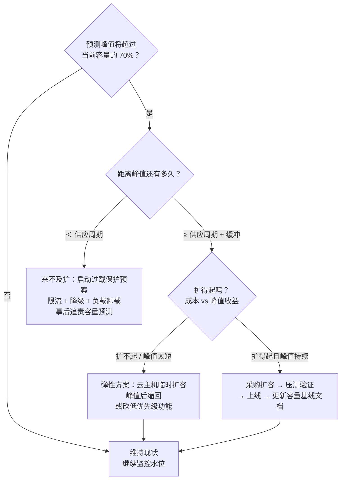
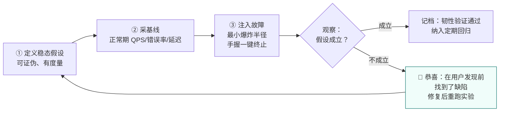
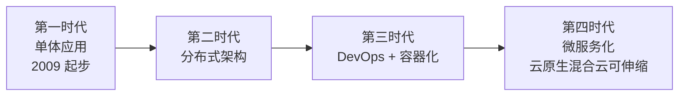
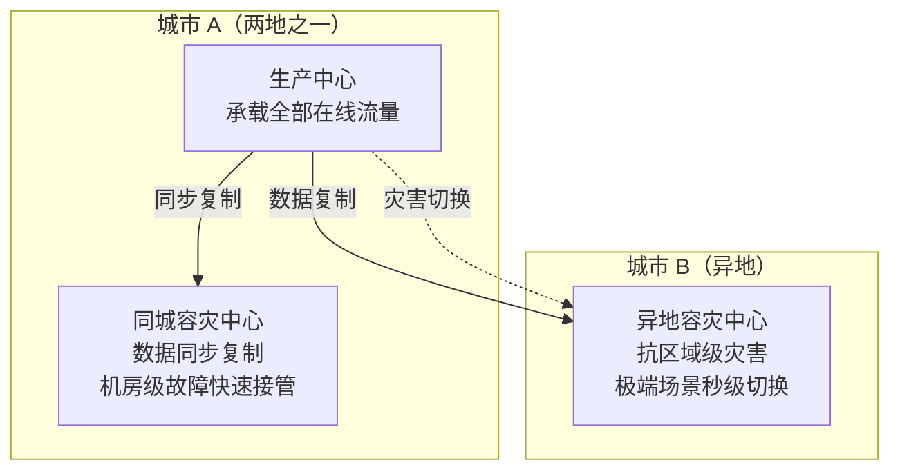

# 卷08-3：发布工程与 AI 服务 SRE——从容量、混沌到金山办公的工业级样板

> 导语：这是卷08「SRE 与可靠性工程」三子页的第 3 页（收官页），覆盖原卷 §5–§8，承接卷08-2 的告警与事故体系。前面学会了"坏了怎么办"，这一页讲"怎么少坏"：发布工程控制爆炸半径、容量规划提前备货、混沌工程主动"纵火"检验消防。随后看一个本土工业级样板——金山办公如何用 KAE 管理 13600+ 微服务、用两地三中心站上四个 9；再补上 AI 服务特有的四个 SRE 新变量（GPU 容量、TTFT/TPOT、质量 SLI、成本约束）。最后是本卷实战：为 RetailHub 立下第一份可靠性承诺，并附常见误区与全卷自测清单。

---

## 5. 发布工程、容量规划与混沌工程

### 5.1 三种主流发布策略

线上变更是故障的最大来源（多数组织 60% 以上的事故由变更引发），发布工程的本质是**控制爆炸半径**：

| 策略 | 做法 | 优点 | 代价 | 适用 |
|---|---|---|---|---|
| 金丝雀发布 | 新版本先给 1% 流量/1 个节点，指标正常再逐步放大 | 爆炸半径最小，真实流量验证 | 需要完善的分流与指标对比基建 | 高频发布的核心服务 |
| 蓝绿发布 | 备一套完整环境（绿），切换流量瞬间完成 | 回滚极快（切回去即可） | 双倍资源成本；有状态服务难处理 | 低频大版本、基础设施升级 |
| 滚动回滚 | 分批替换实例，异常时停止并反向替换 | 资源成本低，K8s 原生支持 | 回滚慢；中间态新旧版本共存 | 无状态服务的常规发布 |

共同的前置条件是**自动化回滚**：回滚必须比发布更容易、更快——能在 3 分钟内回滚的团队才敢每天发布。阶段九的篇09（评测与受控进化）会把这套思想延伸到 Agent 领域：模型版本、Prompt 版本、Skill 版本的"受控发布"，机制上与本节同源，只是多了"质量评测"这一道门禁。

### 5.2 压测与容量规划

容量规划回答"大促前要不要加机器、加几台"。方法链分四步：

**第一步：负载测试找拐点**。用压测（load test）对单实例逐步加压，找到性能曲线的拐点（吞吐停止增长、P99 陡升处）——卷06 的 TTFT/TPOT 容量曲线就是 AI 版压测。负载测试有三个层次，别混用：

| 类型 | 目的 | 压到什么位置 | 类比 |
|---|---|---|---|
| 容量测试 | 找单实例拐点，定安全水位 | 压到拐点，记录拐前值 | 给桥梁标限重 |
| 压力测试 | 看过载时的行为（是否优雅降级） | 压到拐点后，直到挂 | 超载测试桥会不会垮 |
| 浸泡测试 | 找慢泄漏（内存、句柄、磁盘） | 安全水位下跑数小时-数天 | 长期满载试车 |

**第二步：估算峰值需求**。历史流量 × 业务增长预测 × 活动系数（大促通常 3-10 倍），取最悲观的组合。

**第三步：计算实例数**。`实例数 = 峰值 ÷ 单实例安全容量 × 冗余系数`。冗余系数通常 1.5–2，含义是**任何时刻能容忍一半实例挂掉**——别只算"够用"，要算"挂一半还够用"。

**第四步：提前量排期**。容量到位需要时间：云主机分钟级、物理 GPU 周级、机房专线月级。提前量公式：`启动扩容的时间点 = 峰值到达时间 − 供应周期 − 压测验证时间 − 缓冲（建议 ≥1 周）`。RetailHub 的推理服务扩容以周计，意味着大促容量方案必须提前一个月定稿——这也是 7.1 节"GPU 容量弹性差一个数量级"的直接推论。



**关键纪律：容量数字必须来自实测压测，不能来自"理论上这台机器能跑 1000 QPS"**——理论容量在生产环境几乎从不兑现。

### 5.3 过载保护：系统被打爆前的最后体面

流量超过容量时，没有保护的系统是全员 503 雪崩；有保护的系统能"断臂求生"：

- **负载卸载（Load Shedding）**：在入口按优先级丢请求——保下单、丢推荐；保付费租户、丢免费试用。排队理论告诉我们：过载时全收等于全死，主动丢一部分反而保住整体吞吐。
- **优雅降级（Graceful Degradation）**：功能降级而非服务消失——推荐服务挂了，商品页退回展示"销量榜"静态数据；推理服务过载，DataAgent 退回小模型或模板回答。**降级开关必须在架构设计时就留好位置**（卷05 的可用性战术），上线后再补等于在飞行中换引擎[^phoenix]。

### 5.4 混沌工程入门：主动"纵火"检验消防

容量与降级设计得再好，**没验证过的韧性都是假设**。混沌工程（Chaos Engineering）的回答是：在受控条件下主动注入故障，验证系统的韧性假设——Netflix 的 Chaos Monkey 随机关停生产实例，逼着所有服务把"实例随时会死"当成设计前提。

**入门四条原则**：

1. **先定义稳态假设**：实验不是乱搞，是验证一句可证伪的话——"Redis 挂掉后，商品查询错误率不升、延迟 <2s"。假设写不出来，实验就不该开始。
2. **最小爆炸半径**：先在测试环境，再上生产的 1% 流量/单可用区/单租户；实验期间手握"一键停止"按钮，影响超阈值立即终止。
3. **生产必做但择时**：测试环境验证不了真实依赖（你以为降级了，其实降级路径在生产根本没被调用过）；选业务低谷、团队全员在岗时执行。
4. **自动化常态化**：一次性演练的价值会随代码腐化而失效，把实验脚本化、定期跑，变成"韧性回归测试"。



注意流程图里的关键认知翻转：**混沌实验"失败"是价值最大的结果**——你在控制室里发现了缺陷，而不是在凌晨三点被电话叫醒时发现。本卷实战任务 D 就是你的第一次混沌实验。

---

## 6. 真实案例：金山办公的可靠性工程

前面五节是方法，这一节看一家中国公司如何把方法跑成工业级现实。以下来自金山办公的公开技术分享（InfoQ《超1500亿个文档，文档云原生时代的"规模之道"》等），数字均为公开口径[^infoq-kae]。

### 6.1 WPS 云服务的四时代演化（2009–2022）

WPS 云服务的架构演化走了十三年，官方总结为四个时代[^infoq-kae]：



这条路径与卷02 的淘宝、与你的 RetailHub 同构：**没有一步是"设计"出来的，全是规模倒逼出来的**。区别在于倒逼的力——淘宝是交易流量倒逼，WPS 是文档云服务的存储与协作规模倒逼：1500 亿+ 文档的存储、同步与检索，每一步架构演进背后都是"上一个形态装不下了"。

### 6.2 KAE：13600+ 微服务的工业级 IDP

第四时代的底座是金山办公自研的云原生运行环境 **KAE（Kingsoft App Engine）**，统一管理微服务、容器与应用伸缩，是 WPS 混合云架构的底座[^infoq-kae]。看两个数字感受规模：

- **微服务总数 13600+**（测试与生产环境）；
- **每天约 310 次更新部署**。

请停下来算一笔账：13600 个微服务、每天 310 次部署，如果每一次都要人工检查、人工发布、人工盯盘，需要多少人？答案是不成立——**这个规模下"平台工程"不是选择题而是生存题**。KAE 正是卷04 第 7 节"平台即产品"的工业级样板：统一的微服务管理、容器管理、应用伸缩，配合自动化测试与堡垒机管控，把上万服务的治理收敛进一个平台。你在卷04 搭的"最小内部平台"和 KAE 之间隔着的是规模，不是原理——黄金路径、自助化、消除重复劳动，原理一模一样。

把 6.2 与本卷前几节连起来看，KAE 同时是三种组织答案的合体：它是 1.2 节"中央平台式 SRE"的落地（统一平台承载可靠性能力）；它让 1.2 节的"50% 规则"成为可能（平台吃掉 toil，人才有时间做工程）；它也是 2.5 节错误预算的执行载体（310 次日部署的放行与否，必须靠自动化的预算与指标门禁，而不是人盯人）。

### 6.3 两地三中心与四个 9

金山办公的可靠性基建采用**两地三中心**架构：生产中心、同城容灾中心、异地容灾中心，极端灾害场景下秒级切换，实现全年 99.99%（四个 9）可用性[^infoq-kae]。



回到 2.3 节的成本表：四个 9 意味着每月只允许 4.32 分钟不可用——**这不是"运维小心点"能实现的，必须从架构代际上就是多中心 + 自动切换**。用 2.4 节的数学再验算一遍：假设单中心可用性 99.9%，两地三中心近似于三个"半独立副本"的组合冗余——只要故障相关性足够低（不同城市、不同电网、不同运营商），整体可用性就能站上四个 9。**这也是为什么容灾设计的核心是降低故障相关性，而不是单纯堆数量**：放在同一个机柜里的三个副本，一场断电全灭，相关性是 1，冗余等于零。

金山办公 2024 年与华为云共创"卓越架构"，进一步往**单元化演进、确定性运维、跨云双活**方向推进，并将 B 端与 C 端用户隔离以改善业务 SLA[^huawei-sohu]。注意"确定性运维"这个词：它追求的正是 SRE 的核心——让运维结果可预期、可承诺，而不是祈祷今晚别出事。

### 6.4 "有边界、不越权、不失控"的安全观

金山办公在谈其 AI 产品与平台治理时提出过一条原则：**有边界、不越权、不失控**[^wps-comate]。这九个字放在可靠性语境同样成立，而且对下一阶段格外重要：平台能力越大（KAE 能调度上万服务），越需要权限边界（谁能部署什么、谁能触达哪些数据）与失控防线（自动化必须有熔断，平台的故障不能放大为全公司的故障）。记住这九个字，阶段九你给 DataAgent 设计工具权限与发布门禁时会原样用到。

---

## 7. AI 服务的 SRE 特殊性

传统 SRE 方法全部适用，但 AI 服务多出四个新变量，每一个都会在你运营卷06 那套推理服务时咬人：

### 7.1 GPU 容量与排队

传统服务扩容以分钟计（新开一台云主机），GPU 扩容以周计（买卡、到货、上架）——**AI 服务的容量弹性差一个数量级**，意味着容量规划错误几乎没有后悔药（对照 5.2 节的提前量公式：GPU 的供应周期是分钟级云主机的几百倍）。同时推理请求的排队行为更敏感：并发上升时 TTFT 随排队时长线性恶化（卷06 的容量曲线），一个突发流量就能把 P99 延迟打穿。对策：排队深度本身要作为饱和度黄金信号监控，并配合 5.3 节的负载卸载（如限制最大排队长度，超限快速拒绝而非无限等待）。

### 7.2 TTFT/TPOT 纳入 SLO

AI 服务的"延迟"不是一个数而是一组数：首 token 延迟（TTFT）决定用户感知响应速度，单 token 延迟（TPOT）决定生成流畅度，端到端延迟决定总等待。SLO 要分开立，例如"TTFT P95 < 2s、TPOT P95 < 100ms"——两个指标恶化的原因不同（排队 vs 带宽争抢），治理手段也不同，合并成一个"平均延迟"会同时失去诊断力和约束力。

### 7.3 模型质量回归作为 SLI

这是 AI 服务最反直觉的一点：**服务 100% 可用、延迟全部达标，质量却可能崩了**——模型升级后 SQL 生成准确率掉了 5 个点，监控一片绿。所以"正确性"这一族 SLI 在 AI 场景必须升级为**质量 SLI**：用固定评测集周期性跑回归（准确率、拒答率、格式合规率），把评测分数纳入 SLO。这正是阶段九篇09 EvalOps 的雏形——评测不只是研发流程，而是可靠性指标。

### 7.4 推理成本作为可靠性约束

传统服务超预算顶多是账单难看，推理服务超预算可能是**被迫降级或停服**——成本失控直接转化为可用性事故。因此 token 成本要进入容量规划：峰值并发 × 平均 token 消耗 × 单价 = 峰值成本，与预算比对后可能反过来限制 SLO（"我们承诺 P95 < 2s，但峰值期允许降级到小模型"）。**成本 SLO 与延迟 SLO、可用性 SLO 是三选二的权衡**，把它写进 SLO 文档而不是藏在心里。

---

## 8. 本卷实战：RetailHub 演进第 7 步——给 RetailHub 立下可靠性承诺

### 8.1 背景

卷06 末态：RetailHub 具备网关 + 订单/库存服务（容器化、可观测）、PostgreSQL 主从、Redis、MQ、私有化推理服务与向量检索。系统能力齐全，但**没有任何一份文件承诺过它"该多可靠"**。本步目标：为 RetailHub 建立最小可用的 SRE 体系——SLO 文档、告警规则、复盘能力、混沌验证。

### 8.2 递进任务步骤

**步骤 1：定义 3 个 SLI/SLO 与错误预算策略。**

- 目标：写出 RetailHub 的第一份 `slo.md`，让每个核心服务都有量化承诺。
- 操作：按 2.2 节的规格说明书写法（先规格后实现），为下表三个对象各写一条 SLI；再按 2.5 节为每个 SLO 写清错误预算策略：余额 >50% / 10–50% / <10% 三档分别允许什么变更（对照 2.5 节的 mermaid 图）。

| 服务对象 | SLI | 口径（分子/分母） | SLO | 月错误预算 |
|---|---|---|---|---|
| 订单查询 API | 延迟 <300ms 且 2xx 的请求占比 | 成功数 / 总请求数（剔除健康检查） | 99.9%（30 天滚动） | 43.2 分钟 |
| 经营看板数据 | 数据新鲜度 | 看板数据时间戳落后 ≤10 分钟的采样占比 | 99% | 约 7.2 小时 |
| 推理服务 | TTFT P95 ≤2s 的请求占比 | 达标数 / 推理请求总数 | 99.5% | 3.6 小时 |

- 验收标准：每条 SLI 都能指出"数据源在哪、分母剔除了什么、已知偏差是什么"；三档预算策略写成明确的发布门禁条款，业务方看过并认可。

**步骤 2：写出核心告警规则集（YAML 骨架）。**

- 目标：告警覆盖四个黄金信号，全部基于症状，且能说明每条规则的燃烧率逻辑。
- 操作：以 3.5 节的多窗口思想改造下面的骨架——为 OrderQueryHighErrorRate 补上长短双窗口的完整写法（Prometheus 中用两个 `record` 规则分别聚合 5m 和 1h，告警条件取与）：

```yaml
# retailhub/alerts/rules.yaml —— RetailHub 核心告警规则骨架
groups:
  - name: retailhub-symptoms
    rules:
      # 错误：订单查询错误率（症状，预算快燃告警）
      # TODO：按 3.5 节拆成长短双窗口（5m + 1h）取与，阈值 14.4×0.1%=1.44%
      - alert: OrderQueryHighErrorRate
        expr: |
          sum(rate(http_requests_total{service="order",code=~"5.."}[5m]))
            / sum(rate(http_requests_total{service="order"}[5m])) > 0.02
        for: 5m
        labels: {severity: page}          # page = 立即叫人
        annotations:
          summary: "订单查询错误率 >2%（5 分钟窗口），按当前速度 6 小时烧完月预算"
      # 延迟：订单查询 P99
      - alert: OrderQuerySlowP99
        expr: histogram_quantile(0.99,
                sum(rate(http_request_duration_seconds_bucket{service="order"}[10m]))
                by (le)) > 0.8
        for: 10m
        labels: {severity: ticket}        # ticket = 工作时间处理
      # 饱和度：GPU 推理排队深度（AI 服务特有）
      - alert: InferenceQueueSaturation
        expr: vllm:num_requests_waiting > 64
        for: 5m
        labels: {severity: page}
      # 流量异常：推理 TTFT P95 突破 SLO（质量+性能交叉症状）
      - alert: InferenceTTFTBreach
        expr: histogram_quantile(0.95,
                sum(rate(inference_ttft_seconds_bucket[15m])) by (le)) > 2
        for: 15m
        labels: {severity: page}
      # 新鲜度：看板数据落后（数据正确性一族）
      - alert: DashboardDataStale
        expr: time() - max(dashboard_data_timestamp) > 900
        for: 10m
        labels: {severity: ticket}
```

- 验收标准：每条告警你都能在 3 秒内说出"凌晨三点被它叫醒后干什么"；说不出动作的删掉或降级为看板项。

**步骤 3：做一次 blameless postmortem 桌面演练。**

- 目标：在真实事故发生前，先把复盘流程跑通一遍。
- 操作：给定场景（不必真发生）：*"周五 15:20，推理服务因某租户批量任务打满 GPU，全体推理请求 TTFT 恶化至 12s，持续 40 分钟；值班同学重启服务后恢复，但 17:00 同类任务再次打满。"* 用 4.4 节的模板完整填写：时间线、5 Whys（追问到"为什么没有租户级配额"为止）、至少 3 条改进项（提示：对照卷04 的租户级限流与 7.1 节的排队监控）。两人一组互评：有没有把"值班同学重启太慢"写进根因？写了就是不 blameless，重写。
- 验收标准：复盘文档通过互评——无个人归罪表述、每条改进项有负责人+截止+可验证完成标准；根因追到了流程/系统层。

**步骤 4：设计并执行一个简单混沌实验。**

- 目标：验证 5.3 节的降级行为真实存在（不是写在文档里存在）。
- 操作：按 5.4 节的四原则执行下面的实验脚本——先写稳态假设，再采基线，再注入故障：

```bash
#!/usr/bin/env bash
# retailhub/chaos/kill-redis.sh —— 混沌实验：随机停掉 Redis，验证缓存降级
# 假设：商品查询在 Redis 挂掉后应回源数据库，错误率不升、延迟上升但 <2s
set -e
echo "[chaos] 基线采样 60s..."
./bench.sh --duration 60s --report baseline.json     # 记录基线 QPS/错误率/P99
echo "[chaos] 注入故障：停止 Redis"
docker compose stop redis
echo "[chaos] 故障期采样 120s..."
./bench.sh --duration 120s --report chaos.json
echo "[chaos] 恢复 Redis"
docker compose start redis
sleep 30
echo "[chaos] 恢复期采样 60s..."
./bench.sh --duration 60s --report recovery.json
echo "[chaos] 自动判定："
python3 check_chaos.py baseline.json chaos.json recovery.json
# 判定标准：chaos.json 错误率 ≤1%（回源生效）且 P99 <2s（降级可接受）
# 同理再做 kill-inference.sh：停推理服务，验证看板退回"智能分析暂不可用"占位
```

实验报告的结论只允许两种：假设成立（降级有效，记档），或假设不成立（恭喜，你在用户发现之前先发现了一个缺陷——这正是混沌工程的全部意义）。

- 验收标准：至少跑通 1 个实验（Redis 或推理服务），报告含基线/故障期/恢复期三组数据与明确结论。

### 8.3 AI Coding 实操模式

本步是文档与规则密集型任务，AI 可以高效产出初稿，但**SLO 的数字与告警的阈值必须由人拍板**——AI 不知道你的业务方能容忍什么。

**① 可复制提示词模板：**

```text
你是资深 SRE。我在为零售 SaaS 系统 RetailHub 建立可靠性体系，技术栈：
FastAPI + K8s + PostgreSQL 主从 + Redis + MQ + vLLM 推理服务，Prometheus 采集。
请完成：
1. 为"订单查询 API / 经营看板数据新鲜度 / 推理服务 TTFT"各写一份 SLI 规格
   说明书（规格+实现两栏，含分子分母口径、数据源、已知偏差）；
2. 按 Google SRE 工作簿的多窗口多燃烧率方法（14.4/6/3/1 四档），
   把 OrderQueryHighErrorRate 改写成长短双窗口的 Prometheus 告警规则；
3. 给出每条告警被触发后值班者的标准处置动作（runbook 一句话版）。
约束：阈值数字后必须注明推导依据；不确定的口径选项列出来让我选，不要替我假设。
```

**② AI 初版人工评审清单：**

- [ ] SLI 的分母口径是否明确且冻结（健康检查、内部探测、4xx 各自算没算）？AI 常默认"全部请求"这个最省事的口径。
- [ ] 告警阈值是否与 SLO 推导一致（允许错误率 × 燃烧率），还是 AI 拍的"行业惯例"数字？
- [ ] 双窗口是否真的"取与"（两个 record + 一个 alert），还是只换了注释没改逻辑？
- [ ] 每条告警的 runbook 动作是否具体可执行（"回滚 v1.2.3"而非"检查服务状态"）？
- [ ] SLO 三档预算策略里"允许什么变更"是否与团队真实发布流程兼容？

**③ 验收标准：** 通过评审清单后，对照 8.4 节总验收逐条打勾；AI 产出的任何数字，你都能用一句话讲出推导过程——讲不出的数字不允许进 `slo.md`。

### 8.4 总验收标准

- [ ] `slo.md` 中 3 个 SLO 各有明确口径、错误预算分钟数与三档变更策略
- [ ] 告警规则集覆盖延迟/流量/错误/饱和四信号，快燃告警实现长短双窗口，且每条都能在 3 秒内说出"叫人后干什么"
- [ ] 复盘演练文档通过互评：无个人归罪表述、改进项全部有负责人和截止日期
- [ ] 混沌实验至少跑通 1 个（Redis 或推理服务），报告含基线/故障期/恢复期三组数据

---

## 常见误区

1. **把 SLO 定成 100%**：100% 不是可靠，是撒谎——它让错误预算恒为零，团队从此不敢变更，系统反而因不敢修 bug 而腐烂。SLO 的第一个 9 之后，每个 9 都要用架构代际来换。
2. **告警越多越好**：把监控面板上每个曲线都配上阈值，结果是每天 200 条告警、第 201 条致命的被淹没。告警的唯一度量是"响了之后有没有人采取行动"。
3. **单窗口阈值告警**："错误率 >2% 持续 5 分钟"一条规则走天下——夜间低流量时误报把人叫醒，慢性泄漏时漏报直到 SLO 破掉。告警必须长在燃烧率上，且长短双窗口取与。
4. **复盘变成批斗会**：根因写成"某某操作失误"，改进项写成"某某以后注意"——下次同类事故原样复发，只是换了个人背锅。根因必须追到系统与流程层。
5. **只在事故后想起回滚**：发布脚本写得很漂亮，回滚路径从未演练，真出事时回滚脚本第一次运行——并且失败。回滚和备份一样，**没演练过的等于没有**。
6. **容量规划靠理论值**："这台机器 16 核，理论上能扛 2000 QPS"——理论容量在生产从不兑现。容量数字只能来自压测实测，并且要留 1.5–2 倍冗余。
7. **把 AI 服务当普通服务监控**：只看可用性和延迟，不看质量回归——模型升级后准确率悄悄掉了 5 个点，监控全绿，业务已经受伤一周。AI 服务必须把质量评测纳入 SLI。
8. **错误预算只写不用**：SLO 文档签了字就进抽屉，发布节奏从不看预算余额——那它和"系统要稳定"的标语没有区别。预算必须出现在每次发布评审会上。
9. **值班只有制度没有授权**：排了 oncall 表却不给值班者叫停发布、拉人进群的权力，出事后还追责——结果是没有人在值班时真正做决策，所有动作都等白天领导拍板，MTTR 翻十倍。

## 自测清单

- [ ] 我能用一句话区分 SLI/SLO/SLA，并解释为什么 SLO 必须严于 SLA
- [ ] 我能说出 Google SRE 的起源（2003 年 Ben Treynor）与四种团队组建模式，并为 RetailHub 选一个
- [ ] 我能讲清 50% 工程时间规则：toil 的五个特征、超限怎么办、为什么必须硬性保留
- [ ] 我能为一个 SLI 写出"规格 + 实现"两栏规格说明书，并说清分母口径之争
- [ ] 我能口算 99%/99.9%/99.99% 对应的月不可用时间（432/43.2/4.32 分钟）
- [ ] 我能推导串联可用性 0.999ⁿ 与并联可用性 1−(1−a)²，并解释"故障相关性"为什么让冗余失效
- [ ] 我能讲清错误预算如何同时激励"快"和"稳"，以及滚动窗口为什么优于自然月清零
- [ ] 我能说出四个黄金信号、RED 与 USE 两套方法的分工，并解释指标基数爆炸的成因
- [ ] 我能解释"症状告警 vs 原因告警"，并推导 14.4 倍燃烧率告警的数学含义（2 天烧完月预算）
- [ ] 我能画出多窗口多燃烧率的判定流程，说明长短窗口为什么必须取与
- [ ] 我能画出事故响应的角色分工（IC/操作/沟通/记录）、说出 P0–P3 分级标准与升级机制
- [ ] 我能写出 blameless postmortem 的核心要素，并说明"不追责"为什么反而提升可靠性
- [ ] 我能比较金丝雀/蓝绿/滚动三种发布策略的爆炸半径与成本
- [ ] 我能说出容量规划四步法、扩容提前量公式，以及混沌工程的四条入门原则
- [ ] 我能讲出金山办公 KAE 的两个规模数字（13600+ 微服务、日 310 次部署），并说明它与卷04 平台工程的关系
- [ ] 我能说出 AI 服务 SRE 的四个特殊性（GPU 容量、TTFT/TPOT、质量 SLI、成本约束）

---

## 下卷预告

底座已经"可承诺"了：SLO 立了、告警接了、复盘会开了、降级验证过了。现在，终于可以在一个可靠的地基上盖那栋真正的主楼——阶段九（篇03–篇10）将带你把 RetailHub 演进为多租户的 DataAgent：立项方法、LLM 执行底座、Agent Harness、上下文/工具/记忆治理，以及与本卷 SLO 体系直接咬合的评测与受控进化（EvalOps）。你会发现本卷的错误预算在那里有一个孪生兄弟：**质量预算**——模型可以犯多少错、哪些错允许犯，同样需要定量承诺。

---

## 参考与脚注

[^sre-book]: Betsy Beyer 等，《Site Reliability Engineering: How Google Runs Production Systems》（O'Reilly, 2016），Google 官方在线公开版：https://sre.google/sre-book/table-of-contents 。本卷引及：第 1 章（SRE 起源与定义）、第 3 章（拥抱风险）、第 4 章（SLO）、第 5 章（消除 toil 与 50% 规则）、第 6 章（监控与四个黄金信号）、第 13–14 章（事故响应与角色分工）、第 15 章（postmortem 文化）。
[^sre-workbook]: Betsy Beyer 等，《The Site Reliability Workbook》（O'Reilly, 2018），在线公开版：https://sre.google/workbook/table-of-contents/ 。本卷引及：第 2 章（SLO 工程与 SLI 规格/实现两栏写法）、第 5 章（Alerting on SLOs：多窗口多燃烧率告警，14.4/6/3/1 配置表）、第 5–7 章（SRE 团队组建模式）。
[^infoq-kae]: InfoQ 中文站，《超1500亿个文档，文档云原生时代的"规模之道"》（2022），https://www.infoq.cn/article/7hrf2lzxs641uwnwk09f 。本卷第 6 节金山办公案例的主要来源：WPS 云服务四时代演化、KAE（Kingsoft App Engine）、13600+ 微服务、日约 310 次部署、两地三中心与 99.99% 可用性，均为该文公开口径。本站存档见[资料03](资料03-金山KAE规模之道.md)。
[^huawei-sohu]: 金山办公与华为云"卓越架构"共创的公开报道（搜狐网，2024）。本卷 6.3 节"单元化演进、确定性运维、跨云双活、B/C 端隔离"引自该报道。
[^wps-comate]: 金山办公 WPS AI / Comate 相关产品理念的公开报道（珠海网，2026）。本卷 6.4 节"有边界、不越权、不失控"原则引自该报道。
[^phoenix]: 周志明，《凤凰架构：构建可靠的大型分布式系统》，在线公开版：https://icyfenix.cn 。本卷熔断、降级、负载卸载等可用性战术与该书的可靠性设计部分互相印证，可作延伸阅读。

> 本卷融合来源：Google《Site Reliability Engineering》与《The Site Reliability Workbook》公开知识体系[^sre-book][^sre-workbook]（SRE 方法论、SLO/错误预算、燃烧率告警、事故管理）+ 金山办公公开技术案例[^infoq-kae][^huawei-sohu]。建议配合 Google SRE 原书在线公开版（sre.google）阅读。

---

➡️ 下一页：篇03-实战立项.md（阶段九 · Agent 工程化入口：在可靠的地基上盖 DataAgent 主楼）
