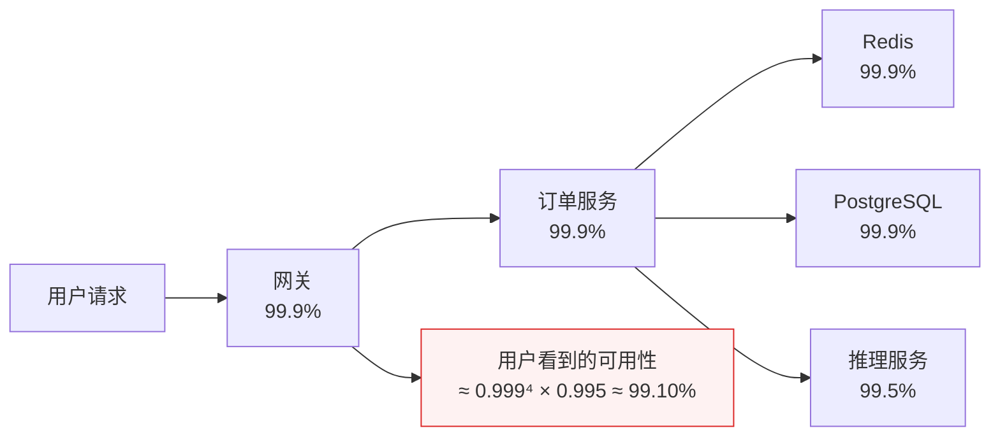
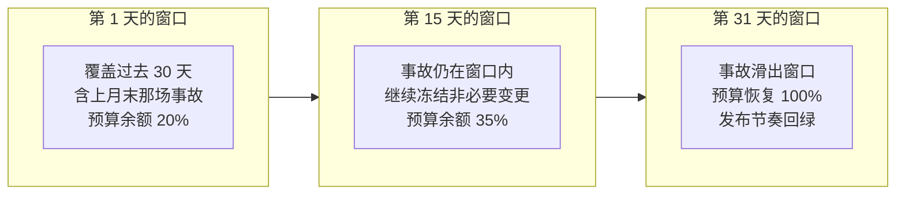
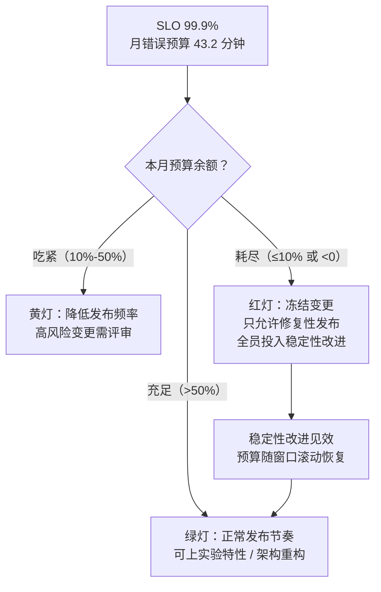
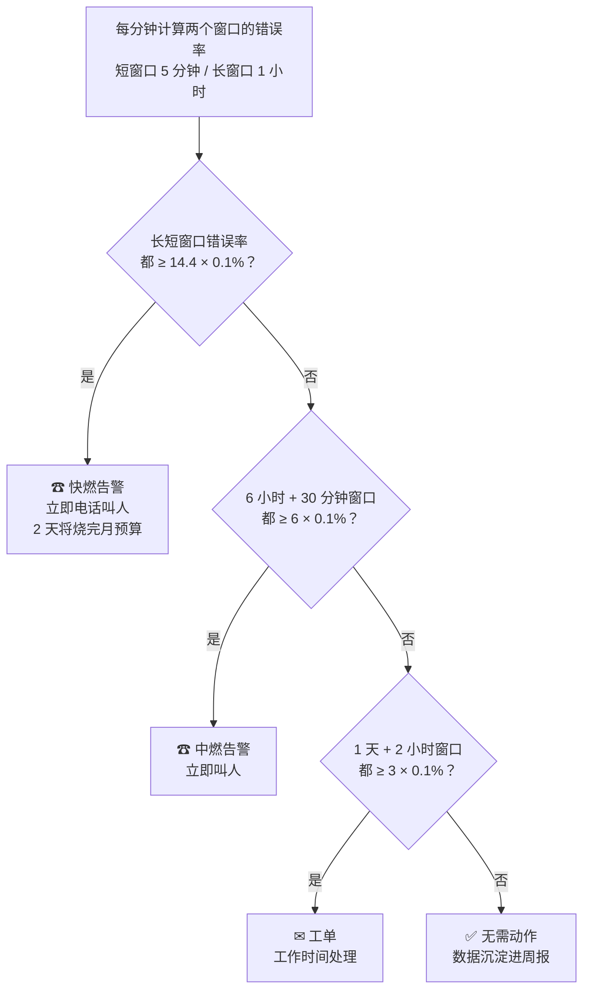
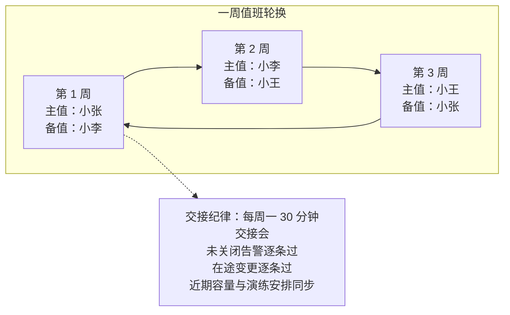
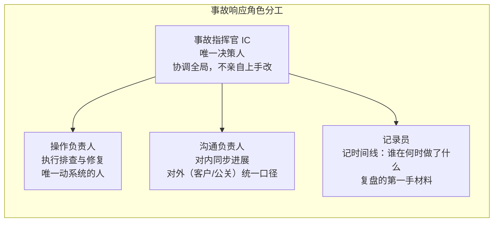
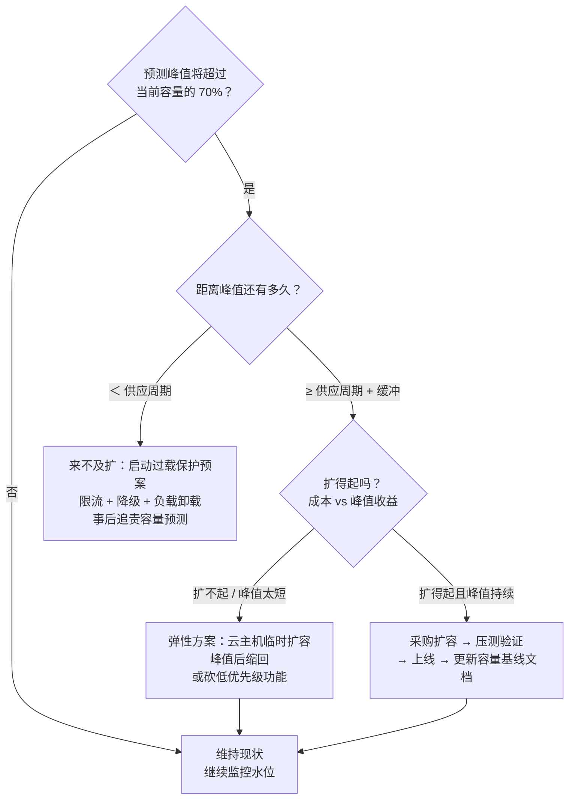
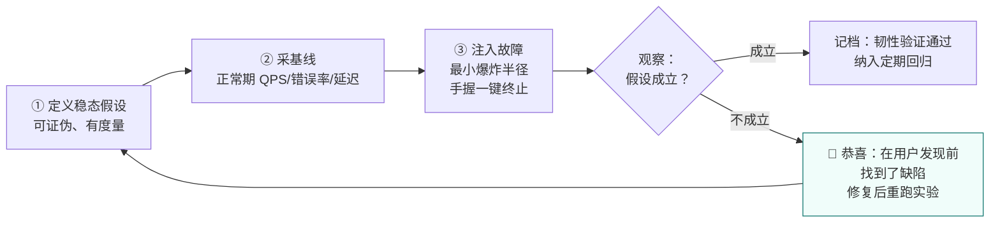
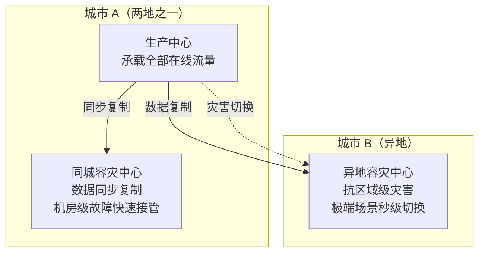

# 卷08：SRE 与可靠性工程——从"能跑"到"可承诺"

> 导语：卷06 结束时，RetailHub 拥有了自己的私有化推理服务和向量检索能力，平台拼图看似完整了。但请回答一个问题：**如果明天上午十点推理服务挂了，谁会知道？多久能恢复？你能对业务方承诺"一年最多坏多久"吗？** 如果三个问题都答不上来，那你的系统还只是"能跑"，谈不上"可承诺"。本卷讲 SRE（Site Reliability Engineering，站点可靠性工程）——Google 发明的、如今已成为行业共识的一套方法论：用软件工程的手段解决运维问题，用 SLO 和错误预算把"稳定性"从玄学变成可以定量谈判的工程指标。这个位置是刻意安排的：下一阶段（阶段九，篇03–篇10）你要在 RetailHub 之上构建企业级多租户 DataAgent，而 Agent 系统比传统服务更"脆"——模型会抖、延迟会飘、成本会爆——**Agent 的一切可靠性承诺，都建立在底座的 SRE 方法之上**。先学会给传统服务立承诺，才配给智能体立承诺。本卷知识主线来自 Google《Site Reliability Engineering》及其配套工作簿的公开知识体系[^sre-book][^sre-workbook]，并首次引入一个本土工业级样板：金山办公的可靠性工程实践（KAE 与 WPS 混合云架构）。

---

## 1. SRE 是什么：用软件工程消灭运维

### 1.1 三类角色对比：运维、DevOps、SRE

| 维度 | 传统运维（Ops） | DevOps（理念/运动） | SRE（具体岗位与方法） |
|---|---|---|---|
| 核心目标 | 系统别挂，变更别动 | 开发与运维协作，交付更快 | 用工程手段同时获得速度与稳定 |
| 工作方式 | 手工操作、工单驱动 | 自动化流水线、文化融合 | 写代码消灭重复劳动（消除 toil） |
| 与开发的关系 | 部门墙两侧，互相甩锅 | "You build it, you run it" | 同一套工程标准，SRE 本身也是软件工程师 |
| 稳定性如何度量 | 凭感觉、"最近挺稳的" | 较少量化 | SLI/SLO/错误预算，全部量化 |
| 变更态度 | 能不变就不变 | 持续交付 | 用错误预算决定变更节奏 |
| 一句话 | 看机器的人 | 一种文化主张 | 一套可执行、可招聘、可考核的工程学科 |

可以这么理解三者的关系：**DevOps 提出了"开发运维应该一体"的愿景，SRE 是 Google 给出的具体实现**——Google SRE 有句名言："SRE is what happens when you ask a software engineer to design an operations team."（当你让软件工程师来设计运维团队时，得到的就是 SRE。）Google 副总裁 Ben Treynor 还有一句更技术味的表述："SRE 类实现了 DevOps 接口"（class SRE implements interface DevOps）——DevOps 是抽象理念，SRE 是它的一套具体方法集[^sre-book]。

### 1.2 Google SRE 的起源与组织形态

**起源**。2003 年，Google 的软件工程师 Ben Treynor 受命组建一个 7 人团队，负责生产系统的可用性。他的选择在当时是离经叛道的：不招系统管理员，而是让软件工程师干运维的活——结果这些人厌恶重复劳动到骨子里，凡是要做第二遍的手工操作就写成代码。这支团队后来长成上千人的 SRE 部门，扛住了 Google 搜索、Gmail 等顶级规模服务，2016 年 Google 把方法论公开成书，SRE 从此成为行业通用词[^sre-book]。这段历史对零基础读者有一个重要启示：**SRE 不是"运维岗位的改名"，而是用工程文化对运维岗位的重新发明**。

**SRE 团队的组建模式**。公司规模不同，SRE 的组织方式也不同，主要有四种[^sre-workbook]：

| 模式 | 做法 | 适合阶段 | 风险 |
|---|---|---|---|
| 嵌入式（Embedded） | SRE 直接编入业务开发团队，同甘共苦 | 单个核心服务、团队小 | SRE 被业务节奏同化，沦为"高级运维" |
| 参与式（Engaged） | 独立 SRE 团队，对服务做"成熟度评估"后才接管 | 多服务、有平台雏形 | 评估标准不清会变成权力寻租 |
| 咨询式（Consulting） | SRE 不接管服务，输出工具、评审与培训 | SRE 人力稀缺的早期 | 说了没人听，落不了地 |
| 中央平台式（Centralized） | SRE 建设统一平台（监控/发布/告警），服务自助接入 | 规模化阶段（如金山办公 KAE） | 平台脱离业务实际，变成新衙门 |

RetailHub 当前 6 人团队的现实选择是**咨询式 + 嵌入式混合**：不设专职 SRE 岗位，但指定一名"SRE 负责人"（可以是你），把本卷的方法论作为团队纪律推行。**方法论不挑团队规模，挑的是有没有人愿意为可靠性负责**。

**50% 工程时间规则的运作细节**。Google 给 SRE 定了一条硬规矩：琐事（toil）不能超过工作时间的 50%，其余时间必须用于工程改进[^sre-book]。这条规则的运作机制值得拆解开看：

1. **先认清什么是 toil**。Google 的定义有五个特征：手工的、重复性的、可自动化的、战术性的（而非长期价值）、随服务规模线性增长的。手工重启是 toil，写重启脚本不是；手工扩容是 toil，做自动扩缩容不是；给领导手工导周报是 toil，做自助看板不是。**判断标准：这件事做完之后，世界有没有变得更好一点？**
2. **超限怎么办**。如果一个 SRE 团队的 toil 持续超过 50%，Google 的做法是把部分工单**退回给开发团队**——让开发者亲自感受自己设计出来的系统有多难伺候，这比任何架构评审都更能激励"可运维性设计"。
3. **为什么必须是 50% 而不是"尽量"**。因为 toil 有自我繁殖能力：系统越大，手工活越多；手工活越多，越没时间写自动化；越没有自动化，手工活更多——这是死亡螺旋。50% 是一条用行政纪律强制保留的"研发再投资率"，和财务上的研发投入占比是同一个道理。

### 1.3 Google SRE 的核心命题

传统运维团队的规模随系统规模线性增长：机器多一倍，人就得加一倍——这在商业上不可持续。SRE 的破局点是把运维当软件工程问题来做：

1. **消除 toil（琐事）**：如上节所述，用 50% 规则强制保留工程时间，让"消灭重复劳动"永远有时间发生。
2. **拥抱风险，而不是消灭风险**：100% 可靠不是目标，也不是用户需要的（用户家里的 Wi-Fi 比你的服务更容易断）。目标是把可靠性定在"用户满意且成本可承受"的水平，然后把剩余的不可靠额度当成**预算**来花。
3. **用数据而非职位做决定**：发布能不能上、架构要不要改，拿 SLO 数据说话，不听嗓门最大的。

### 1.4 为什么架构师必须懂 SRE

你在卷05 学过"质量属性"：可用性是每个架构文档里都会写的词。但架构师写"系统可用性 99.9%"和 SRE 兑现"99.9%"之间隔着一整套工程体系——**架构图上的每一个冗余设计、每一个降级开关，最终都要靠 SLO、告警、值班、复盘这套机制才能真正生效**。反过来，不懂 SRE 的架构师会犯两类典型错误：过度设计（为一个没人承诺过的可用性堆三地五中心，烧钱）或设计缺位（架构里根本没有可观测性和降级的位置，上线后补都补不上）。架构决定可靠性的上限，SRE 决定可靠性的下限。

---

## 2. SLI/SLO/SLA 与错误预算：SRE 的灵魂

这是本卷最重要的一节，请慢读。

### 2.1 三个概念一张表

| 概念 | 全称 | 定义 | 例子（以 RetailHub 订单查询为例） | 性质 |
|---|---|---|---|---|
| SLI | Service Level Indicator，指标 | 对服务水平的**可测量**量化指标 | 28 天窗口内，延迟 < 300ms 且返回 2xx 的请求占比 | 测量值 |
| SLO | Service Level Objective，目标 | SLI 应该达到的内部目标 | SLI ≥ 99.9%（滚动 30 天） | 内部承诺 |
| SLA | Service Level Agreement，协议 | 与用户的合同，违约要赔钱/赔额度 | 可用性 ≥ 99.5%，未达标按合同赔付 | 商业合同 |

记住一句话：**SLI 是温度计，SLO 是你对自己承诺的体温红线，SLA 是你对别人签的合同红线**。工程上有一个重要纪律：**SLO 必须比 SLA 严格**，中间留出的缓冲带就是你的反应时间——等 SLA 破了才告警，赔偿金已经在路上了。

### 2.2 SLI 的选择方法：四族指标、口径之争与规格说明书

**选哪些 SLI？** 常用四族：

- **可用性（Availability）**：成功请求占比。注意分母怎么定义（健康探测请求算不算？），口径之争是 SLO 谈判的第一战场。
- **延迟（Latency）**：P95/P99 分位延迟，而不是平均值——平均延迟会掩盖长尾用户的地狱体验。注意成功请求与失败请求的延迟要分开统计：一个 500 错误 5ms 就返回了，混进平均值会让"延迟"看起来更健康。
- **新鲜度（Freshness）**：数据系统特有——用户看到的报表数据落后真实世界多久？RetailHub 的经营日报 T+1 还是 T+5 分钟，就是新鲜度 SLI。
- **正确性（Correctness）**：返回了 200 但算错了，比返回 500 更恶劣。对账单、库存这类数据，需要"对账一致率"这样的 SLI。

**四族指标怎么落地测量？** 每一族都要回答"数据从哪来"：

| SLI 族 | 测量位置（优先级从高到低） | RetailHub 落点 |
|---|---|---|
| 可用性 | 负载均衡/网关日志 > 服务端指标 > 客户端上报 > 探测脚本 | 网关的 access log 统计 2xx 占比 |
| 延迟 | 服务端直方图（histogram bucket） | `http_request_duration_seconds_bucket` |
| 新鲜度 | 数据时间戳与当前时间之差，周期性采样 | `time() - dashboard_data_timestamp` |
| 正确性 | 对账任务、双写比对、人工抽检 | 每日订单总额 vs 支付渠道对账单 |

为什么强调"测量位置"？因为**同一个 SLI 在不同位置测出来的值可能差出一个 9**：在服务端测可用性，测不到客户端到机房之间的网络故障；在网关测，测不到网关本身的故障。原则是**测量点尽量靠近用户**——用户的体验才是 SLI 的本体，服务端指标只是它最方便的代理。

**分母口径之争：SLO 谈判的第一战场**。看一个真实感很强的例子——订单查询可用性 SLI：

- 口径 A：`成功请求数 / 全部请求数`——分母含健康检查、含爬虫、含恶意扫描，数值天然虚高。
- 口径 B：`成功请求数 / 剔除健康检查与内部探测后的请求数`——更接近真实用户体验。
- 口径 C：`成功请求数 / 有效业务请求数（再剔除 4xx）`——客户端传错参数导致的 400 算不算服务不可用？业务方说不算，用户说我明明失败了。

三种口径没有绝对对错，但**选定后必须写进 SLO 文档并冻结**——否则每次事故复盘都会演变成口径扯皮。经验法则：分母取"用户视角的有效请求"，剔除机器流量，保留所有服务端责任范围内的失败（含 5xx、超时、限流 429）。

**SLI 规格说明书（SLI Specification）**。Google SRE 工作簿建议每个 SLI 写一份两栏规格[^sre-workbook]：

```markdown
## SLI：订单查询可用性
### 规格（Specification）——用户视角的定义
请求返回 2xx 且 P95 延迟 < 300ms 的占比，用户视角"能用"的标准。
### 实现（Implementation）——工程视角的测量
数据源：网关 access log（filebeat → ES）
分子：status=~"2.." 且 upstream_response_time < 0.3 的条数
分母：剔除 /healthz、/metrics 与内网探测 IP 后的总条数
窗口：28 天滚动，每小时聚合一次
已知偏差：不含网关自身故障期间（网关挂了 log 也没了），
         该时段按不可用计入（保守处理）
```

**先写规格再写实现**——规格回答"用户的什么体验"，实现回答"我们怎么近似测量它"。两者之间的差距（已知偏差）必须显式承认，否则你会把"指标好看"误认为"用户满意"。

### 2.3 SLO 制定方法：从用户出发，不从能力出发

错误的制定顺序：先测出系统现在能跑 99.95%，然后把 SLO 定为 99.9%——这叫"向后看"，定出来的 SLO 既不保护用户也不约束自己。正确的顺序是：

1. **找出用户旅程**：RetailHub 用户的核心旅程是"打开经营看板 → 看昨日数据 → 下钻异常门店"。SLO 只保这条旅程上的服务，不为边缘功能立军令状。
2. **问用户能容忍什么**：内部工具用户容忍度低吗？未必——经营看板早上 9 点开会用，夜里挂了没人关心。这直接影响你的值班策略和维护窗口。
3. **选一个"用户开始抱怨但还没流失"的点**：SLO 定得太松，用户流失了你还"达标"；定得太紧，你为最后一个 9 付出十倍成本（见下表）。99.9% 是很多 B 端内部系统的甜蜜点。
4. **写下来，让所有相关方签字**：SLO 是一份"工程部与业务部的停火协议"，没签字的 SLO 在第一次事故后就会被撕毁。

**可用性档位换算表（必背）**：

| SLO 等级 | 每年允许不可用 | 每月允许（30 天月） | 每天允许 | 形象理解 | 典型成本 |
|---|---|---|---|---|---|
| 99%（两个 9） | 3.65 天 | 7.2 小时 | 14.4 分钟 | 每周可以坏一次大的 | 单机房 + 基本监控即可 |
| 99.5% | 1.83 天 | 3.6 小时 | 7.2 分钟 | 每月一次中事故 | 单机房 + 快速恢复预案 |
| 99.9%（三个 9） | 8.76 小时 | 43.2 分钟 | 1.44 分钟 | 一个月只允许一次中等事故 | 需要冗余 + 自动故障转移 |
| 99.95% | 4.38 小时 | 21.6 分钟 | 43 秒 | 事故要半自动恢复 | 冗余 + 自动切换 + 严格变更管控 |
| 99.99%（四个 9） | 52.6 分钟 | 4.32 分钟 | 8.6 秒 | 事故必须在人工反应前自愈 | 多活架构、秒级切换，成本陡增 |

记忆口诀：**"9 的个数翻一倍，允许的停机时间除以十"**——99% 是每月 7.2 小时，99.9% 是 43.2 分钟，99.99% 是 4.32 分钟。最后这个 9 的代价不是线性而是指数——从三个 9 到四个 9，往往意味着从"单机房 + 快速恢复"跳到"多机房双活"的架构代际变化。**这是架构决策，不是运维目标**，必须在卷05 那种正式架构评审里过。

### 2.4 SLO 数学：串联、并联与滚动窗口

**串联可用性：0.999 的 n 次方**。用户的每一次请求都不是只经过一个服务，而是穿过一条链。以 RetailHub 智能看板为例：网关 → 订单服务 → Redis → PostgreSQL → 推理服务，五环串联。假设每个环节各自可用性都是 99.9%，且故障相互独立，那么整条链的可用性是：

```
链路可用性 = 0.999 × 0.999 × 0.999 × 0.999 × 0.999 = 0.999⁵ ≈ 99.50%
```

每个环节单独看都达标"三个 9"，用户看到的却是 99.5%——月停机从 43.2 分钟变成 3.6 小时。**串联系统的可用性上限由最薄弱的一环决定，且每增加一环就再乘一次**。这就是为什么微服务拆得越细，每个服务的 SLO 必须定得越高：10 个 99.9% 的微服务串成的链路只有 99%，用户不管你内部怎么分工。



**并联可用性：冗余为什么能救命**。同一个环节部署两个独立副本（任何一个是活的就能服务），可用性变成：

```
并联可用性 = 1 − (1 − a)²
两个 99.9% 并联 = 1 − 0.001² = 99.9999%（六个 9）
```

两个"三个 9"的平庸副本，并联后接近"六个 9"——**冗余是用便宜硬件换高可用的数学杠杆**。但注意前提"独立"：如果两个副本跑在同一台宿主机、共用同一个数据库、由同一次发布同时更新，那它们的故障不是独立的，(1−a)² 的公式就失效——这就是第 6 节两地三中心要解决的"相关性故障"问题。

**错误预算的滚动窗口计算**。SLO 按"滚动 30 天"统计，意思是：任意时刻往回看 30 天的 SLI。这带来两个实操后果：

1. **预算会自己恢复**。30 天前的那场大事故，今天会从窗口里"滑出去"，预算余额自动回升——不需要任何人特赦。
2. **月初清零是反模式**。如果按自然月统计，月初预算满额时大家疯狂变更、月末预算见底时什么都不敢动——人为制造了节奏抖动。滚动窗口让预算水位连续变化，决策更平滑。



先用交互 Demo 亲手感受串联衰减：默认拓扑就是 RetailHub 下单链路，拖动任一环节的可用性档位、或给它勾选"双活并联"，盯着"链路总可用性"和"最薄弱一环"怎么变：

```demo serial-availability
```

**Demo 导学单**（建议按顺序观察）：

1. 保持默认五环节不动，记下"链路总可用性"——对照上文 0.999ⁿ 的口算，验证 demo 的连乘结果。
2. 把"推理服务"从 99.5% 拉到 99.9%，观察总可用性提升了多少；再改回去，改为给它勾选"双活并联"，对比两种修法谁的收益大、成本是什么。
3. 把所有环节都设成 99.99%，看总可用性能否达到 99.9%——理解"下游服务数 × 故障率"这道紧箍咒。
4. 连续点"＋ 增加环节"加到 8 个，观察每加一环总可用性的衰减幅度，解释为什么微服务拆分要克制。
5. 找到让链路恰好回到 99.9% 的最省方案（提示：只治理短板），写下你的组合。

### 2.5 错误预算：把可靠性变成可花费的资源

这是 SRE 方法论里最精妙的发明。逻辑链条是：

1. SLO 定了 99.9%，意味着每月有 43.2 分钟的"合法不可靠额度"——这就是**错误预算（Error Budget）**。
2. 预算没花完，说明可靠性有余量：**可以用来冒险**——加快发布频率、上线实验性功能、做架构重构。研发团队拿到了数据支撑的"冒险许可证"。
3. 预算花完了，说明系统在裸奔：**冻结非必要变更**，全员优先做稳定性改进（修 bug、补冗余、写演练），直到预算恢复。

于是"开发想快、运维想稳"这个千古死结被解开了：**双方不再吵架，而是共同管理同一个账户**。快与稳不再是价值观之争，而是会计问题。



在真机上配置这套机制之前，先用下面的交互 Demo 建立直觉：设定 SLO 档位，往 30 天时间线里注入事故（自己指定持续时长与影响面，或让随机模拟替你"倒霉"），盯着错误预算条被一点点吃掉——特别注意预算耗尽时"冻结变更"是如何改变发布次数的，再切到"无预算约束"对照组，看看没有预算纪律的团队会用发布次数付出什么隐性代价：

```demo error-budget
```

**Demo 导学单**（建议按顺序观察）：

1. 先把 SLO 切到 99.99%，什么都不要做——只看"月度错误预算"变成约 4.3 分钟，理解为什么四个 9 几乎不允许人工反应。
2. 切回 99.9%，注入一次"60 分钟 × 100% 影响面"的事故，观察预算条一次性透支——这相当于一次大促故障的量级。
3. 点"随机模拟 30 天"三次，比较三次的发布冻结次数差异——体会"同样的事故率，落在窗口不同位置，对发布节奏的影响完全不同"。
4. 勾选"无预算约束（对照）"再模拟一次：发布次数上去了，但注意结论区说的隐性代价是什么。
5. 找到"预算恰好不耗尽"的最大事故组合（几次、各多长），写下它对 RetailHub 大促预案的启示。

---

## 3. 监控与告警：观测是数据，告警是决策

### 3.1 四个黄金信号

卷04 讲过可观测性三支柱（Metrics/Logs/Traces），那是"数据怎么采"。告警要解决的是另一个问题：**什么情况下把熟睡中的人叫起来**。Google SRE 给出四个黄金信号，覆盖绝大多数服务[^sre-book]：

| 信号 | 定义 | 采集要点 | RetailHub 例子 |
|---|---|---|---|
| 延迟（Latency） | 请求耗时 | 成功与失败**分开统计**——失败 5ms 返回会污染平均值；用分位数（P95/P99）不用均值 | 订单查询 P99、推理请求 TTFT |
| 流量（Traffic） | 系统承载的需求强度 | 按系统类型选单位：HTTP 用 QPS，消息系统用条/s，AI 服务用 tokens/s | QPS、并发会话数、推理 tokens/s |
| 错误（Errors） | 失败请求的比例 | 显式失败（5xx）+ 隐式失败（200 但内容错误）+ 策略失败（超时熔断兜底） | 5xx 率、推理超时率、对账失败数 |
| 饱和度（Saturation） | 资源距离极限还有多远 | 测"水位"而非"用量"：连接池用了 80% 比 CPU 用了 80% 更接近悬崖 | CPU/内存/磁盘、GPU 显存占用、连接池水位、推理排队深度 |

四个信号中**饱和度最容易被忽视也最有预测价值**：延迟和错误是"已经出事"，饱和度是"快要出事"。一个成熟的看板应该让值班者一眼看到"距离悬崖还有多远"，而不只是"现在有没有掉下去"。

### 3.2 RED 与 USE：两套落地口诀

四个黄金信号是原则，落地时社区总结出两套更好记的口诀，分别对应"服务视角"和"资源视角"：

**RED 方法（面向请求驱动的服务）**——每个微服务至少监控三个指标：

- **R**ate（速率）：每秒请求数，即流量；
- **E**rrors（错误）：每秒失败请求数或错误率；
- **D**uration（时长）：请求延迟分布。

RetailHub 的订单、库存、报表三个服务，每个都该有一张三指标小卡。**RED 回答的是"用户正在经历什么"**。

**USE 方法（面向资源）**——每种硬件/软件资源至少监控三个指标：

- **U**tilization（利用率）：资源忙于工作的时间比例（CPU 60%、GPU 显存占用 78%）；
- **S**aturation（饱和度）：排队等待的程度（CPU load 超过核数、推理排队深度、连接池等待线程数）；
- **E**rrors（错误）：资源级错误计数（磁盘 IO 错误、OOM Kill、GPU ECC 错误）。

**USE 回答的是"系统内部哪里快撑不住了"**。两套方法互为表里：RED 发现症状，USE 定位病根。告警用 RED（症状），排查用 USE（原因）——这正是 3.4 节"症状告警 vs 原因告警"的落地分工。

### 3.3 指标基数爆炸：监控系统自己的可靠性问题

一个新手常踩的坑：给指标随意加标签（label），结果监控系统先被自己压垮。原理是**时间序列的数量 = 指标数 × 各标签取值的笛卡尔积**：

```
http_requests_total{service, code, path, tenant_id}
= 3 个服务 × 6 种状态码 × 200 条路径 × 500 个租户
= 1,800,000 条活跃时间序列
```

每条序列都要占内存、定期落盘，百万级序列足以让 Prometheus 内存爆掉、查询变慢——**你用来观测系统的系统，成了新的故障源**。治理原则三条：

1. **高基数字段永远不进 label**：`tenant_id`、`user_id`、`order_id`、完整 URL，这类取值成千上万的信息属于日志和 Trace，不属于指标。
2. **label 只放枚举型低基数维度**：服务名、状态码族（`2xx/4xx/5xx` 而非具体码）、环境、版本。
3. **需要按租户看时走聚合**：按租户分析用日志/数仓离线算，指标只保留"top N 租户"这种有界维度。

记住一个类比：**指标是体温计，日志是病历，Trace 是 CT**——你不会把整本病历写进体温计。

### 3.4 症状告警 vs 原因告警

这是告警设计的第一原则：**告警只报症状，不报原因**。

- ❌ 原因告警："订单服务的 JVM Old GC 超过 2 秒"——也许根本没人受影响。
- ✅ 症状告警："订单查询错误率过去 5 分钟 > 2%（SLO 消耗速度超标）"——用户正在受害，必须有人起来。

原因信息去哪？进看板和诊断面板，作为人被叫醒后的排查线索。**判断标准只有一条：这个告警如果凌晨三点响起，接电话的人需要立刻做什么？** 如果答案是"看一眼，没事，继续睡"，它就不该是告警。

为什么这条原则如此重要？算一笔账：一个 50 个服务的系统，每个服务 10 个资源指标，如果按原因告警，理论上有 500 条规则会响；但其中真正"用户正在受害"的时刻可能一年只有几十次。**原因告警把"罕见的重要信号"稀释在"常见的无关噪音"里**，结局一定是告警疲劳（3.6 节）。症状告警天然收敛——用户的症状就那么几种：慢了、错了、没了。

### 3.5 燃烧率告警：多窗口多燃烧率的数学

症状告警解决了"报什么"，下一个问题是"**阈值定多少**"。拍脑袋定"错误率 >2% 告警"有两个无解的矛盾：

- 阈值低了：夜间低流量时，3 个请求里 1 个失败就是 33% 错误率，电话把人叫醒，其实是某个用户手滑——**误报**；
- 阈值高了：错误率 0.5% 的慢性泄漏持续半个月，从不告警，月底一算 SLO 已经破了——**漏报**。

Google SRE 工作簿给出的答案是**基于燃烧率（burn rate）的告警**[^sre-workbook]。先定义：

```
燃烧率 = 当前错误率 ÷ SLO 允许的错误率
```

SLO 99.9% 允许 0.1% 错误率。如果系统长期以 0.1% 出错的速率运行（燃烧率 = 1），30 天恰好烧完整月预算；燃烧率 = 14.4 意味着按这个速度 **2 天烧完 30 天的预算**；燃烧率 = 6 意味着 5 天烧完。

于是告警逻辑从"错误率绝对值"变成"**烧钱速度**"：烧得快，立刻叫人；烧得慢但持续，进工单；烧得极其缓慢，每日巡检看一眼。Google 推荐的多窗口配置（针对 99.9% SLO，其他档位同比缩放）[^sre-workbook]：

| 档位 | 燃烧率 | 烧完月预算时间 | 长窗口 | 短窗口 | 动作 |
|---|---|---|---|---|---|
| 快燃 | 14.4× | 2 天 | 1 小时 | 5 分钟 | ☎ 立即叫人 |
| 中燃 | 6× | 5 天 | 6 小时 | 30 分钟 | ☎ 立即叫人 |
| 慢燃 | 3× | 10 天 | 1 天 | 2 小时 | ✉ 工单跟进 |
| 阴燃 | 1× | 30 天 | 3 天 | 6 小时 | ✉ 每日巡检 |

**为什么要长短双窗口？** 只看长窗口：故障已经烧了 50 分钟，1 小时窗口的平均值还没过线，告警迟到；只看短窗口：一个 5 分钟的毛刺就把人叫醒，而且故障恢复后短窗口立刻回落、告警立刻复位，值班者被"告警-复位-告警-复位"反复横跳折磨。**长窗口保证"这不是毛刺"（降低误报），短窗口保证"检出快、复位快"（降低漏报）**——两个条件取"与"，兼得两者。



数学上还有一个值得知道的细节：14.4 这个数不是拍脑袋，而是从"**误报率与检出时间的权衡**"反推出来的——1 小时窗口消耗 2% 月预算（30 天 × 2% ÷ 60 分钟 ≈ 14.4 倍燃烧率），是在"足够快到值得叫人"和"足够大到不可能是抖动"之间找到的平衡点。

用下面的模拟器亲手验证这套机制：设定 SLO 和背景错误率，注入一段"错误脉冲"（比如模拟一次发布事故：错误率 2%、持续 1 小时），看四档告警各自会不会响、多久之后响：

```demo burn-rate-alert
```

**Demo 导学单**（建议按顺序观察）：

1. 用默认参数（99.9% SLO、2% 错误率 × 60 分钟）跑一次，记录快燃档的"检出延迟"——理解为什么不是故障一发生就告警。
2. 把持续时长缩到 10 分钟再跑：观察哪些档不响了，解释长短双窗口如何避免"毛刺叫人"。
3. 把峰值错误率降到 0.15%（燃烧率 ≈1.5）、持续时长拉满 720 分钟：观察只有"慢燃/阴燃"档触发——体会慢性泄漏为什么必须靠慢档抓。
4. 把背景错误率调到 0.1%（恰好 = 允许错误率）：什么都不注入，想想这个系统 30 天后预算剩多少。
5. 切到 99.99% SLO 再跑默认脉冲：注意各档阈值同比收紧，理解"SLO 越高，告警越敏感"。

### 3.6 告警疲劳治理

告警疲劳是可靠的隐形杀手：收件箱里每天 200 条告警，第 201 条真正致命的就被淹没了——人对告警的注意力是有限资源，和 GPU 显存一样需要精打细算。治理三板斧：

1. **每条告警必须可行动**：不能触发动作的告警降级为看板指标或周报项。接到告警后的动作只有三类：立即修复、立即缓解（回滚/切流/扩容）、立即升级（摇更懂的人）——如果一条告警三者都不沾，它不配叫醒任何人。
2. **定期审阅告警记录**：每月回顾，把"响了但没人处理、处理了但没必要"的告警删掉或调阈值。告警规则也要有生命周期。一个量化参考：**健康的值班周期内，page 级告警每周不应超过 2-3 次**——超过这个频率，值班者会学会忽略告警，这是组织的失败而不是个人的失职。
3. **告警收敛与聚合**：一个数据库挂了引发 50 个服务告警，应该收敛成一条"数据库 X 不可用，影响 50 个服务"，而不是 50 通电话。实现手段：告警分组（同根因合并）、抑制（上游告警期间屏蔽下游）、静默（维护窗口期提前声明）。

### 3.7 与卷04 可观测性的关系

一句话：**观测是数据，告警是决策**。卷04 的三支柱解决"系统内部状态如何被看见"，本节的黄金信号与预算告警解决"看见之后何时行动"。没有观测的告警是瞎叫，没有告警的观测是自言自语——两者在 SLO 上交汇：SLO 既是告警阈值的来源，也是看板组织的中心。

---

## 4. 事故管理：值班、应急与复盘

### 4.1 值班（Oncall）：可靠性的最后一道人肉防线

自动化能处理已知问题，值班处理的是未知问题。健康的值班制度有几个硬指标：

- **轮换周期**：单人连续值班不超过一周——连续高压下判断力会显著下降，第 7 天的值班者和第 1 天不是同一个人。常见形态是"主备双人、按周轮换"（见下图）。
- **人数红线**：值班组少于 3 人就是高风险（一人请假另一人就连轴转）；Google 的经验是一个值班组 6-8 人，每人每周至多一次 oncall[^sre-book]。
- **告警预算**：单次值班期 page 告警 ≤2-3 次（见 3.6），超过就该治理告警或修系统，而不是换人硬扛。
- **补偿机制**：告警风暴后有补休、值班津贴真实发放。
- **授权**：最重要的一条——**值班者有权叫停发布、有权拉任何人进群，事后不被追责**。



**主备双人是关键设计**：主值被叫醒后 15 分钟无响应，告警自动升级到备值；重大事故主值一个人忙不过来时，备值是第一援军。RetailHub 只有 6 个人，可以全员轮值主备——这也倒逼每个人都必须懂全链路，值班制度顺便解决了"知识只在一个人脑子里"的单点问题。

### 4.2 事故分级与升级机制

不是所有事故都值得全公司跳起来。没有分级的事故响应有两个极端结局：小事故动用十个人，大事故却只有值班者孤军奋战。一个务实的四级标准：

| 级别 | 定义（满足其一） | 响应要求 | RetailHub 示例 |
|---|---|---|---|
| P0 | 核心链路完全不可用；数据丢失或泄露；资损 | 全员响应，15 分钟内 IC 到位，每 30 分钟对外同步 | 下单接口全量 500；租户数据串库 |
| P1 | 核心链路严重劣化或部分不可用；错误预算小时级燃烧 | 值班者 + 备值响应，1 小时内 IC 到位 | 订单查询错误率 30%；推理服务全挂 |
| P2 | 非核心功能不可用；核心功能降级可用 | 值班者处理，工作时间内响应 | 报表生成延迟但可查历史；看板退回静态数据 |
| P3 | 体验瑕疵，无功能损失 | 进 backlog，随迭代修复 | 某图表加载慢 2 秒；文案错误 |

**升级机制（Escalation）解决的是"叫醒链"**：告警 → 主值（15 分钟无响应）→ 备值（15 分钟无响应）→ SRE 负责人 → 技术负责人。每一级的超时时间和联系方式必须提前写成 runbook，**升级不是告状，是制度设计**——值班者发现超出自己能力时立刻升级是专业行为，硬扛两小时不吭声才是失职。

事故的完整生命周期与角色配合，用一条时间线看更清楚：


注意这条时间线的两个纪律：**从告警到缓解以分钟计**（先恢复），**从恢复到复盘以天计**（后查因）。复盘要趁热（记忆新鲜、日志未过期）但不必当夜（疲惫的团队写不出好复盘）。

### 4.3 应急指挥：混乱中建立秩序

事故现场的敌人不是故障本身，而是混乱：五个人同时改五处、没人记时间线、领导在群里不停问"好了没"。业界成熟做法是明确的角色分工[^sre-book]：



三个人也能跑：IC 兼记录，一人操作，一人沟通。**角色比人数重要**——哪怕只有两个人，明确"谁指挥、谁动手"也能避免互相踩踏。另一个关键纪律：**先恢复，后查因**。能重启恢复就先重启，能回滚就先回滚，根因分析留给复盘——MTTR（平均恢复时间）比"根因报告多漂亮"重要得多。

补充一个反直觉的点：**IC 不亲自上手改系统**。原因有两个：一是动手的人视野会缩窄到眼前的终端，失去全局判断；二是权力与操作分离形成天然复核——"IC 决定回滚、OPS 执行回滚"意味着每个动作都过了两个人的脑子，慌乱中的错误率直接减半。

### 4.4 Blameless Postmortem：不追责复盘

事故复盘是可靠性工程最重要的学习机制，而其文化基石是 **blameless（不追责）**：假设每个人在当时的信息和压力下都做出了他认知内的合理决策，事故的责任在系统（流程、工具、架构）而不在个人[^sre-book]。

**为什么 blameless 不是"和稀泥"而是硬工程？** 两个机制层面的原因：

1. **追责的第一个代价是信息断流**。如果"报事故会被处分"，团队的理性选择是瞒报小事故——而小事故恰恰是大事故的彩排。Etsy、Google 等公司公开过同一组经验：blameless 文化推行后，上报的事故数量**上升**了，但严重事故数量**下降**了——因为小问题在萌芽期就被摊开解决了。
2. **追责的第二个代价是学到错误的教训**。"小张手滑了"这个结论不产生任何工程改进；真正的问法是"为什么系统允许一次手滑造成全站故障？为什么手滑没有被防护机制拦住？"——**人的错误是免费的压力测试，系统的缺陷才是复盘的猎物**。

blameless 不等于无责（accountability）：责任从"你搞砸的"变成"你负责把改进项落地"。不惩罚引发事故的人，但要追踪改进项的负责人到闭环。

**时间线的写法细则**。时间线是复盘文档的心脏，三条纪律：

- **全部用同一时区、精确到分钟**，以告警/日志时间戳为准，不靠回忆；
- **只记事实不记判断**："14:20 决定回滚"是事实，"14:20 英明决定回滚"不是；
- **记失败的尝试**："14:12 尝试重启无效"和最终成功的操作同样重要——它防止下一个复盘者重走弯路。

**行动项的跟踪纪律**。每条改进项必须有：明确负责人（一个人，不是一个组）、截止日期、可验证的完成标准（"上线 X 告警"而非"加强监控"）、以及在两周后的复查会议上过一遍状态。**复盘的价值 = 改进项的闭环率**，会议室里的顿悟不值钱。

一份合格的复盘文档模板：

```markdown
# 事故复盘：YYYY-MM-DD <一句话标题，如"订单服务因缓存穿透不可用 47 分钟">

## 1. 影响面
- 时间段：14:03–14:50（47 分钟）
- 影响：订单查询接口错误率峰值 38%，约 1200 次请求失败；无数据丢失
- 错误预算消耗：本月预算 43.2 分钟，本次消耗 28.5 分钟（66%）

## 2. 时间线（全部用 UTC+8，精确到分钟）
- 14:03 告警触发：订单查询错误率 >2%
- 14:05 值班工程师确认，定级 P1，启动事故响应，担任 IC
- 14:12 定位为缓存命中率骤降（热 key 失效）
- 14:20 决定：开启兜底直连数据库 + 限流保护
- 14:50 错误率恢复 <0.1%，事故关闭

## 3. 根因分析（5 Whys）
- 为什么错误率高？缓存命中率从 99% 跌到 12%
- 为什么命中率跌？一个热 key（top100 商品列表）过期
- 为什么过期会打穿？该 key 重建需全表扫描 30s，并发请求同时打到 DB（缓存击穿）
- 为什么没有保护？未对该 key 使用互斥重建/逻辑过期（卷02 讲过的手段，未落实）
- 为什么没落实？上线检查清单中没有"热 key 防护"一项 ← 真正的根因

## 4. 改进项（每条有负责人与截止日期）
| # | 改进项 | 类型 | 负责人 | 截止 |
|---|---|---|---|---|
| 1 | top100 key 改为逻辑过期 + 单飞重建 | 代码 | 张三 | 本周五 |
| 2 | 上线检查清单增加"热 key 防护"项 | 流程 | 李四 | 下周三 |
| 3 | 增加缓存命中率 <80% 的预警（症状前置） | 监控 | 王五 | 下周三 |

## 5. 经验与教训（至少一条"下次怎么更快恢复"）
```

复盘的终点不是文档，而是**改进项进入 backlog 并被追踪完成**——复盘会议开完两周后，如果改进项一条没动，这次事故就白疼了。

---

## 5. 发布工程、容量规划与混沌工程

### 5.1 三种主流发布策略

线上变更是故障的最大来源（多数组织 60% 以上的事故由变更引发），发布工程的本质是**控制爆炸半径**：

| 策略 | 做法 | 优点 | 代价 | 适用 |
|---|---|---|---|---|
| 金丝雀发布 | 新版本先给 1% 流量/1 个节点，指标正常再逐步放大 | 爆炸半径最小，真实流量验证 | 需要完善的分流与指标对比基建 | 高频发布的核心服务 |
| 蓝绿发布 | 备一套完整环境（绿），切换流量瞬间完成 | 回滚极快（切回去即可） | 双倍资源成本；有状态服务难处理 | 低频大版本、基础设施升级 |
| 滚动回滚 | 分批替换实例，异常时停止并反向替换 | 资源成本低，K8s 原生支持 | 回滚慢；中间态新旧版本共存 | 无状态服务的常规发布 |

共同的前置条件是**自动化回滚**：回滚必须比发布更容易、更快——能在 3 分钟内回滚的团队才敢每天发布。阶段九的篇09（评测与受控进化）会把这套思想延伸到 Agent 领域：模型版本、Prompt 版本、Skill 版本的"受控发布"，机制上与本节同源，只是多了"质量评测"这一道门禁。

### 5.2 压测与容量规划

容量规划回答"大促前要不要加机器、加几台"。方法链分四步：

**第一步：负载测试找拐点**。用压测（load test）对单实例逐步加压，找到性能曲线的拐点（吞吐停止增长、P99 陡升处）——卷06 的 TTFT/TPOT 容量曲线就是 AI 版压测。负载测试有三个层次，别混用：

| 类型 | 目的 | 压到什么位置 | 类比 |
|---|---|---|---|
| 容量测试 | 找单实例拐点，定安全水位 | 压到拐点，记录拐前值 | 给桥梁标限重 |
| 压力测试 | 看过载时的行为（是否优雅降级） | 压到拐点后，直到挂 | 超载测试桥会不会垮 |
| 浸泡测试 | 找慢泄漏（内存、句柄、磁盘） | 安全水位下跑数小时-数天 | 长期满载试车 |

**第二步：估算峰值需求**。历史流量 × 业务增长预测 × 活动系数（大促通常 3-10 倍），取最悲观的组合。

**第三步：计算实例数**。`实例数 = 峰值 ÷ 单实例安全容量 × 冗余系数`。冗余系数通常 1.5–2，含义是**任何时刻能容忍一半实例挂掉**——别只算"够用"，要算"挂一半还够用"。

**第四步：提前量排期**。容量到位需要时间：云主机分钟级、物理 GPU 周级、机房专线月级。提前量公式：`启动扩容的时间点 = 峰值到达时间 − 供应周期 − 压测验证时间 − 缓冲（建议 ≥1 周）`。RetailHub 的推理服务扩容以周计，意味着大促容量方案必须提前一个月定稿——这也是 7.1 节"GPU 容量弹性差一个数量级"的直接推论。



**关键纪律：容量数字必须来自实测压测，不能来自"理论上这台机器能跑 1000 QPS"**——理论容量在生产环境几乎从不兑现。

### 5.3 过载保护：系统被打爆前的最后体面

流量超过容量时，没有保护的系统是全员 503 雪崩；有保护的系统能"断臂求生"：

- **负载卸载（Load Shedding）**：在入口按优先级丢请求——保下单、丢推荐；保付费租户、丢免费试用。排队理论告诉我们：过载时全收等于全死，主动丢一部分反而保住整体吞吐。
- **优雅降级（Graceful Degradation）**：功能降级而非服务消失——推荐服务挂了，商品页退回展示"销量榜"静态数据；推理服务过载，DataAgent 退回小模型或模板回答。**降级开关必须在架构设计时就留好位置**（卷05 的可用性战术），上线后再补等于在飞行中换引擎[^phoenix]。

### 5.4 混沌工程入门：主动"纵火"检验消防

容量与降级设计得再好，**没验证过的韧性都是假设**。混沌工程（Chaos Engineering）的回答是：在受控条件下主动注入故障，验证系统的韧性假设——Netflix 的 Chaos Monkey 随机关停生产实例，逼着所有服务把"实例随时会死"当成设计前提。

**入门四条原则**：

1. **先定义稳态假设**：实验不是乱搞，是验证一句可证伪的话——"Redis 挂掉后，商品查询错误率不升、延迟 <2s"。假设写不出来，实验就不该开始。
2. **最小爆炸半径**：先在测试环境，再上生产的 1% 流量/单可用区/单租户；实验期间手握"一键停止"按钮，影响超阈值立即终止。
3. **生产必做但择时**：测试环境验证不了真实依赖（你以为降级了，其实降级路径在生产根本没被调用过）；选业务低谷、团队全员在岗时执行。
4. **自动化常态化**：一次性演练的价值会随代码腐化而失效，把实验脚本化、定期跑，变成"韧性回归测试"。



注意流程图里的关键认知翻转：**混沌实验"失败"是价值最大的结果**——你在控制室里发现了缺陷，而不是在凌晨三点被电话叫醒时发现。本卷实战任务 D 就是你的第一次混沌实验。

---

## 6. 真实案例：金山办公的可靠性工程

前面五节是方法，这一节看一家中国公司如何把方法跑成工业级现实。以下来自金山办公的公开技术分享（InfoQ《超1500亿个文档，文档云原生时代的"规模之道"》等），数字均为公开口径[^infoq-kae]。

### 6.1 WPS 云服务的四时代演化（2009–2022）

WPS 云服务的架构演化走了十三年，官方总结为四个时代[^infoq-kae]：


这条路径与卷02 的淘宝、与你的 RetailHub 同构：**没有一步是"设计"出来的，全是规模倒逼出来的**。区别在于倒逼的力——淘宝是交易流量倒逼，WPS 是文档云服务的存储与协作规模倒逼：1500 亿+ 文档的存储、同步与检索，每一步架构演进背后都是"上一个形态装不下了"。

### 6.2 KAE：13600+ 微服务的工业级 IDP

第四时代的底座是金山办公自研的云原生运行环境 **KAE（Kingsoft App Engine）**，统一管理微服务、容器与应用伸缩，是 WPS 混合云架构的底座[^infoq-kae]。看两个数字感受规模：

- **微服务总数 13600+**（测试与生产环境）；
- **每天约 310 次更新部署**。

请停下来算一笔账：13600 个微服务、每天 310 次部署，如果每一次都要人工检查、人工发布、人工盯盘，需要多少人？答案是不成立——**这个规模下"平台工程"不是选择题而是生存题**。KAE 正是卷04 第 7 节"平台即产品"的工业级样板：统一的微服务管理、容器管理、应用伸缩，配合自动化测试与堡垒机管控，把上万服务的治理收敛进一个平台。你在卷04 搭的"最小内部平台"和 KAE 之间隔着的是规模，不是原理——黄金路径、自助化、消除重复劳动，原理一模一样。

把 6.2 与本卷前几节连起来看，KAE 同时是三种组织答案的合体：它是 1.2 节"中央平台式 SRE"的落地（统一平台承载可靠性能力）；它让 1.2 节的"50% 规则"成为可能（平台吃掉 toil，人才有时间做工程）；它也是 2.5 节错误预算的执行载体（310 次日部署的放行与否，必须靠自动化的预算与指标门禁，而不是人盯人）。

### 6.3 两地三中心与四个 9

金山办公的可靠性基建采用**两地三中心**架构：生产中心、同城容灾中心、异地容灾中心，极端灾害场景下秒级切换，实现全年 99.99%（四个 9）可用性[^infoq-kae]。



回到 2.3 节的成本表：四个 9 意味着每月只允许 4.32 分钟不可用——**这不是"运维小心点"能实现的，必须从架构代际上就是多中心 + 自动切换**。用 2.4 节的数学再验算一遍：假设单中心可用性 99.9%，两地三中心近似于三个"半独立副本"的组合冗余——只要故障相关性足够低（不同城市、不同电网、不同运营商），整体可用性就能站上四个 9。**这也是为什么容灾设计的核心是降低故障相关性，而不是单纯堆数量**：放在同一个机柜里的三个副本，一场断电全灭，相关性是 1，冗余等于零。

金山办公 2024 年与华为云共创"卓越架构"，进一步往**单元化演进、确定性运维、跨云双活**方向推进，并将 B 端与 C 端用户隔离以改善业务 SLA[^huawei-sohu]。注意"确定性运维"这个词：它追求的正是 SRE 的核心——让运维结果可预期、可承诺，而不是祈祷今晚别出事。

### 6.4 "有边界、不越权、不失控"的安全观

金山办公在谈其 AI 产品与平台治理时提出过一条原则：**有边界、不越权、不失控**[^wps-comate]。这九个字放在可靠性语境同样成立，而且对下一阶段格外重要：平台能力越大（KAE 能调度上万服务），越需要权限边界（谁能部署什么、谁能触达哪些数据）与失控防线（自动化必须有熔断，平台的故障不能放大为全公司的故障）。记住这九个字，阶段九你给 DataAgent 设计工具权限与发布门禁时会原样用到。

---

## 7. AI 服务的 SRE 特殊性

传统 SRE 方法全部适用，但 AI 服务多出四个新变量，每一个都会在你运营卷06 那套推理服务时咬人：

### 7.1 GPU 容量与排队

传统服务扩容以分钟计（新开一台云主机），GPU 扩容以周计（买卡、到货、上架）——**AI 服务的容量弹性差一个数量级**，意味着容量规划错误几乎没有后悔药（对照 5.2 节的提前量公式：GPU 的供应周期是分钟级云主机的几百倍）。同时推理请求的排队行为更敏感：并发上升时 TTFT 随排队时长线性恶化（卷06 的容量曲线），一个突发流量就能把 P99 延迟打穿。对策：排队深度本身要作为饱和度黄金信号监控，并配合 5.3 节的负载卸载（如限制最大排队长度，超限快速拒绝而非无限等待）。

### 7.2 TTFT/TPOT 纳入 SLO

AI 服务的"延迟"不是一个数而是一组数：首 token 延迟（TTFT）决定用户感知响应速度，单 token 延迟（TPOT）决定生成流畅度，端到端延迟决定总等待。SLO 要分开立，例如"TTFT P95 < 2s、TPOT P95 < 100ms"——两个指标恶化的原因不同（排队 vs 带宽争抢），治理手段也不同，合并成一个"平均延迟"会同时失去诊断力和约束力。

### 7.3 模型质量回归作为 SLI

这是 AI 服务最反直觉的一点：**服务 100% 可用、延迟全部达标，质量却可能崩了**——模型升级后 SQL 生成准确率掉了 5 个点，监控一片绿。所以"正确性"这一族 SLI 在 AI 场景必须升级为**质量 SLI**：用固定评测集周期性跑回归（准确率、拒答率、格式合规率），把评测分数纳入 SLO。这正是阶段九篇09 EvalOps 的雏形——评测不只是研发流程，而是可靠性指标。

### 7.4 推理成本作为可靠性约束

传统服务超预算顶多是账单难看，推理服务超预算可能是**被迫降级或停服**——成本失控直接转化为可用性事故。因此 token 成本要进入容量规划：峰值并发 × 平均 token 消耗 × 单价 = 峰值成本，与预算比对后可能反过来限制 SLO（"我们承诺 P95 < 2s，但峰值期允许降级到小模型"）。**成本 SLO 与延迟 SLO、可用性 SLO 是三选二的权衡**，把它写进 SLO 文档而不是藏在心里。

---

## 8. 本卷实战：RetailHub 演进第 7 步——给 RetailHub 立下可靠性承诺

### 8.1 背景

卷06 末态：RetailHub 具备网关 + 订单/库存服务（容器化、可观测）、PostgreSQL 主从、Redis、MQ、私有化推理服务与向量检索。系统能力齐全，但**没有任何一份文件承诺过它"该多可靠"**。本步目标：为 RetailHub 建立最小可用的 SRE 体系——SLO 文档、告警规则、复盘能力、混沌验证。

### 8.2 递进任务步骤

**步骤 1：定义 3 个 SLI/SLO 与错误预算策略。**

- 目标：写出 RetailHub 的第一份 `slo.md`，让每个核心服务都有量化承诺。
- 操作：按 2.2 节的规格说明书写法（先规格后实现），为下表三个对象各写一条 SLI；再按 2.5 节为每个 SLO 写清错误预算策略：余额 >50% / 10–50% / <10% 三档分别允许什么变更（对照 2.5 节的 mermaid 图）。

| 服务对象 | SLI | 口径（分子/分母） | SLO | 月错误预算 |
|---|---|---|---|---|
| 订单查询 API | 延迟 <300ms 且 2xx 的请求占比 | 成功数 / 总请求数（剔除健康检查） | 99.9%（30 天滚动） | 43.2 分钟 |
| 经营看板数据 | 数据新鲜度 | 看板数据时间戳落后 ≤10 分钟的采样占比 | 99% | 约 7.2 小时 |
| 推理服务 | TTFT P95 ≤2s 的请求占比 | 达标数 / 推理请求总数 | 99.5% | 3.6 小时 |

- 验收标准：每条 SLI 都能指出"数据源在哪、分母剔除了什么、已知偏差是什么"；三档预算策略写成明确的发布门禁条款，业务方看过并认可。

**步骤 2：写出核心告警规则集（YAML 骨架）。**

- 目标：告警覆盖四个黄金信号，全部基于症状，且能说明每条规则的燃烧率逻辑。
- 操作：以 3.5 节的多窗口思想改造下面的骨架——为 OrderQueryHighErrorRate 补上长短双窗口的完整写法（Prometheus 中用两个 `record` 规则分别聚合 5m 和 1h，告警条件取与）：

```yaml
# retailhub/alerts/rules.yaml —— RetailHub 核心告警规则骨架
groups:
  - name: retailhub-symptoms
    rules:
      # 错误：订单查询错误率（症状，预算快燃告警）
      # TODO：按 3.5 节拆成长短双窗口（5m + 1h）取与，阈值 14.4×0.1%=1.44%
      - alert: OrderQueryHighErrorRate
        expr: |
          sum(rate(http_requests_total{service="order",code=~"5.."}[5m]))
            / sum(rate(http_requests_total{service="order"}[5m])) > 0.02
        for: 5m
        labels: {severity: page}          # page = 立即叫人
        annotations:
          summary: "订单查询错误率 >2%（5 分钟窗口），按当前速度 6 小时烧完月预算"
      # 延迟：订单查询 P99
      - alert: OrderQuerySlowP99
        expr: histogram_quantile(0.99,
                sum(rate(http_request_duration_seconds_bucket{service="order"}[10m]))
                by (le)) > 0.8
        for: 10m
        labels: {severity: ticket}        # ticket = 工作时间处理
      # 饱和度：GPU 推理排队深度（AI 服务特有）
      - alert: InferenceQueueSaturation
        expr: vllm:num_requests_waiting > 64
        for: 5m
        labels: {severity: page}
      # 流量异常：推理 TTFT P95 突破 SLO（质量+性能交叉症状）
      - alert: InferenceTTFTBreach
        expr: histogram_quantile(0.95,
                sum(rate(inference_ttft_seconds_bucket[15m])) by (le)) > 2
        for: 15m
        labels: {severity: page}
      # 新鲜度：看板数据落后（数据正确性一族）
      - alert: DashboardDataStale
        expr: time() - max(dashboard_data_timestamp) > 900
        for: 10m
        labels: {severity: ticket}
```

- 验收标准：每条告警你都能在 3 秒内说出"凌晨三点被它叫醒后干什么"；说不出动作的删掉或降级为看板项。

**步骤 3：做一次 blameless postmortem 桌面演练。**

- 目标：在真实事故发生前，先把复盘流程跑通一遍。
- 操作：给定场景（不必真发生）：*"周五 15:20，推理服务因某租户批量任务打满 GPU，全体推理请求 TTFT 恶化至 12s，持续 40 分钟；值班同学重启服务后恢复，但 17:00 同类任务再次打满。"* 用 4.4 节的模板完整填写：时间线、5 Whys（追问到"为什么没有租户级配额"为止）、至少 3 条改进项（提示：对照卷04 的租户级限流与 7.1 节的排队监控）。两人一组互评：有没有把"值班同学重启太慢"写进根因？写了就是不 blameless，重写。
- 验收标准：复盘文档通过互评——无个人归罪表述、每条改进项有负责人+截止+可验证完成标准；根因追到了流程/系统层。

**步骤 4：设计并执行一个简单混沌实验。**

- 目标：验证 5.3 节的降级行为真实存在（不是写在文档里存在）。
- 操作：按 5.4 节的四原则执行下面的实验脚本——先写稳态假设，再采基线，再注入故障：

```bash
#!/usr/bin/env bash
# retailhub/chaos/kill-redis.sh —— 混沌实验：随机停掉 Redis，验证缓存降级
# 假设：商品查询在 Redis 挂掉后应回源数据库，错误率不升、延迟上升但 <2s
set -e
echo "[chaos] 基线采样 60s..."
./bench.sh --duration 60s --report baseline.json     # 记录基线 QPS/错误率/P99
echo "[chaos] 注入故障：停止 Redis"
docker compose stop redis
echo "[chaos] 故障期采样 120s..."
./bench.sh --duration 120s --report chaos.json
echo "[chaos] 恢复 Redis"
docker compose start redis
sleep 30
echo "[chaos] 恢复期采样 60s..."
./bench.sh --duration 60s --report recovery.json
echo "[chaos] 自动判定："
python3 check_chaos.py baseline.json chaos.json recovery.json
# 判定标准：chaos.json 错误率 ≤1%（回源生效）且 P99 <2s（降级可接受）
# 同理再做 kill-inference.sh：停推理服务，验证看板退回"智能分析暂不可用"占位
```

实验报告的结论只允许两种：假设成立（降级有效，记档），或假设不成立（恭喜，你在用户发现之前先发现了一个缺陷——这正是混沌工程的全部意义）。

- 验收标准：至少跑通 1 个实验（Redis 或推理服务），报告含基线/故障期/恢复期三组数据与明确结论。

### 8.3 AI Coding 实操模式

本步是文档与规则密集型任务，AI 可以高效产出初稿，但**SLO 的数字与告警的阈值必须由人拍板**——AI 不知道你的业务方能容忍什么。

**① 可复制提示词模板：**

```text
你是资深 SRE。我在为零售 SaaS 系统 RetailHub 建立可靠性体系，技术栈：
FastAPI + K8s + PostgreSQL 主从 + Redis + MQ + vLLM 推理服务，Prometheus 采集。
请完成：
1. 为"订单查询 API / 经营看板数据新鲜度 / 推理服务 TTFT"各写一份 SLI 规格
   说明书（规格+实现两栏，含分子分母口径、数据源、已知偏差）；
2. 按 Google SRE 工作簿的多窗口多燃烧率方法（14.4/6/3/1 四档），
   把 OrderQueryHighErrorRate 改写成长短双窗口的 Prometheus 告警规则；
3. 给出每条告警被触发后值班者的标准处置动作（runbook 一句话版）。
约束：阈值数字后必须注明推导依据；不确定的口径选项列出来让我选，不要替我假设。
```

**② AI 初版人工评审清单：**

- [ ] SLI 的分母口径是否明确且冻结（健康检查、内部探测、4xx 各自算没算）？AI 常默认"全部请求"这个最省事的口径。
- [ ] 告警阈值是否与 SLO 推导一致（允许错误率 × 燃烧率），还是 AI 拍的"行业惯例"数字？
- [ ] 双窗口是否真的"取与"（两个 record + 一个 alert），还是只换了注释没改逻辑？
- [ ] 每条告警的 runbook 动作是否具体可执行（"回滚 v1.2.3"而非"检查服务状态"）？
- [ ] SLO 三档预算策略里"允许什么变更"是否与团队真实发布流程兼容？

**③ 验收标准：** 通过评审清单后，对照 8.4 节总验收逐条打勾；AI 产出的任何数字，你都能用一句话讲出推导过程——讲不出的数字不允许进 `slo.md`。

### 8.4 总验收标准

- [ ] `slo.md` 中 3 个 SLO 各有明确口径、错误预算分钟数与三档变更策略
- [ ] 告警规则集覆盖延迟/流量/错误/饱和四信号，快燃告警实现长短双窗口，且每条都能在 3 秒内说出"叫人后干什么"
- [ ] 复盘演练文档通过互评：无个人归罪表述、改进项全部有负责人和截止日期
- [ ] 混沌实验至少跑通 1 个（Redis 或推理服务），报告含基线/故障期/恢复期三组数据

---

## 常见误区

1. **把 SLO 定成 100%**：100% 不是可靠，是撒谎——它让错误预算恒为零，团队从此不敢变更，系统反而因不敢修 bug 而腐烂。SLO 的第一个 9 之后，每个 9 都要用架构代际来换。
2. **告警越多越好**：把监控面板上每个曲线都配上阈值，结果是每天 200 条告警、第 201 条致命的被淹没。告警的唯一度量是"响了之后有没有人采取行动"。
3. **单窗口阈值告警**："错误率 >2% 持续 5 分钟"一条规则走天下——夜间低流量时误报把人叫醒，慢性泄漏时漏报直到 SLO 破掉。告警必须长在燃烧率上，且长短双窗口取与。
4. **复盘变成批斗会**：根因写成"某某操作失误"，改进项写成"某某以后注意"——下次同类事故原样复发，只是换了个人背锅。根因必须追到系统与流程层。
5. **只在事故后想起回滚**：发布脚本写得很漂亮，回滚路径从未演练，真出事时回滚脚本第一次运行——并且失败。回滚和备份一样，**没演练过的等于没有**。
6. **容量规划靠理论值**："这台机器 16 核，理论上能扛 2000 QPS"——理论容量在生产从不兑现。容量数字只能来自压测实测，并且要留 1.5–2 倍冗余。
7. **把 AI 服务当普通服务监控**：只看可用性和延迟，不看质量回归——模型升级后准确率悄悄掉了 5 个点，监控全绿，业务已经受伤一周。AI 服务必须把质量评测纳入 SLI。
8. **错误预算只写不用**：SLO 文档签了字就进抽屉，发布节奏从不看预算余额——那它和"系统要稳定"的标语没有区别。预算必须出现在每次发布评审会上。
9. **值班只有制度没有授权**：排了 oncall 表却不给值班者叫停发布、拉人进群的权力，出事后还追责——结果是没有人在值班时真正做决策，所有动作都等白天领导拍板，MTTR 翻十倍。

## 自测清单

- [ ] 我能用一句话区分 SLI/SLO/SLA，并解释为什么 SLO 必须严于 SLA
- [ ] 我能说出 Google SRE 的起源（2003 年 Ben Treynor）与四种团队组建模式，并为 RetailHub 选一个
- [ ] 我能讲清 50% 工程时间规则：toil 的五个特征、超限怎么办、为什么必须硬性保留
- [ ] 我能为一个 SLI 写出"规格 + 实现"两栏规格说明书，并说清分母口径之争
- [ ] 我能口算 99%/99.9%/99.99% 对应的月不可用时间（432/43.2/4.32 分钟）
- [ ] 我能推导串联可用性 0.999ⁿ 与并联可用性 1−(1−a)²，并解释"故障相关性"为什么让冗余失效
- [ ] 我能讲清错误预算如何同时激励"快"和"稳"，以及滚动窗口为什么优于自然月清零
- [ ] 我能说出四个黄金信号、RED 与 USE 两套方法的分工，并解释指标基数爆炸的成因
- [ ] 我能解释"症状告警 vs 原因告警"，并推导 14.4 倍燃烧率告警的数学含义（2 天烧完月预算）
- [ ] 我能画出多窗口多燃烧率的判定流程，说明长短窗口为什么必须取与
- [ ] 我能画出事故响应的角色分工（IC/操作/沟通/记录）、说出 P0–P3 分级标准与升级机制
- [ ] 我能写出 blameless postmortem 的核心要素，并说明"不追责"为什么反而提升可靠性
- [ ] 我能比较金丝雀/蓝绿/滚动三种发布策略的爆炸半径与成本
- [ ] 我能说出容量规划四步法、扩容提前量公式，以及混沌工程的四条入门原则
- [ ] 我能讲出金山办公 KAE 的两个规模数字（13600+ 微服务、日 310 次部署），并说明它与卷04 平台工程的关系
- [ ] 我能说出 AI 服务 SRE 的四个特殊性（GPU 容量、TTFT/TPOT、质量 SLI、成本约束）

---

## 下卷预告

底座已经"可承诺"了：SLO 立了、告警接了、复盘会开了、降级验证过了。现在，终于可以在一个可靠的地基上盖那栋真正的主楼——阶段九（篇03–篇10）将带你把 RetailHub 演进为多租户的 DataAgent：立项方法、LLM 执行底座、Agent Harness、上下文/工具/记忆治理，以及与本卷 SLO 体系直接咬合的评测与受控进化（EvalOps）。你会发现本卷的错误预算在那里有一个孪生兄弟：**质量预算**——模型可以犯多少错、哪些错允许犯，同样需要定量承诺。

---

## 参考与脚注

[^sre-book]: Betsy Beyer 等，《Site Reliability Engineering: How Google Runs Production Systems》（O'Reilly, 2016），Google 官方在线公开版：https://sre.google/sre-book/table-of-contents 。本卷引及：第 1 章（SRE 起源与定义）、第 3 章（拥抱风险）、第 4 章（SLO）、第 5 章（消除 toil 与 50% 规则）、第 6 章（监控与四个黄金信号）、第 13–14 章（事故响应与角色分工）、第 15 章（postmortem 文化）。
[^sre-workbook]: Betsy Beyer 等，《The Site Reliability Workbook》（O'Reilly, 2018），在线公开版：https://sre.google/workbook/table-of-contents/ 。本卷引及：第 2 章（SLO 工程与 SLI 规格/实现两栏写法）、第 5 章（Alerting on SLOs：多窗口多燃烧率告警，14.4/6/3/1 配置表）、第 5–7 章（SRE 团队组建模式）。
[^infoq-kae]: InfoQ 中文站，《超1500亿个文档，文档云原生时代的"规模之道"》（2022），https://www.infoq.cn/article/7hrf2lzxs641uwnwk09f 。本卷第 6 节金山办公案例的主要来源：WPS 云服务四时代演化、KAE（Kingsoft App Engine）、13600+ 微服务、日约 310 次部署、两地三中心与 99.99% 可用性，均为该文公开口径。
[^huawei-sohu]: 金山办公与华为云"卓越架构"共创的公开报道（搜狐网，2024）。本卷 6.3 节"单元化演进、确定性运维、跨云双活、B/C 端隔离"引自该报道。
[^wps-comate]: 金山办公 WPS AI / Comate 相关产品理念的公开报道（珠海网，2026）。本卷 6.4 节"有边界、不越权、不失控"原则引自该报道。
[^phoenix]: 周志明，《凤凰架构：构建可靠的大型分布式系统》，在线公开版：https://icyfenix.cn 。本卷熔断、降级、负载卸载等可用性战术与该书的可靠性设计部分互相印证，可作延伸阅读。

> 本卷融合来源：Google《Site Reliability Engineering》与《The Site Reliability Workbook》公开知识体系[^sre-book][^sre-workbook]（SRE 方法论、SLO/错误预算、燃烧率告警、事故管理）+ 金山办公公开技术案例[^infoq-kae][^huawei-sohu]。建议配合 Google SRE 原书在线公开版（sre.google）阅读。
