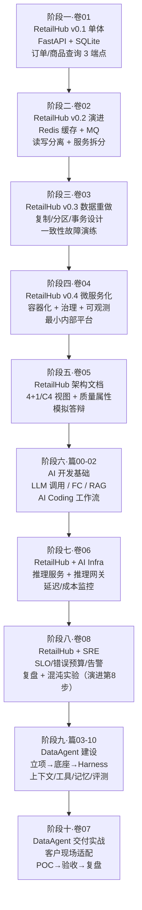

# 总纲：从小白到 AI 架构师——一条连贯的实战学习路径

> 这份总纲解决一个问题：**市面上的资料都很好，但它们彼此之间不认识**。你学了 DDIA 不知道怎么用在项目里，考了软考不知道怎么落地，跟完 Agent 课程又发现自己连"读写分离"都讲不清楚。这条路径把八组经典知识与一套现有 Agent 教程串成一根线：十个阶段、一个贯穿项目（RetailHub → DataAgent）、每卷都有可验收的实战产出。它的核心主张只有一句——**架构师不是读出来的，是在同一个项目上反复"拆掉重来"练出来的**。 RetailHub 这个项目会被你亲手拆掉至少四次（单体→服务化→存储重做→微服务化），每一次重建，你都在用更高的抽象层级理解同一个业务。

---

## 1. 这条路径为谁设计

适合：

- 会一点 Python（能写函数、会用 pip、跑过脚本），但没有系统做过服务端开发的人；
- 目标是成为"懂 AI、也懂架构"的工程师，而不是只会调 Prompt 的使用者；
- 认同"慢就是快"——愿意花 12–18 个月打地基，而不是 3 周速成。

不适合：

- 只想快速做出一个 Agent Demo 的人（直接读本目录的篇00–篇02 即可）；
- 已经有 3 年以上后端经验的人（可以从阶段三 DDIA 切入，跳过卷01–02）。

**入口判据**：如果你连 Python 都不会，先去读本目录 `篇00-小白前置篇.md` 的 Python/SQL 部分（第 1–3 节），通过它的自测清单后再回到这里。篇00 的 Demo 部分（LLM 调用）可以留到阶段六再看。

**总周期与投入**：

| 投入档位 | 每周时间 | 预计总周期 | 说明 |
|---|---|---|---|
| 脱产/高强度 | 20+ 小时 | 约 12 个月 | 学做比 4:6 严格执行 |
| 在职/标准 | 8–10 小时 | 约 15 个月 | 工作日每天 1 小时 + 周末一个半天实战 |
| 在职/低强度 | 5 小时 | 约 18 个月 | 实战不能砍，只能拉长周期 |

每周时间必须拆成两类：**"学"（读书、看文档、画笔记）和"做"（写代码、跑命令、写 ADR）**。建议比例 4:6，且每周至少有一次连续 2 小时以上的"做"的时间段——碎片时间只能学，做不了。

---

## 2. 十阶段学习地图总表

| 阶段 | 卷 | 核心知识 | 融合来源 | 项目状态（RetailHub） | 里程碑产出 |
|---|---|---|---|---|---|
| 一 服务端筑基 | 卷01 | HTTP 本质、REST、FastAPI、SQLite/MySQL、日志监控、Git、Linux 部署最小集 | 服务端工程通识 | FastAPI + SQLite 单体，订单/商品查询 3 个端点 | 一个能用 curl 验收的查询服务 |
| 二 服务端架构演进 | 卷02 | 缓存、消息队列、读写分离、服务拆分、接口契约 | 小白服务端架构演进实践 | 加 Redis/MQ，拆出订单服务与商品服务 | 一份"演进决策记录"（为什么拆、怎么拆） |
| 三 数据密集型系统 | 卷03 | 存储引擎、复制、分区、事务、一致性、流批处理 | DDIA（全书主线） | 重做存储与一致性设计，回答"数据为什么会错" | 存储设计文档 + 一致性故障演练记录 |
| 四 分布式架构与平台工程 | 卷04 | 微服务治理、可观测性、容器化、CI/CD、平台工程初体验 | 凤凰架构（周志明）；PI 按 Platform/Infra 平台工程理解 | 容器化部署，微服务治理，自建最小"内部平台" | 可一键启动的容器化系统 + 流水线 |
| 五 架构师方法论与软考 | 卷05 | 架构建模（4+1/C4）、质量属性权衡、架构评估、软考知识体系 | 软考系统架构设计师大纲；ATAM 等评估方法 | 产出 RetailHub 正式架构文档（达到可答辩水平） | 完整架构文档 + 模拟答辩记录 |
| 六 AI 开发基础 | 现有篇00/01/02 | LLM 训推机理、提示工程、AI Coding 方法论、Function Calling/RAG | 现有篇00–篇02 | 在 RetailHub 旁跑通 LLM 调用与最小 RAG | 三个 AI Demo + AI Coding 工作流 |
| 七 AI Infra | 卷06 | 模型推理服务、GPU 资源管理、推理网关、模型评测基建 | AI Infra 工程实践 | 接入模型推理服务（vLLM 类），建推理网关 | 可调用的内部模型服务 + 延迟/成本报表 |
| 八 SRE 与可靠性工程 | 卷08 | SLI/SLO 与错误预算、监控告警、事故管理与复盘、发布工程与容量规划、AI 服务 SRE | Google《Site Reliability Engineering》；金山办公 KAE 与 WPS 可靠性案例 | 为 RetailHub 立下 SLO，建告警规则集，完成复盘演练与混沌实验 | SLO 文档 + 告警规则集 + 复盘/混沌实验报告 |
| 九 AI Agent 企业工程化 | 现有篇03–篇10 + 分析报告 | 立项、LLM 底座、Harness、上下文/工具/记忆治理、评测进化 | 现有篇03–10（极客时间大纲扩展） | 在 RetailHub 之上建成多租户 DataAgent | 通过质量契约的企业级 Agent 系统 |
| 十 AI FDE 交付实战 | 卷07 | 交付工程、需求澄清、环境适配、POC 到验收、客户沟通 | AI FDE（Forward Deployed Engineer）方法论 | 模拟客户交付：把 DataAgent "部署到客户现场" | 交付包 + 验收报告 + 复盘 |

**读表要点**：每一阶段的"项目状态"列就是上一阶段的"里程碑产出"的下一形态。如果你发现自己在某个阶段做不出里程碑产出，说明上一阶段的最低通过标准没有真正达到——回炉，不要硬推。

---

## 3. 融合逻辑详解：为什么是这个顺序

### 3.1 为什么 DDIA 放在架构演进（卷02）之后，而不是开头

DDIA 是这条路线上信息密度最高的一本书，但它的前提是**你见过真实的系统问题**。一个没写过服务端代码的人读"复制延迟导致读到自己写之前的数据"，只会当成一句话背下来；而在卷02 里亲手给 RetailHub 加过读写分离、被"刚下的订单查不到"咬过一口的人，读到 DDIA 第五章会有生理性共鸣。所以顺序是：

1. 卷01：先会用——能把数据存进去、查出来；
2. 卷02：先踩坑——缓存不一致、主从延迟、服务拆分的分布式事务之痛；
3. 卷03：再悟道——用 DDIA 的系统化框架解释你踩过的每一个坑，并把你"土法"解决的坑换成有理论支撑的方案。

这叫"问题先行，理论殿后"。DDIA 在你手里是答案之书，不是天书。

### 3.2 凤凰架构与软考如何互补

这两份材料经常被对立看待，其实它们解决的是架构师能力的两个不同侧面：

- **凤凰架构（周志明）讲"机制的深度"**：微服务、容器、服务网格、可观测性为什么这样设计、演进的历史必然性是什么。它回答"这个东西到底是什么、为什么存在"。卷04 的主力材料。
- **软考（系统架构设计师）讲"知识的体系与表达"**：它用考试大纲的形式逼你把架构知识组织成完整体系（质量属性、建模方法、评估方法、架构风格），并且——同样重要——训练你**用正式文档表达架构决策**。软考论文题本质上是架构答辩的书面化训练。

一个人只读凤凰架构，容易"懂得多但说不清"；只准备软考，容易"说得出但都是名词"。卷04 用凤凰架构建深度，卷05 用软考建体系与表达，两者拼起来才是完整的架构师能力。

### 3.3 PI / 平台工程思想如何逐层体现

这里的 PI 按 Platform / Infra（平台工程）理解，它不是某一卷的专题，而是一条**贯穿三段的暗线**：

- **卷04（平台工程初体验）**：你在微服务化过程中会发现，每个服务都要重复做日志、配置、健康检查、部署脚本——这些重复劳动抽象出来就是"内部开发者平台"的最小雏形。这一层建立认知：平台 = 把共性工程能力沉淀成自助服务。
- **卷06（AI Infra 层）**：模型推理服务是平台工程在 AI 时代的核心场景。推理网关、模型路由、GPU 配额、延迟与成本监控——这些就是 AI 平台的底盘。这一层你会发现卷04 的微服务治理经验几乎全部可以平移。
- **阶段九（Agent 平台层）**：现有篇04–篇09 的 LLM Runtime、Harness、ToolOps、MemoryOps、EvalOps，本质上是在 AI Infra 之上再建一层"Agent 平台"。读完卷04/卷06 再读这些篇目，你会看出它们不是新发明，而是平台工程思想在 Agent 领域的第三次应用。

三次见到同一件事，你才算真正懂了平台工程。

### 3.4 为什么 SRE 插在 AI Infra 与 Agent 工程化之间

卷06 让你拥有了私有化推理服务，篇03–篇10 要你在其上构建企业级 Agent 系统——中间为什么插一整卷 SRE（卷08）？因为**Agent 系统的一切可靠性承诺，都建立在底座的 SRE 方法之上**。传统服务挂了，用户看到错误页；Agent 系统的"挂"更隐蔽：模型质量回归、TTFT 漂移、推理成本失控——没有 SLI/SLO、错误预算、告警与复盘这套机制，你连"系统现在是否健康"都无法回答，更谈不上向客户承诺。另一方面，阶段九篇09 的 EvalOps（评测与受控进化）本质上是 SRE 思想在模型质量维度的延伸：质量 SLI、受控发布、回归门禁，机制同源。先学会给传统服务立承诺（卷08），才配给智能体立承诺（阶段九）。这一卷还首次引入本土工业级样板——金山办公 KAE 与 WPS 混合云的可靠性工程，让你看到卷04 平台工程在 13600+ 微服务规模下的真实样子。

### 3.5 为什么 AI FDE 放在最后

AI FDE（Forward Deployed Engineer，前置部署工程师）是"带着产品去客户现场把它真正跑起来"的角色。它要求的不是某一项新技术，而是**前面所有阶段的叠加**：你要能读懂客户的存量系统（卷01–04）、能跟客户架构师对话（卷05）、能判断 Agent 在客户场景的可行性边界（阶段六/九）、能现场处理推理服务的性能与成本问题（卷06）、能拿出可靠性承诺并守住它（卷08）。把它放在最后不是因为它最难，而是因为它**没有新知识点，全是综合运用**——它是这条路径的"毕业设计"。

---

## 4. 贯穿项目时间线：RetailHub → DataAgent

注意阶段五在图上的位置：架构文档不是"补写"的，而是项目演进到 v0.4 后**第一次正式回头看**——这正是真实架构师的工作节奏：先让系统活下来，再让系统说得清。

---

## 5. 与现有篇00–篇10 的衔接说明

本目录已有的教程（README、00-课程分析报告、篇00–篇10）**不需要任何修改**，它们在这条路径中有明确位置：

- **篇00（小白前置篇）**：双重身份——完全零基础者的"入口桥梁"（用其 Python/SQL 部分）；同时也是**阶段六"AI 开发基础"**的第一块（其 Demo 部分）。
- **篇01–篇02**：即阶段六的主体，讲 AI 认知与 AI Coding 方法论。放在卷05 之后，是因为此时你已经会写服务端、会读架构文档，学 AI 时能立刻分清"哪些是工程问题、哪些是模型问题"。
- **篇03–篇10 + 00-课程分析报告**：即阶段九"AI Agent 企业工程化"的全部内容。篇03 立项时假设的"零售数据平台底座"，将由卷01–卷06 演进而来的 RetailHub 真实提供——你不再是"脑补"一个底座，而是真的拥有一个。
- 阶段七（卷06 AI Infra）插在篇02 与篇03 之间，衔接极其自然：篇04 的"LLM 执行底座"讲如何使用推理能力，卷06 讲这些推理能力从何而来、如何运维。阶段八（卷08 SRE 与可靠性工程）紧随其后——推理能力就位之后、Agent 系统开工之前，先为底座立下 SLO 与告警体系；篇09 的 EvalOps 届时会被你看作"SRE 方法在模型质量上的应用"，而不是孤立的新概念。

---

## 6. 学习方法论

### 6.1 学做比 4:6，且"做"优先排期

每周计划先排"做"的时间段（至少一段连续 2 小时），剩下的缝隙填"学"。反过来排的结果一定是只剩学、没有做。

### 6.2 笔记与 ADR

- **读书笔记用自己的话写**，格式推荐"一句话主张 + 一个 RetailHub 中的例子 + 一个我的疑问"。抄书 = 没读。
- **每个架构决策写一条 ADR**（Architecture Decision Record）：背景 → 选项 → 决定 → 后果。卷02 起每次项目演进至少产出 1 条。ADR 不需要长，200 字即可，但必须真实记录"当时为什么这样选"——三个月后你review 自己的 ADR，就是架构判断力长出来的声音。

### 6.3 "能否讲给别人听"自验法

每卷学完，给自己出一个费曼测试：**假装向一个比你低一阶段的人讲解本卷核心概念**（可以真的找朋友，可以写下来，也可以讲给 AI 听然后让 AI 挑刺）。讲不清楚的地方就是没懂的地方，回炉重学那一节，不要带病前进。

---

## 7. 掉队与补救：每阶段的最低通过标准

最低通过标准是"可以带病前进"的底线——低于此线，强行进入下一阶段会让债务复利。

| 阶段 | 最低通过标准（全部满足才可进入下一阶段） |
|---|---|
| 一 | 不看教程能重写 3 个端点中的任意 2 个；能解释 404/422/500 的区别；服务能用 systemd 拉起来 |
| 二 | 能讲清"缓存击穿/穿透/雪崩"并在项目里防住至少一个；能画出拆分后服务间的调用图 |
| 三 | 能用自己的话解释"主从延迟导致的读己之写不一致"及至少两种解法；完成一次一致性故障演练 |
| 四 | `docker compose up` 一条命令拉起整个系统；能定位一次跨服务调用的完整链路日志 |
| 五 | 架构文档能让一个不了解项目的人在 30 分钟内看懂系统全貌；模拟答辩中质量属性权衡题不卡壳 |
| 六 | 通过篇00 自测清单；能用 Function Calling 让模型查一次 RetailHub 的订单 |
| 七 | 推理网关能限流并记录每次调用的延迟与 token 成本；能讲清吞吐与延迟的权衡 |
| 八 | 写出 3 个带口径与错误预算的 SLO；告警规则覆盖四个黄金信号且每条可行动；完成 1 次复盘演练与 1 次混沌实验 |
| 九 | 完成篇03–09 的动手练习；DataAgent 通过自己定义的质量契约基线 |
| 十 | 交付包在"全新环境"（干净的机器/容器）中按文档独立完成部署并通过验收 |

**掉队信号**：连续两周没有代码产出；笔记变成抄书；遇到坑跳过不记录。出现任一信号，停一周，只做一件事——把当前阶段的实战部分重做一遍。

---

## 8. 下一步

读 [卷01-服务端筑基](./卷01-服务端筑基.md)，开始 RetailHub 的第一步。

> 说明：本总纲及配套各卷为原创自学材料；DDIA、凤凰架构、软考大纲等均为公开出版物/公开考纲的引用与融合，建议配合原书阅读。
