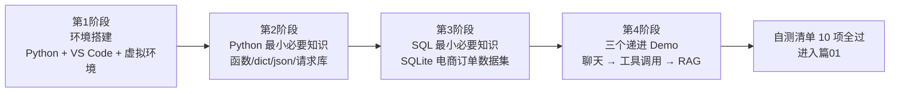
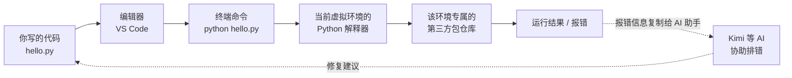
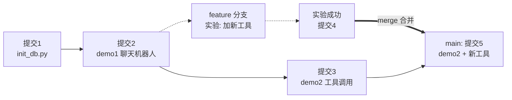

# 篇00-1：前置知识（上）——基本功：环境、命令行、Git 与 Python/SQL

> 导语：本页是「篇00 前置知识」的上半部分，面向真正的零基础读者。**这页学什么**：开发环境三概念（解释器 / 第三方包 / 虚拟环境）、10 条命令行生存命令、Git 最小操作、Python 七件最小知识与 SQLite 五个必会查询。**学完能做什么**：你能在自己电脑上装好隔离的 Python 环境并跑通验证、用 Git 给代码打快照、读懂并亲手运行每一段小脚本，还能建出贯穿项目要用的电商订单库 `shop.db`——这些都是下一页三个 LLM Demo 的地基，也是进入篇01 的硬门槛。本页与正篇共用同一个贯穿项目语境「多租户零售经营分析 DataAgent」[^course]，第 4 节的订单库就是它的第一块基石，后面篇03 立项时会直接复用。
>
> **使用本页的三个建议**：第一，所有代码都必须亲手敲一遍（或至少亲手复制运行一遍），只看不跑等于没学；第二，遇到报错先把完整报错信息喂给 Kimi 或其他 AI 助手提问——学会用 AI 学 AI，本身就是本教程要培养的能力；第三，不要跳过第 3、4 节直接去玩下一页的 Demo——Demo 2 要用到 dict、json、异常处理和 SQL 查询，前面欠的账会在 Debug 时加倍偿还。

---

## 1. 学习地图与时间安排

零基础到"能开始篇01"，快则 4 周（每天 1~1.5 小时），慢则 8 周（每周 3~4 次、每次 1 小时）。路线不分岔，只有一条：



| 阶段 | 时间（4 周版 / 8 周版） | 每周目标 | 产出物 |
|---|---|---|---|
| 一、环境搭建 | 第 1 周 / 第 1–2 周 | 装好 Python 3.11+、VS Code、虚拟环境；跑通 `hello.py` | 一个可用的项目目录 + 验证命令全部通过 |
| 二、Python 最小知识 | 第 2 周 / 第 3–4 周 | 掌握函数、dict/list、异常、f-string、json、httpx/requests | 每个知识点一段可运行小脚本 |
| 三、SQL 最小知识 | 第 3 周 / 第 5–6 周 | 用 SQLite 建出订单/商品两张表，会写 SELECT/WHERE/JOIN/GROUP BY | `shop.db` 数据库 + 5 条查询脚本 |
| 四、三个递进 Demo | 第 4 周 / 第 7–8 周 | 跑通聊天机器人、Function Calling 小 Agent、最小 RAG | 3 个可运行的 `.py` 文件 + 每步运行日志 |

**节奏建议**：不要跳过阶段二、三直接玩 Demo。Demo 2 要用到 dict、json、异常处理和 SQL 查询，前面欠的账会在 Debug 时加倍偿还。

---

## 2. 环境搭建（macOS 为主，兼顾 Windows）

### 2.0 先讲"为什么"：开发环境到底是什么

很多小白把"装环境"当成纯体力活，跟着教程敲命令、报错就换一篇教程。其实环境搭建背后只有三个概念，理解了它们，90% 的报错你都能自己看懂：

1. **解释器（Interpreter）**：Python 代码本身只是文本文件，必须有一个叫"解释器"的程序逐行读懂并执行它。你安装的 `python3.11` 就是这个程序。电脑上可以同时存在好几个解释器（系统自带 3.9、你装的 3.11……），"用哪个"取决于你调用了哪个可执行文件——这就是"多版本混乱"这个天坑的根源。
2. **第三方包（Packages）**：别人写好的可复用代码（如 `openai`、`httpx`），用 `pip`/`uv` 从网上仓库（PyPI）下载到本地。**包是被装到"某个解释器"名下的**——装错了解释器，`import` 时就找不到。
3. **虚拟环境（Virtual Environment）**：给每个项目圈一块独立领地，领地里有自己专属的"解释器指针 + 一套包"。A 项目要 openai 1.x，B 项目要 openai 2.x，互不打架。它解决的不是"能不能跑"，而是"多个项目在同一台机器上长期共存"的问题——这是工程思维的第一课：**环境即依赖，依赖必须隔离且可复现**[^venv]。

**那为什么要用命令行（终端），而不是点点鼠标？** 三个原因：第一，**可复现**——命令是文本，可以复制、记录、写进文档和脚本，鼠标点击不能；第二，**可自动化**——后面篇05 的 Harness、CI 流水线全都是命令的编排，图形界面没有 API；第三，**AI 协作的基本面**——你给 AI 助手描述问题时，贴一段终端输出截图文字，AI 能精确理解；描述"我点了一个按钮它变灰了"，谁也帮不了你。学会和终端相处，是学会和 AI 协作的前置技能。

整个开发环境的数据流，记住这张图就够了——后面所有排错都是在定位"这条链路的哪一环断了"：



> **导师提示**：每次遇到 `ModuleNotFoundError`、`command not found` 这类报错，先问自己——"我现在站在图的哪一环？我激活的虚拟环境是哪一个？" 八成的问题答案就在这里。

### 2.1 安装 Python 3.11+

**macOS**：推荐用 Homebrew（没有的话先装 Homebrew：https://brew.sh，一行命令）：

```bash
brew install python@3.11
python3 --version    # 期望输出 Python 3.11.x 或更高
```

**Windows**：到 https://www.python.org/downloads/ 下载 3.11+ 安装包，安装时**务必勾选 "Add Python to PATH"**，装完打开"终端 / PowerShell"运行：

```powershell
python --version     # 期望输出 Python 3.11.x 或更高
```

> Windows 上 `python` 和 `python3` 可能只有一个可用，以能输出版本号的那个为准，后文命令自行替换。

### 2.2 安装 VS Code

到 https://code.visualstudio.com 下载安装。装两个官方扩展：**Python**（Microsoft 出品）和 **Pylance**。装完后用 VS Code 打开你的项目文件夹，后续所有代码都在里面写。

### 2.3 创建项目与虚拟环境（uv 或 venv+pip）

**虚拟环境是新手最该养成的习惯**：它给每个项目一个独立的"包仓库"，避免不同项目的依赖互相打架。

方式 A（推荐，用 uv，快且省心）：

```bash
# 安装 uv：macOS/Linux
curl -LsSf https://astral.sh/uv/install.sh | sh
# Windows 用 PowerShell：powershell -c "irm https://astral.sh/uv/install.ps1 | iex"

mkdir agent-tutorial && cd agent-tutorial
uv venv                      # 创建 .venv 虚拟环境
source .venv/bin/activate    # 激活（Windows: .venv\Scripts\activate）
uv pip install openai httpx  # 装包
```

方式 B（标准库自带，无需额外安装）：

```bash
mkdir agent-tutorial && cd agent-tutorial
python3 -m venv .venv
source .venv/bin/activate    # Windows: .venv\Scripts\activate
pip install openai httpx
```

**验证环境**（在激活虚拟环境后执行）：

```bash
python -c "import openai, httpx; print('环境 OK')"
```

输出 `环境 OK` 即通过。注意激活后命令行提示符前面会出现 `(.venv)` 字样。

**把"激活虚拟环境"想明白**：激活脚本做的事其实很小——它把 `.venv/bin` 这个目录**临时加到了终端的 PATH 环境变量最前面**。于是你敲 `python` 时，终端优先找到的是 `.venv/bin/python` 而不是系统 Python；`pip install` 装的包自然也落进这个环境的仓库。这就是为什么"换了一个终端窗口，环境就丢了"——环境变量只在当前窗口生效，新窗口要重新激活。理解了这一层，"为什么我在 VS Code 里能跑、在终端里跑不了"这类问题就不会再困扰你。

**环境自检（交互清单）**：下面这个小工具把"环境是否健康"做成了 8 项可逐项核对的体检表。建议装完环境后对着走一遍——每过一项打一次勾，全部通过会给出进入下一步的结论；任何一项卡住，按它给出的终端命令去验证：

```demo env-check
```

**Demo 导学单**

1. 先不按顺序乱点几项，观察顶部进度条和底部结论区的变化——理解"8 项全过"才是终点判据。
2. 找到"虚拟环境已激活"这一项，阅读它附带的验证命令，在你的真实终端里敲一遍，对比输出。
3. 故意留最后一项不打勾，读结论区给出的"最常见短板"提示，想想它为什么把 API key 单列为一项。
4. 全部打勾后，把结论区的"环境数据流一句话总结"和第 2.0 节的 mermaid 图对照一遍，确认每一环你都亲手验证过。

### 2.4 常见坑对照

| 坑 | 现象 | 解法 |
|---|---|---|
| 多 Python 版本混乱 | `python3 --version` 显示 3.9，`brew install` 的 3.11 找不到 | 用全路径调用，如 `/opt/homebrew/bin/python3.11 -m venv .venv`；虚拟环境一旦创建，里面的 Python 就是创建它的那个版本 |
| 权限报错 | `pip install` 报 Permission denied | **不要加 sudo**。确认已激活虚拟环境（提示符有 `(.venv)`） |
| 网络超时 | 装包卡住或报 Read timed out | 换国内镜像：`pip install -i https://pypi.tuna.tsinghua.edu.cn/simple openai httpx` |
| 激活失败 | Windows PowerShell 报"禁止运行脚本" | 管理员 PowerShell 执行一次：`Set-ExecutionPolicy -ExecutionPolicy RemoteSigned -Scope CurrentUser` |
| 公司代理 | API 请求连不上 | 排查代理环境变量 `HTTP_PROXY/HTTPS_PROXY`；必要时在代码里给 httpx 配代理 |

### 2.5 Git 最小必要知识：代码的"时间机器"

**为什么学 Agent 之前要先学 Git？** 因为接下来你要写大量实验性代码——改 Demo、让 AI 帮你重构、试错。没有版本控制，"改坏了想回到能跑的版本"只能靠记忆和文件名后缀（`demo2_final_真最终版.py`）。Git 给你的东西用一句话说：**代码的每一次有意义的变更都被快照存档，随时可以对比、回退、开平行宇宙。**[^git]

三个核心概念，先建立心智模型再敲命令：

1. **仓库（Repository）**：一个被 Git 托管的目录，里面有个隐藏的 `.git` 文件夹，存着全部历史。
2. **提交（Commit）**：一次快照 + 一句说明（"新增 query_orders 工具"）。提交是 Git 世界的基本单位——**提交要小而频繁，每次只干一件事**。
3. **分支（Branch）**：从某个提交长出来的平行时间线。主分支 `main` 保持"随时能跑"，实验在 feature 分支上做，成功了再合并回去。



最小命令集（今天就会用到）：

```bash
git init                          # 在当前目录初始化仓库（每个项目做一次）
git status                        # 随时看：哪些文件改了、哪些还没存档
git add demo1_chat.py             # 把文件放进"待提交区"
git commit -m "新增聊天机器人 Demo"   # 打快照，说明写人话
git log --oneline                 # 看历史时间线
git checkout -b experiment        # 开一个实验分支并切过去
git checkout main                 # 切回主分支
git merge experiment              # 把实验分支合并回 main
```

**两条新手铁律**：第一，建仓库后立刻创建 `.gitignore` 文件，写入 `.venv/`、`__pycache__/`、`.env`、`shop.db`——虚拟环境、缓存、密钥、本地数据库**永远不进仓库**；第二，**API key 即使只提交过一次也要当作已泄露**，立刻去服务商后台作废重发，删文件救不回来（历史里还在）。

> 本教程不深入 Git 协作（冲突解决、远程仓库、Pull Request），那属于篇02「器」层面团队工作流的内容。这里你只需要养成一个习惯：**每次 Demo 跑通，立刻 commit。** 这个习惯会在你第一次把能跑的代码改崩时救你一命。

### 2.6 命令行生存指南（附录式速查）

后面所有操作都在终端里完成，这 10 条命令覆盖 95% 的日常：

| 命令 | 作用 | 类比 |
|---|---|---|
| `pwd` | 我现在在哪个目录 | 看手机地图的定位点 |
| `ls`（Win: `dir`） | 当前目录有什么 | 打开文件夹看一眼 |
| `cd 目录名` | 进入某目录；`cd ..` 返回上一层 | 走进/走出房间 |
| `mkdir 名字` | 新建目录 | 新建文件夹 |
| `touch a.py`（Win: `ni a.py`） | 新建空文件 | 新建空白文档 |
| `cat a.py`（Win: `type a.py`） | 查看文件内容 | 双击打开看一眼 |
| `cp a.py b.py` | 复制文件 | 复制粘贴 |
| `mv a.py sub/` | 移动/重命名文件 | 剪切粘贴 |
| `rm a.py`（慎用） | 删除文件，**不进回收站** | 粉碎文件 |
| `echo $DEEPSEEK_API_KEY` | 查看环境变量的值 | 看便利贴上写了什么 |

一个高频心法：**终端的报错是"读出来的"，不是"看出来的"。** 报错文本从最后一行往前读，最后一行是错误类型和原因，上面的 Traceback 是"出错时程序走到哪了"。把完整的报错文本复制给 AI 助手提问，是小白最快的成长路径。

---

## 3. Python 最小必要知识

只讲后面 Demo 用到的七件事，每件配一段可直接运行的小例子。

**为什么是这七件？** 因为 Agent 代码的本质就三句话：**把数据装成 dict/list 发给模型（3.2、3.4、3.5），把模型返回的 JSON 解析出来（3.5），据此决定调哪个函数、失败了就兜住（3.1、3.3、3.6）**。学会了它们，你看任何 Agent 框架的源码都不会发怵——框架再厚，剥到底层也是这七个零件在转。学的时候建议每个例子都故意改坏一次（比如删掉一个引号、传错一个类型），亲眼看看报错长什么样——认识报错和认识语法同样重要。

### 3.1 函数

函数是"输入 → 加工 → 输出"的黑盒。Agent 里的每个工具就是一个 Python 函数。

```python
def add(a: float, b: float) -> float:
    """两个数相加。这个 docstring 后面会喂给模型看。"""
    return a + b

result = add(3, 4)      # 调用
print(result)           # 7
```

### 3.2 dict 与 list

dict（字典）是键值对，list（列表）是有序集合。**模型 API 的 messages、工具定义、返回结果，全都是 dict 和 list 的嵌套**——看懂它们就看懂了一半的 Agent 代码。

**为什么偏偏是 dict/list 统治了 Agent 世界？** 因为它们恰好对应 JSON 的两种结构，而 JSON 是整个 LLM 生态的"通用货币"：API 请求与响应、工具定义、工具参数、配置文件，全是 JSON。可以把 dict 想成一张**登记表**（键是栏目名，值是填写内容），list 想成**一叠按顺序码放的登记表**——`messages` 就是"一叠对话登记表"，每轮对话往上加一张。

```python
message = {"role": "user", "content": "你好"}   # dict
messages = [                                     # list 装 dict
    {"role": "system", "content": "你是助手"},
    message,
]
print(messages[1]["content"])   # 你好：先取第 2 个元素，再取 content 键
messages.append({"role": "assistant", "content": "你好！"})  # 追加一轮
print(len(messages))            # 3
```

### 3.3 异常处理

网络请求、JSON 解析都会失败。用 `try/except` 兜住，程序才不会一错就崩。

```python
try:
    value = int("abc")          # 这行会抛 ValueError
except ValueError as e:
    print(f"转换失败：{e}")      # 打印错误，程序继续往下走
```

### 3.4 f-string

在字符串里嵌变量的最简写法，打印日志全靠它。

```python
name, count = "订单", 5
print(f"查到 {count} 条{name}")   # 查到 5 条订单
```

### 3.5 json 模块

模型返回的工具参数是 JSON 字符串，要解析成 dict 才能用；反过来 dict 也能序列化成 JSON 字符串。

```python
import json

text = '{"name": "calculator", "arguments": {"expr": "1+2"}}'
data = json.loads(text)              # JSON 字符串 → dict
print(data["arguments"]["expr"])     # 1+2
print(json.dumps(data, ensure_ascii=False))  # dict → JSON 字符串
```

### 3.6 requests / httpx（HTTP 请求库）

调用第三方 HTTP 接口用。`openai` SDK 底层就是 httpx，理解一次"发请求拿响应"对后面排错很有帮助。

```python
import httpx

resp = httpx.get("https://api.github.com/zen", timeout=10)
print(resp.status_code)   # 200 表示成功；401 是认证失败；429 是被限流
print(resp.text)          # 响应正文
```

### 3.7 虚拟环境装包

第三方库不内置在 Python 里，要在**已激活的虚拟环境**中安装：

```bash
pip install openai httpx        # 或 uv pip install openai httpx
python -c "import openai; print(openai.__version__)"   # 验证装上了
```

---

## 4. SQL 最小必要知识（SQLite 版）

**为什么学前置 SQL？** 本教程包的贯穿项目是「多租户零售经营分析 DataAgent」——一个用自然语言查经营数据的 Agent。它的大脑是 LLM，但它的手是 SQL。这里用 SQLite 学最小集合：SQLite 免安装服务、单文件存储，Python 内置 `sqlite3` 模块直接可用。

### 4.1 建表 + 造数（电商订单小数据集）

把下面代码存为 `init_db.py` 运行一次，生成 `shop.db`：

```python
import sqlite3

conn = sqlite3.connect("shop.db")   # 不存在则自动创建
cur = conn.cursor()
cur.executescript("""
CREATE TABLE IF NOT EXISTS products (
    id INTEGER PRIMARY KEY, name TEXT, category TEXT, price REAL);
CREATE TABLE IF NOT EXISTS orders (
    id INTEGER PRIMARY KEY, product_id INTEGER, quantity INTEGER,
    amount REAL, status TEXT, created_at TEXT);
DELETE FROM products; DELETE FROM orders;
INSERT INTO products VALUES
    (1,'机械键盘','数码',399.0),(2,'保温杯','家居',89.0),(3,'耳机','数码',699.0);
INSERT INTO orders(product_id,quantity,amount,status,created_at) VALUES
    (1,2,798.0,'已完成','2025-01-05'),(2,5,445.0,'已完成','2025-01-06'),
    (3,1,699.0,'已退款','2025-01-07'),(1,1,399.0,'已完成','2025-01-08'),
    (2,3,267.0,'已完成','2025-01-09');
""")
conn.commit()
print("初始化完成"); conn.close()
```

### 4.2 五个必会查询

```python
import sqlite3

conn = sqlite3.connect("shop.db")
cur = conn.cursor()

# 1) SELECT：全表查
cur.execute("SELECT * FROM products")
print(cur.fetchall())

# 2) WHERE：条件过滤
cur.execute("SELECT name, price FROM products WHERE price > 100")

# 3) JOIN：两表关联——每笔订单买的是哪个商品
cur.execute("""
    SELECT o.id, p.name, o.quantity, o.amount
    FROM orders o JOIN products p ON o.product_id = p.id
""")

# 4) GROUP BY：分组聚合——各品类总销售额
cur.execute("""
    SELECT p.category, SUM(o.amount) AS gmv
    FROM orders o JOIN products p ON o.product_id = p.id
    WHERE o.status = '已完成'
    GROUP BY p.category
""")

# 5) 参数化查询（防 SQL 注入，Demo 2 会用到）
cur.execute("SELECT * FROM orders WHERE status = ?", ("已完成",))
rows = cur.fetchall()
print(f"已完成订单 {len(rows)} 条")
conn.close()
```

**三条要点**：`?` 占位符传参永远比 f-string 拼 SQL 安全；`JOIN ... ON` 是把两张表"按外键对齐"；`GROUP BY` 配合 `SUM/COUNT` 就是经营分析的日常。Demo 2 的 `query_orders` 工具就是这套东西。

---

## 参考与脚注

[^course]: 极客时间专栏《企业级 Agent 工程化》——本教程「篇00–篇10」这条线的重构蓝本，贯穿项目 DataAgent 的里程碑划分与治理机制均源自该课程的方法论体系。
[^venv]: Python 官方文档，《venv — 创建虚拟环境》："每个虚拟环境都有自己的 Python 二进制文件和独立的 site-packages 目录"，https://docs.python.org/zh-cn/3/library/venv.html 。
[^git]: Scott Chacon, Ben Straub《Pro Git（第二版）》，第 1–3 章（起步、Git 基础、分支），官方免费中译本，https://git-scm.com/book/zh/v2 。

---

➡️ 下一页：[篇00-2 · 前置知识（下）——三个递进 Demo 与实战](篇00-2-三个递进Demo.md)（聊天机器人 → Function Calling → 最小 RAG）
