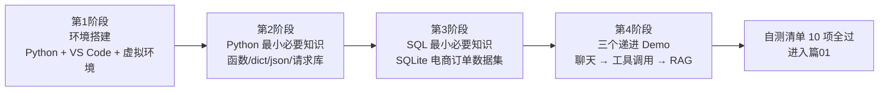
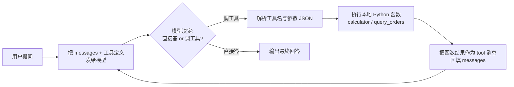

# 篇00：小白前置篇——从零基础到能开始篇01 的桥梁

> 导语：本教程包的正篇（篇01–篇10）默认你"做过 LLM Demo"——至少调通过一次模型 API、跑过一轮工具调用。如果你看到 `messages`、`Function Calling`、`Embedding` 这些词还发怵，或者电脑上连 Python 环境都没有，那么本篇就是为你准备的。本篇不追求深度，只追求一件事：**把真正的零基础读者带到篇01 的起点**。读完本篇的终点判据非常具体——你能独立写出并跑通这样一个循环：**模型调用你自定义的 Python 函数、拿到函数返回结果、再基于结果继续生成回答**。这个循环就是一切 Agent 的最小骨架，也是篇05「Agent Harness 与 Runtime」里所有复杂机制的雏形。本篇全部内容围绕这条主线展开：环境 → Python 最小知识 → SQL 最小知识 → 三个递进 Demo（聊天机器人 → Function Calling 小 Agent → 最小 RAG）。只讲后面 Demo 用得到的，不多讲一句。

**使用本篇的三个建议**：第一，所有代码都必须亲手敲一遍（或至少亲手复制运行一遍），只看不跑等于没学；第二，遇到报错先查各 Demo 末尾的"常见报错对照表"，查不到再把完整报错信息喂给 Kimi 或其他 AI 助手提问——学会用 AI 学 AI，本身就是本教程要培养的能力；第三，本篇与正篇共用同一个贯穿项目语境「多租户零售经营分析 DataAgent」，第 4 节的电商订单库和第 5 节的 `query_orders` 工具，就是它的第一块基石，后面篇03 立项时会直接复用。

---

## 1. 学习地图与时间安排

零基础到"能开始篇01"，快则 4 周（每天 1~1.5 小时），慢则 8 周（每周 3~4 次、每次 1 小时）。路线不分岔，只有一条：



| 阶段 | 时间（4 周版 / 8 周版） | 每周目标 | 产出物 |
|---|---|---|---|
| 一、环境搭建 | 第 1 周 / 第 1–2 周 | 装好 Python 3.11+、VS Code、虚拟环境；跑通 `hello.py` | 一个可用的项目目录 + 验证命令全部通过 |
| 二、Python 最小知识 | 第 2 周 / 第 3–4 周 | 掌握函数、dict/list、异常、f-string、json、httpx/requests | 每个知识点一段可运行小脚本 |
| 三、SQL 最小知识 | 第 3 周 / 第 5–6 周 | 用 SQLite 建出订单/商品两张表，会写 SELECT/WHERE/JOIN/GROUP BY | `shop.db` 数据库 + 5 条查询脚本 |
| 四、三个递进 Demo | 第 4 周 / 第 7–8 周 | 跑通聊天机器人、Function Calling 小 Agent、最小 RAG | 3 个可运行的 `.py` 文件 + 每步运行日志 |

**节奏建议**：不要跳过阶段二、三直接玩 Demo。Demo 2 要用到 dict、json、异常处理和 SQL 查询，前面欠的账会在 Debug 时加倍偿还。

---

## 2. 环境搭建（macOS 为主，兼顾 Windows）

### 2.1 安装 Python 3.11+

**macOS**：推荐用 Homebrew（没有的话先装 Homebrew：https://brew.sh，一行命令）：

```bash
brew install python@3.11
python3 --version    # 期望输出 Python 3.11.x 或更高
```

**Windows**：到 https://www.python.org/downloads/ 下载 3.11+ 安装包，安装时**务必勾选 "Add Python to PATH"**，装完打开"终端 / PowerShell"运行：

```powershell
python --version     # 期望输出 Python 3.11.x 或更高
```

> Windows 上 `python` 和 `python3` 可能只有一个可用，以能输出版本号的那个为准，后文命令自行替换。

### 2.2 安装 VS Code

到 https://code.visualstudio.com 下载安装。装两个官方扩展：**Python**（Microsoft 出品）和 **Pylance**。装完后用 VS Code 打开你的项目文件夹，后续所有代码都在里面写。

### 2.3 创建项目与虚拟环境（uv 或 venv+pip）

**虚拟环境是新手最该养成的习惯**：它给每个项目一个独立的"包仓库"，避免不同项目的依赖互相打架。

方式 A（推荐，用 uv，快且省心）：

```bash
# 安装 uv：macOS/Linux
curl -LsSf https://astral.sh/uv/install.sh | sh
# Windows 用 PowerShell：powershell -c "irm https://astral.sh/uv/install.ps1 | iex"

mkdir agent-tutorial && cd agent-tutorial
uv venv                      # 创建 .venv 虚拟环境
source .venv/bin/activate    # 激活（Windows: .venv\Scripts\activate）
uv pip install openai httpx  # 装包
```

方式 B（标准库自带，无需额外安装）：

```bash
mkdir agent-tutorial && cd agent-tutorial
python3 -m venv .venv
source .venv/bin/activate    # Windows: .venv\Scripts\activate
pip install openai httpx
```

**验证环境**（在激活虚拟环境后执行）：

```bash
python -c "import openai, httpx; print('环境 OK')"
```

输出 `环境 OK` 即通过。注意激活后命令行提示符前面会出现 `(.venv)` 字样。

### 2.4 常见坑对照

| 坑 | 现象 | 解法 |
|---|---|---|
| 多 Python 版本混乱 | `python3 --version` 显示 3.9，`brew install` 的 3.11 找不到 | 用全路径调用，如 `/opt/homebrew/bin/python3.11 -m venv .venv`；虚拟环境一旦创建，里面的 Python 就是创建它的那个版本 |
| 权限报错 | `pip install` 报 Permission denied | **不要加 sudo**。确认已激活虚拟环境（提示符有 `(.venv)`） |
| 网络超时 | 装包卡住或报 Read timed out | 换国内镜像：`pip install -i https://pypi.tuna.tsinghua.edu.cn/simple openai httpx` |
| 激活失败 | Windows PowerShell 报"禁止运行脚本" | 管理员 PowerShell 执行一次：`Set-ExecutionPolicy -ExecutionPolicy RemoteSigned -Scope CurrentUser` |
| 公司代理 | API 请求连不上 | 排查代理环境变量 `HTTP_PROXY/HTTPS_PROXY`；必要时在代码里给 httpx 配代理 |

---

## 3. Python 最小必要知识

只讲后面 Demo 用到的七件事，每件配一段可直接运行的小例子。

### 3.1 函数

函数是"输入 → 加工 → 输出"的黑盒。Agent 里的每个工具就是一个 Python 函数。

```python
def add(a: float, b: float) -> float:
    """两个数相加。这个 docstring 后面会喂给模型看。"""
    return a + b

result = add(3, 4)      # 调用
print(result)           # 7
```

### 3.2 dict 与 list

dict（字典）是键值对，list（列表）是有序集合。**模型 API 的 messages、工具定义、返回结果，全都是 dict 和 list 的嵌套**——看懂它们就看懂了一半的 Agent 代码。

```python
message = {"role": "user", "content": "你好"}   # dict
messages = [                                     # list 装 dict
    {"role": "system", "content": "你是助手"},
    message,
]
print(messages[1]["content"])   # 你好：先取第 2 个元素，再取 content 键
messages.append({"role": "assistant", "content": "你好！"})  # 追加一轮
print(len(messages))            # 3
```

### 3.3 异常处理

网络请求、JSON 解析都会失败。用 `try/except` 兜住，程序才不会一错就崩。

```python
try:
    value = int("abc")          # 这行会抛 ValueError
except ValueError as e:
    print(f"转换失败：{e}")      # 打印错误，程序继续往下走
```

### 3.4 f-string

在字符串里嵌变量的最简写法，打印日志全靠它。

```python
name, count = "订单", 5
print(f"查到 {count} 条{name}")   # 查到 5 条订单
```

### 3.5 json 模块

模型返回的工具参数是 JSON 字符串，要解析成 dict 才能用；反过来 dict 也能序列化成 JSON 字符串。

```python
import json

text = '{"name": "calculator", "arguments": {"expr": "1+2"}}'
data = json.loads(text)              # JSON 字符串 → dict
print(data["arguments"]["expr"])     # 1+2
print(json.dumps(data, ensure_ascii=False))  # dict → JSON 字符串
```

### 3.6 requests / httpx（HTTP 请求库）

调用第三方 HTTP 接口用。`openai` SDK 底层就是 httpx，理解一次"发请求拿响应"对后面排错很有帮助。

```python
import httpx

resp = httpx.get("https://api.github.com/zen", timeout=10)
print(resp.status_code)   # 200 表示成功；401 是认证失败；429 是被限流
print(resp.text)          # 响应正文
```

### 3.7 虚拟环境装包

第三方库不内置在 Python 里，要在**已激活的虚拟环境**中安装：

```bash
pip install openai httpx        # 或 uv pip install openai httpx
python -c "import openai; print(openai.__version__)"   # 验证装上了
```

---

## 4. SQL 最小必要知识（SQLite 版）

**为什么学前置 SQL？** 本教程包的贯穿项目是「多租户零售经营分析 DataAgent」——一个用自然语言查经营数据的 Agent。它的大脑是 LLM，但它的手是 SQL。这里用 SQLite 学最小集合：SQLite 免安装服务、单文件存储，Python 内置 `sqlite3` 模块直接可用。

### 4.1 建表 + 造数（电商订单小数据集）

把下面代码存为 `init_db.py` 运行一次，生成 `shop.db`：

```python
import sqlite3

conn = sqlite3.connect("shop.db")   # 不存在则自动创建
cur = conn.cursor()
cur.executescript("""
CREATE TABLE IF NOT EXISTS products (
    id INTEGER PRIMARY KEY, name TEXT, category TEXT, price REAL);
CREATE TABLE IF NOT EXISTS orders (
    id INTEGER PRIMARY KEY, product_id INTEGER, quantity INTEGER,
    amount REAL, status TEXT, created_at TEXT);
DELETE FROM products; DELETE FROM orders;
INSERT INTO products VALUES
    (1,'机械键盘','数码',399.0),(2,'保温杯','家居',89.0),(3,'耳机','数码',699.0);
INSERT INTO orders(product_id,quantity,amount,status,created_at) VALUES
    (1,2,798.0,'已完成','2025-01-05'),(2,5,445.0,'已完成','2025-01-06'),
    (3,1,699.0,'已退款','2025-01-07'),(1,1,399.0,'已完成','2025-01-08'),
    (2,3,267.0,'已完成','2025-01-09');
""")
conn.commit()
print("初始化完成"); conn.close()
```

### 4.2 五个必会查询

```python
import sqlite3

conn = sqlite3.connect("shop.db")
cur = conn.cursor()

# 1) SELECT：全表查
cur.execute("SELECT * FROM products")
print(cur.fetchall())

# 2) WHERE：条件过滤
cur.execute("SELECT name, price FROM products WHERE price > 100")

# 3) JOIN：两表关联——每笔订单买的是哪个商品
cur.execute("""
    SELECT o.id, p.name, o.quantity, o.amount
    FROM orders o JOIN products p ON o.product_id = p.id
""")

# 4) GROUP BY：分组聚合——各品类总销售额
cur.execute("""
    SELECT p.category, SUM(o.amount) AS gmv
    FROM orders o JOIN products p ON o.product_id = p.id
    WHERE o.status = '已完成'
    GROUP BY p.category
""")

# 5) 参数化查询（防 SQL 注入，Demo 2 会用到）
cur.execute("SELECT * FROM orders WHERE status = ?", ("已完成",))
rows = cur.fetchall()
print(f"已完成订单 {len(rows)} 条")
conn.close()
```

**三条要点**：`?` 占位符传参永远比 f-string 拼 SQL 安全；`JOIN ... ON` 是把两张表"按外键对齐"；`GROUP BY` 配合 `SUM/COUNT` 就是经营分析的日常。Demo 2 的 `query_orders` 工具就是这套东西。

---

## 5. 三个递进 Demo（核心章节）

三个 Demo 共用同一个 OpenAI 兼容客户端配置。**以 DeepSeek 为例**（任何 OpenAI 兼容服务——如 Moonshot、通义、本地 vLLM——都只是改 `BASE_URL` 和模型名）。

先在终端设置环境变量（**密钥绝不写进代码**）：

```bash
export DEEPSEEK_API_KEY="sk-你的真实密钥"        # Windows PowerShell: $env:DEEPSEEK_API_KEY="sk-..."
export DEEPSEEK_BASE_URL="https://api.deepseek.com"   # 默认值，可省略
```

公共的客户端初始化（三个 Demo 文件开头都一样）：

```python
import os
from openai import OpenAI

client = OpenAI(
    api_key=os.environ["DEEPSEEK_API_KEY"],   # 从环境变量读，不硬编码
    base_url=os.getenv("DEEPSEEK_BASE_URL", "https://api.deepseek.com"),
)
MODEL = "deepseek-chat"     # 换成你的服务支持的模型名
```

### 5.1 Demo 1：命令行聊天机器人

**目标**：跑通一次真实的模型调用，理解 messages 数组与多轮对话的本质。

**前置知识**：3.2（dict/list）、3.4（f-string）、环境变量。

**完整代码**（存为 `demo1_chat.py`）：

```python
import os
from openai import OpenAI

client = OpenAI(
    api_key=os.environ["DEEPSEEK_API_KEY"],
    base_url=os.getenv("DEEPSEEK_BASE_URL", "https://api.deepseek.com"),
)
MODEL = "deepseek-chat"

# messages 是整个对话的"全部记忆"：模型本身不记事，
# 每轮都要把历史完整发过去。
messages = [{"role": "system", "content": "你是一个简洁的中文助手。"}]

while True:
    user_input = input("你: ").strip()
    if user_input in ("exit", "quit"):
        break
    messages.append({"role": "user", "content": user_input})
    resp = client.chat.completions.create(model=MODEL, messages=messages)
    reply = resp.choices[0].message.content
    messages.append({"role": "assistant", "content": reply})  # 关键：回填
    print(f"AI: {reply}\n")
```

**运行方式**：

```bash
python demo1_chat.py
```

**预期输出示例**：

```text
你: 你好，我叫小明
AI: 你好小明！有什么可以帮你的？

你: 我叫什么名字？
AI: 你叫小明。
```

**为什么它能"记住"名字？** 不是模型有记忆，而是你的 `messages` 列表越来越长，每次请求都把全部历史发过去了——这就是篇01 会讲的"上下文即状态"，也是篇06「上下文治理」要管理的对象。

**流式输出（可选进阶）**：把 `create(...)` 改成 `create(..., stream=True)`，返回值变成迭代器，逐块打印：

```python
stream = client.chat.completions.create(model=MODEL, messages=messages, stream=True)
for chunk in stream:
    delta = chunk.choices[0].delta.content or ""
    print(delta, end="", flush=True)
```

**常见报错对照表**：

| 报错 | 含义 | 解法 |
|---|---|---|
| `401 AuthenticationError` | API key 错或没读到 | `echo $DEEPSEEK_API_KEY` 确认环境变量已设置；检查 key 是否复制完整 |
| `APITimeoutError` / 连接超时 | 网络不通或 base_url 错 | 检查 base_url 拼写；排查代理；`create(..., timeout=60)` 放宽超时 |
| `RateLimitError` (429) | 触发限流 | 降频重试；检查账户余额 |
| `BadRequestError: model not found` | 模型名不对 | 对照服务商文档改 `MODEL` |
| `KeyError: 'DEEPSEEK_API_KEY'` | 环境变量根本没设 | 在当前终端窗口重新 `export`，再运行 |

**还没配好环境？先在浏览器里跑一遍。** 下面这个在线 Python 环境内置了 Demo 1 的**纯模拟版**——用 mock 数据完整演示"发请求 → 拿响应 → 回填 messages"的流程，不需要任何 API key。第一次点"启动 Python 环境"会从 CDN 下载约 10MB+ 的 Pyodide 运行时（仅首次，之后浏览器缓存秒开）；加载完成后代码可随意编辑再运行。建议改一改问题列表（比如多问几轮）、或者在最后 `print(messages)` 看看对话历史长什么样——亲眼确认"记忆"就是越滚越长的 messages 数组：

```demo python-runner
```

### 5.2 Demo 2：Function Calling 小 Agent（本篇的最高潮）

**目标**：手写"模型请求工具 → 你的代码执行 → 把结果回填给模型 → 模型再生成"的完整循环。**这就是一切 Agent 框架（LangChain、AutoGen 等）内部在做的事，也是篇05「Agent Harness 与 Runtime」里 Harness 执行循环的最小雏形**——篇05 会在这个循环上加 Task Contract、重试、事件流、分布式执行，但骨架就是下面这 50 行。

**前置知识**：第 3 节全部 + 第 4 节 SQL（先运行过 `init_db.py` 生成 `shop.db`）。

**Function Calling 循环图**：



**完整代码**（存为 `demo2_tools.py`，两段：工具定义 + 主循环）：

```python
import json, os, sqlite3
from openai import OpenAI

client = OpenAI(
    api_key=os.environ["DEEPSEEK_API_KEY"],
    base_url=os.getenv("DEEPSEEK_BASE_URL", "https://api.deepseek.com"),
)
MODEL = "deepseek-chat"

# ---- 工具 1：计算器（精确计算永远交给代码，不让模型口算）----
def calculator(expr: str) -> str:
    allowed = set("0123456789+-*/.() ")
    if not set(expr) <= allowed:
        return "错误：表达式含非法字符"
    return str(eval(expr))   # 教学简化；生产环境请用 ast 白名单解析

# ---- 工具 2：查订单（查第 4 节建的 SQLite 库）----
def query_orders(status: str = "已完成") -> str:
    conn = sqlite3.connect("shop.db")
    cur = conn.cursor()
    cur.execute("""
        SELECT o.id, p.name, o.quantity, o.amount, o.created_at
        FROM orders o JOIN products p ON o.product_id = p.id
        WHERE o.status = ?""", (status,))
    rows = cur.fetchall()
    conn.close()
    return json.dumps(rows, ensure_ascii=False) if rows else "无匹配订单"

TOOLS = {"calculator": calculator, "query_orders": query_orders}

# 工具 Schema：模型靠这段描述决定"何时调、传什么参"
TOOL_SCHEMAS = [
    {"type": "function", "function": {
        "name": "calculator",
        "description": "计算数学表达式，如 '399*2+89'",
        "parameters": {"type": "object", "properties": {
            "expr": {"type": "string", "description": "数学表达式"}},
            "required": ["expr"]}}},
    {"type": "function", "function": {
        "name": "query_orders",
        "description": "按状态查询订单，返回订单号、商品名、数量、金额、日期",
        "parameters": {"type": "object", "properties": {
            "status": {"type": "string", "enum": ["已完成", "已退款"],
                       "description": "订单状态"}}}}},
]
```

主循环（接在上面的代码后面，同一个文件）：

```python
def run(question: str):
    messages = [
        {"role": "system", "content": "你是零售数据助手，需要数据时调用工具，回答要引用工具返回的真实数字。"},
        {"role": "user", "content": question},
    ]
    for step in range(6):                       # 最多 6 轮，防死循环
        resp = client.chat.completions.create(
            model=MODEL, messages=messages, tools=TOOL_SCHEMAS)
        msg = resp.choices[0].message
        if not msg.tool_calls:                  # 模型不再要工具 → 最终答案
            print(f"[step {step}] 最终回答: {msg.content}")
            return msg.content
        messages.append(msg)                    # 回填模型的工具请求
        for call in msg.tool_calls:
            name = call.function.name
            args = json.loads(call.function.arguments or "{}")
            print(f"[step {step}] 模型请求工具: {name}({args})")
            try:
                result = TOOLS[name](**args)    # 真正执行你的 Python 函数
            except Exception as e:
                result = f"工具执行失败: {e}"
            print(f"[step {step}] 工具返回: {result[:80]}")
            messages.append({                   # 回填工具结果
                "role": "tool",
                "tool_call_id": call.id,
                "content": str(result),
            })
    print("达到最大步数，强制停止")

if __name__ == "__main__":
    run("已完成的订单一共卖了多少钱？把每个品类的金额也算一下，再算总和。")
```

**运行方式**：

```bash
python init_db.py     # 如果还没生成 shop.db
python demo2_tools.py
```

**预期输出示例**（每步日志清晰可见）：

```text
[step 0] 模型请求工具: query_orders({'status': '已完成'})
[step 0] 工具返回: [[1, "机械键盘", 2, 798.0, "2025-01-05"], [2, "保温杯", 5, 445.0, ...
[step 1] 模型请求工具: calculator({'expr': '798.0+445.0+399.0+267.0'})
[step 1] 工具返回: 1909.0
[step 2] 最终回答: 已完成订单共 4 笔，总销售额 1909.0 元。其中数码品类（机械键盘）1197.0 元，家居品类（保温杯）712.0 元……
```

**要点拆解**：

1. **模型只输出"想调什么工具"的 JSON，真正执行的是你的代码**。工具是"训练出来的格式"（篇01 1.2 节），所以必须校验参数、捕获异常——上面的 `try/except` 就是 Harness 可靠执行的最小版。
2. **`messages.append(msg)` 与 `role="tool"` 回填缺一不可**。少了任何一步，模型就不知道工具返回了什么。
3. **`for step in range(6)` 是最原始的"预算控制"**。篇05 会把这类控制升级为 Deadline、最大步数、Token 预算等正式机制。
4. 你已经无意中造出了 DataAgent 的第一个工具 `query_orders`——后面篇03 立项时它会长大成完整的查数能力。

**常见报错对照表**：

| 报错 | 含义 | 解法 |
|---|---|---|
| `JSONDecodeError` | 模型返回的 arguments 不是合法 JSON | `try/except json.JSONDecodeError` 兜底，把错误回填让模型重试 |
| `KeyError: '工具名'` | 模型幻觉出不存在的工具名 | `TOOLS.get(name)` 判空，未知名称返回错误信息给模型 |
| `sqlite3.OperationalError: no such table` | 没跑 `init_db.py` | 先运行 `python init_db.py` 并确认 `shop.db` 在当前目录 |
| context 超长 / `context_length_exceeded` | 循环太多轮、历史太长 | 减少最大步数；精简工具返回（如只返回前 20 行） |
| 模型死活不调工具 | Schema 描述不清 | 把 `description` 写得更具体，在 system prompt 里明确要求用工具 |

### 5.3 Demo 3：最小 RAG

**目标**：理解"检索增强生成"——先从本地文档里查出相关内容、拼进 Prompt，再让模型基于查到的内容回答。**为什么需要它？** 模型的知识有截止日期、且会"自信地错"（幻觉）；把检索到的真实文档塞进上下文，模型的回答就有了依据。篇06 会把这里的"分块 + 检索"升级为完整的上下文装配管线。

**前置知识**：3.1–3.5 + Demo 1。不依赖外部 Embedding API，用纯 Python 的 TF-IDF 降级方案（零额外服务，直接能跑）。

**先准备 3 个本地文档**（在 `docs/` 目录下各存一个 `.md` 文件，内容随意，例如）：

```bash
mkdir -p docs
echo "退货政策：支持 7 天无理由退货，定制商品除外。退款在 3 个工作日内原路退回。" > docs/退货政策.md
echo "发货说明：工作日 16 点前的订单当天发货，默认顺丰，新疆西藏发邮政。" > docs/发货说明.md
echo "会员权益：银卡会员 95 折，金卡会员 9 折且免运费，积分可抵现。" > docs/会员权益.md
```

**完整代码**（存为 `demo3_rag.py`，分两段：检索器 + 问答）：

```python
import math, os, re
from collections import Counter
from pathlib import Path

def tokenize(text: str) -> list:
    # 极简分词：英文按词、中文按单字（教学用，够用）
    return re.findall(r"[a-zA-Z]+|[一-鿿]", text.lower())

def chunk_text(text: str, size: int = 80) -> list:
    # 按固定长度滑窗分块，步长一半保留上下文重叠
    return [text[i:i + size] for i in range(0, len(text), size // 2)]

class TfidfRetriever:
    def __init__(self, docs_dir: str):
        self.chunks = []          # [(来源文件, 块文本), ...]
        for p in Path(docs_dir).glob("*.md"):
            for c in chunk_text(p.read_text(encoding="utf-8")):
                self.chunks.append((p.name, c))
        self.df = Counter()       # 每个词出现在多少个块中
        self.vecs = []
        for _, c in self.chunks:
            tf = Counter(tokenize(c))
            self.vecs.append(tf)
            for w in tf:
                self.df[w] += 1

    def _score(self, q_tf: Counter, tf: Counter) -> float:
        n = len(self.chunks)
        score = 0.0
        for w, qv in q_tf.items():
            if w in tf:
                idf = math.log(1 + n / (1 + self.df[w]))
                score += qv * tf[w] * idf
        return score

    def search(self, query: str, top_k: int = 3) -> list:
        q_tf = Counter(tokenize(query))
        scored = [(self._score(q_tf, tf), src, c)
                  for (src, c), tf in zip(self.chunks, self.vecs)]
        scored.sort(reverse=True)
        return [(src, c) for s, src, c in scored[:top_k] if s > 0]
```

问答部分（接在同一文件后面）：

```python
from openai import OpenAI

client = OpenAI(
    api_key=os.environ["DEEPSEEK_API_KEY"],
    base_url=os.getenv("DEEPSEEK_BASE_URL", "https://api.deepseek.com"),
)

def ask(question: str):
    hits = TfidfRetriever("docs").search(question, top_k=3)
    if not hits:
        return "知识库中没有相关内容，我无法回答。"
    context = "\n\n".join(f"【来源:{src}】{c}" for src, c in hits)
    print(f"检索到 {len(hits)} 个相关块：{[s for s, _ in hits]}")
    messages = [
        {"role": "system", "content":
         "你只能依据给定资料回答；资料里没有就明确说不知道，并标注来源。"},
        {"role": "user", "content": f"资料：\n{context}\n\n问题：{question}"},
    ]
    resp = client.chat.completions.create(model="deepseek-chat", messages=messages)
    return resp.choices[0].message.content

if __name__ == "__main__":
    print(ask("金卡会员买东西多少钱运费？退货几天内可以退？"))
```

**运行方式**：

```bash
python demo3_rag.py
```

**预期输出示例**：

```text
检索到 3 个相关块：['会员权益.md', '退货政策.md', '会员权益.md']
根据资料【来源:会员权益.md】，金卡会员享受免运费权益。退货方面【来源:退货政策.md】支持 7 天无理由退货（定制商品除外）……
```

**为什么 RAG 能缓解幻觉？** 三个机制：第一，回答依据从"模型的参数记忆"换成"上下文中白纸黑字的资料"，模型更倾向复述资料；第二，system prompt 明确约束"资料里没有就说不知道"，抑制了 RLHF 带来的讨好式编造（篇01 1.2 节）；第三，标注来源让答案可核查——这正是贯穿项目 DataAgent"每个数字都要有证据链"的最小实践。如果未来有 Embedding API 可用，把 `_score` 换成向量余弦相似度即可，检索语义会更准（比如"退钱"也能命中"退款"）。

**常见报错对照表**：

| 报错 | 含义 | 解法 |
|---|---|---|
| `FileNotFoundError: docs` | 文档目录不存在 | 确认在脚本同级目录建了 `docs/` 且里面有 `.md` 文件 |
| 检索结果为空 | 分词不匹配 | 检查查询词与文档用词；中文字面完全不同时 TF-IDF 确实无能为力（上 Embedding 可解） |
| 模型无视资料自由发挥 | system prompt 约束不够 | 加强约束措辞；把 `temperature` 调低到 0~0.3 |
| context 超长 | 文档太大、top_k 太高 | 减小块大小或 top_k；正式方案见篇06 Token 预算 |

---

## 6. 常见误区（新手六连坑）

1. **把 API key 写进代码并提交 git**。后果是密钥泄露被人盗刷。正确做法：环境变量或 `.env` 文件（`.env` 要加进 `.gitignore`），代码里只 `os.environ[...]`。已经提交过的密钥立即去服务商后台作废重发。
2. **以为模型记得上次对话**。模型是无状态的，每次请求都是"第一次见面"。"记得"是因为你把历史 messages 全发过去了。换进程、换机器，记忆就没了——除非你持久化。
3. **以为上下文无限长**。每个模型都有上下文上限（如 64K/128K Token）。长对话不裁剪迟早报 `context_length_exceeded`，而且上下文越长越贵越慢——这是篇06 存在的理由。
4. **让模型口算精确数字**。模型对数字的"计算"是概率续写，多位数加减乘除必错。精确计算永远写成工具（如 Demo 2 的 `calculator`）交给代码执行。
5. **把模型的输出当事实直接落库/展示**。工具参数可能幻觉、JSON 可能不合法、数字可能编造。所有模型输出都要经过校验（Schema、类型、范围）才可用——这是篇09 评测与质量契约的出发点。
6. **一上来就套重型框架**。不手写一遍 Demo 2 的循环，直接用 LangChain 出问题时完全不知道框架替你做了什么。先手写最小循环，再看框架，你会读出完全不同的东西。

---

## 7. 动手练习（必选动作）

1. **给 Demo 2 加第三个工具** `query_products(category)`：按品类查商品表，要求写 Schema、加进 `TOOLS`、用"数码品类有哪些商品"验证。
2. **给 Demo 2 的工具加错误回填实验**：故意把 `query_orders` 的 SQL 表名写错，观察模型收到"工具执行失败"后如何反应（通常会更正或道歉），体会"错误也是上下文"。
3. **Demo 3 分块大小对比实验**：把 `chunk_text` 的 `size` 分别设为 30 / 80 / 200，用同一个问题各跑 3 次，记录检索命中与回答质量，写 5 行结论。
4. **Demo 1 多轮记忆实验**：连聊 10 轮后问"我们第一轮聊了什么"，然后在代码里只保留最近 4 轮 messages 再问一次，对比差异——亲手制造一次"上下文丢失"。
5. **SQL 进阶练习**：写一条查询"每个品类已完成订单的客单价（SUM(amount)/SUM(quantity)）"，再把这条 SQL 包装成 Demo 2 的一个新工具。
6. **安全练习**：把 Demo 2 的 `calculator` 从 `eval` 改成用 `ast.parse` 白名单解析（只允许 `+ - * /` 与数字），体会"工具也要做输入校验"。

---

## 8. 自测清单（进入篇01 的门槛）

全部打勾后，你就可以开始篇01 了：

- [ ] 1. `python3 --version` 输出 3.11+，且能在项目目录激活虚拟环境
- [ ] 2. 激活虚拟环境后 `python -c "import openai, httpx"` 不报错
- [ ] 3. 能用环境变量（而非硬编码）向 OpenAI 兼容接口发一次请求并拿到回复
- [ ] 4. 能解释 messages 数组里 `system/user/assistant/tool` 四种 role 各是什么
- [ ] 5. 能说明白"模型为什么能记住多轮对话"（提示：它其实记不住）
- [ ] 6. 跑通 Demo 2，看过模型请求工具 → 执行 → 回填 → 再生成 的完整日志
- [ ] 7. 能给 Demo 2 独立添加一个新工具并跑通
- [ ] 8. 会用 SQLite 写出带 WHERE/JOIN/GROUP BY 的查询，并用 `?` 参数化
- [ ] 9. 跑通 Demo 3，能向他人解释"检索增强为什么能缓解幻觉"
- [ ] 10. 能说出至少 4 条本篇第 6 节的常见误区及正确做法

---

> **下一步**：进入 [篇01-AI核心认知](./篇01-AI核心认知.md)。你会发现篇01 开头讲的"工具调用是训练出来的格式""ReAct 是外置的循环"，都是你已经在 Demo 2 里亲手写过的东西——认知篇会给你这些手感背后的"为什么"。
