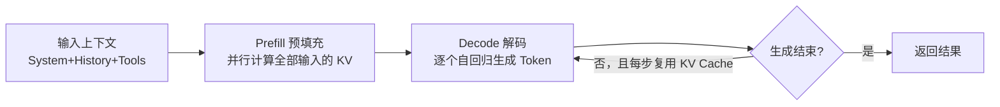
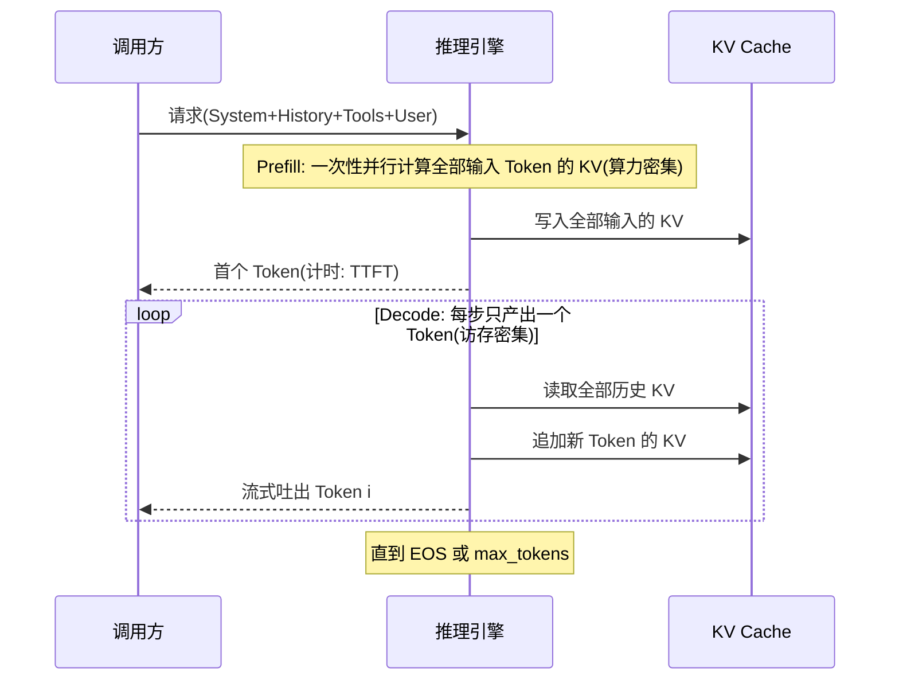
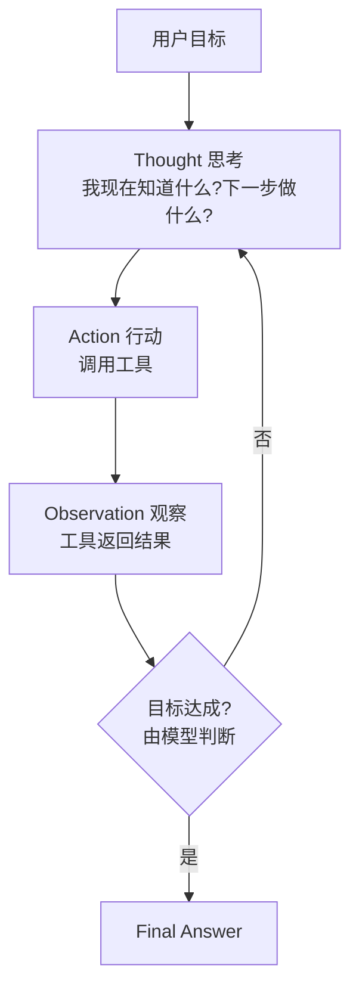
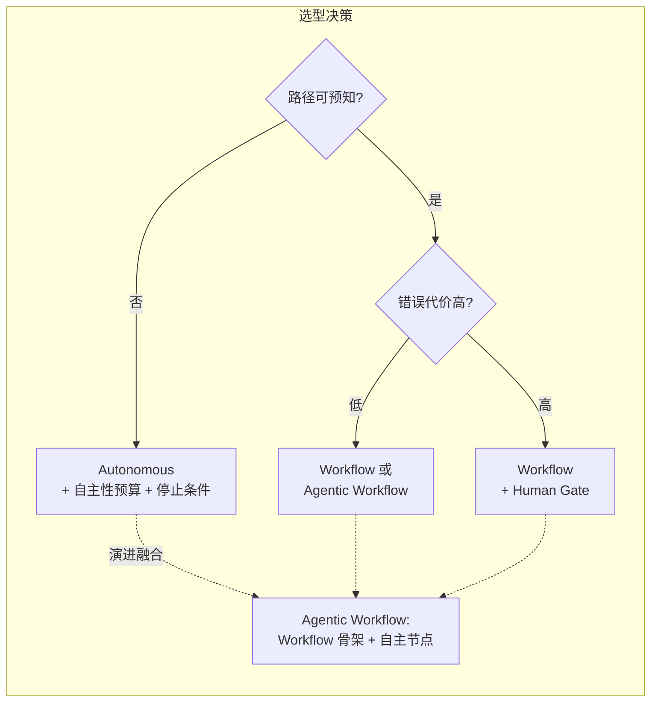
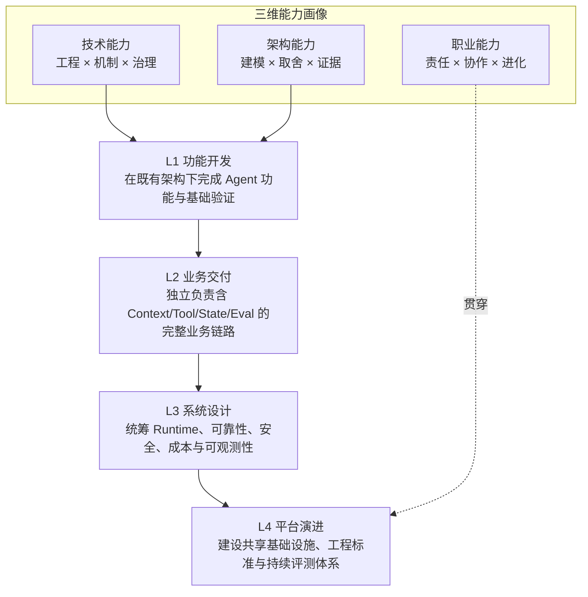
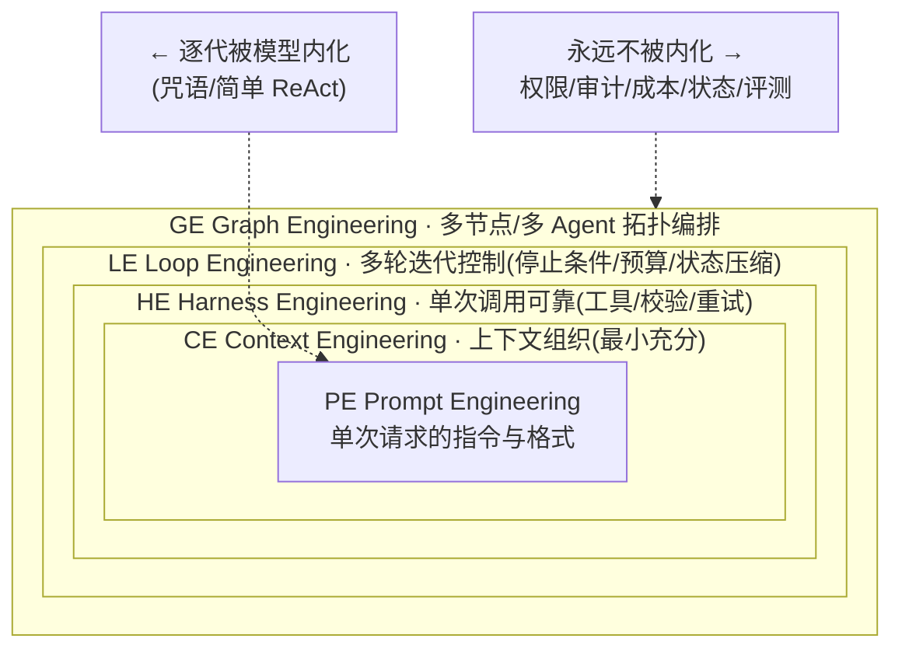

# 第一篇：AI 核心认知篇——从工程到 AI Agent 必须建立的底层认知

> 导语：很多工程师能"写出"一个 Agent Demo，却在面对真实业务时频频翻车：幻觉导致数字对不上、成本失控、长任务跑到一半状态丢失、换个模型行为全变。根源不在框架不熟，而在**底层心智模型缺失**。本篇解决三个问题：第一，LLM 到底"是什么"——它的能力从哪来、边界在哪里、为什么天然不确定；第二，Agent 到底"该长什么样"——Autonomous 与 Workflow 两大范式如何取舍；第三，工程师个人与团队"该怎么进化"——能力模型、AI Native 思维、以及 PE/CE/HE/LE/GE 这套调优技术谱系。读完本篇，你应该能对任何 Agent 方案给出"为什么这样设计"的底层解释，而不是"某个框架就是这么写的"。

---

## 1. 从训推机理理解 LLM：建立 Agent 开发的底层心智模型

### 1.1 核心概念：Token、Tokenizer、Prompt、Reasoning

**Token 是 LLM 的世界观单位。** 模型不读"字"也不读"词"，它读 Token——由 Tokenizer（如 BPE 算法）把文本切成的子词片段。一个汉字通常是 1~2 个 Token，一个英文单词平均 0.75 个 Token 左右。这件事对工程的直接影响有三：

1. **计费与限额都以 Token 计**。上下文窗口 128K 指的是 Token 数，不是字符数。
2. **切分不可控带来诡异行为**。数字"2024"可能被切成"20"+"24"，导致模型做算术时逐位出错；这就是为什么精确计算永远应该交给工具（如 Python Sandbox）而不是让模型口算。
3. **Prompt 的每一部分都在占预算**。System Prompt、工具定义、历史消息、检索结果——全部计入上下文。

**Prompt 是唯一的编程接口。** 传统软件里你写函数，LLM 系统里你写上下文。System Prompt 定义角色与规则，User Message 定义任务，工具定义声明能力边界——它们共同构成模型的"运行时环境"。

**Reasoning（推理）本质是"想得久一点"。** 以 OpenAI o 系列、DeepSeek-R1 为代表的推理模型，通过强化学习训练出"先产出长链思考再作答"的行为模式。工程含义是：推理模型用**更多的 decode Token 换更高的准确率**，适合规划、诊断、多步推理类任务（如 DataAgent 中的"GMV 异常归因"），但对简单查数任务是纯粹的成本浪费。**模型选型 = 在效果、成本、时延的三角里找位置。**

### 1.2 训练三阶段：能力从哪来，代价是什么

理解 PreTrain → SFT → RLHF 这条流水线，就能预判模型"会什么、不会什么、有什么脾气"：

| 阶段 | 目标 | 获得的能力 | 代价 / 副作用 |
|---|---|---|---|
| **PreTrain（预训练）** | 对海量文本做 next-token 预测 | 语言、世界知识、代码、潜在推理模式 | 只会"续写"，不会"听指令"；知识有截止日期；会背出训练数据里的错误与偏见 |
| **SFT（监督微调）** | 用"指令—回答"样本教模型按格式做事 | 指令跟随、工具调用（Function Calling 的 JSON 格式）、结构化输出、ReAct 轨迹、分步规划 | 能力被"收窄"到样本分布内；样本里没有的行为模型基本不会自发产生；过拟合会导致模式僵化 |
| **RLHF / RLAIF（对齐）** | 用人类/AI 偏好信号优化输出排序 | 更有帮助、更无害、表达更符合人类口味；推理模型在此阶段学会长链思考 | 奖励黑客（迎合评分而非正确）；"对齐税"——模型变得保守、爱拒绝、倾向说漂亮话；可能放大"自信地错" |

对 Agent 工程师的三条推论：

- **工具调用是"训练出来的格式"，不是"模型的本能"。** 模型生成 `{"name": "query_order", "arguments": {...}}` 是因为 SFT 见过大量这种样本。所以参数写错、幻觉出不存在的工具名，都是正常现象——**必须在 Harness 层做 Schema 校验与重试**。
- **ReAct、Planning 这些"范式"本质是把 SFT 已内化的行为模式用 Prompt 激活并外置成循环**。模型会"Thought/Action/Observation"不是框架的魔法，是训练数据里有大量这类轨迹。
- **RLHF 的"讨好倾向"是幻觉的温床。** 模型宁可编一个看似合理的 GMV 数字，也不愿说"我查不到"。DataAgent 的设计必须默认"模型说的每个数字都要有 SQL 证据链"。

### 1.3 推理机制：prefill、decode、KV Cache 与成本结构

一次完整的推理分两个阶段：



- **Prefill**：把整段输入一次性并行算完注意力，计算密集但可并行，GPU 利用率高。
- **Decode**：自回归地一个 Token 一个 Token 往外蹦，每步都要访问全部历史 KV，**访存密集、无法并行**——这就是为什么输出比输入慢、且长输出时延不可压缩。
- **KV Cache**：缓存每个历史 Token 的 Key/Value 矩阵，避免重复计算。代价是显存占用随上下文长度线性增长——这是长上下文服务贵、并发受限的物理原因。

换成时序视角，一次流式请求的生命周期如下——注意 prefill 只发生一次，而 decode 的循环里每步都要"读全部历史 KV + 追加新 KV"，这正是输出侧慢且贵的机械原因：



工程推论：

1. **成本 ≈ 输入 Token × 输入单价 + 输出 Token × 输出单价**，输出通常贵 3~5 倍（因为 decode 低效）。让模型"少说话、多调工具"往往更省。
2. **上下文越滚越长，每步 decode 越慢、KV 越贵**。Agent 跑几十轮后必须做上下文压缩/裁剪，否则成本和时延双双爆炸。
3. **前缀一致性能命中 KV Cache 复用**（如 Anthropic 的 Prompt Caching）：System Prompt 和工具定义放在最前且保持稳定，动态内容放后面，可大幅降本。

### 1.4 采样机制：Temperature / Top-p / Top-k

模型输出的本质是一个概率分布，采样参数决定"从这个分布里怎么挑词"：

| 参数 | 机制 | 调大/调小的效果 | 典型场景 |
|---|---|---|---|
| **Temperature** | 对 logits 除以 T 再 softmax | T→0 接近贪心（选概率最大者），T→1 趋于原始分布，T>1 更随机 | 分析、SQL 生成：0~0.3；头脑风暴文案：0.7~1.0 |
| **Top-p（核采样）** | 只从累计概率达 p 的最小词集里采 | p 越小越保守 | 与 Temperature 二选一为主，常设 0.9~0.95 |
| **Top-k** | 只从概率最高的 k 个词里采 | k=1 即贪心 | 较少单独用，多与 Top-p 组合 |

关键认知：**采样参数只能调"分布的形状"，不能把模型不会的东西变出来。** 幻觉的根源在训练与知识边界，不在 Temperature。把 T 调到 0 只能让模型"稳定地错"，不能让错变对。另外 T=0 也不保证严格复现（浮点非确定性、服务端实现差异），**需要确定性时请用结构化输出 + 校验 + 固定快照，而不是依赖采样参数**。

纸上得来终觉浅——下面这个交互 Demo 给了一组虚拟 token 的概率分布，拖动 Temperature / Top-p 滑块看分布如何变形，再连点"采样一次"（或"连采 20 次"）亲自验证"低温集中、高温发散"，右侧 logprobs 面板同步给出数值：

```demo llm-sampling
```

### 1.5 幻觉与不确定性：理解、接纳、应用

幻觉不是 bug，是 next-token 预测机制的**固有属性**——模型的训练目标从来是"像真的"，不是"是真的"。成熟的 Agent 工程师对幻觉的态度分三层：

1. **理解**：幻觉高发区 = 长尾事实、精确数字、引用来源、多步算术、工具参数。这些区域一律不信赖模型的"记忆"。
2. **接纳**：不确定性也可以是资源。头脑风暴、方案发散、语义理解类任务，恰恰受益于模型的"联想能力"。
3. **应用（治理）**：把不确定性**围起来**——
   - ** grounding**：所有事实性结论必须带工具证据（DataAgent 里每个指标数字都能回溯到一条 SQL）；
   - **结构化约束**：JSON Schema 输出 + 校验失败重试；
   - **分治**：把"理解意图"（模型擅长）和"执行计算"（确定性系统擅长）拆开；
   - **验证回路**：Independent Verification，让另一个模型/规则引擎审查输出。

### 1.6 ICL、上下文窗口与注意力

**In-Context Learning（上下文学习）** 是 LLM 最反直觉的能力：不更新任何权重，仅在 Prompt 里放几个示例（few-shot），模型就能学会新任务格式。机制上，注意力让模型在生成时"检索并模仿"上下文中的模式。

工程运用三条：

- **示例是最高杠杆的 Prompt 资产。** 3~5 个覆盖边界情况的输入输出对，效果常胜过长篇规则描述。DataAgent 里放几个"问题→正确 SQL 口径"的示例，比写一段"注意口径"的说明有效得多。
- **注意力会"丢失中间"（lost in the middle）。** 长上下文中，模型对开头和结尾的内容利用最好，塞在中间的关键规则容易被忽略。重要约束要么放 System Prompt 开头，要么在 User Message 尾部重申。
- **窗口长度 ≠ 有效长度。** 宣称 128K 的窗口，塞到 100K 后检索精度、指令跟随质量都会退化，且成本线性上升。**Context Engineering 的目标不是"塞满"，是"最小充分"。**

### 1.7 模型与确定性系统的职责边界

这是本篇最重要的工程判断，用一个决策表收尾：

| 能力 | 交给 LLM？ | 理由 |
|---|---|---|
| 意图理解、语义分类、非结构化信息抽取 | ✅ 首选 | 模型的主场，确定性规则写不出 |
| 规划与方案发散（列候选分析路径） | ✅ 但需收敛机制 | 模型长于发散，需 Workflow/评审收敛 |
| 精确计算、日期运算、单位换算 | ❌ 交给工具 | Token 切分与概率生成天生不可靠 |
| 数据查询、权限校验、SQL 安全 | ❌ 交给 Query Gateway | 幻觉 + 注入风险，必须确定性拦截 |
| 写库、调预算、发工单等副作用操作 | ❌ 模型提议，人审批 | 不可逆操作必须 Human Approval |
| 格式校验、Schema 检查、回归测试 | ❌ 交给代码 | 免费且 100% 可靠，别浪费 Token |

一句话：**模型负责"理解与判断"，确定性系统负责"执行与担保"，Contract（接口契约）负责两者之间的翻译。** 贯穿项目 DataAgent 的全部架构——Query Gateway、Python Sandbox、Human Approval——都是这张边界表的物化。

---

## 2. Agent 的两种根本范式：Autonomous vs Workflow

### 2.1 定义与共识

行业（以 Anthropic《Building Effective Agents》为代表）的共识划分：

- **Workflow**：LLM 与工具沿着**人事先编排好的路径**执行。流程拓扑是代码，模型是其中的"智能节点"。
- **Autonomous Agent**：LLM **自主决定**下一步做什么、做多久、何时停。流程拓扑在运行时才生成，人只给目标和护栏。

非共识地带（"几个工具调用算不算 Agent"）不重要，重要的是一个可操作的判据：**循环的退出条件由谁决定？** 由代码决定的是 Workflow，由模型决定的是 Autonomous。

### 2.2 Autonomous 范式

**ReAct**（Reasoning + Acting，Yao et al. 2022）：模型在一个"思考→行动→观察"的局部循环里滚动，每一步都基于最新观察重新决策。



优点：适应性强、路径无需预知、能处理开放式问题。缺点：错误会累积（一步错，步步在错误前提上推）；成本不可预测（循环次数未知）；调试困难。

**Plan-and-Execute**：先由一个 Planner 生成全局多步计划，再由 Executor 逐步执行，必要时 Replan。它用"一次贵的规划"换"执行期的稳定"，降低漂移，但代价是计划对早期错误假设脆弱，且多了一轮大模型开销。

### 2.3 Workflow 范式（六种基础模式）

| 模式 | 机制 | 适用场景 | DataAgent 中的例子 |
|---|---|---|---|
| **Prompt Chaining** | 任务拆成固定串行步骤，每步输出喂给下步，步间可加程序校验 Gate | 步骤固定、每步可独立验证 | "取数→清洗→计算→成文"的报告流水线 |
| **Routing** | 先分类，再路由到专用分支 | 输入类型差异大、分支各有专长 | 把问题路由到"查数/诊断/预测/执行"四个子流程 |
| **Parallelization** | 多任务并发：分片（Sectioning）或多解投票（Voting） | 可并行加速，或需多解提高置信 | 同时拉取订单、库存、广告三路数据 |
| **Orchestrator-Workers** | 中心 LLM 动态拆解任务、分派给 Worker、汇总结果 | 子任务数量和内容无法预知 | 主控把"月度经营分析"拆给各指标分析 Worker |
| **Evaluator-Optimizer** | 生成者产出，评估者打分反馈，循环到达标 | 有明确质量标准、迭代可改进 | 报告生成器 + 事实核查评估器循环 |
| **Agentic Workflow** | Workflow 骨架 + 局部 Autonomous 节点的混合体 | 主流程要可控，局部要灵活 | 报告流水线中嵌入一个自主诊断 Loop |

### 2.4 融合趋势与选型

企业级实践的真实答案是**混合架构**：用 Workflow 提供确定性骨架（合规、审计、成本可控），在需要开放判断的节点嵌入 Autonomous Loop（诊断、规划），即"Agentic Workflow"。

选型考量四问：

1. **路径可预知吗？** 可预知→Workflow；不可预知→Autonomous。
2. **错误代价多大？** 高（写库、调预算）→Workflow + 人工 Gate；低（探索性分析）→可自主。
3. **成本与时延约束？** 强约束→Workflow（次数可控）；宽松→Autonomous。
4. **需要审计回放吗？** 企业场景几乎总是需要→Workflow 骨架天然可审计。



---

## 3. Agent 工程师能力模型：三维画像与 L1–L4 分级

市场对"Agent 工程师"的需求已从"会调 API、会写 Prompt"升级为"能设计、评审、治理一个生产级 Agent 系统"。三维能力画像：

| 维度 | 内涵 | 关键词 |
|---|---|---|
| **技术能力** | 软件工程基本功 + LLM/Agent 机制 + 各子系统的实现与调优 | Context、Tool、Memory、Runtime、Eval、生产治理 |
| **架构能力** | 把业务问题建模为系统，做权衡并留下证据 | 任务建模、控制权分配、状态设计、可靠性、安全、成本与性能取舍、ADR |
| **职业能力** | 在不确定性中交付结果并持续进化 | 创新实验、结果责任、执行闭环、跨职能协作、持续学习 |



关键认知：

- **分级标准是"责任半径"不是"技术名词量"。** L1 对一个功能点负责，L4 对"多个团队、多个 Agent 能否持续协作演进"负责。
- **架构师的工作方式升级**：从"给一个方案"到"提出候选方案、明确约束、用 Baseline/Badcase/Benchmark 验证取舍、用 ADR 留下决策证据"。方案会过时，取舍逻辑和验证方法不会。
- **变与不变**：框架、模型、API 年年变（变）；任务建模、状态设计、边界判断、证据驱动的决策方法（不变）。把学习时间投资在不变的对象上。

---

## 4. AI Native 团队与个人

### 4.1 AI-Enabled vs AI-Native

| 维度 | AI-Enabled（工具化使用） | AI-Native（原生重构） |
|---|---|---|
| 定位 | AI 是提效插件，流程不变 | 流程围绕"人机协同"重新设计 |
| 工作方式 | 人做完，AI 帮忙润色/加速 | 人定义目标与验收，AI 执行，人审查 |
| 资产沉淀 | Prompt 散落在个人手里 | SPEC、Skill、Eval 成为团队工程资产 |
| 质量保障 | 人肉检查 AI 输出 | 独立验证、评测门禁、Badcase 回流 |
| 衡量指标 | "省了多少时间" | "单位成本交付了多少可靠结果" |

伪 Native 鉴别法：把 AI 工具撤掉后流程原样运转的，是 Enabled；流程立刻瘫痪的，才可能（只是可能）是 Native。

### 4.2 三个思维转换

1. **从完成任务 → 对结果负责**：AI 写得快，错得也快。提交 AI 产出 = 你为其背书。
2. **从执行者 → 定义者**：核心价值从"把活干完"上移为"把目标、边界、验收标准定义清楚"——这恰是 SPEC 与 Eval 的能力。
3. **从构建者 → 审查者**：产出成本趋零，**验证能力成为瓶颈**。能设计"独立验证机制"的人比能写代码的人稀缺。

### 4.3 个人 AI Native：一个人的 OPC（One Person Company）

把自己经营成一家公司：

- **角色转换**：你不再是"员工 + 工具"，而是"CEO + 一支 Agent 团队"——研究员 Agent、编码 Agent、评审 Agent 各司其职。
- **资产体系**：个人 Prompt 库、Skill 库、上下文模板、常用工作流，全部版本化沉淀，每次任务都让资产增值（复利）。
- **个人 Evaluation 体系**：给自己的 AI 产出建立抽检机制与 Badcase 本，记录"AI 在哪类任务上坑过我"，据此调整授权边界。

### 4.4 团队 AI Native：责任边界与基础设施

核心是**控制权分配矩阵**——按风险等级决定"人、Agent、确定性系统"谁执行、谁审查、谁担责：

| 风险等级 | 例子 | 执行者 | 审查 | 责任人 |
|---|---|---|---|---|
| 低 | 查数、出草稿报告 | Agent 自主 | 抽检 + 自动 Eval | 流程 owner |
| 中 | 生成并执行只读 SQL、发内部通知 | Agent 执行，确定性系统校验 | 独立验证全量过 | 模块 owner |
| 高 | 调广告预算、写业务库、发工单 | Agent 提议，**人审批后**确定性系统执行 | 双人复核 + 审计日志 | 具名责任人 |

团队基础设施四件套：**团队级规则（Rules）、共享 SPEC、可复用 Skill、统一验证体系**。同时划清个人资产与团队资产的边界：个人探索产出经过评审、加上测试与文档后，才能"晋升"为团队资产——这和代码从个人分支合并进主干是同一个治理逻辑。

---

## 5. LLM 调优技术谱系：PE、CE、HE、LE、GE

### 5.1 五层技术与关系

| 层 | 全称 | 调优对象 | 核心问题 |
|---|---|---|---|
| **PE** | Prompt Engineering | 单次请求的指令与格式 | 怎么把意图说清楚 |
| **CE** | Context Engineering | 喂给模型的信息组织 | 怎么给"最小充分"的上下文 |
| **HE** | Harness Engineering | 包裹模型的脚手架（工具、校验、重试、采样控制） | 怎么让单次调用可靠、可恢复 |
| **LE** | Loop Engineering | 多轮迭代的控制（停止条件、预算、状态压缩） | 怎么让多步执行受控收敛 |
| **GE** | Graph Engineering | 多节点/多 Agent 的拓扑编排 | 怎么让复杂任务结构化协作 |

五层是**递进 + 嵌套**，不是取代：CE 包含 PE 的成果，HE 包裹 CE，LE 调度 HE，GE 编排 LE。用一张嵌套图把这个关系钉死——内层的能力被外层当作"零件"调用，而越靠外层，工程负债越重：



参照 OpenAI 的五级 AI 路线图（Chatbot→Reasoner→Agent→Innovator→Organization），越往后走，竞争的焦点越从"模型本身"移向"模型外面的工程系统"——这正是五层技术存在的理由。

**模型内化趋势**：每一代模型都在内化上一层的手工技巧——早期的"让我们一步步思考"咒语被推理模型内化，简单的 ReAct 循环被 Agentic 训练内化。但**权限、审计、成本、状态、评测永远不会被内化**，因为它们是业务约束而非模型能力。学习重点应放在这些稳定的工程对象上。

### 5.2 User 视角 vs Builder 视角

| 层 | User 视角（驾驭 AI 完成任务） | Builder 视角（把方法固化成系统） |
|---|---|---|
| PE | 写清目标、约束、输出格式 | 把最佳 Prompt 固化为产品模板与版本化资产 |
| CE | 挑对文件、喂对背景 | 建检索、权限、上下文组装管线 |
| HE | 会用工具、会要求结构化输出 | 建工具注册、Schema 校验、重试与降级 |
| LE | 会给反馈、会要求自我检查 | 建停止条件、循环预算、状态持久化 |
| GE | 会把大任务拆开派给不同 Agent | 建编排引擎、任务图、多租户调度 |

双重视角的修炼路径：先以 User 身份把五层"用顺手"，再把被反复验证有效的个人方法"晋升"为 Builder 资产——这与第 4 节的个人→团队资产升级是同一飞轮。

### 5.3 架构选型：什么时候用哪一层

- 单轮能解决、格式要稳 → 停在 PE + CE，**保持简单**；
- 需要工具但流程固定 → 上 HE（Function Calling + 校验），不必上 Loop；
- 开放式探索、步数未知 → 上 LE，但配自主预算与停止条件；
- 多角色协作、并行、长任务 → 上 GE；
- **任何一层都是负债**：复杂度每加一层，调试、评测、成本治理的难度都上一个台阶。能用 CE 解决的不要用 LE 解决。

---

## 常见误区

1. **"Temperature=0 就不会幻觉。"** 采样只影响分布形状，幻觉源于知识与机制。T=0 只能稳定复现错误。根治靠 grounding 与验证。
2. **"上下文窗口大 = 可以多塞。"** 注意力在中段衰减、成本随长度线性涨、KV Cache 占显存。Context 的第一原则是"最小充分"。
3. **"Agent 就该全自动，加 Workflow 是技术不行。"** 全自动在错误代价高的企业场景是事故而非先进性。混合编排、按风险分级授权才是成熟设计。
4. **"会写 Prompt 就是 Agent 工程师。"** Prompt 是五层里最浅、最易被模型内化的一层。能力分水岭在状态、边界、评测与治理。
5. **"RLHF 之后模型说的就是对的。"** 对齐优化的是"人类偏好"，不是"事实正确"。模型被训练得更自信，不等于更可靠。
6. **"换个更强模型，工程问题就消失了。"** 模型升级改善单点能力，但权限、审计、成本、状态管理一个都不会自动解决。

## 动手练习

1. **Token 解剖实验**：用 tiktoken（或目标模型对应 tokenizer）统计你的 System Prompt、一个工具定义、一段示例对话各占多少 Token；算一笔 DataAgent"月报生成"任务（约 20 轮循环）的输入/输出成本，找出最大的成本项并给出一个削减方案（提示：KV Cache 前缀稳定性）。
2. **采样对照实验**：同一道"给一个模糊业务问题写分析 SQL"的题，分别在 T=0、T=0.3、T=1.0 下各跑 5 次，记录答案的一致性与正确率，写一段结论：哪个参数组合适合进生产，为什么。
3. **范式改造练习**：把"诊断某租户 GMV 环比下跌"这个任务分别用（a）纯 ReAct Loop 和（b）Workflow（Routing→并行取数→诊断节点→Evaluator 审核）各设计一遍，画出流程图，列出两者在成本可预测性、可审计性、错误传播上的差异。
4. **职责边界审查**：找一个你写过的 Agent 功能，逐条列出它让模型做的事，对照 1.7 的边界表，找出至少两处"应该交给确定性系统却交给了模型"的地方，写出改造方案。
5. **五层自检**：选一个你正在用的 AI 工作流，标注它用到了 PE/CE/HE/LE/GE 的哪几层，评估是否存在"杀鸡用牛刀"（复杂度超过任务需要）或"赤手空拳"（该上 HE/LE 却靠人肉）的情况。

## 自测清单

- [ ] 我能解释 Token 切分为什么会让模型算错数字，以及工程上如何规避。
- [ ] 我能说出 PreTrain/SFT/RLHF 各自赋予了什么能力、带来什么副作用。
- [ ] 我能画出 prefill/decode/KV Cache 流程，并据此解释"输出比输入贵"和"长上下文变慢变贵"。
- [ ] 我知道 Temperature/Top-p 的真实作用范围，不会指望它们消灭幻觉。
- [ ] 我能为幻觉高发区（数字、引用、工具参数）设计 grounding 与校验机制。
- [ ] 我能说清 ICL 与"lost in the middle"对 Prompt 设计的具体约束。
- [ ] 给定一个需求，我能在 Autonomous / Workflow / Agentic Workflow 之间给出选型并说明四问依据。
- [ ] 我能复述 L1–L4 的责任半径差异，并定位自己在哪一级。
- [ ] 我能区分 AI-Enabled 与 AI-Native，并举出团队责任边界矩阵的例子。
- [ ] 我能解释 PE/CE/HE/LE/GE 的递进嵌套关系，以及"哪些会被模型内化、哪些不会"。
