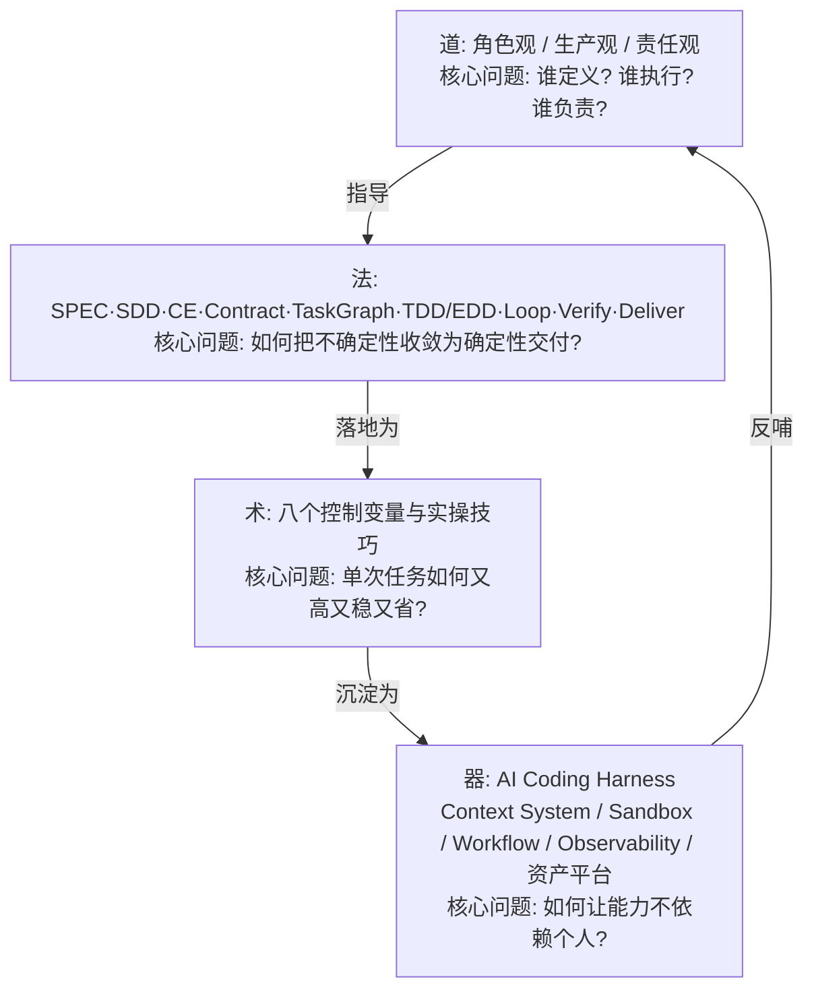
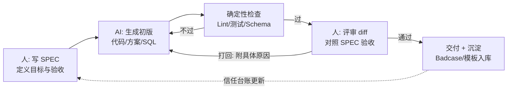
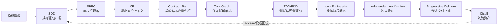
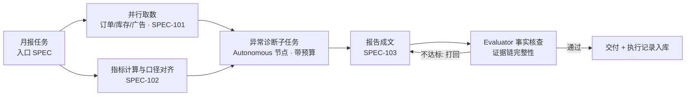
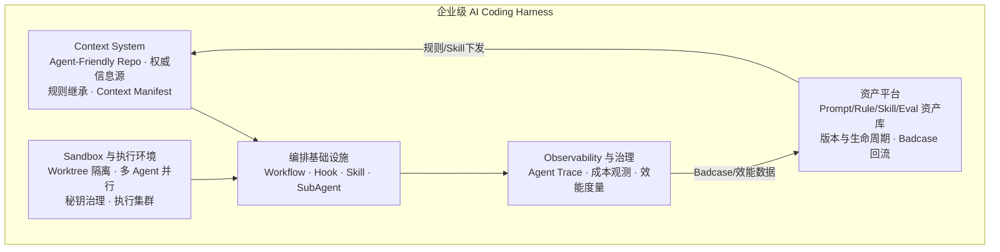

# 第二篇：企业级 AI Coding 道法术器——把概率性生成转化为确定性交付

> 导语：几乎所有工程师都体验过 AI Coding 的两副面孔：写 Demo 时如有神助，进生产时事故频发——生成的代码跑不通、改 A 坏 B、换了个人用同样的工具效果天差地别。差距不在"谁的 Prompt 更玄学"，而在是否把 AI Coding 当成一个**生产系统**来经营。本篇用"道法术器"四层框架[^course]解决这个问题：**道**回答"人与 AI 各自扮演什么角色、谁对结果负责"；**法**回答"用什么方法论把概率性生成收敛成确定性交付"；**术**回答"日常实操中有哪些高杠杆的控制变量与技巧"；**器**回答"如何把个人经验外置成团队可复用、可治理的基础设施"。

---

## 1. 道：角色观、生产观、责任观

### 1.1 个人级 vs 企业级 AI Coding

同一个 AI 编码工具，在个人手里和在企业里，是两种完全不同的活动：

| 维度 | 个人级 AI Coding | 企业级 AI Coding |
|---|---|---|
| 目标 | 把"我这个任务"快速搞定 | 让"团队所有任务"持续、可靠、低成本地交付 |
| 方法 | 临场发挥，依赖个人 Prompt 手感 | 方法论驱动：SPEC、Contract、Eval、流程化 |
| 上下文 | 人脑里装着项目背景，随口补充 | 上下文必须外置、可复现、可继承（Agent-Friendly Repo） |
| 质量 | 作者自己跑一遍觉得行就行 | 独立验证 + 自动化测试 + 回归门禁 |
| 反馈迭代 | 错了就再聊一轮 | Badcase 回流为评测资产，系统越用越强 |
| 资产归属 | Prompt 和技巧散在个人手里 | Skill、规则、Eval 集是团队工程资产 |
| 风险承担 | 翻车了重来，代价是半小时 | 翻车了上生产事故，代价是客户与资损 |

由此得到**企业级 AI Coding 有效产出公式**：

> **有效产出 = AI 生成量 × 验证通过率 × 资产复用率 − 返工与事故成本**

个人级只优化第一项（生成量），企业级必须同时经营后三项。这也解释了为什么"AI 写了 80% 的代码，团队却变更慢了"——验证与返工成本吞掉了生成红利。

### 1.2 道法术器四层架构



### 1.3 三观详解

**角色观：从"写代码的人"到"软件交付系统的设计者"。** 你的产出不再是代码本身，而是"一套能持续产出可靠代码的系统"——包括任务定义、上下文供给、执行编排与审查机制。亲手 Coding 让位于**定义（Define）、编排（Orchestrate）、审查（Review）**三件套。这并不意味着不读代码——恰恰相反，审查者必须比写作者更懂代码，只是体力活外包给了 AI。

**生产观：三个转向。**

1. **从"Prompt 决定质量"到"工程系统决定质量"。** 同一条 Prompt 在不同上下文、不同验证机制下产出质量天差地别。质量是系统的涌现属性，不是某句话的功劳。
2. **从"节省 Token"到"优化总交付成本"。** Token 成本往往只是总成本的小头，返工、事故、人力审查才是大头。多花 3 倍 Token 做一次独立验证，可能省掉一次线上事故——总账是赚的。
3. **从"一次任务完成"到"每次任务形成复利资产"。** 每次任务结束问一句：这次有没有产出可复用的 SPEC 模板、Skill、Badcase、Eval 用例？有，则团队下一次更快；没有，则永远原地踏步。

**责任观：从"追求全自动"到"风险适配的自动化"。** 自动化程度不该由"技术上能不能"决定，而由"错了代价多大"决定：低风险（草稿、探索）全自动；中风险（只读操作、内部变更）自动执行 + 独立验证；高风险（写库、付款、对外发布）AI 提议、人审批、确定性系统执行。全自动不是目标，**可信的自动化**才是。

### 1.4 信任校准：人机协作的隐形主轴

三观落到实处，是一个每天发生几十次的微观决策：**这次 AI 的产出，我该信几分、查多深？** 这就是信任校准（Trust Calibration）。它有两个方向的失败，且两个方向都烧钱：

| 失败方向 | 表现 | 代价 |
|---|---|---|
| **过度信任**（自动化偏见） | AI 生成的代码扫一眼就合并；AI 给的数字直接写进报告 | 幻觉直送生产；事故后发现"没人真的审过" |
| **信任不足**（人肉兜底成瘾） | 每一行都重写、每次都从头验证 | AI 红利归零，人成为瓶颈，团队退回前 AI 时代的吞吐 |

校准的目标不是"更信"或"更不信"，而是**让信任度贴着 AI 在该任务类型上的真实靠谱率走**。三个可操作的校准动作：

1. **按任务类型建档，不按感觉。** 维护一份"AI 任务靠谱度台账"：哪类任务（CRUD、正则、SQL、并发代码、边界条件）AI 历史翻车率高？篇01 的 Badcase 本就是个人版，团队版就是 Eval 集。信任应该跟着台账走，不跟着心情走。
2. **授权从窄到宽，用证据升级。** 新工具/新模型上线，先给"低风险 + 全量审查"的窄授权；攒够 N 次无事故记录，再放宽到"抽检"。这和金融机构的信用额度是同一套逻辑——额度是挣出来的，不是宣誓出来的。
3. **把"信不信任"翻译成"验证强度"，而不是情绪。** 不信任的正确表达不是盯着屏幕焦虑，而是加一条自动化断言、一次独立验证会话、一个人工确认点。**信任问题的出口永远是机制，不是态度。**

把道的三观、法的流水线、术的变量串起来，人机协作的日常就是下面这个循环——注意人的位置：**人不在生成环里，人在定义点和评审点上。**



这张图的三个要点：第一，**AI 的自证不算数**——绿色那个"确定性检查"是代码在审，不是 AI 在审；第二，**打回必须附具体原因**（哪条验收不达标），模糊的"不太好"会让 AI 在原地打转烧 Token；第三，**循环的终点不是"代码写完"，是资产入库**——这就是生产观第三条"复利"的闭环。

---

## 2. 法：九大企业级方法论

法的总纲是一条交付流水线，每一环对应一种收敛不确定性的方法。AI Coding 的不确定性有且仅有四类：**目标不确定**（要做什么没说清）、**上下文不确定**（AI 不知道该看什么）、**执行不确定**（过程跑偏）、**验证不确定**（不知道做得对不对）。九种方法分别对准这四类：



### 2.1 SDD（Spec-Driven Development）：从模糊需求到可执行规格

SDD 主张：**AI 时代写代码之前先写规格，且规格要精确到"可执行"程度**——包含目标、非目标、输入输出契约、验收标准、边界情况。为什么？因为 LLM 是"字面意义的天才"：规格里没写的它不会替你补常识，规格里模糊的它会用幻觉填坑。一份好 SPEC 同时是给人看的对齐文档和给 AI 看的编程输入。

以贯穿项目 DataAgent 为例："支持租户查询经营数据"是坏规格；"输入：自然语言问题 + 租户 ID；输出：SQL + 结果表 + 口径说明；约束：仅只读、仅本租户数据、单查询≤30s；验收：20 个标注问题中口径正确率≥90%"才是可执行规格。

**六段式 SPEC 模板**（直接复制使用，这也是篇03 立项书的种子）：

```markdown
## SPEC-<编号>：<一句话标题>
### 1. 目标（Goal）
这次要做到什么，一句话说清。只写"做成什么样"，不写"怎么做"。
### 2. 非目标（Non-Goals）
明确排除什么。AI 最擅长在模糊地带自由发挥，非目标是防扩scope的护栏。
### 3. 输入输出契约（Contract）
输入：字段、类型、来源；输出：结构、Schema、示例。契约先行，实现后补。
### 4. 约束（Constraints）
性能上限、权限边界、禁止事项（负面约束比正面描述更有效）。
### 5. 验收标准（Acceptance）
可自动检查优先：测试通过 / Eval ≥ X / 命令 Y 输出 Z。
每条都要能回答"凭什么算做完"。
### 6. 边界情况（Edge Cases）
至少列 3 条：空输入、极端值、并发/失败场景。这是 AI 最容易漏的地方。
```

一个反直觉的经验：**SPEC 里"非目标"和"边界情况"两段的杠杆最大**——目标写得再漂亮，AI 也会在未声明的边界处翻车；而人写 SPEC 时最常偷懒的恰恰是这两段。

### 2.2 Context Engineering：构造最小充分上下文

法的层面强调**"最小充分"原则**：给少了，AI 靠猜（幻觉）；给多了，关键信号被淹没（lost in the middle）且成本爆炸。操作要点：

- **分层供给**：稳定层（架构原则、代码规范）常驻；任务层（相关文件、接口定义、相似实现）按需注入；即时层（当前错误信息、diff）精确投放。
- **高信号密度**：一段 20 行的接口契约胜过一个 2000 行的整个文件。教会 AI（和自己）"先给契约，再给实现片段，最后才给全文件"。
- **可复现**：同一份上下文清单（Context Manifest）应能让任何 Agent 在任何机器上重建相同的任务环境。

### 2.3 Contract-First 与 Invariant-Driven Development

先定契约（接口签名、Schema、协议），再让 AI 填实现——契约是 AI 与人类、AI 与 AI 之间的**稳定锚点**。不变量驱动更进一步：明确"无论实现怎么改都必须成立的性质"（如"所有租户查询必须带 tenant_id 过滤""任何写操作必须有审批记录"），并把不变量写成可执行的断言/测试。AI 生成代码的天然风险是"局部正确、全局破约"，不变量断言把全局约束变成每次生成都必须越过的栏杆。

### 2.4 Task Graph：复杂任务的拆解与编排

超过一个上下文窗口或一个专注度的任务，必须显式拆解为**有依赖关系的任务图**：节点是子任务（各自带 SPEC、上下文、验收），边是依赖。拆解的原则：

- **每个节点独立可验证**——验收标准随任务一起下发，而不是最后统一验收；
- **依赖最小化**——可并行的分支（如"订单模块改造"与"库存模块改造"）显式标出，交给 SubAgent 并行；
- **关键路径人工看护**——影响面大的节点（改公共契约、动数据库结构）标记为需人工评审。

以 DataAgent"月度经营分析报告"为例，一张任务图长这样——注意每个节点都自带 SPEC 与验收，诊断节点是 Agentic 的、其余是确定性编排：



取数与口径对齐之间没有依赖、显式并行——这正是"依赖最小化"的应用；诊断节点嵌入 Autonomous 但被 DAG 的骨架约束住——这就是篇01 说的 Agentic Workflow 在任务图上的样子。

### 2.5 TDD 与 EDD（Test/Eval-Driven Development）

TDD 在 AI Coding 里获得新生：**测试先行 = 给 AI 一个客观的、可自动检查的完成信号。** 先写（或让 AI 先写但人审）失败测试，再让 AI 实现到测试通过——AI 的"我觉得写完了"被替换为"测试绿了"。

EDD 把同一思想推广到无法用单元测试断言的领域（生成质量、Agent 行为）：为任务定义 Eval 集（输入 + 评分标准 + Grader），让"效果达标"像"测试通过"一样可自动判定。DataAgent 的"口径正确率≥90%"就是 EDD 而非 TDD 的对象。

### 2.6 Loop Engineering：建立受控执行闭环

让 AI 迭代（写→跑→看报错→改）是提效的源泉，失控迭代（无限重试、原地打转、越改越坏）是烧钱的深渊。受控闭环四要素：

1. **停止条件**：成功判据（测试绿/Eval 达标）+ 失败判据（最大轮次、预算耗尽、同一错误重复 N 次）；
2. **状态压缩**：每轮只把"当前代码 + 最新错误"喂回去，不让对话无限膨胀；
3. **升级机制**：连续失败时升级给人，而不是让 AI 在死胡同里烧 Token；
4. **可观测**：每一轮的输入、输出、工具调用留 Trace，事后能复盘"它在第几轮开始跑偏的"。

### 2.7 Independent Verification：独立验证与证据驱动审查

核心原则：**产出者和验证者不能是同一个上下文。** 让写代码的 Agent 自证"我写对了"没有意义——同一个模型、同一份上下文会犯同一个盲点错误。独立验证的实现：

- 用另一个会话（甚至另一个模型）只看"SPEC + 产出 diff"，不带实现过程的自我辩护；
- 验证产出必须是**证据**：测试运行结果、静态扫描报告、契约比对——而不是"看起来对"的意见；
- 高风险变更要求机器证据 + 人工签认双保险。

**落地成日常，就是 Review-Driven 工作流**：把"评审 AI 产出"当成和"写代码"同等正式的工作环节，而不是做完顺手扫一眼。一套可执行的人工评审动线（越靠前越先查）：

1. **先查验收，再看代码**：diff 对照 SPEC 的验收标准逐条打勾，不过的项直接打回，不进入细节评审；
2. **先查边界，再查主路**：AI 的主路径实现通常像模像样，翻车集中在空输入、并发、权限、资源释放——评审时间应向边界倾斜；
3. **先查契约，再查实现**：接口签名、数据结构、SQL 语义对不对，比变量命名重要一个数量级；
4. **删掉的代码和新增的一样重要**：AI 重构时"悄悄删掉一个不理解的兜底逻辑"是高频事故，diff 里的红色部分逐行确认；
5. **评审意见回流**：每次打回的原因如果是"这类错误 AI 常犯"，就把它写成一条团队 Rule 或 Eval 用例——评审的尽头是资产（2.9 节）。

### 2.8 Progressive Delivery：从代码完成到安全上线

代码写完只是交付的起点。渐进交付链条：本地验证 → CI 全量测试 → 预发环境 → 小流量 Canary → 全量，每一级都有可量化的通过标准和一键回滚[^phoenix]。对 AI 生成代码尤其重要，因为它的失败模式（边界遗漏、隐性假设）往往在真实流量下才暴露。

### 2.9 Distill：资产蒸馏

每次任务结束时，把可复用的部分蒸馏出来：新沉淀的 SPEC 模板、一条团队规则、一个 Skill、若干 Badcase 和 Eval 用例。这是"生产观"第三条（复利资产）的落地机制，也是从"法"通向"器"的桥梁。

---

## 3. 术：八个控制变量与实战技巧

法是方法论，术是手感。企业级 AI Coding 的日常优化围绕**八个控制变量**展开，并且始终同时优化四个目标：**效果、效率、成本、人类注意力**（注意力是最稀缺的资源——凡是能让 AI 自动检查的就别让人看）。

| # | 控制变量 | 控制什么 | 关键技巧 |
|---|---|---|---|
| 1 | **任务粒度** | 单次交给 AI 的任务大小 | 小到能在一个上下文内自洽验证；大到值得一次编排开销 |
| 2 | **上下文配比** | 喂什么、喂多少、什么顺序 | 契约优先、示例居中、动态信息靠后；定期"重启上下文"防污染 |
| 3 | **Prompt 结构** | 指令的表达 | 角色+目标+约束+输出格式+示例五段式；负面约束（不许做什么）比正面描述更有效 |
| 4 | **执行节奏** | 何时自动、何时暂停等人 | 计划确认点、关键变更确认点、预算检查点 |
| 5 | **Loop 参数** | 迭代轮次、预算、停止条件 | 每类任务预设预算上限；同一错误 3 次即升级 |
| 6 | **验证强度** | 用什么证据放行 | 风险分级匹配验证强度（低风险抽检、高风险全量+双人） |
| 7 | **工具与权限** | AI 能调什么、能动什么 | 最小权限；只读/写分离；副作用操作强制审批 |
| 8 | **模型与路由** | 哪个任务用哪个模型 | 简单任务用小模型，规划/诊断用推理模型；失败时升级模型而非死磕 |

高频技巧举要：

- **Prompt 与任务控制**：把大需求写成"验收标准清单"而非描述性段落；要求 AI 先复述理解再动手（便宜的误解检查）；给"完成定义"（Definition of Done）。
- **上下文工程**：定期清空对话重开（带新上下文清单），比在 100 轮污染对话里继续有效；用结构化摘要替代长历史。
- **Hook 与确定性自动化**：能用脚本保证的（格式化、Lint、提交前测试、危险命令拦截）绝不让模型"自觉遵守"——Hook 是 100% 可靠的，模型的自觉不是。
- **Skill 沉淀**：把重复三次以上的操作流程封装成 Skill（带触发条件、步骤、验收），让最佳实践脱离个人记忆。
- **SubAgent 编排**：把"探索"（读大量代码找线索）和"执行"（精确修改）分给不同 SubAgent——探索者上下文脏了无所谓，执行者的上下文必须干净；并行 SubAgent 处理独立模块，主 Agent 只做合并与冲突裁决。

**提示词工程的最大杠杆：五段式结构。** 八个控制变量里，Prompt 结构是普通人提升最快的单点。把日常指令从"一句话提需求"升级为五段式，质量跃迁立竿见影：

```text
【角色】你是资深数据工程师，熟悉零售 SaaS 多租户架构。
【目标】为 orders 表写一个按租户+日期范围查 GMV 的查询函数。
【约束】只读；必须带 tenant_id 过滤；禁止 SELECT *；用参数化查询防注入。
【格式】返回：Python 函数 + 对应 SQL + 三条边界测试用例；不要解释原理。
【示例】参考现有函数 query_orders(status) 的风格：<粘贴 20 行参考代码>
```

为什么五段式有效？因为它逐段对应 LLM 的机制：**角色**激活相关参数分布，**目标**锚定生成方向，**约束**（尤其负面约束）压缩不合规输出的概率空间，**格式**把"验收"提前写进请求，**示例**则直接调用 ICL——3~5 个好示例胜过长篇规则描述（篇01 1.6 节）。注意它和上面 SPEC 六段式的关系：**SPEC 是项目级的契约，五段式是单次任务的契约**——同一个思想在两个尺度上的应用。

**提示词质量对比（交互实验）**：下面这个 Demo 把同一个需求的"烂提示词 / 普通提示词 / 五段式提示词"放在一起，逐项拆解五段式每一段的贡献，并让你动手给一个真实提示词"诊断打分"：

```demo prompt-compare
```

**Demo 导学单**

1. 依次切换三档提示词，观察右侧"结构覆盖率"雷达条如何从 1/5 涨到 5/5——找到每一档缺的是哪几段。
2. 对比"普通"与"五段式"两档的预期产出差异列表，找出"约束"和"示例"各自消灭了哪一类翻车。
3. 用底部的诊断模式，把你自己最近发过的一条真实提示词逐段对照打分，记下缺哪段。
4. 回答 Demo 结论区的问题：为什么"示例"通常比"约束"更难写、但杠杆更高？（提示：回想篇01 的 ICL。）

---

## 4. 器：AI Coding Harness

### 4.1 从工具到 Harness

单点工具（一个 IDE 插件）→ 工具链（插件 + CI + 脚本）→ **Harness（企业级生产系统）**。器的本质是：**把"道"的制度、"法"的流程、"术"的经验，全部外置为不依赖个人自觉的基础设施。** 判断你有没有 Harness 的标准很简单：一个新人第一天入职，不请教任何人，能否在系统的引导下产出符合团队标准的 AI 辅助代码？

### 4.2 Harness 五大组件



**① Context System：让 Agent 获得最小必要信息。** 建设 Agent-Friendly Repository：架构决策有 ADR、模块有 README、接口有契约文件、术语有词表——AI 和人一样，进项目先读文档。治理三个老大难：**规则继承**（全局规则→仓库规则→模块规则的覆盖链）、**冲突治理**（两份文档说法不一致时谁是权威源）、**过期治理**（文档与代码漂移的检测）。Context Manifest 记录"本次任务用了哪些上下文版本"，保证任务可复现、事故可回溯。

**② Sandbox 与执行环境。** 每个 Agent 任务在独立 Worktree/容器中执行，互不污染；秘钥与环境变量集中治理、按需注入、不留痕在上下文里（防泄露进 Prompt 日志）；从开发者本机演进到企业执行集群后，多 Agent 并行跑任务成为标准能力。

**③ Workflow / Hook / Skill 编排基础设施。** Workflow 承载固定流程（如"需求→SPEC→实现→验证→PR"），Hook 承载确定性闸门（提交前必跑测试、危险 SQL 拦截、预算超限熔断），Skill 承载可复用操作手册。三者关系：**Workflow 定流程，Hook 守底线，Skill 传经验。**

**④ Observability 与组织治理。** 从"监控 Token 用量"升级为"观测软件生产效能"：每个任务花了多少 Token、几轮迭代、验证通过率、人工介入次数、最终返工率。Agent Trace（每一次模型调用、工具调用、决策点的完整记录）既是调试工具也是审计依据。治理层面，这些数据支撑"AI 领导力"决策：哪些流程值得加大自动化、哪些团队在裸奔、哪些模型路由策略在浪费钱。

**⑤ 资产平台。** 划清五类资产的边界与生命周期：

| 资产 | 本质 | 所有者 | 生命周期管理 |
|---|---|---|---|
| Prompt | 单次/模板化指令 | 个人→团队 | 版本化，随模型升级回归测试 |
| Rule | 团队级约束与规范 | 团队 | 评审制变更，过期审查 |
| Skill | 封装的操作流程 | 团队 | 触发条件明确，带验收标准 |
| Workflow | 编排好的流程 | 平台组 | 变更走发布流程 |
| Eval | 评测数据集与 Grader | 团队 + QA | Badcase 持续回流，防过拟合 |

**个人资产→团队资产的升级机制**：个人验证有效 → 补充测试与文档 → 评审入库 → 全员可用 → 持续由 Badcase 回流喂养。这个飞轮转起来，组织的 AI 能力就能**随模型共同进化**——新模型发布时，用团队 Eval 集回归一遍，就知道哪些资产失效、哪些能力解锁，而不是靠玄学体感。

### 4.3 工具选型：分类框架比名单更重要

AI Coding 工具半年一洗牌，追名单没有意义，**要掌握的是分类框架**——每一类工具对应一种人机控制权的分配方式：

| 类型 | 代表形态 | 控制权分配 | 擅长 | 短板 | 适配任务 |
|---|---|---|---|---|---|
| **补全型** | IDE 内联补全 | 人写主驾，AI 猜下一行 | 样板代码、重复模式 | 无任务概念，只见光标附近 | 手写为主时的加速器 |
| **对话型** | IDE 聊天面板 / 网页对话 | 人描述，AI 出片段，人搬运 | 答疑、小函数、解释代码 | 上下文靠人肉喂，不能动手执行 | 学习、探索、局部生成 |
| **Agent 型（CLI/IDE）** | 能读写文件、跑命令的编码 Agent | 人定目标，AI 自主循环执行 | 跨文件改造、跑测试修错、多步任务 | 失控风险高，必须配沙箱与预算 | 法与术的全部主战场 |
| **平台型** | 团队级 Harness / 编码平台 | 组织定流程，AI 在轨道内跑 | 权限、审计、资产复用、批量任务 | 建设成本高 | 企业级交付的终态 |

选型决策三问：

1. **这个工具把上下文管理的责任放在谁身上？** 靠人肉粘贴上下文的工具，天花板是你的耐心；能读仓库结构、有规则继承机制的，才能进企业级。
2. **它的"手"和"护栏"各是什么？** 能执行命令是"手"，审批点、预算、沙箱是"护栏"——只比较手不比较护栏的选型，是在给事故选型。
3. **产出能不能沉淀为资产？** Prompt、规则、Skill 在工具内是私有格式还是可导出的工程文件？锁死在某个工具私有格式里的资产，是负资产。

> 名单层面的建议只说一句：**先用熟一个 Agent 型工具的全部机制（规则文件、Hook、SubAgent、权限模式），再谈第二把刀。** 工具之间的差异远小于"会用"与"会用透"之间的差异。

---

## 5. AI Coding 反模式清单（红线合集）

道法术器讲"该做什么"，这一节讲"千万别做什么"。每条反模式都来自真实团队的事故复盘，按道法术器归档——评审自己团队的工作流时，可以拿这张表当检查单：

**道之反模式**

1. **甩锅式交付**："这是 AI 写的"成为质量问题的免责理由。——提交即背书，没有例外。
2. **全自动崇拜**：把"不用人管"当 KPI，高风险操作也无人审批。——自动化程度必须跟着错误代价走。
3. **沉默的使用**：团队里人人用 AI，但没人记录怎么用的、翻车在哪儿。——没有台账就没有校准，永远在重复踩坑。

**法之反模式**

4. **裸聊开工**：不写 SPEC、不带上下文，一句"帮我做个 XX"就开聊，然后抱怨 AI 不懂业务。——四类不确定性一个都没收敛。
5. **生成者自证**：让写代码的 Agent 自查一遍"你觉得对吗"就算验证。——同一上下文同一盲点（2.7 节）。
6. **无限续命循环**：AI 修一个报错连改 8 轮还在原地打转，人不去接管也不停手。——缺停止条件与升级机制（2.6 节）。

**术之反模式**

7. **上下文倾倒**：不分层、不筛选，把几十个文件全塞进会话，然后困惑 AI 为什么抓不住重点。——lost in the middle 自助套餐。
8. **一句话需求**："优化一下这段代码"——没有目标、约束、验收，AI 只能自由发挥，你还无法验收。
9. **在污染会话里长征**：一个会话聊了 100 轮、横跨 5 个任务还在用，上下文早已互相污染。——定期重启上下文，带新清单重开。
10. **让 AI 自觉遵守纪律**：指望 Prompt 里写"提交前记得跑测试"，而不是配一个 Hook。——模型的自觉不可靠，Hook 才可靠。

**器之反模式**

11. **密钥裸奔**：API key 写进 Prompt、代码、CI 日志里。——密钥治理是器的第一课，也是最低线。
12. **经验锁在个人手里**：高手的 Prompt 和技巧存在他私人的工具配置里，人走即失。——资产不入库，组织能力为零。

---

## 常见误区

1. **"AI 生成代码快 = 团队交付快。"** 生成量只是公式第一项。验证、返工、事故成本不治理，写得越快欠账越多。
2. **"找到一条神 Prompt 就能解决质量问题。"** 质量是 SPEC、上下文、验证、流程的系统涌现。同一条 Prompt 换个人、换个项目就失灵，因为它依赖的隐性上下文没外置。
3. **"追求全自动是先进，人工审批是落后。"** 全自动调预算、写生产库的企业系统等于裸奔。风险适配的自动化才是成熟：低风险全速跑，高风险人守门。
4. **"让写代码的 Agent 自己检查一遍就算验证了。"** 同一上下文同一盲点。独立验证的价值恰恰在"不知情"——只看 SPEC 和 diff 的验证者才能发现实现者的系统性偏差。
5. **"上下文给得越全越好，把仓库都塞给它。"** 全量上下文 = 低信号密度 + 高成本 + lost in the middle。最小充分 + 契约优先才是正解。
6. **"资产平台是大公司才需要的奢侈品。"** 恰恰相反——没有资产沉淀，团队规模稍大就会陷入"每个人重复踩同一个坑"。三个人就该开始攒 Skill 和 Badcase。

## 本篇实战：五个递进修炼（每步都有验收标准）

五个修炼按"法"的流水线顺序排列：先写规格 → 再造环境 → 再建闭环 → 再练验证 → 最后盘点变量。建议用同一个真实需求贯穿始终，走完一遍就是一次完整的企业级 AI Coding 微循环。

**修炼 1：写一份可执行 SPEC**

- **目标**：把六段式模板用出肌肉记忆，亲身体会"规格决定产出上限"。
- **操作**：选一个你本周要做的真实需求（如"为 DataAgent 增加库存预警"），按六段式写 SPEC；然后分别用"有 SPEC"和"无 SPEC 口头描述"两种方式让 AI 实现，各跑一次。
- **验收标准**：记录两种方式的产出质量与返工轮次，写出 3 行对比结论——结论里必须指出 SPEC 的哪一段（目标/约束/验收/边界）贡献最大。

**修炼 2：给项目做一次 Agent-Friendly 改造**

- **目标**：让"零上下文的新会话"也能在你的仓库里开工。
- **操作**：为一个仓库补齐三样——根 README（架构一句话图 + 如何跑测试）、一份 ADR（最近一个重要决策）、模块级接口契约文件。
- **验收标准**：开一个全新会话完成一个小任务，记录它比改造前少问了你几个问题；少问 3 个以上算达标。

**修炼 3：搭建最小受控 Loop**

- **目标**：把 2.6 节四要素（停止条件/状态压缩/升级机制/可观测）变成可运行脚本。
- **操作**：为任意 AI 编码任务实现脚本化闭环——跑测试 → 失败则把错误日志喂回 AI → 最多 5 轮 → 仍失败则停止并输出完整 Trace。
- **验收标准**：记录 AI 在哪类错误上原地打转；据此调整一条停止条件（如"同一报错出现 2 次即升级"），重跑验证有效。

**修炼 4：独立验证对照实验**

- **目标**：亲手测出"产出者与验证者分离"的增量价值。
- **操作**：让 AI 实现一个有 5 个边界条件的函数；先让它自查并报告"没问题"，再用一个只给"SPEC + diff"的干净会话独立验证。
- **验收标准**：对比两边发现的问题数；如果独立验证多发现了 ≥1 个问题，写下它对的是哪类错误（通常是实现者的系统性盲点）。

**修炼 5：绘制你的控制变量基线**

- **目标**：把八个控制变量从"无意识默认"变成"有意识调参"。
- **操作**：选一个常用 AI 工作流，逐项标注八个变量当前的取值（任务粒度多大、上下文怎么配、预算上限、验证强度……）。
- **验收标准**：找出其中"从未有意识调过"的三项，各做一次调整实验并记录前后效果；把基线表存档，一个月后回看。

### AI Coding 实操模式（全书样板）

本篇是 AI Coding 方法论主卷，这一节给出全书后续各篇「AI Coding 实操模式」的完整样板：提示词模板 + 评审清单 + 验收标准三件套。后续各篇会按各自主题裁剪，但骨架不变。

**① 可复制提示词模板（四条，覆盖全流程）**

让 AI 帮你写 SPEC（注意：是帮你写，不是替你写——写完必须人来改）：

```text
我要实现一个功能，先不要写代码。请按六段式（目标/非目标/输入输出契约/约束/
验收标准/边界情况）帮我起草一份 SPEC。我的初步想法是：【一句话描述】。
要求：(1) 你不确定的字段，列成问题清单问我，不要自行假设；
(2) 验收标准必须可自动检查；(3) 边界情况至少给 4 条，覆盖空输入、极端值、
并发、外部依赖失败。
```

任务开工（五段式 + 复述检查，一次解决"理解偏差"）：

```text
【角色】你是资深后端工程师，熟悉本仓库（规则见 AGENTS.md）。
【目标】实现 SPEC-012 中的库存预警功能。
【约束】不改公共契约；不写库；测试随代码一起给。
【格式】先复述你的理解和实施计划（不超过 10 行），等我确认后再动手。
【上下文】SPEC 全文如下：<粘贴>；相关文件：<文件清单>
```

打回重做（带具体原因的反馈，避免原地打转）：

```text
上一版没有通过验收，不要全盘重写，只做针对性修改：
【未达标项】第 3 条：tenant_id 过滤缺失，见 diff 第 42 行。
【期望】所有查询路径都必须带 tenant_id，包括你新增的分支。
【约束】保持已通过的其余验收项不回退；改完列出你动过的每一处。
```

评审助手（AI 当评审的脚手架，但结论人来下）：

```text
你是独立评审者，没有参与实现。只看下面的 SPEC 和 diff，不要听任何实现者的解释。
请输出：(1) 验收标准逐条过/不过 + 证据（行号）；(2) 边界情况遗漏清单；
(3) diff 中被删除的逻辑逐条确认是否安全；(4) 你不确定、需要人确认的点。
【SPEC】<粘贴>
【diff】<粘贴>
```

**② AI 初版人工评审清单（6 条红线，逐条过）**

- [ ] **验收对照**：SPEC 的每条验收标准都有对应证据（测试输出/命令结果），不是"看起来实现了"
- [ ] **红色 diff**：被删除/被改写的既有逻辑逐行确认过——AI 重构最常见的暗伤是"删掉不理解的兜底"
- [ ] **边界抽查**：空输入、超长输入、并发、外部依赖失败，至少亲手触发过两个
- [ ] **契约不破**：公共接口、数据结构、数据库 Schema 没有未经授权的变更
- [ ] **无静默吞错**：不存在 `except: pass`、被注释掉的测试、被跳过的校验
- [ ] **我懂每一行**：关键路径上的代码我能逐行讲清意图——讲不出的部分，要么追问到懂，要么不合并

**③ 验收标准**

- 五个修炼全部通过各自的验收标准，产出物（SPEC、README/ADR、Loop 脚本、对照实验记录、变量基线表）全部存档；
- 四个提示词模板至少各真实使用过一次，并根据使用效果改过其中一条；
- 评审清单 6 条在至少一次真实合并前完整走过一遍——最好抓到过至少一个问题，那才是它存在的意义。

## 自测清单

- [ ] 我能写出企业级 AI Coding 有效产出公式，并解释每一项如何被"法"和"器"优化。
- [ ] 我能说清三观（角色观/生产观/责任观）各自的"从什么转向什么"。
- [ ] 我能解释 AI Coding 的四类不确定性，以及九种方法分别对准哪一类。
- [ ] 我能写出一份六段式可执行 SPEC，并说出它与"需求描述"的本质区别。
- [ ] 我理解"最小充分上下文"与"高信号密度"，知道契约为什么要先于实现喂给 AI。
- [ ] 我能说明 Contract-First、不变量断言、TDD/EDD 如何共同构成"确定性锚点"。
- [ ] 我能设计带停止条件、状态压缩、升级机制的受控 Loop。
- [ ] 我理解独立验证为什么必须与产出者分离，并能给出两种实现方式。
- [ ] 我能列出八个控制变量，并说明如何在效果、效率、成本、人类注意力之间权衡。
- [ ] 我能画出 Harness 五大组件及其相互关系，解释"个人资产→团队资产"的升级飞轮。

---

## 参考与脚注

[^course]: 极客时间专栏《企业级 Agent 工程化》——本篇"道法术器"四层框架、九大企业级方法论与 Harness 五大组件的划分均重构自该课程的 AI Coding 章节。
[^phoenix]: 周志明《凤凰架构：构建可靠的大型分布式系统》，"持续交付"相关章节——渐进交付链条与各级门禁、一键回滚的工程依据，https://icyfenix.cn 。
