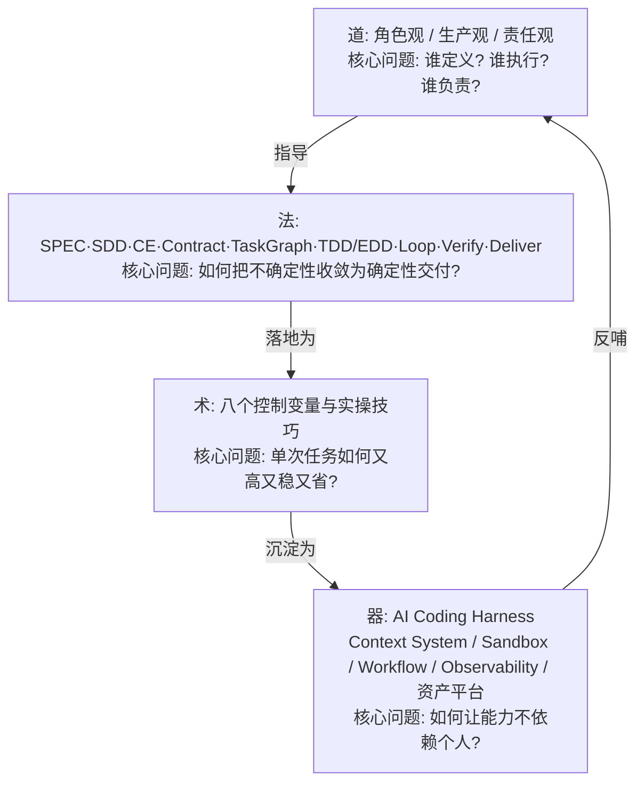
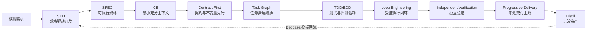
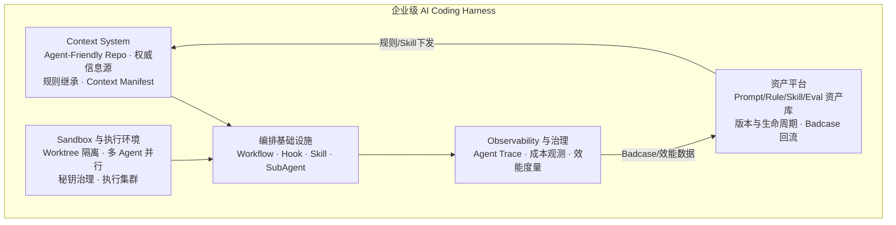

# 第二篇：企业级 AI Coding 道法术器——把概率性生成转化为确定性交付

> 导语：几乎所有工程师都体验过 AI Coding 的两副面孔：写 Demo 时如有神助，进生产时事故频发——生成的代码跑不通、改 A 坏 B、换了个人用同样的工具效果天差地别。差距不在"谁的 Prompt 更玄学"，而在是否把 AI Coding 当成一个**生产系统**来经营。本篇用"道法术器"四层框架解决这个问题：**道**回答"人与 AI 各自扮演什么角色、谁对结果负责"；**法**回答"用什么方法论把概率性生成收敛成确定性交付"；**术**回答"日常实操中有哪些高杠杆的控制变量与技巧"；**器**回答"如何把个人经验外置成团队可复用、可治理的基础设施"。

---

## 1. 道：角色观、生产观、责任观

### 1.1 个人级 vs 企业级 AI Coding

同一个 AI 编码工具，在个人手里和在企业里，是两种完全不同的活动：

| 维度 | 个人级 AI Coding | 企业级 AI Coding |
|---|---|---|
| 目标 | 把"我这个任务"快速搞定 | 让"团队所有任务"持续、可靠、低成本地交付 |
| 方法 | 临场发挥，依赖个人 Prompt 手感 | 方法论驱动：SPEC、Contract、Eval、流程化 |
| 上下文 | 人脑里装着项目背景，随口补充 | 上下文必须外置、可复现、可继承（Agent-Friendly Repo） |
| 质量 | 作者自己跑一遍觉得行就行 | 独立验证 + 自动化测试 + 回归门禁 |
| 反馈迭代 | 错了就再聊一轮 | Badcase 回流为评测资产，系统越用越强 |
| 资产归属 | Prompt 和技巧散在个人手里 | Skill、规则、Eval 集是团队工程资产 |
| 风险承担 | 翻车了重来，代价是半小时 | 翻车了上生产事故，代价是客户与资损 |

由此得到**企业级 AI Coding 有效产出公式**：

> **有效产出 = AI 生成量 × 验证通过率 × 资产复用率 − 返工与事故成本**

个人级只优化第一项（生成量），企业级必须同时经营后三项。这也解释了为什么"AI 写了 80% 的代码，团队却变更慢了"——验证与返工成本吞掉了生成红利。

### 1.2 道法术器四层架构

### 1.3 三观详解

**角色观：从"写代码的人"到"软件交付系统的设计者"。** 你的产出不再是代码本身，而是"一套能持续产出可靠代码的系统"——包括任务定义、上下文供给、执行编排与审查机制。亲手 Coding 让位于**定义（Define）、编排（Orchestrate）、审查（Review）**三件套。这并不意味着不读代码——恰恰相反，审查者必须比写作者更懂代码，只是体力活外包给了 AI。

**生产观：三个转向。**

1. **从"Prompt 决定质量"到"工程系统决定质量"。** 同一条 Prompt 在不同上下文、不同验证机制下产出质量天差地别。质量是系统的涌现属性，不是某句话的功劳。
2. **从"节省 Token"到"优化总交付成本"。** Token 成本往往只是总成本的小头，返工、事故、人力审查才是大头。多花 3 倍 Token 做一次独立验证，可能省掉一次线上事故——总账是赚的。
3. **从"一次任务完成"到"每次任务形成复利资产"。** 每次任务结束问一句：这次有没有产出可复用的 SPEC 模板、Skill、Badcase、Eval 用例？有，则团队下一次更快；没有，则永远原地踏步。

**责任观：从"追求全自动"到"风险适配的自动化"。** 自动化程度不该由"技术上能不能"决定，而由"错了代价多大"决定：低风险（草稿、探索）全自动；中风险（只读操作、内部变更）自动执行 + 独立验证；高风险（写库、付款、对外发布）AI 提议、人审批、确定性系统执行。全自动不是目标，**可信的自动化**才是。

---

## 2. 法：九大企业级方法论

法的总纲是一条交付流水线，每一环对应一种收敛不确定性的方法。AI Coding 的不确定性有且仅有四类：**目标不确定**（要做什么没说清）、**上下文不确定**（AI 不知道该看什么）、**执行不确定**（过程跑偏）、**验证不确定**（不知道做得对不对）。九种方法分别对准这四类：

### 2.1 SDD（Spec-Driven Development）：从模糊需求到可执行规格

SDD 主张：**AI 时代写代码之前先写规格，且规格要精确到"可执行"程度**——包含目标、非目标、输入输出契约、验收标准、边界情况。为什么？因为 LLM 是"字面意义的天才"：规格里没写的它不会替你补常识，规格里模糊的它会用幻觉填坑。一份好 SPEC 同时是给人看的对齐文档和给 AI 看的编程输入。

以贯穿项目 DataAgent 为例："支持租户查询经营数据"是坏规格；"输入：自然语言问题 + 租户 ID；输出：SQL + 结果表 + 口径说明；约束：仅只读、仅本租户数据、单查询≤30s；验收：20 个标注问题中口径正确率≥90%"才是可执行规格。

### 2.2 Context Engineering：构造最小充分上下文

法的层面强调**"最小充分"原则**：给少了，AI 靠猜（幻觉）；给多了，关键信号被淹没（lost in the middle）且成本爆炸。操作要点：

- **分层供给**：稳定层（架构原则、代码规范）常驻；任务层（相关文件、接口定义、相似实现）按需注入；即时层（当前错误信息、diff）精确投放。
- **高信号密度**：一段 20 行的接口契约胜过一个 2000 行的整个文件。教会 AI（和自己）"先给契约，再给实现片段，最后才给全文件"。
- **可复现**：同一份上下文清单（Context Manifest）应能让任何 Agent 在任何机器上重建相同的任务环境。

### 2.3 Contract-First 与 Invariant-Driven Development

先定契约（接口签名、Schema、协议），再让 AI 填实现——契约是 AI 与人类、AI 与 AI 之间的**稳定锚点**。不变量驱动更进一步：明确"无论实现怎么改都必须成立的性质"（如"所有租户查询必须带 tenant_id 过滤""任何写操作必须有审批记录"），并把不变量写成可执行的断言/测试。AI 生成代码的天然风险是"局部正确、全局破约"，不变量断言把全局约束变成每次生成都必须越过的栏杆。

### 2.4 Task Graph：复杂任务的拆解与编排

超过一个上下文窗口或一个专注度的任务，必须显式拆解为**有依赖关系的任务图**：节点是子任务（各自带 SPEC、上下文、验收），边是依赖。拆解的原则：

- **每个节点独立可验证**——验收标准随任务一起下发，而不是最后统一验收；
- **依赖最小化**——可并行的分支（如"订单模块改造"与"库存模块改造"）显式标出，交给 SubAgent 并行；
- **关键路径人工看护**——影响面大的节点（改公共契约、动数据库结构）标记为需人工评审。

### 2.5 TDD 与 EDD（Test/Eval-Driven Development）

TDD 在 AI Coding 里获得新生：**测试先行 = 给 AI 一个客观的、可自动检查的完成信号。** 先写（或让 AI 先写但人审）失败测试，再让 AI 实现到测试通过——AI 的"我觉得写完了"被替换为"测试绿了"。

EDD 把同一思想推广到无法用单元测试断言的领域（生成质量、Agent 行为）：为任务定义 Eval 集（输入 + 评分标准 + Grader），让"效果达标"像"测试通过"一样可自动判定。DataAgent 的"口径正确率≥90%"就是 EDD 而非 TDD 的对象。

### 2.6 Loop Engineering：建立受控执行闭环

让 AI 迭代（写→跑→看报错→改）是提效的源泉，失控迭代（无限重试、原地打转、越改越坏）是烧钱的深渊。受控闭环四要素：

1. **停止条件**：成功判据（测试绿/Eval 达标）+ 失败判据（最大轮次、预算耗尽、同一错误重复 N 次）；
2. **状态压缩**：每轮只把"当前代码 + 最新错误"喂回去，不让对话无限膨胀；
3. **升级机制**：连续失败时升级给人，而不是让 AI 在死胡同里烧 Token；
4. **可观测**：每一轮的输入、输出、工具调用留 Trace，事后能复盘"它在第几轮开始跑偏的"。

### 2.7 Independent Verification：独立验证与证据驱动审查

核心原则：**产出者和验证者不能是同一个上下文。** 让写代码的 Agent 自证"我写对了"没有意义——同一个模型、同一份上下文会犯同一个盲点错误。独立验证的实现：

- 用另一个会话（甚至另一个模型）只看"SPEC + 产出 diff"，不带实现过程的自我辩护；
- 验证产出必须是**证据**：测试运行结果、静态扫描报告、契约比对——而不是"看起来对"的意见；
- 高风险变更要求机器证据 + 人工签认双保险。

### 2.8 Progressive Delivery：从代码完成到安全上线

代码写完只是交付的起点。渐进交付链条：本地验证 → CI 全量测试 → 预发环境 → 小流量 Canary → 全量，每一级都有可量化的通过标准和一键回滚。对 AI 生成代码尤其重要，因为它的失败模式（边界遗漏、隐性假设）往往在真实流量下才暴露。

### 2.9 Distill：资产蒸馏

每次任务结束时，把可复用的部分蒸馏出来：新沉淀的 SPEC 模板、一条团队规则、一个 Skill、若干 Badcase 和 Eval 用例。这是"生产观"第三条（复利资产）的落地机制，也是从"法"通向"器"的桥梁。

---

## 3. 术：八个控制变量与实战技巧

法是方法论，术是手感。企业级 AI Coding 的日常优化围绕**八个控制变量**展开，并且始终同时优化四个目标：**效果、效率、成本、人类注意力**（注意力是最稀缺的资源——凡是能让 AI 自动检查的就别让人看）。

| # | 控制变量 | 控制什么 | 关键技巧 |
|---|---|---|---|
| 1 | **任务粒度** | 单次交给 AI 的任务大小 | 小到能在一个上下文内自洽验证；大到值得一次编排开销 |
| 2 | **上下文配比** | 喂什么、喂多少、什么顺序 | 契约优先、示例居中、动态信息靠后；定期"重启上下文"防污染 |
| 3 | **Prompt 结构** | 指令的表达 | 角色+目标+约束+输出格式+示例五段式；负面约束（不许做什么）比正面描述更有效 |
| 4 | **执行节奏** | 何时自动、何时暂停等人 | 计划确认点、关键变更确认点、预算检查点 |
| 5 | **Loop 参数** | 迭代轮次、预算、停止条件 | 每类任务预设预算上限；同一错误 3 次即升级 |
| 6 | **验证强度** | 用什么证据放行 | 风险分级匹配验证强度（低风险抽检、高风险全量+双人） |
| 7 | **工具与权限** | AI 能调什么、能动什么 | 最小权限；只读/写分离；副作用操作强制审批 |
| 8 | **模型与路由** | 哪个任务用哪个模型 | 简单任务用小模型，规划/诊断用推理模型；失败时升级模型而非死磕 |

高频技巧举要：

- **Prompt 与任务控制**：把大需求写成"验收标准清单"而非描述性段落；要求 AI 先复述理解再动手（便宜的误解检查）；给"完成定义"（Definition of Done）。
- **上下文工程**：定期清空对话重开（带新上下文清单），比在 100 轮污染对话里继续有效；用结构化摘要替代长历史。
- **Hook 与确定性自动化**：能用脚本保证的（格式化、Lint、提交前测试、危险命令拦截）绝不让模型"自觉遵守"——Hook 是 100% 可靠的，模型的自觉不是。
- **Skill 沉淀**：把重复三次以上的操作流程封装成 Skill（带触发条件、步骤、验收），让最佳实践脱离个人记忆。
- **SubAgent 编排**：把"探索"（读大量代码找线索）和"执行"（精确修改）分给不同 SubAgent——探索者上下文脏了无所谓，执行者的上下文必须干净；并行 SubAgent 处理独立模块，主 Agent 只做合并与冲突裁决。

---

## 4. 器：AI Coding Harness

### 4.1 从工具到 Harness

单点工具（一个 IDE 插件）→ 工具链（插件 + CI + 脚本）→ **Harness（企业级生产系统）**。器的本质是：**把"道"的制度、"法"的流程、"术"的经验，全部外置为不依赖个人自觉的基础设施。** 判断你有没有 Harness 的标准很简单：一个新人第一天入职，不请教任何人，能否在系统的引导下产出符合团队标准的 AI 辅助代码？

### 4.2 Harness 五大组件

**① Context System：让 Agent 获得最小必要信息。** 建设 Agent-Friendly Repository：架构决策有 ADR、模块有 README、接口有契约文件、术语有词表——AI 和人一样，进项目先读文档。治理三个老大难：**规则继承**（全局规则→仓库规则→模块规则的覆盖链）、**冲突治理**（两份文档说法不一致时谁是权威源）、**过期治理**（文档与代码漂移的检测）。Context Manifest 记录"本次任务用了哪些上下文版本"，保证任务可复现、事故可回溯。

**② Sandbox 与执行环境。** 每个 Agent 任务在独立 Worktree/容器中执行，互不污染；秘钥与环境变量集中治理、按需注入、不留痕在上下文里（防泄露进 Prompt 日志）；从开发者本机演进到企业执行集群后，多 Agent 并行跑任务成为标准能力。

**③ Workflow / Hook / Skill 编排基础设施。** Workflow 承载固定流程（如"需求→SPEC→实现→验证→PR"），Hook 承载确定性闸门（提交前必跑测试、危险 SQL 拦截、预算超限熔断），Skill 承载可复用操作手册。三者关系：**Workflow 定流程，Hook 守底线，Skill 传经验。**

**④ Observability 与组织治理。** 从"监控 Token 用量"升级为"观测软件生产效能"：每个任务花了多少 Token、几轮迭代、验证通过率、人工介入次数、最终返工率。Agent Trace（每一次模型调用、工具调用、决策点的完整记录）既是调试工具也是审计依据。治理层面，这些数据支撑"AI 领导力"决策：哪些流程值得加大自动化、哪些团队在裸奔、哪些模型路由策略在浪费钱。

**⑤ 资产平台。** 划清五类资产的边界与生命周期：

| 资产 | 本质 | 所有者 | 生命周期管理 |
|---|---|---|---|
| Prompt | 单次/模板化指令 | 个人→团队 | 版本化，随模型升级回归测试 |
| Rule | 团队级约束与规范 | 团队 | 评审制变更，过期审查 |
| Skill | 封装的操作流程 | 团队 | 触发条件明确，带验收标准 |
| Workflow | 编排好的流程 | 平台组 | 变更走发布流程 |
| Eval | 评测数据集与 Grader | 团队 + QA | Badcase 持续回流，防过拟合 |

**个人资产→团队资产的升级机制**：个人验证有效 → 补充测试与文档 → 评审入库 → 全员可用 → 持续由 Badcase 回流喂养。这个飞轮转起来，组织的 AI 能力就能**随模型共同进化**——新模型发布时，用团队 Eval 集回归一遍，就知道哪些资产失效、哪些能力解锁，而不是靠玄学体感。

---

## 常见误区

1. **"AI 生成代码快 = 团队交付快。"** 生成量只是公式第一项。验证、返工、事故成本不治理，写得越快欠账越多。
2. **"找到一条神 Prompt 就能解决质量问题。"** 质量是 SPEC、上下文、验证、流程的系统涌现。同一条 Prompt 换个人、换个项目就失灵，因为它依赖的隐性上下文没外置。
3. **"追求全自动是先进，人工审批是落后。"** 全自动调预算、写生产库的企业系统等于裸奔。风险适配的自动化才是成熟：低风险全速跑，高风险人守门。
4. **"让写代码的 Agent 自己检查一遍就算验证了。"** 同一上下文同一盲点。独立验证的价值恰恰在"不知情"——只看 SPEC 和 diff 的验证者才能发现实现者的系统性偏差。
5. **"上下文给得越全越好，把仓库都塞给它。"** 全量上下文 = 低信号密度 + 高成本 + lost in the middle。最小充分 + 契约优先才是正解。
6. **"资产平台是大公司才需要的奢侈品。"** 恰恰相反——没有资产沉淀，团队规模稍大就会陷入"每个人重复踩同一个坑"。三个人就该开始攒 Skill 和 Badcase。

## 动手练习

1. **写一份可执行 SPEC**：选一个你本周要做的真实需求（例如"为 DataAgent 增加库存预警功能"），按"目标/非目标/输入输出契约/约束/验收标准/边界情况"六段式写一份 SPEC；然后把它交给 AI 实现，对比"有 SPEC"与"无 SPEC 直接口头描述"两种方式的产出质量与返工轮次。
2. **给现有项目做一次 Agent-Friendly 改造**：为一个仓库补齐三样——根 README（架构一句话图 + 如何跑测试）、一份 ADR（最近一个重要决策）、模块级接口契约文件。然后让一个"零上下文"的新会话来仓库里完成一个小任务，记录它少问了你几个问题。
3. **搭建最小受控 Loop**：为任意 AI 编码任务实现一个脚本化的迭代闭环——跑测试→失败则把错误日志喂回 AI→最多 5 轮→仍失败则停止并输出 Trace。观察并记录：它在哪类错误上会原地打转？你据此调整了什么停止条件？
4. **做一次独立验证实验**：让 AI 实现一个有 5 个边界条件的函数，先让它自查，再用一个只给"SPEC + diff"的干净会话独立验证，对比两边发现的问题数。体会"产出者与验证者分离"的价值。
5. **绘制你的控制变量基线**：选一个常用 AI 工作流，逐项标注八个控制变量当前的取值（任务粒度多大、上下文怎么配、预算上限多少、验证强度如何……），找出其中"从未有意识调过"的三项，各做一次调整实验并记录效果。

## 自测清单

- [ ] 我能写出企业级 AI Coding 有效产出公式，并解释每一项如何被"法"和"器"优化。
- [ ] 我能说清三观（角色观/生产观/责任观）各自的"从什么转向什么"。
- [ ] 我能解释 AI Coding 的四类不确定性，以及九种方法分别对准哪一类。
- [ ] 我能写出一份六段式可执行 SPEC，并说出它与"需求描述"的本质区别。
- [ ] 我理解"最小充分上下文"与"高信号密度"，知道契约为什么要先于实现喂给 AI。
- [ ] 我能说明 Contract-First、不变量断言、TDD/EDD 如何共同构成"确定性锚点"。
- [ ] 我能设计带停止条件、状态压缩、升级机制的受控 Loop。
- [ ] 我理解独立验证为什么必须与产出者分离，并能给出两种实现方式。
- [ ] 我能列出八个控制变量，并说明如何在效果、效率、成本、人类注意力之间权衡。
- [ ] 我能画出 Harness 五大组件及其相互关系，解释"个人资产→团队资产"的升级飞轮。
