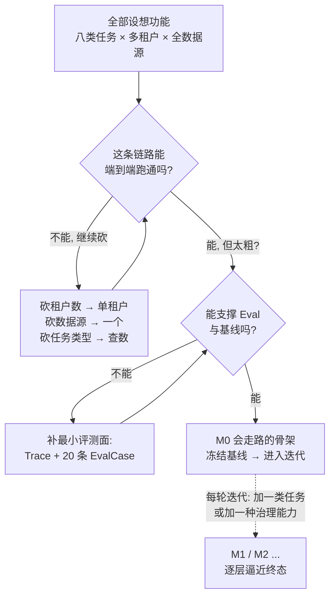
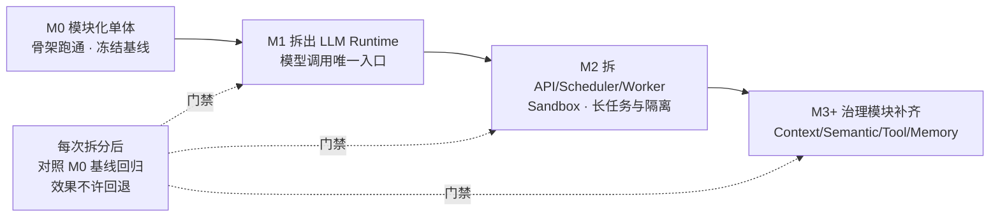
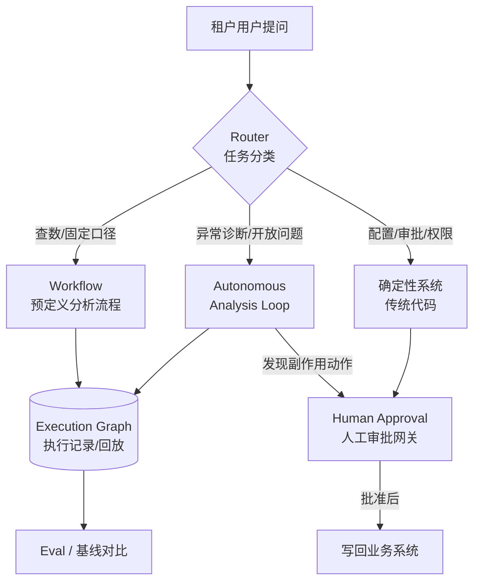
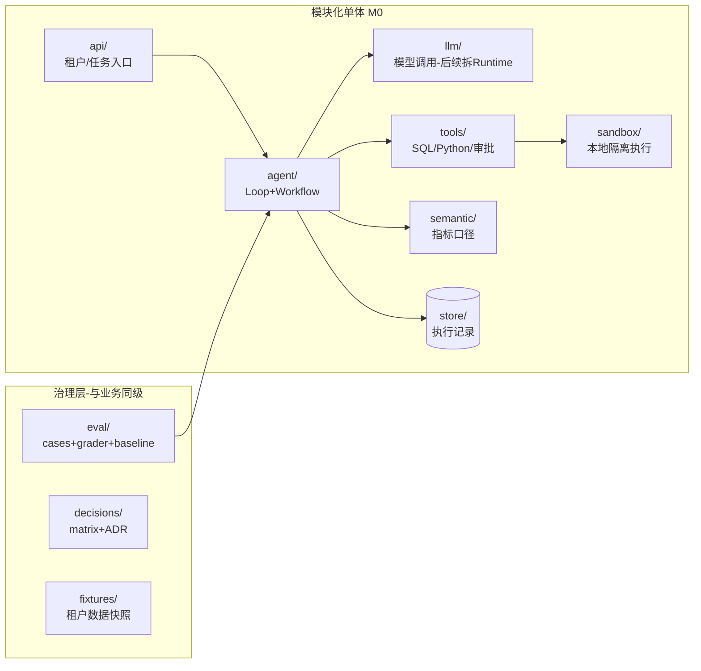

# 第三篇：贯穿实战立项篇——把真实业务问题转化为可验证、可演进的企业级 Agent 项目

> 导语：大多数 Agent 项目的失败，不是败在模型能力，而是败在"立项"——把一句业务口号直接翻译成 Demo，没有边界、没有基线、没有决策记录，三个月后没人说得清系统到底该有多好、为什么长成现在这样。本篇以贯穿项目"多租户零售经营分析 DataAgent"为例，讲清楚一件企业级 Agent 项目在写下第一行业务代码之前必须完成的事：定义业务与目标、确定架构起点与职责边界、建立选型决策机制、签下质量契约并冻结 M0 评测基线、搭好脚手架。这一篇产出的是"工程判断力"，后续所有篇章都在它划定的轨道上演进。

---

## 1. 项目业务与目标：DataAgent 到底要解决什么问题

### 1.1 业务场景

DataAgent 面向品牌商家与零售企业，以 SaaS 形态服务**多个企业租户**。每个租户有自己的数据源（订单库、商品库、库存系统、会员系统、广告投放平台、售后系统）、自己的指标口径、自己的预算和权限体系。租户内的运营、商品、财务等角色用自然语言提出经营问题，Agent 自主完成分析闭环。

这个场景的关键特征：**它不是"自然语言查数"（NL2SQL）的升级版**。NL2SQL 只回答"数是多少"，DataAgent 要回答"发生了什么、为什么、该怎么办、做完效果如何"。这两者的工程复杂度差一个数量级。

### 1.2 八类典型任务与它们的架构含义

| 典型任务 | 示例 | 对架构的要求 |
| --- | --- | --- |
| 跨源数据查询 | "上周华东区 TOP10 商品的销量和库存" | Data Connector、只读 Query Gateway、SQL 安全 |
| 指标口径理解 | "毛利率"在不同租户口径不同（是否含运费、是否扣券） | Semantic / 指标治理模块，术语与血缘管理 |
| SQL + Python Sandbox 分析 | 漏斗分析、同期群分析、图表生成 | 云端 Sandbox 隔离、资源限额、结果回传 |
| 指标异常诊断 | "GMV 昨天跌了 18%，为什么" | Autonomous Analysis Loop、证据链追踪 |
| 行动建议 | 补货、调价、人群运营、预算调整 | 建议与执行分离，输出结构化建议单 |
| 人工审批 | 创建工单、调整广告预算、写回业务系统 | 副作用工具风险分级、Human Approval 网关 |
| 周期报告与持续监测 | 每周一 9:00 生成经营周报，持续跟踪行动效果 | Scheduler、长任务、状态持久化 |
| 租户管理 | 管理员配置数据源、指标、模型、工具、预算、权限 | 多租户隔离、配置中心、审计日志 |

注意最后一列：每一条业务诉求都直接映射到一个架构模块。这正是立项阶段要做的事——**把业务语言翻译成系统能力清单**，而不是先写 Prompt。

### 1.3 为什么这个场景适合 Agent，而不是传统 BI 或报表

判断标准是三点：**任务的开放性**（"诊断 GMV 异常"没有固定查询模板，需要根据中间结果决定下一步查什么）、**步骤的不可预知性**（分析计划要在运行时生成，无法预先穷举）、**行动的闭环性**（从洞察到审批到执行到效果追踪）。如果三个问题的答案都是"否"——问题固定、路径固定、只读不写——那应该做 BI 报表，不要做 Agent。立项时先过这三问，能挡掉一半"为了 Agent 而 Agent"的伪需求。

### 1.4 立项方法：一页立项书，先对齐再动工

企业里立项失败的头号原因不是方案差，而是**各干各的理解**：老板以为要做"全自动经营参谋"，工程师以为要做"查数机器人"，三个月后互相指责。对策是把对齐动作压缩成**一页立项书**——超过一页说明你没想清楚，不足一页说明你没想具体。立项书本质上是篇02 SPEC 六段式在"项目"这个更大尺度上的应用[^course]：

| 立项书栏目 | 要回答的问题 | 常见翻车 |
|---|---|---|
| **业务问题** | 谁在什么场景下痛？现在怎么解决的、为什么不够？ | 写的是"我们要用大模型做 XX"——这是方案不是问题 |
| **目标与成功度量** | 做到什么程度算成？数字是什么？ | "提升分析效率"——不可度量等于没有目标 |
| **非目标** | 明确不做什么 | 不设非目标，范围蔓延到失控 |
| **Agent 三问** | 开放性/不可预知性/闭环性逐项论证 | 跳过三问，为 Agent 而 Agent |
| **边界与约束** | 数据权限、预算上限、合规红线 | 上线后才发现碰不得某类数据 |
| **M0 范围** | 第一刀切在哪（见 1.5 节） | 第一版就想做终态 |
| **风险与备选** | 最大的三个不确定点，各自的 Plan B | 只有乐观路径 |

写完立项书的对齐仪式只有一个：**让 stakeholders 逐栏确认，尤其是"非目标"栏**——人很容易同意"要做什么"，真正的对齐发生在"不做什么"上。

### 1.5 MVP 切割：纵切蛋糕，而不是横切分层

M0 切多大？新手最容易犯的反模式是**横切**：先花两个月把"所有数据连接器"做完，再做语义层，再做 Loop——每层都是半成品，任何一层出问题整体归零，而且直到最后一天都没有一个能跑的端到端流程。

正确的切法是**纵切（Walking Skeleton，会走路的骨架）**：选一条最窄但完整的业务链路，从头到尾打穿——哪怕只支持"单租户 + 一个数据源 + 查数一类问题"，但它能真实地"提问→生成 SQL→执行→返回答案→留下 Trace→被 EvalCase 评测"。骨架的价值有三：第一，**端到端风险最先暴露**（集成问题、口径问题、延迟问题，都是横切法最后才遇到的）；第二，**每个迭代都有可演示、可评测的增量**——这正是 4.2 节 M0 基线能存在的前提；第三，**团队士气靠"能跑的东西"喂养**，不靠架构图。



切割决策的三条纪律：**砍宽度不砍深度**（链路必须完整，范围可以很窄）；**砍功能不砍评测**（Eval 和 Trace 从 M0 就在，它们不是功能，是眼睛）；**砍实现不砍边界**（模块接口按终态设计，实现按现状从简——这就是 2.1 节"为将来拆分保留可能性"的含义）。

---

## 2. 系统架构：为什么从模块化单体起步

### 2.1 模块化单体 vs 微服务：起点之争

新手最常见的误判是：既然最终形态是多租户、长任务、云端 Sandbox、微服务部署，那就第一天直接上微服务。这是企业级 Agent 项目的第一大坑。

课程采用**演进式架构**[^phoenix]：先用模块化单体建立业务、数据与效果基线（M0），再依次拆出 LLM Runtime、Agent API/Scheduler/Worker/Sandbox，最后增加 Data Connector、Query Gateway、Context、Semantic、Tool、Memory 等治理模块。理由有三：

1. **边界还不稳定**。Agent 系统的模块边界（Context 归谁管、Memory 和 Knowledge 怎么分）需要在真实 Badcase 中才能看清。服务拆早了，每次边界调整都变成跨服务的 API 变更，成本放大十倍。
2. **基线必须先于拆分**。没有 M0 基线，你无法回答"拆出 LLM Runtime 之后效果有没有变差"。模块化单体让评测、Trace、数据都在一个进程里，基线成本最低。
3. **分布式问题会掩盖 Agent 问题**。M0 阶段你要调试的是"Agent 为什么诊断错了"，不是"消息为什么丢了"。把分布式复杂度推迟到它被证明需要的时候。

| 维度 | 模块化单体 | 微服务 |
| --- | --- | --- |
| 适用阶段 | M0-M1：边界探索、基线建立 | M2+：边界稳定、需要独立扩缩容 |
| 模块边界调整成本 | 改包结构，一次重构 | 跨服务 API 变更，多团队协调 |
| 调试与 Trace | 进程内调用栈，天然完整 | 需要分布式追踪基础设施 |
| 独立扩缩容 | 不支持 | 支持（Sandbox、Worker 需要） |
| 故障隔离 | 弱（一崩全崩） | 强 |
| 团队并行 | 小团队足够 | 多团队必需 |

**关键认知**：模块化单体不是"简陋版微服务"，而是一种有意识的架构决策——用单体的低复杂度换取边界探索期的高迭代速度，并通过严格的模块边界（只允许跨模块接口调用、禁止跨模块读表）为将来的拆分保留可能性。

里程碑演进路线与每次拆分的"基线回归"纪律：



注意图中没有画"推翻重来"的分支——演进式架构的每一站都是可独立交付、可评测的系统，不是烂尾楼的脚手架。

### 2.2 四种执行范式的职责边界

DataAgent 内部并存四种执行方式，立项时必须划清它们各自管什么：

- **确定性系统（Deterministic System）**：传统代码。租户配置、权限校验、SQL 安全审查、审批流、账单归集。输入确定则输出确定，可单测、可审计。
- **Workflow**：预定义的有向步骤序列，步骤内部可以是 LLM 调用。适合"周报生成"这种路径固定、但每个步骤需要生成能力的任务。
- **Autonomous Analysis Loop**：Agent 自主循环——观察→规划→行动（调工具）→再观察，直到满足停止条件。适合"GMV 异常诊断"这种路径不可预知的任务。
- **Execution Graph**：对一次具体执行的拓扑建模（节点=动作，边=依赖），是 Loop/Workflow 运行后的**记录与回放结构**，也是 Graph Engineering 的建模对象。

| 维度 | 确定性系统 | Workflow | Autonomous Loop |
| --- | --- | --- | --- |
| 路径何时确定 | 编译期 | 设计期 | 运行时 |
| 典型任务 | 权限、审批、账单 | 周期报告 | 异常诊断 |
| 可预测性 | 完全 | 高 | 低 |
| 验证方式 | 单元测试 | 流程测试 + 步骤 Eval | Outcome/Trajectory Eval |
| 失败成本 | 低（快速失败） | 中 | 高（可能跑偏烧钱） |

职责边界的原则一句话：**能用确定性代码解决的，不用 Workflow；能用 Workflow 解决的，不用 Autonomous Loop**。自主性是有成本的（不可预测、烧钱、难验证），只在路径不可预知的诊断类任务上购买它。



---

## 3. 架构选型机制：让每个决策都有证据

企业级架构和 Demo 的核心区别：每个关键取舍都留下**可审查的证据链**。课程要求每个里程碑走同一套机制：

1. **候选方案（Candidates）**：至少列出 2-3 个真实可行的方案，包括"什么都不做"。
2. **Decision Matrix（决策矩阵）**：把候选方案 × 评估维度（效果、成本、时延、稳定性、演进成本、团队能力）打分。打分必须有依据，维度权重必须写明。
3. **Benchmark**：对影响效果的方案，跑同一组数据集对比，用数字说话。
4. **Badcase 库**：每个被淘汰的方案，至少记录一个"它在什么情况下会失败"的具体案例。Badcase 是架构评审中最有说服力的材料。
5. **ADR（Architecture Decision Record）**：把最终决定固化成一份短文档——背景、选项、决定、后果。ADR 遵循"不可变"原则：推翻旧决策就写新 ADR，不改旧的。

为什么需要这套机制？因为 Agent 系统的选型几乎都是**情境依赖**的：没有"最好的路由策略"，只有"在你的成本预算和 Badcase 分布下最合适的策略"。没有证据链，三个月后的新成员只能看到结论，看不到约束条件，于是重蹈覆辙。

### 3.1 Decision Matrix 与 ADR 的代码化

把决策机制做成脚手架的一部分，而不是 Wiki 里的文档：

```python
# decision/matrix.py —— 决策矩阵：候选方案 × 加权维度
from dataclasses import dataclass, field

@dataclass
class Score:
    value: float          # 1-5 分
    evidence: str         # 打分依据：Benchmark 编号 / Badcase 编号 / 实测数据

@dataclass
class DecisionMatrix:
    topic: str                                  # 例："M1 模型路由策略选型"
    weights: dict[str, float]                   # 例：{"效果":0.4,"成本":0.3,"稳定性":0.3}
    candidates: dict[str, dict[str, Score]] = field(default_factory=dict)

    def rank(self) -> list[tuple[str, float]]:
        result = {}
        for name, dims in self.candidates.items():
            missing = set(self.weights) - set(dims)
            if missing:
                raise ValueError(f"{name} 缺少维度评分: {missing}")  # 不许漏评
            result[name] = sum(self.weights[d] * dims[d].value for d in self.weights)
        return sorted(result.items(), key=lambda kv: -kv[1])

# decisions/ADR-0003.md 由脚本校验必填章节：
# Status / Context / Options(with Badcase refs) / Decision / Consequences
@dataclass
class ADR:
    id: str                 # ADR-0003
    status: str             # proposed | accepted | superseded-by(ADR-0007)
    context: str            # 约束条件：为什么现在必须决定
    options: list[str]      # 每个选项附 Badcase 引用
    decision: str           # 选了什么
    consequences: list[str] # 正面与负面后果都要写
```

CI 里加一条检查：新增 ADR 若 `options` 不足 2 个或缺少 Badcase 引用，直接 fail。机制要长在流水线里才有约束力。

---

## 4. 质量契约与 M0 评测基线

### 4.1 三层成功标准

"系统好不好"必须拆成三个可独立测量的层次，否则一次回归你不知道该怪谁：

| 层次 | 关注的问题 | DataAgent 示例指标 | 典型工具 |
| --- | --- | --- | --- |
| **Outcome（结果层）** | 最终交付物对不对 | 诊断结论准确率、建议采纳率、报告事实错误数 | Golden Dataset + Grader（规则/人工/LLM-as-Judge） |
| **Trajectory（轨迹层）** | 过程走得好不好 | 步骤数是否合理、有无无效 SQL、证据链完整性、是否该停就停 | Execution Graph 分析、轨迹对比 |
| **System（系统层）** | 工程属性达不达标 | P95 时延、单次任务成本、故障率、审批合规率、租户隔离零事故 | 监控、压测、审计 |

三层必须**同时**定义。只看 Outcome 会放过"蒙对的烂轨迹"（这次对了下次就错）；只看 Trajectory 会陷入过程洁癖；不看 System 则上线即翻车。

### 4.2 M0 基线：冻结起点，才能度量演进

M0 是模块化单体跑通后的第一个可评测版本。基线要记录六类数据：**任务质量**（Outcome 分数分布）、**证据完整性**（结论是否都有数据支撑）、**成本**（每任务 token / 金额）、**时延**（P50/P95）、**安全**（越权访问、危险 SQL 拦截数）、**失败类型**（Failure Taxonomy 的首批分类）。后续每个里程碑的验收标准就是"相对 M0 基线的改进量"，这就是 Regression Gate 的数据来源。

```python
# eval/baseline.py —— M0 评测基线的核心数据结构
from dataclasses import dataclass, field
from enum import Enum

class FailureType(str, Enum):
    WRONG_METRIC_SEMANTIC = "指标口径理解错误"
    BAD_SQL = "SQL 生成/执行失败"
    MISSING_EVIDENCE = "结论缺少证据"
    OVERREACH = "越权/危险操作"
    LOOP_NONSTOP = "Loop 未在预算内收敛"
    SANDBOX_ERROR = "Sandbox 执行异常"

@dataclass
class EvalCase:
    id: str                    # "gmv-drop-diagnosis-001"
    tenant_fixture: str        # 固定租户数据快照，保证可复现
    question: str              # "昨天 GMV 为什么跌"
    expected_outcome: dict     # 期望结论的关键要素（非全文匹配）
    trajectory_checks: list[str]  # 例：["必须先查分渠道GMV再下钻","证据>=2条"]
    cost_budget_usd: float
    deadline_sec: int

@dataclass
class TrialResult:
    case_id: str
    outcome_score: float       # 0-1，由 Grader 给出
    trajectory_violations: list[str]
    cost_usd: float
    latency_ms: int
    failures: list[FailureType]

@dataclass
class Baseline:
    version: str               # "M0"
    frozen_at: str
    trials: list[TrialResult] = field(default_factory=list)

    def summary(self) -> dict:
        n = len(self.trials)
        return {
            "outcome_avg": sum(t.outcome_score for t in self.trials) / n,
            "p95_latency_ms": sorted(t.latency_ms for t in self.trials)[int(n*0.95)-1],
            "cost_avg_usd": sum(t.cost_usd for t in self.trials) / n,
            "failure_dist": {f.value: sum(1 for t in self.trials if f in t.failures)
                             for f in FailureType},
        }
```

要点：`tenant_fixture` 用**数据快照**而非活库，否则基线不可复现；`expected_outcome` 校验关键要素而非全文，给生成留空间；基线文件入库并打 tag，M0 之后任何人不许改。

---

## 5. 项目脚手架

脚手架的目标：让"质量契约"和"决策机制"从第一天起就是代码结构的一部分。



关键约定：`eval/`、`decisions/`、`fixtures/` 与业务代码**同级**，而不是藏在 `tests/` 角落——它们是和功能代码同等重要的一等公民；`llm/` 在 M0 只是薄封装，但所有模型调用必须经过它，为第四篇拆出 LLM Runtime 埋下唯一入口。

---

## 常见误区

1. **先写 Prompt 后定指标**。没有 EvalCase 的 Prompt 优化是玄学。先写 20 条 M0 用例，再谈调优。
2. **把"模块化单体"写成"大泥球单体"**。模块化的核心是边界纪律（接口调用、禁止跨模块读表），不是目录分得好看。
3. **ADR 写成会议纪要**。ADR 的价值在"约束条件 + 被淘汰方案及其 Badcase"，不在最终结论。
4. **Outcome 用全文匹配做 Grader**。生成式输出必须按关键要素评分，否则基线噪声大到不可用。
5. **基线用活库**。数据漂移会让三个月后所有回归对比失去意义，必须用 fixture 快照冻结。

## 本篇实战：五步走完一次立项（每步都有验收标准）

用你手头一个真实业务问题（没有就用"为线下连锁门店做一个经营问答 Agent"），五步走完一遍完整的立项流程。产出物就是一套可以直接给评审会用的立项材料。

**第 1 步：一页立项书**

- **目标**：把模糊业务诉求压缩成可对齐的一页纸。
- **操作**：按 1.4 节七栏目写立项书；Agent 三问必须逐项给论证，不接受"是/否"两个字。
- **验收标准**：找一个不了解背景的人读一遍，他能复述"解决谁的什么问题、不做什么、第一版切在哪"；他说不清哪栏，就改哪栏。

**第 2 步：MVP 切割**

- **目标**：练一次纵切，拒绝横切。
- **操作**：列出终态的全部能力清单（参考 1.2 节八类任务表），用 1.5 节的决策流图逐轮砍，直到剩下一条最窄完整链路；画出你的 Walking Skeleton 包含哪几环。
- **验收标准**：能回答三个问题——这条链路端到端演示一次需要几分钟？它最先暴露的集成风险是什么？被砍掉的能力排进 M1/M2 的顺序依据是什么？

**第 3 步：执行范式职责边界图**

- **目标**：给"自主性只买在刀刃上"立字据。
- **操作**：画出该项目的 Loop/Workflow/确定性系统职责边界图（参考 2.2 节），每个任务标注归属。
- **验收标准**：每个归属都能写出一句"为什么"；尤其写清"为什么审批不交给 Loop"。

**第 4 步：一次完整选型**

- **目标**：把选型机制五件套（候选→矩阵→Benchmark→Badcase→ADR）跑通一遍。
- **操作**：针对"模块化单体 vs 直接微服务"（或你项目的真实选型点）做 Decision Matrix：≥3 候选、≥4 维度、每格附证据；然后写一份 ADR；最后给脚手架的 CI 加一条规则——新增 ADR 少于 2 个 option 或缺 Badcase 引用则构建失败。
- **验收标准**：ADR 中至少引用 2 个 Badcase，且"被淘汰方案为什么不行"比"选中方案为什么行"写得更具体；故意提交一份不合格 ADR，验证 CI 真的会拦下它——机制长在流水线里才有约束力。

**第 5 步：定义 M0 评测基线**

- **目标**：让"系统变好了"从此有数字可依。
- **操作**：定义 20 条 EvalCase，覆盖 Outcome/Trajectory/System 三层和至少 4 种 FailureType；用第 4 节的 `Baseline.summary()` 跑出一版初始基线。
- **验收标准**：基线六类数据齐全；随意抽一条 EvalCase，你能说出它测的是哪一层、防的是哪类失败。

### AI Coding 实操模式：用 AI 加速立项，但不让 AI 替你拍板

立项阶段 AI 的最佳角色是**魔鬼代言人 + 材料起草员**：它帮你挑刺、起草、穷举风险，但"切在哪、赌什么"必须人拍板——因为立项的本质是责任分配，AI 不能替你负责。

**① 可复制提示词模板**

立项书压力测试：

```text
这是我们项目的立项书草稿：【粘贴】。
请扮演挑剔的投资人/架构评审，逐项输出：(1) 哪一栏最弱、为什么；
(2) Agent 三问的论证里有没有自欺欺人的地方；(3) 至少 3 个这份立项书
没想到的风险，按发生概率排序；(4) 如果只能验证一个假设再做决定，该验证哪个？
只挑刺，不夸。
```

MVP 切割辩论：

```text
这是我们 Agent 项目的终态能力清单：【粘贴清单】。
我们计划的 M0 范围是：【粘贴】。请挑战这个切法：
(1) 这条链路真的端到端完整吗，缺了哪一环就不成立？
(2) 有没有更窄但仍然完整的切法？(3) 被砍掉的能力里，
哪个的缺失会让 M0 的评测结论失真？
```

**② AI 初版人工评审清单**

- [ ] 立项书是"业务语言"不是"技术许愿"——每个栏目都能向非技术人员讲通
- [ ] AI 起草的 EvalCase 覆盖了失败模式，不是全挑模型擅长的问题（防"考题泄漏"）
- [ ] AI 给出的市场/竞品/可行性论断，逐条核实过来源或标注"未核实"
- [ ] Decision Matrix 的权重是人定的，不是 AI 顺手填的——权重就是立场
- [ ] 最终拍板的每个决策，都有具名的人负责，没有"AI 建议如此"作为理由

**③ 验收标准**

- 五步产出物齐全（立项书、切割图、边界图、矩阵+ADR、基线），且互相引用一致（如立项书的 M0 范围 = 切割图的结果 = 基线的评测对象）；
- 至少一处 AI 的反对意见改变了你的原始方案——如果一条都没有，要么你的方案完美，要么你没真的让它挑刺。

## 自测清单

- [ ] 我能说清 DataAgent 与 NL2SQL 的本质区别，并用"三问"判断任意需求是否适合 Agent
- [ ] 我能解释为什么 M0 选择模块化单体，以及它为大泥球划出的两条边界纪律
- [ ] 我能划分 Loop / Workflow / Execution Graph / 确定性系统的职责，并举例说明
- [ ] 我能完整走一遍选型机制：候选 → 矩阵 → Benchmark → Badcase → ADR
- [ ] 我能说出 Outcome / Trajectory / System 三层各自的指标与漏掉任意一层的后果
- [ ] 我知道 M0 基线要冻结哪六类数据，以及为什么必须用 fixture 快照
- [ ] 我的脚手架里 eval/decisions/fixtures 是与业务同级的一等公民

---

## 参考与脚注

[^course]: 极客时间专栏《企业级 Agent 工程化》——本篇的贯穿项目 DataAgent、八类任务映射、M0 基线与里程碑演进路线均重构自该课程的实战主线。
[^phoenix]: 周志明《凤凰架构：构建可靠的大型分布式系统》——演进式架构"以演进能力作为架构质量度量"的思想来源，模块化单体作为起点的论证与之呼应，https://icyfenix.cn 。
