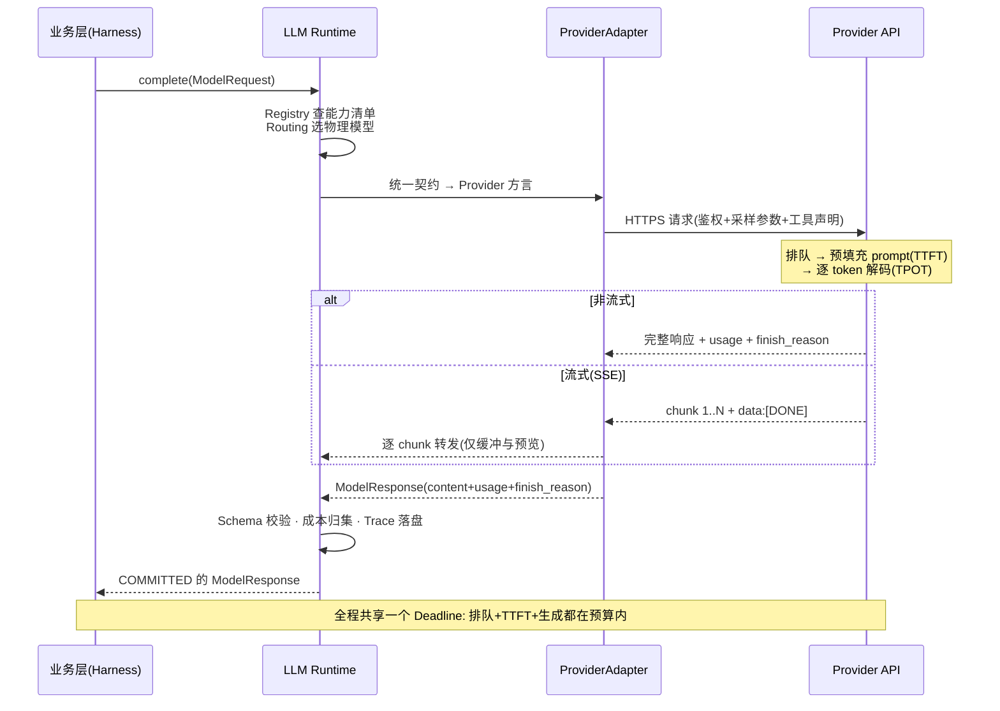
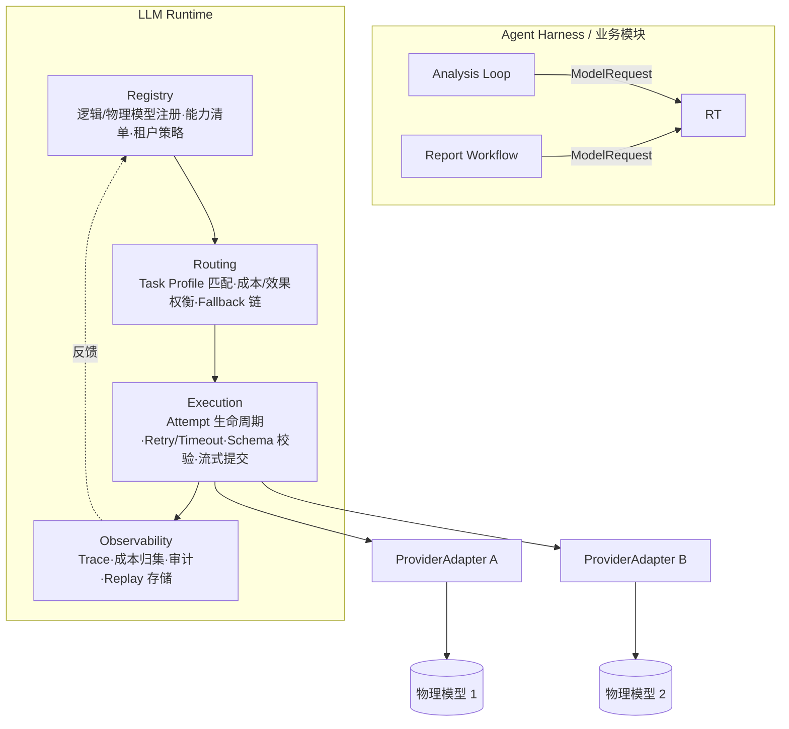
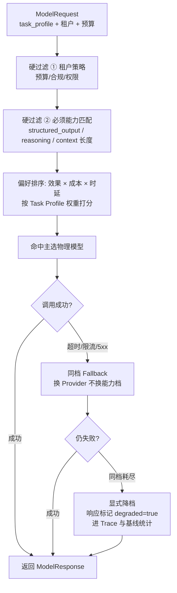
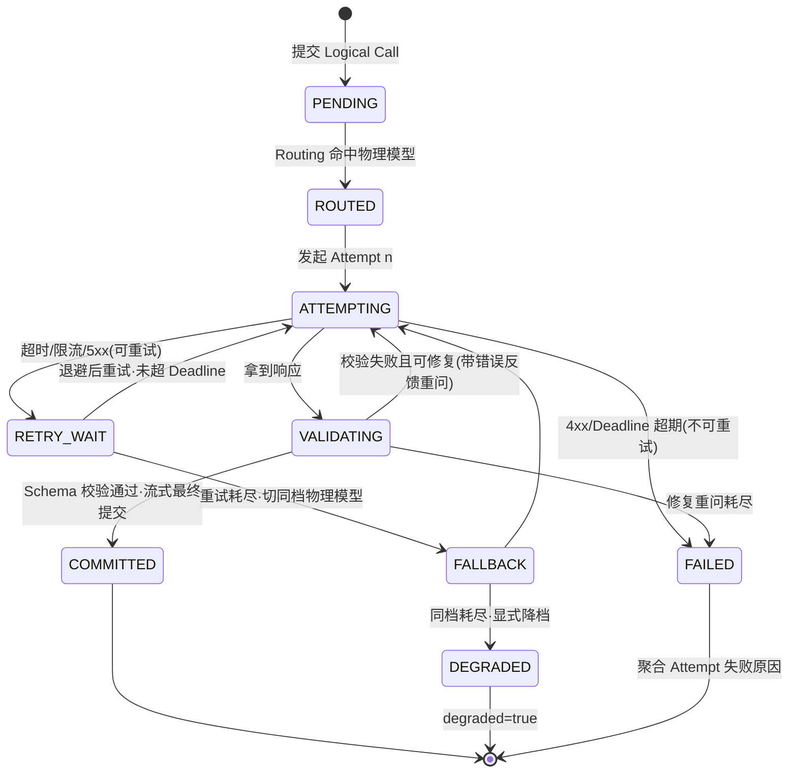
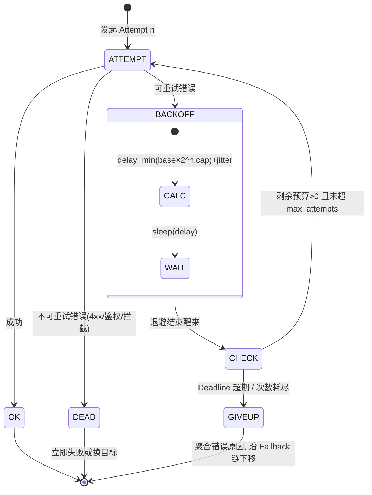

# 篇04-1：LLM 执行底座（上）——统一调用契约、API 调用解剖与重试退避

> 导语：DataAgent 立项之后，第一刀拆出去的不是 Agent 核心，而是**模型调用**。原因很简单：一次"GMV 异常诊断"可能产生几十次模型调用，涉及多个模型、多个租户、严格的成本预算和不容有失的输出格式——如果每个业务模块各自抱着 SDK 直接调，这个系统在第一周就会失控。本页（篇04 上半篇）讲透前两根支柱：统一执行边界（含一次 LLM API 调用的完整解剖——参数、计量与 SSE 流式协议）与多模型路由，并打下第三支柱「可靠执行」的概念地基——Logical Call / Attempt 之分、Timeout / Deadline / Retry / Fallback 的正交分工与指数退避 [^geektime]。结构化输出、流式两阶段提交、函数调用与模型治理，在下一页（篇04-2）继续。

---

## 1. 从散落的模型调用到 LLM Runtime

### 1.1 为什么不能在业务代码里直接调 SDK

业务代码直接调 SDK，在 Demo 里是最快路径，在企业级系统里是五种灾难的源头：

1. **多模型失控**：规划用大模型、SQL 生成用代码模型、报告用长文本模型，N 个业务模块 × M 个模型 SDK = N×M 处鉴权、重试、限流逻辑，改一处漏十处。
2. **成本无人归集**：token 账单散落在各处，月底算不清"哪个租户、哪个任务类型烧了多少"。
3. **故障语义不统一**：SDK A 的超时是 exception，SDK B 是返回 None，SDK C 是错误码字段——上层被迫写防御性代码，可靠性逻辑腐烂。
4. **输出无校验**：模型返回的 JSON 少个字段，直到下游 SQL 执行报错才暴露，排查要跨三个模块。
5. **无法回放与审计**：监管问"上季度这笔预算调整是谁的模型、哪个版本生成的"，答不上来。

结论：**模型调用是一种基础设施，不是一行 API 调用**。它值得一个独立的、有分层架构的系统。

### 1.2 职责边界：SDK Wrapper / Model Gateway / LLM Runtime / Agent Runtime

这四个概念经常被混为一谈，必须分开：

| 层次 | 管什么 | 不管什么 | 类比 |
| --- | --- | --- | --- |
| **SDK Wrapper** | 单个 Provider 的鉴权、签名、异常封装 | 多模型、路由、业务语义 | 数据库驱动 |
| **Model Gateway** | 多 Provider 统一入口、协议转换、限流、密钥托管 | 不理解"任务"，无业务路由与输出契约 | API 网关 / 代理 |
| **LLM Runtime**（本篇） | 统一调用契约 + 能力路由 + 可靠执行 + 输出契约 + 治理观测，**理解 Task Profile** | 不理解 Agent 的步骤、状态、工具循环 | 应用服务器的持久层 + 事务管理器 |
| **Agent Runtime**（后续篇） | Run/Task/Step 生命周期、调度、状态持久化、工具编排 | 不直接碰模型 SDK，只调 LLM Runtime | 应用服务器本身 |

一句话区分：Gateway 解决"请求怎么到模型"，Runtime 解决"**这个任务应该用哪个模型、怎么保证这次调用可靠、结果怎么算数**"。DataAgent 需要后者。

### 1.3 统一契约与 Provider Adapter

统一契约的核心是一个与 Provider 无关的请求/响应模型，外加每个 Provider 一个 Adapter 做双向翻译。关键设计点：**契约保留能力差异，不做最小公分母**——`reasoning_effort`、`response_schema`、`tools` 都进契约，Adapter 对不支持的能力做显式降级或拒绝，而不是静默丢弃（"稳定而不失真的边界"）。

```python
# llm_runtime/contract.py —— 统一调用契约
from dataclasses import dataclass, field
from typing import Any, AsyncIterator, Optional

@dataclass
class ModelRequest:
    tenant_id: str
    task_profile: str                 # "sql_gen" | "diagnosis" | "report" ...
    logical_model: str                # 逻辑模型名，如 "analyzer-pro"，见第 2 节
    messages: list[dict]
    response_schema: Optional[dict] = None   # Output Contract，见第 3 节
    tools: list[dict] = field(default_factory=list)
    reasoning_effort: Optional[str] = None   # 保留模型能力差异
    stream: bool = False
    deadline_ms: int = 60_000
    max_cost_usd: Optional[float] = None     # 单次调用预算硬约束
    trace_context: dict = field(default_factory=dict)  # run_id/step_id 等

@dataclass
class ModelResponse:
    content: str
    parsed: Optional[Any]             # Schema 校验通过后的结构化结果
    provider: str                     # 实际命中的物理模型，审计用
    model_version: str
    usage: dict                       # prompt/completion tokens + cost_usd
    attempts: int                     # 本次 Logical Call 共几次 Attempt
    finish_reason: str                # stop | length | tool_call | schema_repair
    raw_ref: str                      # 原始请求/响应落盘引用，Replay 用

class ProviderAdapter:
    """每个 Provider 实现一个。职责：翻译契约 + 映射故障语义。"""
    name: str
    supported: frozenset[str]         # {"structured_output","reasoning","tools","stream"}

    def check(self, req: ModelRequest) -> None:
        if req.response_schema and "structured_output" not in self.supported:
            raise CapabilityError(f"{self.name} 不支持 Structured Output")
        if req.reasoning_effort and "reasoning" not in self.supported:
            raise CapabilityError(f"{self.name} 不支持 Reasoning 调节")

    async def complete(self, req: ModelRequest) -> ModelResponse: ...
    async def stream(self, req: ModelRequest) -> AsyncIterator[str]: ...
```

### 1.4 解剖一次 LLM API 调用：参数、计量与流式协议

要设计 Runtime，先得看清"一次调用"这个原子操作内部到底发生了什么。很多线上事故——超时设置了却不生效、成本永远对不上账、流式中断留下半个 JSON——都源于对这一层的想当然 [^openai-api]。

**请求侧：一次调用能拧的旋钮**

| 参数 | 干什么 | 企业级要点 |
| --- | --- | --- |
| `messages` | 对话数组（system/user/assistant/tool 四种角色） | 角色边界就是信任边界，第六篇展开 |
| `temperature` / `top_p` | 采样随机性 | 都管随机性，通常只调一个；SQL 生成等结构化任务压到 0~0.2，创意写作才放开 |
| `max_tokens` | 输出长度上限 | 是**防爆阀不是省钱阀**——计费按实际生成量，设小了只会换来截断（`finish_reason=length`） |
| `stop` | 停止序列 | 生成 SQL 时防止模型"好心"续写解释文字 |
| `seed` | 采样种子 | 跨模型版本不保证可复现，回归测试别依赖它 |
| `tools` / `tool_choice` | 函数调用声明 | 原理见 3.5 节 |
| `response_format` | 结构化输出 Schema | 原理见 3.3 节 |
| `stream` | 流式开关 | 机制见 3.4 节 |
| `user` / 自定义元数据 | 终端用户标识 | 滥用追踪与审计的挂点 |

**计量侧：账单是怎么算出来的**

- 计费单位是 token，**输入与输出分开计价**（输出通常贵数倍），所以"让模型少说话"和"少给模型看"是两条独立的省钱路径；重复的前缀（系统指令、口径定义）可以靠 Provider 侧的前缀缓存显著降本——这也是"Prompt 结构稳定性"成为工程指标的 reason。
- `usage` 字段（prompt_tokens / completion_tokens）是成本归集的**唯一事实源**，必须在 Attempt 级落进 Trace；事后想补算，是补不回来的。
- 时延要拆成三段看：**TTFT**（首 token 时延，受排队与前缀长度影响）、**TPOT**（逐 token 生成间隔，决定流式体感）、**E2E**（总时延 ≈ TTFT + 生成长度 × TPOT）。"接口慢"先定位是哪一段慢——长上下文的慢（TTFT）和长输出的慢（生成段），解法完全不同。

**传输侧：流式到底是什么协议**

流式响应的本质是 HTTP 长连接上的 SSE（Server-Sent Events）：Provider 逐 chunk 推送 `data: {...}` 事件，以 `data: [DONE]` 收尾。这带来三个工程事实：① 连接可以在中途任何位置断开，且断开时你不知道还差多少；② 每个 chunk 只是"目前为止的部分结果"，语义上不可提交；③ **取消一次调用的方式是主动断连**——所以 Attempt 超时必须能传递到连接层，否则超时只是"不等了，但钱还在烧"。

把上面三层合起来，一次 Logical Call 的完整请求生命周期如下：



### 1.5 Runtime 分层架构



四层职责：**Registry** 是事实源（有哪些模型、各会什么、谁能用）；**Routing** 做决策（这次调用去哪里）；**Execution** 保证一次调用的可靠性；**Observability** 让一切可追踪、可归集、可回放。上层只提交 `ModelRequest`，拿到 `ModelResponse`——这是 Harness 与 Runtime 之间的唯一接缝。

---

## 2. 多模型路由：用能力契约和策略路由选择正确模型

### 2.1 逻辑模型与物理模型分层

代码里写死 `model="gpt-4o-2024-08-06"` 是耦合的三连击：模型下线要改代码、换供应商要改代码、AB 实验要改代码。解法是两层命名：

- **逻辑模型**：面向任务语义的稳定名字，如 `analyzer-pro`（复杂诊断）、`sql-gen`（SQL 生成）、`reporter`（长文报告）。业务代码只引用逻辑模型。
- **物理模型**：具体的 provider + model + version + 参数集，注册在 Registry 中，可热更新。

逻辑模型 → 物理模型的映射本身就是一条**可版本化的路由策略**，换模型 = 发新版本策略，不动业务代码。

### 2.2 Capability 与 Task Profile：路由的依据

路由不是"if 任务类型 then 模型名"的硬编码表，而是**能力匹配**：每个物理模型声明能力清单（context 长度、structured_output、reasoning、tools、单价、P95 时延、可用区），每个 Task Profile 声明需求（必须能力、期望能力、成本上限、时延上限），路由 = 需求对供给的约束求解 + 偏好排序。

| Task Profile（DataAgent 示例） | 必须能力 | 成本敏感度 | 典型路由目标 |
| --- | --- | --- | --- |
| 诊断规划 diagnosis | reasoning、长上下文 | 低（效果优先） | 旗舰推理模型 |
| SQL 生成 sql_gen | structured_output、tools | 中 | 代码强模型 |
| 证据判断 evidence_check | structured_output | 高（高频小调用） | 轻量模型 |
| 报告生成 report | 长文写作、stream | 中 | 通用大模型 |
| 租后问答 chat | stream | 高 | 轻量模型 |

### 2.3 Fallback 与降级：不是"换个模型"那么简单

效果、成本、稳定性的三角权衡体现在 Fallback 链设计上。原则：

- **同档 Fallback 优先**：主模型超时 → 同能力档的另一家 Provider，效果不变，只牺牲一点时延。
- **降档降级要显式**：同档全挂 → 降到轻量模型时，响应必须携带 `degraded=true` 标记，让上层决定"将错就错"还是"转人工/稍后重试"。静默降档 = 静默质量事故。
- **降级≠失败**：降级是系统设计的合法终态，要进 Trace 和基线统计，而不是藏在日志里。

把 2.2 与 2.3 合起来看，一次路由决策的完整流程如下——先过硬过滤（租户策略、必须能力），再做偏好排序，失败后沿 Fallback 链逐档下探，且降档必须显式标记：



### 2.4 多租户模型策略

不同租户对模型有不同约束：预算（月额度/单次上限）、合规（数据不出境 → 限定区域可用区）、权限（免费租户不许用旗舰模型）、偏好（指定私有部署模型）。这些都建模为 Registry 中的**租户策略层**，在 Routing 之前作为硬过滤条件执行——路由先在租户允许的集合内求解，再谈效果成本权衡。

---

## 3. 高并发下可靠的模型执行

### 3.1 Logical Call 与 Attempt：为什么"调用成功"不等于"任务成功"

上层说"帮我生成一条 SQL"是**一次 Logical Call**；Runtime 为它可能发起**多次 Attempt**（超时重试、限流换 Provider、Schema 校验失败修复重问）。上层只关心 Logical Call 的最终结果，Attempt 是 Runtime 的内部实现细节。这个区分的价值：

- 重试不再污染上层逻辑（上层没有 try/except 重试代码）；
- 幂等与预算可以精确计算（一个 Logical Call 只计一次任务成本，但审计能看到每次 Attempt 的花费）；
- 失败归因清晰（终态失败 = 所有 Attempt 失败原因的聚合）。



### 3.2 Retry / Fallback / Timeout / Deadline 的分工

四个机制常被混用，职责其实严格正交：

| 机制 | 作用域 | 回答的问题 | 关键设计点 |
| --- | --- | --- | --- |
| Timeout | 单次 Attempt | "这一次最多等多久" | 要覆盖连接+首 token+生成全程，不止 HTTP 超时 |
| Deadline | 整个 Logical Call | "上层最晚什么时候要结果" | 所有 Attempt/Fallback 共享一个总预算，防"重试雪崩" |
| Retry | 同一物理模型 | "这个故障是瞬时的吗" | 指数退避+抖动；只对幂等错误（超时/限流/5xx）重试 |
| Fallback | 跨物理模型 | "这个模型整体不可用吗" | 同档优先，降档显式标记 |

常见错误：只有 Attempt 级超时、没有 Call 级 Deadline——高并发下每个请求都"努力重试到最后一刻"，故障期请求堆积，把小故障放大成雪崩。**Deadline 是可靠性的天花板，Timeout 只是地板。**

**可重试错误的分类学**

重试的前提是"这次失败是瞬时的"。先把错误按语义分三类，再谈策略 [^ddia8]：

| 类别 | 典型信号 | 策略 |
| --- | --- | --- |
| 可重试（瞬时） | 连接超时、HTTP 429、500/502/503/504、SSE 中途断流 | 指数退避重试，计入 Attempt |
| 不可重试（确定性） | 400 参数错、401/403 鉴权、404 模型不存在、内容安全拦截 | 立即失败或换目标——重试只会稳定地重现同一个错误 |
| 容量信号（准瞬时） | 429 携带 `Retry-After`、队列溢出 | 尊重服务端给的时间 hint，同时触发降级评估 |

**为什么退避要"指数 + 抖动"**

故障期最致命的不是失败本身，而是**所有客户端在同一时刻重试**——刚缓过一口气的服务被齐刷刷的重试流量再次打垮（thundering herd，惊群效应）[^phoenix]。指数退避让重试节奏随失败次数自动稀疏，抖动（jitter）把不同客户端的重试时刻彼此错开：

```text
delay = min(base × 2^n, cap) + random(0, jitter)     # 例: base=1s, cap=8s
第 1 次重试 ≈ 1~2s   第 2 次 ≈ 2~3s   第 3 次 ≈ 4~5s   第 4 次 ≈ 8~9s
```

把退避画成状态机，注意它每一步都被 Deadline 封顶——退避等待也要消耗总预算：



两个反直觉的要点：① **重试次数越多，系统越脆弱**——max_attempts × 并发数就是故障期的流量放大系数，它是容量规划参数，不是可靠性参数；② **`Retry-After` 是服务端的求生信号**，无视它等于参与围攻。

下面这个交互 Demo 把四个机制的协同（与失控）做成可播放的时间线：调好失败率、重试次数、单次超时和总 Deadline 后点"执行一次调用"，对比"设了 Deadline"与"只重试不设 Deadline"两条时间线的总耗时差异——多跑几次高失败率的局，直观感受雪崩的成因：

```demo retry-timeout
```

**Demo 导学单**

1. 默认参数先跑 3 次，记录两条时间线的总耗时差异，指出差异发生在哪个阶段（连接、首 token、生成中）。
2. 把失败率拉到 70% 以上、重试次数拉满，关闭 Deadline 再跑：观察"重试雪崩"形态——总耗时是单次超时的几倍？乘一下：如果并发 100 个这样的调用，故障期的流量放大系数是多少？
3. 保持高失败率，打开 Deadline 对比：找出"主动放弃"发生的时间点，解释为什么这是保护系统而不是牺牲用户。
4. 观察退避间隔序列（1s→2s→4s…），对照正文退避状态机，指出 jitter 在图上的体现。
5. 思考：为什么 400/401 类错误在 Demo 里不重试？如果把它们也纳入重试，会污染哪一个指标？

---

## 参考与脚注

[^geektime]: 极客时间《企业级 Agent 工程化》课程——本篇 LLM Runtime 四支柱（统一执行边界、多模型路由、可靠执行、模型治理）与 DataAgent 贯穿案例的主线来源。
[^openai-api]: OpenAI《Chat Completions API Reference》——请求参数、usage 计量与 SSE 流式协议的细节。https://platform.openai.com/docs/api-reference/chat
[^ddia8]: Martin Kleppmann《数据密集型应用系统设计》（DDIA）第 8 章「分布式系统的麻烦」——部分失败、不可靠网络与超时的系统论述，可重试错误分类的理论背景。
[^phoenix]: 周志明《凤凰架构：构建可靠的大型分布式系统》——超时、重试、熔断等服务治理手段的体系化讨论，惊群效应与退避策略可参考其服务治理章节。https://icyfenix.cn

---

➡️ 下一页：篇04-2 · LLM 执行底座（下）——结构化输出、函数调用、模型治理与实战
