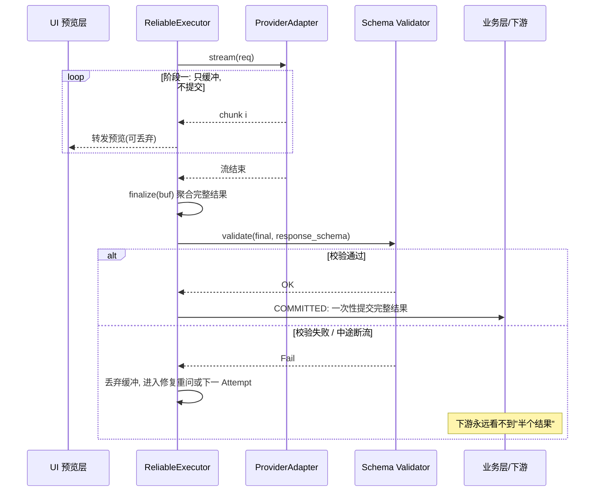
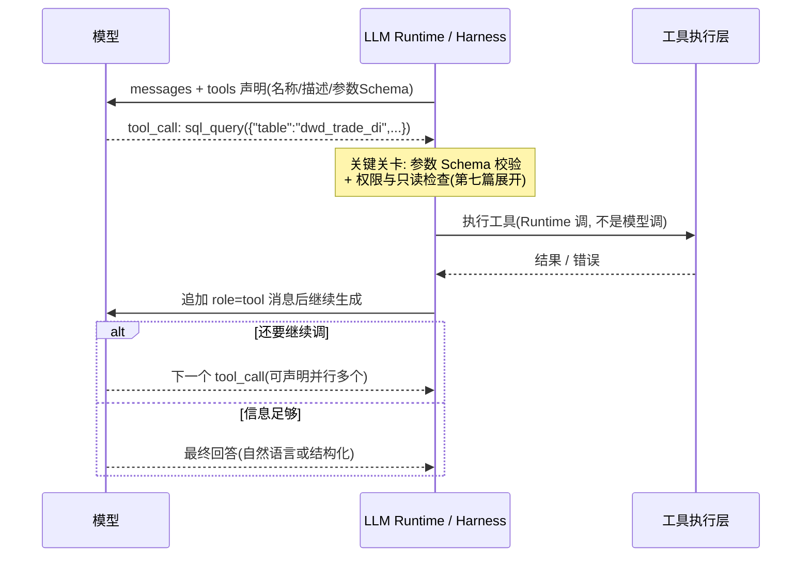

# 篇04-2：LLM 执行底座（下）——结构化输出、函数调用、模型治理与实战

> 导语：本页承接篇04-1，先讲完第三支柱「可靠执行」的下半部分——Output Contract 三道防线（Structured Output / Schema Validation / 修复重问）、流式输出的两阶段提交、函数调用（Function Calling）的真相；随后进入第四支柱「模型治理」：Trace 与调用链、事前/事中/事后三层成本闸门、模型版本与 Replay、租户隔离与审计。篇04 的本篇实战（给 DataAgent 写一个迷你 ReliableExecutor）、动手练习与自测清单也完整收在本页——它们同时覆盖上下两页的机制，做完才算真正学完篇04。最终目标不变：让上层 Agent Harness 彻底忘记"模型"的存在，只面对一个稳定、可治理、可演进的执行底座。

---

## 3. 高并发下可靠的模型执行（续）

### 3.3 Structured Output / Schema Validation / Output Contract

模型输出进入下游（执行 SQL、渲染报告、写审批单）之前必须过三道关：

1. **Structured Output**：请求时把 `response_schema` 传给支持的模型，让 Provider 在解码层约束格式——这是第一道、成本最低的防线。
2. **Schema Validation**：响应回来用同一 schema 本地校验，不信任 Provider 的承诺。
3. **Output Contract**：校验失败不是直接报错，而是进入**修复循环**——把校验错误作为反馈追加进上下文重问模型（通常 1-2 次内收敛），重问耗尽才判 Logical Call 失败。

契约的本质：**无效输出永远不许越过 Runtime 边界进入业务层**。业务代码拿到的 `ModelResponse.parsed` 是校验通过的结构化对象，不是一段"希望它是 JSON"的字符串。

**三道防线的成本-强度对比**

| 手段 | 强制力 | 成本 | 局限 |
| --- | --- | --- | --- |
| 裸 Prompt 约定（"请返回 JSON"） | 无 | 零 | 模型随时自由发挥：代码围栏、解释废话、缺字段样样来 |
| JSON Mode | 保证输出是合法 JSON | 低 | 只保语法不保语义：字段、类型、枚举仍可能错 |
| Structured Output（约束解码） | 按 Schema 逐 token 约束解码 | 低 | 保格式不保语义正确；`max_tokens` 截断仍会发生 |
| 后置解析 + 正则/修复库 | 事后补救 | 中 | 把格式问题拖成概率问题，补丁摞补丁越修越脆 |

**约束解码为什么近乎零成本又近乎必对**：模型生成是逐 token 采样，约束解码在每步采样前把 Schema 编译成文法/状态机，将"此刻不合法"的 token 直接从候选词表屏蔽——模型"想错都错不了"。格式正确性就这样从"概率事件"变成了"构造保证"，这是它配当第一道防线的根本原因 [^openai-so]。

但也要看清边界：约束解码保证的是**格式**，不是**语义**——Schema 要求 `confidence` 是 0~1 的数值，模型可以给一个格式完美但胡说八道的 0.87。语义正确性要靠 Verifier（第五篇）与 Eval（第九篇）兜底。

最后记住修复循环与"简单重试"的本质区别：**重试是同样的输入再来一次，修复是把校验错误作为新输入重问**。前者指望运气，后者给了模型它唯一真正需要的信息——"上一次错在哪"。

下面这个交互 Demo 把三档防线摆在一起对比：先选档位点「生成一次」，看 Attempt → 校验 → 修复重问的完整过程；再点「批量模拟 100 次」，对比三档的一次通过率、修复挽救率与平均 Attempts：

```demo structured-output
```

**Demo 导学单**

1. 用「① 裸 Prompt 约定」连点 5 次「生成一次」，统计你遇到了几种失败形态，并对照右侧 Schema 说出每种失败违反了哪条约束。
2. 观察一次"修复重问"成功的过程：重问时追加进上下文的到底是什么？它与 3.2 节的"简单重试"有何本质区别？
3. 换到「③ Structured Output」档再点几次：剩下的失败形态是什么？这如何印证"约束解码保格式不保语义"？
4. 跑「批量模拟 100 次」，读出三档的最终失败率与平均 Attempts，回答：为什么说"把格式问题消灭在解码层比事后修复便宜一个数量级"？
5. 思考：如果修复重问不设 2 次上限而是无限重问，会发生什么？这和 3.2 节的哪个概念直接冲突？

### 3.4 流式输出的最终提交机制

流式（Streaming）用于报告生成等长输出场景，但有一个经典陷阱：**中间 chunk 不是结果**。模型流到一半可能限流中断、可能吐出违规内容、可能最终被 Schema 校验否决。如果 UI 或下游边收边消费（边渲染边写库），中断时就产生了"半个结果"的脏状态。

解法是**两阶段提交**：chunk 只进缓冲（可转发 UI 预览），聚合校验通过后才允许业务层提交。时序上看：



对应代码骨架：

```python
# llm_runtime/executor.py —— ReliableExecutor 核心骨架（含流式两阶段提交）
import asyncio, time, random
from .contract import ModelRequest, ModelResponse

class ReliableExecutor:
    def __init__(self, router, schema_validator, trace_sink, max_attempts: int = 4):
        self.router, self.validate = router, schema_validator
        self.trace, self.max_attempts = trace_sink, max_attempts

    async def call(self, req: ModelRequest) -> ModelResponse:
        t0 = time.monotonic()
        call_span = self.trace.start_call(req)          # Logical Call span
        chain = self.router.resolve(req)                # Fallback 链: [同档A, 同档B, 降档C]
        last_err, attempt_no, degraded = None, 0, False
        for target in chain:
            while attempt_no < self.max_attempts:
                remaining = req.deadline_ms / 1000 - (time.monotonic() - t0)
                if remaining <= 0:
                    break                               # Deadline 天花板: 直接放弃
                attempt_no += 1
                span = self.trace.start_attempt(call_span, target, attempt_no)
                try:
                    if req.stream:
                        resp = await self._stream_two_phase(req, target, remaining, span)
                    else:
                        resp = await asyncio.wait_for(target.adapter.complete(req), remaining)
                    resp = self._validate_or_repair(resp, req)   # Output Contract
                    resp.attempts = attempt_no
                    self.trace.end_ok(span, resp)
                    return resp
                except RetryableError as e:             # 超时/限流/5xx
                    last_err = e; self.trace.end_retry(span, e)
                    await asyncio.sleep(min(2 ** attempt_no, 8) + random.random())
                except NonRetryableError as e:          # 4xx/能力不满足 → 直接换目标
                    last_err = e; self.trace.end_fail(span, e); break
            degraded = True                             # 走到链上下一档 = 显式降级
        raise LogicalCallFailed(last_err, attempts=attempt_no, degraded=degraded)

    async def _stream_two_phase(self, req, target, remaining, span) -> ModelResponse:
        buf: list[str] = []
        async for chunk in target.adapter.stream(req):  # 阶段1: chunk 只进缓冲
            buf.append(chunk)                            #   可转发给 UI 做"打字机"预览
        final = target.adapter.finalize(buf)             # 阶段2: 聚合后统一校验
        self.validate(final, req.response_schema)        #   校验通过才标记 COMMITTED
        return final
```

要点：UI 可以预览中间 chunk（体验），但**业务状态提交**（写库、触发下游步骤）只能发生在 `finalize + validate` 之后。预览可丢弃，提交必须完整。

### 3.5 函数调用：模型"使用工具"的真相

Agent 能查数据库、能发审批，靠的不是模型长了手——**函数调用（Function Calling）的本质仍是一次文本生成**：你在请求里用 JSON Schema 声明"有哪些工具、各要什么参数"，模型在生成时输出一段**约定格式的工具调用请求**（工具名 + 参数 JSON），剩下的执行、结果回灌，全是代码的活 [^openai-fc]。

完整循环：



三个必须建立的正确认知：

1. **模型从不"执行"任何工具**。它只生成"请执行 X，参数是 Y"这段文本；执行权永远在 Runtime/工具层——这正是权限、审计、沙箱能插进来的位置。反过来，把工具用法写进 Prompt 让模型"自己想办法"，等于放弃了所有关卡。
2. **工具描述是 Prompt 的一部分，而且是很贵的一部分**。工具名、描述、参数说明都占 token、都直接影响模型选工具的准确率。工具一多就要按 Task Profile 动态挂载，而不是 50 个工具全量塞给每一次调用。
3. **tool_call 输出同样要走 Output Contract**。参数 JSON 的 Schema 校验、枚举合法性、危险参数（`DROP`、跨租户 ID）检查，与 3.3 节是同一套机制——函数调用没有豁免权。

常见失败模式速查：

| 失败 | 表现 | 对策 |
| --- | --- | --- |
| 幻觉工具 | 调用未声明的工具名 | 白名单校验，拒绝并把错误反馈给模型 |
| 参数幻觉 | 编出不存在的字段/表名 | 参数 Schema 校验 + 语义层约束（第六篇） |
| 连环调用失控 | 模型陷入"调了再调"的循环 | `max_tool_calls` 预算 + 无进展检测（第五篇） |
| 并行调用冲突 | 一次发出多个有依赖的 tool_call | 声明依赖关系，Runtime 负责串行化 |

DataAgent 的落法：SQL 生成走 `response_schema`（3.3 节），取数与查文档走 `tools`（本节）——**结构化回答用输出契约，对外动作用工具契约**，两条路在 Runtime 里汇入同一套校验与审计。

---

## 4. 模型治理：从能调用到可运营

### 4.1 Trace 与调用链

每一次 Logical Call 和 Attempt 都是 Trace 树上的节点，携带：租户、run_id、step_id（来自 Agent Runtime）、逻辑/物理模型、版本、usage、时延、故障语义、降级标记。这样"这份周报为什么花了 4 美元"可以下钻到每一次 Attempt；"GMV 诊断错了"可以回放整条调用链定位是哪一步的输出出了问题。Trace 是评测（第三篇）、Replay（本节）、成本归集（下节）的共同地基。

### 4.2 预算控制与多租户成本归集

成本治理是三层闸门：

1. **事前**：`ModelRequest.max_cost_usd` 单次硬上限 + 租户月度预算池，Routing 阶段就排除超预算的模型选项；
2. **事中**：Attempt 级 usage 实时累加，超 Deadline 或超预算立即熔断该 Logical Call；
3. **事后**：按 租户 × Task Profile × 物理模型 三维归集，产出"哪个租户的诊断任务最烧钱"的运营视图，反哺路由策略调权。

### 4.3 模型版本与 Replay

"模型升级后线上结果悄悄变了"是模型治理的头号事故。对策：

- **版本化一切**：物理模型版本、路由策略版本、Prompt 模板版本，都进 Registry 且不可变；
- **Replay 机制**：`ModelResponse.raw_ref` 落盘原始请求/响应，升级前用历史请求对新版本批量回放，对比输出分布与 Eval 分数——这就是 Regression Gate 在模型层的实现；
- **灰度与回滚**：路由策略按租户百分比灰度发布，指标劣化一键回滚到上一策略版本。

### 4.4 租户隔离与审计

租户隔离在 Runtime 层的落点：凭据隔离（每租户独立 API Key / 私域端点）、数据隔离（Trace 与 raw_ref 按租户分区存储、跨租户不可读）、配额隔离（限流与预算按租户独立计）。审计回答四个问题——**谁**（租户/用户）、**用什么**（逻辑/物理模型+版本）、**问了什么**（请求摘要+raw_ref）、**花了多少**——且审计日志只增不改。对 DataAgent 这种涉及经营数据的产品，审计能力不是加分项，是准入门槛。

---

## 常见误区

1. **把 LLM Runtime 做成"高级 SDK Wrapper"**。只封装鉴权和重试、不理解 Task Profile 和 Output Contract，最后治理逻辑又漏回业务层。
2. **统一契约做成最小公分母**。丢掉 reasoning、structured_output 等能力差异，等于自费武功；契约要"统一入口 + 保留能力 + 显式降级"。
3. **只有 Timeout 没有 Deadline**。重试雪崩的第一成因。
4. **静默降档**。Fallback 到低档模型不标记、不统计，线上质量劣化查无实据。
5. **流式边收边提交**。中断产生半个结果污染下游；记住：预览可流式，提交必须两阶段。
6. **成本只做事后统计**。没有事前/事中闸门，账单出来时损失已经发生了。

## 本篇实战：给 DataAgent 写一个迷你 ReliableExecutor

目标：不依赖任何框架，用 Python 实现一个支持"Fallback 链 + 指数退避 + Schema 修复重问"的迷你执行器，并用故障注入证明它有效。

**Step 1：定义契约与故障语义（约 30 分钟）**

- 目标：写出 `ModelRequest` / `ModelResponse` 数据类和 `RetryableError` / `NonRetryableError` 异常体系。
- 操作：以 1.3 节契约为蓝本，只保留 tenant_id、logical_model、messages、response_schema、deadline_ms 五个字段；再写一个 `FakeAdapter`，用随机数模拟超时、429、400、成功四种返回。
- 验收标准：四种故障都能被正确分类成两种异常；`FakeAdapter` 的故障率可用参数调节。

**Step 2：实现带 Deadline 的退避重试（约 40 分钟）**

- 目标：在单模型维度实现"指数退避 + jitter + Deadline 封顶"。
- 操作：按 3.2 节退避状态机实现循环，每轮**先检查剩余预算再发 Attempt**。
- 验收标准：注入 50% 超时率时，100 次调用成功率显著高于不重试对照组；Deadline 设为 1s 时，没有任何调用总耗时超过 1.2s。

**Step 3：接上 Fallback 链与降级标记（约 30 分钟）**

- 目标：主模型耗尽后自动切同档备用模型，再耗尽则显式降档。
- 操作：构造 `[主, 同档备, 轻量]` 三个 FakeAdapter，把主模型设为 100% 故障。
- 验收标准：响应携带正确的 `provider` 与 `degraded` 标记；Trace 里能看到每个 Attempt 归属哪个模型。

**Step 4：加 Schema 校验与修复重问（约 40 分钟）**

- 目标：实现 Output Contract 的第三道防线。
- 操作：给 FakeAdapter 加"首次必返回缺字段 JSON"模式；执行器校验失败后把错误详情追加进 messages 重问，最多 2 次。
- 验收标准：缺字段场景最终 COMMITTED 且 `attempts` 计数正确；修复耗尽场景抛出聚合异常，坏 JSON 不出现在返回值里。

### AI Coding 实操模式

上面每一步都适合与 AI 结对完成。推荐姿势：

**① 可复制的 AI 提示词模板**

```text
你是资深后端工程师。我们在实现一个 LLM 可靠执行器（ReliableExecutor），请只完成当前这一步，不要提前实现后面的功能。

背景契约：
[粘贴 1.3 节的 ModelRequest / ModelResponse 代码]

当前步骤：[粘贴 Step N 的目标与操作]

硬性要求：
1. 超时/429/5xx 归 RetryableError，4xx 归 NonRetryableError；
2. 每次 Attempt 前必须先检查 Deadline 剩余预算，不足即放弃；
3. 退避公式 delay = min(2^n, 8s) + random jitter；
4. 降级必须显式：响应携带 degraded=true 与实际命中的 provider；
5. 附带一个 pytest 故障注入测试，模拟 [本步故障场景]。

请先给实现，再给测试，最后解释你在哪些地方做了取舍。
```

**② AI 初版人工评审清单**

- [ ] 重试循环里是否**先查 Deadline 再发 Attempt**？（AI 最常漏的一行，漏了就是重试雪崩）
- [ ] 不可重试错误（4xx）是否真的不重试？还是被一个万能 `except Exception` 吞进去重试了？
- [ ] 降档是否显式标记了 `degraded`？还是悄悄返回了轻量模型的结果？
- [ ] 修复重问时追加进 messages 的是**校验错误详情**还是一句笼统的"请重试"？
- [ ] 测试断言的是"最终成功"，还是"最终成功**且** attempts / degraded 正确"？（前者会让降级逻辑形同虚设）

**③ 验收标准**

四个 Step 各自通过验收标准；AI 生成代码经人工评审清单逐条核对；`pytest` 全绿；能口头回答"故障期这个执行器的流量放大系数是多少"。

---

## 动手练习

1. 为 DataAgent 定义 5 个 Task Profile 及其能力需求矩阵，并给出每个 Profile 的逻辑模型名和至少 2 个候选物理模型（含 Fallback 顺序与降档策略）。
2. 实现 `ProviderAdapter` 的两个具体适配器（任选真实 Provider），重点处理故障语义映射：把两家 SDK 不同的超时/限流错误统一成 `RetryableError` / `NonRetryableError`。
3. 给 `ReliableExecutor` 写一个故障注入测试：模拟"主模型 50% 超时、Schema 校验首次必失败、Fallback 模型正常"，断言最终 COMMITTED 且 attempts 与降级标记正确。
4. 实现流式两阶段提交的预览版：chunk 实时打印（预览），但只在 finalize 校验通过后写入结果文件；注入一次中途断流，验证结果文件不被污染。
5. 设计租户成本报表：按 租户 × Task Profile × 物理模型 输出月度成本，并标注降级调用占比，给出一条路由策略调权建议。

## 自测清单

- [ ] 我能说清 SDK Wrapper / Model Gateway / LLM Runtime / Agent Runtime 四者职责边界
- [ ] 我能解释统一契约如何"统一入口又保留能力差异"
- [ ] 我能画出 Registry / Routing / Execution / Observability 四层并说明数据流向
- [ ] 我理解逻辑模型与物理模型分层如何让"换模型 = 发策略版本"
- [ ] 我能区分 Logical Call 与 Attempt，并画出完整状态机
- [ ] 我能说清 Timeout / Deadline / Retry / Fallback 的正交分工，以及 Deadline 为何是雪崩防线
- [ ] 我理解 Output Contract 的三道防线与修复循环
- [ ] 我能解释流式输出为什么必须两阶段提交
- [ ] 我能列出成本治理的事前/事中/事后三层闸门与模型升级的 Replay 防线
- [ ] 我知道租户隔离与审计在 Runtime 层的具体落点

---

## 参考与脚注

[^openai-so]: OpenAI《Structured Outputs》——约束解码（constrained decoding）保证 Schema 合规的机制说明。https://platform.openai.com/docs/guides/structured-outputs
[^openai-fc]: OpenAI《Function Calling Guide》——工具声明、tool_call 回传与并行调用的协议细节。https://platform.openai.com/docs/guides/function-calling

---

➡️ 下一页：篇05-1 · Agent Harness 与 Runtime（上）——混合架构、ReAct 循环与 Run 执行模型
