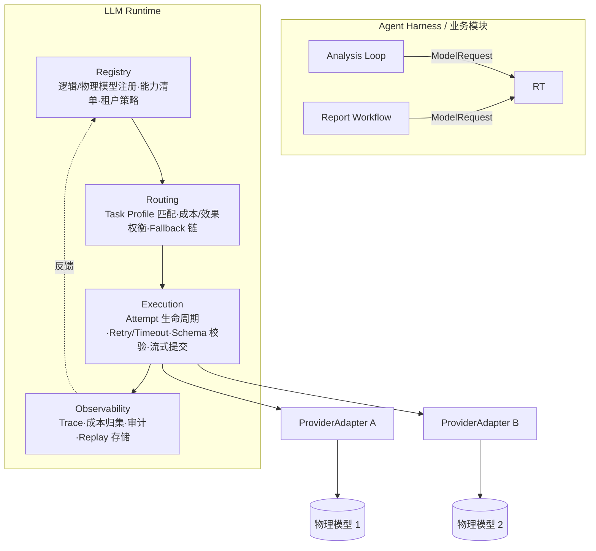
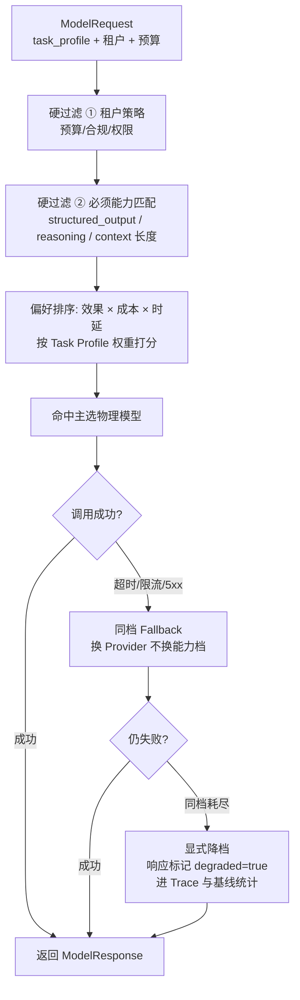
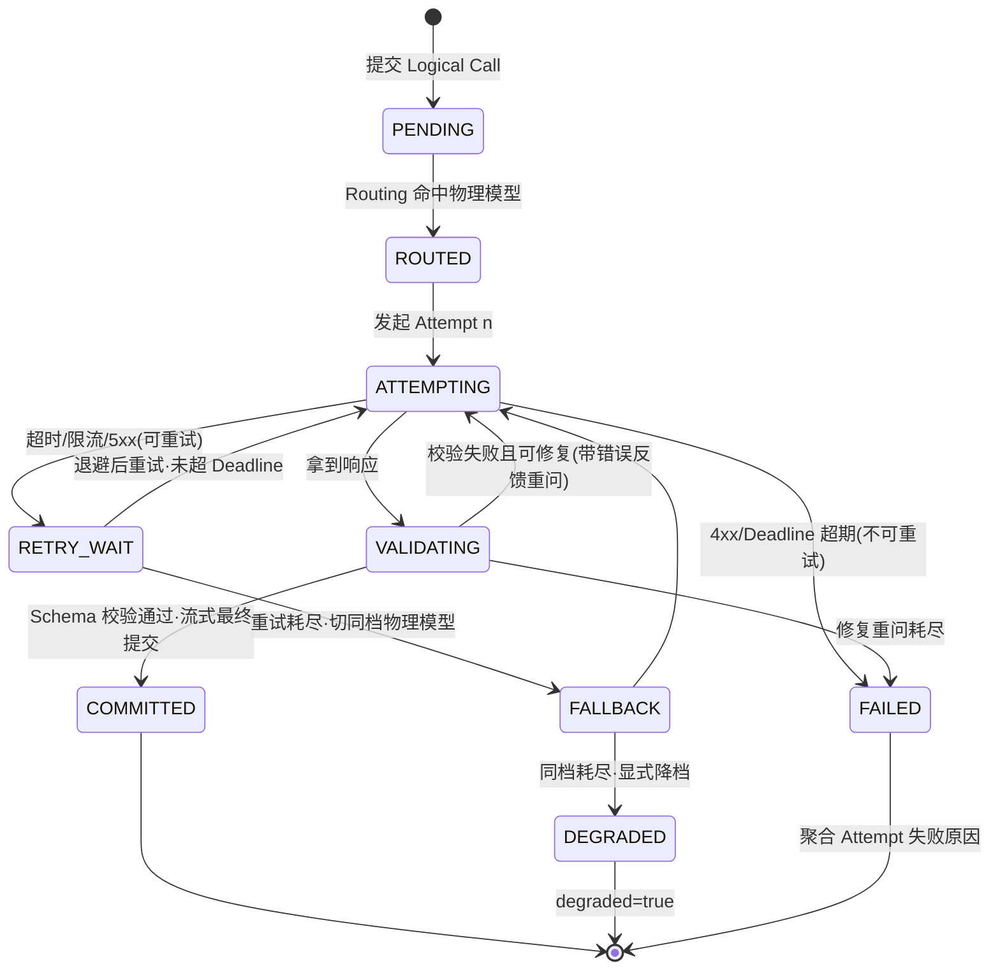
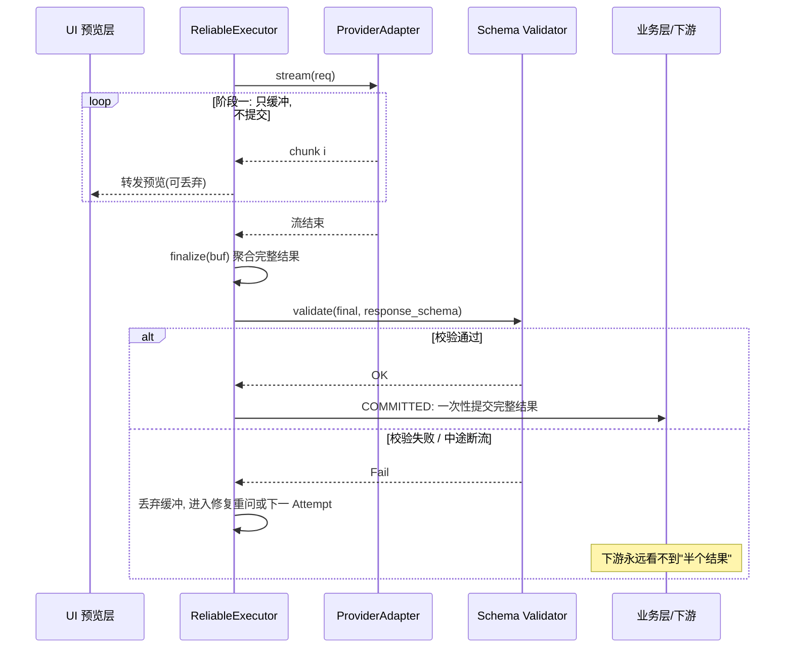

# 第四篇：LLM 执行底座篇——构建面向 Agent Harness 的可靠 LLM Runtime

> 导语：DataAgent 立项之后，第一刀拆出去的不是 Agent 核心，而是**模型调用**。原因很简单：一次"GMV 异常诊断"可能产生几十次模型调用，涉及多个模型、多个租户、严格的成本预算和不容有失的输出格式——如果每个业务模块各自抱着 SDK 直接调，这个系统在第一周就会失控。本篇讲透企业级 LLM Runtime 的四个支柱：统一执行边界、多模型路由、可靠执行机制、模型治理。目标是让上层 Agent Harness 彻底忘记"模型"的存在，只面对一个稳定、可治理、可演进的执行底座。

---

## 1. 从散落的模型调用到 LLM Runtime

### 1.1 为什么不能在业务代码里直接调 SDK

业务代码直接调 SDK，在 Demo 里是最快路径，在企业级系统里是五种灾难的源头：

1. **多模型失控**：规划用大模型、SQL 生成用代码模型、报告用长文本模型，N 个业务模块 × M 个模型 SDK = N×M 处鉴权、重试、限流逻辑，改一处漏十处。
2. **成本无人归集**：token 账单散落在各处，月底算不清"哪个租户、哪个任务类型烧了多少"。
3. **故障语义不统一**：SDK A 的超时是 exception，SDK B 是返回 None，SDK C 是错误码字段——上层被迫写防御性代码，可靠性逻辑腐烂。
4. **输出无校验**：模型返回的 JSON 少个字段，直到下游 SQL 执行报错才暴露，排查要跨三个模块。
5. **无法回放与审计**：监管问"上季度这笔预算调整是谁的模型、哪个版本生成的"，答不上来。

结论：**模型调用是一种基础设施，不是一行 API 调用**。它值得一个独立的、有分层架构的系统。

### 1.2 职责边界：SDK Wrapper / Model Gateway / LLM Runtime / Agent Runtime

这四个概念经常被混为一谈，必须分开：

| 层次 | 管什么 | 不管什么 | 类比 |
| --- | --- | --- | --- |
| **SDK Wrapper** | 单个 Provider 的鉴权、签名、异常封装 | 多模型、路由、业务语义 | 数据库驱动 |
| **Model Gateway** | 多 Provider 统一入口、协议转换、限流、密钥托管 | 不理解"任务"，无业务路由与输出契约 | API 网关 / 代理 |
| **LLM Runtime**（本篇） | 统一调用契约 + 能力路由 + 可靠执行 + 输出契约 + 治理观测，**理解 Task Profile** | 不理解 Agent 的步骤、状态、工具循环 | 应用服务器的持久层 + 事务管理器 |
| **Agent Runtime**（后续篇） | Run/Task/Step 生命周期、调度、状态持久化、工具编排 | 不直接碰模型 SDK，只调 LLM Runtime | 应用服务器本身 |

一句话区分：Gateway 解决"请求怎么到模型"，Runtime 解决"**这个任务应该用哪个模型、怎么保证这次调用可靠、结果怎么算数**"。DataAgent 需要后者。

### 1.3 统一契约与 Provider Adapter

统一契约的核心是一个与 Provider 无关的请求/响应模型，外加每个 Provider 一个 Adapter 做双向翻译。关键设计点：**契约保留能力差异，不做最小公分母**——`reasoning_effort`、`response_schema`、`tools` 都进契约，Adapter 对不支持的能力做显式降级或拒绝，而不是静默丢弃（"稳定而不失真的边界"）。

```python
# llm_runtime/contract.py —— 统一调用契约
from dataclasses import dataclass, field
from typing import Any, AsyncIterator, Optional

@dataclass
class ModelRequest:
    tenant_id: str
    task_profile: str                 # "sql_gen" | "diagnosis" | "report" ...
    logical_model: str                # 逻辑模型名，如 "analyzer-pro"，见第 2 节
    messages: list[dict]
    response_schema: Optional[dict] = None   # Output Contract，见第 3 节
    tools: list[dict] = field(default_factory=list)
    reasoning_effort: Optional[str] = None   # 保留模型能力差异
    stream: bool = False
    deadline_ms: int = 60_000
    max_cost_usd: Optional[float] = None     # 单次调用预算硬约束
    trace_context: dict = field(default_factory=dict)  # run_id/step_id 等

@dataclass
class ModelResponse:
    content: str
    parsed: Optional[Any]             # Schema 校验通过后的结构化结果
    provider: str                     # 实际命中的物理模型，审计用
    model_version: str
    usage: dict                       # prompt/completion tokens + cost_usd
    attempts: int                     # 本次 Logical Call 共几次 Attempt
    finish_reason: str                # stop | length | tool_call | schema_repair
    raw_ref: str                      # 原始请求/响应落盘引用，Replay 用

class ProviderAdapter:
    """每个 Provider 实现一个。职责：翻译契约 + 映射故障语义。"""
    name: str
    supported: frozenset[str]         # {"structured_output","reasoning","tools","stream"}

    def check(self, req: ModelRequest) -> None:
        if req.response_schema and "structured_output" not in self.supported:
            raise CapabilityError(f"{self.name} 不支持 Structured Output")
        if req.reasoning_effort and "reasoning" not in self.supported:
            raise CapabilityError(f"{self.name} 不支持 Reasoning 调节")

    async def complete(self, req: ModelRequest) -> ModelResponse: ...
    async def stream(self, req: ModelRequest) -> AsyncIterator[str]: ...
```

### 1.4 Runtime 分层架构



四层职责：**Registry** 是事实源（有哪些模型、各会什么、谁能用）；**Routing** 做决策（这次调用去哪里）；**Execution** 保证一次调用的可靠性；**Observability** 让一切可追踪、可归集、可回放。上层只提交 `ModelRequest`，拿到 `ModelResponse`——这是 Harness 与 Runtime 之间的唯一接缝。

---

## 2. 多模型路由：用能力契约和策略路由选择正确模型

### 2.1 逻辑模型与物理模型分层

代码里写死 `model="gpt-4o-2024-08-06"` 是耦合的三连击：模型下线要改代码、换供应商要改代码、AB 实验要改代码。解法是两层命名：

- **逻辑模型**：面向任务语义的稳定名字，如 `analyzer-pro`（复杂诊断）、`sql-gen`（SQL 生成）、`reporter`（长文报告）。业务代码只引用逻辑模型。
- **物理模型**：具体的 provider + model + version + 参数集，注册在 Registry 中，可热更新。

逻辑模型 → 物理模型的映射本身就是一条**可版本化的路由策略**，换模型 = 发新版本策略，不动业务代码。

### 2.2 Capability 与 Task Profile：路由的依据

路由不是"if 任务类型 then 模型名"的硬编码表，而是**能力匹配**：每个物理模型声明能力清单（context 长度、structured_output、reasoning、tools、单价、P95 时延、可用区），每个 Task Profile 声明需求（必须能力、期望能力、成本上限、时延上限），路由 = 需求对供给的约束求解 + 偏好排序。

| Task Profile（DataAgent 示例） | 必须能力 | 成本敏感度 | 典型路由目标 |
| --- | --- | --- | --- |
| 诊断规划 diagnosis | reasoning、长上下文 | 低（效果优先） | 旗舰推理模型 |
| SQL 生成 sql_gen | structured_output、tools | 中 | 代码强模型 |
| 证据判断 evidence_check | structured_output | 高（高频小调用） | 轻量模型 |
| 报告生成 report | 长文写作、stream | 中 | 通用大模型 |
| 租后问答 chat | stream | 高 | 轻量模型 |

### 2.3 Fallback 与降级：不是"换个模型"那么简单

效果、成本、稳定性的三角权衡体现在 Fallback 链设计上。原则：

- **同档 Fallback 优先**：主模型超时 → 同能力档的另一家 Provider，效果不变，只牺牲一点时延。
- **降档降级要显式**：同档全挂 → 降到轻量模型时，响应必须携带 `degraded=true` 标记，让上层决定"将错就错"还是"转人工/稍后重试"。静默降档 = 静默质量事故。
- **降级≠失败**：降级是系统设计的合法终态，要进 Trace 和基线统计，而不是藏在日志里。

把 2.2 与 2.3 合起来看，一次路由决策的完整流程如下——先过硬过滤（租户策略、必须能力），再做偏好排序，失败后沿 Fallback 链逐档下探，且降档必须显式标记：



### 2.4 多租户模型策略

不同租户对模型有不同约束：预算（月额度/单次上限）、合规（数据不出境 → 限定区域可用区）、权限（免费租户不许用旗舰模型）、偏好（指定私有部署模型）。这些都建模为 Registry 中的**租户策略层**，在 Routing 之前作为硬过滤条件执行——路由先在租户允许的集合内求解，再谈效果成本权衡。

---

## 3. 高并发下可靠的模型执行

### 3.1 Logical Call 与 Attempt：为什么"调用成功"不等于"任务成功"

上层说"帮我生成一条 SQL"是**一次 Logical Call**；Runtime 为它可能发起**多次 Attempt**（超时重试、限流换 Provider、Schema 校验失败修复重问）。上层只关心 Logical Call 的最终结果，Attempt 是 Runtime 的内部实现细节。这个区分的价值：

- 重试不再污染上层逻辑（上层没有 try/except 重试代码）；
- 幂等与预算可以精确计算（一个 Logical Call 只计一次任务成本，但审计能看到每次 Attempt 的花费）；
- 失败归因清晰（终态失败 = 所有 Attempt 失败原因的聚合）。



### 3.2 Retry / Fallback / Timeout / Deadline 的分工

四个机制常被混用，职责其实严格正交：

| 机制 | 作用域 | 回答的问题 | 关键设计点 |
| --- | --- | --- | --- |
| Timeout | 单次 Attempt | "这一次最多等多久" | 要覆盖连接+首 token+生成全程，不止 HTTP 超时 |
| Deadline | 整个 Logical Call | "上层最晚什么时候要结果" | 所有 Attempt/Fallback 共享一个总预算，防"重试雪崩" |
| Retry | 同一物理模型 | "这个故障是瞬时的吗" | 指数退避+抖动；只对幂等错误（超时/限流/5xx）重试 |
| Fallback | 跨物理模型 | "这个模型整体不可用吗" | 同档优先，降档显式标记 |

常见错误：只有 Attempt 级超时、没有 Call 级 Deadline——高并发下每个请求都"努力重试到最后一刻"，故障期请求堆积，把小故障放大成雪崩。**Deadline 是可靠性的天花板，Timeout 只是地板。**

下面这个交互 Demo 把四个机制的协同（与失控）做成可播放的时间线：调好失败率、重试次数、单次超时和总 Deadline 后点"执行一次调用"，对比"设了 Deadline"与"只重试不设 Deadline"两条时间线的总耗时差异——多跑几次高失败率的局，直观感受雪崩的成因：

```demo retry-timeout
```

### 3.3 Structured Output / Schema Validation / Output Contract

模型输出进入下游（执行 SQL、渲染报告、写审批单）之前必须过三道关：

1. **Structured Output**：请求时把 `response_schema` 传给支持的模型，让 Provider 在解码层约束格式——这是第一道、成本最低的防线。
2. **Schema Validation**：响应回来用同一 schema 本地校验，不信任 Provider 的承诺。
3. **Output Contract**：校验失败不是直接报错，而是进入**修复循环**——把校验错误作为反馈追加进上下文重问模型（通常 1-2 次内收敛），重问耗尽才判 Logical Call 失败。

契约的本质：**无效输出永远不许越过 Runtime 边界进入业务层**。业务代码拿到的 `ModelResponse.parsed` 是校验通过的结构化对象，不是一段"希望它是 JSON"的字符串。

### 3.4 流式输出的最终提交机制

流式（Streaming）用于报告生成等长输出场景，但有一个经典陷阱：**中间 chunk 不是结果**。模型流到一半可能限流中断、可能吐出违规内容、可能最终被 Schema 校验否决。如果 UI 或下游边收边消费（边渲染边写库），中断时就产生了"半个结果"的脏状态。

解法是**两阶段提交**：chunk 只进缓冲（可转发 UI 预览），聚合校验通过后才允许业务层提交。时序上看：



对应代码骨架：

```python
# llm_runtime/executor.py —— ReliableExecutor 核心骨架（含流式两阶段提交）
import asyncio, time, random
from .contract import ModelRequest, ModelResponse

class ReliableExecutor:
    def __init__(self, router, schema_validator, trace_sink, max_attempts: int = 4):
        self.router, self.validate = router, schema_validator
        self.trace, self.max_attempts = trace_sink, max_attempts

    async def call(self, req: ModelRequest) -> ModelResponse:
        t0 = time.monotonic()
        call_span = self.trace.start_call(req)          # Logical Call span
        chain = self.router.resolve(req)                # Fallback 链: [同档A, 同档B, 降档C]
        last_err, attempt_no, degraded = None, 0, False
        for target in chain:
            while attempt_no < self.max_attempts:
                remaining = req.deadline_ms / 1000 - (time.monotonic() - t0)
                if remaining <= 0:
                    break                               # Deadline 天花板: 直接放弃
                attempt_no += 1
                span = self.trace.start_attempt(call_span, target, attempt_no)
                try:
                    if req.stream:
                        resp = await self._stream_two_phase(req, target, remaining, span)
                    else:
                        resp = await asyncio.wait_for(target.adapter.complete(req), remaining)
                    resp = self._validate_or_repair(resp, req)   # Output Contract
                    resp.attempts = attempt_no
                    self.trace.end_ok(span, resp)
                    return resp
                except RetryableError as e:             # 超时/限流/5xx
                    last_err = e; self.trace.end_retry(span, e)
                    await asyncio.sleep(min(2 ** attempt_no, 8) + random.random())
                except NonRetryableError as e:          # 4xx/能力不满足 → 直接换目标
                    last_err = e; self.trace.end_fail(span, e); break
            degraded = True                             # 走到链上下一档 = 显式降级
        raise LogicalCallFailed(last_err, attempts=attempt_no, degraded=degraded)

    async def _stream_two_phase(self, req, target, remaining, span) -> ModelResponse:
        buf: list[str] = []
        async for chunk in target.adapter.stream(req):  # 阶段1: chunk 只进缓冲
            buf.append(chunk)                            #   可转发给 UI 做"打字机"预览
        final = target.adapter.finalize(buf)             # 阶段2: 聚合后统一校验
        self.validate(final, req.response_schema)        #   校验通过才标记 COMMITTED
        return final
```

要点：UI 可以预览中间 chunk（体验），但**业务状态提交**（写库、触发下游步骤）只能发生在 `finalize + validate` 之后。预览可丢弃，提交必须完整。

---

## 4. 模型治理：从能调用到可运营

### 4.1 Trace 与调用链

每一次 Logical Call 和 Attempt 都是 Trace 树上的节点，携带：租户、run_id、step_id（来自 Agent Runtime）、逻辑/物理模型、版本、usage、时延、故障语义、降级标记。这样"这份周报为什么花了 4 美元"可以下钻到每一次 Attempt；"GMV 诊断错了"可以回放整条调用链定位是哪一步的输出出了问题。Trace 是评测（第三篇）、Replay（本节）、成本归集（下节）的共同地基。

### 4.2 预算控制与多租户成本归集

成本治理是三层闸门：

1. **事前**：`ModelRequest.max_cost_usd` 单次硬上限 + 租户月度预算池，Routing 阶段就排除超预算的模型选项；
2. **事中**：Attempt 级 usage 实时累加，超 Deadline 或超预算立即熔断该 Logical Call；
3. **事后**：按 租户 × Task Profile × 物理模型 三维归集，产出"哪个租户的诊断任务最烧钱"的运营视图，反哺路由策略调权。

### 4.3 模型版本与 Replay

"模型升级后线上结果悄悄变了"是模型治理的头号事故。对策：

- **版本化一切**：物理模型版本、路由策略版本、Prompt 模板版本，都进 Registry 且不可变；
- **Replay 机制**：`ModelResponse.raw_ref` 落盘原始请求/响应，升级前用历史请求对新版本批量回放，对比输出分布与 Eval 分数——这就是 Regression Gate 在模型层的实现；
- **灰度与回滚**：路由策略按租户百分比灰度发布，指标劣化一键回滚到上一策略版本。

### 4.4 租户隔离与审计

租户隔离在 Runtime 层的落点：凭据隔离（每租户独立 API Key / 私域端点）、数据隔离（Trace 与 raw_ref 按租户分区存储、跨租户不可读）、配额隔离（限流与预算按租户独立计）。审计回答四个问题——**谁**（租户/用户）、**用什么**（逻辑/物理模型+版本）、**问了什么**（请求摘要+raw_ref）、**花了多少**——且审计日志只增不改。对 DataAgent 这种涉及经营数据的产品，审计能力不是加分项，是准入门槛。

---

## 常见误区

1. **把 LLM Runtime 做成"高级 SDK Wrapper"**。只封装鉴权和重试、不理解 Task Profile 和 Output Contract，最后治理逻辑又漏回业务层。
2. **统一契约做成最小公分母**。丢掉 reasoning、structured_output 等能力差异，等于自费武功；契约要"统一入口 + 保留能力 + 显式降级"。
3. **只有 Timeout 没有 Deadline**。重试雪崩的第一成因。
4. **静默降档**。Fallback 到低档模型不标记、不统计，线上质量劣化查无实据。
5. **流式边收边提交**。中断产生半个结果污染下游；记住：预览可流式，提交必须两阶段。
6. **成本只做事后统计**。没有事前/事中闸门，账单出来时损失已经发生了。

## 动手练习

1. 为 DataAgent 定义 5 个 Task Profile 及其能力需求矩阵，并给出每个 Profile 的逻辑模型名和至少 2 个候选物理模型（含 Fallback 顺序与降档策略）。
2. 实现 `ProviderAdapter` 的两个具体适配器（任选真实 Provider），重点处理故障语义映射：把两家 SDK 不同的超时/限流错误统一成 `RetryableError` / `NonRetryableError`。
3. 给 `ReliableExecutor` 写一个故障注入测试：模拟"主模型 50% 超时、Schema 校验首次必失败、Fallback 模型正常"，断言最终 COMMITTED 且 attempts 与降级标记正确。
4. 实现流式两阶段提交的预览版：chunk 实时打印（预览），但只在 finalize 校验通过后写入结果文件；注入一次中途断流，验证结果文件不被污染。
5. 设计租户成本报表：按 租户 × Task Profile × 物理模型 输出月度成本，并标注降级调用占比，给出一条路由策略调权建议。

## 自测清单

- [ ] 我能说清 SDK Wrapper / Model Gateway / LLM Runtime / Agent Runtime 四者职责边界
- [ ] 我能解释统一契约如何"统一入口又保留能力差异"
- [ ] 我能画出 Registry / Routing / Execution / Observability 四层并说明数据流向
- [ ] 我理解逻辑模型与物理模型分层如何让"换模型 = 发策略版本"
- [ ] 我能区分 Logical Call 与 Attempt，并画出完整状态机
- [ ] 我能说清 Timeout / Deadline / Retry / Fallback 的正交分工，以及 Deadline 为何是雪崩防线
- [ ] 我理解 Output Contract 的三道防线与修复循环
- [ ] 我能解释流式输出为什么必须两阶段提交
- [ ] 我能列出成本治理的事前/事中/事后三层闸门与模型升级的 Replay 防线
- [ ] 我知道租户隔离与审计在 Runtime 层的具体落点
