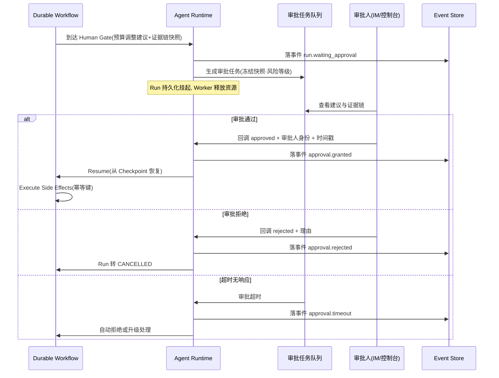
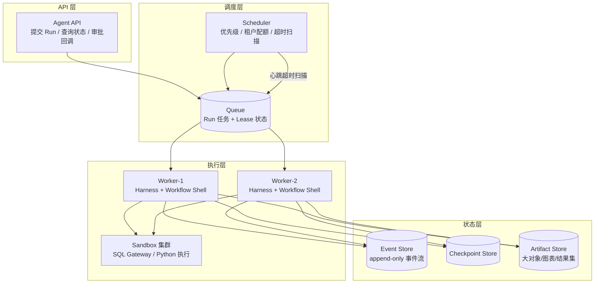
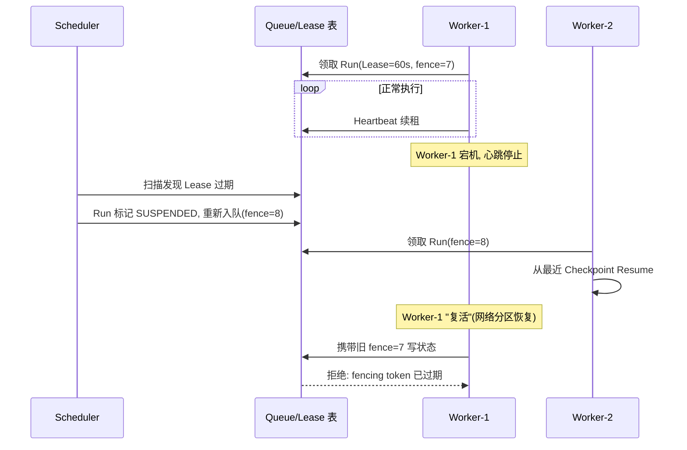
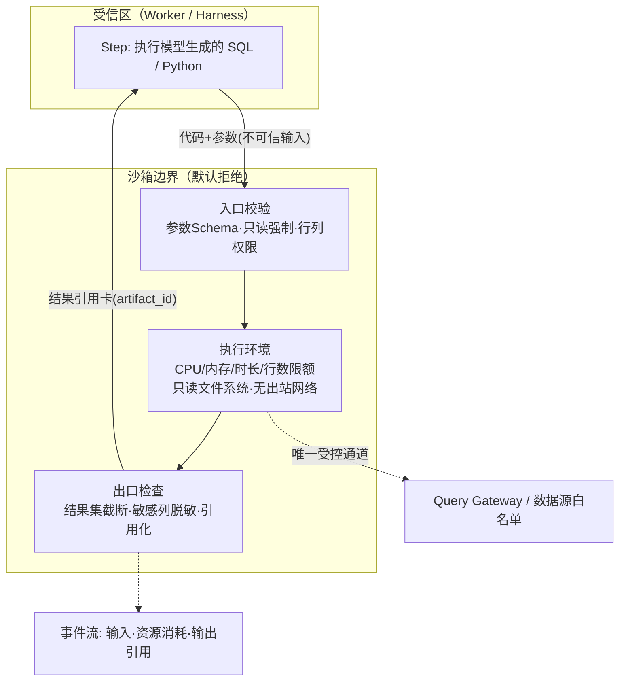

# 篇05-2：Agent Harness 与 Runtime（下）——Durable Workflow、分布式 Runtime 与故障工程

> 导语：本页承接篇05-1，进入 Agent Runtime（运行时）——承载 Harness 执行的分布式系统，回答"任务崩了能不能续、多人同时用会不会互相踩踏"。内容包括：用 Durable Workflow 把自主分析收口（Workflow Shell、Checkpoint / Resume、Human Approval 人工关卡、副作用幂等）、从单进程到分布式 Runtime（Scheduler / Queue / Worker 分层、Lease 与 fencing token 防脑裂、沙箱执行、多租户资源治理与并发隔离）、以及故障工程（Failure Taxonomy、Retry / Resume / Replay / Fork 四个"重来"、Runtime Invariant 与故障注入清单）。篇05 的本篇实战——把"退款率异常诊断"从 while 循环升级为可恢复的 Run——连同动手练习与自测清单完整收在本页；读完你应当能向审计和运维证明"这个 Agent 是可控的"。

---

## 4. 用 Durable Workflow 收口自主分析

### 4.1 Workflow Shell：开放分析必须被包进壳里

Autonomous Loop 擅长开放探索，但它不适合直接面对真实业务副作用：模型可能在 Loop 里"顺手"调两次预算调整接口。解法是 **Workflow Shell**：外层是确定性的 Durable Workflow，负责取数准备、调用内层 Analysis Loop、报告生成、Human Approval、副作用执行；内层 Loop 只被允许输出"建议"，不允许触碰副作用工具。

```text
[Prepare Data] → [Autonomous Analysis Loop] → [Verify Report]
      → [Human Approval Gate] → [Execute Side Effects] → [Track Effect]
```

内层 Loop 崩了，Workflow 从 Checkpoint 恢复它；审批被拒，Workflow 走取消分支；副作用执行失败，Workflow 按幂等键重试。自主权被关进笼子里，笼子本身是完全确定性的。

### 4.2 Checkpoint 与 Resume

长任务（月度经营分析可能跑 40 分钟）必须假设自己会被打断：机器重启、发版、抢占。规则：

1. **Checkpoint 打在 Step 边界**，而不是任意时刻——Step 内部是原子的（要么完成落事件，要么整体重试）；
2. **Resume = 加载最近 Checkpoint → 重建内存状态 → 从事件游标之后继续消费**，绝不简单"重跑整个 Run"；
3. 恢复后第一步是**重新校验前置条件**（租户权限是否仍有效、数据源凭据是否过期），而不是盲目继续。

### 4.3 Human Approval：让人成为系统的一等节点

预算调整审批流的正确姿势：

- Workflow 到达 Human Gate 后，**持久化挂起**（不是线程 sleep！），生成审批任务（含建议内容、证据链链接、风险等级），Run 状态转 `WAITING_APPROVAL`；
- 审批人通过 IM/控制台操作，回调携带审批结论 + 审批人身份 + 时间戳，作为事件写回；
- 设置**审批超时策略**：超时自动拒绝或升级，避免 Run 永远挂起；
- 审批内容要**冻结快照**：审批人看到的数据版本必须与后续执行所用版本一致，防止"批的是 A，执行的是 B"。

把这几个要点串成一条完整的审批时序——重点看三件事：挂起是持久化的（Worker 释放、状态落库）、审批结论是作为**事件**写回事件流的、超时必须有兜底策略：



### 4.4 副作用幂等

"调整广告预算"这类写操作必须满足：同一个 Run 的同一个 Step，无论 Attempt 几次、无论是否崩溃重放，**业务效果只发生一次**。手段：

- **幂等键（Idempotency Key）**：`{run_id}:{step_id}` 作为调用下游系统的幂等键，下游据此去重；
- **先记录意图，后执行**：副作用 Step 先在事件流落 `side_effect_intended`，执行成功落 `side_effect_committed`。恢复时若看到意图但无确认，先向下游**查询该幂等键是否已生效**（查账），再决定补做还是跳过；
- **绝不依赖"调用方记得自己调没调过"**——崩溃恰恰会抹掉这个记忆。

---

## 5. 从单进程到分布式 Runtime

### 5.1 分层架构



为什么必须拆开？因为 Agent Run 是**长任务 + 突发负载**：同步 HTTP 连接撑不住 40 分钟的 Run，单进程撑不住 200 个租户同时跑月报。API 层无状态，执行层可水平扩缩，状态全部外置到事件/检查点存储——任何 Worker 挂了，任务不丢。

### 5.2 Scheduler / Queue / Worker

- **Queue**：Run 以消息形式入队，携带优先级与租户标签。队列是削峰与解耦的核心。
- **Scheduler**：决定"下一个跑谁"——按优先级、租户配额、公平性策略出队；同时定期扫描**租约过期**的 Run（Worker 死了但任务没完成），重新入队接管。
- **Worker**：无状态执行器。领取任务即获得 Lease，执行中只读写外部状态存储，本地不留任何"丢了就没了"的东西。

### 5.3 Lease 与 Heartbeat：分布式下"只执行一次"的现实解

分布式系统没有真正的 exactly-once 执行，只有"lease + 幂等"的组合逼近 [^ddia8]：

1. Worker 领取 Run 时获得 Lease（如 60 秒），`lease_owner = worker_id`；
2. 执行中周期性 Heartbeat 续租；Worker 宕机 → 心跳停止 → 租约过期；
3. Scheduler 扫描到过期租约 → 将 Run 标记 `SUSPENDED` 并重新入队；
4. 新 Worker 接管时从最近 Checkpoint 恢复；
5. 旧 Worker 若"复活"（网络分区恢复），写状态时携带的 Lease 已失效，写入被拒绝（**fencing token**，租约版本号单调递增），防止脑裂双写 [^ddia9]。

时序上完整走一遍"Worker 宕机 → 接管 → 旧主复活被拒"：



注意 Lease 防的是"两个 Worker 同时推进同一 Run"，副作用层面的 exactly-once 仍靠上一节的幂等键——两道防线缺一不可。

### 5.4 多租户资源治理

企业 SaaS 环境下，A 租户的批量月报不能饿死 B 租户的实时查询：

- **配额（Quota）**：每租户并发 Run 上限、每分钟模型调用上限、每日成本上限；
- **隔离（Isolation）**：高优租户/实时任务走独立队列或独立 Worker 池；
- **公平调度（Fair Scheduling）**：同优先级下按租户轮转，防单租户占满；
- **背压（Backpressure）**：队列超水位时，API 层对新 Run 返回"排队中"而不是假装接收；
- **每租户 Autonomy Budget**：把第 1 节的预算体系按租户实例化，超预算的 Run 走降级而非占用公共池空转。

### 5.5 沙箱执行：把"模型写的代码"关进笼子

架构图里的"Sandbox 集群"值得一节专门说。前提只有一个：**模型生成的 SQL 与代码是不可信输入**——倒不一定是恶意，而是它可能算错、可能扫全表、可能死循环，偶尔还可能被注入内容诱导着干坏事（第六篇）。

隔离级别是一张阶梯，越高越安全、也越重：

| 级别 | 手段 | 隔离强度 | 适用 |
| --- | --- | --- | --- |
| 语言级 | 禁用危险函数、AST 白名单 | 弱（同进程，逃逸面大） | 纯计算、无 I/O 的小片段 |
| 进程级 | 独立进程 + rlimit 资源限制 + 超时强杀 | 中 | 单租户内部的受信任务 |
| 容器级 | 独立容器 + 只读文件系统 + 网络策略 | 强 | 多租户环境的默认档 |
| 微 VM 级 | Firecracker 类轻量虚拟机 | 最强 | 执行租户上传或外部来源的代码 |

不管选哪一级，沙箱三件套缺一不可：

1. **资源限制**：CPU、内存、运行时长、结果集行数全部设上限——一条忘加 WHERE 的 SQL 不该拖垮整个数仓；
2. **出口管控**：默认无网络出站、无文件写权限；需要的数据源走代理白名单（SQL 只能经 Query Gateway，且 Gateway 强制只读与行列权限）；
3. **边界即审计**：每次沙箱调用的输入、资源消耗、输出引用都落事件流——沙箱日志是 Run Timeline 的一部分。



一句话：**边界上一切默认拒绝——能进来的是声明过的输入，能出去的是检查过的结果。**

### 5.6 并发与隔离：200 个租户同时跑，凭什么互不踩踏

Worker 水平扩容解决了"跑得下"，没解决"跑得公平"。并发隔离要回答三个问题：

- **执行模型怎么选**：LLM 调用是 I/O 密集，协程（asyncio）足够；沙箱里的 Python 是 CPU 密集，必须进程/容器隔离。混用准则：**协程管等待，进程管计算，容器管信任**。
- **邻居吵闹（noisy neighbor）怎么办**：5.4 节的配额 + 独立队列是答案的一半；另一半是**沙箱资源也按租户计量**——A 租户一条跑飞的全表扫描，烧的必须是他自己的额度。
- **故障怎么不传染**：单 Worker 宕机由 Lease 机制接管（5.3 节）；单租户故障（如某租户的数据源全挂）不能拖垮公共队列——按租户隔离的重试与熔断，让"他的雪崩只是他的"。

这与卷04《分布式架构与平台工程》的多租户资源隔离一脉相承：Agent Runtime 只是把"请求"换成了"长任务"，隔离的功课一题都少不了 [^phoenix]。

---

## 6. 故障工程：用故障证明系统可靠

### 6.1 Failure Taxonomy

没有统一故障分类，就没有统一的处理策略。企业级 Agent 的故障谱系：

| 类别 | 例子 | 特征 | 策略 |
|---|---|---|---|
| 瞬时故障 | 模型 429、网络抖动 | 重试可恢复 | Attempt 级指数退避重试 |
| 环境故障 | 数据源不可用、凭据过期 | 重试无用 | 快速失败 → Replan 或降级 |
| 逻辑故障 | Verifier 反复打回 | 模型方向错误 | Replan（计入预算），耗尽则人工 |
| 基础设施故障 | Worker 宕机、分区 | 执行中断 | Lease 过期 + Checkpoint 接管 |
| 人为介入 | 审批拒绝、强制取消 | 外部决策 | 走状态机对应分支 |
| 语义故障 | 指标口径错、权限数据错 | 结果"看似正常但错误" | 最危险——靠 Eval 与不变量发现 |

最后一类最阴险：系统不报错，只是安静地给出错答案。它引出下一概念。

### 6.2 Retry / Resume / Replay / Fork：四个"重来"不是一回事

| 机制 | 粒度 | 从哪开始 | 改变输入吗 | 用途 |
|---|---|---|---|---|
| Retry | Attempt | 重试当前 Step | 否 | 瞬时故障 |
| Resume | Run | 最近 Checkpoint 之后 | 否（但重校验前置条件） | 崩溃/接管恢复 |
| Replay | Run/区间 | 用历史事件流重新执行 | 否，确定性重放 | 排障、策略对比、审计 |
| Fork | Run | 从某个 Checkpoint 分叉新 Run | 是（换模型/换策略） | A/B、what-if 分析 |

混用这四个词是团队沟通灾难的源头。"帮我重跑一下这个任务"必须翻译成上面四个之一才有意义。

### 6.3 Runtime Invariant：永远不能破坏的原则

Invariant 是恢复逻辑再花哨也不许违反的底线，典型清单：

1. **事件流只增不改**：历史 Event 永不删除、永不修改（修正用新事件表达）；
2. **状态机迁移合法**：任何情况下 Run 状态迁移走白名单；
3. **副作用幂等**：同一幂等键业务效果最多一次；
4. **租户隔离**：任何恢复路径不得把 A 租户的 Checkpoint 装给 B 租户；
5. **Checkpoint 单调**：恢复只能向前推进，不得回退已完成且已提交副作用的 Step；
6. **预算守恒**：恢复不重置已消耗预算（否则崩溃成了省钱手段）。

建议把 Invariant 写成**可执行断言**，在测试和故障注入中持续校验。

### 6.4 故障注入测试：证明"能跨故障完成任务"

可靠性不是靠祈祷，是靠主动打碎系统。DataAgent 的故障注入清单（每个都应自动化）：

- 分析 Loop 跑到一半，kill Worker → 验证 Lease 过期、他机接管、结论与未中断基线一致；
- 审批挂起期间重启全部服务 → 验证审批任务仍在、Run 可恢复；
- 副作用调用后、确认前断网 → 验证恢复时先查账不重复执行；
- 模型持续返回垃圾 → 验证 Verifier 打回 + Replan 预算耗尽后走人工出口；
- SQL Gateway 挂掉 → 验证快速失败、Timeline 记录、降级报告明确标注"缺证据"；
- 注入过期指标定义 → 验证语义层版本校验拦截（与第六篇联动）。

验收标准不是"系统不崩"，而是三句话：**能恢复（Resume 成功）、能接管（他机续跑）、能解释（Timeline 说清发生了什么）**。

---

## 常见误区

1. **把 Harness 当 Agent 的智商问题**：循环跑偏就换更强模型。真相：90% 的"跑偏"是缺 Verifier、缺 Stop Condition、缺预算——是管理问题不是智商问题。
2. **状态塞在 messages 数组里**：聊天记录当数据库用，崩溃即失忆。状态必须是独立于对话历史的结构化对象。
3. **用线程 sleep 等审批**：进程一重启审批就丢了。Human Gate 必须持久化挂起 + 事件回调。
4. **"重试"包治百病**：对语义故障重试只是稳定地生产错误；对非幂等副作用重试是在重复扣款。先分类，再谈策略。
5. **先做分布式再补幂等**：上了多 Worker 才发现重复执行。顺序应反过来：单进程时就建好幂等键与事件流，分布式只是顺手的事。
6. **故障注入当表演**：演示时 kill 一下就算验证。没有基线对比（中断 Run 与完整 Run 结论一致性校验）的故障注入只是行为艺术。

## 本篇实战：把"退款率异常诊断"从 while 循环升级为可恢复的 Run

目标：亲手走完"裸循环 → 套 Harness → 状态外置"的三级跳，体会每一层各解决什么死法。

**Step 1：裸循环 baseline（约 30 分钟）**

- 目标：用 ReAct 三段式写一个最简分析循环，跑通"退款率假设验证"（可用 mock 数据与 mock 模型）。
- 操作：`while` 循环 + 每轮打印 Thought / Action / Observation。
- 验收标准：循环在 mock 下能跑完；并且你亲眼确认——没有任何机制阻止它无限跑下去。

**Step 2：套上 Harness 三件套（约 45 分钟）**

- 目标：给循环加 Task Contract、Stop Condition、Autonomy Budget。
- 操作：定义 done_criteria（每个假设都有证据结论）；实现"连续 2 步零信息增益即停"；步数预算 10。
- 验收标准：mock 一个"永远查不到证据"的场景，循环在预算耗尽时走降级出口而非死循环；每次停止都输出带原因的终态事件。

**Step 3：状态外置 + Checkpoint（约 45 分钟）**

- 目标：把假设树从内存变量变成可序列化的 AnalysisState，实现崩溃恢复。
- 操作：每个 Step 边界写 Checkpoint（SQLite 或 JSON 文件均可），实现 `resume()`。
- 验收标准：第 3 步后 kill 进程，重启从 Checkpoint 续跑完成，且最终结论与不中断基线一致。

**Step 4：加一个 Human Gate（约 30 分钟）**

- 目标：把"建议上调退款审核阈值"做成持久化审批节点。
- 操作：到达 Gate 时 Run 转 WAITING_APPROVAL 并落盘；外部写入审批结论文件后回调恢复。
- 验收标准：审批等待期间重启程序，Run 仍能恢复并正确读取审批结论；审批拒绝走 CANCELLED 分支。

### AI Coding 实操模式

**① 可复制的 AI 提示词模板**

```text
你是资深分布式系统工程师。我们在给一个 ReAct 分析循环加企业级 Harness，请只完成当前步骤，不要提前实现后面的步骤。

背景（我现有的裸循环）：
[粘贴 Step 1 的循环代码]

当前步骤：[粘贴 Step N 的目标与操作]

硬性要求：
1. 状态迁移必须走白名单，非法迁移直接抛异常；模型代码不允许直接改 Run 状态；
2. 一切值得记录的事实都落成 append-only Event（step_started / tool_result / budget_exhausted…）；
3. Checkpoint 只打在 Step 边界，Step 内部视为原子；
4. Human Gate 必须持久化挂起，禁止用 sleep 或内存变量等待；
5. 附带测试：[本步对应验收场景]。

先给实现，再给测试，最后说明这个设计相比裸循环堵住了哪种死法。
```

**② AI 初版人工评审清单**

- [ ] 循环停止的条件是"模型说做完了"还是"done_criteria 被满足"？（前者直接打回）
- [ ] Replan / 反思循环有没有计入预算？（AI 很爱写一个不计成本的无限重试）
- [ ] Checkpoint 恢复后是否重新校验了前置条件（权限、凭据），还是盲目继续？
- [ ] Human Gate 是持久化挂起还是内存等待？进程重启场景下会发生什么？
- [ ] 事件流是否真的 append-only？代码里有没有 update / delete 历史事件的写法？

**③ 验收标准**

四个 Step 各自验收通过；能用一份 Run Timeline（哪怕是文本日志）讲清"每一步为什么发生、Run 为什么停"；kill 进程故障注入后，恢复跑出的结论与基线一致。

---

## 动手练习

1. **Task Contract 设计**：为"退款率异常诊断"写一份完整 Task Contract，要求 done_criteria 全部可机器判定，并指出你的 Verifier 如何逐条检查。
2. **状态机落地**：基于本文 3.3 的骨架代码，补全事件存储（可用 SQLite），实现 `suspend()` / `resume()`，并写一个测试：在第 3 个 Step 后崩溃，从 Checkpoint 恢复并跑完。
3. **审批流幂等**：模拟"预算调整"副作用，分别演示 (a) 无幂等键时崩溃重放导致重复调整，(b) 加幂等键 + 查账逻辑后的正确行为。
4. **Lease 脑裂实验**：起两个 Worker 进程，人为让 Worker-1 假死（暂停心跳而非退出），观察 Scheduler 接管；随后恢复 Worker-1，验证 fencing token 拒绝其过期写入。
5. **故障注入报告**：任选三个故障注入场景跑通，产出一份 Run Timeline 对比报告，回答：恢复点在哪、丢没丢证据、预算是否守恒。

## 自测清单

- [ ] 我能说出 Task Contract 五个字段，并解释为什么 done_criteria 必须可机器验证
- [ ] 我能为一个新任务在五种执行范式中做出选择并说明理由
- [ ] 我能画出控制权矩阵，指出哪些决策绝不能交给模型
- [ ] 我能解释 Harness 与 Agent Loop 的区别，并列出五类 Stop Condition
- [ ] 我能区分 Run / Step / Attempt，并说明为什么重试发生在 Attempt 层
- [ ] 我能默画 Run 状态机，包含 WAITING_APPROVAL 与 SUSPENDED 两个关键态
- [ ] 我能写清副作用幂等的三件套：幂等键、意图事件、恢复查账
- [ ] 我能解释 Lease + Heartbeat + fencing token 如何协作防止脑裂
- [ ] 我能区分 Retry / Resume / Replay / Fork 并各举一个使用场景
- [ ] 我能列出至少五条 Runtime Invariant，并说明违反任意一条的后果

---

## 参考与脚注

[^ddia8]: Martin Kleppmann《数据密集型应用系统设计》（DDIA）第 8 章「分布式系统的麻烦」——部分失败与不可靠时钟的工程含义，Lease 与心跳设计的理论背景。
[^ddia9]: Martin Kleppmann《数据密集型应用系统设计》（DDIA）第 9 章「一致性与共识」——fencing token 防止脑裂双写的经典论述（"领导者与锁"一节）。
[^phoenix]: 周志明《凤凰架构：构建可靠的大型分布式系统》——服务治理、熔断与多租户资源隔离的体系化讨论。https://icyfenix.cn

---

➡️ 下一页：篇06-1 · Agent 上下文治理（上）——信息契约、语义层与装配预算
