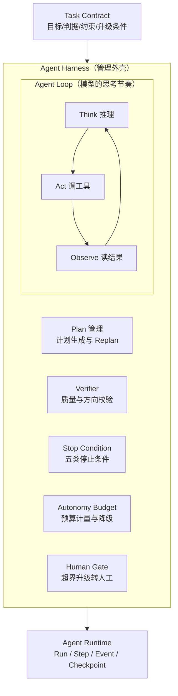
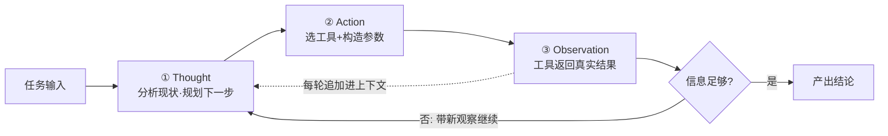
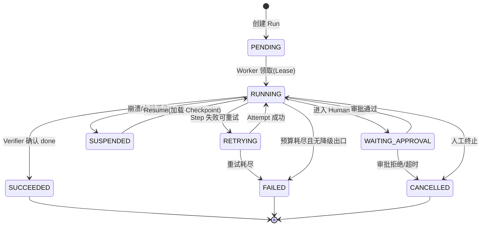
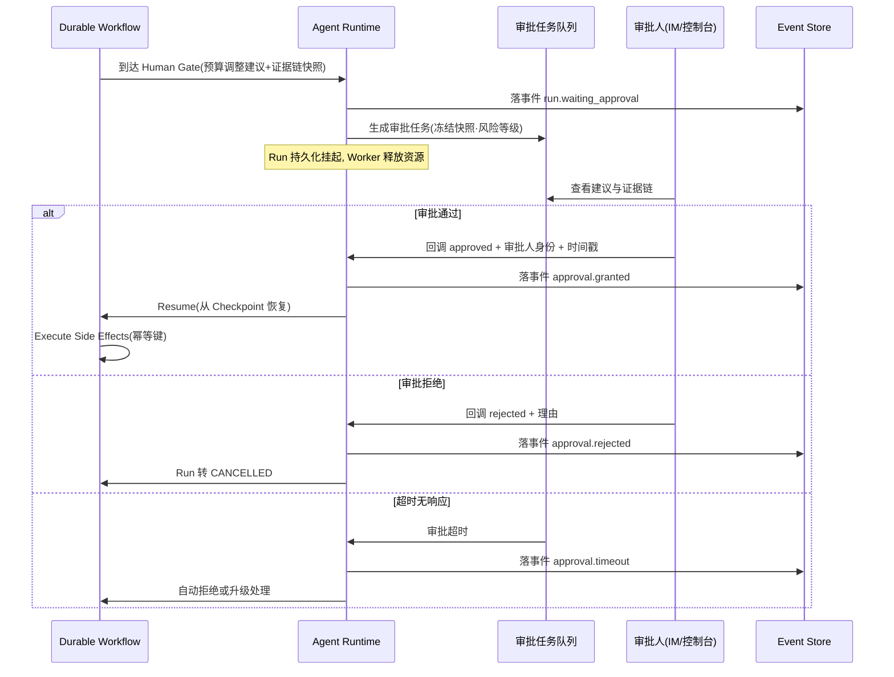
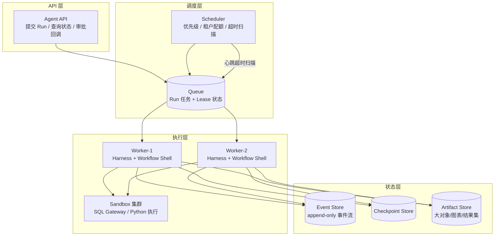
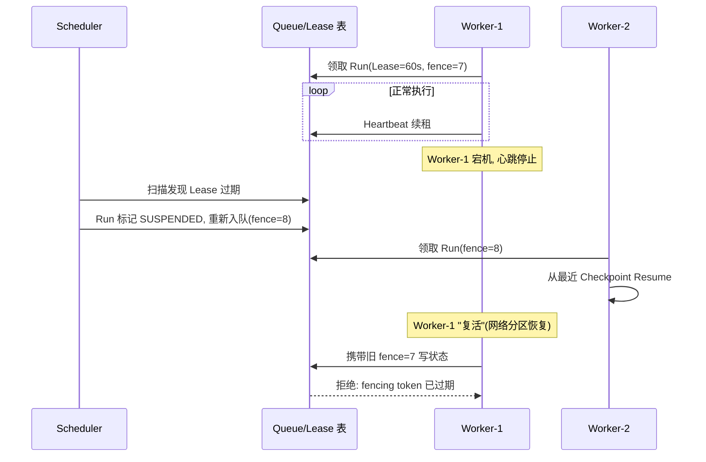
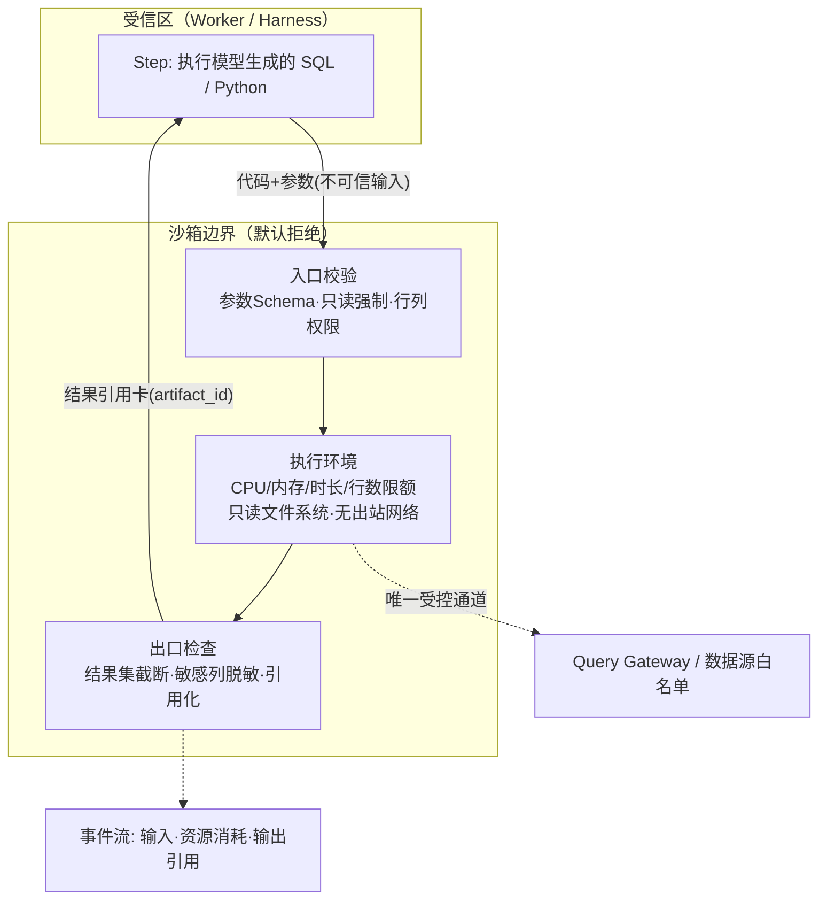

# 第五篇：Agent Harness 与 Agent Runtime 工程架构——设计"自主 + Workflow"的企业级混合系统

## 导语

在上一篇（LLM Runtime）里，我们解决的是"模型调用"的工程化：重试、超时、限流、成本、观测。但一个能在企业生产环境跑数小时、跨多个数据源、还要调预算和建工单的 DataAgent，光有稳定的模型调用远远不够。真正决定它生死的是另外两层：

- **Agent Harness（智能体挽具）**：包裹在模型外面的那层控制结构——计划、验证、停止条件、预算、人工关卡。它决定"模型什么时候能自主、自主到什么程度、什么时候必须停"。
- **Agent Runtime（运行时）**：承载 Harness 执行的分布式系统——Run/Step 的统一执行模型、Checkpoint 与恢复、调度队列、故障接管、多租户资源治理。它决定"任务崩了能不能续、多人同时用会不会互相踩踏"。

很多团队的 Agent 项目死在同一个地方：Demo 阶段一个 `while` 循环加几行 `messages.append()` 跑得很欢，一进生产就被无限循环、状态丢失、重复扣款、审批缺失打死。本篇的目标就是把 DataAgent 中那条"GMV 下滑诊断 → 证据链 → 行动建议 → 预算审批"的核心链路，从单进程同步 Demo 演进为支持 Autonomous Analysis Loop、Durable Workflow、统一 Run 模型、异步长任务、Checkpoint/Resume、Human Approval、副作用幂等和多租户治理的企业级执行系统 [^geektime]。

阅读本篇后，你应当能回答三个问题：我的任务该用哪种执行范式？我的 Agent 每一步状态存在哪里、崩了怎么续？我如何向审计和运维证明"这个 Agent 是可控的"？

---

## 1. 混合架构选型：先定义"什么算完成"，再决定"谁来控制"

### 1.1 Task Contract：把业务需求变成可执行任务

Agent 工程里最常见的失败不是模型不够聪明，而是**没人定义过"什么算完成"**。用户说"帮我看看上周 GMV 为什么跌了"，模型可以无限地查下去：再看一个维度、再拆一个渠道、再拉一个月数据……没有终点的任务必然没有可控的成本。

Task Contract（任务契约）就是任务的"验收标准 + 边界条件"，它至少包含：

| 字段 | 含义 | DataAgent 示例（GMV 下滑诊断） |
|---|---|---|
| `objective` | 可判定的目标 | 产出 GMV 环比下滑的归因报告，覆盖流量/转化/客单价/退款四个因子 |
| `done_criteria` | 完成判据（可机器验证） | 每个一级假设要么被证据支持、要么被证据排除；所有 Claim 挂有证据引用 |
| `constraints` | 硬约束 | 只读查询；不得访问其他租户数据；总成本 ≤ 2 元；时长 ≤ 20 分钟 |
| `deliverable` | 交付物形态 | 结构化归因 JSON + 一段自然语言摘要 |
| `escalation` | 何时升级给人 | 需要调整广告预算等写操作时，必须 Human Approval |

Task Contract 由代码（而非模型）持有，Verifier 每一步都可以拿它来判定"做完了没有、做偏了没有"。它是后面所有机制——Stop Condition、Autonomy Budget、Human Gate——的共同依据。

### 1.2 五种执行范式与选型

不是所有任务都该套同一种编排。我们把常见范式排成一张对比表：

| 范式 | 控制权在谁 | 适用场景 | 优点 | 风险 |
|---|---|---|---|---|
| 单 Loop（ReAct 式） | 模型 | 开放式探索、工具链短 | 灵活、实现简单 | 无限循环、跑偏难察觉、不可恢复 |
| 固定 Workflow | 代码 | 流程确定、合规要求高（如月度报表） | 可审计、可测试、幂等好做 | 应对不了意外分支 |
| 动态 Graph | 模型选路、代码约束 | 路径半确定、分支多（如归因分析） | 兼顾灵活与约束 | 拓扑复杂、验证成本高 |
| 多 Agent Graph | 多个模型实例协作 | 角色天然可分（研究员/写手/审校） | 职责隔离、上下文隔离 | 协调开销大、错误会级联 |
| **混合架构** | 代码定骨架、模型填血肉 | 企业级主流 | 自主与可控兼得 | 架构复杂度最高 |

**选型建议（经验法则）：**

1. 能用固定 Workflow 写清楚的，不要用 Loop。确定性是审计和排障的朋友。
2. 只有"路径本身依赖中间结果"的部分才交给模型动态决策——例如归因分析中"下一个要验证的假设"。
3. 多 Agent 不是架构目标，是拆分上下文和权限的手段。如果单 Agent 的上下文还没撑爆、权限还没必须隔离，就别急着拆。
4. 企业级答案几乎总是混合架构：**外层 Durable Workflow 定骨架（取数 → 自主分析 → 报告 → 审批 → 执行），内层 Autonomous Loop 负责开放分析段**。

### 1.3 控制权矩阵：哪些给模型，哪些必须给代码和人

混合架构的本质是一张控制权划分表：

| 决策 | 交给模型 | 交给代码 | 交给人 |
|---|---|---|---|
| 下一步分析什么假设 | ✅ | | |
| SQL 怎么写 | ✅（生成） | ✅（校验、只读强制、行列权限） | |
| 指标口径是什么 | | ✅（语义层，禁止模型猜） | |
| 分析是否充分、可否停止 | 建议 | ✅（Verifier 判定） | |
| 预算/循环/成本上限 | | ✅（Autonomy Budget） | |
| 调整广告预算、创建工单 | | | ✅（Human Gate） |

一句话原则：**凡是"错了可以重来"的交给模型，凡是"错了要赔钱/违法/丢人"的交给代码和人。**

### 1.4 Graph Engineering：让执行拓扑可见、可评审

把执行过程显式建模为图，是混合架构落地的关键工程动作：

- **节点（Node）**：最小执行单元，分三类——模型节点（LLM 调用）、代码节点（SQL 执行、校验）、人工节点（审批）。每个节点声明输入/输出 schema。
- **边（Edge）**：分确定边（A 完必走 B）和条件边（Verifier 判定后选路）。条件边必须列出全部分支，禁止"模型随便跳"。
- **状态（State）**：沿图流转的显式状态对象（Analysis State），而不是聊天记录。
- **Verifier 节点**：只读节点，输入 State，输出"通过/打回 + 理由"。
- **Human Gate 节点**：挂起 Run、产出审批任务、等待外部信号恢复。
- **恢复路径（Recovery Path）**：每个节点声明"失败后重试还是回退到哪个节点"。没有声明的节点默认不可恢复——这在设计评审时就会暴露问题。

图的价值不在执行，在于**评审**：安全团队可以看着图问"这条边上有没有权限检查"，运维可以问"这个节点超时了整个 Run 去哪"。一段 while 循环回答不了这些问题。

### 1.5 Autonomy Budget：给自主性装上计量表

自主性不是开关，是预算。Autonomy Budget 是对一次 Run 的资源消耗上限的统称：

```text
AutonomyBudget {
  max_steps: 40,            # 最大步数
  max_model_calls: 60,      # 模型调用次数
  max_tokens: 800_000,      # token 总量
  max_cost_cny: 2.0,        # 成本上限
  max_wall_time_sec: 1200,  # 墙钟时间
  max_tool_calls_per_kind: { "sql_query": 30, "web_search": 5 }
}
```

预算由 Runtime 在每个 Step 前检查，耗尽即触发降级策略（如"停止探索，用现有证据出保守结论"）而不是硬崩。预算是多租户公平性和成本控制的地基，也是第五篇第 5 节资源治理的输入。

---

## 2. 从 while 循环到 Autonomous Harness

### 2.1 Harness ≠ Agent Loop

初学者把 Agent 看成一个循环：`while not done: think → act → observe`。这在 Demo 里没错，但生产环境里这个循环外面必须还有一层 Harness，它额外负责：

- **计划管理**：维护 Plan，必要时 Replan；
- **验证**：每步或每阶段用 Verifier 检查产出质量与方向；
- **停止**：依据 Task Contract 判定 done，而不是等模型自己说"我做完了"；
- **预算**：执行 Autonomy Budget；
- **状态持久化**：把 Analysis State 写成可恢复的 Checkpoint；
- **升级**：识别超出自主边界的情况，挂起并转人工。

一句话：**Loop 是模型的思考节奏，Harness 是组织对模型的管理制度。** Demo 能跑是因为你在旁边盯着当 Harness；生产不能跑是因为你不在了。

"Harness" 直译是**挽具**——套在马身上、让马力为人所用的那套皮带与缰绳。这个比喻精确得可怕：马提供动力和方向感，挽具提供约束、转向和刹车；没有挽具的马不是自由，是失控。三层关系可以再说透一层：

| 层 | 类比 | 回答的核心问题 |
| --- | --- | --- |
| 模型（Loop 的大脑） | 马 | "下一步做什么" |
| **Agent Harness** | 挽具 | "允许做什么、何时停、做偏了怎么纠正" |
| Agent Runtime | 马场与道路系统 | "很多匹马同时跑，如何不撞车、不丢马" |

Harness 各组件并非彼此独立，它们以 Task Contract 为共同依据协同——计划对 Contract 负责，Verifier 拿 Contract 判定，预算从 Contract 的 constraints 换算，Human Gate 由 Contract 的 escalation 触发：



读图要点：Loop 是被包围在最内层的——模型的一切"自主"都发生在 Harness 画好的圈里；Harness 自己不持久化任何东西，状态全部交给 Runtime（第 3 节）。这也是为什么"换更强的模型"治不了跑偏：马再强壮，挽具缺失照样翻车。

### 2.2 ReAct 与规划循环：模型是怎么"边想边干"的

ReAct（Reasoning + Acting）是 Agent Loop 最经典的范式：不让模型直接给答案，而是强制它**交错地**产生"思考（Thought）→ 行动（Action）→ 观察（Observation）"的三段式轨迹 [^react]。

为什么"交错"比"直接回答"强？三个原因：

- **思考显式化**：模型把中间推理写出来，既提升多步推理的准确率，也让"它当时在想什么"可审计、可回放；
- **行动有据**：每一步 Action 都是对真实工具的调用，Observation 把真实世界的反馈接回推理链——幻觉没有藏身的缝隙；
- **错误可恢复**：某一步观察推翻了前面的假设，下一步 Thought 可以显式纠偏，而不是一路错到底。



工程上要保持清醒：这条循环在它的原始形态里是**裸的**——没有停止条件、没有预算、没有验证 [^react]。把它搬进生产，就是 2.1 节那句"在循环外面套上 Harness"：每一轮 T→A→O 是一个 Step，Verifier 在步间判定信息增益，Budget 在步前扣减，Stop Condition 在步后检查。

规划模式的选型对比（从简到繁）：

| 模式 | 结构 | 何时用 | 代价 |
| --- | --- | --- | --- |
| ReAct | 边想边做，无全局计划 | 探索路径短、工具少 | 缺乏全局观，易局部打转 |
| Plan-and-Execute | 先出完整计划再逐步执行 | 步骤间有依赖、路径可预见 | 环境一变计划即废，需 Replan |
| Reflexion | 失败后生成"反思"存入上下文重试 | 有可自动判定的成败信号 | 轮次与 token 消耗翻倍 |
| 动态 Graph（1.4 节） | 代码定骨架、模型选分支 | 企业级主流 | 设计与验证成本最高 |

DataAgent 的归因分析段用的是混合体："Plan-and-Execute 起头 + ReAct 执行 + Verifier 收尾"——先建假设树（全局计划），验证每个假设时走 ReAct 小循环，Verifier 在假设粒度判定生死。

光看三段式不过瘾？下面这个交互 Demo 把同一个 GMV 归因任务跑两遍：默认"有 Harness"模式，每步后 Verifier 判定信息增益，done_criteria 一满足立即停；勾选「无 Harness」对照，裸 while 循环会礼貌地原地打转——"再看一个维度""再拉一个月数据"——直到预算烧穿。注意对照假设树面板：有 Harness 时假设被逐一证实/排除，无 Harness 时它们永远停在 pending：

```demo react-loop
```

**Demo 导学单**

1. 有 Harness 模式逐步执行，记录每步的信息增益标记。回答：第 3 步"客单价持平"为什么也算增益？（提示：排除假设同样是进展）
2. 找出循环停止的决定是谁做的——模型说"我做完了"，还是 Verifier 确认 done_criteria？对应 3.2 节状态机旁的哪一句工程纪律？
3. 切到无 Harness 对照，连续执行到第 3 步：停止条件面板上"无进展检测"亮起，循环为什么没停？这说明停止条件的存在与执行之间差着什么？
4. 无 Harness 模式跑满 10 步，计算浪费了多少步预算，并指出哪一步属于"重复劳动"（提示：第 4 步重复查了 UV）。
5. 对比两种模式下假设树的终态，解释 2.5 节为什么要求 Analysis State 是结构化对象而不是聊天记录。

### 2.3 Plan / Replan / Verifier

- **Plan**：开工前模型基于 Task Contract 生成显式计划（假设清单、取数步骤、验证方式），存进 State。计划的价值是让"跑偏"可检测——没有计划，就没有"偏离计划"这个概念。
- **Verifier**：独立于生成模型的检查者（可以是规则、另一个模型调用或两者组合）。在 GMV 诊断中它检查：每个结论是否有证据引用？SQL 结果行数是否为 0（空结果不能当证据）？是否遗漏了 done_criteria 要求的因子？
- **Replan**：Verifier 打回或环境变化（某数据源不可用）时，Harness 触发重计划，并记录"旧计划 → 触发原因 → 新计划"。**Replan 次数也计入预算**——无限 Replan 就是无限循环的文雅说法。

### 2.4 Stop Condition：什么时候必须停

一个健壮的 Harness 至少有五类停止条件，任一命中即停：

1. **成功停止**：Verifier 确认 done_criteria 全部满足；
2. **预算耗尽**：任一 Budget 维度触顶，走降级出口；
3. **无进展检测**：连续 N 步没有新证据/新信息增益（防原地打转）；
4. **错误升级**：同类错误重试 K 次仍失败，判定环境性故障而非偶发；
5. **人工停止**：Human Gate 拒绝、超时或运维强制终止。

每一类停止都产生一个带原因的终态事件——这是 Run Timeline 能解释"它为什么停"的前提。

### 2.5 Analysis State：管理"分析过程"本身

开放分析的状态不是聊天历史，而是一个结构化对象：

```text
AnalysisState {
  task_contract,        # 任务契约
  plan,                 # 当前计划（含版本）
  hypotheses: [         # 假设树
    { id, text, status: pending|supported|rejected, evidence_ids: [] }
  ],
  evidence_refs: [],    # 证据引用（指向 Artifact Store，不内嵌大对象）
  open_questions: [],   # 未闭合的信息缺口
  budget_consumed,      # 已消耗预算
  failure_log: []       # 失败记录（重试、打回及原因）
}
```

好处有三个：**可恢复**（序列化即 Checkpoint）、**可验证**（Verifier 读结构化状态而非自然语言）、**可解释**（Timeline 上每个状态变化都有据可查）。

---

## 3. 统一执行模型：Run / Step / Attempt / Event / Checkpoint

### 3.1 统一语言

当 Agent、Workflow、SubAgent 混在一个系统里，第一件事是统一词汇表：

- **Run**：一次任务的完整生命周期，全局唯一 `run_id`。一个"GMV 月度诊断"是一个 Run；它派生的"库存分析子任务"是 Child Run。
- **Step**：Run 内的一个逻辑节点执行（如"验证流量假设"），有明确输入输出。Step 是 Checkpoint 的粒度。
- **Attempt**：Step 的一次具体尝试。一个 Step 可能 Attempt 3 次（两次超时后成功）。**重试的是 Attempt，推进的是 Step**——区分这两层，重试才不会污染业务语义。
- **Event**：运行过程中一切值得记录的事实，append-only 的事件流（step_started、llm_call、tool_result、verifier_reject、budget_exhausted……）。
- **Checkpoint**：某个 Step 边界上 State 的可序列化快照 + 事件游标。崩溃恢复 = 加载最近 Checkpoint + 从事件流补齐。

### 3.2 Run 状态机



状态机的工程纪律：**状态迁移只能由 Runtime 通过事件触发，模型永远不能直接改 Run 状态。** 模型可以"建议完成"，只有 Verifier 确认后 Runtime 才落 `SUCCEEDED`。

### 3.3 代码骨架：Run / Step / Event / Checkpoint

```python
from __future__ import annotations
import time, uuid
from dataclasses import dataclass, field
from enum import Enum
from typing import Any, Optional

class RunStatus(str, Enum):
    PENDING="PENDING"; RUNNING="RUNNING"; RETRYING="RETRYING"
    WAITING_APPROVAL="WAITING_APPROVAL"; SUSPENDED="SUSPENDED"
    SUCCEEDED="SUCCEEDED"; FAILED="FAILED"; CANCELLED="CANCELLED"

@dataclass
class Event:                      # append-only 事件
    run_id: str; seq: int; type: str
    payload: dict; ts: float = field(default_factory=time.time)

@dataclass
class Attempt:
    attempt_no: int; started_at: float
    ended_at: Optional[float] = None
    error: Optional[str] = None   # None 表示成功

@dataclass
class Step:
    step_id: str; kind: str       # "llm" | "tool" | "verifier" | "human_gate"
    name: str; status: str = "PENDING"
    attempts: list[Attempt] = field(default_factory=list)
    output_ref: Optional[str] = None   # 大结果只存 Artifact 引用

@dataclass
class Checkpoint:
    run_id: str; step_cursor: int       # 已完成的 Step 边界
    state: dict;                        # AnalysisState 序列化
    event_cursor: int                   # 已落盘事件序号
    created_at: float = field(default_factory=time.time)

@dataclass
class Run:
    run_id: str; tenant_id: str; task_contract: dict
    status: RunStatus = RunStatus.PENDING
    parent_run_id: Optional[str] = None  # Parent-Child 协作
    steps: list[Step] = field(default_factory=list)
    budget: dict = field(default_factory=dict)
    lease_owner: Optional[str] = None; lease_expire_at: float = 0

    def transition(self, to: RunStatus, event_type: str, payload: dict):
        ALLOWED = {  # 状态机白名单，非法迁移直接拒绝
          RunStatus.RUNNING: {RunStatus.RETRYING, RunStatus.WAITING_APPROVAL,
                              RunStatus.SUSPENDED, RunStatus.SUCCEEDED,
                              RunStatus.FAILED, RunStatus.CANCELLED},
          RunStatus.RETRYING: {RunStatus.RUNNING, RunStatus.FAILED},
          RunStatus.WAITING_APPROVAL: {RunStatus.RUNNING, RunStatus.CANCELLED},
          RunStatus.SUSPENDED: {RunStatus.RUNNING, RunStatus.CANCELLED},
          RunStatus.PENDING: {RunStatus.RUNNING, RunStatus.CANCELLED}}
        if to not in ALLOWED.get(self.status, set()):
            raise RuntimeError(f"illegal transition {self.status}->{to}")
        self.status = to
        # 由调用方把 Event(...) 追加进事件存储，保证"状态即事件的结果"
```

光看状态机不过瘾？下面这个交互 Demo 把这张状态机做成了可点按的模拟器：左侧是状态与合法事件按钮（非法迁移直接禁用，对应代码里的白名单），右侧同步打印 append-only 的 Event 日志和 Checkpoint 记录。走完一条"审批 → 崩溃 → Resume"的路径后，点"从事件流重放"——状态被清空再逐条重建，亲手验证"状态即事件的结果、可重放"：

```demo run-state-machine
```

**Demo 导学单**

1. 观察左侧事件按钮：哪些按钮在 PENDING 状态下可用？这与 3.3 节代码里的 `ALLOWED` 白名单如何一一对应？
2. 走一条"RUNNING → WAITING_APPROVAL → RUNNING"的路径，在右侧事件日志里找出每一次状态迁移对应的事件类型，验证"状态即事件的结果"。
3. 制造一次崩溃（SUSPENDED）再 Resume：观察恢复时加载的是哪个 Checkpoint、事件游标停在哪里，回答 4.2 节"Resume 三步"在这个 Demo 里各对应什么。
4. 尝试点一个非法迁移（如 SUCCEEDED 后再审批）：按钮为什么直接禁用而不是报错？这对模型"建议完成"这类不可信输入意味着什么？
5. 点「从事件流重放」：状态被清空后逐条重建，对比重放前后是否完全一致——这条性质在第 6 节的哪一条 Invariant 里被立法保护？

### 3.4 Run Timeline：可观测性的最终形态

Timeline 是把 Event 流渲染成人能读懂的时间线：每个 Step 的开始结束、每次模型调用的 token 与成本、每次 Verifier 打回的理由、每次审批的等待时长。它的价值场景：

- **运维**：Run 卡了 10 分钟？Timeline 显示在 `WAITING_APPROVAL`，审批人未读。
- **审计**：这条"建议削减华东区广告预算 20%"的结论，Timeline 能倒推出它依赖哪几条 SQL 证据、证据查询时的参数和数据时间。
- **排障**：两次 Run 结果不同？对比两条 Timeline 的输入事件即可定位分叉点。

---

## 4. 用 Durable Workflow 收口自主分析

### 4.1 Workflow Shell：开放分析必须被包进壳里

Autonomous Loop 擅长开放探索，但它不适合直接面对真实业务副作用：模型可能在 Loop 里"顺手"调两次预算调整接口。解法是 **Workflow Shell**：外层是确定性的 Durable Workflow，负责取数准备、调用内层 Analysis Loop、报告生成、Human Approval、副作用执行；内层 Loop 只被允许输出"建议"，不允许触碰副作用工具。

```text
[Prepare Data] → [Autonomous Analysis Loop] → [Verify Report]
      → [Human Approval Gate] → [Execute Side Effects] → [Track Effect]
```

内层 Loop 崩了，Workflow 从 Checkpoint 恢复它；审批被拒，Workflow 走取消分支；副作用执行失败，Workflow 按幂等键重试。自主权被关进笼子里，笼子本身是完全确定性的。

### 4.2 Checkpoint 与 Resume

长任务（月度经营分析可能跑 40 分钟）必须假设自己会被打断：机器重启、发版、抢占。规则：

1. **Checkpoint 打在 Step 边界**，而不是任意时刻——Step 内部是原子的（要么完成落事件，要么整体重试）；
2. **Resume = 加载最近 Checkpoint → 重建内存状态 → 从事件游标之后继续消费**，绝不简单"重跑整个 Run"；
3. 恢复后第一步是**重新校验前置条件**（租户权限是否仍有效、数据源凭据是否过期），而不是盲目继续。

### 4.3 Human Approval：让人成为系统的一等节点

预算调整审批流的正确姿势：

- Workflow 到达 Human Gate 后，**持久化挂起**（不是线程 sleep！），生成审批任务（含建议内容、证据链链接、风险等级），Run 状态转 `WAITING_APPROVAL`；
- 审批人通过 IM/控制台操作，回调携带审批结论 + 审批人身份 + 时间戳，作为事件写回；
- 设置**审批超时策略**：超时自动拒绝或升级，避免 Run 永远挂起；
- 审批内容要**冻结快照**：审批人看到的数据版本必须与后续执行所用版本一致，防止"批的是 A，执行的是 B"。

把这几个要点串成一条完整的审批时序——重点看三件事：挂起是持久化的（Worker 释放、状态落库）、审批结论是作为**事件**写回事件流的、超时必须有兜底策略：



### 4.4 副作用幂等

"调整广告预算"这类写操作必须满足：同一个 Run 的同一个 Step，无论 Attempt 几次、无论是否崩溃重放，**业务效果只发生一次**。手段：

- **幂等键（Idempotency Key）**：`{run_id}:{step_id}` 作为调用下游系统的幂等键，下游据此去重；
- **先记录意图，后执行**：副作用 Step 先在事件流落 `side_effect_intended`，执行成功落 `side_effect_committed`。恢复时若看到意图但无确认，先向下游**查询该幂等键是否已生效**（查账），再决定补做还是跳过；
- **绝不依赖"调用方记得自己调没调过"**——崩溃恰恰会抹掉这个记忆。

---

## 5. 从单进程到分布式 Runtime

### 5.1 分层架构



为什么必须拆开？因为 Agent Run 是**长任务 + 突发负载**：同步 HTTP 连接撑不住 40 分钟的 Run，单进程撑不住 200 个租户同时跑月报。API 层无状态，执行层可水平扩缩，状态全部外置到事件/检查点存储——任何 Worker 挂了，任务不丢。

### 5.2 Scheduler / Queue / Worker

- **Queue**：Run 以消息形式入队，携带优先级与租户标签。队列是削峰与解耦的核心。
- **Scheduler**：决定"下一个跑谁"——按优先级、租户配额、公平性策略出队；同时定期扫描**租约过期**的 Run（Worker 死了但任务没完成），重新入队接管。
- **Worker**：无状态执行器。领取任务即获得 Lease，执行中只读写外部状态存储，本地不留任何"丢了就没了"的东西。

### 5.3 Lease 与 Heartbeat：分布式下"只执行一次"的现实解

分布式系统没有真正的 exactly-once 执行，只有"lease + 幂等"的组合逼近 [^ddia8]：

1. Worker 领取 Run 时获得 Lease（如 60 秒），`lease_owner = worker_id`；
2. 执行中周期性 Heartbeat 续租；Worker 宕机 → 心跳停止 → 租约过期；
3. Scheduler 扫描到过期租约 → 将 Run 标记 `SUSPENDED` 并重新入队；
4. 新 Worker 接管时从最近 Checkpoint 恢复；
5. 旧 Worker 若"复活"（网络分区恢复），写状态时携带的 Lease 已失效，写入被拒绝（**fencing token**，租约版本号单调递增），防止脑裂双写 [^ddia9]。

时序上完整走一遍"Worker 宕机 → 接管 → 旧主复活被拒"：



注意 Lease 防的是"两个 Worker 同时推进同一 Run"，副作用层面的 exactly-once 仍靠上一节的幂等键——两道防线缺一不可。

### 5.4 多租户资源治理

企业 SaaS 环境下，A 租户的批量月报不能饿死 B 租户的实时查询：

- **配额（Quota）**：每租户并发 Run 上限、每分钟模型调用上限、每日成本上限；
- **隔离（Isolation）**：高优租户/实时任务走独立队列或独立 Worker 池；
- **公平调度（Fair Scheduling）**：同优先级下按租户轮转，防单租户占满；
- **背压（Backpressure）**：队列超水位时，API 层对新 Run 返回"排队中"而不是假装接收；
- **每租户 Autonomy Budget**：把第 1 节的预算体系按租户实例化，超预算的 Run 走降级而非占用公共池空转。

### 5.5 沙箱执行：把"模型写的代码"关进笼子

架构图里的"Sandbox 集群"值得一节专门说。前提只有一个：**模型生成的 SQL 与代码是不可信输入**——倒不一定是恶意，而是它可能算错、可能扫全表、可能死循环，偶尔还可能被注入内容诱导着干坏事（第六篇）。

隔离级别是一张阶梯，越高越安全、也越重：

| 级别 | 手段 | 隔离强度 | 适用 |
| --- | --- | --- | --- |
| 语言级 | 禁用危险函数、AST 白名单 | 弱（同进程，逃逸面大） | 纯计算、无 I/O 的小片段 |
| 进程级 | 独立进程 + rlimit 资源限制 + 超时强杀 | 中 | 单租户内部的受信任务 |
| 容器级 | 独立容器 + 只读文件系统 + 网络策略 | 强 | 多租户环境的默认档 |
| 微 VM 级 | Firecracker 类轻量虚拟机 | 最强 | 执行租户上传或外部来源的代码 |

不管选哪一级，沙箱三件套缺一不可：

1. **资源限制**：CPU、内存、运行时长、结果集行数全部设上限——一条忘加 WHERE 的 SQL 不该拖垮整个数仓；
2. **出口管控**：默认无网络出站、无文件写权限；需要的数据源走代理白名单（SQL 只能经 Query Gateway，且 Gateway 强制只读与行列权限）；
3. **边界即审计**：每次沙箱调用的输入、资源消耗、输出引用都落事件流——沙箱日志是 Run Timeline 的一部分。



一句话：**边界上一切默认拒绝——能进来的是声明过的输入，能出去的是检查过的结果。**

### 5.6 并发与隔离：200 个租户同时跑，凭什么互不踩踏

Worker 水平扩容解决了"跑得下"，没解决"跑得公平"。并发隔离要回答三个问题：

- **执行模型怎么选**：LLM 调用是 I/O 密集，协程（asyncio）足够；沙箱里的 Python 是 CPU 密集，必须进程/容器隔离。混用准则：**协程管等待，进程管计算，容器管信任**。
- **邻居吵闹（noisy neighbor）怎么办**：5.4 节的配额 + 独立队列是答案的一半；另一半是**沙箱资源也按租户计量**——A 租户一条跑飞的全表扫描，烧的必须是他自己的额度。
- **故障怎么不传染**：单 Worker 宕机由 Lease 机制接管（5.3 节）；单租户故障（如某租户的数据源全挂）不能拖垮公共队列——按租户隔离的重试与熔断，让"他的雪崩只是他的"。

这与卷04《分布式架构与平台工程》的多租户资源隔离一脉相承：Agent Runtime 只是把"请求"换成了"长任务"，隔离的功课一题都少不了 [^phoenix]。

---

## 6. 故障工程：用故障证明系统可靠

### 6.1 Failure Taxonomy

没有统一故障分类，就没有统一的处理策略。企业级 Agent 的故障谱系：

| 类别 | 例子 | 特征 | 策略 |
|---|---|---|---|
| 瞬时故障 | 模型 429、网络抖动 | 重试可恢复 | Attempt 级指数退避重试 |
| 环境故障 | 数据源不可用、凭据过期 | 重试无用 | 快速失败 → Replan 或降级 |
| 逻辑故障 | Verifier 反复打回 | 模型方向错误 | Replan（计入预算），耗尽则人工 |
| 基础设施故障 | Worker 宕机、分区 | 执行中断 | Lease 过期 + Checkpoint 接管 |
| 人为介入 | 审批拒绝、强制取消 | 外部决策 | 走状态机对应分支 |
| 语义故障 | 指标口径错、权限数据错 | 结果"看似正常但错误" | 最危险——靠 Eval 与不变量发现 |

最后一类最阴险：系统不报错，只是安静地给出错答案。它引出下一概念。

### 6.2 Retry / Resume / Replay / Fork：四个"重来"不是一回事

| 机制 | 粒度 | 从哪开始 | 改变输入吗 | 用途 |
|---|---|---|---|---|
| Retry | Attempt | 重试当前 Step | 否 | 瞬时故障 |
| Resume | Run | 最近 Checkpoint 之后 | 否（但重校验前置条件） | 崩溃/接管恢复 |
| Replay | Run/区间 | 用历史事件流重新执行 | 否，确定性重放 | 排障、策略对比、审计 |
| Fork | Run | 从某个 Checkpoint 分叉新 Run | 是（换模型/换策略） | A/B、what-if 分析 |

混用这四个词是团队沟通灾难的源头。"帮我重跑一下这个任务"必须翻译成上面四个之一才有意义。

### 6.3 Runtime Invariant：永远不能破坏的原则

Invariant 是恢复逻辑再花哨也不许违反的底线，典型清单：

1. **事件流只增不改**：历史 Event 永不删除、永不修改（修正用新事件表达）；
2. **状态机迁移合法**：任何情况下 Run 状态迁移走白名单；
3. **副作用幂等**：同一幂等键业务效果最多一次；
4. **租户隔离**：任何恢复路径不得把 A 租户的 Checkpoint 装给 B 租户；
5. **Checkpoint 单调**：恢复只能向前推进，不得回退已完成且已提交副作用的 Step；
6. **预算守恒**：恢复不重置已消耗预算（否则崩溃成了省钱手段）。

建议把 Invariant 写成**可执行断言**，在测试和故障注入中持续校验。

### 6.4 故障注入测试：证明"能跨故障完成任务"

可靠性不是靠祈祷，是靠主动打碎系统。DataAgent 的故障注入清单（每个都应自动化）：

- 分析 Loop 跑到一半，kill Worker → 验证 Lease 过期、他机接管、结论与未中断基线一致；
- 审批挂起期间重启全部服务 → 验证审批任务仍在、Run 可恢复；
- 副作用调用后、确认前断网 → 验证恢复时先查账不重复执行；
- 模型持续返回垃圾 → 验证 Verifier 打回 + Replan 预算耗尽后走人工出口；
- SQL Gateway 挂掉 → 验证快速失败、Timeline 记录、降级报告明确标注"缺证据"；
- 注入过期指标定义 → 验证语义层版本校验拦截（与第六篇联动）。

验收标准不是"系统不崩"，而是三句话：**能恢复（Resume 成功）、能接管（他机续跑）、能解释（Timeline 说清发生了什么）**。

---

## 常见误区

1. **把 Harness 当 Agent 的智商问题**：循环跑偏就换更强模型。真相：90% 的"跑偏"是缺 Verifier、缺 Stop Condition、缺预算——是管理问题不是智商问题。
2. **状态塞在 messages 数组里**：聊天记录当数据库用，崩溃即失忆。状态必须是独立于对话历史的结构化对象。
3. **用线程 sleep 等审批**：进程一重启审批就丢了。Human Gate 必须持久化挂起 + 事件回调。
4. **"重试"包治百病**：对语义故障重试只是稳定地生产错误；对非幂等副作用重试是在重复扣款。先分类，再谈策略。
5. **先做分布式再补幂等**：上了多 Worker 才发现重复执行。顺序应反过来：单进程时就建好幂等键与事件流，分布式只是顺手的事。
6. **故障注入当表演**：演示时 kill 一下就算验证。没有基线对比（中断 Run 与完整 Run 结论一致性校验）的故障注入只是行为艺术。

## 本篇实战：把"退款率异常诊断"从 while 循环升级为可恢复的 Run

目标：亲手走完"裸循环 → 套 Harness → 状态外置"的三级跳，体会每一层各解决什么死法。

**Step 1：裸循环 baseline（约 30 分钟）**

- 目标：用 ReAct 三段式写一个最简分析循环，跑通"退款率假设验证"（可用 mock 数据与 mock 模型）。
- 操作：`while` 循环 + 每轮打印 Thought / Action / Observation。
- 验收标准：循环在 mock 下能跑完；并且你亲眼确认——没有任何机制阻止它无限跑下去。

**Step 2：套上 Harness 三件套（约 45 分钟）**

- 目标：给循环加 Task Contract、Stop Condition、Autonomy Budget。
- 操作：定义 done_criteria（每个假设都有证据结论）；实现"连续 2 步零信息增益即停"；步数预算 10。
- 验收标准：mock 一个"永远查不到证据"的场景，循环在预算耗尽时走降级出口而非死循环；每次停止都输出带原因的终态事件。

**Step 3：状态外置 + Checkpoint（约 45 分钟）**

- 目标：把假设树从内存变量变成可序列化的 AnalysisState，实现崩溃恢复。
- 操作：每个 Step 边界写 Checkpoint（SQLite 或 JSON 文件均可），实现 `resume()`。
- 验收标准：第 3 步后 kill 进程，重启从 Checkpoint 续跑完成，且最终结论与不中断基线一致。

**Step 4：加一个 Human Gate（约 30 分钟）**

- 目标：把"建议上调退款审核阈值"做成持久化审批节点。
- 操作：到达 Gate 时 Run 转 WAITING_APPROVAL 并落盘；外部写入审批结论文件后回调恢复。
- 验收标准：审批等待期间重启程序，Run 仍能恢复并正确读取审批结论；审批拒绝走 CANCELLED 分支。

### AI Coding 实操模式

**① 可复制的 AI 提示词模板**

```text
你是资深分布式系统工程师。我们在给一个 ReAct 分析循环加企业级 Harness，请只完成当前步骤，不要提前实现后面的步骤。

背景（我现有的裸循环）：
[粘贴 Step 1 的循环代码]

当前步骤：[粘贴 Step N 的目标与操作]

硬性要求：
1. 状态迁移必须走白名单，非法迁移直接抛异常；模型代码不允许直接改 Run 状态；
2. 一切值得记录的事实都落成 append-only Event（step_started / tool_result / budget_exhausted…）；
3. Checkpoint 只打在 Step 边界，Step 内部视为原子；
4. Human Gate 必须持久化挂起，禁止用 sleep 或内存变量等待；
5. 附带测试：[本步对应验收场景]。

先给实现，再给测试，最后说明这个设计相比裸循环堵住了哪种死法。
```

**② AI 初版人工评审清单**

- [ ] 循环停止的条件是"模型说做完了"还是"done_criteria 被满足"？（前者直接打回）
- [ ] Replan / 反思循环有没有计入预算？（AI 很爱写一个不计成本的无限重试）
- [ ] Checkpoint 恢复后是否重新校验了前置条件（权限、凭据），还是盲目继续？
- [ ] Human Gate 是持久化挂起还是内存等待？进程重启场景下会发生什么？
- [ ] 事件流是否真的 append-only？代码里有没有 update / delete 历史事件的写法？

**③ 验收标准**

四个 Step 各自验收通过；能用一份 Run Timeline（哪怕是文本日志）讲清"每一步为什么发生、Run 为什么停"；kill 进程故障注入后，恢复跑出的结论与基线一致。

---

## 动手练习

1. **Task Contract 设计**：为"退款率异常诊断"写一份完整 Task Contract，要求 done_criteria 全部可机器判定，并指出你的 Verifier 如何逐条检查。
2. **状态机落地**：基于本文 3.3 的骨架代码，补全事件存储（可用 SQLite），实现 `suspend()` / `resume()`，并写一个测试：在第 3 个 Step 后崩溃，从 Checkpoint 恢复并跑完。
3. **审批流幂等**：模拟"预算调整"副作用，分别演示 (a) 无幂等键时崩溃重放导致重复调整，(b) 加幂等键 + 查账逻辑后的正确行为。
4. **Lease 脑裂实验**：起两个 Worker 进程，人为让 Worker-1 假死（暂停心跳而非退出），观察 Scheduler 接管；随后恢复 Worker-1，验证 fencing token 拒绝其过期写入。
5. **故障注入报告**：任选三个故障注入场景跑通，产出一份 Run Timeline 对比报告，回答：恢复点在哪、丢没丢证据、预算是否守恒。

## 自测清单

- [ ] 我能说出 Task Contract 五个字段，并解释为什么 done_criteria 必须可机器验证
- [ ] 我能为一个新任务在五种执行范式中做出选择并说明理由
- [ ] 我能画出控制权矩阵，指出哪些决策绝不能交给模型
- [ ] 我能解释 Harness 与 Agent Loop 的区别，并列出五类 Stop Condition
- [ ] 我能区分 Run / Step / Attempt，并说明为什么重试发生在 Attempt 层
- [ ] 我能默画 Run 状态机，包含 WAITING_APPROVAL 与 SUSPENDED 两个关键态
- [ ] 我能写清副作用幂等的三件套：幂等键、意图事件、恢复查账
- [ ] 我能解释 Lease + Heartbeat + fencing token 如何协作防止脑裂
- [ ] 我能区分 Retry / Resume / Replay / Fork 并各举一个使用场景
- [ ] 我能列出至少五条 Runtime Invariant，并说明违反任意一条的后果

---

## 参考与脚注

[^geektime]: 极客时间《企业级 Agent 工程化》课程——本篇混合架构选型、Harness 组件、Run 执行模型、Durable Workflow 与故障工程的主线来源。
[^react]: Yao et al., "ReAct: Synergizing Reasoning and Acting in Language Models"（ICLR 2023）——Thought / Action / Observation 交错轨迹的原始论文。https://arxiv.org/abs/2210.03629
[^ddia8]: Martin Kleppmann《数据密集型应用系统设计》（DDIA）第 8 章「分布式系统的麻烦」——部分失败与不可靠时钟的工程含义，Lease 与心跳设计的理论背景。
[^ddia9]: Martin Kleppmann《数据密集型应用系统设计》（DDIA）第 9 章「一致性与共识」——fencing token 防止脑裂双写的经典论述（"领导者与锁"一节）。
[^phoenix]: 周志明《凤凰架构：构建可靠的大型分布式系统》——服务治理、熔断与多租户资源隔离的体系化讨论。https://icyfenix.cn
