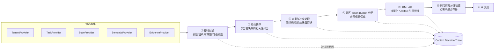

# 篇06-1：Agent 上下文治理（上）——信息契约、语义层与装配预算

## 导语

如果把第五篇的 Runtime 比作 DataAgent 的"心脏和血管"，上下文就是它的"血液"：模型每一个决策的质量上限，不取决于模型本身，而取决于这一次调用时它看到了什么。本子页是篇06 的上半篇：先打破"上下文 = Prompt"的等式，把信息按类别、Schema、生命周期分库分治，并为每个决策点定义"必须看到 / 可以看到 / 禁止看到"的输入契约（第 1 节）；再让 DataAgent 先理解指标、再接触数据，用语义层把"猜口径"变成"引口径"（第 2 节）；最后把拼字符串升级为可观测的六阶段装配管线，用分区 Token 预算守住"必需信息优先保障"的底线，正面回应 lost-in-the-middle 的注意力陷阱（第 3 节）。贯穿案例仍是多租户零售经营分析 DataAgent [^geektime]。

---

## 1. 从 Prompt 拼接到 Context Runtime：先定义每一步决策的信息契约

### 1.1 上下文 ≠ Prompt

"上下文"常被默认等同于"发给模型的那串文本"。这个等式是治理失败的起点。拆解一下，一次模型调用的输入里其实混着四类性质完全不同的东西：

| 信息类别 | 来源 | 生命周期 | 信任级别 |
|---|---|---|---|
| 对话历史 | 用户与模型的过往消息 | 整个 Session | 中（用户输入，需防注入） |
| 任务与运行状态 | Task Contract、Analysis State | 单个 Run | 高（系统持有） |
| 业务知识 | 指标口径、经营规则、文档 | 跨 Run、按版本演进 | 高（治理过的）/ 低（未治理的外部内容） |
| 工具与检索结果 | SQL 结果、文档、网页 | 单个 Step 为主 | 低（外部数据，视为不可信） |

它们混在一起拼接，就意味着：治理策略（谁能看）、生命周期（该留多久）、信任级别（能不能当指令）全都丢失了。Context Runtime 的第一步就是把这四类**分库、分 schema、分生命周期**管理，只在"调用模型前一刻"按需装配。

### 1.2 面向决策组织上下文

DataAgent 的一次 Run 里有性质迥异的决策点，它们需要看到的东西完全不同：

| 决策步骤 | 必须看到 | 可以看到 | 禁止看到 |
|---|---|---|---|
| 分析规划 | 任务契约、指标口径、可用数据源清单 | 历史类似案例摘要 | 原始大表、具体证据数据 |
| 查询设计（写 SQL） | 指标口径、目标表 schema、行列权限、时间语义 | 少量样例值 | 无关表结构、超权限字段 |
| 证据验证 | 当前假设、对应查询结果（Artifact 引用）、数据新鲜度 | 相邻假设结论 | 无来源的二手结论 |
| 建议生成 | 已验证的证据链、经营规则、风险分级 | 原始明细的摘要 | 未验证的假设、超权限数据 |

"共用一套大 Prompt 模板"的问题在这里一目了然：给写 SQL 的步骤塞进整份经营规则文档，既浪费 token 又稀释注意力；给建议生成步骤放进未验证假设，报告就会一本正经地写推测。**每个决策点有自己的输入契约（Decision Context Contract）：必须看到、可以看到、禁止看到，三张清单都由代码执行，不靠模型自觉。**

### 1.3 统一 Context Schema：每条信息自带元数据

契约要可执行，前提是每条进入上下文的信息是结构化对象而不是裸字符串：

```text
ContextItem {
  id, content 或 artifact_ref,
  source: "semantic_layer" | "sql_result" | "user_input" | "external_doc" | ...,
  version: "metric_registry v42"           # 来源版本，可追溯可复现
  trust: "system" | "tenant_governed" | "external_untrusted",
  permission_scope: { tenant_id, roles, row_col_policy_ref },
  confidence: 0.0~1.0 或枚举(governed/derived/unverified),
  lifecycle: "step" | "run" | "session" | "persistent",
  freshness: { data_as_of, ingested_at, ttl },
  token_cost: 估计占用
}
```

元数据不是装饰：权限过滤看 `permission_scope`，新鲜度检查看 `freshness`，防注入看 `trust`，预算分配看 `token_cost`，审计回放看 `source + version`。**没有元数据的上下文不可治理**——这句是本篇的元规则。

### 1.4 拆分 Context Provider

把信息获取从 Prompt 构造逻辑里解耦，每类信息一个 Provider：

- `TenantContextProvider`：租户身份、角色、行列级权限；
- `TaskContextProvider`：Task Contract、当前 Step 目标；
- `RunStateProvider`：Analysis State、计划进度、预算消耗；
- `SemanticProvider`：指标口径、术语别名（下一节的主角）；
- `EvidenceProvider`：Artifact 引用与证据包。

Provider 化让每类信息可以独立缓存、独立测试、独立版本化。第 6 节的 ContextOps 会证明这种拆分的回报。

### 1.5 关键上下文缺失即停止

最重要的治理规则只有一条：**宁可报错停止，不可带着猜测继续。** 指标口径查不到、租户身份解析失败、目标表权限不明确——这些情况下正确行为是 Run 进入"阻塞待补全"状态并报出缺什么，而不是让模型"根据经验合理推测"。DataAgent 猜错一次 GMV 口径，损失的可能是一次真实预算决策。

---

## 2. 经营语义上下文：让 DataAgent 先理解指标，再接触数据

### 2.1 数据库字段 ≠ 业务语义

让模型对着 `dwd_trade_order_di` 表猜"GMV"，它会编造：是含退款还是不含？含运费吗？按下单时间还是支付时间？企业里这些问题都有**确定答案**，但答案不在字段名里，在人的约定里。语义层（Semantic Layer）就是把这些约定显式化、机器可读化。

### 2.2 语义层的六个构件

1. **指标统一定义（Metric Registry）**：每个核心指标一条注册记录——`gmv = sum(pay_amount) where pay_status='success'`，含统计口径、责任部门、版本号。多租户环境下口径允许按租户定制，但**每个租户每个时刻只有一个生效版本**，模型只引用不创造。
2. **术语与别名**：建立"销售额 / 成交额 / GMV / gmv"→ 同一指标 ID 的映射，自然语言映射由查表完成，不靠模型联想。
3. **粒度与时间语义**：显式声明指标的粒度（日/周/自然月）、时区（UTC+8）、币种、以及"上周"指自然周还是近 7 天。这类歧义是经营分析错误的高发区，且错得毫无痕迹。
4. **Data Catalog 与血缘**：指标 → 物理表字段 → 计算规则 → 上游数据源的链路。它让每条结论可追溯，也让"这个字段能不能这么用"有据可查。
5. **权限先于相关性**：检索和装配的第一道闸是权限——当前租户+角色无权访问的表、字段、行，**根本不进入候选池**，而不是"检出来再提醒模型别用"。相关性永远排在权限之后。
6. **数据新鲜度与质量**：每个数据资产带 `data_as_of`（数据截止时间）与质量标记。用延迟 6 小时的库存数据解释"此刻为什么缺货"，结论必然失真；上下文应显式携带新鲜度，让模型（和人类读者）知道证据的时间边界。

DataAgent 实战落点：为 GMV、订单数、客单价、转化率、退款率建 Metric Registry，每条含口径 SQL、粒度、时区、币种、版本、负责人。模型在上下文中只见到**指标 ID + 定义引用**，口径 SQL 由语义层在查询设计时注入——模型不再"猜口径"，只能"引口径"。

---

## 3. 动态上下文装配与预算

### 3.1 装配管线化

把"拼字符串"改造成可观测的流水线：



管线化的意义：每一阶段可单测、可打日志、可替换实现。"这次调用为什么没看到退款率口径"能被定位到具体阶段——是候选没产出、被权限过滤了、还是被预算挤掉了。

### 3.2 硬性过滤与软性排序

- **硬性过滤**不可被相关性绕过：跨租户数据、超角色权限的字段、已过有效期的口径版本、`trust=external_untrusted` 的内容想进指令区——一律在第一阶段出局，无论它和问题"多相关"。这是安全底线，不接受"它真的很相关所以破例"。
- **软性排序**只在通过硬闸的候选内进行：按与当前 Step 决策的相关性打分排序，决定预算不够时谁先谁后。

顺序绝对不能反：**先过滤后排序**。反过来做，等于让相关性有机会为越权内容说情。

### 3.3 分区 Token Budget

不给上下文分区，结果就是谁嗓门大（内容长）谁占窗口：一次 5 万行的 SQL 结果把指标口径挤没了。分区预算给每类信息划地：

| 分区 | 内容 | 典型占比 | 保障级别 |
|---|---|---|---|
| 规则区 | 系统指令、行为准则、输出格式 | 15% | 硬性保底 |
| 任务区 | Task Contract、当前 Step 目标 | 10% | 硬性保底 |
| 状态区 | Analysis State 摘要、未闭合问题 | 15% | 硬性保底 |
| 语义区 | 本步涉及的指标口径、维度定义 | 20% | 高优先 |
| 证据区 | Artifact 引用、关键证据摘要 | 25% | 弹性 |
| 输出预留 | 模型回答空间 | 15% | 硬性保底 |

核心原则：**必需信息优先保障**。工具描述、历史记录、检索结果只能在弹性区内竞争，永远不许挤占保底区。

为什么"保底区"值得用工程手段死守？两个来自实验与线上事故的理由：

1. **注意力存在 U 型曲线**：实验表明，模型对长上下文开头与结尾的信息利用最好，埋在中段的信息最容易被"丢失"（lost-in-the-middle）[^lost]。这意味着"塞进去了"≠"会被用到"——关键口径若埋在五万行证据中间，模型大概率视而不见。分区保底 + 证据压缩，本质是把关键信息固定在注意力的高地上。
2. **挤压是无声的**：超预算不是报错，而是某条信息被悄悄挤掉。没有分区，你无法回答"口径此刻还在不在窗口里"；有了分区，"保底区完整"本身就是一条可断言的不变量。

用下面的交互 Demo 亲手制造一次预算挤压：拖证据需求滑块，或直接注入"5 万行 SQL 结果"洪峰，观察分区模式的两级自保（先压缩成 Artifact 引用卡，仍不够才按排序剔除）；再切到「无分区」对照，看语义区口径如何被挤出窗口、充分性检查如何缺席：

```demo context-budget
```

**Demo 导学单**

1. 默认状态下记录六个分区的容量分配，指出哪几个是"硬性保底"，对应上方表格的哪些行。
2. 把证据需求拖到证据区容量之上（但不注入洪峰）：明细表中证据区状态何时从"原始装入"变为"压缩为引用卡"？引用卡按正文 3.4 节必须保留哪三类信息？
3. 注入 SQL 洪峰后切到「无分区对照」：找出被挤出的分区，并解释为什么这类故障"不报错，只生产错误结论"。
4. 在"无分区 + 洪峰"状态下观察"充分性检查"一行：它为什么显示这道闸不存在？这对应 1.5 节的哪条治理规则？
5. 把总窗口从 32000 缩到 8000，在两种模式下各观察一次：55% 的保底占比设计在小窗口下是否仍然成立？你会怎么调整？

### 3.4 去重、冲突与可信压缩

- **去重**：同一指标定义被三个 Provider 各送一遍？按 `source + version` 去重，保留一份。重复证据只留引用计数。
- **冲突处理**：两条信息矛盾（口径 v41 说 GMV 含运费、v42 说不含）时，规则化裁决：版本新者优先、治理级别高者优先、且**冲突事实本身写入上下文**让模型知悉，而不是静默二选一。
- **可信压缩与 Artifact 引用**：5 万行的查询结果不进上下文，进 Artifact Store，上下文中只放 `{artifact_id, 行列规模, 关键统计量, 数据时间}` 的引用卡。压缩必须"可信"：摘要须保留来源引用与数据时间，禁止摘要改写成与原文矛盾的新断言（压缩不变量见第 5 节）。
- **调用前充分性检查**：装配完成、调用模型前的最后一道闸：当前 Step 契约里"必须看到"的项是否都在？缺了，停止调用并报缺失项——把"能调就调"改成"够了才调"。

### 3.5 代码骨架：ContextAssembler

```python
from __future__ import annotations
from dataclasses import dataclass, field
from typing import Protocol

@dataclass
class ContextItem:
    id: str; content: str | None; artifact_ref: str | None
    source: str; version: str; trust: str        # system/governed/external
    tenant_id: str; roles: set[str]; lifecycle: str
    data_as_of: float; token_cost: int; required: bool = False

class Provider(Protocol):
    def collect(self, req: "AssembleRequest") -> list[ContextItem]: ...

@dataclass
class AssembleRequest:
    run_id: str; tenant_id: str; role: str
    step_contract: dict          # 本步决策契约：必须/可以/禁止
    budgets: dict[str, int]      # 分区 token 预算, 如 {"rules":3000,"semantic":4000,...}

class ContextAssembler:
    def __init__(self, providers: list[Provider], ranker, trace_sink):
        self.providers, self.ranker, self.trace = providers, ranker, trace_sink

    def assemble(self, req: AssembleRequest) -> "AssembledContext":
        # 1. 收集候选
        cands = [c for p in self.providers for c in p.collect(req)]
        self.trace.log("candidates", [(c.id, c.source, c.version) for c in cands])
        # 2. 硬性过滤：租户、角色权限、有效期、信任边界 —— 不可被相关性绕过
        kept = [c for c in cands if self._hard_pass(c, req)]
        self.trace.log("filtered", [(c.id, "hard_filter") for c in cands if c not in kept])
        # 3. 软性排序：只在过闸者内部按相关性排
        ranked = self.ranker.rank(kept, req)
        # 4. 去重与冲突裁决（按 source+version 去重；版本新/治理级别高者优先）
        ranked = self._dedup_and_resolve(ranked)
        # 5. 分区预算：required 项保底装入，弹性项按序填充
        packed = self._pack_by_budget(ranked, req.budgets)
        # 6. 充分性检查：契约必需项缺失即拒绝调用
        missing = [m for m in req.step_contract["required_ids"]
                   if m not in {c.id for c in packed}]
        if missing:
            raise InsufficientContext(missing)   # 停止执行，报告缺口
        return AssembledContext(items=packed, trace_id=self.trace.id)

    def _hard_pass(self, c: ContextItem, req) -> bool:
        return (c.tenant_id == req.tenant_id and req.role in c.roles
                and not self._expired(c) and self._trust_allowed(c, req))
```

### 3.6 DataAgent 实战：四个 Context Profile

为规划、查询设计、原因分析、建议生成各建一份 Profile：规划 Profile 的语义区占大头、证据区留空；查询设计 Profile 加大 schema 与行列权限、砍掉历史对话；原因分析 Profile 把预算向证据区倾斜；建议生成 Profile 只收"已验证"状态的证据引用。四个 Profile 共用同一条管线、不同的契约参数——这正是 Provider 化与契约化带来的复用。

看完代码骨架，用下面的交互 Demo 把整条管线亲手跑一遍：左侧候选池有 15 条信息，里面埋了四处隐患——一条租户 B 的口径、一份含注入指令的外部文档、一对冲突的 GMV 口径版本、一条重复投递的证据。点「开始装配」，观察四段管线如何依次裁决：跨租户与不可信条目在①硬过滤直接出局（无论它多"相关"），v41 口径在②冲突裁决中被 v42 取代，③分区装填时证据区预算不足会把 5 万行原始结果压缩成 Artifact 引用卡。然后把 Token Budget 拖到 4000 以下，看保底区纹丝不动、弹性证据区先压缩后剔除的取舍顺序；最后打开「关闭硬过滤」开关再跑一次——右侧审计日志会告诉你注入与跨租户泄漏是怎样发生的：

```demo context-assembler
```

**Demo 导学单**

1. 点「开始装配」走一遍默认流程：在审计日志里找出四处隐患各自的"死法"（跨租户口径、注入文档、冲突版本、重复证据），并指出分别死于管线六阶段中的哪一阶段。
2. 找到被 v42 取代的 v41 口径：裁决依据是什么？冲突事实本身有没有写入上下文？对应 3.4 节哪条规则？
3. 把 Token Budget 拖到 4000 以下再装配：记录保底区与弹性区的不同命运，解释"必需信息优先保障"在日志里的体现。
4. 打开「关闭硬过滤」开关重跑：注入文档与租户 B 口径各自走到了哪一步？这违反了 6.1 节信任三圈的哪条铁律？
5. 思考：为什么关闭硬过滤后注入不是"必然成功"而只是"风险敞口"？防御为什么必须分层（对照 6.1 节攻击路径图）？

---

## 参考与脚注

[^geektime]: 极客时间《企业级 Agent 工程化》课程——本篇 Context Runtime、Decision Context Contract、语义层、证据体系与 ContextOps 的主线来源。
[^lost]: Liu et al., "Lost in the Middle: How Language Models Use Long Contexts"（TACL 2024）——长上下文注意力 U 型曲线、中段信息丢失的实验证据。https://arxiv.org/abs/2307.03172

---

➡️ 下一页：篇06-2 · Agent 上下文治理（下）——证据体系、长任务与 ContextOps
