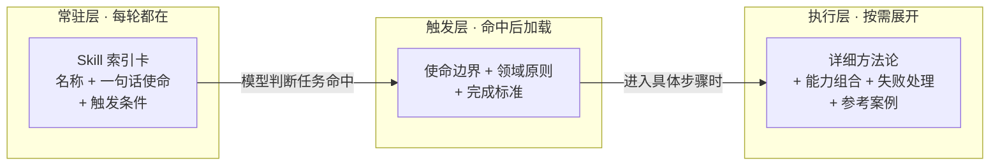
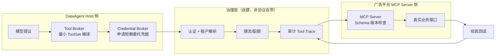

# 篇07-2：工具与技能治理（下）——Skill 工程、MCP 与 CapabilityOps

## 导语

上半篇解决"单个工具怎么管"，下半篇解决"能力如何沉淀为资产、如何跨团队供给"。本子页先讲 Skill Engineering：把一次成功的经营分析固化为带使命边界、领域原则、完成标准与 Validator 的领域能力，并用渐进式加载让 Skill 库规模增长时 Context 成本近似常数（第 4 节）；再讲 MCP 的正确定位——它是协议、不是治理方案，认证、租户隔离、限流、审计都要在协议之上自建，Capability Registry、Credential Broker、Tool Trace 与全链路红队测试共同构成 CapabilityOps（第 5 节）。篇末实战带你为 DataAgent 建一套从能力地图到 Skill 封装的完整工具治理体系 [^gktime]。

---

## 4. Skill Engineering：把一次成功的经营分析固化为领域能力

### 4.1 Skill 的任务边界：先搞清楚它"不是什么"

Skill 被滥用，通常是因为没搞清楚边界：

- **Skill 不是 Prompt 模板**。Prompt 是一次性指令；Skill 是带方法论、原则和验证标准的能力单元，能被选择、加载、验证、版本化。
- **Skill 不是 Tool**。Tool 是单步能力；Skill 是"何时用哪些 Tool、按什么顺序、做到什么程度算完成"的知识。Skill 编排 Tool，而不是替代 Tool。
- **Skill 不是整个 Agent**。Agent 有自己的目标、循环和工具全集；Skill 是 Agent 可以"习得"和"卸载"的一块领域能力。一个 DataAgent 可以同时装载"异常诊断""周报生成""库存健康检查"多个 Skill。
- **Skill 也不是 Workflow**。Workflow 的步骤是代码写死的；Skill 给出的是方法论和判断原则，具体路径仍由模型在 Skill 约束下动态决策——这正是它适合"经营异常诊断"这类半结构化任务的原因。

一句话定义：**Skill = 一类任务的可复用方法论 + 完成标准 + 所需能力组合，以渐进式方式提供给模型。**

封装一个 Skill 之前，先做"值不值得封装"的判断——不是所有高频任务都该变成 Skill：

| 判断维度 | 适合封装为 Skill | 不该封装（保持现状） |
|---|---|---|
| 任务结构 | 半结构化：有稳定方法论，但路径需动态调整 | 完全固定（用 Workflow）或完全开放（靠模型泛化） |
| 复用频率 | 跨用户/跨租户反复出现 | 一次性或极低频 |
| 领域知识密度 | 有"老师傅经验"需要固化（原则、禁忌、验收标准） | 通用常识即可解决 |
| 完成标准 | 能写出可检查的验收条件 | "做得好"只能靠感觉 |
| 失败代价 | 做错了有业务后果，需要 Validator 把关 | 错了重来即可 |

### 4.2 Skill 六层结构

只有一个操作步骤清单的 Skill 是脆弱的：模型会机械执行步骤，却不知道什么时候该停下来、什么结论算合格。生产级 Skill 需要六层：

| 层 | 内容 | 回答的问题 | DataAgent 异常诊断 Skill 示例 |
|---|---|---|---|
| 1. 使命与边界 | 这个 Skill 解决什么、明确不解决什么 | 何时启用/禁用 | 诊断 GMV/毛利/转化率等指标异常；不做实时定价决策 |
| 2. 领域原则 | 不随任务变化的专业判断准则 | 怎么做才对 | "先确认指标口径再比较数值""任何原因假设必须有数据证据" |
| 3. 方法论/步骤 | 推荐的分析路径（可动态调整） | 按什么顺序做 | 指标确认→提出假设→查询证据→分析验证→原因排序→生成报告 |
| 4. 完成标准 | 可检查的产出验收条件 | 什么时候算做完 | 报告必须含：异常指标、量化幅度、≥1 条排除掉的假设、证据引用 |
| 5. 能力组合 | 需要的 Tool/Workflow/SubAgent 清单 | 用什么做 | query_metrics、run_python_analysis、generate_report |
| 6. 失败与升级 | 什么情况停止并求助 | 什么时候不做 | 数据缺失超过 30% 时停止诊断并提示补齐数据，而非强行给结论 |

### 4.3 Tool / Workflow / SubAgent 的组合关系

复杂 Skill 内部的调用关系必须**显式声明且可审计**，而不是藏在 Skill 文本里让模型自由联想：

- Skill 声明它**允许使用**的工具白名单——这是权限边界，Skill 加载时动态收窄 ToolSet；
- 其中固定不变的部分（如"报告生成→存档→通知"）下沉为 Workflow 子流程，不让模型每次重新编排；
- 真正需要独立推理循环的子目标（如"对每个候选原因做深度下钻"）才分派给 SubAgent，并明确其返回契约；
- 禁止循环依赖：Skill A 调 Skill B、B 又调 A，必须在加载期做依赖检查。

### 4.4 渐进式加载：Skill 越多，Context 越省

当 Skill 从 3 个变成 30 个，全量注入 Context 既不经济也干扰选择。渐进式加载分三级：



模型每轮只看到几十行的索引卡；命中后才加载该 Skill 的核心约束；真正执行到某一步时才展开细节。这样 Skill 库规模增长时，Context 成本近似常数。

### 4.5 Skill Validator：不相信"我完成了"

模型声称"诊断完成"不等于真的完成。Skill Validator 是独立于执行模型的**验收器**（可以是规则、另一个模型或两者结合），对照完成标准逐项检查：报告里有量化幅度吗？每个原因假设都有证据引用吗？有没有至少排除一个竞争性假设？验收不通过，结果打回并附具体缺失项——这把"完成"从模型的自我感觉变成了可执行的契约。

### 4.6 Skill 生命周期治理

Skill 一旦进入生产就是资产，需要像代码一样治理：

- **版本化**：每次修改产生新版本，保留旧版本可回滚；
- **兼容性评估**：修改方法论或完成标准时，用历史任务集回归测试，评估行为变化是改进还是退化；
- **效果监控**：按 Skill 维度统计任务成功率、Validator 通过率、人工接管率；
- **退役机制**：长期低使用或持续退化的 Skill 进入弃用流程，而不是默默留在索引里继续被误触发。

**组织级 Skill 生态的真实样本**：金山办公在 WPS Comate 上实践了"员工自建 Skill + 平台统一治理"的模式——6000 多人的公司上线一个月，员工自发上传的 Skill 达 5000 个，平台侧负责版本、权限、责任人与安全检测，让一线经验在组织内复利流动[^wpscomate]。这个案例恰好印证了本节与 4.4 节的两条结论：Skill 供给可以高度民主化（一线员工最懂场景），但**治理必须集中化**（没有安全检测与版本治理的 Skill 传播，等于让未经评审的代码全网扩散）；同时，当 Skill 数量到千级，渐进式加载与索引卡机制就从"优化"变成了"生死线"。

---

## 5. MCP 与 CapabilityOps

### 5.1 MCP 的正确定位：它是协议，不是治理方案

MCP（Model Context Protocol）解决的是**能力发现与调用的标准化**：Host 可以用统一方式发现远程 Server 提供哪些 Tool/Resource、Schema 是什么、怎么调用。它类比的是"USB 接口标准"，而不是"设备安全管理体系"。

先把协议本身的三个角色和三类原语说清楚，避免和治理概念混淆：

| MCP 概念 | 是什么 | DataAgent 语境中的对应 |
|---|---|---|
| Host | 发起连接的宿主应用（Agent Runtime 所在进程） | DataAgent Runtime |
| Client | Host 内与某个 Server 保持 1:1 会话的连接器 | Runtime 里每个 MCP 适配器实例 |
| Server | 暴露能力的远程服务 | 广告平台团队的预算操作服务 |
| Tools | 可被模型调用的函数（有 Schema） | `adjust_budget`、`query_campaigns` |
| Resources | 可读取的数据对象（类文件） | 广告投放报表模板 |
| Prompts | Server 提供的提示词模板 | 平台方沉淀的分析话术模板 |

因此必须破除的迷思是：**接入了 MCP ≠ 拥有了治理**。MCP 协议本身不管你是谁（认证）、你能用谁的（授权与租户隔离）、你能用多少（限流）、你干了什么（审计）。这些都是生产化时必须自己补齐的——下文每一项都不是 MCP 给你的，而是你在 MCP 之上建的。

### 5.2 MCP 适用边界

同样重要的是知道什么时候**不该**用 MCP：

- 单体内部的纯函数、内部模块——直接 import，协议化纯属增加成本；
- 只有一个消费者、同一个团队维护的内部服务——普通 RPC/HTTP 客户端更简单；
- 真正适合 MCP 的场景：**能力的提供方和消费方是不同团队/不同系统**，需要标准化的自我描述和发现机制，且提供方会服务多个消费方。DataAgent 接广告平台能力就是典型：广告团队维护 MCP Server，DataAgent、营销自动化系统等多个 Host 消费。

### 5.3 生产级 MCP Server 清单

一个只有 Tool Schema 的 MCP Server 是 demo，不是产品。上线清单至少包括：

- **认证**：OAuth/mTLS，Host 与应用身份都可验证；
- **租户隔离**：Server 端按凭据解析租户上下文，绝不信任调用方自报的 tenant_id；
- **限流与配额**：按租户、按工具、按时间窗；
- **审计**：每次调用记录谁、何时、调了什么、参数摘要、结果状态；
- **版本管理**：Schema 变更走兼容策略，旧版本有明确的 sunset 时间；
- **错误语义**：返回第 2 节定义的标准错误（可重试/改参数/停止），而不是裸异常。

一次跨团队 MCP 调用在补齐治理之后，真实链路长这样——注意协议层只占了中间一小段：



这张图要带走的一句话：**MCP 标准化的只是 SV 那一小段"怎么发现、怎么调用"；左右两侧的编译、凭据、认证、限流、审计、验真，全是你要自己建的 CapabilityOps。**

### 5.4 Capability Registry：能力的"CMDB"

当能力来自进程内插件、本地 Tool、多个远程 MCP Server，系统必须回答：现在到底有哪些能力？谁负责？哪个版本可用于生产？这就是 Capability Registry——一份包含能力标识、形态、端点、负责人、版本、风险等级、租户可见性、健康状态的注册表。动态 ToolSet 编译（第 2.4 节）的数据源就是它；治理审计、下线评估、事故定责也都以它为准。

### 5.5 进程内插件 vs 远程 MCP（Capability Seam 对照）

| 维度 | 进程内插件接口 | 远程 MCP Server |
|---|---|---|
| 延迟与可靠性 | 进程内调用，毫秒级 | 网络调用，需超时/重试/熔断 |
| 权限边界 | 与宿主共享，靠代码自律 | 天然进程边界，可独立鉴权 |
| 部署与升级 | 随宿主发版 | 独立部署，独立演进 |
| 治理责任 | 宿主团队全责 | 提供方背 SLA，消费方管接入策略 |
| 适用 | 核心路径、高频、需共享数据权限上下文 | 跨团队供给、需独立演进、多消费方 |

### 5.6 动态 ToolSet 编译（针对 MCP 的再次强调）

MCP Server 倾向于暴露大量工具（广告平台可能暴露 40 个）。把它们全部交给模型，等于把第 1.5 节解决的问题重新制造一遍。正确做法不变：Host 侧按（租户 × 角色 × 任务阶段）编译最小 ToolSet，MCP 只是能力来源之一，不改变最小可见面原则。

### 5.7 Credential Broker 与 Tool Trace

最后两块拼图：

- **Credential Broker**：Host/Runtime 与 MCP Server 之间的凭据中介。模型和 Agent 上下文永远不接触凭据；执行器按 Action 申请短期凭据（见 3.3）。跨团队场景下，它还负责把"用户身份"安全地转换为"对下游系统有效的委托凭据"。
- **Tool Trace**：每一次工具调用产生一条完整轨迹——谁发起（用户/租户）、模型提议了什么、Runtime 决策是什么、执行参数与结果摘要、耗时、证据引用。Trace 串联起"提议→决策→执行"全链路，是事故追责、红队测试和效果评估的共同数据底座。

### 5.8 全链路红队测试

工具体系是否真正生效，要用攻击来验证，而不是用正常路径来演示。DataAgent 的最小红队用例集：

1. **跨租户访问**：用租户 A 的会话尝试调用工具访问租户 B 的数据/预算（应在 ToolSet 编译和 Server 端双重拦截）；
2. **伪造结果**：让工具返回伪造的"执行成功"，验证验真环节是否回读真实状态；
3. **重复执行**：重放同一 ActionRequest，验证幂等键是否阻止二次扣款/二次调整；
4. **版本漂移**：MCP Server 升级 Schema 后，验证 Registry 版本检查与 Host 兼容策略是否生效，而不是静默失败。

---

## 常见误区

1. **"工具越多 Agent 越强"**。恰恰相反：工具越多，误选率越高、Context 越贵、权限面越大。强的是"在正确时刻看到正确工具"的 Agent。
2. **把审批写进 Prompt**。"调预算前请先征求用户同意"写在系统提示里，等于用概率执行合规。审批必须是 Runtime 状态机里的硬门禁。
3. **Tool Call 即执行**。模型输出即副作用，是最经典的生产事故根源。提议与执行之间永远隔着校验、授权和（高风险时的）审批。
4. **把 MCP 当治理方案**。协议标准化的是"怎么发现和调用"，不是"谁被允许"。认证、隔离、限流、审计都要自己建。
5. **Skill 写成操作手册**。只有步骤没有使命边界和完成标准的 Skill，模型会在不该用时乱用、在该停时不停。
6. **万能工具图省事**。`run_sql(sql)` 一个工具顶所有，短期省事，长期赔上安全性、可审计性和调用成功率。

## 本篇实战：为 DataAgent 建一套工具治理体系

### 第 1 步：画能力地图（认知层）

- **目标**：把"哪些能力该以什么形态存在"想清楚，落到纸面。
- **操作**：为 DataAgent 列出 8 项能力（指标查询、明细查询、Python 分析、报告生成、工单创建、预算调整、库存预警、用户反馈收集），为每项选择形态（Tool/Skill/Workflow/SubAgent/MCP）并写出三条选型理由；特别标注哪几项被你有意识地排除在"模型可见"之外。
- **验收标准**：每项能力的形态选择能用 1.1 节的三个问题（谁决策/决策频率/失败代价）解释；至少 2 项能力被显式排除在模型可见面之外并说明理由。

### 第 2 步：写三层契约（设计层）

- **目标**：把第 1 步的两个关键工具落到可评审的契约文档。
- **操作**：用 2.6 节代码骨架为 `query_business_metrics` 和 `adjust_ad_budget` 各写一份完整 ToolContract，两者治理层风险等级必须不同；再写一段动态 ToolSet 过滤伪代码（输入：租户能力包、角色、任务阶段；输出：可见工具列表）。
- **验收标准**：契约三层齐全且每层的变更互不影响能举例说明；`adjust_ad_budget` 的 Runtime 层显式声明幂等策略与 `expected_state`；过滤伪代码覆盖 2.4 节的四个输入因子。

### 第 3 步：推演审批闭环（机制层）

- **目标**：验证你设计的状态机真的能拦住三类经典攻击。
- **操作**：为预算调整 Action 手工推演一次完整状态机迁移（提议→…→验真），然后设计三个攻击场景（重复请求、审批期间预算被他人修改、接口假成功），说明状态机在哪一步拦住了它们；用本篇 Demo（tool-permission）复演 r5/r6 两个请求对照检查。
- **验收标准**：三个攻击场景各自定位到具体拦截环节（幂等键 / expected_state 比对 / 验真回读），且能说明如果缺少该环节会发生什么。

### 第 4 步：封装一个 Skill（资产层）

- **目标**：把"周报生成"从一次性 Prompt 升级为可治理的领域资产。
- **操作**：按六层结构编写"周报生成 Skill"，重点写第 2 层（领域原则）和第 4 层（完成标准），并为完成标准设计一个基于规则的 Validator 检查清单。
- **验收标准**：六层无空缺；领域原则不少于 3 条且每条"不随任务变化"；Validator 清单每条可机械执行（是/否判定），不含"写得好"这类主观项。

### AI Coding 实操模式

① **可复制提示词模板**（把第 2 步的契约设计委托给 AI 起草）：

```text
你是企业级 Agent 平台的工具治理架构师。背景：多租户零售经营分析 DataAgent。
请为工具「<工具名>」设计三层 ToolContract，输出 Python dataclass 代码：
1. 模型理解层：业务语义命名、一句话职责、何时该用/不该用（至少 1 条反例）、
   每个参数的业务含义与受控取值（枚举优先，禁止自由文本）；
2. Runtime 执行层：JSON Schema、超时、重试、幂等策略、副作用标记；
3. 治理层：负责人、版本、风险等级（L1 只读/L2 可逆写/L3 资金生产变更）、
   数据分级、租户可见性、审计要求。
另附：标准 ToolResult 对象，错误语义必须区分 RETRY / FIX_PARAMS / STOP，
每种失败类型写明"模型下一步该怎么办"。
```

② **AI 初版人工评审清单**：

- [ ] 参数是否全部受控（枚举/正则约束），有没有自由文本参数被放行？
- [ ] 风险分级是否与动作真实后果匹配（AI 常把写操作低估为 L1）？
- [ ] 错误语义是否每种失败都指定了模型的应对动作，还是只有笼统的 error？
- [ ] 幂等策略是否显式写出（AI 常默认省略），副作用标记是否为 true？
- [ ] 模型理解层有没有写反例（when_not_to_use），还是只有正面描述？

③ **验收标准**：契约通过评审清单全部条目；用 AI 生成 5 个"模型可能发起的错误调用"（参数错、越权、重复、超范围、伪造租户），逐条对照契约能说出在哪一层被如何处理。

## 自测清单

- [ ] 能说清 API/Tool/Skill/Workflow/SubAgent/MCP 的决策者差异，并为给定能力选出形态并给出理由
- [ ] 能解释"模型决策与系统执行分离"，并指出自己系统中哪里违反了这条红线
- [ ] 能写出三层 ToolContract，并说明每层变更时哪些层不受影响
- [ ] 能设计标准错误语义，让模型区分"重试 / 改参数 / 停止"
- [ ] 能画出"提议-校验-授权-审批-执行-验真"闭环，并说明每一步防的是什么故障
- [ ] 能解释幂等键与 expected_state 分别解决什么问题，并说出四种幂等实现的防护强度排序
- [ ] 能写出 Skill 六层结构，并说明 Skill 与 Prompt/Tool/Workflow/Agent 的边界
- [ ] 能解释渐进式加载如何让 Skill 库规模增长时 Context 成本近似常数
- [ ] 能列出生产级 MCP Server 上线清单，并说明哪些不是协议自带的
- [ ] 能设计至少 4 个红队用例验证工具治理体系

---

## 参考与脚注

[^gktime]: 极客时间《企业级 Agent 工程化》课程（工具治理、Skill 工程与 CapabilityOps 相关章节）——本篇的能力形态选型、Action Runtime 与 Skill 六层结构在该课程大纲基础上扩展改写。
[^wpscomate]: 珠海网《金山办公将在7月中旬发布WPS Comate，直击企业AI"落地难"》，2026-07-05（6000 余员工、上线一个月自发上传 Skill 达 5000 个；"三通一平"组织级 AI 基建理念），https://pub-zhtb.hizh.cn/a/202607/05/AP6a4a6250e4b082bf2149917e.html 。本站存档见[资料04](资料04-WPSComate落地.md)。

---

➡️ 下一页：篇08-1 · Agent 记忆治理（上）——记忆契约与可信写入链路
