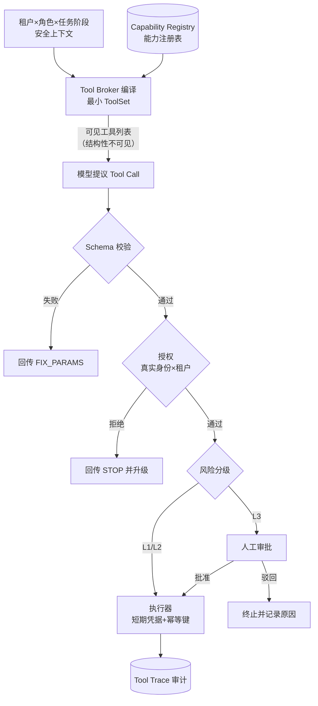
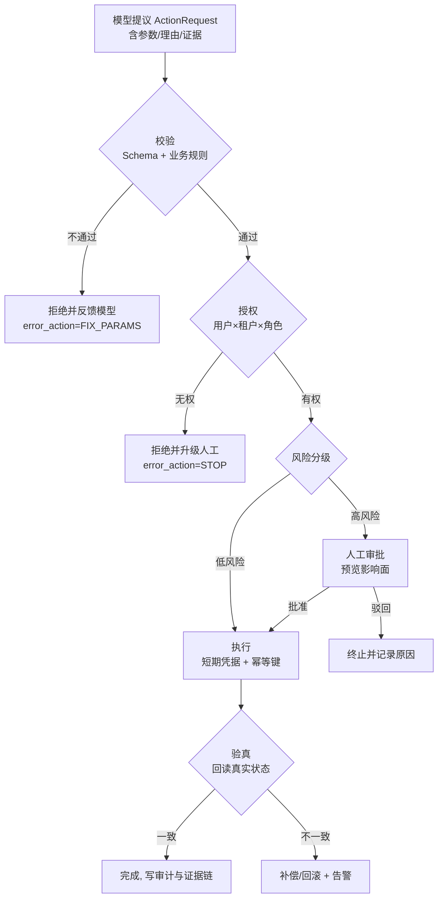
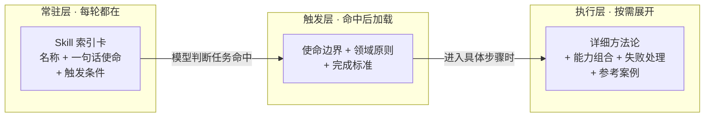
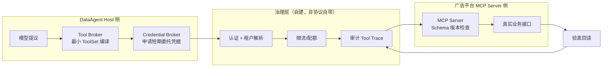

# 第七篇 Agent 工具/技能治理：让 Agent 安全、可靠、高效地连接真实世界

## 导语

一个只能聊天的 Agent 是玩具，一个能随意调用生产接口的 Agent 是事故。企业级 Agent 的真正难点，不在于"让模型学会调工具"——Function Call 早已是标配——而在于：当 Agent 身后连着订单库、广告平台、工单系统和预算系统时，**你如何保证它调得对、调得安全、出了问题能追责**。

本篇以贯穿项目"多租户零售经营分析 DataAgent"为背景，回答五个层层递进的问题[^gktime]：

1. 一项业务能力究竟应该封装成什么形态？（能力架构选型）
2. 工具定义怎么写，模型才能选对、传对、读懂结果？（Tool Contract）
3. 高风险动作（如调整广告预算）如何收进受控执行闭环？（Action Runtime）
4. 一次成功的经营分析如何固化成可复用的领域能力？（Skill Engineering）
5. 跨团队能力如何通过 MCP 接入并持续运营？（CapabilityOps）

读完后，你应该能为 DataAgent 画出一张完整的能力地图，并说清楚每一项能力的形态、边界、权限和审计方式。

---

## 1. 从 Function Call 到 Capability Architecture

### 1.1 为什么"形态选型"是第一个架构问题

很多团队的工具治理失控，起点不是工具写错了，而是**能力放错了位置**：把本该是 Workflow 的固定审批流写进了 Prompt，让模型每次"自由发挥"；把本该是 Tool 的单次查询封装成了 SubAgent，白白多一轮模型调用；把本该进程内调用的纯函数强行做成远程 MCP，引入网络、认证和版本管理的全部成本。

形态选型的本质是回答三个问题：

- **谁来决策？** 是模型动态决定调用，还是代码静态编排？
- **决策频率多高？** 每次任务都要重新决策，还是一次决策反复复用？
- **失败代价多大？** 调用失败是重试一次就行，还是需要审批和补偿？

### 1.2 六种能力形态对比

| 形态 | 决策者 | 适用场景 | 粒度 | 典型代价 | DataAgent 例子 |
|---|---|---|---|---|---|
| API（内部函数/服务接口） | 代码 | 系统内部的确定性逻辑，模型不可见 | 任意 | 无模型调用成本 | 权限校验、指标口径查询的内部实现 |
| Tool（模型工具） | 模型 | 需要模型根据上下文决定"调不调、传什么参数"的单步能力 | 单步、无副作用或弱副作用 | Schema 占用 Context；误调用风险 | `query_metrics`、`run_python_analysis` |
| Skill（领域技能） | 模型触发 + Skill 内规则引导 | 有稳定方法论、需要领域原则和完成标准的复合任务 | 一个完整任务类型 | 需要维护版本与验证器 | "经营异常诊断 Skill" |
| Workflow（确定性编排） | 代码/编排引擎 | 步骤固定、顺序固定、合规要求强的流程 | 多步骤流水线 | 灵活性低，变更需发版 | "每日经营报告生成流水线" |
| SubAgent（子代理） | 主 Agent 分派 | 需要独立上下文窗口、独立推理循环的复杂子任务 | 一个子目标 | Token 成本翻倍；结果需合并 | "库存健康度深度分析子代理" |
| MCP（远程能力协议） | 模型（经 Host 过滤） | 跨团队、跨进程、跨组织提供的能力 | 一组远程 Tool/Resource | 网络、认证、限流、版本治理成本 | 广告平台团队提供的预算操作 MCP Server |

经验法则：**能用代码决定的，不要让模型决定；能用单步 Tool 表达的，不要包成 SubAgent；能进程内解决的，不要协议化。**

### 1.3 插件化与服务化：能力住在哪里

形态之外还有"部署位置"的选择，可以对照"Everything is a Plugin"的思路理解成一条光谱[^phoenix]：

- **进程内模块**：直接 import。延迟最低、类型最安全，但与宿主同生共死，升级要发版。
- **进程内插件**：通过接口注册（如插件发现机制），可独立加载卸载，仍共享进程和权限边界。
- **独立服务（RPC/HTTP）**：独立部署、独立伸缩，但需要认证、限流、熔断。
- **远程 MCP Server**：在独立服务之上叠加了标准化的工具发现和 Schema 描述，适合跨团队供给能力。

代价是单调递增的：每往外走一步，你就多承担一份网络、安全、版本和可观测性成本。选型的原则是**让能力住在离它数据最近、治理责任最清晰的地方**。DataAgent 的 SQL 查询走进程内 Query Gateway（需要行列级权限，必须和数据权限体系同进程同上下文），而广告预算能力走独立 MCP Server（由广告平台团队运维、背 SLA）。

### 1.4 模型决策与系统执行分离

这是本篇最重要的一条架构红线。一个"工具调用"在系统里其实是三件事：

1. **模型提议**：模型输出"我想调 `adjust_budget`，参数是 X"——这只是文本，不是事实。
2. **系统校验与决策**：Runtime 检查参数合法性、权限、风险等级，决定放行、拒绝还是转人工。
3. **真实执行**：由持有凭据的执行器调用真实业务接口。

把这三件事混在一个函数里（模型一输出就执行），等于把生产系统的钥匙交给了概率模型。分离之后，模型的"提议面"和系统的"执行面"各自演化：模型可以换，执行器不用动；执行策略收紧，Prompt 不用改。

### 1.5 工具粒度与最小模型可见面

工具粒度的两个极端都有明确的失败模式：

- **过粗**：一个 `do_analysis(question, datasource)` 万能工具。模型看似"什么都能调"，实际上参数自由度过高，无法校验、无法限权、无法审计，出了错也无法定位是哪一步。
- **过细**：把 SQL 的每个子句都做成工具。模型要在几十次调用里拼装一个查询，错误率指数上升，Context 被工具结果淹没。

合理的粒度是**业务语义粒度**：一个工具对应一个模型能理解的业务动作（"查指标""跑分析""生成报告草稿"），参数是业务对象（指标名、时间范围、维度），而不是技术细节（SQL 片段、表名）。

判断粒度是否合适，可以用一张决策表自检：

| 自检问题 | 偏粗的信号 | 偏细的信号 | 合适的信号 |
|---|---|---|---|
| 参数能被 JSON Schema 严格校验吗？ | 关键参数是自由文本（SQL、自然语言指令） | 参数多到模型经常漏传 | 参数全是枚举/受控词汇，Schema 即文档 |
| 一次调用对应一个业务动作吗？ | 一次调用干了三步事，失败不知错在哪 | 一个业务动作要拆成 5 次调用 | 调用日志读出来就是业务语言 |
| 能对它单独限权吗？ | 权限只能"全开或全关" | 权限配置数量爆炸，没人说得清 | 每个工具能独立标风险等级 |
| 失败能单独重试/补偿吗？ | 部分成功，无法界定重试范围 | 重试要编排多个调用的顺序 | 单次调用即原子单位，幂等键可覆盖 |

与粒度配套的是**最小模型可见面**原则：任意时刻，模型只应看到当前租户、当前角色、当前任务阶段所需的最小工具集。工具全量暴露不仅浪费 Context（每个 Schema 都是 Token），更会直接造成误选和越权——模型没法调用它看不见的工具，这是最简单也最可靠的权限控制。DataAgent 中，只读分析会话不暴露任何写工具；预算调整工具只在"行动建议被用户确认后"才注入。

### 1.6 工具设计三原则速查：粒度、幂等、错误回传

把散落本篇各节的工具设计纪律收敛成三句话，也是评审任何一个新工具的 checklist：

1. **粒度即权限**：工具的边界就是权限的边界。切分工具时先问"这个动作要不要单独限权、单独审计"，要，就独立成工具。
2. **写操作必幂等**：凡是会改变世界状态的工具，必须回答"同一个请求来两次会发生什么"。答案不能是"祈祷网络不重试"（详见 3.4）。
3. **错误即指令**：工具返回的不是"成功/失败"，而是"模型下一步该怎么办"。每一种失败都要预设模型的应对动作（详见 2.3）。

---

## 2. Tool Contract 与动态工具供给

### 2.1 三层 Tool Contract：一个工具，三份契约

典型反模式是把所有要求塞进一份 JSON Schema 扔给模型。企业级工具需要把契约拆成三层，各管各的：

| 层 | 面向谁 | 内容 | 变更频率 |
|---|---|---|---|
| 模型理解层 | 模型 | 工具名、一句话职责、参数语义、何时该用/不该用、结果怎么读 | 低，随能力语义演化 |
| Runtime 执行层 | 执行器 | 参数 JSON Schema、校验规则、超时、重试策略、幂等键、副作用标记 | 中，随实现演化 |
| 企业治理层 | 治理平台 | 负责人、版本、风险等级、数据分级、租户可见性、审计要求、配额 | 高，随治理策略演化 |

三层分离的价值在于：治理策略收紧（比如某工具从"自动执行"降为"需审批"）只改治理层，不碰模型看到的描述；执行器重写了，模型的理解层不受影响。

### 2.2 工具语义与参数设计

模型选错工具，八成是语义问题而不是模型问题。几条实战原则：

- **名字即边界**：`query_business_metrics` 比 `query_data` 好，因为名字本身就排除了"查原始订单明细"的误用。
- **参数用枚举和受控词汇**：指标名用枚举而不是自由字符串，让模型在受控空间里选择，杜绝编造。
- **一个参数一个含义**：`time_range="last_7d"` 优于 `start/end` 自由组合——自由度每多一分，出错面就大一圈。
- **在描述里写反例**：明确写"不要用于查询实时库存，实时库存请用 X"。模型对负面约束的遵循能力比想象中强。

### 2.3 标准结果与错误语义：教模型"下一步怎么办"

工具结果不只是数据，更是**给模型的行动指令**。企业级结果对象至少要带三类信息：

- **状态**：success / retryable_error / parameter_error / permission_denied / stopped_by_policy。
- **错误语义**：模型必须能从结果里判断"该重试、该改参数、还是该停下告诉用户"。超时是 retryable；参数不合法是 parameter_error（重试一百次也没用）；权限不足必须停止并升级给人。
- **证据与元数据**：数据时间、来源、行数、截断标记。DataAgent 要求所有数据工具结果携带 `as_of` 和 `evidence_ref`，否则结论无法溯源。

为什么错误回传值得单独当原则讲？因为**模型的下一步行为，几乎完全由工具返回的错误文本塑造**。同一场失败，三种回传方式会导出三种完全不同的后续：

| 回传方式 | 示例 | 模型的实际后续行为 | 后果 |
|---|---|---|---|
| 裸异常 | `Exception: timeout` | 模型自由发挥：可能重试、可能编造数据、可能放弃 | 行为不可预测，审计无从谈起 |
| 状态码无指引 | `{"status": "error", "code": 403}` | 模型不知道 403 该停，往往换个参数继续试 | 越权请求被反复重放，触发告警 |
| 结构化错误语义 | `{"status": "permission_denied", "error_action": "stop", "message": "该指标超出当前角色数据范围，请告知用户申请权限，不要重试"}` | 停止调用，如实向用户解释并给出补救路径 | 行为确定、可审计、体验体面 |

设计错误语义时按这张映射表路由：

| 失败类型 | error_action | 模型该做的 | 不该做的 |
|---|---|---|---|
| 超时、限流、依赖抖动 | RETRY（带退避上限） | 等待后重试，超过上限则降级告知 | 无限重试 |
| 参数缺失/越界/类型错 | FIX_PARAMS | 按 message 修正参数后重调一次 | 原样重试、编造参数 |
| 权限不足、越租户 | STOP | 停止，向用户解释并建议申请权限 | 换说法绕过、伪造身份 |
| 策略拒绝（合规/预算封顶） | STOP + 升级 | 停止并转人工通道 | 拆小金额规避 |

### 2.4 动态最小工具集：ToolSet 是"编译"出来的

静态工具列表的问题在于：不同租户买了不同能力包、不同角色有不同权限、同一任务的不同阶段需要不同工具。解法是**动态 ToolSet 编译**：在每次模型调用前，由 Tool Broker 根据（租户能力包 × 角色权限 × 任务阶段 × 风险策略）过滤和组装出本次调用可见的工具列表。这把"权限"从 Prompt 里的口头约束，变成了结构性的不可见——前面说的最小可见面，落地机制就是它。

一次工具调用的完整权限决策流如下（这也是本篇 Demo 的模拟对象）：



注意这张图里模型出现的位置：**它在第二道门之后才开始参与**。模型能"看到"什么工具，在模型说话之前就由安全上下文决定了——这是和"在 Prompt 里写你不许调 X"的本质区别。

### 2.5 三种工具设计对照（Tool Badcase 分析）

| 维度 | 万能工具 `run_query(sql)` | 底层 SQL 工具（表/列级） | 业务语义工具 `query_metrics` |
|---|---|---|---|
| 调用成功率 | 低（SQL 生成错误多） | 中（多次调用拼装，易错） | 高（受控参数空间） |
| 安全性 | 极差（任意 SQL，注入与越权直通车） | 中（需表级权限，但行列权限难落实） | 高（只能访问指标层，行列权限内建） |
| 可审计性 | 差（审计的是任意 SQL 文本） | 中 | 高（审计的是业务语义调用） |
| 治理成本 | 无法治理 | 高 | 低（指标口径一处维护） |

结论：DataAgent 的数据查询能力应该落在**指标语义层**，让 Query Gateway 把业务参数编译成受控 SQL，而不是把 SQL 的自由交给模型。

### 2.6 代码骨架：三层 ToolContract

```python
from dataclasses import dataclass, field
from enum import Enum
from typing import Any

class RiskLevel(Enum):
    READ_ONLY = "read_only"      # 只读，自动放行
    LOW_WRITE = "low_write"      # 可逆写入，记录审计
    HIGH_WRITE = "high_write"    # 资金/生产变更，强制审批

class ErrorAction(Enum):
    RETRY = "retry"              # 可重试：超时、限流
    FIX_PARAMS = "fix_params"    # 改参数：模型应修正后重调
    STOP = "stop"                # 停止：权限不足/策略拒绝，升级给人

@dataclass
class ModelFacingContract:            # 第一层：模型理解层
    name: str                         # 业务语义命名，如 query_business_metrics
    purpose: str                      # 一句话职责 + 何时该用
    when_not_to_use: str              # 反例约束，划清边界
    param_semantics: dict[str, str]   # 每个参数的业务含义与受控取值

@dataclass
class RuntimeContract:                # 第二层：Runtime 执行层
    params_schema: dict               # JSON Schema，服务端强校验
    timeout_ms: int = 10_000
    max_retries: int = 2
    idempotency: str = "by_request_id"  # 幂等策略
    side_effect: bool = False

@dataclass
class GovernanceContract:             # 第三层：企业治理层
    owner: str                        # 责任团队
    version: str
    risk: RiskLevel
    data_classification: str          # 数据分级：公开/内部/机密
    tenant_visibility: list[str]      # 哪些租户可见，空=全租户
    audit_required: bool = True

@dataclass
class ToolResult:                     # 标准结果对象
    status: str                       # success / retryable_error / ...
    data: Any = None
    error_action: ErrorAction | None = None
    message: str = ""                 # 给模型读的"下一步指令"
    evidence_ref: str | None = None   # 证据引用，支撑结论溯源
    as_of: str | None = None          # 数据时点

@dataclass
class ToolContract:
    model: ModelFacingContract
    runtime: RuntimeContract
    governance: GovernanceContract
```

---

## 3. 从 Tool Call 到 Action Runtime

### 3.1 为什么 Tool Call 不等于 Action

模型输出一个工具调用，只是一段结构化的"意图文本"。对只读查询，让 Runtime 直接执行问题不大；但对"调整广告预算""创建工单""写入业务系统"这类**有真实副作用的动作**，从意图到执行之间必须插入一整套控制闭环：

**提议（Propose）→ 校验（Validate）→ 授权（Authorize）→ 审批（Approve）→ 执行（Execute）→ 验真（Verify）**

- **提议**：模型生成 ActionRequest，包含动作类型、参数、理由和证据引用。注意：模型提出的是"建议"，不是"命令"。
- **校验**：Schema 校验、业务规则校验（预算调整幅度是否超限、目标状态是否还存在）。
- **授权**：当前用户 + 当前租户 + 当前角色是否有权发起此类 Action。注意鉴权的是"发起人"，不是模型。
- **审批**：按风险分级决定自动放行还是人工审批。审批人看到的是**人类可读的预览**（调整前后对比、影响面），不是 JSON。
- **执行**：由执行器持短期凭据调用真实系统，全程幂等。
- **验真**：执行后回读真实状态，确认变更真实生效（防止接口"假成功"），失败则触发补偿或告警。



### 3.2 风险分级与权限分层

不要用同一套安全策略对待所有动作。一个实用的三级模型：

| 级别 | 例子 | 控制策略 |
|---|---|---|
| L1 只读 | 指标查询、报告生成 | 自动执行，记录审计日志 |
| L2 可逆写 | 创建工单草稿、保存分析结论 | 自动执行 + 通知，可撤销 |
| L3 资金/生产变更 | 调整广告预算、改价 | 强制人工审批 + 双人复核选项 + 执行后验真 |

DataAgent 的预算调整 Action 就是 L3：模型只能走到"提议 + 生成预览"，审批权永远在人手里。

风险分级管"单个动作有多危险"，**权限分层**管"谁在什么范围里能发起动作"。企业级系统通常是四层叠加，缺一不可：

| 权限层 | 判定依据 | 在哪拦截 | 防的是什么 | DataAgent 实例 |
|---|---|---|---|---|
| 租户层 | tenant_id（来自安全上下文，非自报） | 网关/ToolSet 编译 | 跨租户数据泄漏 | 租户 A 的会话编译不出租户 B 的任何工具目标 |
| 角色层 | 用户角色（分析师/运营/管理员） | ToolSet 编译 + 授权 | 越权操作类型 | 只读分析师的工具集里没有任何写工具 |
| 工具层 | 工具的风险等级与配额 | 风险分级 + 审批门禁 | 高风险动作失控 | `adjust_ad_budget` 永远走人工审批 |
| 数据层 | 行/列级权限、数据分级 | Query Gateway | 合法工具查到越界数据 | 区域经理只能查到本区域的指标明细 |

为什么要把四层分开说？因为事故复盘时你会发现：**每一次真实的越权，都是恰好穿过了其中一层、而被另一层侥幸接住（或没接住）**。四层各自独立失效的概率相乘，才是系统整体的越权概率。把四层合并成"一个大权限判断"，等于把失效概率叠加成一次掷骰。

### 3.3 最小权限与短期凭据

两条铁律：

1. **Agent 不持有长期凭据**。执行器通过 Credential Broker 按 Action 申请短期、窄范围凭据（只能调这一个接口、只对这一个租户有效、几分钟过期），用完即焚。即使模型被注入攻击诱导，攻击者也无法从 Agent 上下文里拿到任何可用的密钥。
2. **凭据粒度跟 Action 走，不跟 Agent 走**。预算执行器拿的是"广告平台预算接口"的凭据，而不是广告平台账号本身。

### 3.4 幂等与状态一致性

生产环境的三类经典故障，Action Runtime 必须正面回答：

- **重复执行**：Runtime 重试、消息重复投递会导致同一 Action 执行两次。解法是幂等键（`action_request_id`）+ 执行器去重表，重复请求直接返回首次执行结果。
- **状态过期**：模型基于十分钟前的数据提议"把预算从 5 万调到 8 万"，审批人批的时候预算已经是 9 万了。解法是 ActionRequest 携带**前置状态快照**（`expected_state`），执行前比对，不一致则拒绝并重新提议。
- **部分成功**：调预算成功了但通知工单创建失败。Action 生命周期里要有显式的补偿（compensation）定义，而不是让运维半夜翻日志。

幂等为什么值得上升到"原则"高度？因为**在分布式系统里，"恰好执行一次"是不存在的**——网络超时后调用方无法区分"没送到"和"送到了但响应丢了"，唯一安全的默认动作就是重试，于是"至少一次"成为物理现实，"恰好一次"只能靠幂等性在应用层人工合成[^phoenix]。常见的四种幂等实现，按防护强度排序：

| 实现方式 | 原理 | 适用 | 代价/局限 |
|---|---|---|---|
| 天然幂等 | 操作本身重复无副作用（如"把状态置为 X"） | 覆盖式更新、只读 | 只适用于少数操作语义 |
| 幂等键 + 去重表 | 请求携唯一键，执行前先查表，命中则返回首次结果 | 几乎所有写操作 | 需要存储与一致的去重表；键的生命周期要管理 |
| 条件更新（乐观锁） | `UPDATE ... WHERE version = expected` | 状态有版本/前值可比 | 并发冲突要定义重试策略 |
| 状态机防护 | 只允许显式状态迁移，已迁移请求直接拒绝 | 有生命周期的 Action | 要先建模状态机（见 3.5） |

DataAgent 的 Action Runtime 是"幂等键 + 状态机"双保险：去重表挡住传输层的重复，状态机挡住业务层的跳态——两者防的是不同层面的重复，不能只留一个。

### 3.5 代码骨架：ActionRequest 状态机

```python
from dataclasses import dataclass, field
from enum import Enum
import time, uuid

class ActionState(Enum):
    PROPOSED = "proposed"        # 模型已提议
    VALIDATED = "validated"      # 通过 Schema 与业务校验
    REJECTED = "rejected"        # 校验/授权失败，终态
    PENDING_APPROVAL = "pending_approval"
    APPROVED = "approved"
    EXECUTING = "executing"
    VERIFYING = "verifying"
    COMPLETED = "completed"      # 验真通过，终态
    COMPENSATED = "compensated"  # 已回滚补偿，终态
    FAILED = "failed"            # 终态

ALLOWED = {  # 状态机：只允许显式定义的迁移，杜绝跳态
    ActionState.PROPOSED: {ActionState.VALIDATED, ActionState.REJECTED},
    ActionState.VALIDATED: {ActionState.PENDING_APPROVAL, ActionState.EXECUTING},
    ActionState.PENDING_APPROVAL: {ActionState.APPROVED, ActionState.REJECTED},
    ActionState.APPROVED: {ActionState.EXECUTING},
    ActionState.EXECUTING: {ActionState.VERIFYING, ActionState.FAILED},
    ActionState.VERIFYING: {ActionState.COMPLETED, ActionState.COMPENSATED, ActionState.FAILED},
}

@dataclass
class ActionRequest:
    action_type: str              # 如 "adjust_ad_budget"
    params: dict                  # 业务参数：campaign_id, new_budget
    tenant_id: str
    requested_by: str             # 发起人（真实用户），鉴权对象
    reason: str                   # 模型给出的提议理由
    evidence_refs: list[str]      # 支撑证据链
    expected_state: dict          # 前置状态快照，执行前比对防过期
    risk: str = "high_write"
    request_id: str = field(default_factory=lambda: uuid.uuid4().hex)  # 幂等键
    state: ActionState = ActionState.PROPOSED

    def transition(self, target: "ActionState", actor: str) -> None:
        if target not in ALLOWED.get(self.state, set()):
            raise IllegalTransition(f"{self.state} -> {target}")
        audit_log(self.request_id, self.state, target, actor, time.time())
        self.state = target

# 执行器伪代码：短期凭据 + 幂等 + 验真
def execute_adjust_budget(req: ActionRequest) -> None:
    if dedup_seen(req.request_id):          # 幂等去重
        return previous_result(req.request_id)
    cred = credential_broker.mint(          # 短期窄范围凭据
        scope="ads:budget:write", tenant=req.tenant_id, ttl_seconds=300)
    current = ads_api.get_budget(req.params["campaign_id"], cred)
    if current != req.expected_state["budget"]:   # 状态过期保护
        req.transition(ActionState.FAILED, "runtime"); return
    ads_api.set_budget(req.params["campaign_id"],
                       req.params["new_budget"], cred,
                       idempotency_key=req.request_id)
    req.transition(ActionState.VERIFYING, "runtime")
    actual = ads_api.get_budget(req.params["campaign_id"], cred)  # 验真回读
    req.transition(ActionState.COMPLETED if actual == req.params["new_budget"]
                   else ActionState.COMPENSATED, "runtime")
```

把第 2、3 节的决策链亲手操作一遍：在下面的沙箱里切换三种角色，把 7 个预置请求逐个送入决策链——观察 `export_order_detail` 如何在 ToolSet 编译期就"结构性不可见"（连被误调的机会都没有），伪造租户参数的请求如何在授权站被拦，同一个预算请求重放时幂等键如何阻止二次扣款；最后打开「关闭 ToolSet 编译」对照开关，看越权请求会穿透到第几道防线：

```demo tool-permission
```

**Demo 导学单**：

1. 以「只读分析师」身份发送 r3（创建工单草稿），记录它在哪一站被拦；切换「运营专员」重发同一请求，对比命运差异，说出这是权限四层中的哪一层在起作用。
2. 发送 r4（伪造 tenant=B 的查询），注意它通过了 ToolSet 编译却在授权站被拦——解释为什么 Scope 必须取自安全上下文而不是模型自报。
3. 先批准 r5（预算调整），再发送 r6（同 request_id 重放），观察幂等去重发生在哪一站、避免了什么后果。
4. 勾选「关闭 ToolSet 编译」后重发 r3/r4，对比拦截位置的变化，回答：为什么"防线越靠前，失效代价越小"？
5. 打开审计日志面板，找出每条记录的四个要素（谁、调了什么、决策结果、在哪一站），对照 5.7 节 Tool Trace 的定义检查是否完备。

---

## 4. Skill Engineering：把一次成功的经营分析固化为领域能力

### 4.1 Skill 的任务边界：先搞清楚它"不是什么"

Skill 被滥用，通常是因为没搞清楚边界：

- **Skill 不是 Prompt 模板**。Prompt 是一次性指令；Skill 是带方法论、原则和验证标准的能力单元，能被选择、加载、验证、版本化。
- **Skill 不是 Tool**。Tool 是单步能力；Skill 是"何时用哪些 Tool、按什么顺序、做到什么程度算完成"的知识。Skill 编排 Tool，而不是替代 Tool。
- **Skill 不是整个 Agent**。Agent 有自己的目标、循环和工具全集；Skill 是 Agent 可以"习得"和"卸载"的一块领域能力。一个 DataAgent 可以同时装载"异常诊断""周报生成""库存健康检查"多个 Skill。
- **Skill 也不是 Workflow**。Workflow 的步骤是代码写死的；Skill 给出的是方法论和判断原则，具体路径仍由模型在 Skill 约束下动态决策——这正是它适合"经营异常诊断"这类半结构化任务的原因。

一句话定义：**Skill = 一类任务的可复用方法论 + 完成标准 + 所需能力组合，以渐进式方式提供给模型。**

封装一个 Skill 之前，先做"值不值得封装"的判断——不是所有高频任务都该变成 Skill：

| 判断维度 | 适合封装为 Skill | 不该封装（保持现状） |
|---|---|---|
| 任务结构 | 半结构化：有稳定方法论，但路径需动态调整 | 完全固定（用 Workflow）或完全开放（靠模型泛化） |
| 复用频率 | 跨用户/跨租户反复出现 | 一次性或极低频 |
| 领域知识密度 | 有"老师傅经验"需要固化（原则、禁忌、验收标准） | 通用常识即可解决 |
| 完成标准 | 能写出可检查的验收条件 | "做得好"只能靠感觉 |
| 失败代价 | 做错了有业务后果，需要 Validator 把关 | 错了重来即可 |

### 4.2 Skill 六层结构

只有一个操作步骤清单的 Skill 是脆弱的：模型会机械执行步骤，却不知道什么时候该停下来、什么结论算合格。生产级 Skill 需要六层：

| 层 | 内容 | 回答的问题 | DataAgent 异常诊断 Skill 示例 |
|---|---|---|---|
| 1. 使命与边界 | 这个 Skill 解决什么、明确不解决什么 | 何时启用/禁用 | 诊断 GMV/毛利/转化率等指标异常；不做实时定价决策 |
| 2. 领域原则 | 不随任务变化的专业判断准则 | 怎么做才对 | "先确认指标口径再比较数值""任何原因假设必须有数据证据" |
| 3. 方法论/步骤 | 推荐的分析路径（可动态调整） | 按什么顺序做 | 指标确认→提出假设→查询证据→分析验证→原因排序→生成报告 |
| 4. 完成标准 | 可检查的产出验收条件 | 什么时候算做完 | 报告必须含：异常指标、量化幅度、≥1 条排除掉的假设、证据引用 |
| 5. 能力组合 | 需要的 Tool/Workflow/SubAgent 清单 | 用什么做 | query_metrics、run_python_analysis、generate_report |
| 6. 失败与升级 | 什么情况停止并求助 | 什么时候不做 | 数据缺失超过 30% 时停止诊断并提示补齐数据，而非强行给结论 |

### 4.3 Tool / Workflow / SubAgent 的组合关系

复杂 Skill 内部的调用关系必须**显式声明且可审计**，而不是藏在 Skill 文本里让模型自由联想：

- Skill 声明它**允许使用**的工具白名单——这是权限边界，Skill 加载时动态收窄 ToolSet；
- 其中固定不变的部分（如"报告生成→存档→通知"）下沉为 Workflow 子流程，不让模型每次重新编排；
- 真正需要独立推理循环的子目标（如"对每个候选原因做深度下钻"）才分派给 SubAgent，并明确其返回契约；
- 禁止循环依赖：Skill A 调 Skill B、B 又调 A，必须在加载期做依赖检查。

### 4.4 渐进式加载：Skill 越多，Context 越省

当 Skill 从 3 个变成 30 个，全量注入 Context 既不经济也干扰选择。渐进式加载分三级：



模型每轮只看到几十行的索引卡；命中后才加载该 Skill 的核心约束；真正执行到某一步时才展开细节。这样 Skill 库规模增长时，Context 成本近似常数。

### 4.5 Skill Validator：不相信"我完成了"

模型声称"诊断完成"不等于真的完成。Skill Validator 是独立于执行模型的**验收器**（可以是规则、另一个模型或两者结合），对照完成标准逐项检查：报告里有量化幅度吗？每个原因假设都有证据引用吗？有没有至少排除一个竞争性假设？验收不通过，结果打回并附具体缺失项——这把"完成"从模型的自我感觉变成了可执行的契约。

### 4.6 Skill 生命周期治理

Skill 一旦进入生产就是资产，需要像代码一样治理：

- **版本化**：每次修改产生新版本，保留旧版本可回滚；
- **兼容性评估**：修改方法论或完成标准时，用历史任务集回归测试，评估行为变化是改进还是退化；
- **效果监控**：按 Skill 维度统计任务成功率、Validator 通过率、人工接管率；
- **退役机制**：长期低使用或持续退化的 Skill 进入弃用流程，而不是默默留在索引里继续被误触发。

**组织级 Skill 生态的真实样本**：金山办公在 WPS Comate 上实践了"员工自建 Skill + 平台统一治理"的模式——6000 多人的公司上线一个月，员工自发上传的 Skill 达 5000 个，平台侧负责版本、权限、责任人与安全检测，让一线经验在组织内复利流动[^wpscomate]。这个案例恰好印证了本节与 4.4 节的两条结论：Skill 供给可以高度民主化（一线员工最懂场景），但**治理必须集中化**（没有安全检测与版本治理的 Skill 传播，等于让未经评审的代码全网扩散）；同时，当 Skill 数量到千级，渐进式加载与索引卡机制就从"优化"变成了"生死线"。

---

## 5. MCP 与 CapabilityOps

### 5.1 MCP 的正确定位：它是协议，不是治理方案

MCP（Model Context Protocol）解决的是**能力发现与调用的标准化**：Host 可以用统一方式发现远程 Server 提供哪些 Tool/Resource、Schema 是什么、怎么调用。它类比的是"USB 接口标准"，而不是"设备安全管理体系"。

先把协议本身的三个角色和三类原语说清楚，避免和治理概念混淆：

| MCP 概念 | 是什么 | DataAgent 语境中的对应 |
|---|---|---|
| Host | 发起连接的宿主应用（Agent Runtime 所在进程） | DataAgent Runtime |
| Client | Host 内与某个 Server 保持 1:1 会话的连接器 | Runtime 里每个 MCP 适配器实例 |
| Server | 暴露能力的远程服务 | 广告平台团队的预算操作服务 |
| Tools | 可被模型调用的函数（有 Schema） | `adjust_budget`、`query_campaigns` |
| Resources | 可读取的数据对象（类文件） | 广告投放报表模板 |
| Prompts | Server 提供的提示词模板 | 平台方沉淀的分析话术模板 |

因此必须破除的迷思是：**接入了 MCP ≠ 拥有了治理**。MCP 协议本身不管你是谁（认证）、你能用谁的（授权与租户隔离）、你能用多少（限流）、你干了什么（审计）。这些都是生产化时必须自己补齐的——下文每一项都不是 MCP 给你的，而是你在 MCP 之上建的。

### 5.2 MCP 适用边界

同样重要的是知道什么时候**不该**用 MCP：

- 单体内部的纯函数、内部模块——直接 import，协议化纯属增加成本；
- 只有一个消费者、同一个团队维护的内部服务——普通 RPC/HTTP 客户端更简单；
- 真正适合 MCP 的场景：**能力的提供方和消费方是不同团队/不同系统**，需要标准化的自我描述和发现机制，且提供方会服务多个消费方。DataAgent 接广告平台能力就是典型：广告团队维护 MCP Server，DataAgent、营销自动化系统等多个 Host 消费。

### 5.3 生产级 MCP Server 清单

一个只有 Tool Schema 的 MCP Server 是 demo，不是产品。上线清单至少包括：

- **认证**：OAuth/mTLS，Host 与应用身份都可验证；
- **租户隔离**：Server 端按凭据解析租户上下文，绝不信任调用方自报的 tenant_id；
- **限流与配额**：按租户、按工具、按时间窗；
- **审计**：每次调用记录谁、何时、调了什么、参数摘要、结果状态；
- **版本管理**：Schema 变更走兼容策略，旧版本有明确的 sunset 时间；
- **错误语义**：返回第 2 节定义的标准错误（可重试/改参数/停止），而不是裸异常。

一次跨团队 MCP 调用在补齐治理之后，真实链路长这样——注意协议层只占了中间一小段：



这张图要带走的一句话：**MCP 标准化的只是 SV 那一小段"怎么发现、怎么调用"；左右两侧的编译、凭据、认证、限流、审计、验真，全是你要自己建的 CapabilityOps。**

### 5.4 Capability Registry：能力的"CMDB"

当能力来自进程内插件、本地 Tool、多个远程 MCP Server，系统必须回答：现在到底有哪些能力？谁负责？哪个版本可用于生产？这就是 Capability Registry——一份包含能力标识、形态、端点、负责人、版本、风险等级、租户可见性、健康状态的注册表。动态 ToolSet 编译（第 2.4 节）的数据源就是它；治理审计、下线评估、事故定责也都以它为准。

### 5.5 进程内插件 vs 远程 MCP（Capability Seam 对照）

| 维度 | 进程内插件接口 | 远程 MCP Server |
|---|---|---|
| 延迟与可靠性 | 进程内调用，毫秒级 | 网络调用，需超时/重试/熔断 |
| 权限边界 | 与宿主共享，靠代码自律 | 天然进程边界，可独立鉴权 |
| 部署与升级 | 随宿主发版 | 独立部署，独立演进 |
| 治理责任 | 宿主团队全责 | 提供方背 SLA，消费方管接入策略 |
| 适用 | 核心路径、高频、需共享数据权限上下文 | 跨团队供给、需独立演进、多消费方 |

### 5.6 动态 ToolSet 编译（针对 MCP 的再次强调）

MCP Server 倾向于暴露大量工具（广告平台可能暴露 40 个）。把它们全部交给模型，等于把第 1.5 节解决的问题重新制造一遍。正确做法不变：Host 侧按（租户 × 角色 × 任务阶段）编译最小 ToolSet，MCP 只是能力来源之一，不改变最小可见面原则。

### 5.7 Credential Broker 与 Tool Trace

最后两块拼图：

- **Credential Broker**：Host/Runtime 与 MCP Server 之间的凭据中介。模型和 Agent 上下文永远不接触凭据；执行器按 Action 申请短期凭据（见 3.3）。跨团队场景下，它还负责把"用户身份"安全地转换为"对下游系统有效的委托凭据"。
- **Tool Trace**：每一次工具调用产生一条完整轨迹——谁发起（用户/租户）、模型提议了什么、Runtime 决策是什么、执行参数与结果摘要、耗时、证据引用。Trace 串联起"提议→决策→执行"全链路，是事故追责、红队测试和效果评估的共同数据底座。

### 5.8 全链路红队测试

工具体系是否真正生效，要用攻击来验证，而不是用正常路径来演示。DataAgent 的最小红队用例集：

1. **跨租户访问**：用租户 A 的会话尝试调用工具访问租户 B 的数据/预算（应在 ToolSet 编译和 Server 端双重拦截）；
2. **伪造结果**：让工具返回伪造的"执行成功"，验证验真环节是否回读真实状态；
3. **重复执行**：重放同一 ActionRequest，验证幂等键是否阻止二次扣款/二次调整；
4. **版本漂移**：MCP Server 升级 Schema 后，验证 Registry 版本检查与 Host 兼容策略是否生效，而不是静默失败。

---

## 常见误区

1. **"工具越多 Agent 越强"**。恰恰相反：工具越多，误选率越高、Context 越贵、权限面越大。强的是"在正确时刻看到正确工具"的 Agent。
2. **把审批写进 Prompt**。"调预算前请先征求用户同意"写在系统提示里，等于用概率执行合规。审批必须是 Runtime 状态机里的硬门禁。
3. **Tool Call 即执行**。模型输出即副作用，是最经典的生产事故根源。提议与执行之间永远隔着校验、授权和（高风险时的）审批。
4. **把 MCP 当治理方案**。协议标准化的是"怎么发现和调用"，不是"谁被允许"。认证、隔离、限流、审计都要自己建。
5. **Skill 写成操作手册**。只有步骤没有使命边界和完成标准的 Skill，模型会在不该用时乱用、在该停时不停。
6. **万能工具图省事**。`run_sql(sql)` 一个工具顶所有，短期省事，长期赔上安全性、可审计性和调用成功率。

## 本篇实战：为 DataAgent 建一套工具治理体系

### 第 1 步：画能力地图（认知层）

- **目标**：把"哪些能力该以什么形态存在"想清楚，落到纸面。
- **操作**：为 DataAgent 列出 8 项能力（指标查询、明细查询、Python 分析、报告生成、工单创建、预算调整、库存预警、用户反馈收集），为每项选择形态（Tool/Skill/Workflow/SubAgent/MCP）并写出三条选型理由；特别标注哪几项被你有意识地排除在"模型可见"之外。
- **验收标准**：每项能力的形态选择能用 1.1 节的三个问题（谁决策/决策频率/失败代价）解释；至少 2 项能力被显式排除在模型可见面之外并说明理由。

### 第 2 步：写三层契约（设计层）

- **目标**：把第 1 步的两个关键工具落到可评审的契约文档。
- **操作**：用 2.6 节代码骨架为 `query_business_metrics` 和 `adjust_ad_budget` 各写一份完整 ToolContract，两者治理层风险等级必须不同；再写一段动态 ToolSet 过滤伪代码（输入：租户能力包、角色、任务阶段；输出：可见工具列表）。
- **验收标准**：契约三层齐全且每层的变更互不影响能举例说明；`adjust_ad_budget` 的 Runtime 层显式声明幂等策略与 `expected_state`；过滤伪代码覆盖 2.4 节的四个输入因子。

### 第 3 步：推演审批闭环（机制层）

- **目标**：验证你设计的状态机真的能拦住三类经典攻击。
- **操作**：为预算调整 Action 手工推演一次完整状态机迁移（提议→…→验真），然后设计三个攻击场景（重复请求、审批期间预算被他人修改、接口假成功），说明状态机在哪一步拦住了它们；用本篇 Demo（tool-permission）复演 r5/r6 两个请求对照检查。
- **验收标准**：三个攻击场景各自定位到具体拦截环节（幂等键 / expected_state 比对 / 验真回读），且能说明如果缺少该环节会发生什么。

### 第 4 步：封装一个 Skill（资产层）

- **目标**：把"周报生成"从一次性 Prompt 升级为可治理的领域资产。
- **操作**：按六层结构编写"周报生成 Skill"，重点写第 2 层（领域原则）和第 4 层（完成标准），并为完成标准设计一个基于规则的 Validator 检查清单。
- **验收标准**：六层无空缺；领域原则不少于 3 条且每条"不随任务变化"；Validator 清单每条可机械执行（是/否判定），不含"写得好"这类主观项。

### AI Coding 实操模式

① **可复制提示词模板**（把第 2 步的契约设计委托给 AI 起草）：

```text
你是企业级 Agent 平台的工具治理架构师。背景：多租户零售经营分析 DataAgent。
请为工具「<工具名>」设计三层 ToolContract，输出 Python dataclass 代码：
1. 模型理解层：业务语义命名、一句话职责、何时该用/不该用（至少 1 条反例）、
   每个参数的业务含义与受控取值（枚举优先，禁止自由文本）；
2. Runtime 执行层：JSON Schema、超时、重试、幂等策略、副作用标记；
3. 治理层：负责人、版本、风险等级（L1 只读/L2 可逆写/L3 资金生产变更）、
   数据分级、租户可见性、审计要求。
另附：标准 ToolResult 对象，错误语义必须区分 RETRY / FIX_PARAMS / STOP，
每种失败类型写明"模型下一步该怎么办"。
```

② **AI 初版人工评审清单**：

- [ ] 参数是否全部受控（枚举/正则约束），有没有自由文本参数被放行？
- [ ] 风险分级是否与动作真实后果匹配（AI 常把写操作低估为 L1）？
- [ ] 错误语义是否每种失败都指定了模型的应对动作，还是只有笼统的 error？
- [ ] 幂等策略是否显式写出（AI 常默认省略），副作用标记是否为 true？
- [ ] 模型理解层有没有写反例（when_not_to_use），还是只有正面描述？

③ **验收标准**：契约通过评审清单全部条目；用 AI 生成 5 个"模型可能发起的错误调用"（参数错、越权、重复、超范围、伪造租户），逐条对照契约能说出在哪一层被如何处理。

## 自测清单

- [ ] 能说清 API/Tool/Skill/Workflow/SubAgent/MCP 的决策者差异，并为给定能力选出形态并给出理由
- [ ] 能解释"模型决策与系统执行分离"，并指出自己系统中哪里违反了这条红线
- [ ] 能写出三层 ToolContract，并说明每层变更时哪些层不受影响
- [ ] 能设计标准错误语义，让模型区分"重试 / 改参数 / 停止"
- [ ] 能画出"提议-校验-授权-审批-执行-验真"闭环，并说明每一步防的是什么故障
- [ ] 能解释幂等键与 expected_state 分别解决什么问题，并说出四种幂等实现的防护强度排序
- [ ] 能写出 Skill 六层结构，并说明 Skill 与 Prompt/Tool/Workflow/Agent 的边界
- [ ] 能解释渐进式加载如何让 Skill 库规模增长时 Context 成本近似常数
- [ ] 能列出生产级 MCP Server 上线清单，并说明哪些不是协议自带的
- [ ] 能设计至少 4 个红队用例验证工具治理体系

## 参考与脚注

[^gktime]: 极客时间《企业级 Agent 工程化》课程（工具治理、Skill 工程与 CapabilityOps 相关章节）——本篇的能力形态选型、Action Runtime 与 Skill 六层结构在该课程大纲基础上扩展改写。
[^phoenix]: 周志明《凤凰架构：构建可靠的大型分布式系统》，"演进中的架构"与"分布式事务"部分（服务化光谱、至少一次投递与幂等性讨论），https://icyfenix.cn 。
[^wpscomate]: 珠海网《金山办公将在7月中旬发布WPS Comate，直击企业AI"落地难"》，2026-07-05（6000 余员工、上线一个月自发上传 Skill 达 5000 个；"三通一平"组织级 AI 基建理念），https://pub-zhtb.hizh.cn/a/202607/05/AP6a4a6250e4b082bf2149917e.html 。
