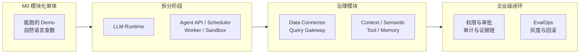
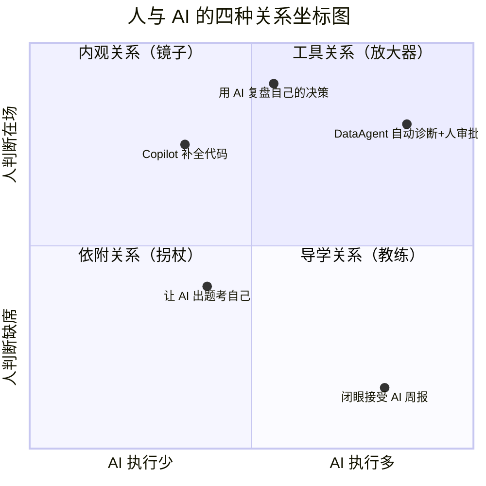
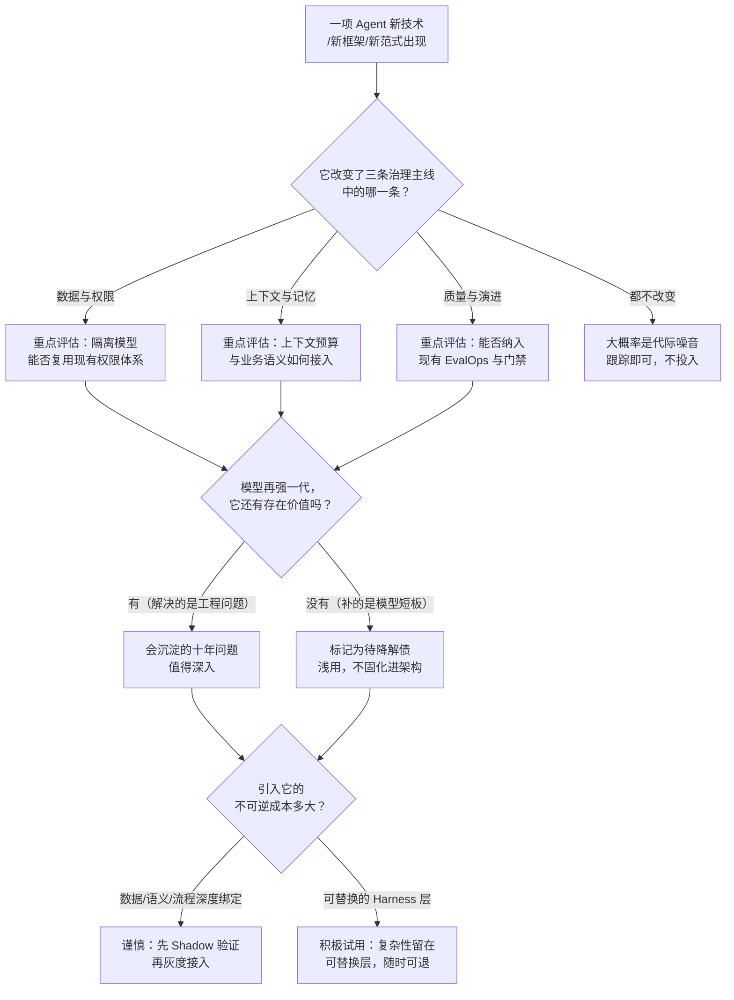
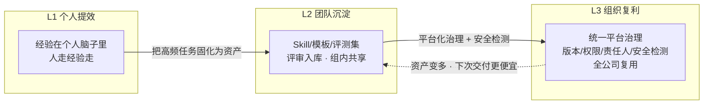

# 第十篇：完结篇——面向未来的 Agent 工程判断

> 本篇目标：通过 DataAgent 的完整复盘为全课程收口，重新理解 Agent 时代人的角色与责任，并建立面向未来一年持续判断技术变化的能力[^gktime]。

## 导语：课程结束了，判断才刚刚开始

学完整套课程，你手里有了一套能跑的企业级 DataAgent：多租户、有审批、有评测、能灰度、可回滚。但工具会过时，框架会更替，模型每三个月换代一次。真正要带走的东西不是某个具体实现，而是三种**可以迁移的判断力**：

1. **架构判断**：面对一个新需求，知道该用 Workflow 还是 Autonomous Loop，该自研还是基于 Harness 搭建；
2. **协作判断**：面对一个任务，知道自己此刻应该和 AI 保持什么关系；
3. **演进判断**：面对一篇新技术文章，能分辨哪些是模型代际更替带来的暂时噪音，哪些是会沉淀十年的工程问题。

本篇就是围绕这三种判断力展开的最后一课。

---

## 10.1 全课程总结：从 Agent Demo 到企业级 Agent 系统

### Demo 与企业级系统之间隔着什么

一个周末能写出来的 Agent Demo 和一个能进生产的企业级系统，功能清单可能 90% 相同——都会理解自然语言、调工具、生成报告。差距全在那 10% 的"非功能性"部分。回顾 DataAgent 从 M0（模块化单体）到最终版本的演进，每一步都在回答一个治理问题：



- **拆 Runtime**：回答"谁来管模型的调用、降级与成本"；
- **拆 API/Scheduler/Worker/Sandbox**：回答"长任务如何可靠执行、危险代码如何隔离运行"；
- **加治理模块**：回答"数据口径、上下文、工具、记忆如何不失控"；
- **建 EvalOps 闭环**：回答"如何证明系统在变好而不是在变坏"。

### 三条治理主线

整个课程看似讲了很多模块，其实只讲了三条主线，它们是判断任何 Agent 系统成熟度的标尺：

| 治理主线 | 核心问题 | DataAgent 中的落点 | 失效时的典型事故 |
|---|---|---|---|
| **数据与权限治理** | Agent 能看到什么、能改什么 | 多租户隔离、行列级权限、只读 Query Gateway、审批流 | 跨租户数据泄漏、越权写操作 |
| **上下文与记忆治理** | Agent 依据什么思考 | Semantic 层指标口径、Context 装配、Memory 写入审核 | 口径错乱、跨租户 Memory 污染 |
| **质量与演进治理** | 如何证明系统在变好 | Eval Contract、Multi-Grader、Regression Gate、Canary 发布 | 优化变退化、同一事故反复发作 |

拿到任何一个 Agent 系统（包括你自己正在做的），先问这三个问题，五分钟内你就能判断它是玩具还是产品。

### 从 Agent Developer 到资深 Agent Developer

初级 Agent 开发者的工作是"让 Agent 能做事"；资深者的工作是"让 Agent 做的事可被信任"。二者的分水岭不在模型技巧，而在**系统责任**：你是否为行为后果、质量证据和演进安全建立了机制。这门课的全部内容，本质上就是一次从"开发者"到"负责人"的身份迁移训练。

---

## 10.2 人与 AI 的四种关系：当 AI 从工具变成执行者

Agent 承担的执行越多，人的角色问题越尖锐。课程提出一张坐标图，用两个维度定位你与 AI 的当前关系：**横轴是"AI 承担执行的程度"，纵轴是"人保留判断的程度"**。



### 四种关系逐一拆解

**1. 工具关系——AI 扩展执行，人保留判断。** 这是健康关系的基线：Agent 多做事（自动跑诊断、生成报告、草拟行动建议），但**目标、标准、验收和最终责任**由人掌握。DataAgent 的审批流就是这个关系的制度化表达——Agent 可以建议调价，但按下"确认"的必须是人。判断你是否处于工具关系的试金石：你能不能清楚说出"这次任务我验收的标准是什么"。

**2. 依附关系——结果在推进，判断者却缺席。** 最危险的关系：任务看起来在进展，但人已经无法解释、无法验证、也无法接管，只是持续地点头接受 AI 的输出。典型信号：AI 给的报告你从来不核对数据来源；AI 写的代码你跑通了就提交；被问"为什么这样设计"时只能回答"AI 这么写的"。依附关系的可怕之处在于**它感觉起来很高效**——直到第一次出事，你才发现自己早已失去判断能力，而责任仍在你头上。

**3. 导学关系——不仅完成任务，还要形成能力。** 同样是让 AI 写代码，工具关系得到的是"能跑的代码"，导学关系得到的是"能跑的代码 + 真正理解它的你"。操作方式：让 AI 先给思路不给答案；让 AI 解释"为什么这么做而不是那样做"；做完后让 AI 出题检验你是否真正理解、能否迁移到新问题。对学习期的工程师，导学关系是默认应该主动选择的关系。

**4. 内观关系——借助 AI 校准自己的判断。** 最高阶也最隐蔽的一种：AI 的价值不是帮你做事，而是**照出你自己看不见的假设、偏好与决策盲区**。例如，让 AI 扮演反对者攻击你的架构方案；把你过去十次技术决策喂给 AI，让它归纳你的系统性偏见；在重大决策前让 AI 列出"如果你错了，最可能是因为什么"。内观关系里，AI 是一面镜子，照的对象是你自己。

### 根据任务主动切换

四种关系**不是四种人，也不是能力等级**——同一个人一天之内应该在四种关系间多次切换：

| 任务情境 | 建议关系 | 切换理由 |
|---|---|---|
| 生产系统紧急排障 | 工具 | 目标明确、时间紧，人的判断必须全程在场 |
| 学习一门新技术 | 导学 | 目的是能力形成，不是任务完成 |
| 重复性高、已验证的流程 | 工具 + 定期抽查 | 防止抽查缺失滑向依附 |
| 重大架构/职业决策 | 内观 | 最大风险是自己的盲区，需要镜子 |
| 任何"连续三次没核对 AI 输出"之后 | 自查：是否已滑入依附 | 依附是默认的熵增方向 |

一句口诀：**工具是默认态，导学是成长态，内观是决策态，依附是事故前兆。**

---

## 10.3 面向未来一年：Agent 会如何发展，工程师面临什么挑战

以下六个方向，每一个都对应一个具体的工程挑战，也对应你在 DataAgent 里已经摸过的某块基石。

**1. 从对话助手走向长时执行者。** Agent 的任务时长从"一次对话"走向"数小时甚至数天"：跨系统、跨时段、带中断恢复。聊天机器人思维设计不出这样的系统——你需要的是 Scheduler、持久化状态、断点续跑、进度可观测。DataAgent 的周期性经营报告与异常监测，就是长时执行者的雏形。**挑战**：长时任务的失败模式（中途状态损坏、目标漂移）远比短任务复杂。

**2. 从生成内容走向操作真实世界。** Agent 拿到的不只是"写报告"的权限，而是创建工单、调预算、写业务系统的权限。副作用、安全、审计的风险呈指数上升。**挑战**：权限分级、Human Approval、行动审计将从"加分项"变成"准入门槛"。

**3. 从单 Agent 走向多 Agent 与后台服务。** 多个专职 Agent 协作（取数的、分析的、写报告的、盯盘的），加上常驻后台主动推进任务的服务型 Agent。**挑战**：Agent 之间的状态交接、任务分解、冲突仲裁、以及"谁在无人值守时看着它们"——本质上又回到了治理问题。

**4. 模型能力与 Harness 持续重构。** 今天为弥补模型短板而精心设计的复杂流程（多轮自检、繁琐的 ReAct 脚手架），可能成为明天模型升级后的负资产。**挑战**：把系统设计成"模型越强、流程越简"的结构——让复杂性留在可替换的 Harness 层，而不是固化在业务逻辑里。每半年问一次自己：这段流程如果删掉，新模型能自己搞定吗？

**5. EvalOps 与行动安全成为基础设施。** 概率性系统无法靠上线前测试和内容审核保证生产质量——这在第九篇已经讲透。未来一年，评测流水线、Regression Gate、灰度发布会像今天的 CI/CD 一样成为标配，而不是少数团队的先进实践。**挑战**：评测能力将从"平台团队的事"变成每个 Agent 工程师的基本功。

**6. Agent 工程师的能力升级。** 只会调 API、拼框架的工程师会被淘汰——那部分工作 AI 自己就干了。护城河迁移到：**业务建模**（把经营问题翻译成 Agent 任务与质量契约）、**Runtime 工程**（调度、隔离、成本）、**治理能力**（权限、上下文、记忆）、**安全与评测**、以及最终的**系统责任**。注意这个清单里没有一个词是"Prompt 技巧"。

---

## 10.4 Agent Harness 架构演进讨论：从 Framework 到 Harness

### 从 Agent Framework 到 Agent Harness：一次范式转移

过去两年，行业的主流叙事是 Agent Framework——LangChain、AutoGen、CrewAI 这类"用代码编排 Agent"的库。而最新的叙事正在变成 **Agent Harness（代理马具/承载层）**：Claude Code 是代表，DeepSeek 等厂商推出的开源 Harness（大纲中提到的 DSH，DeepSeek Harness）是另一类代表。

> 说明：DSH 的具体源码与内部实现细节不在本教程讨论范围，我们把它作为"一类新型开源 Harness"来做架构层面的讨论——关注这类系统普遍的设计取舍，而不是某个仓库的具体代码。

Framework 与 Harness 的区别，可以用一句话概括：

- **Framework 是"你用代码搭 Agent"**：它给你积木（Chain、Tool、Memory 抽象），你写程序把模型围在中间，控制流在你手里。
- **Harness 是"模型住进一个环境里"**：它给模型一个完整的工作环境（文件系统、终端、工具集、上下文窗口管理、权限边界），控制流很大程度交给模型，Harness 负责承载、约束与供给。

| 维度 | Agent Framework | Agent Harness |
|---|---|---|
| 控制流归属 | 开发者编写的编排代码 | 模型自主决策为主，Harness 约束为辅 |
| 核心抽象 | Chain / Graph / Node | 环境 / 工具 / 上下文 / 权限边界 |
| 插件机制 | 代码级扩展（写新 Node） | 声明式扩展（MCP 工具、Skill、Hook） |
| 执行模型 | 预定义图结构，按图执行 | 循环执行：观察→决策→行动→再观察，由模型决定何时停 |
| 上下文管理 | 开发者手动拼装 prompt | Harness 自动做压缩、注入、淘汰、子代理隔离 |
| 权限边界 | 应用层自行实现 | Harness 内建：工具白名单、命令审批、目录隔离 |
| 典型代表 | LangGraph、AutoGen | Claude Code、DeepSeek Harness 等开源 Harness |

### Harness 的普遍设计差异：四个值得深看的取舍

以 Claude Code 和新型开源 Harness 为对照，可以看到同类产品背后的不同架构哲学——这些差异点是评估任何 Harness 时的检查清单：

**1. 插件化：开放协议 vs 内生集成。** Claude Code 选择以 MCP（Model Context Protocol）作为工具与数据源的标准接入协议，Skill、Hook、Subagent 都是声明式配置——生态开放，第三方可无限扩展。而一些开源 Harness 选择更深度的内生集成：把检索、执行、评测直接做进内核，牺牲部分开放性换取整体一致性与性能。**企业选型时的权衡**：开放协议降低接入成本但增加了供应链治理面；内生集成可控性强但绑定更深。

**2. 执行模型：模型自主循环 vs 结构化编排。** Harness 普遍信任模型的自主循环（给它目标和工具，让它自己规划到完成），Framework 普遍信任开发者的显式编排。前者在开放任务上灵活惊人，后者在合规、可审计场景里更稳。**企业级现实答案通常是混合**——DataAgent 的"Workflow 与 Autonomous Analysis Loop 混合编排"就是这个判断的落地：诊断探索走自主循环，审批与写操作走确定性 Workflow。

**3. 上下文管理：这是 Harness 的真正护城河。** 长任务的本质瓶颈不是模型智商，而是上下文窗口的预算管理：哪些历史该压缩、哪些文件该注入、哪些子任务该丢给隔离上下文的子代理、什么时候该主动遗忘。各家 Harness 的核心竞争力差异，拉开看大多在这一层。评估一个 Harness 时，少看演示效果，多问一句：**它的上下文预算是怎么花的？**

**4. 权限边界：从"应用的责任"到"Harness 的内建职责"。** 成熟 Harness 把工具白名单、危险命令审批、工作目录隔离、网络访问控制做进了承载层本身——因为当模型自主决策时，应用层根本来不及拦截每一个动作。这与 DataAgent 的"有副作用工具风险分级 + Human Approval"是同构的，只是 Harness 把它产品化了。

### 通用 Harness 与企业级业务 Agent Runtime 的边界在哪

这是对企业架构师最重要的问题。以 DataAgent 对照通用 Harness：

| 能力 | 通用 Harness 提供 | 企业级 Runtime 必须自建 |
|---|---|---|
| 模型承载、工具接入、上下文管理、基础权限 | ✅ 成熟，直接复用 | — |
| 多租户隔离与组织角色 | ❌（单机/单用户假设） | ✅ 租户、行级权限、凭据隔离 |
| 业务语义层（指标口径、术语、血缘） | ❌ | ✅ Semantic 层是业务正确性的根 |
| 审批流与审计合规 | 部分（命令级审批） | ✅ 业务级审批 + 全链路审计日志 |
| 领域 EvalOps（业务 Fixture、行业 Grader） | 框架级支持 | ✅ 业务评测集与质量契约必须自研 |
| 灰度发布与租户级回滚 | ❌ | ✅ 第九篇的完整受控进化闭环 |

结论：**Harness 替代的是 DataAgent 架构图中的"LLM Runtime + 执行承载"那一层，替代不了治理层。** 未来合理的企业架构很可能是"开源/商用 Harness 作底座 + 自研治理与业务语义层"——Harness 生态每成熟一分，你自研的边界就往上收一分，但数据权限、业务语义、质量契约这三块，在可预见的未来仍然贴着业务、必须自己掌握。

### 课程最终架构讨论：如果今天重新设计 DataAgent

值得留给每个学员的开放问题，参考方向：(1) M0 是否还需要从模块化单体起步，还是可以直接基于成熟 Harness 做"治理优先"的单点切入？(2) 哪些自研模块（Sandbox、Query Gateway、Memory 治理）今天已有开源替代，自研的剩余价值是什么？(3) 如果模型能力提升一倍，DataAgent 里哪些 Workflow 应该退化回 Autonomous Loop？——没有标准答案，能论证自己的取舍，就是这门课的毕业标准。

---

## 10.5 技术判断框架：如何分辨"代际噪音"与"十年问题"

10.3 节列了六个方向，但明年此时一定会有六个新名词冒出来。比预测方向更重要的，是拥有一套**面对任何新技术都能复用的评估框架**。这门课给你的框架只有三问，都来自三条治理主线：



三问的逻辑要单独说透：

**第一问：它改变了三条治理主线中的哪一条？** 一条都不改变的，大概率是模型代际更替带来的暂时噪音——今天的"革命性编排框架"，明天可能被模型自身的规划能力直接吞掉。真正重要的技术，必然落进三条主线之一：要么让权限更可控，要么让上下文更经济，要么让质量更可证。

**第二问：模型再强一代，它还有存在价值吗？** 这是区分"补模型短板"与"解工程问题"的试金石。多轮自检脚手架是为短板而生的，模型变强就该删；多租户隔离、审计、质量契约是为业务与合规而生的，模型再强一百年也替代不了。前者标记为**待降解债**，后者才值得沉淀进架构主干。

**第三问：引入它的不可逆成本多大？** 技术决策的分量不取决于收益，而取决于**退出成本**。绑定越深（数据格式、业务语义、核心流程），越要先过 Shadow 与灰度；越是可替换的 Harness 层，越应该大胆试用——因为试错的代价只是删掉它。

把三问用在日常，就是一张速查表：

| 新技术信号 | 更像噪音 | 更像沉淀 |
|---|---|---|
| 解决的问题来源 | "现在的模型还做不到 X" | "业务/合规/规模化要求 X" |
| 与三条主线的关系 | 都不沾，或只是更炫的 Demo | 直接强化某一条主线 |
| 模型升级后的命运 | 被模型原生能力吞掉 | 价值反而放大（强模型更需要治理） |
| 退出成本 | 深度绑定数据与流程 | 边界清晰、可整体替换 |
| 社区证据 | 只有演示视频 | 有生产事故复盘与规模化案例 |

## 10.6 组织与工程文化：从个人提效到组织智能

最后一块拼图不在技术里。Agent 工程化的终局问题不是"系统怎么建"，而是"**组织怎么长出持续建设这种系统的能力**"。

### 组织智能的三级演进

观察行业里 AI 落地深的组织，几乎都走过同一条三级路径：

| 级别 | 形态 | 核心机制 | 天花板 |
|---|---|---|---|
| L1 个人提效 | 员工各自用 AI 工具，经验存在个人脑子里 | 个人悟性 | 人走经验走；公司层面零复利 |
| L2 团队沉淀 | 团队把高频任务固化为 Skill/模板/评测集，组内共享 | 评审与入库机制 | 跨团队重复造轮子；质量参差 |
| L3 组织复利 | 统一平台治理资产：版本、权限、责任人、安全检测，全公司复用 | 平台工程 + 治理体系 | 需要专门的组织能力投入 |

真实样本：金山办公在内部推行组织级 AI 平台时，6000 多人的公司上线一个月，员工自发上传的 Skill 就达到 5000 个——一线经验以资产形式在组织内流动；配套的基建理念是"三通一平"：通 Token（统一可信低成本的算力供给）、通数据（打通数据与业务系统并配好权限）、通 API（让 AI 结论能转化为真实动作）、统一平台（Skill 一键全公司分享，但传播前过安全检测）[^wpscomate]。注意这个案例里最值得学的不是"5000"这个数字，而是它的治理结构：**供给民主化（人人可建 Skill）+ 治理集中化（版本、权限、责任人、安全检测由平台兜底）**——这和篇07 讲的 Skill 生命周期治理、篇09 讲的评测门禁，是同构的，只是尺度从系统放大到了组织。



三级之间没有自动升级：从 L1 到 L2 靠**资产意识**（有人坚持把一次性劳动写成可复用资产），从 L2 到 L3 靠**平台投入**（有人愿意为治理付工程成本）。两个跨越都需要自上而下的选择，这正是"工程文化"的含义。

### 支撑组织复利的四个工程文化习惯

平台可以采购，文化只能自己长。四个对 Agent 工程化最关键的文化习惯：

1. **资产意识**：每完成一次任务，多问一句"这次的什么部分下次还能用"——是 Prompt 模式、评测 Case、数据口径映射，还是一条排障经验？没有资产意识，团队永远在用 100% 的成本做第 N 次同样的事。
2. **证据文化**：评审时不接受"我感觉变好了"，只接受评测证据与版本元组；复盘时不接受"下次注意"，只接受沉淀进 Regression Set 的 Case。第九篇的 EvalOps 能在组织里存活，靠的就是这个文化底座。
3. **复盘不追责**：Agent 系统的失败是概率性系统的常态，追责文化只会逼团队藏起 badcase——而藏起来的 badcase 永远不会变成评测集里的资产。复盘的目标是"系统如何不再犯"，不是"谁犯的"。
4. **责任不下放**：AI 可以承担执行，但责任永远由人承担。把这条写进工程实践：每个自动化流程有明确的 human owner，每次发布有人签字，每份 AI 产出的对外交付物有人验收。文化上一旦接受"这是 AI 干的"，组织就开始了向依附关系的整体滑落。

一句话收口：**个人用 AI 是工具问题，团队用 AI 是资产问题，组织用 AI 是治理问题。** 这门课教的是系统，但系统的上限由组织的治理成熟度决定。

---

## 代码骨架：任务-关系路由器

把"四种关系主动切换"做成一个可执行的自查工具——每次开始一项 AI 协作任务前，先路由一次：

```python
# 人机关系路由器骨架：开始任务前先路由，结束后再自查
from dataclasses import dataclass
from enum import Enum

class Relation(Enum):
    TOOL = "工具关系"      # AI 扩展执行，人保留判断
    DEPENDENCY = "依附关系"  # 判断者缺席（要避免的状态）
    TUTOR = "导学关系"      # 完成任务 + 形成能力
    MIRROR = "内观关系"     # 用 AI 校准自己的判断

@dataclass
class Task:
    goal: str
    is_learning_goal: bool      # 目的是否为能力形成
    is_high_stakes: bool        # 是否为重大决策
    is_repetitive: bool         # 是否为已验证的重复流程
    unchecked_streak: int = 0   # 连续未核对 AI 输出的次数

def route(t: Task) -> Relation:
    if t.unchecked_streak >= 3:          # 依附是熵增默认方向，先报警
        return Relation.DEPENDENCY
    if t.is_learning_goal:
        return Relation.TUTOR            # 导学是成长态
    if t.is_high_stakes:
        return Relation.MIRROR           # 决策态：先照盲区
    return Relation.TOOL                 # 默认态：AI 执行 + 人验收

CHECKLISTS = {
    Relation.TOOL:       ["写下本次验收标准", "关键输出必须核对来源"],
    Relation.DEPENDENCY: ["停下：解释 AI 上一步为什么这么做",
                          "抽查最近三次输出的数据/代码来源"],
    Relation.TUTOR:      ["先要思路再要答案", "做完让 AI 出题考你迁移"],
    Relation.MIRROR:     ["让 AI 扮演反对者", "列出'如果我错了最可能的原因'"],
}

def begin_task(t: Task) -> None:
    r = route(t)
    print(f"[{r.value}] 本次任务前的自查清单：")
    for item in CHECKLISTS[r]:
        print(f"  - {item}")
```

## 常见误区

1. **把四种关系当成能力等级**："内观最高级"是误读——生产排障时内观就是失职，关系的选择由任务决定，不由虚荣决定。
2. **把依附误认为高效**：不看来源就采纳输出，短期省时，长期同时失去判断力和免责能力——责任永远在人。
3. **学新技术只追求"跑通"**：代码能跑 ≠ 你理解了。没有迁移能力的学习，在下一次模型换代时清零。
4. **把今天的模型短板固化成永恒架构**：为短板设计的复杂流程要标记为"待降解债"，定期评审是否可删。
5. **认为 Harness 会吃掉一切**：Harness 吃掉的是承载层，吃不掉数据权限、业务语义和质量契约——选型的本质是划清这条边界。
6. **追逐每个新框架**：判断新技术时先问它改变了三条治理主线中的哪一条；都不改变的，大概率是噪音。
7. **把组织智能当成采购问题**：买来平台不等于买来复利——没有资产意识、证据文化、复盘不追责、责任不下放这四个习惯，5000 个 Skill 只会变成 5000 个无人维护的隐患。

## 本篇实战：把判断力练成肌肉

### 第 1 步：治理主线体检（架构判断）

- **目标**：用三条治理主线在十分钟内评估任意 Agent 系统。
- **操作**：找一个你正在做或用过的 Agent 系统，按三条治理主线逐条打分（0-2 分），写下得分最低项的改进方案，改进方案必须落到具体机制（不是"加强管理"）。
- **验收标准**：每个分数能举出系统中对应的证据（有/无某个机制）；改进方案能指到篇03–篇09 中的具体一篇作为参考。

### 第 2 步：关系自查日志（协作判断）

- **目标**：建立对"滑入依附"的身体感知。
- **操作**：记录自己三天内与 AI 的协作，每次标注属于哪种关系；找出至少一次"无意识滑入依附"的实例，用代码骨架中的路由器复盘当时该怎么路由，写下纠正动作。
- **验收标准**：日志覆盖 ≥6 次协作且关系类型 ≥2 种；依附实例有具体的纠正动作（核对来源/解释上一步/重跑验证），不是"以后注意"。

### 第 3 步：新技术三问评估（演进判断）

- **目标**：把 10.5 节的判断框架用到真实的新技术上。
- **操作**：选一项最近三个月出现的 Agent 新技术（框架、协议或范式），用三问框架写一页评估：它改变哪条治理主线？模型再强一代它还在吗？退出成本多大？最后给出"深入/跟踪/忽略"的结论。
- **验收标准**：三问各有论据（不接受"感觉很火"）；结论与论据自洽——如果结论说"深入"，必须同时写出接入的灰度路径。

### 第 4 步：Harness 评估报告（架构判断进阶）

- **目标**：划清"复用 Harness"与"必须自研"的边界。
- **操作**：选一个开源 Agent Harness，按"插件化/执行模型/上下文管理/权限边界"四个维度写一页评估，并回答"它能否承载 DataAgent，缺什么"；缺的每一项对照 10.4 节的边界表归类。
- **验收标准**：缺失项全部落入"数据权限/业务语义/质量契约"三类之一，或能论证存在第四类；报告含明确的"复用什么、自建什么"清单。

### 第 5 步：重设计论证 + 组织观察（综合）

- **目标**：完成这门课的"毕业答辩"。
- **操作**：(a) 写一页"如果今天重新设计 DataAgent"，给出三个你会改变的决定及理由——每条理由必须落到治理主线或成本收益上，不接受"因为新框架更流行"；(b) 观察你自己所在的团队/组织处于 L1–L3 的哪一级，写一条推向下一级的最小可行动作。
- **验收标准**：三个改变决定中至少一个与"模型变强后哪些该删"有关；组织动作具体到"谁、在什么会上、提什么机制"。

### AI Coding 实操模式

① **可复制提示词模板**（把第 3 步的三问评估委托给 AI 做"反对者"）：

```text
你是挑剔的企业架构评审委员。我正在评估一项 Agent 新技术：<名称与简介>。
请不要赞美它，只做三件事：
1. 攻击我的判断：我认为它改变了「<某条治理主线>」，请列出这个判断
   可能错误的三个理由；
2. 代际测试：假设 12 个月后模型规划/记忆/工具能力翻倍，这项技术的
   哪些价值会消失？哪些会留存？
3. 退出成本审计：如果我们全面采用它，一年后想换掉，迁移成本最高的
   三个绑定点是什么？
最后请给出你的结论：深入 / 跟踪 / 忽略，并说明我必须在什么时间点
复查这个结论。
```

② **AI 初版人工评审清单**：

- [ ] AI 的评估是否被该技术的营销话术带偏（把宣传词当成了证据）？
- [ ] "代际测试"是否区分了"补模型短板"与"解工程问题"两类价值？
- [ ] 退出成本是否包含数据与语义绑定（AI 通常只算代码迁移成本）？
- [ ] 结论是否附了可复查的时间点或触发条件，而非一次性断言？

③ **验收标准**：评估报告通过评审清单全部条目；三问框架的每一问都有至少一条来自你自己系统语境的论据（不是泛泛而谈）。

## 自测清单

- [ ] 我能用三条治理主线在十分钟内评估任何 Agent 系统的成熟度
- [ ] 我能解释四种人机关系的区别，并说出当前任务应该用哪一种、为什么
- [ ] 我能识别自己滑入依附关系的早期信号，并有纠正动作
- [ ] 我能说清 Framework 与 Harness 在控制流、执行模型、上下文管理上的根本差异
- [ ] 我能画出通用 Harness 与企业级业务 Runtime 的能力边界，并论证哪三层必须自研
- [ ] 面对一项 Agent 新技术，我能用三问框架判断它是模型代际噪音还是会沉淀的工程问题
- [ ] 我能说出组织智能 L1–L3 三级形态的差异，以及支撑复利的四个工程文化习惯
- [ ] 我能列出 Agent 工程师未来一年的能力升级清单，并知道自己先补哪一项

---

**结语**：这门课教的是一个 DataAgent，训练的是一种身份——从"让 Agent 做事的人"变成"为 Agent 行为负责的人"。模型会换代，Harness 会演进，但权限、语义、质量这三条治理主线，以及人对最终责任的承担，是这个时代不会贬值的资产。课程到此结束，你的工程判断才刚刚开始。

## 参考与脚注

[^gktime]: 极客时间《企业级 Agent 工程化》课程（完结篇：工程判断与 Harness 演进讨论）——本篇的三种判断力、三条治理主线复盘与 Framework→Harness 讨论在该课程大纲基础上扩展改写。
[^wpscomate]: 珠海网《金山办公将在7月中旬发布WPS Comate，直击企业AI"落地难"》，2026-07-05——6000 余员工上线一个月自发上传 Skill 达 5000 个，"三通一平"（通 Token、通数据、通 API、统一平台）组织级 AI 基建理念，https://pub-zhtb.hizh.cn/a/202607/05/AP6a4a6250e4b082bf2149917e.html 。
